R Notebook
================

  - [Dada2](#dada2)
      - [chargement des librairies](#chargement-des-librairies)
      - [acquisition des données](#acquisition-des-données)
      - [création d’une variable contenant les
        données](#création-dune-variable-contenant-les-données)
      - [filtration et éliminations des sequences basse
        qualité](#filtration-et-éliminations-des-sequences-basse-qualité)
  - [Learn the Error Rates](#learn-the-error-rates)
  - [Merge paired reads](#merge-paired-reads)
  - [Construct sequence table](#construct-sequence-table)
  - [Remove chimeras](#remove-chimeras)
  - [Track reads through the
    pipeline](#track-reads-through-the-pipeline)
  - [Assign taxonomy](#assign-taxonomy)
  - [Taxonomic Filtering](#taxonomic-filtering)
  - [création de l’arbre phyloseq](#création-de-larbre-phyloseq)
      - [Visualisation de l’alpha
        diversité](#visualisation-de-lalpha-diversité)
      - [Filtrage de la taxonomie](#filtrage-de-la-taxonomie)
  - [Prevalence Filtering](#prevalence-filtering)
  - [Agglomerate taxa](#agglomerate-taxa)
  - [Different Ordination
    Projections](#different-ordination-projections)

# Dada2

## chargement des librairies

``` r
library(dada2)
```

    ## Loading required package: Rcpp

    ## Warning: multiple methods tables found for 'which'

``` r
library(phyloseq)
library(ggplot2)
library(dplyr)
```

    ## 
    ## Attaching package: 'dplyr'

    ## The following objects are masked from 'package:stats':
    ## 
    ##     filter, lag

    ## The following objects are masked from 'package:base':
    ## 
    ##     intersect, setdiff, setequal, union

``` r
library(reshape2)
library(ade4)
library(ggrepel)
library(lattice)
library(caret)
library(igraph)
```

    ## 
    ## Attaching package: 'igraph'

    ## The following objects are masked from 'package:dplyr':
    ## 
    ##     as_data_frame, groups, union

    ## The following objects are masked from 'package:stats':
    ## 
    ##     decompose, spectrum

    ## The following object is masked from 'package:base':
    ## 
    ##     union

``` r
library(ggnetwork)
theme_set(theme_bw())
```

## acquisition des données

``` bash
wget https://pagesperso.univ-brest.fr/~maignien/teaching/M1-MFA/UE-Ecogenomique2/EcoG2_data_cc2.tar.gz
tar xvzf EcoG2_data_cc2.tar.gz
```

    ## --2020-12-19 22:20:16--  https://pagesperso.univ-brest.fr/~maignien/teaching/M1-MFA/UE-Ecogenomique2/EcoG2_data_cc2.tar.gz
    ## Resolving pagesperso.univ-brest.fr (pagesperso.univ-brest.fr)... 195.83.247.112
    ## Connecting to pagesperso.univ-brest.fr (pagesperso.univ-brest.fr)|195.83.247.112|:443... connected.
    ## HTTP request sent, awaiting response... 200 OK
    ## Length: 333839543 (318M) [application/x-gzip]
    ## Saving to: ‘EcoG2_data_cc2.tar.gz.6’
    ## 
    ##      0K .......... .......... .......... .......... ..........  0% 1.23M 4m18s
    ##     50K .......... .......... .......... .......... ..........  0% 1.26M 4m16s
    ##    100K .......... .......... .......... .......... ..........  0% 2.43M 3m34s
    ##    150K .......... .......... .......... .......... ..........  0% 1.27M 3m43s
    ##    200K .......... .......... .......... .......... ..........  0% 2.39M 3m25s
    ##    250K .......... .......... .......... .......... ..........  0% 1.26M 3m33s
    ##    300K .......... .......... .......... .......... ..........  0% 1.68M 3m30s
    ##    350K .......... .......... .......... .......... ..........  0% 4.35M 3m12s
    ##    400K .......... .......... .......... .......... ..........  0% 1.24M 3m20s
    ##    450K .......... .......... .......... .......... ..........  0% 2.48M 3m12s
    ##    500K .......... .......... .......... .......... ..........  0% 2.50M 3m6s
    ##    550K .......... .......... .......... .......... ..........  0% 1.83M 3m5s
    ##    600K .......... .......... .......... .......... ..........  0% 1.51M 3m7s
    ##    650K .......... .......... .......... .......... ..........  0% 2.47M 3m3s
    ##    700K .......... .......... .......... .......... ..........  0% 2.41M 3m0s
    ##    750K .......... .......... .......... .......... ..........  0% 1.92M 2m59s
    ##    800K .......... .......... .......... .......... ..........  0% 1.44M 3m1s
    ##    850K .......... .......... .......... .......... ..........  0% 1.31M 3m5s
    ##    900K .......... .......... .......... .......... ..........  0% 2.29M 3m2s
    ##    950K .......... .......... .......... .......... ..........  0% 1.23M 3m6s
    ##   1000K .......... .......... .......... .......... ..........  0% 2.42M 3m3s
    ##   1050K .......... .......... .......... .......... ..........  0% 2.26M 3m1s
    ##   1100K .......... .......... .......... .......... ..........  0% 1.29M 3m4s
    ##   1150K .......... .......... .......... .......... ..........  0% 1.25M 3m7s
    ##   1200K .......... .......... .......... .......... ..........  0% 1.25M 3m10s
    ##   1250K .......... .......... .......... .......... ..........  0% 2.48M 3m7s
    ##   1300K .......... .......... .......... .......... ..........  0% 2.49M 3m5s
    ##   1350K .......... .......... .......... .......... ..........  0% 1.27M 3m7s
    ##   1400K .......... .......... .......... .......... ..........  0% 2.42M 3m5s
    ##   1450K .......... .......... .......... .......... ..........  0% 2.43M 3m3s
    ##   1500K .......... .......... .......... .......... ..........  0% 1.22M 3m6s
    ##   1550K .......... .......... .......... .......... ..........  0% 2.44M 3m4s
    ##   1600K .......... .......... .......... .......... ..........  0% 2.33M 3m3s
    ##   1650K .......... .......... .......... .......... ..........  0% 1.27M 3m5s
    ##   1700K .......... .......... .......... .......... ..........  0% 2.49M 3m3s
    ##   1750K .......... .......... .......... .......... ..........  0% 2.46M 3m1s
    ##   1800K .......... .......... .......... .......... ..........  0% 2.46M 3m0s
    ##   1850K .......... .......... .......... .......... ..........  0% 2.47M 2m59s
    ##   1900K .......... .......... .......... .......... ..........  0% 2.50M 2m57s
    ##   1950K .......... .......... .......... .......... ..........  0% 2.36M 2m56s
    ##   2000K .......... .......... .......... .......... ..........  0% 2.30M 2m55s
    ##   2050K .......... .......... .......... .......... ..........  0% 1.24M 2m57s
    ##   2100K .......... .......... .......... .......... ..........  0% 1.24M 2m59s
    ##   2150K .......... .......... .......... .......... ..........  0% 1.24M 3m0s
    ##   2200K .......... .......... .......... .......... ..........  0% 1.23M 3m2s
    ##   2250K .......... .......... .......... .......... ..........  0% 1.24M 3m4s
    ##   2300K .......... .......... .......... .......... ..........  0% 1.25M 3m5s
    ##   2350K .......... .......... .......... .......... ..........  0% 1.25M 3m7s
    ##   2400K .......... .......... .......... .......... ..........  0% 1.23M 3m8s
    ##   2450K .......... .......... .......... .......... ..........  0% 1.45M 3m9s
    ##   2500K .......... .......... .......... .......... ..........  0% 1.91M 3m8s
    ##   2550K .......... .......... .......... .......... ..........  0% 1.46M 3m9s
    ##   2600K .......... .......... .......... .......... ..........  0% 1.88M 3m8s
    ##   2650K .......... .......... .......... .......... ..........  0% 1.47M 3m9s
    ##   2700K .......... .......... .......... .......... ..........  0% 1.88M 3m8s
    ##   2750K .......... .......... .......... .......... ..........  0% 1.24M 3m9s
    ##   2800K .......... .......... .......... .......... ..........  0%  957K 3m12s
    ##   2850K .......... .......... .......... .......... ..........  0% 1.81M 3m12s
    ##   2900K .......... .......... .......... .......... ..........  0% 1.23M 3m13s
    ##   2950K .......... .......... .......... .......... ..........  0% 1.54M 3m13s
    ##   3000K .......... .......... .......... .......... ..........  0% 1.78M 3m13s
    ##   3050K .......... .......... .......... .......... ..........  0% 1.51M 3m13s
    ##   3100K .......... .......... .......... .......... ..........  0% 1.78M 3m13s
    ##   3150K .......... .......... .......... .......... ..........  0% 1.52M 3m13s
    ##   3200K .......... .......... .......... .......... ..........  0% 1.23M 3m14s
    ##   3250K .......... .......... .......... .......... ..........  1% 2.45M 3m13s
    ##   3300K .......... .......... .......... .......... ..........  1% 1.82M 3m12s
    ##   3350K .......... .......... .......... .......... ..........  1% 2.48M 3m11s
    ##   3400K .......... .......... .......... .......... ..........  1% 1.47M 3m12s
    ##   3450K .......... .......... .......... .......... ..........  1% 2.50M 3m11s
    ##   3500K .......... .......... .......... .......... ..........  1% 1.85M 3m10s
    ##   3550K .......... .......... .......... .......... ..........  1% 2.47M 3m9s
    ##   3600K .......... .......... .......... .......... ..........  1% 1.24M 3m10s
    ##   3650K .......... .......... .......... .......... ..........  1% 2.39M 3m9s
    ##   3700K .......... .......... .......... .......... ..........  1% 1.24M 3m10s
    ##   3750K .......... .......... .......... .......... ..........  1% 1.70M 3m10s
    ##   3800K .......... .......... .......... .......... ..........  1% 1.59M 3m10s
    ##   3850K .......... .......... .......... .......... ..........  1% 2.49M 3m9s
    ##   3900K .......... .......... .......... .......... ..........  1% 1.58M 3m10s
    ##   3950K .......... .......... .......... .......... ..........  1% 1.76M 3m9s
    ##   4000K .......... .......... .......... .......... ..........  1% 1.58M 3m9s
    ##   4050K .......... .......... .......... .......... ..........  1% 1.69M 3m9s
    ##   4100K .......... .......... .......... .......... ..........  1% 1.92M 3m9s
    ##   4150K .......... .......... .......... .......... ..........  1% 2.01M 3m9s
    ##   4200K .......... .......... .......... .......... ..........  1% 2.47M 3m8s
    ##   4250K .......... .......... .......... .......... ..........  1% 1.64M 3m8s
    ##   4300K .......... .......... .......... .......... ..........  1% 2.45M 3m7s
    ##   4350K .......... .......... .......... .......... ..........  1% 2.52M 3m6s
    ##   4400K .......... .......... .......... .......... ..........  1% 1.70M 3m6s
    ##   4450K .......... .......... .......... .......... ..........  1% 1.62M 3m6s
    ##   4500K .......... .......... .......... .......... ..........  1% 2.50M 3m6s
    ##   4550K .......... .......... .......... .......... ..........  1% 2.43M 3m5s
    ##   4600K .......... .......... .......... .......... ..........  1% 2.44M 3m4s
    ##   4650K .......... .......... .......... .......... ..........  1% 1.73M 3m4s
    ##   4700K .......... .......... .......... .......... ..........  1% 2.39M 3m4s
    ##   4750K .......... .......... .......... .......... ..........  1% 1.24M 3m5s
    ##   4800K .......... .......... .......... .......... ..........  1% 1.25M 3m5s
    ##   4850K .......... .......... .......... .......... ..........  1% 2.42M 3m5s
    ##   4900K .......... .......... .......... .......... ..........  1% 1.65M 3m5s
    ##   4950K .......... .......... .......... .......... ..........  1% 1.66M 3m5s
    ##   5000K .......... .......... .......... .......... ..........  1% 2.42M 3m4s
    ##   5050K .......... .......... .......... .......... ..........  1% 1.23M 3m5s
    ##   5100K .......... .......... .......... .......... ..........  1% 2.42M 3m4s
    ##   5150K .......... .......... .......... .......... ..........  1% 1.76M 3m4s
    ##   5200K .......... .......... .......... .......... ..........  1% 1.50M 3m4s
    ##   5250K .......... .......... .......... .......... ..........  1% 1.22M 3m5s
    ##   5300K .......... .......... .......... .......... ..........  1%  827K 3m7s
    ##   5350K .......... .......... .......... .......... ..........  1% 1.20M 3m7s
    ##   5400K .......... .......... .......... .......... ..........  1% 1.22M 3m8s
    ##   5450K .......... .......... .......... .......... ..........  1%  826K 3m10s
    ##   5500K .......... .......... .......... .......... ..........  1% 1.23M 3m10s
    ##   5550K .......... .......... .......... .......... ..........  1% 1.23M 3m11s
    ##   5600K .......... .......... .......... .......... ..........  1%  642K 3m14s
    ##   5650K .......... .......... .......... .......... ..........  1%  858K 3m15s
    ##   5700K .......... .......... .......... .......... ..........  1% 1.24M 3m16s
    ##   5750K .......... .......... .......... .......... ..........  1%  861K 3m17s
    ##   5800K .......... .......... .......... .......... ..........  1% 1.23M 3m18s
    ##   5850K .......... .......... .......... .......... ..........  1% 1.26M 3m18s
    ##   5900K .......... .......... .......... .......... ..........  1% 1.25M 3m18s
    ##   5950K .......... .......... .......... .......... ..........  1% 2.46M 3m18s
    ##   6000K .......... .......... .......... .......... ..........  1%  848K 3m19s
    ##   6050K .......... .......... .......... .......... ..........  1% 2.40M 3m19s
    ##   6100K .......... .......... .......... .......... ..........  1% 1.25M 3m19s
    ##   6150K .......... .......... .......... .......... ..........  1% 1.24M 3m19s
    ##   6200K .......... .......... .......... .......... ..........  1% 2.44M 3m19s
    ##   6250K .......... .......... .......... .......... ..........  1% 1.26M 3m19s
    ##   6300K .......... .......... .......... .......... ..........  1% 2.36M 3m19s
    ##   6350K .......... .......... .......... .......... ..........  1% 1.23M 3m19s
    ##   6400K .......... .......... .......... .......... ..........  1% 1.25M 3m19s
    ##   6450K .......... .......... .......... .......... ..........  1% 2.40M 3m19s
    ##   6500K .......... .......... .......... .......... ..........  2% 2.47M 3m18s
    ##   6550K .......... .......... .......... .......... ..........  2% 1.27M 3m19s
    ##   6600K .......... .......... .......... .......... ..........  2% 2.43M 3m18s
    ##   6650K .......... .......... .......... .......... ..........  2% 2.44M 3m17s
    ##   6700K .......... .......... .......... .......... ..........  2% 1.26M 3m18s
    ##   6750K .......... .......... .......... .......... ..........  2% 2.47M 3m17s
    ##   6800K .......... .......... .......... .......... ..........  2% 2.41M 3m17s
    ##   6850K .......... .......... .......... .......... ..........  2% 2.32M 3m16s
    ##   6900K .......... .......... .......... .......... ..........  2% 2.15M 3m16s
    ##   6950K .......... .......... .......... .......... ..........  2% 1.39M 3m16s
    ##   7000K .......... .......... .......... .......... ..........  2% 2.35M 3m15s
    ##   7050K .......... .......... .......... .......... ..........  2% 2.46M 3m15s
    ##   7100K .......... .......... .......... .......... ..........  2% 2.46M 3m14s
    ##   7150K .......... .......... .......... .......... ..........  2% 2.45M 3m14s
    ##   7200K .......... .......... .......... .......... ..........  2% 2.32M 3m14s
    ##   7250K .......... .......... .......... .......... ..........  2% 1.24M 3m14s
    ##   7300K .......... .......... .......... .......... ..........  2% 2.48M 3m13s
    ##   7350K .......... .......... .......... .......... ..........  2% 1.37M 3m14s
    ##   7400K .......... .......... .......... .......... ..........  2% 2.06M 3m13s
    ##   7450K .......... .......... .......... .......... ..........  2% 2.45M 3m13s
    ##   7500K .......... .......... .......... .......... ..........  2% 2.48M 3m12s
    ##   7550K .......... .......... .......... .......... ..........  2% 1.42M 3m12s
    ##   7600K .......... .......... .......... .......... ..........  2% 1.98M 3m12s
    ##   7650K .......... .......... .......... .......... ..........  2% 1.42M 3m12s
    ##   7700K .......... .......... .......... .......... ..........  2% 1.27M 3m13s
    ##   7750K .......... .......... .......... .......... ..........  2% 1.99M 3m12s
    ##   7800K .......... .......... .......... .......... ..........  2% 1.44M 3m13s
    ##   7850K .......... .......... .......... .......... ..........  2% 1.25M 3m13s
    ##   7900K .......... .......... .......... .......... ..........  2% 1.95M 3m13s
    ##   7950K .......... .......... .......... .......... ..........  2% 1.43M 3m13s
    ##   8000K .......... .......... .......... .......... ..........  2% 1.25M 3m13s
    ##   8050K .......... .......... .......... .......... ..........  2% 2.04M 3m13s
    ##   8100K .......... .......... .......... .......... ..........  2% 1.41M 3m13s
    ##   8150K .......... .......... .......... .......... ..........  2% 2.49M 3m12s
    ##   8200K .......... .......... .......... .......... ..........  2% 2.06M 3m12s
    ##   8250K .......... .......... .......... .......... ..........  2% 2.48M 3m12s
    ##   8300K .......... .......... .......... .......... ..........  2% 1.41M 3m12s
    ##   8350K .......... .......... .......... .......... ..........  2% 2.38M 3m11s
    ##   8400K .......... .......... .......... .......... ..........  2% 1.26M 3m12s
    ##   8450K .......... .......... .......... .......... ..........  2% 2.50M 3m11s
    ##   8500K .......... .......... .......... .......... ..........  2% 2.36M 3m11s
    ##   8550K .......... .......... .......... .......... ..........  2% 2.24M 3m11s
    ##   8600K .......... .......... .......... .......... ..........  2% 1.34M 3m11s
    ##   8650K .......... .......... .......... .......... ..........  2% 2.18M 3m11s
    ##   8700K .......... .......... .......... .......... ..........  2% 1.33M 3m11s
    ##   8750K .......... .......... .......... .......... ..........  2% 2.23M 3m10s
    ##   8800K .......... .......... .......... .......... ..........  2% 1.27M 3m11s
    ##   8850K .......... .......... .......... .......... ..........  2% 1.26M 3m11s
    ##   8900K .......... .......... .......... .......... ..........  2% 1.12M 3m11s
    ##   8950K .......... .......... .......... .......... ..........  2% 1.46M 3m12s
    ##   9000K .......... .......... .......... .......... ..........  2% 1.87M 3m11s
    ##   9050K .......... .......... .......... .......... ..........  2% 1.46M 3m11s
    ##   9100K .......... .......... .......... .......... ..........  2% 1.91M 3m11s
    ##   9150K .......... .......... .......... .......... ..........  2% 1.22M 3m12s
    ##   9200K .......... .......... .......... .......... ..........  2%  957K 3m12s
    ##   9250K .......... .......... .......... .......... ..........  2% 1.25M 3m13s
    ##   9300K .......... .......... .......... .......... ..........  2% 1.24M 3m13s
    ##   9350K .......... .......... .......... .......... ..........  2% 1.23M 3m13s
    ##   9400K .......... .......... .......... .......... ..........  2% 1.95M 3m13s
    ##   9450K .......... .......... .......... .......... ..........  2% 1.42M 3m13s
    ##   9500K .......... .......... .......... .......... ..........  2% 1.24M 3m13s
    ##   9550K .......... .......... .......... .......... ..........  2% 2.08M 3m13s
    ##   9600K .......... .......... .......... .......... ..........  2% 1.26M 3m13s
    ##   9650K .......... .......... .......... .......... ..........  2% 1.35M 3m13s
    ##   9700K .......... .......... .......... .......... ..........  2% 2.43M 3m13s
    ##   9750K .......... .......... .......... .......... ..........  3% 1.25M 3m13s
    ##   9800K .......... .......... .......... .......... ..........  3% 2.44M 3m13s
    ##   9850K .......... .......... .......... .......... ..........  3% 2.36M 3m13s
    ##   9900K .......... .......... .......... .......... ..........  3% 2.43M 3m12s
    ##   9950K .......... .......... .......... .......... ..........  3% 1.27M 3m12s
    ##  10000K .......... .......... .......... .......... ..........  3% 2.38M 3m12s
    ##  10050K .......... .......... .......... .......... ..........  3% 2.49M 3m12s
    ##  10100K .......... .......... .......... .......... ..........  3% 1.28M 3m12s
    ##  10150K .......... .......... .......... .......... ..........  3% 2.48M 3m12s
    ##  10200K .......... .......... .......... .......... ..........  3% 2.40M 3m11s
    ##  10250K .......... .......... .......... .......... ..........  3% 2.48M 3m11s
    ##  10300K .......... .......... .......... .......... ..........  3% 2.46M 3m10s
    ##  10350K .......... .......... .......... .......... ..........  3% 2.45M 3m10s
    ##  10400K .......... .......... .......... .......... ..........  3% 1.25M 3m10s
    ##  10450K .......... .......... .......... .......... ..........  3% 2.46M 3m10s
    ##  10500K .......... .......... .......... .......... ..........  3% 2.37M 3m10s
    ##  10550K .......... .......... .......... .......... ..........  3% 1.23M 3m10s
    ##  10600K .......... .......... .......... .......... ..........  3% 2.44M 3m10s
    ##  10650K .......... .......... .......... .......... ..........  3% 2.44M 3m9s
    ##  10700K .......... .......... .......... .......... ..........  3% 1.27M 3m10s
    ##  10750K .......... .......... .......... .......... ..........  3% 2.43M 3m9s
    ##  10800K .......... .......... .......... .......... ..........  3% 1.23M 3m9s
    ##  10850K .......... .......... .......... .......... ..........  3% 2.41M 3m9s
    ##  10900K .......... .......... .......... .......... ..........  3% 2.46M 3m9s
    ##  10950K .......... .......... .......... .......... ..........  3% 1.25M 3m9s
    ##  11000K .......... .......... .......... .......... ..........  3% 2.48M 3m9s
    ##  11050K .......... .......... .......... .......... ..........  3% 2.48M 3m8s
    ##  11100K .......... .......... .......... .......... ..........  3% 2.39M 3m8s
    ##  11150K .......... .......... .......... .......... ..........  3% 2.45M 3m8s
    ##  11200K .......... .......... .......... .......... ..........  3% 1.22M 3m8s
    ##  11250K .......... .......... .......... .......... ..........  3% 2.44M 3m8s
    ##  11300K .......... .......... .......... .......... ..........  3% 2.49M 3m7s
    ##  11350K .......... .......... .......... .......... ..........  3% 2.49M 3m7s
    ##  11400K .......... .......... .......... .......... ..........  3% 2.46M 3m7s
    ##  11450K .......... .......... .......... .......... ..........  3% 2.52M 3m7s
    ##  11500K .......... .......... .......... .......... ..........  3% 2.41M 3m6s
    ##  11550K .......... .......... .......... .......... ..........  3% 1.26M 3m6s
    ##  11600K .......... .......... .......... .......... ..........  3% 2.40M 3m6s
    ##  11650K .......... .......... .......... .......... ..........  3% 2.42M 3m6s
    ##  11700K .......... .......... .......... .......... ..........  3% 2.45M 3m6s
    ##  11750K .......... .......... .......... .......... ..........  3% 1.26M 3m6s
    ##  11800K .......... .......... .......... .......... ..........  3% 2.35M 3m6s
    ##  11850K .......... .......... .......... .......... ..........  3% 1.28M 3m6s
    ##  11900K .......... .......... .......... .......... ..........  3% 2.40M 3m5s
    ##  11950K .......... .......... .......... .......... ..........  3% 1.28M 3m6s
    ##  12000K .......... .......... .......... .......... ..........  3% 2.28M 3m5s
    ##  12050K .......... .......... .......... .......... ..........  3% 1.31M 3m6s
    ##  12100K .......... .......... .......... .......... ..........  3% 2.25M 3m5s
    ##  12150K .......... .......... .......... .......... ..........  3% 2.46M 3m5s
    ##  12200K .......... .......... .......... .......... ..........  3% 2.41M 3m5s
    ##  12250K .......... .......... .......... .......... ..........  3% 1.23M 3m5s
    ##  12300K .......... .......... .......... .......... ..........  3% 1.38M 3m5s
    ##  12350K .......... .......... .......... .......... ..........  3% 1.99M 3m5s
    ##  12400K .......... .......... .......... .......... ..........  3% 1.24M 3m5s
    ##  12450K .......... .......... .......... .......... ..........  3% 1.41M 3m5s
    ##  12500K .......... .......... .......... .......... ..........  3% 2.53M 3m5s
    ##  12550K .......... .......... .......... .......... ..........  3% 2.02M 3m5s
    ##  12600K .......... .......... .......... .......... ..........  3% 2.48M 3m5s
    ##  12650K .......... .......... .......... .......... ..........  3% 1.39M 3m5s
    ##  12700K .......... .......... .......... .......... ..........  3% 2.48M 3m4s
    ##  12750K .......... .......... .......... .......... ..........  3% 2.08M 3m4s
    ##  12800K .......... .......... .......... .......... ..........  3% 1.39M 3m4s
    ##  12850K .......... .......... .......... .......... ..........  3% 2.42M 3m4s
    ##  12900K .......... .......... .......... .......... ..........  3% 2.07M 3m4s
    ##  12950K .......... .......... .......... .......... ..........  3% 2.47M 3m4s
    ##  13000K .......... .......... .......... .......... ..........  4% 1.36M 3m4s
    ##  13050K .......... .......... .......... .......... ..........  4% 1.23M 3m4s
    ##  13100K .......... .......... .......... .......... ..........  4% 2.41M 3m4s
    ##  13150K .......... .......... .......... .......... ..........  4% 1.24M 3m4s
    ##  13200K .......... .......... .......... .......... ..........  4% 1.27M 3m4s
    ##  13250K .......... .......... .......... .......... ..........  4% 2.39M 3m4s
    ##  13300K .......... .......... .......... .......... ..........  4% 2.39M 3m4s
    ##  13350K .......... .......... .......... .......... ..........  4% 1.31M 3m4s
    ##  13400K .......... .......... .......... .......... ..........  4% 2.27M 3m4s
    ##  13450K .......... .......... .......... .......... ..........  4% 2.49M 3m3s
    ##  13500K .......... .......... .......... .......... ..........  4% 2.42M 3m3s
    ##  13550K .......... .......... .......... .......... ..........  4% 2.44M 3m3s
    ##  13600K .......... .......... .......... .......... ..........  4% 1.26M 3m3s
    ##  13650K .......... .......... .......... .......... ..........  4% 2.49M 3m3s
    ##  13700K .......... .......... .......... .......... ..........  4% 1.32M 3m3s
    ##  13750K .......... .......... .......... .......... ..........  4% 2.30M 3m3s
    ##  13800K .......... .......... .......... .......... ..........  4% 1.31M 3m3s
    ##  13850K .......... .......... .......... .......... ..........  4% 2.24M 3m3s
    ##  13900K .......... .......... .......... .......... ..........  4% 1.28M 3m3s
    ##  13950K .......... .......... .......... .......... ..........  4% 2.47M 3m3s
    ##  14000K .......... .......... .......... .......... ..........  4% 1.00M 3m3s
    ##  14050K .......... .......... .......... .......... ..........  4% 2.40M 3m3s
    ##  14100K .......... .......... .......... .......... ..........  4% 1.72M 3m3s
    ##  14150K .......... .......... .......... .......... ..........  4% 2.51M 3m3s
    ##  14200K .......... .......... .......... .......... ..........  4% 1.62M 3m3s
    ##  14250K .......... .......... .......... .......... ..........  4% 2.44M 3m2s
    ##  14300K .......... .......... .......... .......... ..........  4% 2.42M 3m2s
    ##  14350K .......... .......... .......... .......... ..........  4%  130K 3m10s
    ##  14400K .......... .......... .......... .......... ..........  4%  514K 3m11s
    ##  14450K .......... .......... .......... .......... ..........  4% 1.25M 3m11s
    ##  14500K .......... .......... .......... .......... ..........  4% 2.48M 3m11s
    ##  14550K .......... .......... .......... .......... ..........  4% 2.41M 3m11s
    ##  14600K .......... .......... .......... .......... ..........  4% 2.48M 3m11s
    ##  14650K .......... .......... .......... .......... ..........  4% 2.42M 3m10s
    ##  14700K .......... .......... .......... .......... ..........  4% 2.45M 3m10s
    ##  14750K .......... .......... .......... .......... ..........  4% 2.51M 3m10s
    ##  14800K .......... .......... .......... .......... ..........  4% 1.30M 3m10s
    ##  14850K .......... .......... .......... .......... ..........  4% 2.45M 3m10s
    ##  14900K .......... .......... .......... .......... ..........  4% 2.47M 3m9s
    ##  14950K .......... .......... .......... .......... ..........  4% 23.6M 3m9s
    ##  15000K .......... .......... .......... .......... ..........  4% 2.31M 3m9s
    ##  15050K .......... .......... .......... .......... ..........  4% 2.52M 3m8s
    ##  15100K .......... .......... .......... .......... ..........  4% 1.35M 3m8s
    ##  15150K .......... .......... .......... .......... ..........  4% 2.49M 3m8s
    ##  15200K .......... .......... .......... .......... ..........  4% 2.15M 3m8s
    ##  15250K .......... .......... .......... .......... ..........  4% 2.43M 3m8s
    ##  15300K .......... .......... .......... .......... ..........  4% 1.39M 3m8s
    ##  15350K .......... .......... .......... .......... ..........  4% 2.41M 3m8s
    ##  15400K .......... .......... .......... .......... ..........  4% 2.43M 3m7s
    ##  15450K .......... .......... .......... .......... ..........  4% 2.51M 3m7s
    ##  15500K .......... .......... .......... .......... ..........  4% 1.23M 3m7s
    ##  15550K .......... .......... .......... .......... ..........  4% 2.37M 3m7s
    ##  15600K .......... .......... .......... .......... ..........  4% 1.28M 3m7s
    ##  15650K .......... .......... .......... .......... ..........  4% 2.47M 3m7s
    ##  15700K .......... .......... .......... .......... ..........  4% 2.40M 3m7s
    ##  15750K .......... .......... .......... .......... ..........  4% 2.52M 3m6s
    ##  15800K .......... .......... .......... .......... ..........  4% 2.46M 3m6s
    ##  15850K .......... .......... .......... .......... ..........  4% 2.39M 3m6s
    ##  15900K .......... .......... .......... .......... ..........  4% 2.47M 3m6s
    ##  15950K .......... .......... .......... .......... ..........  4% 1.35M 3m6s
    ##  16000K .......... .......... .......... .......... ..........  4% 1.18M 3m6s
    ##  16050K .......... .......... .......... .......... ..........  4% 2.38M 3m6s
    ##  16100K .......... .......... .......... .......... ..........  4% 1.40M 3m6s
    ##  16150K .......... .......... .......... .......... ..........  4% 1.98M 3m6s
    ##  16200K .......... .......... .......... .......... ..........  4% 1.23M 3m6s
    ##  16250K .......... .......... .......... .......... ..........  4% 1.47M 3m6s
    ##  16300K .......... .......... .......... .......... ..........  5% 1.84M 3m6s
    ##  16350K .......... .......... .......... .......... ..........  5% 2.40M 3m6s
    ##  16400K .......... .......... .......... .......... ..........  5% 1.24M 3m6s
    ##  16450K .......... .......... .......... .......... ..........  5% 1.65M 3m6s
    ##  16500K .......... .......... .......... .......... ..........  5% 1.62M 3m6s
    ##  16550K .......... .......... .......... .......... ..........  5% 2.47M 3m5s
    ##  16600K .......... .......... .......... .......... ..........  5% 2.42M 3m5s
    ##  16650K .......... .......... .......... .......... ..........  5% 1.79M 3m5s
    ##  16700K .......... .......... .......... .......... ..........  5% 1.64M 3m5s
    ##  16750K .......... .......... .......... .......... ..........  5% 2.34M 3m5s
    ##  16800K .......... .......... .......... .......... ..........  5% 1.83M 3m5s
    ##  16850K .......... .......... .......... .......... ..........  5% 2.52M 3m5s
    ##  16900K .......... .......... .......... .......... ..........  5% 1.56M 3m5s
    ##  16950K .......... .......... .......... .......... ..........  5% 2.53M 3m4s
    ##  17000K .......... .......... .......... .......... ..........  5% 2.44M 3m4s
    ##  17050K .......... .......... .......... .......... ..........  5% 2.45M 3m4s
    ##  17100K .......... .......... .......... .......... ..........  5% 2.48M 3m4s
    ##  17150K .......... .......... .......... .......... ..........  5% 2.47M 3m4s
    ##  17200K .......... .......... .......... .......... ..........  5% 2.08M 3m3s
    ##  17250K .......... .......... .......... .......... ..........  5% 2.51M 3m3s
    ##  17300K .......... .......... .......... .......... ..........  5% 2.52M 3m3s
    ##  17350K .......... .......... .......... .......... ..........  5% 2.48M 3m3s
    ##  17400K .......... .......... .......... .......... ..........  5% 2.99M 3m3s
    ##  17450K .......... .......... .......... .......... ..........  5% 2.51M 3m2s
    ##  17500K .......... .......... .......... .......... ..........  5% 2.57M 3m2s
    ##  17550K .......... .......... .......... .......... ..........  5% 2.52M 3m2s
    ##  17600K .......... .......... .......... .......... ..........  5% 2.39M 3m2s
    ##  17650K .......... .......... .......... .......... ..........  5% 2.49M 3m2s
    ##  17700K .......... .......... .......... .......... ..........  5% 2.53M 3m1s
    ##  17750K .......... .......... .......... .......... ..........  5% 15.9M 3m1s
    ##  17800K .......... .......... .......... .......... ..........  5% 2.53M 3m1s
    ##  17850K .......... .......... .......... .......... ..........  5% 2.51M 3m0s
    ##  17900K .......... .......... .......... .......... ..........  5% 2.74M 3m0s
    ##  17950K .......... .......... .......... .......... ..........  5% 2.48M 3m0s
    ##  18000K .......... .......... .......... .......... ..........  5% 2.51M 3m0s
    ##  18050K .......... .......... .......... .......... ..........  5% 2.52M 3m0s
    ##  18100K .......... .......... .......... .......... ..........  5% 2.48M 2m59s
    ##  18150K .......... .......... .......... .......... ..........  5% 2.44M 2m59s
    ##  18200K .......... .......... .......... .......... ..........  5% 2.43M 2m59s
    ##  18250K .......... .......... .......... .......... ..........  5% 2.44M 2m59s
    ##  18300K .......... .......... .......... .......... ..........  5% 1.23M 2m59s
    ##  18350K .......... .......... .......... .......... ..........  5% 2.45M 2m59s
    ##  18400K .......... .......... .......... .......... ..........  5% 2.42M 2m59s
    ##  18450K .......... .......... .......... .......... ..........  5% 2.49M 2m59s
    ##  18500K .......... .......... .......... .......... ..........  5% 2.49M 2m58s
    ##  18550K .......... .......... .......... .......... ..........  5% 1.24M 2m58s
    ##  18600K .......... .......... .......... .......... ..........  5% 2.42M 2m58s
    ##  18650K .......... .......... .......... .......... ..........  5% 2.50M 2m58s
    ##  18700K .......... .......... .......... .......... ..........  5% 2.56M 2m58s
    ##  18750K .......... .......... .......... .......... ..........  5% 24.9M 2m57s
    ##  18800K .......... .......... .......... .......... ..........  5% 1.26M 2m58s
    ##  18850K .......... .......... .......... .......... ..........  5% 2.50M 2m57s
    ##  18900K .......... .......... .......... .......... ..........  5% 2.38M 2m57s
    ##  18950K .......... .......... .......... .......... ..........  5% 2.36M 2m57s
    ##  19000K .......... .......... .......... .......... ..........  5% 2.35M 2m57s
    ##  19050K .......... .......... .......... .......... ..........  5% 2.52M 2m57s
    ##  19100K .......... .......... .......... .......... ..........  5% 2.50M 2m57s
    ##  19150K .......... .......... .......... .......... ..........  5% 1.48M 2m57s
    ##  19200K .......... .......... .......... .......... ..........  5% 2.11M 2m56s
    ##  19250K .......... .......... .......... .......... ..........  5% 2.48M 2m56s
    ##  19300K .......... .......... .......... .......... ..........  5% 2.45M 2m56s
    ##  19350K .......... .......... .......... .......... ..........  5% 2.45M 2m56s
    ##  19400K .......... .......... .......... .......... ..........  5% 2.42M 2m56s
    ##  19450K .......... .......... .......... .......... ..........  5% 2.47M 2m56s
    ##  19500K .......... .......... .......... .......... ..........  5% 2.51M 2m55s
    ##  19550K .......... .......... .......... .......... ..........  6% 2.46M 2m55s
    ##  19600K .......... .......... .......... .......... ..........  6% 2.49M 2m55s
    ##  19650K .......... .......... .......... .......... ..........  6% 2.44M 2m55s
    ##  19700K .......... .......... .......... .......... ..........  6% 2.45M 2m55s
    ##  19750K .......... .......... .......... .......... ..........  6% 2.46M 2m55s
    ##  19800K .......... .......... .......... .......... ..........  6% 2.54M 2m54s
    ##  19850K .......... .......... .......... .......... ..........  6% 2.49M 2m54s
    ##  19900K .......... .......... .......... .......... ..........  6% 2.81M 2m54s
    ##  19950K .......... .......... .......... .......... ..........  6% 2.23M 2m54s
    ##  20000K .......... .......... .......... .......... ..........  6% 1.51M 2m54s
    ##  20050K .......... .......... .......... .......... ..........  6% 2.48M 2m54s
    ##  20100K .......... .......... .......... .......... ..........  6% 2.48M 2m54s
    ##  20150K .......... .......... .......... .......... ..........  6% 2.10M 2m54s
    ##  20200K .......... .......... .......... .......... ..........  6% 2.44M 2m53s
    ##  20250K .......... .......... .......... .......... ..........  6% 2.11M 2m53s
    ##  20300K .......... .......... .......... .......... ..........  6% 2.49M 2m53s
    ##  20350K .......... .......... .......... .......... ..........  6% 1.55M 2m53s
    ##  20400K .......... .......... .......... .......... ..........  6% 1.97M 2m53s
    ##  20450K .......... .......... .......... .......... ..........  6% 2.39M 2m53s
    ##  20500K .......... .......... .......... .......... ..........  6% 1.26M 2m53s
    ##  20550K .......... .......... .......... .......... ..........  6% 2.39M 2m53s
    ##  20600K .......... .......... .......... .......... ..........  6% 2.40M 2m53s
    ##  20650K .......... .......... .......... .......... ..........  6% 2.39M 2m53s
    ##  20700K .......... .......... .......... .......... ..........  6% 2.43M 2m52s
    ##  20750K .......... .......... .......... .......... ..........  6% 2.48M 2m52s
    ##  20800K .......... .......... .......... .......... ..........  6% 1.26M 2m52s
    ##  20850K .......... .......... .......... .......... ..........  6% 2.47M 2m52s
    ##  20900K .......... .......... .......... .......... ..........  6% 2.41M 2m52s
    ##  20950K .......... .......... .......... .......... ..........  6% 2.53M 2m52s
    ##  21000K .......... .......... .......... .......... ..........  6% 2.46M 2m52s
    ##  21050K .......... .......... .......... .......... ..........  6% 2.48M 2m52s
    ##  21100K .......... .......... .......... .......... ..........  6% 2.48M 2m52s
    ##  21150K .......... .......... .......... .......... ..........  6% 2.47M 2m51s
    ##  21200K .......... .......... .......... .......... ..........  6% 2.35M 2m51s
    ##  21250K .......... .......... .......... .......... ..........  6% 2.43M 2m51s
    ##  21300K .......... .......... .......... .......... ..........  6% 2.37M 2m51s
    ##  21350K .......... .......... .......... .......... ..........  6% 2.44M 2m51s
    ##  21400K .......... .......... .......... .......... ..........  6% 1.41M 2m51s
    ##  21450K .......... .......... .......... .......... ..........  6% 2.41M 2m51s
    ##  21500K .......... .......... .......... .......... ..........  6% 2.45M 2m51s
    ##  21550K .......... .......... .......... .......... ..........  6% 2.32M 2m51s
    ##  21600K .......... .......... .......... .......... ..........  6% 2.32M 2m50s
    ##  21650K .......... .......... .......... .......... ..........  6% 1.44M 2m50s
    ##  21700K .......... .......... .......... .......... ..........  6% 2.48M 2m50s
    ##  21750K .......... .......... .......... .......... ..........  6% 2.49M 2m50s
    ##  21800K .......... .......... .......... .......... ..........  6% 2.46M 2m50s
    ##  21850K .......... .......... .......... .......... ..........  6% 2.49M 2m50s
    ##  21900K .......... .......... .......... .......... ..........  6% 2.49M 2m50s
    ##  21950K .......... .......... .......... .......... ..........  6% 2.50M 2m50s
    ##  22000K .......... .......... .......... .......... ..........  6% 2.45M 2m49s
    ##  22050K .......... .......... .......... .......... ..........  6% 2.49M 2m49s
    ##  22100K .......... .......... .......... .......... ..........  6% 2.49M 2m49s
    ##  22150K .......... .......... .......... .......... ..........  6% 2.41M 2m49s
    ##  22200K .......... .......... .......... .......... ..........  6% 2.50M 2m49s
    ##  22250K .......... .......... .......... .......... ..........  6% 2.45M 2m49s
    ##  22300K .......... .......... .......... .......... ..........  6% 2.11M 2m49s
    ##  22350K .......... .......... .......... .......... ..........  6% 1.38M 2m49s
    ##  22400K .......... .......... .......... .......... ..........  6% 2.14M 2m49s
    ##  22450K .......... .......... .......... .......... ..........  6% 1.30M 2m49s
    ##  22500K .......... .......... .......... .......... ..........  6% 2.47M 2m49s
    ##  22550K .......... .......... .......... .......... ..........  6% 1.25M 2m49s
    ##  22600K .......... .......... .......... .......... ..........  6% 1.20M 2m49s
    ##  22650K .......... .......... .......... .......... ..........  6% 2.48M 2m49s
    ##  22700K .......... .......... .......... .......... ..........  6%  845K 2m49s
    ##  22750K .......... .......... .......... .......... ..........  6% 2.44M 2m49s
    ##  22800K .......... .......... .......... .......... ..........  7% 1.23M 2m49s
    ##  22850K .......... .......... .......... .......... ..........  7% 1.23M 2m49s
    ##  22900K .......... .......... .......... .......... ..........  7% 2.42M 2m49s
    ##  22950K .......... .......... .......... .......... ..........  7% 1.25M 2m49s
    ##  23000K .......... .......... .......... .......... ..........  7% 2.45M 2m49s
    ##  23050K .......... .......... .......... .......... ..........  7% 2.43M 2m49s
    ##  23100K .......... .......... .......... .......... ..........  7% 1.24M 2m49s
    ##  23150K .......... .......... .......... .......... ..........  7% 1.23M 2m49s
    ##  23200K .......... .......... .......... .......... ..........  7% 1.25M 2m49s
    ##  23250K .......... .......... .......... .......... ..........  7% 1.24M 2m49s
    ##  23300K .......... .......... .......... .......... ..........  7% 2.43M 2m49s
    ##  23350K .......... .......... .......... .......... ..........  7% 1.20M 2m49s
    ##  23400K .......... .......... .......... .......... ..........  7% 2.41M 2m49s
    ##  23450K .......... .......... .......... .......... ..........  7% 1.23M 2m49s
    ##  23500K .......... .......... .......... .......... ..........  7% 2.39M 2m49s
    ##  23550K .......... .......... .......... .......... ..........  7% 1.23M 2m49s
    ##  23600K .......... .......... .......... .......... ..........  7% 1.23M 2m50s
    ##  23650K .......... .......... .......... .......... ..........  7% 1.24M 2m50s
    ##  23700K .......... .......... .......... .......... ..........  7%  855K 2m50s
    ##  23750K .......... .......... .......... .......... ..........  7%  846K 2m50s
    ##  23800K .......... .......... .......... .......... ..........  7%  831K 2m51s
    ##  23850K .......... .......... .......... .......... ..........  7%  838K 2m51s
    ##  23900K .......... .......... .......... .......... ..........  7% 1.23M 2m51s
    ##  23950K .......... .......... .......... .......... ..........  7% 1.22M 2m51s
    ##  24000K .......... .......... .......... .......... ..........  7%  838K 2m52s
    ##  24050K .......... .......... .......... .......... ..........  7% 2.44M 2m52s
    ##  24100K .......... .......... .......... .......... ..........  7% 1.23M 2m52s
    ##  24150K .......... .......... .......... .......... ..........  7% 1.23M 2m52s
    ##  24200K .......... .......... .......... .......... ..........  7% 2.41M 2m52s
    ##  24250K .......... .......... .......... .......... ..........  7% 1.24M 2m52s
    ##  24300K .......... .......... .......... .......... ..........  7% 1.23M 2m52s
    ##  24350K .......... .......... .......... .......... ..........  7% 2.46M 2m52s
    ##  24400K .......... .......... .......... .......... ..........  7% 1.23M 2m52s
    ##  24450K .......... .......... .......... .......... ..........  7% 2.42M 2m52s
    ##  24500K .......... .......... .......... .......... ..........  7% 1.25M 2m52s
    ##  24550K .......... .......... .......... .......... ..........  7% 1.26M 2m52s
    ##  24600K .......... .......... .......... .......... ..........  7% 1.22M 2m52s
    ##  24650K .......... .......... .......... .......... ..........  7% 2.44M 2m52s
    ##  24700K .......... .......... .......... .......... ..........  7% 1.26M 2m52s
    ##  24750K .......... .......... .......... .......... ..........  7% 2.30M 2m52s
    ##  24800K .......... .......... .......... .......... ..........  7%  856K 2m52s
    ##  24850K .......... .......... .......... .......... ..........  7% 1.26M 2m52s
    ##  24900K .......... .......... .......... .......... ..........  7% 2.36M 2m52s
    ##  24950K .......... .......... .......... .......... ..........  7% 1.25M 2m52s
    ##  25000K .......... .......... .......... .......... ..........  7% 2.36M 2m52s
    ##  25050K .......... .......... .......... .......... ..........  7% 1.25M 2m52s
    ##  25100K .......... .......... .......... .......... ..........  7% 2.44M 2m52s
    ##  25150K .......... .......... .......... .......... ..........  7% 1.28M 2m52s
    ##  25200K .......... .......... .......... .......... ..........  7% 1.25M 2m52s
    ##  25250K .......... .......... .......... .......... ..........  7% 2.34M 2m52s
    ##  25300K .......... .......... .......... .......... ..........  7% 1.25M 2m52s
    ##  25350K .......... .......... .......... .......... ..........  7% 2.42M 2m52s
    ##  25400K .......... .......... .......... .......... ..........  7% 1.23M 2m52s
    ##  25450K .......... .......... .......... .......... ..........  7% 1.27M 2m52s
    ##  25500K .......... .......... .......... .......... ..........  7% 1.24M 2m53s
    ##  25550K .......... .......... .......... .......... ..........  7% 2.32M 2m52s
    ##  25600K .......... .......... .......... .......... ..........  7%  880K 2m53s
    ##  25650K .......... .......... .......... .......... ..........  7% 2.45M 2m53s
    ##  25700K .......... .......... .......... .......... ..........  7% 2.33M 2m52s
    ##  25750K .......... .......... .......... .......... ..........  7% 1.29M 2m53s
    ##  25800K .......... .......... .......... .......... ..........  7% 2.34M 2m52s
    ##  25850K .......... .......... .......... .......... ..........  7% 2.38M 2m52s
    ##  25900K .......... .......... .......... .......... ..........  7% 1.25M 2m52s
    ##  25950K .......... .......... .......... .......... ..........  7% 2.38M 2m52s
    ##  26000K .......... .......... .......... .......... ..........  7% 1.28M 2m52s
    ##  26050K .......... .......... .......... .......... ..........  8% 2.41M 2m52s
    ##  26100K .......... .......... .......... .......... ..........  8% 2.38M 2m52s
    ##  26150K .......... .......... .......... .......... ..........  8% 2.42M 2m52s
    ##  26200K .......... .......... .......... .......... ..........  8% 1.23M 2m52s
    ##  26250K .......... .......... .......... .......... ..........  8% 2.28M 2m52s
    ##  26300K .......... .......... .......... .......... ..........  8% 1.21M 2m52s
    ##  26350K .......... .......... .......... .......... ..........  8% 2.45M 2m52s
    ##  26400K .......... .......... .......... .......... ..........  8% 1.23M 2m52s
    ##  26450K .......... .......... .......... .......... ..........  8% 1.22M 2m52s
    ##  26500K .......... .......... .......... .......... ..........  8% 2.49M 2m52s
    ##  26550K .......... .......... .......... .......... ..........  8% 2.45M 2m52s
    ##  26600K .......... .......... .......... .......... ..........  8% 1.24M 2m52s
    ##  26650K .......... .......... .......... .......... ..........  8% 2.49M 2m52s
    ##  26700K .......... .......... .......... .......... ..........  8% 2.43M 2m52s
    ##  26750K .......... .......... .......... .......... ..........  8% 2.37M 2m52s
    ##  26800K .......... .......... .......... .......... ..........  8% 1.28M 2m52s
    ##  26850K .......... .......... .......... .......... ..........  8% 2.45M 2m52s
    ##  26900K .......... .......... .......... .......... ..........  8% 2.38M 2m51s
    ##  26950K .......... .......... .......... .......... ..........  8% 1.31M 2m51s
    ##  27000K .......... .......... .......... .......... ..........  8% 2.18M 2m51s
    ##  27050K .......... .......... .......... .......... ..........  8% 1.33M 2m51s
    ##  27100K .......... .......... .......... .......... ..........  8% 2.08M 2m51s
    ##  27150K .......... .......... .......... .......... ..........  8% 2.25M 2m51s
    ##  27200K .......... .......... .......... .......... ..........  8% 1.23M 2m51s
    ##  27250K .......... .......... .......... .......... ..........  8% 1.50M 2m51s
    ##  27300K .......... .......... .......... .......... ..........  8% 1.23M 2m51s
    ##  27350K .......... .......... .......... .......... ..........  8% 1.90M 2m51s
    ##  27400K .......... .......... .......... .......... ..........  8% 1.45M 2m51s
    ##  27450K .......... .......... .......... .......... ..........  8% 1.94M 2m51s
    ##  27500K .......... .......... .......... .......... ..........  8% 1.44M 2m51s
    ##  27550K .......... .......... .......... .......... ..........  8% 1.97M 2m51s
    ##  27600K .......... .......... .......... .......... ..........  8%  925K 2m52s
    ##  27650K .......... .......... .......... .......... ..........  8% 1.24M 2m52s
    ##  27700K .......... .......... .......... .......... ..........  8% 1.24M 2m52s
    ##  27750K .......... .......... .......... .......... ..........  8% 1.24M 2m52s
    ##  27800K .......... .......... .......... .......... ..........  8% 1.24M 2m52s
    ##  27850K .......... .......... .......... .......... ..........  8% 2.46M 2m52s
    ##  27900K .......... .......... .......... .......... ..........  8% 1.24M 2m52s
    ##  27950K .......... .......... .......... .......... ..........  8% 2.40M 2m52s
    ##  28000K .......... .......... .......... .......... ..........  8% 1.23M 2m52s
    ##  28050K .......... .......... .......... .......... ..........  8% 1.22M 2m52s
    ##  28100K .......... .......... .......... .......... ..........  8% 2.41M 2m52s
    ##  28150K .......... .......... .......... .......... ..........  8% 1.26M 2m52s
    ##  28200K .......... .......... .......... .......... ..........  8% 2.39M 2m52s
    ##  28250K .......... .......... .......... .......... ..........  8% 2.44M 2m52s
    ##  28300K .......... .......... .......... .......... ..........  8% 1.25M 2m52s
    ##  28350K .......... .......... .......... .......... ..........  8% 2.44M 2m52s
    ##  28400K .......... .......... .......... .......... ..........  8% 1.25M 2m52s
    ##  28450K .......... .......... .......... .......... ..........  8% 2.30M 2m52s
    ##  28500K .......... .......... .......... .......... ..........  8% 2.38M 2m51s
    ##  28550K .......... .......... .......... .......... ..........  8% 2.48M 2m51s
    ##  28600K .......... .......... .......... .......... ..........  8% 2.37M 2m51s
    ##  28650K .......... .......... .......... .......... ..........  8% 2.45M 2m51s
    ##  28700K .......... .......... .......... .......... ..........  8% 2.49M 2m51s
    ##  28750K .......... .......... .......... .......... ..........  8% 2.48M 2m51s
    ##  28800K .......... .......... .......... .......... ..........  8% 1.27M 2m51s
    ##  28850K .......... .......... .......... .......... ..........  8% 2.37M 2m51s
    ##  28900K .......... .......... .......... .......... ..........  8% 2.48M 2m51s
    ##  28950K .......... .......... .......... .......... ..........  8% 2.42M 2m51s
    ##  29000K .......... .......... .......... .......... ..........  8% 2.43M 2m50s
    ##  29050K .......... .......... .......... .......... ..........  8% 1.27M 2m50s
    ##  29100K .......... .......... .......... .......... ..........  8% 2.30M 2m50s
    ##  29150K .......... .......... .......... .......... ..........  8% 1.51M 2m50s
    ##  29200K .......... .......... .......... .......... ..........  8% 1.08M 2m51s
    ##  29250K .......... .......... .......... .......... ..........  8% 2.42M 2m50s
    ##  29300K .......... .......... .......... .......... ..........  9% 1.27M 2m50s
    ##  29350K .......... .......... .......... .......... ..........  9% 2.41M 2m50s
    ##  29400K .......... .......... .......... .......... ..........  9% 1.51M 2m50s
    ##  29450K .......... .......... .......... .......... ..........  9% 1.85M 2m50s
    ##  29500K .......... .......... .......... .......... ..........  9% 2.42M 2m50s
    ##  29550K .......... .......... .......... .......... ..........  9% 1.51M 2m50s
    ##  29600K .......... .......... .......... .......... ..........  9% 1.79M 2m50s
    ##  29650K .......... .......... .......... .......... ..........  9% 1.54M 2m50s
    ##  29700K .......... .......... .......... .......... ..........  9% 2.46M 2m50s
    ##  29750K .......... .......... .......... .......... ..........  9% 2.41M 2m50s
    ##  29800K .......... .......... .......... .......... ..........  9% 1.82M 2m50s
    ##  29850K .......... .......... .......... .......... ..........  9% 2.50M 2m50s
    ##  29900K .......... .......... .......... .......... ..........  9% 2.31M 2m50s
    ##  29950K .......... .......... .......... .......... ..........  9% 2.50M 2m50s
    ##  30000K .......... .......... .......... .......... ..........  9% 1.57M 2m50s
    ##  30050K .......... .......... .......... .......... ..........  9% 1.84M 2m50s
    ##  30100K .......... .......... .......... .......... ..........  9% 2.39M 2m49s
    ##  30150K .......... .......... .......... .......... ..........  9% 1.59M 2m49s
    ##  30200K .......... .......... .......... .......... ..........  9% 1.70M 2m49s
    ##  30250K .......... .......... .......... .......... ..........  9% 1.60M 2m49s
    ##  30300K .......... .......... .......... .......... ..........  9% 1.73M 2m49s
    ##  30350K .......... .......... .......... .......... ..........  9% 2.43M 2m49s
    ##  30400K .......... .......... .......... .......... ..........  9% 1.25M 2m49s
    ##  30450K .......... .......... .......... .......... ..........  9% 1.60M 2m49s
    ##  30500K .......... .......... .......... .......... ..........  9% 1.71M 2m49s
    ##  30550K .......... .......... .......... .......... ..........  9% 2.46M 2m49s
    ##  30600K .......... .......... .......... .......... ..........  9% 1.58M 2m49s
    ##  30650K .......... .......... .......... .......... ..........  9% 2.48M 2m49s
    ##  30700K .......... .......... .......... .......... ..........  9% 2.43M 2m49s
    ##  30750K .......... .......... .......... .......... ..........  9% 1.75M 2m49s
    ##  30800K .......... .......... .......... .......... ..........  9% 1.60M 2m49s
    ##  30850K .......... .......... .......... .......... ..........  9% 2.42M 2m49s
    ##  30900K .......... .......... .......... .......... ..........  9% 2.41M 2m49s
    ##  30950K .......... .......... .......... .......... ..........  9% 2.41M 2m49s
    ##  31000K .......... .......... .......... .......... ..........  9% 2.44M 2m48s
    ##  31050K .......... .......... .......... .......... ..........  9% 2.42M 2m48s
    ##  31100K .......... .......... .......... .......... ..........  9% 1.84M 2m48s
    ##  31150K .......... .......... .......... .......... ..........  9% 1.49M 2m48s
    ##  31200K .......... .......... .......... .......... ..........  9% 1.88M 2m48s
    ##  31250K .......... .......... .......... .......... ..........  9% 1.46M 2m48s
    ##  31300K .......... .......... .......... .......... ..........  9% 2.40M 2m48s
    ##  31350K .......... .......... .......... .......... ..........  9% 1.96M 2m48s
    ##  31400K .......... .......... .......... .......... ..........  9% 2.45M 2m48s
    ##  31450K .......... .......... .......... .......... ..........  9% 1.41M 2m48s
    ##  31500K .......... .......... .......... .......... ..........  9% 2.02M 2m48s
    ##  31550K .......... .......... .......... .......... ..........  9% 2.44M 2m48s
    ##  31600K .......... .......... .......... .......... ..........  9% 1.27M 2m48s
    ##  31650K .......... .......... .......... .......... ..........  9% 2.50M 2m48s
    ##  31700K .......... .......... .......... .......... ..........  9% 1.41M 2m48s
    ##  31750K .......... .......... .......... .......... ..........  9% 2.44M 2m48s
    ##  31800K .......... .......... .......... .......... ..........  9% 2.41M 2m48s
    ##  31850K .......... .......... .......... .......... ..........  9% 2.45M 2m47s
    ##  31900K .......... .......... .......... .......... ..........  9% 2.17M 2m47s
    ##  31950K .......... .......... .......... .......... ..........  9% 2.52M 2m47s
    ##  32000K .......... .......... .......... .......... ..........  9% 1.29M 2m47s
    ##  32050K .......... .......... .......... .......... ..........  9% 2.43M 2m47s
    ##  32100K .......... .......... .......... .......... ..........  9% 2.44M 2m47s
    ##  32150K .......... .......... .......... .......... ..........  9% 1.29M 2m47s
    ##  32200K .......... .......... .......... .......... ..........  9% 2.34M 2m47s
    ##  32250K .......... .......... .......... .......... ..........  9% 2.41M 2m47s
    ##  32300K .......... .......... .......... .......... ..........  9% 2.51M 2m47s
    ##  32350K .......... .......... .......... .......... ..........  9% 1.30M 2m47s
    ##  32400K .......... .......... .......... .......... ..........  9% 2.35M 2m47s
    ##  32450K .......... .......... .......... .......... ..........  9% 1.28M 2m47s
    ##  32500K .......... .......... .......... .......... ..........  9% 2.53M 2m47s
    ##  32550K .......... .......... .......... .......... ..........  9% 2.34M 2m47s
    ##  32600K .......... .......... .......... .......... .......... 10% 2.46M 2m47s
    ##  32650K .......... .......... .......... .......... .......... 10% 2.46M 2m46s
    ##  32700K .......... .......... .......... .......... .......... 10% 2.51M 2m46s
    ##  32750K .......... .......... .......... .......... .......... 10% 2.45M 2m46s
    ##  32800K .......... .......... .......... .......... .......... 10% 1.26M 2m46s
    ##  32850K .......... .......... .......... .......... .......... 10% 2.46M 2m46s
    ##  32900K .......... .......... .......... .......... .......... 10% 1.24M 2m46s
    ##  32950K .......... .......... .......... .......... .......... 10% 2.44M 2m46s
    ##  33000K .......... .......... .......... .......... .......... 10% 1.24M 2m46s
    ##  33050K .......... .......... .......... .......... .......... 10% 2.47M 2m46s
    ##  33100K .......... .......... .......... .......... .......... 10% 1.23M 2m46s
    ##  33150K .......... .......... .......... .......... .......... 10% 2.41M 2m46s
    ##  33200K .......... .......... .......... .......... .......... 10% 1.26M 2m46s
    ##  33250K .......... .......... .......... .......... .......... 10% 1.23M 2m46s
    ##  33300K .......... .......... .......... .......... .......... 10% 2.43M 2m46s
    ##  33350K .......... .......... .......... .......... .......... 10% 2.46M 2m46s
    ##  33400K .......... .......... .......... .......... .......... 10% 1.25M 2m46s
    ##  33450K .......... .......... .......... .......... .......... 10% 2.45M 2m46s
    ##  33500K .......... .......... .......... .......... .......... 10% 2.40M 2m46s
    ##  33550K .......... .......... .......... .......... .......... 10% 2.41M 2m46s
    ##  33600K .......... .......... .......... .......... .......... 10% 1.25M 2m46s
    ##  33650K .......... .......... .......... .......... .......... 10% 2.41M 2m46s
    ##  33700K .......... .......... .......... .......... .......... 10% 2.47M 2m46s
    ##  33750K .......... .......... .......... .......... .......... 10% 1.42M 2m46s
    ##  33800K .......... .......... .......... .......... .......... 10% 2.47M 2m46s
    ##  33850K .......... .......... .......... .......... .......... 10% 2.50M 2m45s
    ##  33900K .......... .......... .......... .......... .......... 10% 1.98M 2m45s
    ##  33950K .......... .......... .......... .......... .......... 10% 2.44M 2m45s
    ##  34000K .......... .......... .......... .......... .......... 10% 1.26M 2m45s
    ##  34050K .......... .......... .......... .......... .......... 10% 2.41M 2m45s
    ##  34100K .......... .......... .......... .......... .......... 10% 1.47M 2m45s
    ##  34150K .......... .......... .......... .......... .......... 10% 2.48M 2m45s
    ##  34200K .......... .......... .......... .......... .......... 10% 1.93M 2m45s
    ##  34250K .......... .......... .......... .......... .......... 10% 2.46M 2m45s
    ##  34300K .......... .......... .......... .......... .......... 10% 2.38M 2m45s
    ##  34350K .......... .......... .......... .......... .......... 10% 1.49M 2m45s
    ##  34400K .......... .......... .......... .......... .......... 10% 1.26M 2m45s
    ##  34450K .......... .......... .......... .......... .......... 10% 2.40M 2m45s
    ##  34500K .......... .......... .......... .......... .......... 10% 1.26M 2m45s
    ##  34550K .......... .......... .......... .......... .......... 10% 1.25M 2m45s
    ##  34600K .......... .......... .......... .......... .......... 10% 1.89M 2m45s
    ##  34650K .......... .......... .......... .......... .......... 10% 1.43M 2m45s
    ##  34700K .......... .......... .......... .......... .......... 10% 1.23M 2m45s
    ##  34750K .......... .......... .......... .......... .......... 10% 1.20M 2m45s
    ##  34800K .......... .......... .......... .......... .......... 10% 1.23M 2m45s
    ##  34850K .......... .......... .......... .......... .......... 10% 2.43M 2m45s
    ##  34900K .......... .......... .......... .......... .......... 10% 1.25M 2m45s
    ##  34950K .......... .......... .......... .......... .......... 10% 2.46M 2m45s
    ##  35000K .......... .......... .......... .......... .......... 10% 1.46M 2m45s
    ##  35050K .......... .......... .......... .......... .......... 10% 1.79M 2m45s
    ##  35100K .......... .......... .......... .......... .......... 10% 2.40M 2m45s
    ##  35150K .......... .......... .......... .......... .......... 10% 1.59M 2m45s
    ##  35200K .......... .......... .......... .......... .......... 10% 1.73M 2m45s
    ##  35250K .......... .......... .......... .......... .......... 10% 2.50M 2m45s
    ##  35300K .......... .......... .......... .......... .......... 10% 1.63M 2m45s
    ##  35350K .......... .......... .......... .......... .......... 10% 1.70M 2m45s
    ##  35400K .......... .......... .......... .......... .......... 10% 2.42M 2m45s
    ##  35450K .......... .......... .......... .......... .......... 10% 1.67M 2m45s
    ##  35500K .......... .......... .......... .......... .......... 10% 1.62M 2m45s
    ##  35550K .......... .......... .......... .......... .......... 10% 2.42M 2m45s
    ##  35600K .......... .......... .......... .......... .......... 10% 1.27M 2m45s
    ##  35650K .......... .......... .......... .......... .......... 10% 2.50M 2m45s
    ##  35700K .......... .......... .......... .......... .......... 10% 1.24M 2m45s
    ##  35750K .......... .......... .......... .......... .......... 10% 2.43M 2m44s
    ##  35800K .......... .......... .......... .......... .......... 10% 2.40M 2m44s
    ##  35850K .......... .......... .......... .......... .......... 11% 1.24M 2m44s
    ##  35900K .......... .......... .......... .......... .......... 11% 2.39M 2m44s
    ##  35950K .......... .......... .......... .......... .......... 11% 1.23M 2m44s
    ##  36000K .......... .......... .......... .......... .......... 11% 1.30M 2m44s
    ##  36050K .......... .......... .......... .......... .......... 11% 2.30M 2m44s
    ##  36100K .......... .......... .......... .......... .......... 11% 1.29M 2m44s
    ##  36150K .......... .......... .......... .......... .......... 11% 2.30M 2m44s
    ##  36200K .......... .......... .......... .......... .......... 11% 2.44M 2m44s
    ##  36250K .......... .......... .......... .......... .......... 11% 2.45M 2m44s
    ##  36300K .......... .......... .......... .......... .......... 11% 1.28M 2m44s
    ##  36350K .......... .......... .......... .......... .......... 11% 2.47M 2m44s
    ##  36400K .......... .......... .......... .......... .......... 11% 2.29M 2m44s
    ##  36450K .......... .......... .......... .......... .......... 11% 1.29M 2m44s
    ##  36500K .......... .......... .......... .......... .......... 11% 2.48M 2m44s
    ##  36550K .......... .......... .......... .......... .......... 11% 2.51M 2m44s
    ##  36600K .......... .......... .......... .......... .......... 11% 2.45M 2m44s
    ##  36650K .......... .......... .......... .......... .......... 11% 2.36M 2m44s
    ##  36700K .......... .......... .......... .......... .......... 11% 2.40M 2m44s
    ##  36750K .......... .......... .......... .......... .......... 11% 2.40M 2m44s
    ##  36800K .......... .......... .......... .......... .......... 11% 1.22M 2m44s
    ##  36850K .......... .......... .......... .......... .......... 11% 1.41M 2m44s
    ##  36900K .......... .......... .......... .......... .......... 11% 2.46M 2m44s
    ##  36950K .......... .......... .......... .......... .......... 11% 1.25M 2m44s
    ##  37000K .......... .......... .......... .......... .......... 11% 2.07M 2m43s
    ##  37050K .......... .......... .......... .......... .......... 11% 1.28M 2m44s
    ##  37100K .......... .......... .......... .......... .......... 11% 2.43M 2m43s
    ##  37150K .......... .......... .......... .......... .......... 11% 1.26M 2m44s
    ##  37200K .......... .......... .......... .......... .......... 11% 1.23M 2m44s
    ##  37250K .......... .......... .......... .......... .......... 11% 2.37M 2m43s
    ##  37300K .......... .......... .......... .......... .......... 11% 2.48M 2m43s
    ##  37350K .......... .......... .......... .......... .......... 11% 1.27M 2m43s
    ##  37400K .......... .......... .......... .......... .......... 11% 2.39M 2m43s
    ##  37450K .......... .......... .......... .......... .......... 11% 2.48M 2m43s
    ##  37500K .......... .......... .......... .......... .......... 11% 2.45M 2m43s
    ##  37550K .......... .......... .......... .......... .......... 11% 1.25M 2m43s
    ##  37600K .......... .......... .......... .......... .......... 11% 1.22M 2m43s
    ##  37650K .......... .......... .......... .......... .......... 11% 1.23M 2m43s
    ##  37700K .......... .......... .......... .......... .......... 11% 2.38M 2m43s
    ##  37750K .......... .......... .......... .......... .......... 11% 2.44M 2m43s
    ##  37800K .......... .......... .......... .......... .......... 11% 1.25M 2m43s
    ##  37850K .......... .......... .......... .......... .......... 11% 2.35M 2m43s
    ##  37900K .......... .......... .......... .......... .......... 11% 2.56M 2m43s
    ##  37950K .......... .......... .......... .......... .......... 11% 1.24M 2m43s
    ##  38000K .......... .......... .......... .......... .......... 11% 2.38M 2m43s
    ##  38050K .......... .......... .......... .......... .......... 11% 1.27M 2m43s
    ##  38100K .......... .......... .......... .......... .......... 11% 2.44M 2m43s
    ##  38150K .......... .......... .......... .......... .......... 11% 2.34M 2m43s
    ##  38200K .......... .......... .......... .......... .......... 11% 1.29M 2m43s
    ##  38250K .......... .......... .......... .......... .......... 11% 2.24M 2m43s
    ##  38300K .......... .......... .......... .......... .......... 11% 2.46M 2m43s
    ##  38350K .......... .......... .......... .......... .......... 11% 2.46M 2m43s
    ##  38400K .......... .......... .......... .......... .......... 11% 1.24M 2m43s
    ##  38450K .......... .......... .......... .......... .......... 11% 2.45M 2m43s
    ##  38500K .......... .......... .......... .......... .......... 11% 1.34M 2m43s
    ##  38550K .......... .......... .......... .......... .......... 11% 2.09M 2m43s
    ##  38600K .......... .......... .......... .......... .......... 11% 2.32M 2m42s
    ##  38650K .......... .......... .......... .......... .......... 11% 2.47M 2m42s
    ##  38700K .......... .......... .......... .......... .......... 11% 2.44M 2m42s
    ##  38750K .......... .......... .......... .......... .......... 11% 1.24M 2m42s
    ##  38800K .......... .......... .......... .......... .......... 11%  982K 2m43s
    ##  38850K .......... .......... .......... .......... .......... 11% 1.85M 2m42s
    ##  38900K .......... .......... .......... .......... .......... 11% 1.23M 2m43s
    ##  38950K .......... .......... .......... .......... .......... 11% 2.46M 2m42s
    ##  39000K .......... .......... .......... .......... .......... 11% 1.56M 2m42s
    ##  39050K .......... .......... .......... .......... .......... 11% 1.75M 2m42s
    ##  39100K .......... .......... .......... .......... .......... 12% 1.25M 2m42s
    ##  39150K .......... .......... .......... .......... .......... 12% 2.44M 2m42s
    ##  39200K .......... .......... .......... .......... .......... 12% 1.23M 2m42s
    ##  39250K .......... .......... .......... .......... .......... 12% 1.22M 2m42s
    ##  39300K .......... .......... .......... .......... .......... 12% 2.48M 2m42s
    ##  39350K .......... .......... .......... .......... .......... 12% 1.63M 2m42s
    ##  39400K .......... .......... .......... .......... .......... 12% 1.69M 2m42s
    ##  39450K .......... .......... .......... .......... .......... 12% 2.49M 2m42s
    ##  39500K .......... .......... .......... .......... .......... 12% 2.50M 2m42s
    ##  39550K .......... .......... .......... .......... .......... 12% 1.65M 2m42s
    ##  39600K .......... .......... .......... .......... .......... 12% 1.66M 2m42s
    ##  39650K .......... .......... .......... .......... .......... 12% 2.43M 2m42s
    ##  39700K .......... .......... .......... .......... .......... 12% 1.69M 2m42s
    ##  39750K .......... .......... .......... .......... .......... 12% 2.49M 2m42s
    ##  39800K .......... .......... .......... .......... .......... 12% 1.60M 2m42s
    ##  39850K .......... .......... .......... .......... .......... 12% 2.51M 2m42s
    ##  39900K .......... .......... .......... .......... .......... 12% 2.53M 2m42s
    ##  39950K .......... .......... .......... .......... .......... 12% 2.52M 2m42s
    ##  40000K .......... .......... .......... .......... .......... 12% 2.44M 2m42s
    ##  40050K .......... .......... .......... .......... .......... 12% 2.48M 2m41s
    ##  40100K .......... .......... .......... .......... .......... 12% 2.50M 2m41s
    ##  40150K .......... .......... .......... .......... .......... 12% 2.47M 2m41s
    ##  40200K .......... .......... .......... .......... .......... 12% 2.39M 2m41s
    ##  40250K .......... .......... .......... .......... .......... 12% 1.66M 2m41s
    ##  40300K .......... .......... .......... .......... .......... 12% 2.49M 2m41s
    ##  40350K .......... .......... .......... .......... .......... 12% 2.48M 2m41s
    ##  40400K .......... .......... .......... .......... .......... 12% 1.62M 2m41s
    ##  40450K .......... .......... .......... .......... .......... 12% 2.58M 2m41s
    ##  40500K .......... .......... .......... .......... .......... 12% 2.50M 2m41s
    ##  40550K .......... .......... .......... .......... .......... 12% 4.55M 2m41s
    ##  40600K .......... .......... .......... .......... .......... 12% 2.42M 2m41s
    ##  40650K .......... .......... .......... .......... .......... 12% 2.48M 2m40s
    ##  40700K .......... .......... .......... .......... .......... 12% 2.40M 2m40s
    ##  40750K .......... .......... .......... .......... .......... 12% 2.50M 2m40s
    ##  40800K .......... .......... .......... .......... .......... 12% 2.38M 2m40s
    ##  40850K .......... .......... .......... .......... .......... 12% 2.49M 2m40s
    ##  40900K .......... .......... .......... .......... .......... 12% 2.52M 2m40s
    ##  40950K .......... .......... .......... .......... .......... 12% 2.33M 2m40s
    ##  41000K .......... .......... .......... .......... .......... 12% 2.43M 2m40s
    ##  41050K .......... .......... .......... .......... .......... 12% 2.50M 2m40s
    ##  41100K .......... .......... .......... .......... .......... 12% 2.49M 2m40s
    ##  41150K .......... .......... .......... .......... .......... 12% 2.47M 2m40s
    ##  41200K .......... .......... .......... .......... .......... 12% 1.24M 2m40s
    ##  41250K .......... .......... .......... .......... .......... 12% 1.33M 2m40s
    ##  41300K .......... .......... .......... .......... .......... 12% 2.19M 2m40s
    ##  41350K .......... .......... .......... .......... .......... 12% 2.29M 2m40s
    ##  41400K .......... .......... .......... .......... .......... 12% 2.33M 2m39s
    ##  41450K .......... .......... .......... .......... .......... 12% 2.56M 2m39s
    ##  41500K .......... .......... .......... .......... .......... 12% 2.37M 2m39s
    ##  41550K .......... .......... .......... .......... .......... 12% 1.45M 2m39s
    ##  41600K .......... .......... .......... .......... .......... 12% 1.92M 2m39s
    ##  41650K .......... .......... .......... .......... .......... 12% 1.50M 2m39s
    ##  41700K .......... .......... .......... .......... .......... 12% 1.78M 2m39s
    ##  41750K .......... .......... .......... .......... .......... 12% 1.25M 2m39s
    ##  41800K .......... .......... .......... .......... .......... 12% 2.39M 2m39s
    ##  41850K .......... .......... .......... .......... .......... 12% 1.27M 2m39s
    ##  41900K .......... .......... .......... .......... .......... 12% 1.63M 2m39s
    ##  41950K .......... .......... .......... .......... .......... 12% 1.74M 2m39s
    ##  42000K .......... .......... .......... .......... .......... 12% 1.40M 2m39s
    ##  42050K .......... .......... .......... .......... .......... 12% 1.87M 2m39s
    ##  42100K .......... .......... .......... .......... .......... 12% 1.81M 2m39s
    ##  42150K .......... .......... .......... .......... .......... 12% 2.48M 2m39s
    ##  42200K .......... .......... .......... .......... .......... 12% 1.98M 2m39s
    ##  42250K .......... .......... .......... .......... .......... 12% 1.82M 2m39s
    ##  42300K .......... .......... .......... .......... .......... 12% 2.50M 2m39s
    ##  42350K .......... .......... .......... .......... .......... 13% 1.78M 2m39s
    ##  42400K .......... .......... .......... .......... .......... 13% 2.09M 2m39s
    ##  42450K .......... .......... .......... .......... .......... 13% 1.36M 2m39s
    ##  42500K .......... .......... .......... .......... .......... 13% 1.62M 2m39s
    ##  42550K .......... .......... .......... .......... .......... 13% 1.66M 2m39s
    ##  42600K .......... .......... .......... .......... .......... 13% 1.67M 2m39s
    ##  42650K .......... .......... .......... .......... .......... 13% 1.57M 2m39s
    ##  42700K .......... .......... .......... .......... .......... 13% 1.23M 2m39s
    ##  42750K .......... .......... .......... .......... .......... 13% 2.20M 2m39s
    ##  42800K .......... .......... .......... .......... .......... 13% 1.16M 2m39s
    ##  42850K .......... .......... .......... .......... .......... 13% 1.25M 2m39s
    ##  42900K .......... .......... .......... .......... .......... 13% 1.40M 2m39s
    ##  42950K .......... .......... .......... .......... .......... 13% 2.07M 2m39s
    ##  43000K .......... .......... .......... .......... .......... 13% 1.33M 2m39s
    ##  43050K .......... .......... .......... .......... .......... 13% 2.35M 2m39s
    ##  43100K .......... .......... .......... .......... .......... 13% 1.24M 2m39s
    ##  43150K .......... .......... .......... .......... .......... 13% 2.39M 2m39s
    ##  43200K .......... .......... .......... .......... .......... 13% 1.24M 2m39s
    ##  43250K .......... .......... .......... .......... .......... 13% 2.42M 2m39s
    ##  43300K .......... .......... .......... .......... .......... 13% 2.41M 2m39s
    ##  43350K .......... .......... .......... .......... .......... 13% 1.28M 2m39s
    ##  43400K .......... .......... .......... .......... .......... 13% 2.42M 2m39s
    ##  43450K .......... .......... .......... .......... .......... 13% 2.27M 2m39s
    ##  43500K .......... .......... .......... .......... .......... 13% 2.49M 2m38s
    ##  43550K .......... .......... .......... .......... .......... 13% 2.36M 2m38s
    ##  43600K .......... .......... .......... .......... .......... 13% 1.25M 2m38s
    ##  43650K .......... .......... .......... .......... .......... 13% 2.37M 2m38s
    ##  43700K .......... .......... .......... .......... .......... 13% 1.30M 2m38s
    ##  43750K .......... .......... .......... .......... .......... 13% 2.34M 2m38s
    ##  43800K .......... .......... .......... .......... .......... 13% 1.25M 2m38s
    ##  43850K .......... .......... .......... .......... .......... 13% 1.28M 2m38s
    ##  43900K .......... .......... .......... .......... .......... 13% 2.33M 2m38s
    ##  43950K .......... .......... .......... .......... .......... 13% 1.24M 2m38s
    ##  44000K .......... .......... .......... .......... .......... 13% 1.24M 2m38s
    ##  44050K .......... .......... .......... .......... .......... 13% 1.35M 2m38s
    ##  44100K .......... .......... .......... .......... .......... 13% 2.12M 2m38s
    ##  44150K .......... .......... .......... .......... .......... 13% 1.36M 2m38s
    ##  44200K .......... .......... .......... .......... .......... 13% 2.14M 2m38s
    ##  44250K .......... .......... .......... .......... .......... 13% 1.35M 2m38s
    ##  44300K .......... .......... .......... .......... .......... 13% 2.10M 2m38s
    ##  44350K .......... .......... .......... .......... .......... 13% 1.35M 2m38s
    ##  44400K .......... .......... .......... .......... .......... 13% 2.12M 2m38s
    ##  44450K .......... .......... .......... .......... .......... 13% 1.35M 2m38s
    ##  44500K .......... .......... .......... .......... .......... 13% 2.45M 2m38s
    ##  44550K .......... .......... .......... .......... .......... 13% 2.23M 2m38s
    ##  44600K .......... .......... .......... .......... .......... 13% 2.49M 2m38s
    ##  44650K .......... .......... .......... .......... .......... 13% 1.30M 2m38s
    ##  44700K .......... .......... .......... .......... .......... 13% 2.48M 2m38s
    ##  44750K .......... .......... .......... .......... .......... 13% 2.47M 2m38s
    ##  44800K .......... .......... .......... .......... .......... 13% 1.23M 2m38s
    ##  44850K .......... .......... .......... .......... .......... 13% 2.46M 2m38s
    ##  44900K .......... .......... .......... .......... .......... 13% 2.42M 2m38s
    ##  44950K .......... .......... .......... .......... .......... 13% 2.33M 2m38s
    ##  45000K .......... .......... .......... .......... .......... 13% 1.24M 2m38s
    ##  45050K .......... .......... .......... .......... .......... 13% 1.25M 2m38s
    ##  45100K .......... .......... .......... .......... .......... 13%  853K 2m38s
    ##  45150K .......... .......... .......... .......... .......... 13% 2.44M 2m38s
    ##  45200K .......... .......... .......... .......... .......... 13%  856K 2m38s
    ##  45250K .......... .......... .......... .......... .......... 13% 2.40M 2m38s
    ##  45300K .......... .......... .......... .......... .......... 13% 1.25M 2m38s
    ##  45350K .......... .......... .......... .......... .......... 13% 2.40M 2m38s
    ##  45400K .......... .......... .......... .......... .......... 13% 1.18M 2m38s
    ##  45450K .......... .......... .......... .......... .......... 13% 2.78M 2m38s
    ##  45500K .......... .......... .......... .......... .......... 13% 1.26M 2m38s
    ##  45550K .......... .......... .......... .......... .......... 13% 2.38M 2m38s
    ##  45600K .......... .......... .......... .......... .......... 14% 1.23M 2m38s
    ##  45650K .......... .......... .......... .......... .......... 14%  834K 2m38s
    ##  45700K .......... .......... .......... .......... .......... 14%  827K 2m38s
    ##  45750K .......... .......... .......... .......... .......... 14% 1.20M 2m38s
    ##  45800K .......... .......... .......... .......... .......... 14% 1.21M 2m38s
    ##  45850K .......... .......... .......... .......... .......... 14%  847K 2m38s
    ##  45900K .......... .......... .......... .......... .......... 14% 1.22M 2m39s
    ##  45950K .......... .......... .......... .......... .......... 14% 1.23M 2m39s
    ##  46000K .......... .......... .......... .......... .......... 14% 1.25M 2m39s
    ##  46050K .......... .......... .......... .......... .......... 14% 1.22M 2m39s
    ##  46100K .......... .......... .......... .......... .......... 14%  866K 2m39s
    ##  46150K .......... .......... .......... .......... .......... 14% 2.33M 2m39s
    ##  46200K .......... .......... .......... .......... .......... 14%  844K 2m39s
    ##  46250K .......... .......... .......... .......... .......... 14% 1.24M 2m39s
    ##  46300K .......... .......... .......... .......... .......... 14%  847K 2m39s
    ##  46350K .......... .......... .......... .......... .......... 14% 1.25M 2m39s
    ##  46400K .......... .......... .......... .......... .......... 14%  836K 2m39s
    ##  46450K .......... .......... .......... .......... .......... 14%  844K 2m39s
    ##  46500K .......... .......... .......... .......... .......... 14% 1.23M 2m39s
    ##  46550K .......... .......... .......... .......... .......... 14%  844K 2m40s
    ##  46600K .......... .......... .......... .......... .......... 14% 1.23M 2m40s
    ##  46650K .......... .......... .......... .......... .......... 14% 1.23M 2m40s
    ##  46700K .......... .......... .......... .......... .......... 14% 1.23M 2m40s
    ##  46750K .......... .......... .......... .......... .......... 14% 1.23M 2m40s
    ##  46800K .......... .......... .......... .......... .......... 14% 1.23M 2m40s
    ##  46850K .......... .......... .......... .......... .......... 14% 1.22M 2m40s
    ##  46900K .......... .......... .......... .......... .......... 14% 2.36M 2m40s
    ##  46950K .......... .......... .......... .......... .......... 14% 1.23M 2m40s
    ##  47000K .......... .......... .......... .......... .......... 14% 2.33M 2m40s
    ##  47050K .......... .......... .......... .......... .......... 14% 1.25M 2m40s
    ##  47100K .......... .......... .......... .......... .......... 14% 2.50M 2m40s
    ##  47150K .......... .......... .......... .......... .......... 14% 2.45M 2m40s
    ##  47200K .......... .......... .......... .......... .......... 14% 1.24M 2m40s
    ##  47250K .......... .......... .......... .......... .......... 14% 2.43M 2m40s
    ##  47300K .......... .......... .......... .......... .......... 14% 1.23M 2m40s
    ##  47350K .......... .......... .......... .......... .......... 14% 2.47M 2m40s
    ##  47400K .......... .......... .......... .......... .......... 14% 2.43M 2m39s
    ##  47450K .......... .......... .......... .......... .......... 14% 2.45M 2m39s
    ##  47500K .......... .......... .......... .......... .......... 14% 2.47M 2m39s
    ##  47550K .......... .......... .......... .......... .......... 14% 2.38M 2m39s
    ##  47600K .......... .......... .......... .......... .......... 14% 1.26M 2m39s
    ##  47650K .......... .......... .......... .......... .......... 14% 2.49M 2m39s
    ##  47700K .......... .......... .......... .......... .......... 14% 2.48M 2m39s
    ##  47750K .......... .......... .......... .......... .......... 14% 2.43M 2m39s
    ##  47800K .......... .......... .......... .......... .......... 14% 2.47M 2m39s
    ##  47850K .......... .......... .......... .......... .......... 14% 2.54M 2m39s
    ##  47900K .......... .......... .......... .......... .......... 14% 2.47M 2m39s
    ##  47950K .......... .......... .......... .......... .......... 14% 2.45M 2m39s
    ##  48000K .......... .......... .......... .......... .......... 14% 2.37M 2m39s
    ##  48050K .......... .......... .......... .......... .......... 14% 2.33M 2m39s
    ##  48100K .......... .......... .......... .......... .......... 14% 2.41M 2m38s
    ##  48150K .......... .......... .......... .......... .......... 14% 1.34M 2m38s
    ##  48200K .......... .......... .......... .......... .......... 14% 2.11M 2m38s
    ##  48250K .......... .......... .......... .......... .......... 14% 2.49M 2m38s
    ##  48300K .......... .......... .......... .......... .......... 14% 2.52M 2m38s
    ##  48350K .......... .......... .......... .......... .......... 14% 1.41M 2m38s
    ##  48400K .......... .......... .......... .......... .......... 14% 2.19M 2m38s
    ##  48450K .......... .......... .......... .......... .......... 14% 2.41M 2m38s
    ##  48500K .......... .......... .......... .......... .......... 14% 2.50M 2m38s
    ##  48550K .......... .......... .......... .......... .......... 14% 2.49M 2m38s
    ##  48600K .......... .......... .......... .......... .......... 14% 1.35M 2m38s
    ##  48650K .......... .......... .......... .......... .......... 14% 2.43M 2m38s
    ##  48700K .......... .......... .......... .......... .......... 14% 2.49M 2m38s
    ##  48750K .......... .......... .......... .......... .......... 14% 2.44M 2m38s
    ##  48800K .......... .......... .......... .......... .......... 14% 1.24M 2m38s
    ##  48850K .......... .......... .......... .......... .......... 14% 1.23M 2m38s
    ##  48900K .......... .......... .......... .......... .......... 15% 2.42M 2m38s
    ##  48950K .......... .......... .......... .......... .......... 15% 1.23M 2m38s
    ##  49000K .......... .......... .......... .......... .......... 15% 1.25M 2m38s
    ##  49050K .......... .......... .......... .......... .......... 15% 2.05M 2m38s
    ##  49100K .......... .......... .......... .......... .......... 15% 3.04M 2m38s
    ##  49150K .......... .......... .......... .......... .......... 15% 1.27M 2m38s
    ##  49200K .......... .......... .......... .......... .......... 15% 2.45M 2m38s
    ##  49250K .......... .......... .......... .......... .......... 15% 2.47M 2m38s
    ##  49300K .......... .......... .......... .......... .......... 15% 2.31M 2m37s
    ##  49350K .......... .......... .......... .......... .......... 15% 2.45M 2m37s
    ##  49400K .......... .......... .......... .......... .......... 15% 1.36M 2m37s
    ##  49450K .......... .......... .......... .......... .......... 15% 2.07M 2m37s
    ##  49500K .......... .......... .......... .......... .......... 15% 2.45M 2m37s
    ##  49550K .......... .......... .......... .......... .......... 15% 2.49M 2m37s
    ##  49600K .......... .......... .......... .......... .......... 15% 2.38M 2m37s
    ##  49650K .......... .......... .......... .......... .......... 15% 2.45M 2m37s
    ##  49700K .......... .......... .......... .......... .......... 15% 2.43M 2m37s
    ##  49750K .......... .......... .......... .......... .......... 15% 2.51M 2m37s
    ##  49800K .......... .......... .......... .......... .......... 15% 2.35M 2m37s
    ##  49850K .......... .......... .......... .......... .......... 15% 1.55M 2m37s
    ##  49900K .......... .......... .......... .......... .......... 15% 1.78M 2m37s
    ##  49950K .......... .......... .......... .......... .......... 15% 2.35M 2m37s
    ##  50000K .......... .......... .......... .......... .......... 15% 1.24M 2m37s
    ##  50050K .......... .......... .......... .......... .......... 15% 2.34M 2m37s
    ##  50100K .......... .......... .......... .......... .......... 15% 2.40M 2m37s
    ##  50150K .......... .......... .......... .......... .......... 15% 2.26M 2m37s
    ##  50200K .......... .......... .......... .......... .......... 15% 2.42M 2m36s
    ##  50250K .......... .......... .......... .......... .......... 15% 1.25M 2m36s
    ##  50300K .......... .......... .......... .......... .......... 15% 2.51M 2m36s
    ##  50350K .......... .......... .......... .......... .......... 15% 2.38M 2m36s
    ##  50400K .......... .......... .......... .......... .......... 15% 1.24M 2m36s
    ##  50450K .......... .......... .......... .......... .......... 15% 2.47M 2m36s
    ##  50500K .......... .......... .......... .......... .......... 15% 1.24M 2m36s
    ##  50550K .......... .......... .......... .......... .......... 15% 2.41M 2m36s
    ##  50600K .......... .......... .......... .......... .......... 15% 1.24M 2m36s
    ##  50650K .......... .......... .......... .......... .......... 15% 2.47M 2m36s
    ##  50700K .......... .......... .......... .......... .......... 15% 2.44M 2m36s
    ##  50750K .......... .......... .......... .......... .......... 15% 1.27M 2m36s
    ##  50800K .......... .......... .......... .......... .......... 15% 2.40M 2m36s
    ##  50850K .......... .......... .......... .......... .......... 15% 1.23M 2m36s
    ##  50900K .......... .......... .......... .......... .......... 15% 2.47M 2m36s
    ##  50950K .......... .......... .......... .......... .......... 15% 2.35M 2m36s
    ##  51000K .......... .......... .......... .......... .......... 15% 1.29M 2m36s
    ##  51050K .......... .......... .......... .......... .......... 15% 2.37M 2m36s
    ##  51100K .......... .......... .......... .......... .......... 15% 2.30M 2m36s
    ##  51150K .......... .......... .......... .......... .......... 15% 1.25M 2m36s
    ##  51200K .......... .......... .......... .......... .......... 15%  864K 2m36s
    ##  51250K .......... .......... .......... .......... .......... 15% 2.28M 2m36s
    ##  51300K .......... .......... .......... .......... .......... 15% 1.25M 2m36s
    ##  51350K .......... .......... .......... .......... .......... 15% 2.25M 2m36s
    ##  51400K .......... .......... .......... .......... .......... 15% 1.35M 2m36s
    ##  51450K .......... .......... .......... .......... .......... 15% 2.32M 2m36s
    ##  51500K .......... .......... .......... .......... .......... 15% 1.28M 2m36s
    ##  51550K .......... .......... .......... .......... .......... 15% 2.48M 2m36s
    ##  51600K .......... .......... .......... .......... .......... 15% 1.27M 2m36s
    ##  51650K .......... .......... .......... .......... .......... 15% 2.49M 2m36s
    ##  51700K .......... .......... .......... .......... .......... 15% 2.33M 2m36s
    ##  51750K .......... .......... .......... .......... .......... 15% 2.54M 2m36s
    ##  51800K .......... .......... .......... .......... .......... 15% 1.29M 2m36s
    ##  51850K .......... .......... .......... .......... .......... 15% 2.50M 2m36s
    ##  51900K .......... .......... .......... .......... .......... 15% 2.43M 2m35s
    ##  51950K .......... .......... .......... .......... .......... 15% 2.43M 2m35s
    ##  52000K .......... .......... .......... .......... .......... 15% 1.25M 2m35s
    ##  52050K .......... .......... .......... .......... .......... 15% 2.49M 2m35s
    ##  52100K .......... .......... .......... .......... .......... 15% 2.46M 2m35s
    ##  52150K .......... .......... .......... .......... .......... 16% 2.45M 2m35s
    ##  52200K .......... .......... .......... .......... .......... 16% 2.46M 2m35s
    ##  52250K .......... .......... .......... .......... .......... 16% 2.45M 2m35s
    ##  52300K .......... .......... .......... .......... .......... 16% 2.43M 2m35s
    ##  52350K .......... .......... .......... .......... .......... 16% 1.22M 2m35s
    ##  52400K .......... .......... .......... .......... .......... 16% 1.31M 2m35s
    ##  52450K .......... .......... .......... .......... .......... 16% 2.21M 2m35s
    ##  52500K .......... .......... .......... .......... .......... 16% 2.44M 2m35s
    ##  52550K .......... .......... .......... .......... .......... 16% 1.37M 2m35s
    ##  52600K .......... .......... .......... .......... .......... 16% 2.12M 2m35s
    ##  52650K .......... .......... .......... .......... .......... 16% 2.48M 2m35s
    ##  52700K .......... .......... .......... .......... .......... 16% 2.49M 2m35s
    ##  52750K .......... .......... .......... .......... .......... 16% 1.38M 2m35s
    ##  52800K .......... .......... .......... .......... .......... 16% 2.08M 2m35s
    ##  52850K .......... .......... .......... .......... .......... 16% 2.48M 2m35s
    ##  52900K .......... .......... .......... .......... .......... 16% 2.49M 2m35s
    ##  52950K .......... .......... .......... .......... .......... 16% 2.47M 2m34s
    ##  53000K .......... .......... .......... .......... .......... 16% 1.41M 2m34s
    ##  53050K .......... .......... .......... .......... .......... 16% 2.45M 2m34s
    ##  53100K .......... .......... .......... .......... .......... 16% 2.12M 2m34s
    ##  53150K .......... .......... .......... .......... .......... 16% 2.44M 2m34s
    ##  53200K .......... .......... .......... .......... .......... 16% 1.23M 2m34s
    ##  53250K .......... .......... .......... .......... .......... 16% 1.25M 2m34s
    ##  53300K .......... .......... .......... .......... .......... 16% 2.38M 2m34s
    ##  53350K .......... .......... .......... .......... .......... 16% 1.23M 2m34s
    ##  53400K .......... .......... .......... .......... .......... 16% 2.41M 2m34s
    ##  53450K .......... .......... .......... .......... .......... 16% 2.47M 2m34s
    ##  53500K .......... .......... .......... .......... .......... 16% 1.24M 2m34s
    ##  53550K .......... .......... .......... .......... .......... 16% 2.46M 2m34s
    ##  53600K .......... .......... .......... .......... .......... 16% 1.33M 2m34s
    ##  53650K .......... .......... .......... .......... .......... 16% 2.15M 2m34s
    ##  53700K .......... .......... .......... .......... .......... 16% 2.42M 2m34s
    ##  53750K .......... .......... .......... .......... .......... 16% 2.47M 2m34s
    ##  53800K .......... .......... .......... .......... .......... 16% 2.46M 2m34s
    ##  53850K .......... .......... .......... .......... .......... 16% 2.42M 2m34s
    ##  53900K .......... .......... .......... .......... .......... 16% 2.44M 2m34s
    ##  53950K .......... .......... .......... .......... .......... 16% 1.44M 2m34s
    ##  54000K .......... .......... .......... .......... .......... 16% 1.92M 2m34s
    ##  54050K .......... .......... .......... .......... .......... 16% 2.46M 2m34s
    ##  54100K .......... .......... .......... .......... .......... 16% 1.36M 2m34s
    ##  54150K .......... .......... .......... .......... .......... 16% 2.10M 2m34s
    ##  54200K .......... .......... .......... .......... .......... 16% 1.49M 2m34s
    ##  54250K .......... .......... .......... .......... .......... 16% 1.85M 2m34s
    ##  54300K .......... .......... .......... .......... .......... 16% 1.51M 2m34s
    ##  54350K .......... .......... .......... .......... .......... 16% 1.78M 2m33s
    ##  54400K .......... .......... .......... .......... .......... 16% 1.23M 2m34s
    ##  54450K .......... .......... .......... .......... .......... 16% 1.60M 2m33s
    ##  54500K .......... .......... .......... .......... .......... 16% 1.72M 2m33s
    ##  54550K .......... .......... .......... .......... .......... 16% 1.61M 2m33s
    ##  54600K .......... .......... .......... .......... .......... 16% 1.70M 2m33s
    ##  54650K .......... .......... .......... .......... .......... 16% 2.53M 2m33s
    ##  54700K .......... .......... .......... .......... .......... 16% 2.44M 2m33s
    ##  54750K .......... .......... .......... .......... .......... 16% 1.63M 2m33s
    ##  54800K .......... .......... .......... .......... .......... 16% 1.68M 2m33s
    ##  54850K .......... .......... .......... .......... .......... 16% 2.47M 2m33s
    ##  54900K .......... .......... .......... .......... .......... 16% 2.35M 2m33s
    ##  54950K .......... .......... .......... .......... .......... 16% 1.63M 2m33s
    ##  55000K .......... .......... .......... .......... .......... 16% 1.75M 2m33s
    ##  55050K .......... .......... .......... .......... .......... 16% 1.50M 2m33s
    ##  55100K .......... .......... .......... .......... .......... 16% 2.44M 2m33s
    ##  55150K .......... .......... .......... .......... .......... 16% 1.84M 2m33s
    ##  55200K .......... .......... .......... .......... .......... 16% 1.47M 2m33s
    ##  55250K .......... .......... .......... .......... .......... 16% 1.59M 2m33s
    ##  55300K .......... .......... .......... .......... .......... 16% 2.44M 2m33s
    ##  55350K .......... .......... .......... .......... .......... 16% 1.72M 2m33s
    ##  55400K .......... .......... .......... .......... .......... 17% 2.43M 2m33s
    ##  55450K .......... .......... .......... .......... .......... 17% 1.59M 2m33s
    ##  55500K .......... .......... .......... .......... .......... 17% 2.50M 2m33s
    ##  55550K .......... .......... .......... .......... .......... 17% 2.49M 2m33s
    ##  55600K .......... .......... .......... .......... .......... 17% 1.70M 2m33s
    ##  55650K .......... .......... .......... .......... .......... 17% 2.47M 2m33s
    ##  55700K .......... .......... .......... .......... .......... 17% 2.46M 2m32s
    ##  55750K .......... .......... .......... .......... .......... 17% 2.49M 2m32s
    ##  55800K .......... .......... .......... .......... .......... 17% 1.61M 2m32s
    ##  55850K .......... .......... .......... .......... .......... 17% 1.64M 2m32s
    ##  55900K .......... .......... .......... .......... .......... 17% 1.68M 2m32s
    ##  55950K .......... .......... .......... .......... .......... 17% 1.23M 2m32s
    ##  56000K .......... .......... .......... .......... .......... 17%  843K 2m32s
    ##  56050K .......... .......... .......... .......... .......... 17% 1.00M 2m33s
    ##  56100K .......... .......... .......... .......... .......... 17% 1.24M 2m33s
    ##  56150K .......... .......... .......... .......... .......... 17% 1015K 2m33s
    ##  56200K .......... .......... .......... .......... .......... 17% 1.25M 2m33s
    ##  56250K .......... .......... .......... .......... .......... 17% 1.26M 2m33s
    ##  56300K .......... .......... .......... .......... .......... 17% 1.58M 2m33s
    ##  56350K .......... .......... .......... .......... .......... 17% 1.27M 2m33s
    ##  56400K .......... .......... .......... .......... .......... 17% 1.24M 2m33s
    ##  56450K .......... .......... .......... .......... .......... 17% 1.23M 2m33s
    ##  56500K .......... .......... .......... .......... .......... 17% 1.82M 2m33s
    ##  56550K .......... .......... .......... .......... .......... 17% 1.49M 2m33s
    ##  56600K .......... .......... .......... .......... .......... 17% 2.46M 2m33s
    ##  56650K .......... .......... .......... .......... .......... 17% 1.23M 2m33s
    ##  56700K .......... .......... .......... .......... .......... 17% 2.47M 2m33s
    ##  56750K .......... .......... .......... .......... .......... 17% 1.96M 2m33s
    ##  56800K .......... .......... .......... .......... .......... 17% 1.42M 2m33s
    ##  56850K .......... .......... .......... .......... .......... 17% 2.02M 2m32s
    ##  56900K .......... .......... .......... .......... .......... 17% 2.49M 2m32s
    ##  56950K .......... .......... .......... .......... .......... 17% 1.38M 2m32s
    ##  57000K .......... .......... .......... .......... .......... 17% 2.43M 2m32s
    ##  57050K .......... .......... .......... .......... .......... 17% 2.41M 2m32s
    ##  57100K .......... .......... .......... .......... .......... 17% 2.44M 2m32s
    ##  57150K .......... .......... .......... .......... .......... 17% 2.43M 2m32s
    ##  57200K .......... .......... .......... .......... .......... 17% 1.23M 2m32s
    ##  57250K .......... .......... .......... .......... .......... 17% 2.46M 2m32s
    ##  57300K .......... .......... .......... .......... .......... 17% 2.48M 2m32s
    ##  57350K .......... .......... .......... .......... .......... 17% 2.37M 2m32s
    ##  57400K .......... .......... .......... .......... .......... 17% 2.20M 2m32s
    ##  57450K .......... .......... .......... .......... .......... 17% 2.42M 2m32s
    ##  57500K .......... .......... .......... .......... .......... 17% 1.25M 2m32s
    ##  57550K .......... .......... .......... .......... .......... 17% 1.25M 2m32s
    ##  57600K .......... .......... .......... .......... .......... 17%  638K 2m32s
    ##  57650K .......... .......... .......... .......... .......... 17%  843K 2m32s
    ##  57700K .......... .......... .......... .......... .......... 17%  763K 2m32s
    ##  57750K .......... .......... .......... .......... .......... 17% 1.48M 2m32s
    ##  57800K .......... .......... .......... .......... .......... 17% 1.24M 2m32s
    ##  57850K .......... .......... .......... .......... .......... 17% 1.10M 2m32s
    ##  57900K .......... .......... .......... .......... .......... 17% 1.40M 2m32s
    ##  57950K .......... .......... .......... .......... .......... 17% 1.24M 2m32s
    ##  58000K .......... .......... .......... .......... .......... 17% 1.13M 2m32s
    ##  58050K .......... .......... .......... .......... .......... 17% 1.33M 2m32s
    ##  58100K .......... .......... .......... .......... .......... 17% 1.24M 2m33s
    ##  58150K .......... .......... .......... .......... .......... 17% 2.42M 2m32s
    ##  58200K .......... .......... .......... .......... .......... 17% 1.23M 2m32s
    ##  58250K .......... .......... .......... .......... .......... 17% 2.43M 2m32s
    ##  58300K .......... .......... .......... .......... .......... 17% 1.25M 2m32s
    ##  58350K .......... .......... .......... .......... .......... 17% 2.48M 2m32s
    ##  58400K .......... .......... .......... .......... .......... 17% 1.25M 2m32s
    ##  58450K .......... .......... .......... .......... .......... 17% 2.49M 2m32s
    ##  58500K .......... .......... .......... .......... .......... 17% 2.26M 2m32s
    ##  58550K .......... .......... .......... .......... .......... 17% 2.49M 2m32s
    ##  58600K .......... .......... .......... .......... .......... 17% 2.45M 2m32s
    ##  58650K .......... .......... .......... .......... .......... 18% 1.31M 2m32s
    ##  58700K .......... .......... .......... .......... .......... 18% 2.46M 2m32s
    ##  58750K .......... .......... .......... .......... .......... 18% 2.40M 2m32s
    ##  58800K .......... .......... .......... .......... .......... 18% 1.27M 2m32s
    ##  58850K .......... .......... .......... .......... .......... 18% 1.24M 2m32s
    ##  58900K .......... .......... .......... .......... .......... 18% 1.24M 2m32s
    ##  58950K .......... .......... .......... .......... .......... 18% 1.25M 2m32s
    ##  59000K .......... .......... .......... .......... .......... 18%  838K 2m32s
    ##  59050K .......... .......... .......... .......... .......... 18% 1.23M 2m32s
    ##  59100K .......... .......... .......... .......... .......... 18% 1.20M 2m32s
    ##  59150K .......... .......... .......... .......... .......... 18% 2.40M 2m32s
    ##  59200K .......... .......... .......... .......... .......... 18%  851K 2m32s
    ##  59250K .......... .......... .......... .......... .......... 18% 2.45M 2m32s
    ##  59300K .......... .......... .......... .......... .......... 18% 1.25M 2m32s
    ##  59350K .......... .......... .......... .......... .......... 18% 1.27M 2m32s
    ##  59400K .......... .......... .......... .......... .......... 18% 2.40M 2m32s
    ##  59450K .......... .......... .......... .......... .......... 18% 1.27M 2m32s
    ##  59500K .......... .......... .......... .......... .......... 18% 2.47M 2m32s
    ##  59550K .......... .......... .......... .......... .......... 18% 2.43M 2m32s
    ##  59600K .......... .......... .......... .......... .......... 18% 1.24M 2m32s
    ##  59650K .......... .......... .......... .......... .......... 18% 2.54M 2m32s
    ##  59700K .......... .......... .......... .......... .......... 18% 1.31M 2m32s
    ##  59750K .......... .......... .......... .......... .......... 18% 2.28M 2m32s
    ##  59800K .......... .......... .......... .......... .......... 18% 2.49M 2m32s
    ##  59850K .......... .......... .......... .......... .......... 18% 2.41M 2m32s
    ##  59900K .......... .......... .......... .......... .......... 18% 2.44M 2m32s
    ##  59950K .......... .......... .......... .......... .......... 18% 1.35M 2m32s
    ##  60000K .......... .......... .......... .......... .......... 18% 2.15M 2m32s
    ##  60050K .......... .......... .......... .......... .......... 18% 2.49M 2m32s
    ##  60100K .......... .......... .......... .......... .......... 18% 2.42M 2m32s
    ##  60150K .......... .......... .......... .......... .......... 18% 1.36M 2m32s
    ##  60200K .......... .......... .......... .......... .......... 18% 2.20M 2m32s
    ##  60250K .......... .......... .......... .......... .......... 18% 2.47M 2m31s
    ##  60300K .......... .......... .......... .......... .......... 18% 1.29M 2m31s
    ##  60350K .......... .......... .......... .......... .......... 18% 2.43M 2m31s
    ##  60400K .......... .......... .......... .......... .......... 18% 1.22M 2m31s
    ##  60450K .......... .......... .......... .......... .......... 18% 2.38M 2m31s
    ##  60500K .......... .......... .......... .......... .......... 18% 2.19M 2m31s
    ##  60550K .......... .......... .......... .......... .......... 18% 1.31M 2m31s
    ##  60600K .......... .......... .......... .......... .......... 18% 2.17M 2m31s
    ##  60650K .......... .......... .......... .......... .......... 18% 1.29M 2m31s
    ##  60700K .......... .......... .......... .......... .......... 18% 2.39M 2m31s
    ##  60750K .......... .......... .......... .......... .......... 18% 2.46M 2m31s
    ##  60800K .......... .......... .......... .......... .......... 18% 1.25M 2m31s
    ##  60850K .......... .......... .......... .......... .......... 18% 2.40M 2m31s
    ##  60900K .......... .......... .......... .......... .......... 18% 1.33M 2m31s
    ##  60950K .......... .......... .......... .......... .......... 18% 2.54M 2m31s
    ##  61000K .......... .......... .......... .......... .......... 18% 2.12M 2m31s
    ##  61050K .......... .......... .......... .......... .......... 18% 2.45M 2m31s
    ##  61100K .......... .......... .......... .......... .......... 18% 2.46M 2m31s
    ##  61150K .......... .......... .......... .......... .......... 18% 1.47M 2m31s
    ##  61200K .......... .......... .......... .......... .......... 18% 2.21M 2m31s
    ##  61250K .......... .......... .......... .......... .......... 18% 2.16M 2m31s
    ##  61300K .......... .......... .......... .......... .......... 18% 2.47M 2m31s
    ##  61350K .......... .......... .......... .......... .......... 18% 2.48M 2m31s
    ##  61400K .......... .......... .......... .......... .......... 18% 2.47M 2m31s
    ##  61450K .......... .......... .......... .......... .......... 18% 2.43M 2m30s
    ##  61500K .......... .......... .......... .......... .......... 18% 2.48M 2m30s
    ##  61550K .......... .......... .......... .......... .......... 18% 1.43M 2m30s
    ##  61600K .......... .......... .......... .......... .......... 18% 2.05M 2m30s
    ##  61650K .......... .......... .......... .......... .......... 18% 2.50M 2m30s
    ##  61700K .......... .......... .......... .......... .......... 18% 1.39M 2m30s
    ##  61750K .......... .......... .......... .......... .......... 18% 2.11M 2m30s
    ##  61800K .......... .......... .......... .......... .......... 18% 1.39M 2m30s
    ##  61850K .......... .......... .......... .......... .......... 18% 2.42M 2m30s
    ##  61900K .......... .......... .......... .......... .......... 19% 2.19M 2m30s
    ##  61950K .......... .......... .......... .......... .......... 19% 1.37M 2m30s
    ##  62000K .......... .......... .......... .......... .......... 19% 2.11M 2m30s
    ##  62050K .......... .......... .......... .......... .......... 19% 2.51M 2m30s
    ##  62100K .......... .......... .......... .......... .......... 19% 1.38M 2m30s
    ##  62150K .......... .......... .......... .......... .......... 19% 2.25M 2m30s
    ##  62200K .......... .......... .......... .......... .......... 19% 2.46M 2m30s
    ##  62250K .......... .......... .......... .......... .......... 19% 2.43M 2m30s
    ##  62300K .......... .......... .......... .......... .......... 19% 2.36M 2m30s
    ##  62350K .......... .......... .......... .......... .......... 19% 2.44M 2m30s
    ##  62400K .......... .......... .......... .......... .......... 19% 1.23M 2m30s
    ##  62450K .......... .......... .......... .......... .......... 19% 2.44M 2m30s
    ##  62500K .......... .......... .......... .......... .......... 19% 1.25M 2m30s
    ##  62550K .......... .......... .......... .......... .......... 19% 1.26M 2m30s
    ##  62600K .......... .......... .......... .......... .......... 19% 1.48M 2m30s
    ##  62650K .......... .......... .......... .......... .......... 19% 1.88M 2m30s
    ##  62700K .......... .......... .......... .......... .......... 19% 1.23M 2m30s
    ##  62750K .......... .......... .......... .......... .......... 19% 2.47M 2m30s
    ##  62800K .......... .......... .......... .......... .......... 19% 1.23M 2m30s
    ##  62850K .......... .......... .......... .......... .......... 19% 1.59M 2m30s
    ##  62900K .......... .......... .......... .......... .......... 19% 1.74M 2m30s
    ##  62950K .......... .......... .......... .......... .......... 19% 2.49M 2m29s
    ##  63000K .......... .......... .......... .......... .......... 19% 1.28M 2m29s
    ##  63050K .......... .......... .......... .......... .......... 19% 2.41M 2m29s
    ##  63100K .......... .......... .......... .......... .......... 19% 2.47M 2m29s
    ##  63150K .......... .......... .......... .......... .......... 19% 2.43M 2m29s
    ##  63200K .......... .......... .......... .......... .......... 19% 1.25M 2m29s
    ##  63250K .......... .......... .......... .......... .......... 19% 2.45M 2m29s
    ##  63300K .......... .......... .......... .......... .......... 19% 2.38M 2m29s
    ##  63350K .......... .......... .......... .......... .......... 19% 2.45M 2m29s
    ##  63400K .......... .......... .......... .......... .......... 19% 1.27M 2m29s
    ##  63450K .......... .......... .......... .......... .......... 19% 2.52M 2m29s
    ##  63500K .......... .......... .......... .......... .......... 19% 2.44M 2m29s
    ##  63550K .......... .......... .......... .......... .......... 19% 2.45M 2m29s
    ##  63600K .......... .......... .......... .......... .......... 19% 2.37M 2m29s
    ##  63650K .......... .......... .......... .......... .......... 19% 2.46M 2m29s
    ##  63700K .......... .......... .......... .......... .......... 19% 2.48M 2m29s
    ##  63750K .......... .......... .......... .......... .......... 19% 2.44M 2m29s
    ##  63800K .......... .......... .......... .......... .......... 19% 2.45M 2m29s
    ##  63850K .......... .......... .......... .......... .......... 19% 2.45M 2m29s
    ##  63900K .......... .......... .......... .......... .......... 19% 2.41M 2m29s
    ##  63950K .......... .......... .......... .......... .......... 19% 2.45M 2m28s
    ##  64000K .......... .......... .......... .......... .......... 19% 1.25M 2m28s
    ##  64050K .......... .......... .......... .......... .......... 19% 2.39M 2m28s
    ##  64100K .......... .......... .......... .......... .......... 19% 1.56M 2m28s
    ##  64150K .......... .......... .......... .......... .......... 19% 1.75M 2m28s
    ##  64200K .......... .......... .......... .......... .......... 19% 2.45M 2m28s
    ##  64250K .......... .......... .......... .......... .......... 19% 2.26M 2m28s
    ##  64300K .......... .......... .......... .......... .......... 19% 2.57M 2m28s
    ##  64350K .......... .......... .......... .......... .......... 19% 2.46M 2m28s
    ##  64400K .......... .......... .......... .......... .......... 19% 1.26M 2m28s
    ##  64450K .......... .......... .......... .......... .......... 19% 2.43M 2m28s
    ##  64500K .......... .......... .......... .......... .......... 19% 2.31M 2m28s
    ##  64550K .......... .......... .......... .......... .......... 19% 1.29M 2m28s
    ##  64600K .......... .......... .......... .......... .......... 19% 1.22M 2m28s
    ##  64650K .......... .......... .......... .......... .......... 19% 1.23M 2m28s
    ##  64700K .......... .......... .......... .......... .......... 19% 1.23M 2m28s
    ##  64750K .......... .......... .......... .......... .......... 19% 1.22M 2m28s
    ##  64800K .......... .......... .......... .......... .......... 19% 1.03M 2m28s
    ##  64850K .......... .......... .......... .......... .......... 19% 1.56M 2m28s
    ##  64900K .......... .......... .......... .......... .......... 19% 1.23M 2m28s
    ##  64950K .......... .......... .......... .......... .......... 19% 1.79M 2m28s
    ##  65000K .......... .......... .......... .......... .......... 19% 1.56M 2m28s
    ##  65050K .......... .......... .......... .......... .......... 19% 1.79M 2m28s
    ##  65100K .......... .......... .......... .......... .......... 19% 1.58M 2m28s
    ##  65150K .......... .......... .......... .......... .......... 19% 2.45M 2m28s
    ##  65200K .......... .......... .......... .......... .......... 20% 1.26M 2m28s
    ##  65250K .......... .......... .......... .......... .......... 20% 1.71M 2m28s
    ##  65300K .......... .......... .......... .......... .......... 20% 2.47M 2m28s
    ##  65350K .......... .......... .......... .......... .......... 20% 1.65M 2m28s
    ##  65400K .......... .......... .......... .......... .......... 20% 2.34M 2m28s
    ##  65450K .......... .......... .......... .......... .......... 20% 2.42M 2m28s
    ##  65500K .......... .......... .......... .......... .......... 20% 1.82M 2m28s
    ##  65550K .......... .......... .......... .......... .......... 20% 2.48M 2m28s
    ##  65600K .......... .......... .......... .......... .......... 20% 1.48M 2m28s
    ##  65650K .......... .......... .......... .......... .......... 20% 2.42M 2m28s
    ##  65700K .......... .......... .......... .......... .......... 20% 1.93M 2m28s
    ##  65750K .......... .......... .......... .......... .......... 20% 1.59M 2m28s
    ##  65800K .......... .......... .......... .......... .......... 20% 1.38M 2m28s
    ##  65850K .......... .......... .......... .......... .......... 20% 2.18M 2m27s
    ##  65900K .......... .......... .......... .......... .......... 20% 2.10M 2m27s
    ##  65950K .......... .......... .......... .......... .......... 20% 1.48M 2m27s
    ##  66000K .......... .......... .......... .......... .......... 20% 1.24M 2m27s
    ##  66050K .......... .......... .......... .......... .......... 20% 2.46M 2m27s
    ##  66100K .......... .......... .......... .......... .......... 20% 2.33M 2m27s
    ##  66150K .......... .......... .......... .......... .......... 20% 2.01M 2m27s
    ##  66200K .......... .......... .......... .......... .......... 20% 1.46M 2m27s
    ##  66250K .......... .......... .......... .......... .......... 20% 2.50M 2m27s
    ##  66300K .......... .......... .......... .......... .......... 20% 2.41M 2m27s
    ##  66350K .......... .......... .......... .......... .......... 20% 2.45M 2m27s
    ##  66400K .......... .......... .......... .......... .......... 20% 1.24M 2m27s
    ##  66450K .......... .......... .......... .......... .......... 20% 2.43M 2m27s
    ##  66500K .......... .......... .......... .......... .......... 20% 2.40M 2m27s
    ##  66550K .......... .......... .......... .......... .......... 20% 2.49M 2m27s
    ##  66600K .......... .......... .......... .......... .......... 20% 2.42M 2m27s
    ##  66650K .......... .......... .......... .......... .......... 20% 2.22M 2m27s
    ##  66700K .......... .......... .......... .......... .......... 20% 1.33M 2m27s
    ##  66750K .......... .......... .......... .......... .......... 20% 1.23M 2m27s
    ##  66800K .......... .......... .......... .......... .......... 20% 1.23M 2m27s
    ##  66850K .......... .......... .......... .......... .......... 20%  850K 2m27s
    ##  66900K .......... .......... .......... .......... .......... 20% 1.24M 2m27s
    ##  66950K .......... .......... .......... .......... .......... 20% 2.43M 2m27s
    ##  67000K .......... .......... .......... .......... .......... 20% 1.25M 2m27s
    ##  67050K .......... .......... .......... .......... .......... 20% 2.45M 2m27s
    ##  67100K .......... .......... .......... .......... .......... 20% 1.27M 2m27s
    ##  67150K .......... .......... .......... .......... .......... 20% 2.34M 2m27s
    ##  67200K .......... .......... .......... .......... .......... 20% 1.25M 2m27s
    ##  67250K .......... .......... .......... .......... .......... 20% 2.28M 2m27s
    ##  67300K .......... .......... .......... .......... .......... 20% 2.49M 2m27s
    ##  67350K .......... .......... .......... .......... .......... 20% 1.29M 2m27s
    ##  67400K .......... .......... .......... .......... .......... 20% 2.42M 2m27s
    ##  67450K .......... .......... .......... .......... .......... 20% 2.52M 2m27s
    ##  67500K .......... .......... .......... .......... .......... 20% 2.26M 2m27s
    ##  67550K .......... .......... .......... .......... .......... 20% 2.48M 2m26s
    ##  67600K .......... .......... .......... .......... .......... 20% 1.31M 2m26s
    ##  67650K .......... .......... .......... .......... .......... 20% 2.47M 2m26s
    ##  67700K .......... .......... .......... .......... .......... 20% 2.48M 2m26s
    ##  67750K .......... .......... .......... .......... .......... 20% 2.52M 2m26s
    ##  67800K .......... .......... .......... .......... .......... 20% 2.48M 2m26s
    ##  67850K .......... .......... .......... .......... .......... 20% 2.48M 2m26s
    ##  67900K .......... .......... .......... .......... .......... 20% 2.50M 2m26s
    ##  67950K .......... .......... .......... .......... .......... 20% 2.52M 2m26s
    ##  68000K .......... .......... .......... .......... .......... 20% 1.31M 2m26s
    ##  68050K .......... .......... .......... .......... .......... 20% 2.24M 2m26s
    ##  68100K .......... .......... .......... .......... .......... 20% 2.48M 2m26s
    ##  68150K .......... .......... .......... .......... .......... 20% 2.37M 2m26s
    ##  68200K .......... .......... .......... .......... .......... 20% 1.34M 2m26s
    ##  68250K .......... .......... .......... .......... .......... 20% 2.14M 2m26s
    ##  68300K .......... .......... .......... .......... .......... 20% 1.35M 2m26s
    ##  68350K .......... .......... .......... .......... .......... 20% 2.50M 2m26s
    ##  68400K .......... .......... .......... .......... .......... 20% 2.11M 2m26s
    ##  68450K .......... .......... .......... .......... .......... 21% 1.35M 2m26s
    ##  68500K .......... .......... .......... .......... .......... 21% 2.41M 2m26s
    ##  68550K .......... .......... .......... .......... .......... 21% 2.54M 2m26s
    ##  68600K .......... .......... .......... .......... .......... 21% 2.35M 2m26s
    ##  68650K .......... .......... .......... .......... .......... 21% 2.22M 2m25s
    ##  68700K .......... .......... .......... .......... .......... 21% 2.45M 2m25s
    ##  68750K .......... .......... .......... .......... .......... 21% 2.50M 2m25s
    ##  68800K .......... .......... .......... .......... .......... 21% 1.30M 2m25s
    ##  68850K .......... .......... .......... .......... .......... 21% 2.40M 2m25s
    ##  68900K .......... .......... .......... .......... .......... 21% 2.44M 2m25s
    ##  68950K .......... .......... .......... .......... .......... 21% 2.41M 2m25s
    ##  69000K .......... .......... .......... .......... .......... 21% 2.46M 2m25s
    ##  69050K .......... .......... .......... .......... .......... 21% 2.46M 2m25s
    ##  69100K .......... .......... .......... .......... .......... 21% 1.29M 2m25s
    ##  69150K .......... .......... .......... .......... .......... 21% 2.50M 2m25s
    ##  69200K .......... .......... .......... .......... .......... 21% 2.30M 2m25s
    ##  69250K .......... .......... .......... .......... .......... 21% 2.46M 2m25s
    ##  69300K .......... .......... .......... .......... .......... 21% 1.31M 2m25s
    ##  69350K .......... .......... .......... .......... .......... 21% 2.48M 2m25s
    ##  69400K .......... .......... .......... .......... .......... 21% 2.09M 2m25s
    ##  69450K .......... .......... .......... .......... .......... 21% 2.44M 2m25s
    ##  69500K .......... .......... .......... .......... .......... 21% 2.42M 2m25s
    ##  69550K .......... .......... .......... .......... .......... 21% 1.39M 2m25s
    ##  69600K .......... .......... .......... .......... .......... 21% 2.02M 2m25s
    ##  69650K .......... .......... .......... .......... .......... 21% 2.33M 2m25s
    ##  69700K .......... .......... .......... .......... .......... 21% 1.48M 2m25s
    ##  69750K .......... .......... .......... .......... .......... 21% 1.87M 2m25s
    ##  69800K .......... .......... .......... .......... .......... 21% 2.42M 2m24s
    ##  69850K .......... .......... .......... .......... .......... 21% 2.45M 2m24s
    ##  69900K .......... .......... .......... .......... .......... 21% 2.50M 2m24s
    ##  69950K .......... .......... .......... .......... .......... 21% 1.24M 2m24s
    ##  70000K .......... .......... .......... .......... .......... 21% 1.25M 2m24s
    ##  70050K .......... .......... .......... .......... .......... 21% 1.33M 2m24s
    ##  70100K .......... .......... .......... .......... .......... 21% 2.20M 2m24s
    ##  70150K .......... .......... .......... .......... .......... 21% 1.33M 2m24s
    ##  70200K .......... .......... .......... .......... .......... 21% 2.15M 2m24s
    ##  70250K .......... .......... .......... .......... .......... 21% 2.44M 2m24s
    ##  70300K .......... .......... .......... .......... .......... 21% 1.24M 2m24s
    ##  70350K .......... .......... .......... .......... .......... 21% 1.57M 2m24s
    ##  70400K .......... .......... .......... .......... .......... 21% 1.23M 2m24s
    ##  70450K .......... .......... .......... .......... .......... 21% 1.73M 2m24s
    ##  70500K .......... .......... .......... .......... .......... 21% 1.55M 2m24s
    ##  70550K .......... .......... .......... .......... .......... 21% 1.69M 2m24s
    ##  70600K .......... .......... .......... .......... .......... 21% 1.61M 2m24s
    ##  70650K .......... .......... .......... .......... .......... 21% 2.25M 2m24s
    ##  70700K .......... .......... .......... .......... .......... 21% 1.85M 2m24s
    ##  70750K .......... .......... .......... .......... .......... 21% 1.59M 2m24s
    ##  70800K .......... .......... .......... .......... .......... 21% 1.75M 2m24s
    ##  70850K .......... .......... .......... .......... .......... 21% 2.49M 2m24s
    ##  70900K .......... .......... .......... .......... .......... 21% 1.61M 2m24s
    ##  70950K .......... .......... .......... .......... .......... 21% 2.47M 2m24s
    ##  71000K .......... .......... .......... .......... .......... 21% 2.36M 2m24s
    ##  71050K .......... .......... .......... .......... .......... 21% 2.40M 2m24s
    ##  71100K .......... .......... .......... .......... .......... 21% 1.83M 2m24s
    ##  71150K .......... .......... .......... .......... .......... 21% 1.51M 2m24s
    ##  71200K .......... .......... .......... .......... .......... 21% 1.23M 2m24s
    ##  71250K .......... .......... .......... .......... .......... 21% 1.24M 2m24s
    ##  71300K .......... .......... .......... .......... .......... 21% 1.83M 2m24s
    ##  71350K .......... .......... .......... .......... .......... 21%  966K 2m24s
    ##  71400K .......... .......... .......... .......... .......... 21% 1.83M 2m24s
    ##  71450K .......... .......... .......... .......... .......... 21% 1.24M 2m24s
    ##  71500K .......... .......... .......... .......... .......... 21% 1.24M 2m24s
    ##  71550K .......... .......... .......... .......... .......... 21% 1.56M 2m24s
    ##  71600K .......... .......... .......... .......... .......... 21% 1.03M 2m24s
    ##  71650K .......... .......... .......... .......... .......... 21% 2.43M 2m24s
    ##  71700K .......... .......... .......... .......... .......... 22% 1.24M 2m24s
    ##  71750K .......... .......... .......... .......... .......... 22% 2.41M 2m24s
    ##  71800K .......... .......... .......... .......... .......... 22% 1.23M 2m24s
    ##  71850K .......... .......... .......... .......... .......... 22% 2.44M 2m24s
    ##  71900K .......... .......... .......... .......... .......... 22% 1.80M 2m24s
    ##  71950K .......... .......... .......... .......... .......... 22% 1.49M 2m24s
    ##  72000K .......... .......... .......... .......... .......... 22% 2.46M 2m24s
    ##  72050K .......... .......... .......... .......... .......... 22% 1.26M 2m24s
    ##  72100K .......... .......... .......... .......... .......... 22% 2.37M 2m23s
    ##  72150K .......... .......... .......... .......... .......... 22% 2.47M 2m23s
    ##  72200K .......... .......... .......... .......... .......... 22% 2.49M 2m23s
    ##  72250K .......... .......... .......... .......... .......... 22% 2.47M 2m23s
    ##  72300K .......... .......... .......... .......... .......... 22% 2.26M 2m23s
    ##  72350K .......... .......... .......... .......... .......... 22% 1.42M 2m23s
    ##  72400K .......... .......... .......... .......... .......... 22% 2.09M 2m23s
    ##  72450K .......... .......... .......... .......... .......... 22% 2.49M 2m23s
    ##  72500K .......... .......... .......... .......... .......... 22% 2.45M 2m23s
    ##  72550K .......... .......... .......... .......... .......... 22% 2.47M 2m23s
    ##  72600K .......... .......... .......... .......... .......... 22% 2.47M 2m23s
    ##  72650K .......... .......... .......... .......... .......... 22% 2.35M 2m23s
    ##  72700K .......... .......... .......... .......... .......... 22% 2.40M 2m23s
    ##  72750K .......... .......... .......... .......... .......... 22% 1.34M 2m23s
    ##  72800K .......... .......... .......... .......... .......... 22% 2.36M 2m23s
    ##  72850K .......... .......... .......... .......... .......... 22% 1.50M 2m23s
    ##  72900K .......... .......... .......... .......... .......... 22% 1.91M 2m23s
    ##  72950K .......... .......... .......... .......... .......... 22% 2.48M 2m23s
    ##  73000K .......... .......... .......... .......... .......... 22% 2.37M 2m23s
    ##  73050K .......... .......... .......... .......... .......... 22% 2.47M 2m23s
    ##  73100K .......... .......... .......... .......... .......... 22% 1.53M 2m23s
    ##  73150K .......... .......... .......... .......... .......... 22% 1.84M 2m23s
    ##  73200K .......... .......... .......... .......... .......... 22%  956K 2m23s
    ##  73250K .......... .......... .......... .......... .......... 22% 1.98M 2m23s
    ##  73300K .......... .......... .......... .......... .......... 22% 2.39M 2m22s
    ##  73350K .......... .......... .......... .......... .......... 22% 1.52M 2m22s
    ##  73400K .......... .......... .......... .......... .......... 22% 2.40M 2m22s
    ##  73450K .......... .......... .......... .......... .......... 22% 1.91M 2m22s
    ##  73500K .......... .......... .......... .......... .......... 22% 1.50M 2m22s
    ##  73550K .......... .......... .......... .......... .......... 22% 2.50M 2m22s
    ##  73600K .......... .......... .......... .......... .......... 22% 1.23M 2m22s
    ##  73650K .......... .......... .......... .......... .......... 22% 1.91M 2m22s
    ##  73700K .......... .......... .......... .......... .......... 22% 2.49M 2m22s
    ##  73750K .......... .......... .......... .......... .......... 22% 1.46M 2m22s
    ##  73800K .......... .......... .......... .......... .......... 22% 2.43M 2m22s
    ##  73850K .......... .......... .......... .......... .......... 22% 1.98M 2m22s
    ##  73900K .......... .......... .......... .......... .......... 22% 2.46M 2m22s
    ##  73950K .......... .......... .......... .......... .......... 22% 1.24M 2m22s
    ##  74000K .......... .......... .......... .......... .......... 22% 1.22M 2m22s
    ##  74050K .......... .......... .......... .......... .......... 22% 1.45M 2m22s
    ##  74100K .......... .......... .......... .......... .......... 22% 1.24M 2m22s
    ##  74150K .......... .......... .......... .......... .......... 22% 2.43M 2m22s
    ##  74200K .......... .......... .......... .......... .......... 22% 1.23M 2m22s
    ##  74250K .......... .......... .......... .......... .......... 22% 2.44M 2m22s
    ##  74300K .......... .......... .......... .......... .......... 22% 1.23M 2m22s
    ##  74350K .......... .......... .......... .......... .......... 22% 2.45M 2m22s
    ##  74400K .......... .......... .......... .......... .......... 22% 1.22M 2m22s
    ##  74450K .......... .......... .......... .......... .......... 22% 2.40M 2m22s
    ##  74500K .......... .......... .......... .......... .......... 22% 2.41M 2m22s
    ##  74550K .......... .......... .......... .......... .......... 22% 1.28M 2m22s
    ##  74600K .......... .......... .......... .......... .......... 22% 2.46M 2m22s
    ##  74650K .......... .......... .......... .......... .......... 22% 2.34M 2m22s
    ##  74700K .......... .......... .......... .......... .......... 22% 2.47M 2m22s
    ##  74750K .......... .......... .......... .......... .......... 22% 2.47M 2m22s
    ##  74800K .......... .......... .......... .......... .......... 22% 1.33M 2m22s
    ##  74850K .......... .......... .......... .......... .......... 22% 2.25M 2m22s
    ##  74900K .......... .......... .......... .......... .......... 22% 2.45M 2m22s
    ##  74950K .......... .......... .......... .......... .......... 23% 1.32M 2m22s
    ##  75000K .......... .......... .......... .......... .......... 23% 2.15M 2m21s
    ##  75050K .......... .......... .......... .......... .......... 23% 1.34M 2m21s
    ##  75100K .......... .......... .......... .......... .......... 23% 2.24M 2m21s
    ##  75150K .......... .......... .......... .......... .......... 23% 1.34M 2m21s
    ##  75200K .......... .......... .......... .......... .......... 23% 1.25M 2m21s
    ##  75250K .......... .......... .......... .......... .......... 23% 2.35M 2m21s
    ##  75300K .......... .......... .......... .......... .......... 23% 1.33M 2m21s
    ##  75350K .......... .......... .......... .......... .......... 23% 2.34M 2m21s
    ##  75400K .......... .......... .......... .......... .......... 23% 2.27M 2m21s
    ##  75450K .......... .......... .......... .......... .......... 23% 2.51M 2m21s
    ##  75500K .......... .......... .......... .......... .......... 23% 1.36M 2m21s
    ##  75550K .......... .......... .......... .......... .......... 23% 2.28M 2m21s
    ##  75600K .......... .......... .......... .......... .......... 23% 2.19M 2m21s
    ##  75650K .......... .......... .......... .......... .......... 23% 1.39M 2m21s
    ##  75700K .......... .......... .......... .......... .......... 23% 2.48M 2m21s
    ##  75750K .......... .......... .......... .......... .......... 23% 2.03M 2m21s
    ##  75800K .......... .......... .......... .......... .......... 23% 1.38M 2m21s
    ##  75850K .......... .......... .......... .......... .......... 23% 1.25M 2m21s
    ##  75900K .......... .......... .......... .......... .......... 23% 2.45M 2m21s
    ##  75950K .......... .......... .......... .......... .......... 23% 1.26M 2m21s
    ##  76000K .......... .......... .......... .......... .......... 23% 1.72M 2m21s
    ##  76050K .......... .......... .......... .......... .......... 23% 1.59M 2m21s
    ##  76100K .......... .......... .......... .......... .......... 23% 1.23M 2m21s
    ##  76150K .......... .......... .......... .......... .......... 23% 1.76M 2m21s
    ##  76200K .......... .......... .......... .......... .......... 23% 1.54M 2m21s
    ##  76250K .......... .......... .......... .......... .......... 23% 1.80M 2m21s
    ##  76300K .......... .......... .......... .......... .......... 23% 1.51M 2m21s
    ##  76350K .......... .......... .......... .......... .......... 23% 1.86M 2m21s
    ##  76400K .......... .......... .......... .......... .......... 23% 1.45M 2m21s
    ##  76450K .......... .......... .......... .......... .......... 23% 1.23M 2m21s
    ##  76500K .......... .......... .......... .......... .......... 23% 2.42M 2m21s
    ##  76550K .......... .......... .......... .......... .......... 23% 2.47M 2m21s
    ##  76600K .......... .......... .......... .......... .......... 23% 2.01M 2m21s
    ##  76650K .......... .......... .......... .......... .......... 23% 1.41M 2m21s
    ##  76700K .......... .......... .......... .......... .......... 23% 2.38M 2m21s
    ##  76750K .......... .......... .......... .......... .......... 23% 2.48M 2m21s
    ##  76800K .......... .......... .......... .......... .......... 23% 1.24M 2m21s
    ##  76850K .......... .......... .......... .......... .......... 23% 2.53M 2m20s
    ##  76900K .......... .......... .......... .......... .......... 23% 2.50M 2m20s
    ##  76950K .......... .......... .......... .......... .......... 23% 2.45M 2m20s
    ##  77000K .......... .......... .......... .......... .......... 23% 2.48M 2m20s
    ##  77050K .......... .......... .......... .......... .......... 23% 2.54M 2m20s
    ##  77100K .......... .......... .......... .......... .......... 23% 2.48M 2m20s
    ##  77150K .......... .......... .......... .......... .......... 23% 2.41M 2m20s
    ##  77200K .......... .......... .......... .......... .......... 23% 2.36M 2m20s
    ##  77250K .......... .......... .......... .......... .......... 23% 2.51M 2m20s
    ##  77300K .......... .......... .......... .......... .......... 23% 2.61M 2m20s
    ##  77350K .......... .......... .......... .......... .......... 23% 2.44M 2m20s
    ##  77400K .......... .......... .......... .......... .......... 23% 2.40M 2m20s
    ##  77450K .......... .......... .......... .......... .......... 23% 1.22M 2m20s
    ##  77500K .......... .......... .......... .......... .......... 23% 2.44M 2m20s
    ##  77550K .......... .......... .......... .......... .......... 23% 2.46M 2m20s
    ##  77600K .......... .......... .......... .......... .......... 23% 1.23M 2m20s
    ##  77650K .......... .......... .......... .......... .......... 23% 2.49M 2m20s
    ##  77700K .......... .......... .......... .......... .......... 23% 1.28M 2m20s
    ##  77750K .......... .......... .......... .......... .......... 23% 1.26M 2m20s
    ##  77800K .......... .......... .......... .......... .......... 23% 2.22M 2m20s
    ##  77850K .......... .......... .......... .......... .......... 23% 1.31M 2m20s
    ##  77900K .......... .......... .......... .......... .......... 23% 2.28M 2m20s
    ##  77950K .......... .......... .......... .......... .......... 23% 1.32M 2m20s
    ##  78000K .......... .......... .......... .......... .......... 23% 2.18M 2m20s
    ##  78050K .......... .......... .......... .......... .......... 23% 1.35M 2m20s
    ##  78100K .......... .......... .......... .......... .......... 23% 2.14M 2m20s
    ##  78150K .......... .......... .......... .......... .......... 23% 1.35M 2m20s
    ##  78200K .......... .......... .......... .......... .......... 24% 2.12M 2m20s
    ##  78250K .......... .......... .......... .......... .......... 24% 1.21M 2m20s
    ##  78300K .......... .......... .......... .......... .......... 24% 1.25M 2m20s
    ##  78350K .......... .......... .......... .......... .......... 24% 1.25M 2m20s
    ##  78400K .......... .......... .......... .......... .......... 24% 1.25M 2m20s
    ##  78450K .......... .......... .......... .......... .......... 24% 1.25M 2m20s
    ##  78500K .......... .......... .......... .......... .......... 24%  904K 2m20s
    ##  78550K .......... .......... .......... .......... .......... 24% 1.24M 2m20s
    ##  78600K .......... .......... .......... .......... .......... 24% 1.25M 2m20s
    ##  78650K .......... .......... .......... .......... .......... 24% 2.29M 2m20s
    ##  78700K .......... .......... .......... .......... .......... 24%  170K 2m20s
    ##  78750K .......... .......... .......... .......... .......... 24% 2.49M 2m20s
    ##  78800K .......... .......... .......... .......... .......... 24%  654K 2m20s
    ##  78850K .......... .......... .......... .......... .......... 24% 1.24M 2m20s
    ##  78900K .......... .......... .......... .......... .......... 24% 1.24M 2m20s
    ##  78950K .......... .......... .......... .......... .......... 24% 1.05M 2m20s
    ##  79000K .......... .......... .......... .......... .......... 24% 1.06M 2m21s
    ##  79050K .......... .......... .......... .......... .......... 24% 2.45M 2m20s
    ##  79100K .......... .......... .......... .......... .......... 24%  976K 2m20s
    ##  79150K .......... .......... .......... .......... .......... 24% 1.15M 2m21s
    ##  79200K .......... .......... .......... .......... .......... 24% 1.32M 2m21s
    ##  79250K .......... .......... .......... .......... .......... 24% 2.39M 2m20s
    ##  79300K .......... .......... .......... .......... .......... 24% 2.43M 2m20s
    ##  79350K .......... .......... .......... .......... .......... 24% 1.25M 2m20s
    ##  79400K .......... .......... .......... .......... .......... 24% 2.39M 2m20s
    ##  79450K .......... .......... .......... .......... .......... 24% 1.25M 2m20s
    ##  79500K .......... .......... .......... .......... .......... 24% 2.50M 2m20s
    ##  79550K .......... .......... .......... .......... .......... 24% 2.44M 2m20s
    ##  79600K .......... .......... .......... .......... .......... 24% 1.25M 2m20s
    ##  79650K .......... .......... .......... .......... .......... 24% 2.45M 2m20s
    ##  79700K .......... .......... .......... .......... .......... 24% 2.48M 2m20s
    ##  79750K .......... .......... .......... .......... .......... 24% 2.46M 2m20s
    ##  79800K .......... .......... .......... .......... .......... 24% 2.50M 2m20s
    ##  79850K .......... .......... .......... .......... .......... 24% 1.19M 2m20s
    ##  79900K .......... .......... .......... .......... .......... 24% 2.51M 2m20s
    ##  79950K .......... .......... .......... .......... .......... 24% 2.52M 2m20s
    ##  80000K .......... .......... .......... .......... .......... 24% 2.36M 2m20s
    ##  80050K .......... .......... .......... .......... .......... 24% 2.50M 2m20s
    ##  80100K .......... .......... .......... .......... .......... 24% 1.29M 2m20s
    ##  80150K .......... .......... .......... .......... .......... 24% 2.29M 2m20s
    ##  80200K .......... .......... .......... .......... .......... 24% 1.23M 2m20s
    ##  80250K .......... .......... .......... .......... .......... 24% 1.27M 2m20s
    ##  80300K .......... .......... .......... .......... .......... 24% 2.45M 2m20s
    ##  80350K .......... .......... .......... .......... .......... 24% 1.23M 2m20s
    ##  80400K .......... .......... .......... .......... .......... 24% 1.23M 2m20s
    ##  80450K .......... .......... .......... .......... .......... 24% 2.42M 2m20s
    ##  80500K .......... .......... .......... .......... .......... 24% 2.39M 2m20s
    ##  80550K .......... .......... .......... .......... .......... 24% 2.48M 2m20s
    ##  80600K .......... .......... .......... .......... .......... 24% 1.28M 2m20s
    ##  80650K .......... .......... .......... .......... .......... 24% 2.34M 2m20s
    ##  80700K .......... .......... .......... .......... .......... 24% 2.52M 2m19s
    ##  80750K .......... .......... .......... .......... .......... 24% 2.48M 2m19s
    ##  80800K .......... .......... .......... .......... .......... 24% 1.33M 2m19s
    ##  80850K .......... .......... .......... .......... .......... 24% 2.50M 2m19s
    ##  80900K .......... .......... .......... .......... .......... 24% 2.28M 2m19s
    ##  80950K .......... .......... .......... .......... .......... 24% 2.47M 2m19s
    ##  81000K .......... .......... .......... .......... .......... 24% 1.03M 2m19s
    ##  81050K .......... .......... .......... .......... .......... 24% 2.45M 2m19s
    ##  81100K .......... .......... .......... .......... .......... 24% 1.73M 2m19s
    ##  81150K .......... .......... .......... .......... .......... 24% 1.60M 2m19s
    ##  81200K .......... .......... .......... .......... .......... 24% 1.26M 2m19s
    ##  81250K .......... .......... .......... .......... .......... 24% 2.46M 2m19s
    ##  81300K .......... .......... .......... .......... .......... 24% 1.73M 2m19s
    ##  81350K .......... .......... .......... .......... .......... 24% 2.36M 2m19s
    ##  81400K .......... .......... .......... .......... .......... 24% 1.67M 2m19s
    ##  81450K .......... .......... .......... .......... .......... 24% 2.50M 2m19s
    ##  81500K .......... .......... .......... .......... .......... 25% 2.52M 2m19s
    ##  81550K .......... .......... .......... .......... .......... 25% 2.44M 2m19s
    ##  81600K .......... .......... .......... .......... .......... 25% 1.69M 2m19s
    ##  81650K .......... .......... .......... .......... .......... 25% 2.35M 2m19s
    ##  81700K .......... .......... .......... .......... .......... 25% 2.52M 2m19s
    ##  81750K .......... .......... .......... .......... .......... 25% 2.55M 2m19s
    ##  81800K .......... .......... .......... .......... .......... 25% 1.29M 2m19s
    ##  81850K .......... .......... .......... .......... .......... 25% 2.50M 2m19s
    ##  81900K .......... .......... .......... .......... .......... 25% 1.67M 2m19s
    ##  81950K .......... .......... .......... .......... .......... 25% 2.53M 2m19s
    ##  82000K .......... .......... .......... .......... .......... 25% 1.61M 2m19s
    ##  82050K .......... .......... .......... .......... .......... 25% 1.77M 2m18s
    ##  82100K .......... .......... .......... .......... .......... 25% 1.68M 2m18s
    ##  82150K .......... .......... .......... .......... .......... 25% 2.51M 2m18s
    ##  82200K .......... .......... .......... .......... .......... 25% 2.48M 2m18s
    ##  82250K .......... .......... .......... .......... .......... 25% 2.49M 2m18s
    ##  82300K .......... .......... .......... .......... .......... 25% 2.48M 2m18s
    ##  82350K .......... .......... .......... .......... .......... 25% 1.25M 2m18s
    ##  82400K .......... .......... .......... .......... .......... 25% 2.37M 2m18s
    ##  82450K .......... .......... .......... .......... .......... 25% 1.24M 2m18s
    ##  82500K .......... .......... .......... .......... .......... 25% 2.45M 2m18s
    ##  82550K .......... .......... .......... .......... .......... 25% 1.32M 2m18s
    ##  82600K .......... .......... .......... .......... .......... 25% 2.22M 2m18s
    ##  82650K .......... .......... .......... .......... .......... 25% 1.94M 2m18s
    ##  82700K .......... .......... .......... .......... .......... 25% 1.44M 2m18s
    ##  82750K .......... .......... .......... .......... .......... 25% 2.45M 2m18s
    ##  82800K .......... .......... .......... .......... .......... 25% 1.41M 2m18s
    ##  82850K .......... .......... .......... .......... .......... 25% 2.11M 2m18s
    ##  82900K .......... .......... .......... .......... .......... 25% 2.51M 2m18s
    ##  82950K .......... .......... .......... .......... .......... 25% 1.33M 2m18s
    ##  83000K .......... .......... .......... .......... .......... 25% 1.26M 2m18s
    ##  83050K .......... .......... .......... .......... .......... 25% 2.25M 2m18s
    ##  83100K .......... .......... .......... .......... .......... 25% 1.33M 2m18s
    ##  83150K .......... .......... .......... .......... .......... 25% 2.28M 2m18s
    ##  83200K .......... .......... .......... .......... .......... 25% 1.30M 2m18s
    ##  83250K .......... .......... .......... .......... .......... 25% 1.28M 2m18s
    ##  83300K .......... .......... .......... .......... .......... 25% 2.47M 2m18s
    ##  83350K .......... .......... .......... .......... .......... 25% 2.46M 2m18s
    ##  83400K .......... .......... .......... .......... .......... 25% 1.21M 2m18s
    ##  83450K .......... .......... .......... .......... .......... 25% 1.23M 2m18s
    ##  83500K .......... .......... .......... .......... .......... 25% 1.22M 2m18s
    ##  83550K .......... .......... .......... .......... .......... 25%  849K 2m18s
    ##  83600K .......... .......... .......... .......... .......... 25%  512K 2m18s
    ##  83650K .......... .......... .......... .......... .......... 25%  637K 2m18s
    ##  83700K .......... .......... .......... .......... .......... 25%  640K 2m18s
    ##  83750K .......... .......... .......... .......... .......... 25% 1.24M 2m18s
    ##  83800K .......... .......... .......... .......... .......... 25%  845K 2m18s
    ##  83850K .......... .......... .......... .......... .......... 25% 1.23M 2m18s
    ##  83900K .......... .......... .......... .......... .......... 25% 1.23M 2m18s
    ##  83950K .......... .......... .......... .......... .......... 25% 1.23M 2m18s
    ##  84000K .......... .......... .......... .......... .......... 25%  847K 2m18s
    ##  84050K .......... .......... .......... .......... .......... 25% 1.24M 2m18s
    ##  84100K .......... .......... .......... .......... .......... 25% 2.47M 2m18s
    ##  84150K .......... .......... .......... .......... .......... 25% 1.23M 2m18s
    ##  84200K .......... .......... .......... .......... .......... 25% 1.21M 2m18s
    ##  84250K .......... .......... .......... .......... .......... 25% 2.46M 2m18s
    ##  84300K .......... .......... .......... .......... .......... 25% 1.24M 2m18s
    ##  84350K .......... .......... .......... .......... .......... 25% 2.51M 2m18s
    ##  84400K .......... .......... .......... .......... .......... 25% 1.24M 2m18s
    ##  84450K .......... .......... .......... .......... .......... 25% 2.41M 2m18s
    ##  84500K .......... .......... .......... .......... .......... 25% 1.28M 2m18s
    ##  84550K .......... .......... .......... .......... .......... 25% 1.26M 2m18s
    ##  84600K .......... .......... .......... .......... .......... 25% 2.45M 2m18s
    ##  84650K .......... .......... .......... .......... .......... 25% 1.25M 2m18s
    ##  84700K .......... .......... .......... .......... .......... 25% 2.51M 2m18s
    ##  84750K .......... .......... .......... .......... .......... 26% 1.25M 2m18s
    ##  84800K .......... .......... .......... .......... .......... 26% 1.26M 2m18s
    ##  84850K .......... .......... .......... .......... .......... 26% 2.42M 2m18s
    ##  84900K .......... .......... .......... .......... .......... 26% 2.49M 2m18s
    ##  84950K .......... .......... .......... .......... .......... 26% 2.48M 2m18s
    ##  85000K .......... .......... .......... .......... .......... 26% 1.28M 2m18s
    ##  85050K .......... .......... .......... .......... .......... 26% 2.36M 2m18s
    ##  85100K .......... .......... .......... .......... .......... 26% 2.45M 2m18s
    ##  85150K .......... .......... .......... .......... .......... 26% 2.45M 2m18s
    ##  85200K .......... .......... .......... .......... .......... 26% 1.25M 2m18s
    ##  85250K .......... .......... .......... .......... .......... 26% 2.45M 2m18s
    ##  85300K .......... .......... .......... .......... .......... 26% 2.44M 2m18s
    ##  85350K .......... .......... .......... .......... .......... 26% 2.47M 2m17s
    ##  85400K .......... .......... .......... .......... .......... 26% 1.32M 2m17s
    ##  85450K .......... .......... .......... .......... .......... 26% 2.46M 2m17s
    ##  85500K .......... .......... .......... .......... .......... 26% 2.34M 2m17s
    ##  85550K .......... .......... .......... .......... .......... 26% 1.30M 2m17s
    ##  85600K .......... .......... .......... .......... .......... 26% 1.24M 2m17s
    ##  85650K .......... .......... .......... .......... .......... 26% 2.30M 2m17s
    ##  85700K .......... .......... .......... .......... .......... 26% 1.28M 2m17s
    ##  85750K .......... .......... .......... .......... .......... 26% 1.23M 2m17s
    ##  85800K .......... .......... .......... .......... .......... 26% 2.39M 2m17s
    ##  85850K .......... .......... .......... .......... .......... 26% 1.26M 2m17s
    ##  85900K .......... .......... .......... .......... .......... 26% 2.43M 2m17s
    ##  85950K .......... .......... .......... .......... .......... 26% 2.39M 2m17s
    ##  86000K .......... .......... .......... .......... .......... 26% 1.24M 2m17s
    ##  86050K .......... .......... .......... .......... .......... 26% 2.45M 2m17s
    ##  86100K .......... .......... .......... .......... .......... 26% 2.50M 2m17s
    ##  86150K .......... .......... .......... .......... .......... 26% 1.29M 2m17s
    ##  86200K .......... .......... .......... .......... .......... 26% 2.47M 2m17s
    ##  86250K .......... .......... .......... .......... .......... 26% 2.24M 2m17s
    ##  86300K .......... .......... .......... .......... .......... 26% 2.43M 2m17s
    ##  86350K .......... .......... .......... .......... .......... 26% 2.45M 2m17s
    ##  86400K .......... .......... .......... .......... .......... 26% 1.38M 2m17s
    ##  86450K .......... .......... .......... .......... .......... 26% 2.44M 2m17s
    ##  86500K .......... .......... .......... .......... .......... 26% 2.35M 2m17s
    ##  86550K .......... .......... .......... .......... .......... 26% 2.53M 2m17s
    ##  86600K .......... .......... .......... .......... .......... 26% 2.53M 2m17s
    ##  86650K .......... .......... .......... .......... .......... 26% 2.52M 2m17s
    ##  86700K .......... .......... .......... .......... .......... 26% 2.54M 2m17s
    ##  86750K .......... .......... .......... .......... .......... 26% 2.60M 2m16s
    ##  86800K .......... .......... .......... .......... .......... 26% 2.16M 2m16s
    ##  86850K .......... .......... .......... .......... .......... 26% 2.53M 2m16s
    ##  86900K .......... .......... .......... .......... .......... 26% 2.93M 2m16s
    ##  86950K .......... .......... .......... .......... .......... 26% 2.47M 2m16s
    ##  87000K .......... .......... .......... .......... .......... 26% 2.48M 2m16s
    ##  87050K .......... .......... .......... .......... .......... 26% 2.54M 2m16s
    ##  87100K .......... .......... .......... .......... .......... 26% 2.51M 2m16s
    ##  87150K .......... .......... .......... .......... .......... 26% 2.51M 2m16s
    ##  87200K .......... .......... .......... .......... .......... 26% 2.51M 2m16s
    ##  87250K .......... .......... .......... .......... .......... 26% 2.53M 2m16s
    ##  87300K .......... .......... .......... .......... .......... 26% 5.96M 2m16s
    ##  87350K .......... .......... .......... .......... .......... 26% 2.49M 2m16s
    ##  87400K .......... .......... .......... .......... .......... 26% 3.76M 2m16s
    ##  87450K .......... .......... .......... .......... .......... 26% 2.52M 2m16s
    ##  87500K .......... .......... .......... .......... .......... 26% 2.49M 2m16s
    ##  87550K .......... .......... .......... .......... .......... 26% 2.41M 2m16s
    ##  87600K .......... .......... .......... .......... .......... 26% 2.47M 2m16s
    ##  87650K .......... .......... .......... .......... .......... 26% 2.49M 2m15s
    ##  87700K .......... .......... .......... .......... .......... 26% 2.44M 2m15s
    ##  87750K .......... .......... .......... .......... .......... 26% 2.40M 2m15s
    ##  87800K .......... .......... .......... .......... .......... 26% 2.52M 2m15s
    ##  87850K .......... .......... .......... .......... .......... 26% 2.54M 2m15s
    ##  87900K .......... .......... .......... .......... .......... 26% 2.50M 2m15s
    ##  87950K .......... .......... .......... .......... .......... 26% 2.38M 2m15s
    ##  88000K .......... .......... .......... .......... .......... 27% 1.29M 2m15s
    ##  88050K .......... .......... .......... .......... .......... 27% 2.40M 2m15s
    ##  88100K .......... .......... .......... .......... .......... 27% 2.11M 2m15s
    ##  88150K .......... .......... .......... .......... .......... 27% 1.36M 2m15s
    ##  88200K .......... .......... .......... .......... .......... 27% 2.48M 2m15s
    ##  88250K .......... .......... .......... .......... .......... 27% 2.40M 2m15s
    ##  88300K .......... .......... .......... .......... .......... 27% 2.43M 2m15s
    ##  88350K .......... .......... .......... .......... .......... 27% 2.36M 2m15s
    ##  88400K .......... .......... .......... .......... .......... 27% 2.43M 2m15s
    ##  88450K .......... .......... .......... .......... .......... 27% 2.43M 2m15s
    ##  88500K .......... .......... .......... .......... .......... 27% 1.49M 2m15s
    ##  88550K .......... .......... .......... .......... .......... 27% 2.50M 2m15s
    ##  88600K .......... .......... .......... .......... .......... 27% 2.20M 2m15s
    ##  88650K .......... .......... .......... .......... .......... 27% 2.48M 2m15s
    ##  88700K .......... .......... .......... .......... .......... 27% 2.48M 2m15s
    ##  88750K .......... .......... .......... .......... .......... 27% 2.46M 2m14s
    ##  88800K .......... .......... .......... .......... .......... 27% 2.12M 2m14s
    ##  88850K .......... .......... .......... .......... .......... 27% 2.49M 2m14s
    ##  88900K .......... .......... .......... .......... .......... 27% 1.53M 2m14s
    ##  88950K .......... .......... .......... .......... .......... 27% 2.09M 2m14s
    ##  89000K .......... .......... .......... .......... .......... 27% 2.51M 2m14s
    ##  89050K .......... .......... .......... .......... .......... 27% 2.51M 2m14s
    ##  89100K .......... .......... .......... .......... .......... 27% 2.47M 2m14s
    ##  89150K .......... .......... .......... .......... .......... 27% 2.58M 2m14s
    ##  89200K .......... .......... .......... .......... .......... 27% 2.45M 2m14s
    ##  89250K .......... .......... .......... .......... .......... 27% 2.47M 2m14s
    ##  89300K .......... .......... .......... .......... .......... 27% 2.51M 2m14s
    ##  89350K .......... .......... .......... .......... .......... 27% 1.48M 2m14s
    ##  89400K .......... .......... .......... .......... .......... 27% 2.02M 2m14s
    ##  89450K .......... .......... .......... .......... .......... 27% 2.38M 2m14s
    ##  89500K .......... .......... .......... .......... .......... 27% 2.44M 2m14s
    ##  89550K .......... .......... .......... .......... .......... 27% 1.33M 2m14s
    ##  89600K .......... .......... .......... .......... .......... 27% 2.22M 2m14s
    ##  89650K .......... .......... .......... .......... .......... 27% 1.33M 2m14s
    ##  89700K .......... .......... .......... .......... .......... 27% 2.17M 2m14s
    ##  89750K .......... .......... .......... .......... .......... 27% 2.46M 2m14s
    ##  89800K .......... .......... .......... .......... .......... 27% 2.42M 2m14s
    ##  89850K .......... .......... .......... .......... .......... 27% 2.47M 2m14s
    ##  89900K .......... .......... .......... .......... .......... 27% 2.48M 2m14s
    ##  89950K .......... .......... .......... .......... .......... 27% 1.43M 2m14s
    ##  90000K .......... .......... .......... .......... .......... 27% 1.97M 2m13s
    ##  90050K .......... .......... .......... .......... .......... 27% 2.40M 2m13s
    ##  90100K .......... .......... .......... .......... .......... 27% 2.40M 2m13s
    ##  90150K .......... .......... .......... .......... .......... 27% 2.43M 2m13s
    ##  90200K .......... .......... .......... .......... .......... 27% 1.32M 2m13s
    ##  90250K .......... .......... .......... .......... .......... 27% 2.29M 2m13s
    ##  90300K .......... .......... .......... .......... .......... 27% 2.45M 2m13s
    ##  90350K .......... .......... .......... .......... .......... 27% 2.38M 2m13s
    ##  90400K .......... .......... .......... .......... .......... 27% 1.24M 2m13s
    ##  90450K .......... .......... .......... .......... .......... 27% 2.44M 2m13s
    ##  90500K .......... .......... .......... .......... .......... 27% 1.71M 2m13s
    ##  90550K .......... .......... .......... .......... .......... 27% 1.62M 2m13s
    ##  90600K .......... .......... .......... .......... .......... 27% 2.41M 2m13s
    ##  90650K .......... .......... .......... .......... .......... 27% 2.45M 2m13s
    ##  90700K .......... .......... .......... .......... .......... 27% 2.44M 2m13s
    ##  90750K .......... .......... .......... .......... .......... 27% 2.37M 2m13s
    ##  90800K .......... .......... .......... .......... .......... 27% 1.26M 2m13s
    ##  90850K .......... .......... .......... .......... .......... 27% 2.46M 2m13s
    ##  90900K .......... .......... .......... .......... .......... 27% 2.48M 2m13s
    ##  90950K .......... .......... .......... .......... .......... 27% 1.25M 2m13s
    ##  91000K .......... .......... .......... .......... .......... 27% 2.42M 2m13s
    ##  91050K .......... .......... .......... .......... .......... 27% 2.39M 2m13s
    ##  91100K .......... .......... .......... .......... .......... 27% 2.43M 2m13s
    ##  91150K .......... .......... .......... .......... .......... 27% 1.25M 2m13s
    ##  91200K .......... .......... .......... .......... .......... 27% 2.37M 2m13s
    ##  91250K .......... .......... .......... .......... .......... 28% 2.44M 2m13s
    ##  91300K .......... .......... .......... .......... .......... 28% 1.23M 2m13s
    ##  91350K .......... .......... .......... .......... .......... 28% 2.33M 2m12s
    ##  91400K .......... .......... .......... .......... .......... 28% 2.42M 2m12s
    ##  91450K .......... .......... .......... .......... .......... 28% 1.17M 2m12s
    ##  91500K .......... .......... .......... .......... .......... 28% 2.45M 2m12s
    ##  91550K .......... .......... .......... .......... .......... 28% 2.43M 2m12s
    ##  91600K .......... .......... .......... .......... .......... 28% 1.16M 2m12s
    ##  91650K .......... .......... .......... .......... .......... 28% 2.40M 2m12s
    ##  91700K .......... .......... .......... .......... .......... 28% 2.45M 2m12s
    ##  91750K .......... .......... .......... .......... .......... 28% 2.41M 2m12s
    ##  91800K .......... .......... .......... .......... .......... 28% 2.42M 2m12s
    ##  91850K .......... .......... .......... .......... .......... 28% 1.25M 2m12s
    ##  91900K .......... .......... .......... .......... .......... 28% 2.49M 2m12s
    ##  91950K .......... .......... .......... .......... .......... 28% 2.57M 2m12s
    ##  92000K .......... .......... .......... .......... .......... 28% 2.39M 2m12s
    ##  92050K .......... .......... .......... .......... .......... 28% 2.45M 2m12s
    ##  92100K .......... .......... .......... .......... .......... 28% 2.46M 2m12s
    ##  92150K .......... .......... .......... .......... .......... 28% 2.45M 2m12s
    ##  92200K .......... .......... .......... .......... .......... 28% 1.22M 2m12s
    ##  92250K .......... .......... .......... .......... .......... 28% 2.45M 2m12s
    ##  92300K .......... .......... .......... .......... .......... 28% 1.23M 2m12s
    ##  92350K .......... .......... .......... .......... .......... 28% 2.41M 2m12s
    ##  92400K .......... .......... .......... .......... .......... 28% 1.20M 2m12s
    ##  92450K .......... .......... .......... .......... .......... 28% 2.49M 2m12s
    ##  92500K .......... .......... .......... .......... .......... 28% 2.48M 2m12s
    ##  92550K .......... .......... .......... .......... .......... 28% 2.45M 2m12s
    ##  92600K .......... .......... .......... .......... .......... 28% 1.24M 2m12s
    ##  92650K .......... .......... .......... .......... .......... 28% 2.40M 2m12s
    ##  92700K .......... .......... .......... .......... .......... 28% 2.49M 2m12s
    ##  92750K .......... .......... .......... .......... .......... 28% 2.39M 2m11s
    ##  92800K .......... .......... .......... .......... .......... 28% 2.50M 2m11s
    ##  92850K .......... .......... .......... .......... .......... 28% 2.53M 2m11s
    ##  92900K .......... .......... .......... .......... .......... 28% 1.25M 2m11s
    ##  92950K .......... .......... .......... .......... .......... 28% 2.61M 2m11s
    ##  93000K .......... .......... .......... .......... .......... 28% 2.43M 2m11s
    ##  93050K .......... .......... .......... .......... .......... 28% 2.48M 2m11s
    ##  93100K .......... .......... .......... .......... .......... 28% 2.46M 2m11s
    ##  93150K .......... .......... .......... .......... .......... 28% 2.40M 2m11s
    ##  93200K .......... .......... .......... .......... .......... 28% 1.26M 2m11s
    ##  93250K .......... .......... .......... .......... .......... 28% 2.40M 2m11s
    ##  93300K .......... .......... .......... .......... .......... 28% 1.25M 2m11s
    ##  93350K .......... .......... .......... .......... .......... 28% 2.34M 2m11s
    ##  93400K .......... .......... .......... .......... .......... 28% 2.43M 2m11s
    ##  93450K .......... .......... .......... .......... .......... 28% 2.38M 2m11s
    ##  93500K .......... .......... .......... .......... .......... 28% 1.33M 2m11s
    ##  93550K .......... .......... .......... .......... .......... 28% 2.50M 2m11s
    ##  93600K .......... .......... .......... .......... .......... 28% 2.14M 2m11s
    ##  93650K .......... .......... .......... .......... .......... 28% 1.23M 2m11s
    ##  93700K .......... .......... .......... .......... .......... 28% 1.35M 2m11s
    ##  93750K .......... .......... .......... .......... .......... 28% 2.17M 2m11s
    ##  93800K .......... .......... .......... .......... .......... 28% 1.31M 2m11s
    ##  93850K .......... .......... .......... .......... .......... 28% 1.24M 2m11s
    ##  93900K .......... .......... .......... .......... .......... 28% 2.43M 2m11s
    ##  93950K .......... .......... .......... .......... .......... 28% 1.24M 2m11s
    ##  94000K .......... .......... .......... .......... .......... 28%  847K 2m11s
    ##  94050K .......... .......... .......... .......... .......... 28% 1.22M 2m11s
    ##  94100K .......... .......... .......... .......... .......... 28% 1.25M 2m11s
    ##  94150K .......... .......... .......... .......... .......... 28% 1.25M 2m11s
    ##  94200K .......... .......... .......... .......... .......... 28% 1.23M 2m11s
    ##  94250K .......... .......... .......... .......... .......... 28% 2.32M 2m11s
    ##  94300K .......... .......... .......... .......... .......... 28% 1.29M 2m11s
    ##  94350K .......... .......... .......... .......... .......... 28% 1.24M 2m11s
    ##  94400K .......... .......... .......... .......... .......... 28% 1.24M 2m11s
    ##  94450K .......... .......... .......... .......... .......... 28% 1.95M 2m11s
    ##  94500K .......... .......... .......... .......... .......... 29% 1.44M 2m11s
    ##  94550K .......... .......... .......... .......... .......... 29% 2.42M 2m11s
    ##  94600K .......... .......... .......... .......... .......... 29% 1.26M 2m11s
    ##  94650K .......... .......... .......... .......... .......... 29% 2.46M 2m11s
    ##  94700K .......... .......... .......... .......... .......... 29% 2.35M 2m11s
    ##  94750K .......... .......... .......... .......... .......... 29% 2.12M 2m10s
    ##  94800K .......... .......... .......... .......... .......... 29% 1.32M 2m10s
    ##  94850K .......... .......... .......... .......... .......... 29% 2.47M 2m10s
    ##  94900K .......... .......... .......... .......... .......... 29% 1.35M 2m10s
    ##  94950K .......... .......... .......... .......... .......... 29% 2.52M 2m10s
    ##  95000K .......... .......... .......... .......... .......... 29% 2.14M 2m10s
    ##  95050K .......... .......... .......... .......... .......... 29% 2.44M 2m10s
    ##  95100K .......... .......... .......... .......... .......... 29% 1.25M 2m10s
    ##  95150K .......... .......... .......... .......... .......... 29% 2.32M 2m10s
    ##  95200K .......... .......... .......... .......... .......... 29% 1.26M 2m10s
    ##  95250K .......... .......... .......... .......... .......... 29% 1.26M 2m10s
    ##  95300K .......... .......... .......... .......... .......... 29% 2.47M 2m10s
    ##  95350K .......... .......... .......... .......... .......... 29% 1.25M 2m10s
    ##  95400K .......... .......... .......... .......... .......... 29% 2.44M 2m10s
    ##  95450K .......... .......... .......... .......... .......... 29% 2.46M 2m10s
    ##  95500K .......... .......... .......... .......... .......... 29% 1.27M 2m10s
    ##  95550K .......... .......... .......... .......... .......... 29% 2.38M 2m10s
    ##  95600K .......... .......... .......... .......... .......... 29% 1.22M 2m10s
    ##  95650K .......... .......... .......... .......... .......... 29% 2.47M 2m10s
    ##  95700K .......... .......... .......... .......... .......... 29% 2.45M 2m10s
    ##  95750K .......... .......... .......... .......... .......... 29% 2.50M 2m10s
    ##  95800K .......... .......... .......... .......... .......... 29% 2.46M 2m10s
    ##  95850K .......... .......... .......... .......... .......... 29% 2.42M 2m10s
    ##  95900K .......... .......... .......... .......... .......... 29% 2.47M 2m10s
    ##  95950K .......... .......... .......... .......... .......... 29% 1.26M 2m10s
    ##  96000K .......... .......... .......... .......... .......... 29% 1.27M 2m10s
    ##  96050K .......... .......... .......... .......... .......... 29% 2.29M 2m10s
    ##  96100K .......... .......... .......... .......... .......... 29% 2.34M 2m10s
    ##  96150K .......... .......... .......... .......... .......... 29% 1.27M 2m10s
    ##  96200K .......... .......... .......... .......... .......... 29% 2.43M 2m10s
    ##  96250K .......... .......... .......... .......... .......... 29% 1.36M 2m10s
    ##  96300K .......... .......... .......... .......... .......... 29% 2.44M 2m10s
    ##  96350K .......... .......... .......... .......... .......... 29% 2.23M 2m9s
    ##  96400K .......... .......... .......... .......... .......... 29% 1.37M 2m9s
    ##  96450K .......... .......... .......... .......... .......... 29% 2.34M 2m9s
    ##  96500K .......... .......... .......... .......... .......... 29% 2.08M 2m9s
    ##  96550K .......... .......... .......... .......... .......... 29% 2.46M 2m9s
    ##  96600K .......... .......... .......... .......... .......... 29% 2.45M 2m9s
    ##  96650K .......... .......... .......... .......... .......... 29% 2.46M 2m9s
    ##  96700K .......... .......... .......... .......... .......... 29% 1.37M 2m9s
    ##  96750K .......... .......... .......... .......... .......... 29% 1.29M 2m9s
    ##  96800K .......... .......... .......... .......... .......... 29% 1.26M 2m9s
    ##  96850K .......... .......... .......... .......... .......... 29% 2.30M 2m9s
    ##  96900K .......... .......... .......... .......... .......... 29% 1.30M 2m9s
    ##  96950K .......... .......... .......... .......... .......... 29% 2.21M 2m9s
    ##  97000K .......... .......... .......... .......... .......... 29% 2.39M 2m9s
    ##  97050K .......... .......... .......... .......... .......... 29% 1.34M 2m9s
    ##  97100K .......... .......... .......... .......... .......... 29% 2.12M 2m9s
    ##  97150K .......... .......... .......... .......... .......... 29% 2.41M 2m9s
    ##  97200K .......... .......... .......... .......... .......... 29% 1.39M 2m9s
    ##  97250K .......... .......... .......... .......... .......... 29% 2.08M 2m9s
    ##  97300K .......... .......... .......... .......... .......... 29% 2.48M 2m9s
    ##  97350K .......... .......... .......... .......... .......... 29% 2.50M 2m9s
    ##  97400K .......... .......... .......... .......... .......... 29% 2.46M 2m9s
    ##  97450K .......... .......... .......... .......... .......... 29% 2.50M 2m9s
    ##  97500K .......... .......... .......... .......... .......... 29% 1.41M 2m9s
    ##  97550K .......... .......... .......... .......... .......... 29% 2.47M 2m9s
    ##  97600K .......... .......... .......... .......... .......... 29% 1.95M 2m9s
    ##  97650K .......... .......... .......... .......... .......... 29% 2.45M 2m9s
    ##  97700K .......... .......... .......... .......... .......... 29% 2.44M 2m9s
    ##  97750K .......... .......... .......... .......... .......... 29% 2.48M 2m9s
    ##  97800K .......... .......... .......... .......... .......... 30% 2.42M 2m8s
    ##  97850K .......... .......... .......... .......... .......... 30% 2.47M 2m8s
    ##  97900K .......... .......... .......... .......... .......... 30% 1.49M 2m8s
    ##  97950K .......... .......... .......... .......... .......... 30% 2.28M 2m8s
    ##  98000K .......... .......... .......... .......... .......... 30% 1.25M 2m8s
    ##  98050K .......... .......... .......... .......... .......... 30% 2.46M 2m8s
    ##  98100K .......... .......... .......... .......... .......... 30% 2.17M 2m8s
    ##  98150K .......... .......... .......... .......... .......... 30% 1.33M 2m8s
    ##  98200K .......... .......... .......... .......... .......... 30% 2.44M 2m8s
    ##  98250K .......... .......... .......... .......... .......... 30% 2.47M 2m8s
    ##  98300K .......... .......... .......... .......... .......... 30% 2.48M 2m8s
    ##  98350K .......... .......... .......... .......... .......... 30% 2.47M 2m8s
    ##  98400K .......... .......... .......... .......... .......... 30% 1.25M 2m8s
    ##  98450K .......... .......... .......... .......... .......... 30% 2.43M 2m8s
    ##  98500K .......... .......... .......... .......... .......... 30% 2.42M 2m8s
    ##  98550K .......... .......... .......... .......... .......... 30% 1.28M 2m8s
    ##  98600K .......... .......... .......... .......... .......... 30% 2.34M 2m8s
    ##  98650K .......... .......... .......... .......... .......... 30% 1.30M 2m8s
    ##  98700K .......... .......... .......... .......... .......... 30% 2.32M 2m8s
    ##  98750K .......... .......... .......... .......... .......... 30% 1.19M 2m8s
    ##  98800K .......... .......... .......... .......... .......... 30% 1.26M 2m8s
    ##  98850K .......... .......... .......... .......... .......... 30% 1.25M 2m8s
    ##  98900K .......... .......... .......... .......... .......... 30% 1.42M 2m8s
    ##  98950K .......... .......... .......... .......... .......... 30% 1.94M 2m8s
    ##  99000K .......... .......... .......... .......... .......... 30% 1.41M 2m8s
    ##  99050K .......... .......... .......... .......... .......... 30% 1.96M 2m8s
    ##  99100K .......... .......... .......... .......... .......... 30% 1.55M 2m8s
    ##  99150K .......... .......... .......... .......... .......... 30% 1.76M 2m8s
    ##  99200K .......... .......... .......... .......... .......... 30% 1.24M 2m8s
    ##  99250K .......... .......... .......... .......... .......... 30% 2.43M 2m8s
    ##  99300K .......... .......... .......... .......... .......... 30% 2.45M 2m8s
    ##  99350K .......... .......... .......... .......... .......... 30% 1.66M 2m8s
    ##  99400K .......... .......... .......... .......... .......... 30% 1.66M 2m8s
    ##  99450K .......... .......... .......... .......... .......... 30% 2.47M 2m8s
    ##  99500K .......... .......... .......... .......... .......... 30% 2.48M 2m7s
    ##  99550K .......... .......... .......... .......... .......... 30% 1.70M 2m7s
    ##  99600K .......... .......... .......... .......... .......... 30% 1.61M 2m7s
    ##  99650K .......... .......... .......... .......... .......... 30% 2.40M 2m7s
    ##  99700K .......... .......... .......... .......... .......... 30% 2.46M 2m7s
    ##  99750K .......... .......... .......... .......... .......... 30% 2.44M 2m7s
    ##  99800K .......... .......... .......... .......... .......... 30% 1.33M 2m7s
    ##  99850K .......... .......... .......... .......... .......... 30% 2.26M 2m7s
    ##  99900K .......... .......... .......... .......... .......... 30% 2.45M 2m7s
    ##  99950K .......... .......... .......... .......... .......... 30% 1.33M 2m7s
    ## 100000K .......... .......... .......... .......... .......... 30% 2.21M 2m7s
    ## 100050K .......... .......... .......... .......... .......... 30% 1.33M 2m7s
    ## 100100K .......... .......... .......... .......... .......... 30% 2.53M 2m7s
    ## 100150K .......... .......... .......... .......... .......... 30% 2.28M 2m7s
    ## 100200K .......... .......... .......... .......... .......... 30% 2.42M 2m7s
    ## 100250K .......... .......... .......... .......... .......... 30% 1.98M 2m7s
    ## 100300K .......... .......... .......... .......... .......... 30% 1.56M 2m7s
    ## 100350K .......... .......... .......... .......... .......... 30% 2.47M 2m7s
    ## 100400K .......... .......... .......... .......... .......... 30% 2.25M 2m7s
    ## 100450K .......... .......... .......... .......... .......... 30% 2.01M 2m7s
    ## 100500K .......... .......... .......... .......... .......... 30% 2.48M 2m7s
    ## 100550K .......... .......... .......... .......... .......... 30% 1.55M 2m7s
    ## 100600K .......... .......... .......... .......... .......... 30% 2.11M 2m7s
    ## 100650K .......... .......... .......... .......... .......... 30% 2.12M 2m7s
    ## 100700K .......... .......... .......... .......... .......... 30% 1.39M 2m7s
    ## 100750K .......... .......... .......... .......... .......... 30% 2.16M 2m7s
    ## 100800K .......... .......... .......... .......... .......... 30% 1.24M 2m7s
    ## 100850K .......... .......... .......... .......... .......... 30% 1.56M 2m7s
    ## 100900K .......... .......... .......... .......... .......... 30% 1.72M 2m7s
    ## 100950K .......... .......... .......... .......... .......... 30% 2.53M 2m7s
    ## 101000K .......... .......... .......... .......... .......... 30% 1.61M 2m6s
    ## 101050K .......... .......... .......... .......... .......... 31% 1.67M 2m6s
    ## 101100K .......... .......... .......... .......... .......... 31% 2.52M 2m6s
    ## 101150K .......... .......... .......... .......... .......... 31% 2.46M 2m6s
    ## 101200K .......... .......... .......... .......... .......... 31% 1.49M 2m6s
    ## 101250K .......... .......... .......... .......... .......... 31% 1.89M 2m6s
    ## 101300K .......... .......... .......... .......... .......... 31% 2.48M 2m6s
    ## 101350K .......... .......... .......... .......... .......... 31% 2.43M 2m6s
    ## 101400K .......... .......... .......... .......... .......... 31% 1.80M 2m6s
    ## 101450K .......... .......... .......... .......... .......... 31% 1.91M 2m6s
    ## 101500K .......... .......... .......... .......... .......... 31% 1.89M 2m6s
    ## 101550K .......... .......... .......... .......... .......... 31% 1.49M 2m6s
    ## 101600K .......... .......... .......... .......... .......... 31% 1.52M 2m6s
    ## 101650K .......... .......... .......... .......... .......... 31% 1.47M 2m6s
    ## 101700K .......... .......... .......... .......... .......... 31% 2.42M 2m6s
    ## 101750K .......... .......... .......... .......... .......... 31% 2.04M 2m6s
    ## 101800K .......... .......... .......... .......... .......... 31% 1.89M 2m6s
    ## 101850K .......... .......... .......... .......... .......... 31% 1.69M 2m6s
    ## 101900K .......... .......... .......... .......... .......... 31% 2.31M 2m6s
    ## 101950K .......... .......... .......... .......... .......... 31% 2.56M 2m6s
    ## 102000K .......... .......... .......... .......... .......... 31% 1.23M 2m6s
    ## 102050K .......... .......... .......... .......... .......... 31% 2.48M 2m6s
    ## 102100K .......... .......... .......... .......... .......... 31% 2.47M 2m6s
    ## 102150K .......... .......... .......... .......... .......... 31% 2.43M 2m6s
    ## 102200K .......... .......... .......... .......... .......... 31% 1.25M 2m6s
    ## 102250K .......... .......... .......... .......... .......... 31% 2.35M 2m6s
    ## 102300K .......... .......... .......... .......... .......... 31% 1.29M 2m6s
    ## 102350K .......... .......... .......... .......... .......... 31% 2.37M 2m6s
    ## 102400K .......... .......... .......... .......... .......... 31% 1.24M 2m6s
    ## 102450K .......... .......... .......... .......... .......... 31% 2.47M 2m6s
    ## 102500K .......... .......... .......... .......... .......... 31% 1.27M 2m6s
    ## 102550K .......... .......... .......... .......... .......... 31% 1.27M 2m6s
    ## 102600K .......... .......... .......... .......... .......... 31% 2.43M 2m5s
    ## 102650K .......... .......... .......... .......... .......... 31% 2.45M 2m5s
    ## 102700K .......... .......... .......... .......... .......... 31% 1.27M 2m5s
    ## 102750K .......... .......... .......... .......... .......... 31% 2.49M 2m5s
    ## 102800K .......... .......... .......... .......... .......... 31% 1.23M 2m5s
    ## 102850K .......... .......... .......... .......... .......... 31% 2.48M 2m5s
    ## 102900K .......... .......... .......... .......... .......... 31% 2.42M 2m5s
    ## 102950K .......... .......... .......... .......... .......... 31% 1.75M 2m5s
    ## 103000K .......... .......... .......... .......... .......... 31% 2.49M 2m5s
    ## 103050K .......... .......... .......... .......... .......... 31% 1.56M 2m5s
    ## 103100K .......... .......... .......... .......... .......... 31% 2.42M 2m5s
    ## 103150K .......... .......... .......... .......... .......... 31% 2.44M 2m5s
    ## 103200K .......... .......... .......... .......... .......... 31% 1.22M 2m5s
    ## 103250K .......... .......... .......... .......... .......... 31% 1.99M 2m5s
    ## 103300K .......... .......... .......... .......... .......... 31% 1.42M 2m5s
    ## 103350K .......... .......... .......... .......... .......... 31% 1.24M 2m5s
    ## 103400K .......... .......... .......... .......... .......... 31% 2.12M 2m5s
    ## 103450K .......... .......... .......... .......... .......... 31% 1.31M 2m5s
    ## 103500K .......... .......... .......... .......... .......... 31% 2.47M 2m5s
    ## 103550K .......... .......... .......... .......... .......... 31% 2.36M 2m5s
    ## 103600K .......... .......... .......... .......... .......... 31% 1.27M 2m5s
    ## 103650K .......... .......... .......... .......... .......... 31% 1.36M 2m5s
    ## 103700K .......... .......... .......... .......... .......... 31% 2.12M 2m5s
    ## 103750K .......... .......... .......... .......... .......... 31% 2.46M 2m5s
    ## 103800K .......... .......... .......... .......... .......... 31% 2.43M 2m5s
    ## 103850K .......... .......... .......... .......... .......... 31% 2.50M 2m5s
    ## 103900K .......... .......... .......... .......... .......... 31% 1.41M 2m5s
    ## 103950K .......... .......... .......... .......... .......... 31% 2.49M 2m5s
    ## 104000K .......... .......... .......... .......... .......... 31% 2.07M 2m5s
    ## 104050K .......... .......... .......... .......... .......... 31% 2.45M 2m5s
    ## 104100K .......... .......... .......... .......... .......... 31% 2.50M 2m5s
    ## 104150K .......... .......... .......... .......... .......... 31% 2.48M 2m4s
    ## 104200K .......... .......... .......... .......... .......... 31% 2.40M 2m4s
    ## 104250K .......... .......... .......... .......... .......... 31% 2.49M 2m4s
    ## 104300K .......... .......... .......... .......... .......... 32% 2.40M 2m4s
    ## 104350K .......... .......... .......... .......... .......... 32% 2.50M 2m4s
    ## 104400K .......... .......... .......... .......... .......... 32% 1.47M 2m4s
    ## 104450K .......... .......... .......... .......... .......... 32% 2.50M 2m4s
    ## 104500K .......... .......... .......... .......... .......... 32% 2.44M 2m4s
    ## 104550K .......... .......... .......... .......... .......... 32% 2.47M 2m4s
    ## 104600K .......... .......... .......... .......... .......... 32% 2.46M 2m4s
    ## 104650K .......... .......... .......... .......... .......... 32% 2.50M 2m4s
    ## 104700K .......... .......... .......... .......... .......... 32% 7.44M 2m4s
    ## 104750K .......... .......... .......... .......... .......... 32% 2.46M 2m4s
    ## 104800K .......... .......... .......... .......... .......... 32% 1.28M 2m4s
    ## 104850K .......... .......... .......... .......... .......... 32% 1.43M 2m4s
    ## 104900K .......... .......... .......... .......... .......... 32% 2.43M 2m4s
    ## 104950K .......... .......... .......... .......... .......... 32% 2.05M 2m4s
    ## 105000K .......... .......... .......... .......... .......... 32% 1.36M 2m4s
    ## 105050K .......... .......... .......... .......... .......... 32% 2.47M 2m4s
    ## 105100K .......... .......... .......... .......... .......... 32% 2.14M 2m4s
    ## 105150K .......... .......... .......... .......... .......... 32% 2.48M 2m4s
    ## 105200K .......... .......... .......... .......... .......... 32% 1.33M 2m4s
    ## 105250K .......... .......... .......... .......... .......... 32% 2.40M 2m4s
    ## 105300K .......... .......... .......... .......... .......... 32% 2.26M 2m4s
    ## 105350K .......... .......... .......... .......... .......... 32% 2.48M 2m4s
    ## 105400K .......... .......... .......... .......... .......... 32% 2.48M 2m4s
    ## 105450K .......... .......... .......... .......... .......... 32% 2.47M 2m3s
    ## 105500K .......... .......... .......... .......... .......... 32% 2.54M 2m3s
    ## 105550K .......... .......... .......... .......... .......... 32% 2.50M 2m3s
    ## 105600K .......... .......... .......... .......... .......... 32% 1.29M 2m3s
    ## 105650K .......... .......... .......... .......... .......... 32% 2.51M 2m3s
    ## 105700K .......... .......... .......... .......... .......... 32% 2.35M 2m3s
    ## 105750K .......... .......... .......... .......... .......... 32% 1.23M 2m3s
    ## 105800K .......... .......... .......... .......... .......... 32% 1.24M 2m3s
    ## 105850K .......... .......... .......... .......... .......... 32% 2.38M 2m3s
    ## 105900K .......... .......... .......... .......... .......... 32% 1.23M 2m3s
    ## 105950K .......... .......... .......... .......... .......... 32% 1.26M 2m3s
    ## 106000K .......... .......... .......... .......... .......... 32%  870K 2m3s
    ## 106050K .......... .......... .......... .......... .......... 32% 2.42M 2m3s
    ## 106100K .......... .......... .......... .......... .......... 32% 1.25M 2m3s
    ## 106150K .......... .......... .......... .......... .......... 32% 1.25M 2m3s
    ## 106200K .......... .......... .......... .......... .......... 32% 2.45M 2m3s
    ## 106250K .......... .......... .......... .......... .......... 32% 2.35M 2m3s
    ## 106300K .......... .......... .......... .......... .......... 32% 1.23M 2m3s
    ## 106350K .......... .......... .......... .......... .......... 32% 2.46M 2m3s
    ## 106400K .......... .......... .......... .......... .......... 32% 1.25M 2m3s
    ## 106450K .......... .......... .......... .......... .......... 32% 1.23M 2m3s
    ## 106500K .......... .......... .......... .......... .......... 32%  878K 2m3s
    ## 106550K .......... .......... .......... .......... .......... 32% 1.20M 2m3s
    ## 106600K .......... .......... .......... .......... .......... 32% 1.24M 2m3s
    ## 106650K .......... .......... .......... .......... .......... 32%  881K 2m3s
    ## 106700K .......... .......... .......... .......... .......... 32% 1.24M 2m3s
    ## 106750K .......... .......... .......... .......... .......... 32% 1.24M 2m3s
    ## 106800K .......... .......... .......... .......... .......... 32%  844K 2m3s
    ## 106850K .......... .......... .......... .......... .......... 32% 1.23M 2m3s
    ## 106900K .......... .......... .......... .......... .......... 32%  844K 2m3s
    ## 106950K .......... .......... .......... .......... .......... 32% 1.23M 2m3s
    ## 107000K .......... .......... .......... .......... .......... 32% 1.22M 2m3s
    ## 107050K .......... .......... .......... .......... .......... 32% 1.24M 2m3s
    ## 107100K .......... .......... .......... .......... .......... 32% 2.33M 2m3s
    ## 107150K .......... .......... .......... .......... .......... 32% 1.23M 2m3s
    ## 107200K .......... .......... .......... .......... .......... 32% 1.24M 2m3s
    ## 107250K .......... .......... .......... .......... .......... 32% 1.24M 2m3s
    ## 107300K .......... .......... .......... .......... .......... 32% 2.47M 2m3s
    ## 107350K .......... .......... .......... .......... .......... 32% 1.25M 2m3s
    ## 107400K .......... .......... .......... .......... .......... 32%  845K 2m3s
    ## 107450K .......... .......... .......... .......... .......... 32% 1.23M 2m3s
    ## 107500K .......... .......... .......... .......... .......... 32% 1.25M 2m3s
    ## 107550K .......... .......... .......... .......... .......... 33% 1.23M 2m3s
    ## 107600K .......... .......... .......... .......... .......... 33%  639K 2m3s
    ## 107650K .......... .......... .......... .......... .......... 33% 1.25M 2m3s
    ## 107700K .......... .......... .......... .......... .......... 33% 1.23M 2m3s
    ## 107750K .......... .......... .......... .......... .......... 33% 1.24M 2m3s
    ## 107800K .......... .......... .......... .......... .......... 33% 1.23M 2m3s
    ## 107850K .......... .......... .......... .......... .......... 33% 1.23M 2m3s
    ## 107900K .......... .......... .......... .......... .......... 33% 1.25M 2m3s
    ## 107950K .......... .......... .......... .......... .......... 33% 1.23M 2m3s
    ## 108000K .......... .......... .......... .......... .......... 33% 1.24M 2m3s
    ## 108050K .......... .......... .......... .......... .......... 33% 2.43M 2m3s
    ## 108100K .......... .......... .......... .......... .......... 33% 1.25M 2m3s
    ## 108150K .......... .......... .......... .......... .......... 33% 2.42M 2m3s
    ## 108200K .......... .......... .......... .......... .......... 33% 1.25M 2m3s
    ## 108250K .......... .......... .......... .......... .......... 33% 2.46M 2m3s
    ## 108300K .......... .......... .......... .......... .......... 33% 2.47M 2m3s
    ## 108350K .......... .......... .......... .......... .......... 33% 1.38M 2m3s
    ## 108400K .......... .......... .......... .......... .......... 33% 2.08M 2m3s
    ## 108450K .......... .......... .......... .......... .......... 33% 1.40M 2m3s
    ## 108500K .......... .......... .......... .......... .......... 33% 2.45M 2m3s
    ## 108550K .......... .......... .......... .......... .......... 33% 2.03M 2m3s
    ## 108600K .......... .......... .......... .......... .......... 33% 2.38M 2m3s
    ## 108650K .......... .......... .......... .......... .......... 33% 2.49M 2m3s
    ## 108700K .......... .......... .......... .......... .......... 33% 2.41M 2m3s
    ## 108750K .......... .......... .......... .......... .......... 33% 1.43M 2m3s
    ## 108800K .......... .......... .......... .......... .......... 33% 2.50M 2m3s
    ## 108850K .......... .......... .......... .......... .......... 33% 2.31M 2m3s
    ## 108900K .......... .......... .......... .......... .......... 33% 2.17M 2m2s
    ## 108950K .......... .......... .......... .......... .......... 33% 2.52M 2m2s
    ## 109000K .......... .......... .......... .......... .......... 33% 2.44M 2m2s
    ## 109050K .......... .......... .......... .......... .......... 33% 3.00M 2m2s
    ## 109100K .......... .......... .......... .......... .......... 33% 2.44M 2m2s
    ## 109150K .......... .......... .......... .......... .......... 33% 2.45M 2m2s
    ## 109200K .......... .......... .......... .......... .......... 33% 2.12M 2m2s
    ## 109250K .......... .......... .......... .......... .......... 33% 1.37M 2m2s
    ## 109300K .......... .......... .......... .......... .......... 33% 2.12M 2m2s
    ## 109350K .......... .......... .......... .......... .......... 33% 2.41M 2m2s
    ## 109400K .......... .......... .......... .......... .......... 33% 1.38M 2m2s
    ## 109450K .......... .......... .......... .......... .......... 33% 2.48M 2m2s
    ## 109500K .......... .......... .......... .......... .......... 33% 2.12M 2m2s
    ## 109550K .......... .......... .......... .......... .......... 33% 2.46M 2m2s
    ## 109600K .......... .......... .......... .......... .......... 33% 1.32M 2m2s
    ## 109650K .......... .......... .......... .......... .......... 33% 2.49M 2m2s
    ## 109700K .......... .......... .......... .......... .......... 33% 2.31M 2m2s
    ## 109750K .......... .......... .......... .......... .......... 33% 2.51M 2m2s
    ## 109800K .......... .......... .......... .......... .......... 33% 1.24M 2m2s
    ## 109850K .......... .......... .......... .......... .......... 33% 2.47M 2m2s
    ## 109900K .......... .......... .......... .......... .......... 33% 2.52M 2m2s
    ## 109950K .......... .......... .......... .......... .......... 33% 2.45M 2m2s
    ## 110000K .......... .......... .......... .......... .......... 33% 1.27M 2m2s
    ## 110050K .......... .......... .......... .......... .......... 33% 2.48M 2m2s
    ## 110100K .......... .......... .......... .......... .......... 33% 2.28M 2m2s
    ## 110150K .......... .......... .......... .......... .......... 33% 2.49M 2m2s
    ## 110200K .......... .......... .......... .......... .......... 33% 2.45M 2m2s
    ## 110250K .......... .......... .......... .......... .......... 33% 1.23M 2m2s
    ## 110300K .......... .......... .......... .......... .......... 33% 2.43M 2m1s
    ## 110350K .......... .......... .......... .......... .......... 33% 2.43M 2m1s
    ## 110400K .......... .......... .......... .......... .......... 33%  924K 2m1s
    ## 110450K .......... .......... .......... .......... .......... 33% 2.00M 2m1s
    ## 110500K .......... .......... .......... .......... .......... 33% 2.42M 2m1s
    ## 110550K .......... .......... .......... .......... .......... 33% 2.40M 2m1s
    ## 110600K .......... .......... .......... .......... .......... 33% 1.49M 2m1s
    ## 110650K .......... .......... .......... .......... .......... 33% 1.80M 2m1s
    ## 110700K .......... .......... .......... .......... .......... 33% 2.45M 2m1s
    ## 110750K .......... .......... .......... .......... .......... 33% 2.47M 2m1s
    ## 110800K .......... .......... .......... .......... .......... 34% 1.26M 2m1s
    ## 110850K .......... .......... .......... .......... .......... 34% 2.49M 2m1s
    ## 110900K .......... .......... .......... .......... .......... 34% 2.43M 2m1s
    ## 110950K .......... .......... .......... .......... .......... 34% 2.46M 2m1s
    ## 111000K .......... .......... .......... .......... .......... 34% 2.47M 2m1s
    ## 111050K .......... .......... .......... .......... .......... 34% 1.65M 2m1s
    ## 111100K .......... .......... .......... .......... .......... 34% 2.50M 2m1s
    ## 111150K .......... .......... .......... .......... .......... 34% 2.50M 2m1s
    ## 111200K .......... .......... .......... .......... .......... 34% 1.68M 2m1s
    ## 111250K .......... .......... .......... .......... .......... 34% 2.49M 2m1s
    ## 111300K .......... .......... .......... .......... .......... 34% 2.52M 2m1s
    ## 111350K .......... .......... .......... .......... .......... 34% 2.53M 2m1s
    ## 111400K .......... .......... .......... .......... .......... 34% 4.53M 2m1s
    ## 111450K .......... .......... .......... .......... .......... 34% 2.49M 2m1s
    ## 111500K .......... .......... .......... .......... .......... 34% 2.51M 2m1s
    ## 111550K .......... .......... .......... .......... .......... 34% 2.45M 2m1s
    ## 111600K .......... .......... .......... .......... .......... 34% 1.77M 2m0s
    ## 111650K .......... .......... .......... .......... .......... 34% 4.64M 2m0s
    ## 111700K .......... .......... .......... .......... .......... 34% 3.95M 2m0s
    ## 111750K .......... .......... .......... .......... .......... 34% 2.47M 2m0s
    ## 111800K .......... .......... .......... .......... .......... 34% 2.45M 2m0s
    ## 111850K .......... .......... .......... .......... .......... 34% 2.54M 2m0s
    ## 111900K .......... .......... .......... .......... .......... 34% 2.49M 2m0s
    ## 111950K .......... .......... .......... .......... .......... 34% 3.19M 2m0s
    ## 112000K .......... .......... .......... .......... .......... 34% 1.97M 2m0s
    ## 112050K .......... .......... .......... .......... .......... 34% 4.15M 2m0s
    ## 112100K .......... .......... .......... .......... .......... 34% 2.26M 2m0s
    ## 112150K .......... .......... .......... .......... .......... 34% 2.82M 2m0s
    ## 112200K .......... .......... .......... .......... .......... 34% 2.52M 2m0s
    ## 112250K .......... .......... .......... .......... .......... 34% 2.55M 2m0s
    ## 112300K .......... .......... .......... .......... .......... 34% 2.50M 2m0s
    ## 112350K .......... .......... .......... .......... .......... 34%  830K 2m0s
    ## 112400K .......... .......... .......... .......... .......... 34%  651K 2m0s
    ## 112450K .......... .......... .......... .......... .......... 34% 6.74M 2m0s
    ## 112500K .......... .......... .......... .......... .......... 34% 1.55M 2m0s
    ## 112550K .......... .......... .......... .......... .......... 34% 1.76M 2m0s
    ## 112600K .......... .......... .......... .......... .......... 34% 1.58M 2m0s
    ## 112650K .......... .......... .......... .......... .......... 34% 1.81M 2m0s
    ## 112700K .......... .......... .......... .......... .......... 34% 1.53M 2m0s
    ## 112750K .......... .......... .......... .......... .......... 34% 1.83M 2m0s
    ## 112800K .......... .......... .......... .......... .......... 34% 1.29M 2m0s
    ## 112850K .......... .......... .......... .......... .......... 34% 2.30M 2m0s
    ## 112900K .......... .......... .......... .......... .......... 34% 1.30M 2m0s
    ## 112950K .......... .......... .......... .......... .......... 34% 2.46M 2m0s
    ## 113000K .......... .......... .......... .......... .......... 34% 2.33M 2m0s
    ## 113050K .......... .......... .......... .......... .......... 34% 1.59M 2m0s
    ## 113100K .......... .......... .......... .......... .......... 34% 1.75M 2m0s
    ## 113150K .......... .......... .......... .......... .......... 34% 2.43M 1m59s
    ## 113200K .......... .......... .......... .......... .......... 34% 1.67M 1m59s
    ## 113250K .......... .......... .......... .......... .......... 34% 1.73M 1m59s
    ## 113300K .......... .......... .......... .......... .......... 34% 2.33M 1m59s
    ## 113350K .......... .......... .......... .......... .......... 34% 2.49M 1m59s
    ## 113400K .......... .......... .......... .......... .......... 34% 2.48M 1m59s
    ## 113450K .......... .......... .......... .......... .......... 34% 2.45M 1m59s
    ## 113500K .......... .......... .......... .......... .......... 34% 1.76M 1m59s
    ## 113550K .......... .......... .......... .......... .......... 34% 1.76M 1m59s
    ## 113600K .......... .......... .......... .......... .......... 34% 1.57M 1m59s
    ## 113650K .......... .......... .......... .......... .......... 34% 1.59M 1m59s
    ## 113700K .......... .......... .......... .......... .......... 34% 1.75M 1m59s
    ## 113750K .......... .......... .......... .......... .......... 34% 1.81M 1m59s
    ## 113800K .......... .......... .......... .......... .......... 34% 2.03M 1m59s
    ## 113850K .......... .......... .......... .......... .......... 34% 1.82M 1m59s
    ## 113900K .......... .......... .......... .......... .......... 34% 2.43M 1m59s
    ## 113950K .......... .......... .......... .......... .......... 34% 1.79M 1m59s
    ## 114000K .......... .......... .......... .......... .......... 34% 1.51M 1m59s
    ## 114050K .......... .......... .......... .......... .......... 34% 2.47M 1m59s
    ## 114100K .......... .......... .......... .......... .......... 35% 2.44M 1m59s
    ## 114150K .......... .......... .......... .......... .......... 35% 1.96M 1m59s
    ## 114200K .......... .......... .......... .......... .......... 35% 2.52M 1m59s
    ## 114250K .......... .......... .......... .......... .......... 35% 1.40M 1m59s
    ## 114300K .......... .......... .......... .......... .......... 35% 2.41M 1m59s
    ## 114350K .......... .......... .......... .......... .......... 35% 1.25M 1m59s
    ## 114400K .......... .......... .......... .......... .......... 35% 1.25M 1m59s
    ## 114450K .......... .......... .......... .......... .......... 35% 1.19M 1m59s
    ## 114500K .......... .......... .......... .......... .......... 35% 1.25M 1m59s
    ## 114550K .......... .......... .......... .......... .......... 35% 1.23M 1m59s
    ## 114600K .......... .......... .......... .......... .......... 35% 1.24M 1m59s
    ## 114650K .......... .......... .......... .......... .......... 35% 1.26M 1m59s
    ## 114700K .......... .......... .......... .......... .......... 35% 1.26M 1m59s
    ## 114750K .......... .......... .......... .......... .......... 35% 2.48M 1m59s
    ## 114800K .......... .......... .......... .......... .......... 35% 1.24M 1m59s
    ## 114850K .......... .......... .......... .......... .......... 35% 1.24M 1m59s
    ## 114900K .......... .......... .......... .......... .......... 35% 2.47M 1m59s
    ## 114950K .......... .......... .......... .......... .......... 35% 1.23M 1m59s
    ## 115000K .......... .......... .......... .......... .......... 35% 2.41M 1m58s
    ## 115050K .......... .......... .......... .......... .......... 35% 2.50M 1m58s
    ## 115100K .......... .......... .......... .......... .......... 35% 1.24M 1m58s
    ## 115150K .......... .......... .......... .......... .......... 35% 2.36M 1m58s
    ## 115200K .......... .......... .......... .......... .......... 35% 1.25M 1m58s
    ## 115250K .......... .......... .......... .......... .......... 35% 2.48M 1m58s
    ## 115300K .......... .......... .......... .......... .......... 35% 2.37M 1m58s
    ## 115350K .......... .......... .......... .......... .......... 35% 1.28M 1m58s
    ## 115400K .......... .......... .......... .......... .......... 35% 2.21M 1m58s
    ## 115450K .......... .......... .......... .......... .......... 35% 1.33M 1m58s
    ## 115500K .......... .......... .......... .......... .......... 35% 2.18M 1m58s
    ## 115550K .......... .......... .......... .......... .......... 35% 1.23M 1m58s
    ## 115600K .......... .......... .......... .......... .......... 35%  842K 1m58s
    ## 115650K .......... .......... .......... .......... .......... 35% 1.25M 1m58s
    ## 115700K .......... .......... .......... .......... .......... 35% 1.25M 1m58s
    ## 115750K .......... .......... .......... .......... .......... 35% 1.23M 1m58s
    ## 115800K .......... .......... .......... .......... .......... 35% 1.23M 1m58s
    ## 115850K .......... .......... .......... .......... .......... 35% 1.25M 1m58s
    ## 115900K .......... .......... .......... .......... .......... 35% 2.43M 1m58s
    ## 115950K .......... .......... .......... .......... .......... 35% 1.25M 1m58s
    ## 116000K .......... .......... .......... .......... .......... 35% 1.23M 1m58s
    ## 116050K .......... .......... .......... .......... .......... 35% 1.43M 1m58s
    ## 116100K .......... .......... .......... .......... .......... 35% 1.92M 1m58s
    ## 116150K .......... .......... .......... .......... .......... 35% 1.45M 1m58s
    ## 116200K .......... .......... .......... .......... .......... 35% 1.91M 1m58s
    ## 116250K .......... .......... .......... .......... .......... 35% 2.42M 1m58s
    ## 116300K .......... .......... .......... .......... .......... 35% 1.50M 1m58s
    ## 116350K .......... .......... .......... .......... .......... 35% 1.92M 1m58s
    ## 116400K .......... .......... .......... .......... .......... 35% 2.42M 1m58s
    ## 116450K .......... .......... .......... .......... .......... 35% 1.49M 1m58s
    ## 116500K .......... .......... .......... .......... .......... 35% 2.49M 1m58s
    ## 116550K .......... .......... .......... .......... .......... 35% 1.83M 1m58s
    ## 116600K .......... .......... .......... .......... .......... 35% 1.52M 1m58s
    ## 116650K .......... .......... .......... .......... .......... 35% 1.78M 1m58s
    ## 116700K .......... .......... .......... .......... .......... 35% 1.38M 1m58s
    ## 116750K .......... .......... .......... .......... .......... 35% 2.08M 1m58s
    ## 116800K .......... .......... .......... .......... .......... 35%  995K 1m58s
    ## 116850K .......... .......... .......... .......... .......... 35% 1.70M 1m58s
    ## 116900K .......... .......... .......... .......... .......... 35% 1.25M 1m58s
    ## 116950K .......... .......... .......... .......... .......... 35% 1.60M 1m58s
    ## 117000K .......... .......... .......... .......... .......... 35% 1.71M 1m58s
    ## 117050K .......... .......... .......... .......... .......... 35% 1.62M 1m58s
    ## 117100K .......... .......... .......... .......... .......... 35% 1.69M 1m58s
    ## 117150K .......... .......... .......... .......... .......... 35% 2.46M 1m58s
    ## 117200K .......... .......... .......... .......... .......... 35% 1.25M 1m58s
    ## 117250K .......... .......... .......... .......... .......... 35% 2.42M 1m57s
    ## 117300K .......... .......... .......... .......... .......... 35% 1.70M 1m57s
    ## 117350K .......... .......... .......... .......... .......... 36% 1.66M 1m57s
    ## 117400K .......... .......... .......... .......... .......... 36% 2.48M 1m57s
    ## 117450K .......... .......... .......... .......... .......... 36% 2.44M 1m57s
    ## 117500K .......... .......... .......... .......... .......... 36% 1.66M 1m57s
    ## 117550K .......... .......... .......... .......... .......... 36% 2.51M 1m57s
    ## 117600K .......... .......... .......... .......... .......... 36% 1.25M 1m57s
    ## 117650K .......... .......... .......... .......... .......... 36% 1013K 1m57s
    ## 117700K .......... .......... .......... .......... .......... 36% 1.02M 1m57s
    ## 117750K .......... .......... .......... .......... .......... 36%  991K 1m57s
    ## 117800K .......... .......... .......... .......... .......... 36% 1.23M 1m57s
    ## 117850K .......... .......... .......... .......... .......... 36% 1.24M 1m57s
    ## 117900K .......... .......... .......... .......... .......... 36% 1.24M 1m57s
    ## 117950K .......... .......... .......... .......... .......... 36% 1.24M 1m57s
    ## 118000K .......... .......... .......... .......... .......... 36%  847K 1m57s
    ## 118050K .......... .......... .......... .......... .......... 36% 2.06M 1m57s
    ## 118100K .......... .......... .......... .......... .......... 36% 1.35M 1m57s
    ## 118150K .......... .......... .......... .......... .......... 36% 1.24M 1m57s
    ## 118200K .......... .......... .......... .......... .......... 36% 2.45M 1m57s
    ## 118250K .......... .......... .......... .......... .......... 36% 1.26M 1m57s
    ## 118300K .......... .......... .......... .......... .......... 36% 2.45M 1m57s
    ## 118350K .......... .......... .......... .......... .......... 36% 2.44M 1m57s
    ## 118400K .......... .......... .......... .......... .......... 36% 1.25M 1m57s
    ## 118450K .......... .......... .......... .......... .......... 36% 1.24M 1m57s
    ## 118500K .......... .......... .......... .......... .......... 36% 2.42M 1m57s
    ## 118550K .......... .......... .......... .......... .......... 36% 2.40M 1m57s
    ## 118600K .......... .......... .......... .......... .......... 36% 2.47M 1m57s
    ## 118650K .......... .......... .......... .......... .......... 36% 1.22M 1m57s
    ## 118700K .......... .......... .......... .......... .......... 36% 2.41M 1m57s
    ## 118750K .......... .......... .......... .......... .......... 36% 1.24M 1m57s
    ## 118800K .......... .......... .......... .......... .......... 36% 1.25M 1m57s
    ## 118850K .......... .......... .......... .......... .......... 36% 1.19M 1m57s
    ## 118900K .......... .......... .......... .......... .......... 36% 2.43M 1m57s
    ## 118950K .......... .......... .......... .......... .......... 36% 1.24M 1m57s
    ## 119000K .......... .......... .......... .......... .......... 36% 1.27M 1m57s
    ## 119050K .......... .......... .......... .......... .......... 36% 2.41M 1m57s
    ## 119100K .......... .......... .......... .......... .......... 36% 2.41M 1m57s
    ## 119150K .......... .......... .......... .......... .......... 36% 1.26M 1m57s
    ## 119200K .......... .......... .......... .......... .......... 36% 1.22M 1m57s
    ## 119250K .......... .......... .......... .......... .......... 36% 2.45M 1m57s
    ## 119300K .......... .......... .......... .......... .......... 36% 2.41M 1m57s
    ## 119350K .......... .......... .......... .......... .......... 36% 1.24M 1m57s
    ## 119400K .......... .......... .......... .......... .......... 36% 2.42M 1m57s
    ## 119450K .......... .......... .......... .......... .......... 36% 2.43M 1m57s
    ## 119500K .......... .......... .......... .......... .......... 36% 2.47M 1m56s
    ## 119550K .......... .......... .......... .......... .......... 36% 2.36M 1m56s
    ## 119600K .......... .......... .......... .......... .......... 36% 1.28M 1m56s
    ## 119650K .......... .......... .......... .......... .......... 36% 2.46M 1m56s
    ## 119700K .......... .......... .......... .......... .......... 36% 2.43M 1m56s
    ## 119750K .......... .......... .......... .......... .......... 36% 2.43M 1m56s
    ## 119800K .......... .......... .......... .......... .......... 36% 2.39M 1m56s
    ## 119850K .......... .......... .......... .......... .......... 36% 2.45M 1m56s
    ## 119900K .......... .......... .......... .......... .......... 36% 2.47M 1m56s
    ## 119950K .......... .......... .......... .......... .......... 36% 2.37M 1m56s
    ## 120000K .......... .......... .......... .......... .......... 36% 1.26M 1m56s
    ## 120050K .......... .......... .......... .......... .......... 36% 2.49M 1m56s
    ## 120100K .......... .......... .......... .......... .......... 36% 2.51M 1m56s
    ## 120150K .......... .......... .......... .......... .......... 36% 28.2M 1m56s
    ## 120200K .......... .......... .......... .......... .......... 36% 2.55M 1m56s
    ## 120250K .......... .......... .......... .......... .......... 36% 1.30M 1m56s
    ## 120300K .......... .......... .......... .......... .......... 36% 2.33M 1m56s
    ## 120350K .......... .......... .......... .......... .......... 36% 2.45M 1m56s
    ## 120400K .......... .......... .......... .......... .......... 36% 1.31M 1m56s
    ## 120450K .......... .......... .......... .......... .......... 36% 2.21M 1m56s
    ## 120500K .......... .......... .......... .......... .......... 36% 2.41M 1m56s
    ## 120550K .......... .......... .......... .......... .......... 36% 2.41M 1m56s
    ## 120600K .......... .......... .......... .......... .......... 37% 2.33M 1m56s
    ## 120650K .......... .......... .......... .......... .......... 37% 2.48M 1m56s
    ## 120700K .......... .......... .......... .......... .......... 37% 1.40M 1m56s
    ## 120750K .......... .......... .......... .......... .......... 37% 2.06M 1m56s
    ## 120800K .......... .......... .......... .......... .......... 37% 1.24M 1m56s
    ## 120850K .......... .......... .......... .......... .......... 37% 2.51M 1m55s
    ## 120900K .......... .......... .......... .......... .......... 37% 2.32M 1m55s
    ## 120950K .......... .......... .......... .......... .......... 37% 2.45M 1m55s
    ## 121000K .......... .......... .......... .......... .......... 37% 1.45M 1m55s
    ## 121050K .......... .......... .......... .......... .......... 37% 1.89M 1m55s
    ## 121100K .......... .......... .......... .......... .......... 37% 2.43M 1m55s
    ## 121150K .......... .......... .......... .......... .......... 37% 2.42M 1m55s
    ## 121200K .......... .......... .......... .......... .......... 37% 1.44M 1m55s
    ## 121250K .......... .......... .......... .......... .......... 37% 1.94M 1m55s
    ## 121300K .......... .......... .......... .......... .......... 37% 1.27M 1m55s
    ## 121350K .......... .......... .......... .......... .......... 37% 2.49M 1m55s
    ## 121400K .......... .......... .......... .......... .......... 37% 1.45M 1m55s
    ## 121450K .......... .......... .......... .......... .......... 37% 1.99M 1m55s
    ## 121500K .......... .......... .......... .......... .......... 37% 2.45M 1m55s
    ## 121550K .......... .......... .......... .......... .......... 37% 1.61M 1m55s
    ## 121600K .......... .......... .......... .......... .......... 37% 1.78M 1m55s
    ## 121650K .......... .......... .......... .......... .......... 37% 1.58M 1m55s
    ## 121700K .......... .......... .......... .......... .......... 37% 2.11M 1m55s
    ## 121750K .......... .......... .......... .......... .......... 37% 1.96M 1m55s
    ## 121800K .......... .......... .......... .......... .......... 37% 2.50M 1m55s
    ## 121850K .......... .......... .......... .......... .......... 37% 1.25M 1m55s
    ## 121900K .......... .......... .......... .......... .......... 37% 1.36M 1m55s
    ## 121950K .......... .......... .......... .......... .......... 37% 2.24M 1m55s
    ## 122000K .......... .......... .......... .......... .......... 37% 1.33M 1m55s
    ## 122050K .......... .......... .......... .......... .......... 37% 2.27M 1m55s
    ## 122100K .......... .......... .......... .......... .......... 37% 2.50M 1m55s
    ## 122150K .......... .......... .......... .......... .......... 37% 2.27M 1m55s
    ## 122200K .......... .......... .......... .......... .......... 37% 2.46M 1m55s
    ## 122250K .......... .......... .......... .......... .......... 37% 2.47M 1m55s
    ## 122300K .......... .......... .......... .......... .......... 37% 2.38M 1m55s
    ## 122350K .......... .......... .......... .......... .......... 37% 1.43M 1m55s
    ## 122400K .......... .......... .......... .......... .......... 37% 2.05M 1m55s
    ## 122450K .......... .......... .......... .......... .......... 37% 2.47M 1m54s
    ## 122500K .......... .......... .......... .......... .......... 37% 1.40M 1m54s
    ## 122550K .......... .......... .......... .......... .......... 37% 2.39M 1m54s
    ## 122600K .......... .......... .......... .......... .......... 37% 2.51M 1m54s
    ## 122650K .......... .......... .......... .......... .......... 37% 2.11M 1m54s
    ## 122700K .......... .......... .......... .......... .......... 37% 2.48M 1m54s
    ## 122750K .......... .......... .......... .......... .......... 37% 1.40M 1m54s
    ## 122800K .......... .......... .......... .......... .......... 37% 1.96M 1m54s
    ## 122850K .......... .......... .......... .......... .......... 37% 1.46M 1m54s
    ## 122900K .......... .......... .......... .......... .......... 37% 1.96M 1m54s
    ## 122950K .......... .......... .......... .......... .......... 37% 2.48M 1m54s
    ## 123000K .......... .......... .......... .......... .......... 37% 2.36M 1m54s
    ## 123050K .......... .......... .......... .......... .......... 37% 2.53M 1m54s
    ## 123100K .......... .......... .......... .......... .......... 37% 1.49M 1m54s
    ## 123150K .......... .......... .......... .......... .......... 37% 2.51M 1m54s
    ## 123200K .......... .......... .......... .......... .......... 37% 1.83M 1m54s
    ## 123250K .......... .......... .......... .......... .......... 37% 2.42M 1m54s
    ## 123300K .......... .......... .......... .......... .......... 37% 2.48M 1m54s
    ## 123350K .......... .......... .......... .......... .......... 37% 1.54M 1m54s
    ## 123400K .......... .......... .......... .......... .......... 37% 1.84M 1m54s
    ## 123450K .......... .......... .......... .......... .......... 37% 1.51M 1m54s
    ## 123500K .......... .......... .......... .......... .......... 37% 1.90M 1m54s
    ## 123550K .......... .......... .......... .......... .......... 37% 1.49M 1m54s
    ## 123600K .......... .......... .......... .......... .......... 37% 1.84M 1m54s
    ## 123650K .......... .......... .......... .......... .......... 37% 1.49M 1m54s
    ## 123700K .......... .......... .......... .......... .......... 37% 2.45M 1m54s
    ## 123750K .......... .......... .......... .......... .......... 37% 1.97M 1m54s
    ## 123800K .......... .......... .......... .......... .......... 37% 1.39M 1m54s
    ## 123850K .......... .......... .......... .......... .......... 38% 2.44M 1m54s
    ## 123900K .......... .......... .......... .......... .......... 38% 2.46M 1m54s
    ## 123950K .......... .......... .......... .......... .......... 38% 2.19M 1m54s
    ## 124000K .......... .......... .......... .......... .......... 38% 1.32M 1m53s
    ## 124050K .......... .......... .......... .......... .......... 38% 2.47M 1m53s
    ## 124100K .......... .......... .......... .......... .......... 38% 1.25M 1m53s
    ## 124150K .......... .......... .......... .......... .......... 38% 2.23M 1m53s
    ## 124200K .......... .......... .......... .......... .......... 38% 1.31M 1m53s
    ## 124250K .......... .......... .......... .......... .......... 38% 2.27M 1m53s
    ## 124300K .......... .......... .......... .......... .......... 38% 1.30M 1m53s
    ## 124350K .......... .......... .......... .......... .......... 38% 2.34M 1m53s
    ## 124400K .......... .......... .......... .......... .......... 38% 1.27M 1m53s
    ## 124450K .......... .......... .......... .......... .......... 38% 1.23M 1m53s
    ## 124500K .......... .......... .......... .......... .......... 38% 2.48M 1m53s
    ## 124550K .......... .......... .......... .......... .......... 38% 2.44M 1m53s
    ## 124600K .......... .......... .......... .......... .......... 38% 2.44M 1m53s
    ## 124650K .......... .......... .......... .......... .......... 38% 1.24M 1m53s
    ## 124700K .......... .......... .......... .......... .......... 38% 1.62M 1m53s
    ## 124750K .......... .......... .......... .......... .......... 38% 2.47M 1m53s
    ## 124800K .......... .......... .......... .......... .......... 38% 2.46M 1m53s
    ## 124850K .......... .......... .......... .......... .......... 38% 1.24M 1m53s
    ## 124900K .......... .......... .......... .......... .......... 38% 2.50M 1m53s
    ## 124950K .......... .......... .......... .......... .......... 38% 2.49M 1m53s
    ## 125000K .......... .......... .......... .......... .......... 38% 2.43M 1m53s
    ## 125050K .......... .......... .......... .......... .......... 38% 1.25M 1m53s
    ## 125100K .......... .......... .......... .......... .......... 38% 2.47M 1m53s
    ## 125150K .......... .......... .......... .......... .......... 38% 1.22M 1m53s
    ## 125200K .......... .......... .......... .......... .......... 38% 1.27M 1m53s
    ## 125250K .......... .......... .......... .......... .......... 38% 2.47M 1m53s
    ## 125300K .......... .......... .......... .......... .......... 38% 2.33M 1m53s
    ## 125350K .......... .......... .......... .......... .......... 38% 2.41M 1m53s
    ## 125400K .......... .......... .......... .......... .......... 38% 1.31M 1m53s
    ## 125450K .......... .......... .......... .......... .......... 38% 2.28M 1m53s
    ## 125500K .......... .......... .......... .......... .......... 38% 2.50M 1m53s
    ## 125550K .......... .......... .......... .......... .......... 38% 2.45M 1m53s
    ## 125600K .......... .......... .......... .......... .......... 38% 1.32M 1m53s
    ## 125650K .......... .......... .......... .......... .......... 38% 2.09M 1m53s
    ## 125700K .......... .......... .......... .......... .......... 38% 2.48M 1m52s
    ## 125750K .......... .......... .......... .......... .......... 38% 2.47M 1m52s
    ## 125800K .......... .......... .......... .......... .......... 38% 2.50M 1m52s
    ## 125850K .......... .......... .......... .......... .......... 38% 2.48M 1m52s
    ## 125900K .......... .......... .......... .......... .......... 38% 1.40M 1m52s
    ## 125950K .......... .......... .......... .......... .......... 38% 2.44M 1m52s
    ## 126000K .......... .......... .......... .......... .......... 38% 1.25M 1m52s
    ## 126050K .......... .......... .......... .......... .......... 38% 2.44M 1m52s
    ## 126100K .......... .......... .......... .......... .......... 38% 2.18M 1m52s
    ## 126150K .......... .......... .......... .......... .......... 38% 1.34M 1m52s
    ## 126200K .......... .......... .......... .......... .......... 38% 2.44M 1m52s
    ## 126250K .......... .......... .......... .......... .......... 38% 2.50M 1m52s
    ## 126300K .......... .......... .......... .......... .......... 38% 2.09M 1m52s
    ## 126350K .......... .......... .......... .......... .......... 38% 1.37M 1m52s
    ## 126400K .......... .......... .......... .......... .......... 38% 1.26M 1m52s
    ## 126450K .......... .......... .......... .......... .......... 38% 2.08M 1m52s
    ## 126500K .......... .......... .......... .......... .......... 38% 2.47M 1m52s
    ## 126550K .......... .......... .......... .......... .......... 38% 2.44M 1m52s
    ## 126600K .......... .......... .......... .......... .......... 38% 1.41M 1m52s
    ## 126650K .......... .......... .......... .......... .......... 38% 2.00M 1m52s
    ## 126700K .......... .......... .......... .......... .......... 38% 2.43M 1m52s
    ## 126750K .......... .......... .......... .......... .......... 38% 2.44M 1m52s
    ## 126800K .......... .......... .......... .......... .......... 38% 1.24M 1m52s
    ## 126850K .......... .......... .......... .......... .......... 38% 2.42M 1m52s
    ## 126900K .......... .......... .......... .......... .......... 38% 1.52M 1m52s
    ## 126950K .......... .......... .......... .......... .......... 38% 1.78M 1m52s
    ## 127000K .......... .......... .......... .......... .......... 38% 2.38M 1m52s
    ## 127050K .......... .......... .......... .......... .......... 38% 2.41M 1m52s
    ## 127100K .......... .......... .......... .......... .......... 39% 1.61M 1m52s
    ## 127150K .......... .......... .......... .......... .......... 39% 2.48M 1m52s
    ## 127200K .......... .......... .......... .......... .......... 39% 1.68M 1m52s
    ## 127250K .......... .......... .......... .......... .......... 39% 2.50M 1m51s
    ## 127300K .......... .......... .......... .......... .......... 39% 1.66M 1m51s
    ## 127350K .......... .......... .......... .......... .......... 39% 2.50M 1m51s
    ## 127400K .......... .......... .......... .......... .......... 39% 2.46M 1m51s
    ## 127450K .......... .......... .......... .......... .......... 39% 2.44M 1m51s
    ## 127500K .......... .......... .......... .......... .......... 39% 2.39M 1m51s
    ## 127550K .......... .......... .......... .......... .......... 39% 1.27M 1m51s
    ## 127600K .......... .......... .......... .......... .......... 39% 1.26M 1m51s
    ## 127650K .......... .......... .......... .......... .......... 39% 1.67M 1m51s
    ## 127700K .......... .......... .......... .......... .......... 39% 2.42M 1m51s
    ## 127750K .......... .......... .......... .......... .......... 39% 2.44M 1m51s
    ## 127800K .......... .......... .......... .......... .......... 39% 1.26M 1m51s
    ## 127850K .......... .......... .......... .......... .......... 39% 2.48M 1m51s
    ## 127900K .......... .......... .......... .......... .......... 39% 2.43M 1m51s
    ## 127950K .......... .......... .......... .......... .......... 39% 2.47M 1m51s
    ## 128000K .......... .......... .......... .......... .......... 39% 1.24M 1m51s
    ## 128050K .......... .......... .......... .......... .......... 39% 2.41M 1m51s
    ## 128100K .......... .......... .......... .......... .......... 39% 2.46M 1m51s
    ## 128150K .......... .......... .......... .......... .......... 39% 1.22M 1m51s
    ## 128200K .......... .......... .......... .......... .......... 39% 2.40M 1m51s
    ## 128250K .......... .......... .......... .......... .......... 39% 1.25M 1m51s
    ## 128300K .......... .......... .......... .......... .......... 39% 2.47M 1m51s
    ## 128350K .......... .......... .......... .......... .......... 39% 2.22M 1m51s
    ## 128400K .......... .......... .......... .......... .......... 39%  871K 1m51s
    ## 128450K .......... .......... .......... .......... .......... 39% 2.47M 1m51s
    ## 128500K .......... .......... .......... .......... .......... 39% 1.30M 1m51s
    ## 128550K .......... .......... .......... .......... .......... 39% 2.25M 1m51s
    ## 128600K .......... .......... .......... .......... .......... 39% 1.34M 1m51s
    ## 128650K .......... .......... .......... .......... .......... 39% 2.12M 1m51s
    ## 128700K .......... .......... .......... .......... .......... 39% 2.48M 1m51s
    ## 128750K .......... .......... .......... .......... .......... 39% 1.24M 1m51s
    ## 128800K .......... .......... .......... .......... .......... 39% 1.40M 1m51s
    ## 128850K .......... .......... .......... .......... .......... 39% 2.08M 1m51s
    ## 128900K .......... .......... .......... .......... .......... 39% 2.46M 1m51s
    ## 128950K .......... .......... .......... .......... .......... 39% 2.42M 1m50s
    ## 129000K .......... .......... .......... .......... .......... 39% 1.43M 1m50s
    ## 129050K .......... .......... .......... .......... .......... 39% 2.50M 1m50s
    ## 129100K .......... .......... .......... .......... .......... 39% 1.91M 1m50s
    ## 129150K .......... .......... .......... .......... .......... 39% 1.47M 1m50s
    ## 129200K .......... .......... .......... .......... .......... 39% 1.08M 1m50s
    ## 129250K .......... .......... .......... .......... .......... 39% 2.46M 1m50s
    ## 129300K .......... .......... .......... .......... .......... 39% 1.53M 1m50s
    ## 129350K .......... .......... .......... .......... .......... 39% 1.80M 1m50s
    ## 129400K .......... .......... .......... .......... .......... 39% 1.54M 1m50s
    ## 129450K .......... .......... .......... .......... .......... 39% 1.76M 1m50s
    ## 129500K .......... .......... .......... .......... .......... 39% 2.49M 1m50s
    ## 129550K .......... .......... .......... .......... .......... 39% 1.57M 1m50s
    ## 129600K .......... .......... .......... .......... .......... 39% 1.75M 1m50s
    ## 129650K .......... .......... .......... .......... .......... 39% 2.49M 1m50s
    ## 129700K .......... .......... .......... .......... .......... 39% 1.59M 1m50s
    ## 129750K .......... .......... .......... .......... .......... 39% 1.71M 1m50s
    ## 129800K .......... .......... .......... .......... .......... 39% 2.40M 1m50s
    ## 129850K .......... .......... .......... .......... .......... 39% 2.47M 1m50s
    ## 129900K .......... .......... .......... .......... .......... 39% 2.46M 1m50s
    ## 129950K .......... .......... .......... .......... .......... 39% 2.40M 1m50s
    ## 130000K .......... .......... .......... .......... .......... 39% 1.28M 1m50s
    ## 130050K .......... .......... .......... .......... .......... 39% 2.40M 1m50s
    ## 130100K .......... .......... .......... .......... .......... 39% 2.43M 1m50s
    ## 130150K .......... .......... .......... .......... .......... 39% 2.42M 1m50s
    ## 130200K .......... .......... .......... .......... .......... 39% 2.46M 1m50s
    ## 130250K .......... .......... .......... .......... .......... 39% 1.23M 1m50s
    ## 130300K .......... .......... .......... .......... .......... 39% 1.28M 1m50s
    ## 130350K .......... .......... .......... .......... .......... 39% 2.35M 1m50s
    ## 130400K .......... .......... .......... .......... .......... 40% 1.23M 1m50s
    ## 130450K .......... .......... .......... .......... .......... 40% 2.47M 1m50s
    ## 130500K .......... .......... .......... .......... .......... 40% 1.29M 1m50s
    ## 130550K .......... .......... .......... .......... .......... 40% 2.46M 1m50s
    ## 130600K .......... .......... .......... .......... .......... 40% 2.31M 1m50s
    ## 130650K .......... .......... .......... .......... .......... 40% 2.42M 1m49s
    ## 130700K .......... .......... .......... .......... .......... 40% 1.30M 1m49s
    ## 130750K .......... .......... .......... .......... .......... 40% 2.38M 1m49s
    ## 130800K .......... .......... .......... .......... .......... 40% 2.29M 1m49s
    ## 130850K .......... .......... .......... .......... .......... 40% 1.29M 1m49s
    ## 130900K .......... .......... .......... .......... .......... 40% 2.31M 1m49s
    ## 130950K .......... .......... .......... .......... .......... 40% 1.27M 1m49s
    ## 131000K .......... .......... .......... .......... .......... 40% 1.23M 1m49s
    ## 131050K .......... .......... .......... .......... .......... 40% 1.24M 1m49s
    ## 131100K .......... .......... .......... .......... .......... 40% 1.25M 1m49s
    ## 131150K .......... .......... .......... .......... .......... 40% 1.25M 1m49s
    ## 131200K .......... .......... .......... .......... .......... 40%  854K 1m49s
    ## 131250K .......... .......... .......... .......... .......... 40% 1.24M 1m49s
    ## 131300K .......... .......... .......... .......... .......... 40% 1.29M 1m49s
    ## 131350K .......... .......... .......... .......... .......... 40% 1.23M 1m49s
    ## 131400K .......... .......... .......... .......... .......... 40% 2.18M 1m49s
    ## 131450K .......... .......... .......... .......... .......... 40% 1.24M 1m49s
    ## 131500K .......... .......... .......... .......... .......... 40% 1.37M 1m49s
    ## 131550K .......... .......... .......... .......... .......... 40% 2.08M 1m49s
    ## 131600K .......... .......... .......... .......... .......... 40% 1.24M 1m49s
    ## 131650K .......... .......... .......... .......... .......... 40% 2.42M 1m49s
    ## 131700K .......... .......... .......... .......... .......... 40% 1.43M 1m49s
    ## 131750K .......... .......... .......... .......... .......... 40% 2.03M 1m49s
    ## 131800K .......... .......... .......... .......... .......... 40% 2.48M 1m49s
    ## 131850K .......... .......... .......... .......... .......... 40% 1.44M 1m49s
    ## 131900K .......... .......... .......... .......... .......... 40% 1.94M 1m49s
    ## 131950K .......... .......... .......... .......... .......... 40% 2.42M 1m49s
    ## 132000K .......... .......... .......... .......... .......... 40% 1.47M 1m49s
    ## 132050K .......... .......... .......... .......... .......... 40% 2.48M 1m49s
    ## 132100K .......... .......... .......... .......... .......... 40% 1.84M 1m49s
    ## 132150K .......... .......... .......... .......... .......... 40% 2.46M 1m49s
    ## 132200K .......... .......... .......... .......... .......... 40% 2.47M 1m49s
    ## 132250K .......... .......... .......... .......... .......... 40% 2.46M 1m49s
    ## 132300K .......... .......... .......... .......... .......... 40% 2.51M 1m49s
    ## 132350K .......... .......... .......... .......... .......... 40% 1.56M 1m49s
    ## 132400K .......... .......... .......... .......... .......... 40% 1.75M 1m49s
    ## 132450K .......... .......... .......... .......... .......... 40% 2.40M 1m49s
    ## 132500K .......... .......... .......... .......... .......... 40% 2.49M 1m49s
    ## 132550K .......... .......... .......... .......... .......... 40% 2.29M 1m48s
    ## 132600K .......... .......... .......... .......... .......... 40% 2.40M 1m48s
    ## 132650K .......... .......... .......... .......... .......... 40% 1.27M 1m48s
    ## 132700K .......... .......... .......... .......... .......... 40% 1.22M 1m48s
    ## 132750K .......... .......... .......... .......... .......... 40% 1.31M 1m48s
    ## 132800K .......... .......... .......... .......... .......... 40% 2.25M 1m48s
    ## 132850K .......... .......... .......... .......... .......... 40% 1.33M 1m48s
    ## 132900K .......... .......... .......... .......... .......... 40% 2.15M 1m48s
    ## 132950K .......... .......... .......... .......... .......... 40% 1.27M 1m48s
    ## 133000K .......... .......... .......... .......... .......... 40% 1.34M 1m48s
    ## 133050K .......... .......... .......... .......... .......... 40% 1.25M 1m48s
    ## 133100K .......... .......... .......... .......... .......... 40% 1.23M 1m48s
    ## 133150K .......... .......... .......... .......... .......... 40% 2.25M 1m48s
    ## 133200K .......... .......... .......... .......... .......... 40% 1.25M 1m48s
    ## 133250K .......... .......... .......... .......... .......... 40% 1.34M 1m48s
    ## 133300K .......... .......... .......... .......... .......... 40% 2.18M 1m48s
    ## 133350K .......... .......... .......... .......... .......... 40% 1.34M 1m48s
    ## 133400K .......... .......... .......... .......... .......... 40% 2.19M 1m48s
    ## 133450K .......... .......... .......... .......... .......... 40% 1.34M 1m48s
    ## 133500K .......... .......... .......... .......... .......... 40% 2.47M 1m48s
    ## 133550K .......... .......... .......... .......... .......... 40% 2.24M 1m48s
    ## 133600K .......... .......... .......... .......... .......... 40% 1.29M 1m48s
    ## 133650K .......... .......... .......... .......... .......... 41% 2.48M 1m48s
    ## 133700K .......... .......... .......... .......... .......... 41% 2.23M 1m48s
    ## 133750K .......... .......... .......... .......... .......... 41% 1.34M 1m48s
    ## 133800K .......... .......... .......... .......... .......... 41% 2.49M 1m48s
    ## 133850K .......... .......... .......... .......... .......... 41% 2.49M 1m48s
    ## 133900K .......... .......... .......... .......... .......... 41% 2.48M 1m48s
    ## 133950K .......... .......... .......... .......... .......... 41% 2.44M 1m48s
    ## 134000K .......... .......... .......... .......... .......... 41% 1.22M 1m48s
    ## 134050K .......... .......... .......... .......... .......... 41% 2.47M 1m48s
    ## 134100K .......... .......... .......... .......... .......... 41% 2.46M 1m48s
    ## 134150K .......... .......... .......... .......... .......... 41% 2.57M 1m48s
    ## 134200K .......... .......... .......... .......... .......... 41% 2.45M 1m48s
    ## 134250K .......... .......... .......... .......... .......... 41% 2.42M 1m48s
    ## 134300K .......... .......... .......... .......... .......... 41% 1.24M 1m48s
    ## 134350K .......... .......... .......... .......... .......... 41% 2.50M 1m47s
    ## 134400K .......... .......... .......... .......... .......... 41% 1.29M 1m47s
    ## 134450K .......... .......... .......... .......... .......... 41% 2.26M 1m47s
    ## 134500K .......... .......... .......... .......... .......... 41% 2.45M 1m47s
    ## 134550K .......... .......... .......... .......... .......... 41% 1.34M 1m47s
    ## 134600K .......... .......... .......... .......... .......... 41% 2.19M 1m47s
    ## 134650K .......... .......... .......... .......... .......... 41% 1.36M 1m47s
    ## 134700K .......... .......... .......... .......... .......... 41% 2.09M 1m47s
    ## 134750K .......... .......... .......... .......... .......... 41% 2.45M 1m47s
    ## 134800K .......... .......... .......... .......... .......... 41% 1.25M 1m47s
    ## 134850K .......... .......... .......... .......... .......... 41% 1.25M 1m47s
    ## 134900K .......... .......... .......... .......... .......... 41% 2.37M 1m47s
    ## 134950K .......... .......... .......... .......... .......... 41% 1.27M 1m47s
    ## 135000K .......... .......... .......... .......... .......... 41% 1.26M 1m47s
    ## 135050K .......... .......... .......... .......... .......... 41% 2.41M 1m47s
    ## 135100K .......... .......... .......... .......... .......... 41% 1.28M 1m47s
    ## 135150K .......... .......... .......... .......... .......... 41% 2.33M 1m47s
    ## 135200K .......... .......... .......... .......... .......... 41% 1.30M 1m47s
    ## 135250K .......... .......... .......... .......... .......... 41% 2.30M 1m47s
    ## 135300K .......... .......... .......... .......... .......... 41% 2.40M 1m47s
    ## 135350K .......... .......... .......... .......... .......... 41% 1.32M 1m47s
    ## 135400K .......... .......... .......... .......... .......... 41% 2.46M 1m47s
    ## 135450K .......... .......... .......... .......... .......... 41% 2.24M 1m47s
    ## 135500K .......... .......... .......... .......... .......... 41% 2.44M 1m47s
    ## 135550K .......... .......... .......... .......... .......... 41% 1.98M 1m47s
    ## 135600K .......... .......... .......... .......... .......... 41% 1.52M 1m47s
    ## 135650K .......... .......... .......... .......... .......... 41% 2.43M 1m47s
    ## 135700K .......... .......... .......... .......... .......... 41% 2.25M 1m47s
    ## 135750K .......... .......... .......... .......... .......... 41% 2.43M 1m47s
    ## 135800K .......... .......... .......... .......... .......... 41% 2.48M 1m47s
    ## 135850K .......... .......... .......... .......... .......... 41% 2.51M 1m47s
    ## 135900K .......... .......... .......... .......... .......... 41% 2.50M 1m47s
    ## 135950K .......... .......... .......... .......... .......... 41% 2.48M 1m47s
    ## 136000K .......... .......... .......... .......... .......... 41% 2.50M 1m46s
    ## 136050K .......... .......... .......... .......... .......... 41% 1.36M 1m46s
    ## 136100K .......... .......... .......... .......... .......... 41% 2.21M 1m46s
    ## 136150K .......... .......... .......... .......... .......... 41% 2.37M 1m46s
    ## 136200K .......... .......... .......... .......... .......... 41% 2.45M 1m46s
    ## 136250K .......... .......... .......... .......... .......... 41% 1.39M 1m46s
    ## 136300K .......... .......... .......... .......... .......... 41% 2.11M 1m46s
    ## 136350K .......... .......... .......... .......... .......... 41% 2.48M 1m46s
    ## 136400K .......... .......... .......... .......... .......... 41% 1.33M 1m46s
    ## 136450K .......... .......... .......... .......... .......... 41% 2.28M 1m46s
    ## 136500K .......... .......... .......... .......... .......... 41% 2.47M 1m46s
    ## 136550K .......... .......... .......... .......... .......... 41% 2.48M 1m46s
    ## 136600K .......... .......... .......... .......... .......... 41% 1.40M 1m46s
    ## 136650K .......... .......... .......... .......... .......... 41% 2.51M 1m46s
    ## 136700K .......... .......... .......... .......... .......... 41% 2.50M 1m46s
    ## 136750K .......... .......... .......... .......... .......... 41% 2.46M 1m46s
    ## 136800K .......... .......... .......... .......... .......... 41% 2.08M 1m46s
    ## 136850K .......... .......... .......... .......... .......... 41% 2.53M 1m46s
    ## 136900K .......... .......... .......... .......... .......... 42% 1.41M 1m46s
    ## 136950K .......... .......... .......... .......... .......... 42% 2.39M 1m46s
    ## 137000K .......... .......... .......... .......... .......... 42% 1.99M 1m46s
    ## 137050K .......... .......... .......... .......... .......... 42% 1.45M 1m46s
    ## 137100K .......... .......... .......... .......... .......... 42% 1.94M 1m46s
    ## 137150K .......... .......... .......... .......... .......... 42% 1.42M 1m46s
    ## 137200K .......... .......... .......... .......... .......... 42% 2.04M 1m46s
    ## 137250K .......... .......... .......... .......... .......... 42% 1.38M 1m46s
    ## 137300K .......... .......... .......... .......... .......... 42% 2.43M 1m46s
    ## 137350K .......... .......... .......... .......... .......... 42% 2.44M 1m46s
    ## 137400K .......... .......... .......... .......... .......... 42% 2.46M 1m46s
    ## 137450K .......... .......... .......... .......... .......... 42% 1.28M 1m46s
    ## 137500K .......... .......... .......... .......... .......... 42% 2.50M 1m46s
    ## 137550K .......... .......... .......... .......... .......... 42% 2.43M 1m45s
    ## 137600K .......... .......... .......... .......... .......... 42% 2.36M 1m45s
    ## 137650K .......... .......... .......... .......... .......... 42% 2.47M 1m45s
    ## 137700K .......... .......... .......... .......... .......... 42% 2.45M 1m45s
    ## 137750K .......... .......... .......... .......... .......... 42% 1.23M 1m45s
    ## 137800K .......... .......... .......... .......... .......... 42% 2.40M 1m45s
    ## 137850K .......... .......... .......... .......... .......... 42% 1.24M 1m45s
    ## 137900K .......... .......... .......... .......... .......... 42% 2.49M 1m45s
    ## 137950K .......... .......... .......... .......... .......... 42% 1.31M 1m45s
    ## 138000K .......... .......... .......... .......... .......... 42% 2.28M 1m45s
    ## 138050K .......... .......... .......... .......... .......... 42% 1.30M 1m45s
    ## 138100K .......... .......... .......... .......... .......... 42% 2.21M 1m45s
    ## 138150K .......... .......... .......... .......... .......... 42% 2.47M 1m45s
    ## 138200K .......... .......... .......... .......... .......... 42% 2.50M 1m45s
    ## 138250K .......... .......... .......... .......... .......... 42% 1.30M 1m45s
    ## 138300K .......... .......... .......... .......... .......... 42% 2.43M 1m45s
    ## 138350K .......... .......... .......... .......... .......... 42% 1.23M 1m45s
    ## 138400K .......... .......... .......... .......... .......... 42% 1.23M 1m45s
    ## 138450K .......... .......... .......... .......... .......... 42% 1.24M 1m45s
    ## 138500K .......... .......... .......... .......... .......... 42% 1.23M 1m45s
    ## 138550K .......... .......... .......... .......... .......... 42% 2.48M 1m45s
    ## 138600K .......... .......... .......... .......... .......... 42% 2.37M 1m45s
    ## 138650K .......... .......... .......... .......... .......... 42% 1.23M 1m45s
    ## 138700K .......... .......... .......... .......... .......... 42% 2.45M 1m45s
    ## 138750K .......... .......... .......... .......... .......... 42% 2.48M 1m45s
    ## 138800K .......... .......... .......... .......... .......... 42% 1.24M 1m45s
    ## 138850K .......... .......... .......... .......... .......... 42% 1.26M 1m45s
    ## 138900K .......... .......... .......... .......... .......... 42% 2.43M 1m45s
    ## 138950K .......... .......... .......... .......... .......... 42% 1.23M 1m45s
    ## 139000K .......... .......... .......... .......... .......... 42% 2.41M 1m45s
    ## 139050K .......... .......... .......... .......... .......... 42% 1.25M 1m45s
    ## 139100K .......... .......... .......... .......... .......... 42% 2.44M 1m45s
    ## 139150K .......... .......... .......... .......... .......... 42% 1.22M 1m45s
    ## 139200K .......... .......... .......... .......... .......... 42% 2.42M 1m45s
    ## 139250K .......... .......... .......... .......... .......... 42% 1.26M 1m45s
    ## 139300K .......... .......... .......... .......... .......... 42% 2.46M 1m45s
    ## 139350K .......... .......... .......... .......... .......... 42% 2.39M 1m45s
    ## 139400K .......... .......... .......... .......... .......... 42% 2.39M 1m44s
    ## 139450K .......... .......... .......... .......... .......... 42% 2.44M 1m44s
    ## 139500K .......... .......... .......... .......... .......... 42% 1.25M 1m44s
    ## 139550K .......... .......... .......... .......... .......... 42% 1.26M 1m44s
    ## 139600K .......... .......... .......... .......... .......... 42% 1.25M 1m44s
    ## 139650K .......... .......... .......... .......... .......... 42% 2.38M 1m44s
    ## 139700K .......... .......... .......... .......... .......... 42% 1.24M 1m44s
    ## 139750K .......... .......... .......... .......... .......... 42% 1.33M 1m44s
    ## 139800K .......... .......... .......... .......... .......... 42% 2.14M 1m44s
    ## 139850K .......... .......... .......... .......... .......... 42% 1.37M 1m44s
    ## 139900K .......... .......... .......... .......... .......... 42% 2.06M 1m44s
    ## 139950K .......... .......... .......... .......... .......... 42% 2.43M 1m44s
    ## 140000K .......... .......... .......... .......... .......... 42% 1.23M 1m44s
    ## 140050K .......... .......... .......... .......... .......... 42% 2.42M 1m44s
    ## 140100K .......... .......... .......... .......... .......... 42% 2.48M 1m44s
    ## 140150K .......... .......... .......... .......... .......... 43% 1.51M 1m44s
    ## 140200K .......... .......... .......... .......... .......... 43% 1.87M 1m44s
    ## 140250K .......... .......... .......... .......... .......... 43% 2.46M 1m44s
    ## 140300K .......... .......... .......... .......... .......... 43% 2.46M 1m44s
    ## 140350K .......... .......... .......... .......... .......... 43% 2.50M 1m44s
    ## 140400K .......... .......... .......... .......... .......... 43% 1.23M 1m44s
    ## 140450K .......... .......... .......... .......... .......... 43% 1.23M 1m44s
    ## 140500K .......... .......... .......... .......... .......... 43% 1.21M 1m44s
    ## 140550K .......... .......... .......... .......... .......... 43% 1.24M 1m44s
    ## 140600K .......... .......... .......... .......... .......... 43% 1.23M 1m44s
    ## 140650K .......... .......... .......... .......... .......... 43% 1.24M 1m44s
    ## 140700K .......... .......... .......... .......... .......... 43% 2.38M 1m44s
    ## 140750K .......... .......... .......... .......... .......... 43% 1.25M 1m44s
    ## 140800K .......... .......... .......... .......... .......... 43% 1.25M 1m44s
    ## 140850K .......... .......... .......... .......... .......... 43% 1.25M 1m44s
    ## 140900K .......... .......... .......... .......... .......... 43% 2.00M 1m44s
    ## 140950K .......... .......... .......... .......... .......... 43% 1.40M 1m44s
    ## 141000K .......... .......... .......... .......... .......... 43% 2.08M 1m44s
    ## 141050K .......... .......... .......... .......... .......... 43% 1.35M 1m44s
    ## 141100K .......... .......... .......... .......... .......... 43% 2.40M 1m44s
    ## 141150K .......... .......... .......... .......... .......... 43% 2.27M 1m44s
    ## 141200K .......... .......... .......... .......... .......... 43% 1.27M 1m44s
    ## 141250K .......... .......... .......... .......... .......... 43% 2.47M 1m44s
    ## 141300K .......... .......... .......... .......... .......... 43% 1.26M 1m44s
    ## 141350K .......... .......... .......... .......... .......... 43% 2.47M 1m44s
    ## 141400K .......... .......... .......... .......... .......... 43% 2.38M 1m43s
    ## 141450K .......... .......... .......... .......... .......... 43% 2.48M 1m43s
    ## 141500K .......... .......... .......... .......... .......... 43% 2.44M 1m43s
    ## 141550K .......... .......... .......... .......... .......... 43% 2.46M 1m43s
    ## 141600K .......... .......... .......... .......... .......... 43% 1.25M 1m43s
    ## 141650K .......... .......... .......... .......... .......... 43% 1.27M 1m43s
    ## 141700K .......... .......... .......... .......... .......... 43% 2.48M 1m43s
    ## 141750K .......... .......... .......... .......... .......... 43% 2.38M 1m43s
    ## 141800K .......... .......... .......... .......... .......... 43% 1.26M 1m43s
    ## 141850K .......... .......... .......... .......... .......... 43% 2.46M 1m43s
    ## 141900K .......... .......... .......... .......... .......... 43% 2.47M 1m43s
    ## 141950K .......... .......... .......... .......... .......... 43% 1.25M 1m43s
    ## 142000K .......... .......... .......... .......... .......... 43% 1.25M 1m43s
    ## 142050K .......... .......... .......... .......... .......... 43% 2.46M 1m43s
    ## 142100K .......... .......... .......... .......... .......... 43% 2.37M 1m43s
    ## 142150K .......... .......... .......... .......... .......... 43% 2.49M 1m43s
    ## 142200K .......... .......... .......... .......... .......... 43% 2.43M 1m43s
    ## 142250K .......... .......... .......... .......... .......... 43% 1.27M 1m43s
    ## 142300K .......... .......... .......... .......... .......... 43% 2.42M 1m43s
    ## 142350K .......... .......... .......... .......... .......... 43% 2.49M 1m43s
    ## 142400K .......... .......... .......... .......... .......... 43% 1.24M 1m43s
    ## 142450K .......... .......... .......... .......... .......... 43% 1.26M 1m43s
    ## 142500K .......... .......... .......... .......... .......... 43% 1.22M 1m43s
    ## 142550K .......... .......... .......... .......... .......... 43% 1.23M 1m43s
    ## 142600K .......... .......... .......... .......... .......... 43% 2.40M 1m43s
    ## 142650K .......... .......... .......... .......... .......... 43% 1.25M 1m43s
    ## 142700K .......... .......... .......... .......... .......... 43% 1.24M 1m43s
    ## 142750K .......... .......... .......... .......... .......... 43% 1.24M 1m43s
    ## 142800K .......... .......... .......... .......... .......... 43% 1.25M 1m43s
    ## 142850K .......... .......... .......... .......... .......... 43% 1.25M 1m43s
    ## 142900K .......... .......... .......... .......... .......... 43% 2.45M 1m43s
    ## 142950K .......... .......... .......... .......... .......... 43% 1.23M 1m43s
    ## 143000K .......... .......... .......... .......... .......... 43% 2.42M 1m43s
    ## 143050K .......... .......... .......... .......... .......... 43% 1.24M 1m43s
    ## 143100K .......... .......... .......... .......... .......... 43% 2.45M 1m43s
    ## 143150K .......... .......... .......... .......... .......... 43% 1.24M 1m43s
    ## 143200K .......... .......... .......... .......... .......... 43%  855K 1m43s
    ## 143250K .......... .......... .......... .......... .......... 43% 2.38M 1m43s
    ## 143300K .......... .......... .......... .......... .......... 43% 1.23M 1m43s
    ## 143350K .......... .......... .......... .......... .......... 43% 1.25M 1m43s
    ## 143400K .......... .......... .......... .......... .......... 44% 1.23M 1m43s
    ## 143450K .......... .......... .......... .......... .......... 44% 2.41M 1m42s
    ## 143500K .......... .......... .......... .......... .......... 44% 1.19M 1m42s
    ## 143550K .......... .......... .......... .......... .......... 44% 2.37M 1m42s
    ## 143600K .......... .......... .......... .......... .......... 44% 1.26M 1m42s
    ## 143650K .......... .......... .......... .......... .......... 44% 2.49M 1m42s
    ## 143700K .......... .......... .......... .......... .......... 44% 1.26M 1m42s
    ## 143750K .......... .......... .......... .......... .......... 44% 2.39M 1m42s
    ## 143800K .......... .......... .......... .......... .......... 44% 2.42M 1m42s
    ## 143850K .......... .......... .......... .......... .......... 44% 1.26M 1m42s
    ## 143900K .......... .......... .......... .......... .......... 44% 2.49M 1m42s
    ## 143950K .......... .......... .......... .......... .......... 44% 2.27M 1m42s
    ## 144000K .......... .......... .......... .......... .......... 44% 1.29M 1m42s
    ## 144050K .......... .......... .......... .......... .......... 44% 2.37M 1m42s
    ## 144100K .......... .......... .......... .......... .......... 44% 2.44M 1m42s
    ## 144150K .......... .......... .......... .......... .......... 44% 2.46M 1m42s
    ## 144200K .......... .......... .......... .......... .......... 44% 2.40M 1m42s
    ## 144250K .......... .......... .......... .......... .......... 44% 1.28M 1m42s
    ## 144300K .......... .......... .......... .......... .......... 44% 2.45M 1m42s
    ## 144350K .......... .......... .......... .......... .......... 44% 1.23M 1m42s
    ## 144400K .......... .......... .......... .......... .......... 44% 1.25M 1m42s
    ## 144450K .......... .......... .......... .......... .......... 44% 2.38M 1m42s
    ## 144500K .......... .......... .......... .......... .......... 44% 2.45M 1m42s
    ## 144550K .......... .......... .......... .......... .......... 44% 1.27M 1m42s
    ## 144600K .......... .......... .......... .......... .......... 44% 2.36M 1m42s
    ## 144650K .......... .......... .......... .......... .......... 44% 2.43M 1m42s
    ## 144700K .......... .......... .......... .......... .......... 44% 2.45M 1m42s
    ## 144750K .......... .......... .......... .......... .......... 44% 1.27M 1m42s
    ## 144800K .......... .......... .......... .......... .......... 44% 2.37M 1m42s
    ## 144850K .......... .......... .......... .......... .......... 44% 2.43M 1m42s
    ## 144900K .......... .......... .......... .......... .......... 44% 2.44M 1m42s
    ## 144950K .......... .......... .......... .......... .......... 44% 2.43M 1m42s
    ## 145000K .......... .......... .......... .......... .......... 44% 1.25M 1m42s
    ## 145050K .......... .......... .......... .......... .......... 44% 2.51M 1m42s
    ## 145100K .......... .......... .......... .......... .......... 44% 2.49M 1m41s
    ## 145150K .......... .......... .......... .......... .......... 44% 2.51M 1m41s
    ## 145200K .......... .......... .......... .......... .......... 44% 2.26M 1m41s
    ## 145250K .......... .......... .......... .......... .......... 44% 2.38M 1m41s
    ## 145300K .......... .......... .......... .......... .......... 44% 2.53M 1m41s
    ## 145350K .......... .......... .......... .......... .......... 44% 2.87M 1m41s
    ## 145400K .......... .......... .......... .......... .......... 44% 2.52M 1m41s
    ## 145450K .......... .......... .......... .......... .......... 44% 2.50M 1m41s
    ## 145500K .......... .......... .......... .......... .......... 44% 2.06M 1m41s
    ## 145550K .......... .......... .......... .......... .......... 44% 2.40M 1m41s
    ## 145600K .......... .......... .......... .......... .......... 44%  915K 1m41s
    ## 145650K .......... .......... .......... .......... .......... 44% 2.19M 1m41s
    ## 145700K .......... .......... .......... .......... .......... 44% 1.34M 1m41s
    ## 145750K .......... .......... .......... .......... .......... 44% 2.34M 1m41s
    ## 145800K .......... .......... .......... .......... .......... 44% 2.40M 1m41s
    ## 145850K .......... .......... .......... .......... .......... 44% 2.19M 1m41s
    ## 145900K .......... .......... .......... .......... .......... 44% 1.34M 1m41s
    ## 145950K .......... .......... .......... .......... .......... 44% 2.42M 1m41s
    ## 146000K .......... .......... .......... .......... .......... 44% 2.32M 1m41s
    ## 146050K .......... .......... .......... .......... .......... 44% 1.26M 1m41s
    ## 146100K .......... .......... .......... .......... .......... 44% 2.44M 1m41s
    ## 146150K .......... .......... .......... .......... .......... 44% 2.48M 1m41s
    ## 146200K .......... .......... .......... .......... .......... 44% 2.35M 1m41s
    ## 146250K .......... .......... .......... .......... .......... 44% 1.28M 1m41s
    ## 146300K .......... .......... .......... .......... .......... 44% 2.38M 1m41s
    ## 146350K .......... .......... .......... .......... .......... 44% 2.44M 1m41s
    ## 146400K .......... .......... .......... .......... .......... 44% 1.24M 1m41s
    ## 146450K .......... .......... .......... .......... .......... 44% 2.37M 1m41s
    ## 146500K .......... .......... .......... .......... .......... 44% 2.49M 1m41s
    ## 146550K .......... .......... .......... .......... .......... 44% 1.42M 1m41s
    ## 146600K .......... .......... .......... .......... .......... 44% 2.03M 1m41s
    ## 146650K .......... .......... .......... .......... .......... 44% 2.45M 1m40s
    ## 146700K .......... .......... .......... .......... .......... 45% 2.48M 1m40s
    ## 146750K .......... .......... .......... .......... .......... 45% 1.24M 1m40s
    ## 146800K .......... .......... .......... .......... .......... 45% 1.25M 1m40s
    ## 146850K .......... .......... .......... .......... .......... 45% 1.46M 1m40s
    ## 146900K .......... .......... .......... .......... .......... 45% 1.83M 1m40s
    ## 146950K .......... .......... .......... .......... .......... 45% 2.39M 1m40s
    ## 147000K .......... .......... .......... .......... .......... 45% 2.41M 1m40s
    ## 147050K .......... .......... .......... .......... .......... 45% 1.23M 1m40s
    ## 147100K .......... .......... .......... .......... .......... 45% 2.48M 1m40s
    ## 147150K .......... .......... .......... .......... .......... 45% 2.44M 1m40s
    ## 147200K .......... .......... .......... .......... .......... 45% 1.60M 1m40s
    ## 147250K .......... .......... .......... .......... .......... 45% 1.64M 1m40s
    ## 147300K .......... .......... .......... .......... .......... 45% 2.39M 1m40s
    ## 147350K .......... .......... .......... .......... .......... 45% 2.36M 1m40s
    ## 147400K .......... .......... .......... .......... .......... 45% 2.43M 1m40s
    ## 147450K .......... .......... .......... .......... .......... 45% 1.84M 1m40s
    ## 147500K .......... .......... .......... .......... .......... 45% 1.53M 1m40s
    ## 147550K .......... .......... .......... .......... .......... 45% 2.48M 1m40s
    ## 147600K .......... .......... .......... .......... .......... 45% 1.25M 1m40s
    ## 147650K .......... .......... .......... .......... .......... 45% 2.44M 1m40s
    ## 147700K .......... .......... .......... .......... .......... 45% 2.44M 1m40s
    ## 147750K .......... .......... .......... .......... .......... 45% 1.96M 1m40s
    ## 147800K .......... .......... .......... .......... .......... 45% 2.46M 1m40s
    ## 147850K .......... .......... .......... .......... .......... 45% 1.42M 1m40s
    ## 147900K .......... .......... .......... .......... .......... 45% 2.45M 1m40s
    ## 147950K .......... .......... .......... .......... .......... 45% 2.41M 1m40s
    ## 148000K .......... .......... .......... .......... .......... 45% 2.08M 1m40s
    ## 148050K .......... .......... .......... .......... .......... 45% 2.48M 1m40s
    ## 148100K .......... .......... .......... .......... .......... 45% 1.38M 1m40s
    ## 148150K .......... .......... .......... .......... .......... 45% 2.06M 1m40s
    ## 148200K .......... .......... .......... .......... .......... 45% 1.34M 1m40s
    ## 148250K .......... .......... .......... .......... .......... 45% 2.24M 1m40s
    ## 148300K .......... .......... .......... .......... .......... 45% 1.30M 1m40s
    ## 148350K .......... .......... .......... .......... .......... 45% 2.44M 99s
    ## 148400K .......... .......... .......... .......... .......... 45% 1.23M 99s
    ## 148450K .......... .......... .......... .......... .......... 45% 2.37M 99s
    ## 148500K .......... .......... .......... .......... .......... 45% 1.28M 99s
    ## 148550K .......... .......... .......... .......... .......... 45% 2.50M 99s
    ## 148600K .......... .......... .......... .......... .......... 45% 2.44M 99s
    ## 148650K .......... .......... .......... .......... .......... 45% 2.44M 99s
    ## 148700K .......... .......... .......... .......... .......... 45% 1.38M 99s
    ## 148750K .......... .......... .......... .......... .......... 45% 2.52M 99s
    ## 148800K .......... .......... .......... .......... .......... 45% 1.93M 99s
    ## 148850K .......... .......... .......... .......... .......... 45% 2.45M 99s
    ## 148900K .......... .......... .......... .......... .......... 45% 2.49M 99s
    ## 148950K .......... .......... .......... .......... .......... 45% 1.23M 99s
    ## 149000K .......... .......... .......... .......... .......... 45% 2.43M 99s
    ## 149050K .......... .......... .......... .......... .......... 45% 1.24M 99s
    ## 149100K .......... .......... .......... .......... .......... 45% 1.28M 99s
    ## 149150K .......... .......... .......... .......... .......... 45% 1.59M 99s
    ## 149200K .......... .......... .......... .......... .......... 45% 1.02M 99s
    ## 149250K .......... .......... .......... .......... .......... 45% 1.59M 99s
    ## 149300K .......... .......... .......... .......... .......... 45% 1.64M 99s
    ## 149350K .......... .......... .......... .......... .......... 45% 1.28M 99s
    ## 149400K .......... .......... .......... .......... .......... 45% 2.45M 99s
    ## 149450K .......... .......... .......... .......... .......... 45% 1.23M 99s
    ## 149500K .......... .......... .......... .......... .......... 45% 1.71M 99s
    ## 149550K .......... .......... .......... .......... .......... 45% 1.57M 99s
    ## 149600K .......... .......... .......... .......... .......... 45% 1.23M 99s
    ## 149650K .......... .......... .......... .......... .......... 45% 1.76M 99s
    ## 149700K .......... .......... .......... .......... .......... 45% 1.54M 99s
    ## 149750K .......... .......... .......... .......... .......... 45% 2.39M 99s
    ## 149800K .......... .......... .......... .......... .......... 45% 1.85M 99s
    ## 149850K .......... .......... .......... .......... .......... 45% 1.49M 99s
    ## 149900K .......... .......... .......... .......... .......... 45% 2.43M 99s
    ## 149950K .......... .......... .......... .......... .......... 46% 1.93M 99s
    ## 150000K .......... .......... .......... .......... .......... 46% 1.46M 99s
    ## 150050K .......... .......... .......... .......... .......... 46% 2.45M 99s
    ## 150100K .......... .......... .......... .......... .......... 46% 2.07M 99s
    ## 150150K .......... .......... .......... .......... .......... 46% 2.42M 98s
    ## 150200K .......... .......... .......... .......... .......... 46% 2.47M 98s
    ## 150250K .......... .......... .......... .......... .......... 46% 1.36M 98s
    ## 150300K .......... .......... .......... .......... .......... 46% 2.46M 98s
    ## 150350K .......... .......... .......... .......... .......... 46% 2.49M 98s
    ## 150400K .......... .......... .......... .......... .......... 46% 2.37M 98s
    ## 150450K .......... .......... .......... .......... .......... 46% 2.35M 98s
    ## 150500K .......... .......... .......... .......... .......... 46% 2.42M 98s
    ## 150550K .......... .......... .......... .......... .......... 46% 2.48M 98s
    ## 150600K .......... .......... .......... .......... .......... 46% 2.47M 98s
    ## 150650K .......... .......... .......... .......... .......... 46% 2.44M 98s
    ## 150700K .......... .......... .......... .......... .......... 46% 2.40M 98s
    ## 150750K .......... .......... .......... .......... .......... 46% 2.38M 98s
    ## 150800K .......... .......... .......... .......... .......... 46% 1.23M 98s
    ## 150850K .......... .......... .......... .......... .......... 46% 1.27M 98s
    ## 150900K .......... .......... .......... .......... .......... 46% 2.44M 98s
    ## 150950K .......... .......... .......... .......... .......... 46% 2.32M 98s
    ## 151000K .......... .......... .......... .......... .......... 46% 1.22M 98s
    ## 151050K .......... .......... .......... .......... .......... 46% 2.43M 98s
    ## 151100K .......... .......... .......... .......... .......... 46% 1.24M 98s
    ## 151150K .......... .......... .......... .......... .......... 46% 2.48M 98s
    ## 151200K .......... .......... .......... .......... .......... 46% 1.22M 98s
    ## 151250K .......... .......... .......... .......... .......... 46% 2.49M 98s
    ## 151300K .......... .......... .......... .......... .......... 46% 1.30M 98s
    ## 151350K .......... .......... .......... .......... .......... 46% 2.30M 98s
    ## 151400K .......... .......... .......... .......... .......... 46% 2.44M 98s
    ## 151450K .......... .......... .......... .......... .......... 46% 2.44M 98s
    ## 151500K .......... .......... .......... .......... .......... 46% 2.42M 98s
    ## 151550K .......... .......... .......... .......... .......... 46% 2.33M 98s
    ## 151600K .......... .......... .......... .......... .......... 46% 1.27M 98s
    ## 151650K .......... .......... .......... .......... .......... 46% 2.39M 98s
    ## 151700K .......... .......... .......... .......... .......... 46% 2.35M 98s
    ## 151750K .......... .......... .......... .......... .......... 46% 2.50M 97s
    ## 151800K .......... .......... .......... .......... .......... 46% 2.35M 97s
    ## 151850K .......... .......... .......... .......... .......... 46% 1.91M 97s
    ## 151900K .......... .......... .......... .......... .......... 46% 2.08M 97s
    ## 151950K .......... .......... .......... .......... .......... 46% 1.38M 97s
    ## 152000K .......... .......... .......... .......... .......... 46% 1.23M 97s
    ## 152050K .......... .......... .......... .......... .......... 46% 2.35M 97s
    ## 152100K .......... .......... .......... .......... .......... 46% 1.25M 97s
    ## 152150K .......... .......... .......... .......... .......... 46% 1.19M 97s
    ## 152200K .......... .......... .......... .......... .......... 46%  887K 97s
    ## 152250K .......... .......... .......... .......... .......... 46% 2.22M 97s
    ## 152300K .......... .......... .......... .......... .......... 46% 1.23M 97s
    ## 152350K .......... .......... .......... .......... .......... 46% 1.23M 97s
    ## 152400K .......... .......... .......... .......... .......... 46% 1.24M 97s
    ## 152450K .......... .......... .......... .......... .......... 46% 1.39M 97s
    ## 152500K .......... .......... .......... .......... .......... 46% 2.03M 97s
    ## 152550K .......... .......... .......... .......... .......... 46% 1.39M 97s
    ## 152600K .......... .......... .......... .......... .......... 46% 2.08M 97s
    ## 152650K .......... .......... .......... .......... .......... 46% 1.39M 97s
    ## 152700K .......... .......... .......... .......... .......... 46% 2.46M 97s
    ## 152750K .......... .......... .......... .......... .......... 46% 2.09M 97s
    ## 152800K .......... .......... .......... .......... .......... 46% 1.35M 97s
    ## 152850K .......... .......... .......... .......... .......... 46% 2.22M 97s
    ## 152900K .......... .......... .......... .......... .......... 46% 2.51M 97s
    ## 152950K .......... .......... .......... .......... .......... 46% 2.46M 97s
    ## 153000K .......... .......... .......... .......... .......... 46% 1.30M 97s
    ## 153050K .......... .......... .......... .......... .......... 46% 2.52M 97s
    ## 153100K .......... .......... .......... .......... .......... 46% 2.53M 97s
    ## 153150K .......... .......... .......... .......... .......... 46% 2.41M 97s
    ## 153200K .......... .......... .......... .......... .......... 47% 1.26M 97s
    ## 153250K .......... .......... .......... .......... .......... 47% 2.43M 97s
    ## 153300K .......... .......... .......... .......... .......... 47% 2.36M 97s
    ## 153350K .......... .......... .......... .......... .......... 47% 1.27M 97s
    ## 153400K .......... .......... .......... .......... .......... 47% 1.26M 97s
    ## 153450K .......... .......... .......... .......... .......... 47% 2.46M 97s
    ## 153500K .......... .......... .......... .......... .......... 47% 1.25M 97s
    ## 153550K .......... .......... .......... .......... .......... 47% 2.50M 97s
    ## 153600K .......... .......... .......... .......... .......... 47% 1.27M 97s
    ## 153650K .......... .......... .......... .......... .......... 47% 2.36M 96s
    ## 153700K .......... .......... .......... .......... .......... 47% 1.28M 96s
    ## 153750K .......... .......... .......... .......... .......... 47% 2.48M 96s
    ## 153800K .......... .......... .......... .......... .......... 47% 2.36M 96s
    ## 153850K .......... .......... .......... .......... .......... 47% 2.44M 96s
    ## 153900K .......... .......... .......... .......... .......... 47% 2.37M 96s
    ## 153950K .......... .......... .......... .......... .......... 47% 1.28M 96s
    ## 154000K .......... .......... .......... .......... .......... 47% 2.34M 96s
    ## 154050K .......... .......... .......... .......... .......... 47% 2.37M 96s
    ## 154100K .......... .......... .......... .......... .......... 47% 2.41M 96s
    ## 154150K .......... .......... .......... .......... .......... 47% 2.46M 96s
    ## 154200K .......... .......... .......... .......... .......... 47% 1.22M 96s
    ## 154250K .......... .......... .......... .......... .......... 47% 2.42M 96s
    ## 154300K .......... .......... .......... .......... .......... 47% 1.33M 96s
    ## 154350K .......... .......... .......... .......... .......... 47% 2.09M 96s
    ## 154400K .......... .......... .......... .......... .......... 47% 1.25M 96s
    ## 154450K .......... .......... .......... .......... .......... 47% 1.39M 96s
    ## 154500K .......... .......... .......... .......... .......... 47% 2.10M 96s
    ## 154550K .......... .......... .......... .......... .......... 47% 1.37M 96s
    ## 154600K .......... .......... .......... .......... .......... 47% 2.09M 96s
    ## 154650K .......... .......... .......... .......... .......... 47% 1.37M 96s
    ## 154700K .......... .......... .......... .......... .......... 47% 2.46M 96s
    ## 154750K .......... .......... .......... .......... .......... 47% 2.07M 96s
    ## 154800K .......... .......... .......... .......... .......... 47% 1.38M 96s
    ## 154850K .......... .......... .......... .......... .......... 47% 2.43M 96s
    ## 154900K .......... .......... .......... .......... .......... 47% 2.15M 96s
    ## 154950K .......... .......... .......... .......... .......... 47% 1.38M 96s
    ## 155000K .......... .......... .......... .......... .......... 47% 2.48M 96s
    ## 155050K .......... .......... .......... .......... .......... 47% 2.10M 96s
    ## 155100K .......... .......... .......... .......... .......... 47% 1.36M 96s
    ## 155150K .......... .......... .......... .......... .......... 47% 2.19M 96s
    ## 155200K .......... .......... .......... .......... .......... 47%  890K 96s
    ## 155250K .......... .......... .......... .......... .......... 47% 2.49M 96s
    ## 155300K .......... .......... .......... .......... .......... 47% 2.41M 96s
    ## 155350K .......... .......... .......... .......... .......... 47% 1.26M 96s
    ## 155400K .......... .......... .......... .......... .......... 47% 2.49M 95s
    ## 155450K .......... .......... .......... .......... .......... 47% 2.38M 95s
    ## 155500K .......... .......... .......... .......... .......... 47% 1.28M 95s
    ## 155550K .......... .......... .......... .......... .......... 47% 2.41M 95s
    ## 155600K .......... .......... .......... .......... .......... 47% 2.43M 95s
    ## 155650K .......... .......... .......... .......... .......... 47% 1.24M 95s
    ## 155700K .......... .......... .......... .......... .......... 47% 2.45M 95s
    ## 155750K .......... .......... .......... .......... .......... 47% 2.37M 95s
    ## 155800K .......... .......... .......... .......... .......... 47% 2.43M 95s
    ## 155850K .......... .......... .......... .......... .......... 47% 1.25M 95s
    ## 155900K .......... .......... .......... .......... .......... 47% 2.36M 95s
    ## 155950K .......... .......... .......... .......... .......... 47% 2.46M 95s
    ## 156000K .......... .......... .......... .......... .......... 47% 1.21M 95s
    ## 156050K .......... .......... .......... .......... .......... 47% 1.23M 95s
    ## 156100K .......... .......... .......... .......... .......... 47% 1.26M 95s
    ## 156150K .......... .......... .......... .......... .......... 47% 2.42M 95s
    ## 156200K .......... .......... .......... .......... .......... 47% 2.45M 95s
    ## 156250K .......... .......... .......... .......... .......... 47% 1.26M 95s
    ## 156300K .......... .......... .......... .......... .......... 47% 2.47M 95s
    ## 156350K .......... .......... .......... .......... .......... 47% 1.26M 95s
    ## 156400K .......... .......... .......... .......... .......... 47% 2.34M 95s
    ## 156450K .......... .......... .......... .......... .......... 48% 2.48M 95s
    ## 156500K .......... .......... .......... .......... .......... 48% 1.04M 95s
    ## 156550K .......... .......... .......... .......... .......... 48% 3.88M 95s
    ## 156600K .......... .......... .......... .......... .......... 48% 2.48M 95s
    ## 156650K .......... .......... .......... .......... .......... 48% 2.42M 95s
    ## 156700K .......... .......... .......... .......... .......... 48% 2.48M 95s
    ## 156750K .......... .......... .......... .......... .......... 48% 1.97M 95s
    ## 156800K .......... .......... .......... .......... .......... 48% 1.45M 95s
    ## 156850K .......... .......... .......... .......... .......... 48% 2.43M 95s
    ## 156900K .......... .......... .......... .......... .......... 48% 2.35M 95s
    ## 156950K .......... .......... .......... .......... .......... 48% 2.40M 95s
    ## 157000K .......... .......... .......... .......... .......... 48% 1.25M 95s
    ## 157050K .......... .......... .......... .......... .......... 48% 2.29M 95s
    ## 157100K .......... .......... .......... .......... .......... 48% 1.98M 94s
    ## 157150K .......... .......... .......... .......... .......... 48% 1.90M 94s
    ## 157200K .......... .......... .......... .......... .......... 48% 1.69M 94s
    ## 157250K .......... .......... .......... .......... .......... 48% 1.28M 94s
    ## 157300K .......... .......... .......... .......... .......... 48% 2.32M 94s
    ## 157350K .......... .......... .......... .......... .......... 48% 1.70M 94s
    ## 157400K .......... .......... .......... .......... .......... 48% 1.25M 94s
    ## 157450K .......... .......... .......... .......... .......... 48% 1.58M 94s
    ## 157500K .......... .......... .......... .......... .......... 48% 1.03M 94s
    ## 157550K .......... .......... .......... .......... .......... 48%  995K 94s
    ## 157600K .......... .......... .......... .......... .......... 48%  847K 94s
    ## 157650K .......... .......... .......... .......... .......... 48%  845K 94s
    ## 157700K .......... .......... .......... .......... .......... 48% 1.24M 94s
    ## 157750K .......... .......... .......... .......... .......... 48% 1.23M 94s
    ## 157800K .......... .......... .......... .......... .......... 48% 1.23M 94s
    ## 157850K .......... .......... .......... .......... .......... 48% 1.25M 94s
    ## 157900K .......... .......... .......... .......... .......... 48% 1.23M 94s
    ## 157950K .......... .......... .......... .......... .......... 48% 1.24M 94s
    ## 158000K .......... .......... .......... .......... .......... 48%  849K 94s
    ## 158050K .......... .......... .......... .......... .......... 48% 2.24M 94s
    ## 158100K .......... .......... .......... .......... .......... 48%  879K 94s
    ## 158150K .......... .......... .......... .......... .......... 48% 1.24M 94s
    ## 158200K .......... .......... .......... .......... .......... 48% 1.24M 94s
    ## 158250K .......... .......... .......... .......... .......... 48% 1.24M 94s
    ## 158300K .......... .......... .......... .......... .......... 48% 1.23M 94s
    ## 158350K .......... .......... .......... .......... .......... 48% 1.22M 94s
    ## 158400K .......... .......... .......... .......... .......... 48% 1.23M 94s
    ## 158450K .......... .......... .......... .......... .......... 48% 2.43M 94s
    ## 158500K .......... .......... .......... .......... .......... 48% 1.26M 94s
    ## 158550K .......... .......... .......... .......... .......... 48% 1.24M 94s
    ## 158600K .......... .......... .......... .......... .......... 48% 2.45M 94s
    ## 158650K .......... .......... .......... .......... .......... 48% 2.43M 94s
    ## 158700K .......... .......... .......... .......... .......... 48% 1.24M 94s
    ## 158750K .......... .......... .......... .......... .......... 48% 2.42M 94s
    ## 158800K .......... .......... .......... .......... .......... 48% 1.24M 94s
    ## 158850K .......... .......... .......... .......... .......... 48% 2.42M 94s
    ## 158900K .......... .......... .......... .......... .......... 48% 2.46M 94s
    ## 158950K .......... .......... .......... .......... .......... 48% 1.25M 94s
    ## 159000K .......... .......... .......... .......... .......... 48% 2.43M 94s
    ## 159050K .......... .......... .......... .......... .......... 48% 2.47M 94s
    ## 159100K .......... .......... .......... .......... .......... 48% 2.42M 94s
    ## 159150K .......... .......... .......... .......... .......... 48% 2.44M 94s
    ## 159200K .......... .......... .......... .......... .......... 48% 1.27M 94s
    ## 159250K .......... .......... .......... .......... .......... 48% 2.49M 94s
    ## 159300K .......... .......... .......... .......... .......... 48% 2.41M 94s
    ## 159350K .......... .......... .......... .......... .......... 48% 2.45M 94s
    ## 159400K .......... .......... .......... .......... .......... 48% 2.50M 93s
    ## 159450K .......... .......... .......... .......... .......... 48% 2.39M 93s
    ## 159500K .......... .......... .......... .......... .......... 48% 1.30M 93s
    ## 159550K .......... .......... .......... .......... .......... 48% 2.53M 93s
    ## 159600K .......... .......... .......... .......... .......... 48% 2.18M 93s
    ## 159650K .......... .......... .......... .......... .......... 48% 1.33M 93s
    ## 159700K .......... .......... .......... .......... .......... 49% 1.26M 93s
    ## 159750K .......... .......... .......... .......... .......... 49% 1.24M 93s
    ## 159800K .......... .......... .......... .......... .......... 49% 2.20M 93s
    ## 159850K .......... .......... .......... .......... .......... 49% 2.47M 93s
    ## 159900K .......... .......... .......... .......... .......... 49% 1.34M 93s
    ## 159950K .......... .......... .......... .......... .......... 49% 2.19M 93s
    ## 160000K .......... .......... .......... .......... .......... 49% 1.33M 93s
    ## 160050K .......... .......... .......... .......... .......... 49% 2.27M 93s
    ## 160100K .......... .......... .......... .......... .......... 49% 2.43M 93s
    ## 160150K .......... .......... .......... .......... .......... 49% 2.46M 93s
    ## 160200K .......... .......... .......... .......... .......... 49% 1.31M 93s
    ## 160250K .......... .......... .......... .......... .......... 49% 2.50M 93s
    ## 160300K .......... .......... .......... .......... .......... 49% 2.19M 93s
    ## 160350K .......... .......... .......... .......... .......... 49% 1.33M 93s
    ## 160400K .......... .......... .......... .......... .......... 49% 1.22M 93s
    ## 160450K .......... .......... .......... .......... .......... 49% 1.27M 93s
    ## 160500K .......... .......... .......... .......... .......... 49% 2.39M 93s
    ## 160550K .......... .......... .......... .......... .......... 49% 1.24M 93s
    ## 160600K .......... .......... .......... .......... .......... 49% 2.41M 93s
    ## 160650K .......... .......... .......... .......... .......... 49% 1.25M 93s
    ## 160700K .......... .......... .......... .......... .......... 49% 2.42M 93s
    ## 160750K .......... .......... .......... .......... .......... 49% 1.25M 93s
    ## 160800K .......... .......... .......... .......... .......... 49% 2.44M 93s
    ## 160850K .......... .......... .......... .......... .......... 49% 1.24M 93s
    ## 160900K .......... .......... .......... .......... .......... 49% 2.50M 93s
    ## 160950K .......... .......... .......... .......... .......... 49% 2.38M 93s
    ## 161000K .......... .......... .......... .......... .......... 49% 2.44M 93s
    ## 161050K .......... .......... .......... .......... .......... 49% 2.48M 93s
    ## 161100K .......... .......... .......... .......... .......... 49% 1.26M 93s
    ## 161150K .......... .......... .......... .......... .......... 49% 2.47M 92s
    ## 161200K .......... .......... .......... .......... .......... 49% 2.39M 92s
    ## 161250K .......... .......... .......... .......... .......... 49% 1.24M 92s
    ## 161300K .......... .......... .......... .......... .......... 49% 2.45M 92s
    ## 161350K .......... .......... .......... .......... .......... 49% 2.45M 92s
    ## 161400K .......... .......... .......... .......... .......... 49% 1.23M 92s
    ## 161450K .......... .......... .......... .......... .......... 49% 2.44M 92s
    ## 161500K .......... .......... .......... .......... .......... 49% 1.23M 92s
    ## 161550K .......... .......... .......... .......... .......... 49% 2.39M 92s
    ## 161600K .......... .......... .......... .......... .......... 49%  876K 92s
    ## 161650K .......... .......... .......... .......... .......... 49% 2.20M 92s
    ## 161700K .......... .......... .......... .......... .......... 49% 1.36M 92s
    ## 161750K .......... .......... .......... .......... .......... 49% 2.10M 92s
    ## 161800K .......... .......... .......... .......... .......... 49% 1.39M 92s
    ## 161850K .......... .......... .......... .......... .......... 49% 1.99M 92s
    ## 161900K .......... .......... .......... .......... .......... 49% 2.38M 92s
    ## 161950K .......... .......... .......... .......... .......... 49% 1.46M 92s
    ## 162000K .......... .......... .......... .......... .......... 49% 1.87M 92s
    ## 162050K .......... .......... .......... .......... .......... 49% 1.50M 92s
    ## 162100K .......... .......... .......... .......... .......... 49% 2.48M 92s
    ## 162150K .......... .......... .......... .......... .......... 49% 2.48M 92s
    ## 162200K .......... .......... .......... .......... .......... 49% 1.91M 92s
    ## 162250K .......... .......... .......... .......... .......... 49% 2.52M 92s
    ## 162300K .......... .......... .......... .......... .......... 49% 1.46M 92s
    ## 162350K .......... .......... .......... .......... .......... 49% 1.23M 92s
    ## 162400K .......... .......... .......... .......... .......... 49% 1.24M 92s
    ## 162450K .......... .......... .......... .......... .......... 49% 2.00M 92s
    ## 162500K .......... .......... .......... .......... .......... 49% 1.41M 92s
    ## 162550K .......... .......... .......... .......... .......... 49% 1.23M 92s
    ## 162600K .......... .......... .......... .......... .......... 49% 2.47M 92s
    ## 162650K .......... .......... .......... .......... .......... 49% 1.23M 92s
    ## 162700K .......... .......... .......... .......... .......... 49% 2.17M 92s
    ## 162750K .......... .......... .......... .......... .......... 49% 1.34M 92s
    ## 162800K .......... .......... .......... .......... .......... 49% 1.24M 92s
    ## 162850K .......... .......... .......... .......... .......... 49% 2.49M 92s
    ## 162900K .......... .......... .......... .......... .......... 49% 2.17M 92s
    ## 162950K .......... .......... .......... .......... .......... 49% 1.33M 92s
    ## 163000K .......... .......... .......... .......... .......... 50% 2.42M 91s
    ## 163050K .......... .......... .......... .......... .......... 50% 2.23M 91s
    ## 163100K .......... .......... .......... .......... .......... 50% 2.40M 91s
    ## 163150K .......... .......... .......... .......... .......... 50% 1.31M 91s
    ## 163200K .......... .......... .......... .......... .......... 50% 2.31M 91s
    ## 163250K .......... .......... .......... .......... .......... 50% 2.47M 91s
    ## 163300K .......... .......... .......... .......... .......... 50% 2.53M 91s
    ## 163350K .......... .......... .......... .......... .......... 50% 1.28M 91s
    ## 163400K .......... .......... .......... .......... .......... 50% 2.47M 91s
    ## 163450K .......... .......... .......... .......... .......... 50% 2.38M 91s
    ## 163500K .......... .......... .......... .......... .......... 50% 1.28M 91s
    ## 163550K .......... .......... .......... .......... .......... 50% 2.43M 91s
    ## 163600K .......... .......... .......... .......... .......... 50% 1.24M 91s
    ## 163650K .......... .......... .......... .......... .......... 50% 1.30M 91s
    ## 163700K .......... .......... .......... .......... .......... 50% 2.34M 91s
    ## 163750K .......... .......... .......... .......... .......... 50% 2.50M 91s
    ## 163800K .......... .......... .......... .......... .......... 50% 1.25M 91s
    ## 163850K .......... .......... .......... .......... .......... 50% 2.40M 91s
    ## 163900K .......... .......... .......... .......... .......... 50% 2.42M 91s
    ## 163950K .......... .......... .......... .......... .......... 50% 2.40M 91s
    ## 164000K .......... .......... .......... .......... .......... 50% 1.26M 91s
    ## 164050K .......... .......... .......... .......... .......... 50% 2.35M 91s
    ## 164100K .......... .......... .......... .......... .......... 50% 2.47M 91s
    ## 164150K .......... .......... .......... .......... .......... 50% 2.47M 91s
    ## 164200K .......... .......... .......... .......... .......... 50% 2.49M 91s
    ## 164250K .......... .......... .......... .......... .......... 50% 2.42M 91s
    ## 164300K .......... .......... .......... .......... .......... 50% 2.42M 91s
    ## 164350K .......... .......... .......... .......... .......... 50% 2.46M 91s
    ## 164400K .......... .......... .......... .......... .......... 50% 1.38M 91s
    ## 164450K .......... .......... .......... .......... .......... 50% 2.50M 91s
    ## 164500K .......... .......... .......... .......... .......... 50% 2.48M 91s
    ## 164550K .......... .......... .......... .......... .......... 50% 9.29M 91s
    ## 164600K .......... .......... .......... .......... .......... 50% 1.42M 90s
    ## 164650K .......... .......... .......... .......... .......... 50% 2.10M 90s
    ## 164700K .......... .......... .......... .......... .......... 50% 1.32M 90s
    ## 164750K .......... .......... .......... .......... .......... 50% 2.50M 90s
    ## 164800K .......... .......... .......... .......... .......... 50% 1.25M 90s
    ## 164850K .......... .......... .......... .......... .......... 50% 2.42M 90s
    ## 164900K .......... .......... .......... .......... .......... 50% 2.53M 90s
    ## 164950K .......... .......... .......... .......... .......... 50% 2.41M 90s
    ## 165000K .......... .......... .......... .......... .......... 50% 2.50M 90s
    ## 165050K .......... .......... .......... .......... .......... 50% 1.27M 90s
    ## 165100K .......... .......... .......... .......... .......... 50% 2.52M 90s
    ## 165150K .......... .......... .......... .......... .......... 50% 2.46M 90s
    ## 165200K .......... .......... .......... .......... .......... 50% 2.23M 90s
    ## 165250K .......... .......... .......... .......... .......... 50% 1.33M 90s
    ## 165300K .......... .......... .......... .......... .......... 50% 2.15M 90s
    ## 165350K .......... .......... .......... .......... .......... 50% 2.45M 90s
    ## 165400K .......... .......... .......... .......... .......... 50% 1.25M 90s
    ## 165450K .......... .......... .......... .......... .......... 50% 1.24M 90s
    ## 165500K .......... .......... .......... .......... .......... 50% 1.38M 90s
    ## 165550K .......... .......... .......... .......... .......... 50% 2.02M 90s
    ## 165600K .......... .......... .......... .......... .......... 50% 1.23M 90s
    ## 165650K .......... .......... .......... .......... .......... 50% 1.24M 90s
    ## 165700K .......... .......... .......... .......... .......... 50% 2.46M 90s
    ## 165750K .......... .......... .......... .......... .......... 50% 1.45M 90s
    ## 165800K .......... .......... .......... .......... .......... 50% 2.01M 90s
    ## 165850K .......... .......... .......... .......... .......... 50% 1.41M 90s
    ## 165900K .......... .......... .......... .......... .......... 50% 2.46M 90s
    ## 165950K .......... .......... .......... .......... .......... 50% 2.09M 90s
    ## 166000K .......... .......... .......... .......... .......... 50% 1.38M 90s
    ## 166050K .......... .......... .......... .......... .......... 50% 2.18M 90s
    ## 166100K .......... .......... .......... .......... .......... 50% 2.41M 90s
    ## 166150K .......... .......... .......... .......... .......... 50% 2.53M 90s
    ## 166200K .......... .......... .......... .......... .......... 50% 2.46M 90s
    ## 166250K .......... .......... .......... .......... .......... 51% 1.39M 90s
    ## 166300K .......... .......... .......... .......... .......... 51% 2.48M 90s
    ## 166350K .......... .......... .......... .......... .......... 51% 2.49M 89s
    ## 166400K .......... .......... .......... .......... .......... 51% 2.12M 89s
    ## 166450K .......... .......... .......... .......... .......... 51% 2.50M 89s
    ## 166500K .......... .......... .......... .......... .......... 51% 1.33M 89s
    ## 166550K .......... .......... .......... .......... .......... 51% 2.42M 89s
    ## 166600K .......... .......... .......... .......... .......... 51% 2.37M 89s
    ## 166650K .......... .......... .......... .......... .......... 51% 2.31M 89s
    ## 166700K .......... .......... .......... .......... .......... 51% 2.49M 89s
    ## 166750K .......... .......... .......... .......... .......... 51% 1.29M 89s
    ## 166800K .......... .......... .......... .......... .......... 51% 2.45M 89s
    ## 166850K .......... .......... .......... .......... .......... 51% 2.38M 89s
    ## 166900K .......... .......... .......... .......... .......... 51% 2.44M 89s
    ## 166950K .......... .......... .......... .......... .......... 51% 1.23M 89s
    ## 167000K .......... .......... .......... .......... .......... 51% 2.45M 89s
    ## 167050K .......... .......... .......... .......... .......... 51% 2.37M 89s
    ## 167100K .......... .......... .......... .......... .......... 51% 2.35M 89s
    ## 167150K .......... .......... .......... .......... .......... 51% 1.23M 89s
    ## 167200K .......... .......... .......... .......... .......... 51% 1.25M 89s
    ## 167250K .......... .......... .......... .......... .......... 51% 1.24M 89s
    ## 167300K .......... .......... .......... .......... .......... 51% 1.26M 89s
    ## 167350K .......... .......... .......... .......... .......... 51% 1.23M 89s
    ## 167400K .......... .......... .......... .......... .......... 51% 1.22M 89s
    ## 167450K .......... .......... .......... .......... .......... 51% 2.51M 89s
    ## 167500K .......... .......... .......... .......... .......... 51% 1.26M 89s
    ## 167550K .......... .......... .......... .......... .......... 51% 2.44M 89s
    ## 167600K .......... .......... .......... .......... .......... 51% 1.24M 89s
    ## 167650K .......... .......... .......... .......... .......... 51% 1.27M 89s
    ## 167700K .......... .......... .......... .......... .......... 51% 2.44M 89s
    ## 167750K .......... .......... .......... .......... .......... 51% 2.51M 89s
    ## 167800K .......... .......... .......... .......... .......... 51% 1.23M 89s
    ## 167850K .......... .......... .......... .......... .......... 51% 2.37M 89s
    ## 167900K .......... .......... .......... .......... .......... 51% 2.44M 89s
    ## 167950K .......... .......... .......... .......... .......... 51% 2.46M 89s
    ## 168000K .......... .......... .......... .......... .......... 51% 1.24M 89s
    ## 168050K .......... .......... .......... .......... .......... 51% 2.46M 89s
    ## 168100K .......... .......... .......... .......... .......... 51% 2.45M 88s
    ## 168150K .......... .......... .......... .......... .......... 51% 2.41M 88s
    ## 168200K .......... .......... .......... .......... .......... 51% 1.34M 88s
    ## 168250K .......... .......... .......... .......... .......... 51% 2.50M 88s
    ## 168300K .......... .......... .......... .......... .......... 51% 2.52M 88s
    ## 168350K .......... .......... .......... .......... .......... 51% 2.51M 88s
    ## 168400K .......... .......... .......... .......... .......... 51% 2.13M 88s
    ## 168450K .......... .......... .......... .......... .......... 51% 1.35M 88s
    ## 168500K .......... .......... .......... .......... .......... 51% 1.28M 88s
    ## 168550K .......... .......... .......... .......... .......... 51% 2.41M 88s
    ## 168600K .......... .......... .......... .......... .......... 51% 2.15M 88s
    ## 168650K .......... .......... .......... .......... .......... 51% 1.36M 88s
    ## 168700K .......... .......... .......... .......... .......... 51% 2.49M 88s
    ## 168750K .......... .......... .......... .......... .......... 51% 2.13M 88s
    ## 168800K .......... .......... .......... .......... .......... 51% 1.25M 88s
    ## 168850K .......... .......... .......... .......... .......... 51% 1.37M 88s
    ## 168900K .......... .......... .......... .......... .......... 51% 2.03M 88s
    ## 168950K .......... .......... .......... .......... .......... 51% 1.43M 88s
    ## 169000K .......... .......... .......... .......... .......... 51% 2.01M 88s
    ## 169050K .......... .......... .......... .......... .......... 51% 1.42M 88s
    ## 169100K .......... .......... .......... .......... .......... 51% 1.97M 88s
    ## 169150K .......... .......... .......... .......... .......... 51% 1.60M 88s
    ## 169200K .......... .......... .......... .......... .......... 51% 1.26M 88s
    ## 169250K .......... .......... .......... .......... .......... 51% 1.65M 88s
    ## 169300K .......... .......... .......... .......... .......... 51% 1.24M 88s
    ## 169350K .......... .......... .......... .......... .......... 51% 1.49M 88s
    ## 169400K .......... .......... .......... .......... .......... 51% 1.40M 88s
    ## 169450K .......... .......... .......... .......... .......... 51% 1.63M 88s
    ## 169500K .......... .......... .......... .......... .......... 52% 1.47M 88s
    ## 169550K .......... .......... .......... .......... .......... 52% 1.87M 88s
    ## 169600K .......... .......... .......... .......... .......... 52% 1.26M 88s
    ## 169650K .......... .......... .......... .......... .......... 52% 1.47M 88s
    ## 169700K .......... .......... .......... .......... .......... 52% 1.47M 88s
    ## 169750K .......... .......... .......... .......... .......... 52% 1.57M 88s
    ## 169800K .......... .......... .......... .......... .......... 52% 1.33M 88s
    ## 169850K .......... .......... .......... .......... .......... 52% 1.64M 88s
    ## 169900K .......... .......... .......... .......... .......... 52% 1.65M 88s
    ## 169950K .......... .......... .......... .......... .......... 52% 2.25M 87s
    ## 170000K .......... .......... .......... .......... .......... 52%  839K 87s
    ## 170050K .......... .......... .......... .......... .......... 52% 2.29M 87s
    ## 170100K .......... .......... .......... .......... .......... 52% 1.26M 87s
    ## 170150K .......... .......... .......... .......... .......... 52% 1.26M 87s
    ## 170200K .......... .......... .......... .......... .......... 52% 1.25M 87s
    ## 170250K .......... .......... .......... .......... .......... 52% 2.47M 87s
    ## 170300K .......... .......... .......... .......... .......... 52% 1.24M 87s
    ## 170350K .......... .......... .......... .......... .......... 52% 2.46M 87s
    ## 170400K .......... .......... .......... .......... .......... 52% 1.24M 87s
    ## 170450K .......... .......... .......... .......... .......... 52% 1.23M 87s
    ## 170500K .......... .......... .......... .......... .......... 52% 2.44M 87s
    ## 170550K .......... .......... .......... .......... .......... 52% 2.50M 87s
    ## 170600K .......... .......... .......... .......... .......... 52% 1.25M 87s
    ## 170650K .......... .......... .......... .......... .......... 52% 2.45M 87s
    ## 170700K .......... .......... .......... .......... .......... 52% 2.39M 87s
    ## 170750K .......... .......... .......... .......... .......... 52% 2.46M 87s
    ## 170800K .......... .......... .......... .......... .......... 52% 1.25M 87s
    ## 170850K .......... .......... .......... .......... .......... 52% 2.45M 87s
    ## 170900K .......... .......... .......... .......... .......... 52% 2.42M 87s
    ## 170950K .......... .......... .......... .......... .......... 52% 2.48M 87s
    ## 171000K .......... .......... .......... .......... .......... 52% 2.42M 87s
    ## 171050K .......... .......... .......... .......... .......... 52% 2.38M 87s
    ## 171100K .......... .......... .......... .......... .......... 52% 1.25M 87s
    ## 171150K .......... .......... .......... .......... .......... 52% 2.37M 87s
    ## 171200K .......... .......... .......... .......... .......... 52% 1.20M 87s
    ## 171250K .......... .......... .......... .......... .......... 52% 2.41M 87s
    ## 171300K .......... .......... .......... .......... .......... 52% 1.23M 87s
    ## 171350K .......... .......... .......... .......... .......... 52% 2.45M 87s
    ## 171400K .......... .......... .......... .......... .......... 52% 2.39M 87s
    ## 171450K .......... .......... .......... .......... .......... 52% 1.25M 87s
    ## 171500K .......... .......... .......... .......... .......... 52% 2.31M 87s
    ## 171550K .......... .......... .......... .......... .......... 52% 2.46M 87s
    ## 171600K .......... .......... .......... .......... .......... 52% 1.25M 87s
    ## 171650K .......... .......... .......... .......... .......... 52% 2.47M 87s
    ## 171700K .......... .......... .......... .......... .......... 52% 2.47M 87s
    ## 171750K .......... .......... .......... .......... .......... 52% 2.19M 86s
    ## 171800K .......... .......... .......... .......... .......... 52% 2.53M 86s
    ## 171850K .......... .......... .......... .......... .......... 52% 1.38M 86s
    ## 171900K .......... .......... .......... .......... .......... 52% 2.10M 86s
    ## 171950K .......... .......... .......... .......... .......... 52% 1.29M 86s
    ## 172000K .......... .......... .......... .......... .......... 52% 1.22M 86s
    ## 172050K .......... .......... .......... .......... .......... 52% 1.27M 86s
    ## 172100K .......... .......... .......... .......... .......... 52% 1.25M 86s
    ## 172150K .......... .......... .......... .......... .......... 52% 1.22M 86s
    ## 172200K .......... .......... .......... .......... .......... 52% 2.43M 86s
    ## 172250K .......... .......... .......... .......... .......... 52% 1.25M 86s
    ## 172300K .......... .......... .......... .......... .......... 52% 2.45M 86s
    ## 172350K .......... .......... .......... .......... .......... 52% 1.12M 86s
    ## 172400K .......... .......... .......... .......... .......... 52% 1.24M 86s
    ## 172450K .......... .......... .......... .......... .......... 52% 2.44M 86s
    ## 172500K .......... .......... .......... .......... .......... 52% 2.48M 86s
    ## 172550K .......... .......... .......... .......... .......... 52% 1.26M 86s
    ## 172600K .......... .......... .......... .......... .......... 52% 2.40M 86s
    ## 172650K .......... .......... .......... .......... .......... 52% 2.48M 86s
    ## 172700K .......... .......... .......... .......... .......... 52% 1.25M 86s
    ## 172750K .......... .......... .......... .......... .......... 53% 2.42M 86s
    ## 172800K .......... .......... .......... .......... .......... 53% 2.38M 86s
    ## 172850K .......... .......... .......... .......... .......... 53% 2.46M 86s
    ## 172900K .......... .......... .......... .......... .......... 53% 1.26M 86s
    ## 172950K .......... .......... .......... .......... .......... 53% 2.48M 86s
    ## 173000K .......... .......... .......... .......... .......... 53% 2.43M 86s
    ## 173050K .......... .......... .......... .......... .......... 53% 2.43M 86s
    ## 173100K .......... .......... .......... .......... .......... 53% 2.42M 86s
    ## 173150K .......... .......... .......... .......... .......... 53% 2.46M 86s
    ## 173200K .......... .......... .......... .......... .......... 53% 1.26M 86s
    ## 173250K .......... .......... .......... .......... .......... 53% 2.35M 86s
    ## 173300K .......... .......... .......... .......... .......... 53% 2.43M 86s
    ## 173350K .......... .......... .......... .......... .......... 53% 1.30M 86s
    ## 173400K .......... .......... .......... .......... .......... 53% 2.48M 86s
    ## 173450K .......... .......... .......... .......... .......... 53% 2.30M 86s
    ## 173500K .......... .......... .......... .......... .......... 53% 2.47M 86s
    ## 173550K .......... .......... .......... .......... .......... 53% 1.49M 85s
    ## 173600K .......... .......... .......... .......... .......... 53% 1.88M 85s
    ## 173650K .......... .......... .......... .......... .......... 53% 1.49M 85s
    ## 173700K .......... .......... .......... .......... .......... 53% 2.51M 85s
    ## 173750K .......... .......... .......... .......... .......... 53% 1.89M 85s
    ## 173800K .......... .......... .......... .......... .......... 53% 2.43M 85s
    ## 173850K .......... .......... .......... .......... .......... 53% 2.42M 85s
    ## 173900K .......... .......... .......... .......... .......... 53% 2.43M 85s
    ## 173950K .......... .......... .......... .......... .......... 53% 2.41M 85s
    ## 174000K .......... .......... .......... .......... .......... 53% 1.28M 85s
    ## 174050K .......... .......... .......... .......... .......... 53% 1.53M 85s
    ## 174100K .......... .......... .......... .......... .......... 53% 1.76M 85s
    ## 174150K .......... .......... .......... .......... .......... 53% 1.57M 85s
    ## 174200K .......... .......... .......... .......... .......... 53% 1.75M 85s
    ## 174250K .......... .......... .......... .......... .......... 53% 1.58M 85s
    ## 174300K .......... .......... .......... .......... .......... 53% 1.74M 85s
    ## 174350K .......... .......... .......... .......... .......... 53% 1.25M 85s
    ## 174400K .......... .......... .......... .......... .......... 53% 1004K 85s
    ## 174450K .......... .......... .......... .......... .......... 53% 1.02M 85s
    ## 174500K .......... .......... .......... .......... .......... 53% 1.22M 85s
    ## 174550K .......... .......... .......... .......... .......... 53% 1.65M 85s
    ## 174600K .......... .......... .......... .......... .......... 53% 1.61M 85s
    ## 174650K .......... .......... .......... .......... .......... 53% 1.24M 85s
    ## 174700K .......... .......... .......... .......... .......... 53% 2.44M 85s
    ## 174750K .......... .......... .......... .......... .......... 53% 1.24M 85s
    ## 174800K .......... .......... .......... .......... .......... 53% 1.23M 85s
    ## 174850K .......... .......... .......... .......... .......... 53% 2.46M 85s
    ## 174900K .......... .......... .......... .......... .......... 53% 1.22M 85s
    ## 174950K .......... .......... .......... .......... .......... 53% 2.39M 85s
    ## 175000K .......... .......... .......... .......... .......... 53% 2.15M 85s
    ## 175050K .......... .......... .......... .......... .......... 53% 1.34M 85s
    ## 175100K .......... .......... .......... .......... .......... 53% 2.31M 85s
    ## 175150K .......... .......... .......... .......... .......... 53% 2.59M 85s
    ## 175200K .......... .......... .......... .......... .......... 53% 1.23M 85s
    ## 175250K .......... .......... .......... .......... .......... 53% 2.37M 85s
    ## 175300K .......... .......... .......... .......... .......... 53% 2.46M 85s
    ## 175350K .......... .......... .......... .......... .......... 53% 2.39M 85s
    ## 175400K .......... .......... .......... .......... .......... 53% 2.44M 84s
    ## 175450K .......... .......... .......... .......... .......... 53% 2.42M 84s
    ## 175500K .......... .......... .......... .......... .......... 53% 1.26M 84s
    ## 175550K .......... .......... .......... .......... .......... 53% 2.46M 84s
    ## 175600K .......... .......... .......... .......... .......... 53% 2.35M 84s
    ## 175650K .......... .......... .......... .......... .......... 53% 2.52M 84s
    ## 175700K .......... .......... .......... .......... .......... 53% 2.44M 84s
    ## 175750K .......... .......... .......... .......... .......... 53% 2.47M 84s
    ## 175800K .......... .......... .......... .......... .......... 53% 2.43M 84s
    ## 175850K .......... .......... .......... .......... .......... 53% 2.50M 84s
    ## 175900K .......... .......... .......... .......... .......... 53% 2.47M 84s
    ## 175950K .......... .......... .......... .......... .......... 53% 2.74M 84s
    ## 176000K .......... .......... .......... .......... .......... 54% 2.28M 84s
    ## 176050K .......... .......... .......... .......... .......... 54% 2.56M 84s
    ## 176100K .......... .......... .......... .......... .......... 54% 2.38M 84s
    ## 176150K .......... .......... .......... .......... .......... 54% 2.52M 84s
    ## 176200K .......... .......... .......... .......... .......... 54% 2.44M 84s
    ## 176250K .......... .......... .......... .......... .......... 54% 1.36M 84s
    ## 176300K .......... .......... .......... .......... .......... 54% 2.46M 84s
    ## 176350K .......... .......... .......... .......... .......... 54% 2.12M 84s
    ## 176400K .......... .......... .......... .......... .......... 54% 2.41M 84s
    ## 176450K .......... .......... .......... .......... .......... 54% 1.41M 84s
    ## 176500K .......... .......... .......... .......... .......... 54% 2.04M 84s
    ## 176550K .......... .......... .......... .......... .......... 54% 2.45M 84s
    ## 176600K .......... .......... .......... .......... .......... 54% 2.43M 84s
    ## 176650K .......... .......... .......... .......... .......... 54% 2.45M 84s
    ## 176700K .......... .......... .......... .......... .......... 54% 1.47M 84s
    ## 176750K .......... .......... .......... .......... .......... 54% 2.49M 84s
    ## 176800K .......... .......... .......... .......... .......... 54% 1.93M 84s
    ## 176850K .......... .......... .......... .......... .......... 54% 2.46M 84s
    ## 176900K .......... .......... .......... .......... .......... 54% 2.46M 83s
    ## 176950K .......... .......... .......... .......... .......... 54% 2.43M 83s
    ## 177000K .......... .......... .......... .......... .......... 54% 1.46M 83s
    ## 177050K .......... .......... .......... .......... .......... 54% 1.89M 83s
    ## 177100K .......... .......... .......... .......... .......... 54% 2.46M 83s
    ## 177150K .......... .......... .......... .......... .......... 54% 1.54M 83s
    ## 177200K .......... .......... .......... .......... .......... 54% 1.80M 83s
    ## 177250K .......... .......... .......... .......... .......... 54% 2.47M 83s
    ## 177300K .......... .......... .......... .......... .......... 54% 2.43M 83s
    ## 177350K .......... .......... .......... .......... .......... 54% 1.59M 83s
    ## 177400K .......... .......... .......... .......... .......... 54% 2.48M 83s
    ## 177450K .......... .......... .......... .......... .......... 54% 1.80M 83s
    ## 177500K .......... .......... .......... .......... .......... 54% 2.46M 83s
    ## 177550K .......... .......... .......... .......... .......... 54% 2.27M 83s
    ## 177600K .......... .......... .......... .......... .......... 54% 1.26M 83s
    ## 177650K .......... .......... .......... .......... .......... 54% 1.61M 83s
    ## 177700K .......... .......... .......... .......... .......... 54% 1.71M 83s
    ## 177750K .......... .......... .......... .......... .......... 54% 1.32M 83s
    ## 177800K .......... .......... .......... .......... .......... 54% 2.24M 83s
    ## 177850K .......... .......... .......... .......... .......... 54% 1.65M 83s
    ## 177900K .......... .......... .......... .......... .......... 54% 1.78M 83s
    ## 177950K .......... .......... .......... .......... .......... 54% 1.23M 83s
    ## 178000K .......... .......... .......... .......... .......... 54% 1.61M 83s
    ## 178050K .......... .......... .......... .......... .......... 54% 1.69M 83s
    ## 178100K .......... .......... .......... .......... .......... 54% 2.43M 83s
    ## 178150K .......... .......... .......... .......... .......... 54% 1.25M 83s
    ## 178200K .......... .......... .......... .......... .......... 54% 2.40M 83s
    ## 178250K .......... .......... .......... .......... .......... 54% 2.41M 83s
    ## 178300K .......... .......... .......... .......... .......... 54% 2.46M 83s
    ## 178350K .......... .......... .......... .......... .......... 54% 1.91M 83s
    ## 178400K .......... .......... .......... .......... .......... 54% 1.43M 83s
    ## 178450K .......... .......... .......... .......... .......... 54% 2.42M 83s
    ## 178500K .......... .......... .......... .......... .......... 54% 2.36M 83s
    ## 178550K .......... .......... .......... .......... .......... 54% 2.49M 83s
    ## 178600K .......... .......... .......... .......... .......... 54% 2.31M 82s
    ## 178650K .......... .......... .......... .......... .......... 54% 1.30M 82s
    ## 178700K .......... .......... .......... .......... .......... 54% 2.44M 82s
    ## 178750K .......... .......... .......... .......... .......... 54% 2.44M 82s
    ## 178800K .......... .......... .......... .......... .......... 54% 1.23M 82s
    ## 178850K .......... .......... .......... .......... .......... 54% 1.27M 82s
    ## 178900K .......... .......... .......... .......... .......... 54% 1.22M 82s
    ## 178950K .......... .......... .......... .......... .......... 54% 2.46M 82s
    ## 179000K .......... .......... .......... .......... .......... 54% 1.22M 82s
    ## 179050K .......... .......... .......... .......... .......... 54% 1.26M 82s
    ## 179100K .......... .......... .......... .......... .......... 54% 2.43M 82s
    ## 179150K .......... .......... .......... .......... .......... 54% 1.28M 82s
    ## 179200K .......... .......... .......... .......... .......... 54% 2.47M 82s
    ## 179250K .......... .......... .......... .......... .......... 54% 1.25M 82s
    ## 179300K .......... .......... .......... .......... .......... 55% 2.42M 82s
    ## 179350K .......... .......... .......... .......... .......... 55% 2.41M 82s
    ## 179400K .......... .......... .......... .......... .......... 55% 1.28M 82s
    ## 179450K .......... .......... .......... .......... .......... 55% 2.46M 82s
    ## 179500K .......... .......... .......... .......... .......... 55% 2.48M 82s
    ## 179550K .......... .......... .......... .......... .......... 55% 2.36M 82s
    ## 179600K .......... .......... .......... .......... .......... 55% 1.26M 82s
    ## 179650K .......... .......... .......... .......... .......... 55% 2.41M 82s
    ## 179700K .......... .......... .......... .......... .......... 55% 2.43M 82s
    ## 179750K .......... .......... .......... .......... .......... 55% 2.50M 82s
    ## 179800K .......... .......... .......... .......... .......... 55% 2.44M 82s
    ## 179850K .......... .......... .......... .......... .......... 55% 2.37M 82s
    ## 179900K .......... .......... .......... .......... .......... 55% 1.25M 82s
    ## 179950K .......... .......... .......... .......... .......... 55% 2.44M 82s
    ## 180000K .......... .......... .......... .......... .......... 55% 1.26M 82s
    ## 180050K .......... .......... .......... .......... .......... 55% 2.38M 82s
    ## 180100K .......... .......... .......... .......... .......... 55% 2.11M 82s
    ## 180150K .......... .......... .......... .......... .......... 55% 2.51M 82s
    ## 180200K .......... .......... .......... .......... .......... 55% 1.26M 82s
    ## 180250K .......... .......... .......... .......... .......... 55% 2.45M 82s
    ## 180300K .......... .......... .......... .......... .......... 55% 2.46M 82s
    ## 180350K .......... .......... .......... .......... .......... 55% 2.39M 81s
    ## 180400K .......... .......... .......... .......... .......... 55% 1.27M 81s
    ## 180450K .......... .......... .......... .......... .......... 55% 2.32M 81s
    ## 180500K .......... .......... .......... .......... .......... 55% 1.23M 81s
    ## 180550K .......... .......... .......... .......... .......... 55% 2.42M 81s
    ## 180600K .......... .......... .......... .......... .......... 55% 2.35M 81s
    ## 180650K .......... .......... .......... .......... .......... 55% 1.26M 81s
    ## 180700K .......... .......... .......... .......... .......... 55% 2.40M 81s
    ## 180750K .......... .......... .......... .......... .......... 55% 2.45M 81s
    ## 180800K .......... .......... .......... .......... .......... 55% 1.26M 81s
    ## 180850K .......... .......... .......... .......... .......... 55% 2.35M 81s
    ## 180900K .......... .......... .......... .......... .......... 55% 2.43M 81s
    ## 180950K .......... .......... .......... .......... .......... 55% 2.43M 81s
    ## 181000K .......... .......... .......... .......... .......... 55% 2.45M 81s
    ## 181050K .......... .......... .......... .......... .......... 55% 1.26M 81s
    ## 181100K .......... .......... .......... .......... .......... 55% 2.47M 81s
    ## 181150K .......... .......... .......... .......... .......... 55% 1.25M 81s
    ## 181200K .......... .......... .......... .......... .......... 55% 1.24M 81s
    ## 181250K .......... .......... .......... .......... .......... 55% 2.46M 81s
    ## 181300K .......... .......... .......... .......... .......... 55% 2.46M 81s
    ## 181350K .......... .......... .......... .......... .......... 55% 1.27M 81s
    ## 181400K .......... .......... .......... .......... .......... 55% 2.46M 81s
    ## 181450K .......... .......... .......... .......... .......... 55% 2.44M 81s
    ## 181500K .......... .......... .......... .......... .......... 55% 1.25M 81s
    ## 181550K .......... .......... .......... .......... .......... 55% 2.44M 81s
    ## 181600K .......... .......... .......... .......... .......... 55% 1.39M 81s
    ## 181650K .......... .......... .......... .......... .......... 55% 2.50M 81s
    ## 181700K .......... .......... .......... .......... .......... 55% 2.04M 81s
    ## 181750K .......... .......... .......... .......... .......... 55% 2.50M 81s
    ## 181800K .......... .......... .......... .......... .......... 55% 2.46M 81s
    ## 181850K .......... .......... .......... .......... .......... 55% 2.47M 81s
    ## 181900K .......... .......... .......... .......... .......... 55% 2.48M 81s
    ## 181950K .......... .......... .......... .......... .......... 55% 2.48M 81s
    ## 182000K .......... .......... .......... .......... .......... 55% 1.44M 81s
    ## 182050K .......... .......... .......... .......... .......... 55% 2.45M 80s
    ## 182100K .......... .......... .......... .......... .......... 55% 2.46M 80s
    ## 182150K .......... .......... .......... .......... .......... 55% 1.97M 80s
    ## 182200K .......... .......... .......... .......... .......... 55% 1.41M 80s
    ## 182250K .......... .......... .......... .......... .......... 55% 2.49M 80s
    ## 182300K .......... .......... .......... .......... .......... 55% 1.94M 80s
    ## 182350K .......... .......... .......... .......... .......... 55% 2.48M 80s
    ## 182400K .......... .......... .......... .......... .......... 55% 1.24M 80s
    ## 182450K .......... .......... .......... .......... .......... 55% 2.48M 80s
    ## 182500K .......... .......... .......... .......... .......... 55% 2.50M 80s
    ## 182550K .......... .......... .......... .......... .......... 56% 1.43M 80s
    ## 182600K .......... .......... .......... .......... .......... 56% 2.50M 80s
    ## 182650K .......... .......... .......... .......... .......... 56% 2.48M 80s
    ## 182700K .......... .......... .......... .......... .......... 56% 1.97M 80s
    ## 182750K .......... .......... .......... .......... .......... 56% 2.36M 80s
    ## 182800K .......... .......... .......... .......... .......... 56% 1.25M 80s
    ## 182850K .......... .......... .......... .......... .......... 56% 1.48M 80s
    ## 182900K .......... .......... .......... .......... .......... 56% 1.91M 80s
    ## 182950K .......... .......... .......... .......... .......... 56% 2.44M 80s
    ## 183000K .......... .......... .......... .......... .......... 56% 1.48M 80s
    ## 183050K .......... .......... .......... .......... .......... 56% 2.43M 80s
    ## 183100K .......... .......... .......... .......... .......... 56% 1.93M 80s
    ## 183150K .......... .......... .......... .......... .......... 56% 2.46M 80s
    ## 183200K .......... .......... .......... .......... .......... 56% 1.25M 80s
    ## 183250K .......... .......... .......... .......... .......... 56% 2.48M 80s
    ## 183300K .......... .......... .......... .......... .......... 56% 2.50M 80s
    ## 183350K .......... .......... .......... .......... .......... 56% 2.44M 80s
    ## 183400K .......... .......... .......... .......... .......... 56% 2.49M 80s
    ## 183450K .......... .......... .......... .......... .......... 56% 2.52M 80s
    ## 183500K .......... .......... .......... .......... .......... 56% 1.48M 80s
    ## 183550K .......... .......... .......... .......... .......... 56% 1.99M 80s
    ## 183600K .......... .......... .......... .......... .......... 56% 1.36M 80s
    ## 183650K .......... .......... .......... .......... .......... 56% 2.12M 80s
    ## 183700K .......... .......... .......... .......... .......... 56% 1.42M 79s
    ## 183750K .......... .......... .......... .......... .......... 56% 2.26M 79s
    ## 183800K .......... .......... .......... .......... .......... 56% 2.40M 79s
    ## 183850K .......... .......... .......... .......... .......... 56% 2.28M 79s
    ## 183900K .......... .......... .......... .......... .......... 56% 2.48M 79s
    ## 183950K .......... .......... .......... .......... .......... 56% 1.44M 79s
    ## 184000K .......... .......... .......... .......... .......... 56% 2.10M 79s
    ## 184050K .......... .......... .......... .......... .......... 56% 2.30M 79s
    ## 184100K .......... .......... .......... .......... .......... 56% 1.29M 79s
    ## 184150K .......... .......... .......... .......... .......... 56% 2.48M 79s
    ## 184200K .......... .......... .......... .......... .......... 56% 1.25M 79s
    ## 184250K .......... .......... .......... .......... .......... 56% 2.44M 79s
    ## 184300K .......... .......... .......... .......... .......... 56% 1.22M 79s
    ## 184350K .......... .......... .......... .......... .......... 56%  856K 79s
    ## 184400K .......... .......... .......... .......... .......... 56%  850K 79s
    ## 184450K .......... .......... .......... .......... .......... 56%  871K 79s
    ## 184500K .......... .......... .......... .......... .......... 56% 1.23M 79s
    ## 184550K .......... .......... .......... .......... .......... 56% 1.25M 79s
    ## 184600K .......... .......... .......... .......... .......... 56% 1.24M 79s
    ## 184650K .......... .......... .......... .......... .......... 56% 1.24M 79s
    ## 184700K .......... .......... .......... .......... .......... 56% 2.31M 79s
    ## 184750K .......... .......... .......... .......... .......... 56% 1.25M 79s
    ## 184800K .......... .......... .......... .......... .......... 56% 1.25M 79s
    ## 184850K .......... .......... .......... .......... .......... 56% 1.29M 79s
    ## 184900K .......... .......... .......... .......... .......... 56% 2.26M 79s
    ## 184950K .......... .......... .......... .......... .......... 56% 1.30M 79s
    ## 185000K .......... .......... .......... .......... .......... 56% 2.16M 79s
    ## 185050K .......... .......... .......... .......... .......... 56% 2.44M 79s
    ## 185100K .......... .......... .......... .......... .......... 56% 1.38M 79s
    ## 185150K .......... .......... .......... .......... .......... 56% 1.95M 79s
    ## 185200K .......... .......... .......... .......... .......... 56% 1.47M 79s
    ## 185250K .......... .......... .......... .......... .......... 56% 2.48M 79s
    ## 185300K .......... .......... .......... .......... .......... 56% 1.87M 79s
    ## 185350K .......... .......... .......... .......... .......... 56% 2.35M 79s
    ## 185400K .......... .......... .......... .......... .......... 56% 2.41M 79s
    ## 185450K .......... .......... .......... .......... .......... 56% 2.46M 79s
    ## 185500K .......... .......... .......... .......... .......... 56% 1.55M 79s
    ## 185550K .......... .......... .......... .......... .......... 56% 1.79M 79s
    ## 185600K .......... .......... .......... .......... .......... 56% 1.26M 79s
    ## 185650K .......... .......... .......... .......... .......... 56% 1.52M 79s
    ## 185700K .......... .......... .......... .......... .......... 56% 1.83M 78s
    ## 185750K .......... .......... .......... .......... .......... 56% 1.25M 78s
    ## 185800K .......... .......... .......... .......... .......... 57% 2.47M 78s
    ## 185850K .......... .......... .......... .......... .......... 57% 1.25M 78s
    ## 185900K .......... .......... .......... .......... .......... 57% 1.23M 78s
    ## 185950K .......... .......... .......... .......... .......... 57% 2.50M 78s
    ## 186000K .......... .......... .......... .......... .......... 57% 1.23M 78s
    ## 186050K .......... .......... .......... .......... .......... 57% 2.48M 78s
    ## 186100K .......... .......... .......... .......... .......... 57% 1.72M 78s
    ## 186150K .......... .......... .......... .......... .......... 57% 1.65M 78s
    ## 186200K .......... .......... .......... .......... .......... 57% 2.44M 78s
    ## 186250K .......... .......... .......... .......... .......... 57% 1.72M 78s
    ## 186300K .......... .......... .......... .......... .......... 57% 1.56M 78s
    ## 186350K .......... .......... .......... .......... .......... 57% 2.46M 78s
    ## 186400K .......... .......... .......... .......... .......... 57% 1.23M 78s
    ## 186450K .......... .......... .......... .......... .......... 57% 2.43M 78s
    ## 186500K .......... .......... .......... .......... .......... 57% 1.25M 78s
    ## 186550K .......... .......... .......... .......... .......... 57% 2.45M 78s
    ## 186600K .......... .......... .......... .......... .......... 57% 2.41M 78s
    ## 186650K .......... .......... .......... .......... .......... 57% 2.43M 78s
    ## 186700K .......... .......... .......... .......... .......... 57% 2.29M 78s
    ## 186750K .......... .......... .......... .......... .......... 57% 1.26M 78s
    ## 186800K .......... .......... .......... .......... .......... 57% 2.44M 78s
    ## 186850K .......... .......... .......... .......... .......... 57% 2.49M 78s
    ## 186900K .......... .......... .......... .......... .......... 57% 1.25M 78s
    ## 186950K .......... .......... .......... .......... .......... 57% 2.50M 78s
    ## 187000K .......... .......... .......... .......... .......... 57% 2.44M 78s
    ## 187050K .......... .......... .......... .......... .......... 57% 1.27M 78s
    ## 187100K .......... .......... .......... .......... .......... 57% 2.43M 78s
    ## 187150K .......... .......... .......... .......... .......... 57% 2.43M 78s
    ## 187200K .......... .......... .......... .......... .......... 57% 1.26M 78s
    ## 187250K .......... .......... .......... .......... .......... 57% 2.52M 78s
    ## 187300K .......... .......... .......... .......... .......... 57% 2.44M 78s
    ## 187350K .......... .......... .......... .......... .......... 57% 2.42M 78s
    ## 187400K .......... .......... .......... .......... .......... 57% 1.26M 78s
    ## 187450K .......... .......... .......... .......... .......... 57% 2.43M 77s
    ## 187500K .......... .......... .......... .......... .......... 57% 1.25M 77s
    ## 187550K .......... .......... .......... .......... .......... 57% 1.22M 77s
    ## 187600K .......... .......... .......... .......... .......... 57%  875K 77s
    ## 187650K .......... .......... .......... .......... .......... 57% 2.37M 77s
    ## 187700K .......... .......... .......... .......... .......... 57% 1.26M 77s
    ## 187750K .......... .......... .......... .......... .......... 57% 1.32M 77s
    ## 187800K .......... .......... .......... .......... .......... 57% 2.08M 77s
    ## 187850K .......... .......... .......... .......... .......... 57% 1.23M 77s
    ## 187900K .......... .......... .......... .......... .......... 57% 1.24M 77s
    ## 187950K .......... .......... .......... .......... .......... 57% 1.31M 77s
    ## 188000K .......... .......... .......... .......... .......... 57% 1.20M 77s
    ## 188050K .......... .......... .......... .......... .......... 57% 1.33M 77s
    ## 188100K .......... .......... .......... .......... .......... 57% 1.29M 77s
    ## 188150K .......... .......... .......... .......... .......... 57% 2.13M 77s
    ## 188200K .......... .......... .......... .......... .......... 57% 1.35M 77s
    ## 188250K .......... .......... .......... .......... .......... 57% 2.18M 77s
    ## 188300K .......... .......... .......... .......... .......... 57% 1.36M 77s
    ## 188350K .......... .......... .......... .......... .......... 57% 2.47M 77s
    ## 188400K .......... .......... .......... .......... .......... 57% 1.24M 77s
    ## 188450K .......... .......... .......... .......... .......... 57% 2.48M 77s
    ## 188500K .......... .......... .......... .......... .......... 57% 1.27M 77s
    ## 188550K .......... .......... .......... .......... .......... 57% 2.46M 77s
    ## 188600K .......... .......... .......... .......... .......... 57% 2.34M 77s
    ## 188650K .......... .......... .......... .......... .......... 57% 1.31M 77s
    ## 188700K .......... .......... .......... .......... .......... 57% 2.26M 77s
    ## 188750K .......... .......... .......... .......... .......... 57% 2.49M 77s
    ## 188800K .......... .......... .......... .......... .......... 57% 1.24M 77s
    ## 188850K .......... .......... .......... .......... .......... 57% 1.30M 77s
    ## 188900K .......... .......... .......... .......... .......... 57% 2.29M 77s
    ## 188950K .......... .......... .......... .......... .......... 57% 1.30M 77s
    ## 189000K .......... .......... .......... .......... .......... 57% 2.30M 77s
    ## 189050K .......... .......... .......... .......... .......... 58% 2.30M 77s
    ## 189100K .......... .......... .......... .......... .......... 58% 1.26M 77s
    ## 189150K .......... .......... .......... .......... .......... 58% 2.43M 77s
    ## 189200K .......... .......... .......... .......... .......... 58% 1.23M 77s
    ## 189250K .......... .......... .......... .......... .......... 58% 2.41M 77s
    ## 189300K .......... .......... .......... .......... .......... 58% 1.33M 77s
    ## 189350K .......... .......... .......... .......... .......... 58% 2.30M 77s
    ## 189400K .......... .......... .......... .......... .......... 58% 1.24M 76s
    ## 189450K .......... .......... .......... .......... .......... 58% 2.23M 76s
    ## 189500K .......... .......... .......... .......... .......... 58% 1.29M 76s
    ## 189550K .......... .......... .......... .......... .......... 58% 1.22M 76s
    ## 189600K .......... .......... .......... .......... .......... 58% 1.23M 76s
    ## 189650K .......... .......... .......... .......... .......... 58% 1.40M 76s
    ## 189700K .......... .......... .......... .......... .......... 58% 2.04M 76s
    ## 189750K .......... .......... .......... .......... .......... 58% 1.42M 76s
    ## 189800K .......... .......... .......... .......... .......... 58% 1.96M 76s
    ## 189850K .......... .......... .......... .......... .......... 58% 2.47M 76s
    ## 189900K .......... .......... .......... .......... .......... 58% 1.32M 76s
    ## 189950K .......... .......... .......... .......... .......... 58% 2.14M 76s
    ## 190000K .......... .......... .......... .......... .......... 58% 1.35M 76s
    ## 190050K .......... .......... .......... .......... .......... 58% 2.13M 76s
    ## 190100K .......... .......... .......... .......... .......... 58% 2.51M 76s
    ## 190150K .......... .......... .......... .......... .......... 58% 1.42M 76s
    ## 190200K .......... .......... .......... .......... .......... 58% 2.45M 76s
    ## 190250K .......... .......... .......... .......... .......... 58% 2.44M 76s
    ## 190300K .......... .......... .......... .......... .......... 58% 2.44M 76s
    ## 190350K .......... .......... .......... .......... .......... 58% 2.10M 76s
    ## 190400K .......... .......... .......... .......... .......... 58% 1.37M 76s
    ## 190450K .......... .......... .......... .......... .......... 58% 2.38M 76s
    ## 190500K .......... .......... .......... .......... .......... 58% 2.49M 76s
    ## 190550K .......... .......... .......... .......... .......... 58% 2.23M 76s
    ## 190600K .......... .......... .......... .......... .......... 58%  918K 76s
    ## 190650K .......... .......... .......... .......... .......... 58% 1.18M 76s
    ## 190700K .......... .......... .......... .......... .......... 58% 1.24M 76s
    ## 190750K .......... .......... .......... .......... .......... 58% 1.23M 76s
    ## 190800K .......... .......... .......... .......... .......... 58% 1.24M 76s
    ## 190850K .......... .......... .......... .......... .......... 58% 1.15M 76s
    ## 190900K .......... .......... .......... .......... .......... 58% 1.27M 76s
    ## 190950K .......... .......... .......... .......... .......... 58% 2.39M 76s
    ## 191000K .......... .......... .......... .......... .......... 58% 1.23M 76s
    ## 191050K .......... .......... .......... .......... .......... 58% 2.45M 76s
    ## 191100K .......... .......... .......... .......... .......... 58% 1.33M 76s
    ## 191150K .......... .......... .......... .......... .......... 58% 2.22M 76s
    ## 191200K .......... .......... .......... .......... .......... 58% 1.24M 76s
    ## 191250K .......... .......... .......... .......... .......... 58% 2.51M 76s
    ## 191300K .......... .......... .......... .......... .......... 58% 2.44M 75s
    ## 191350K .......... .......... .......... .......... .......... 58% 1.38M 75s
    ## 191400K .......... .......... .......... .......... .......... 58% 2.48M 75s
    ## 191450K .......... .......... .......... .......... .......... 58% 2.14M 75s
    ## 191500K .......... .......... .......... .......... .......... 58% 2.42M 75s
    ## 191550K .......... .......... .......... .......... .......... 58% 2.49M 75s
    ## 191600K .......... .......... .......... .......... .......... 58% 1.33M 75s
    ## 191650K .......... .......... .......... .......... .......... 58% 2.44M 75s
    ## 191700K .......... .......... .......... .......... .......... 58% 2.19M 75s
    ## 191750K .......... .......... .......... .......... .......... 58% 2.50M 75s
    ## 191800K .......... .......... .......... .......... .......... 58% 1.33M 75s
    ## 191850K .......... .......... .......... .......... .......... 58% 2.45M 75s
    ## 191900K .......... .......... .......... .......... .......... 58% 1.25M 75s
    ## 191950K .......... .......... .......... .......... .......... 58% 1.24M 75s
    ## 192000K .......... .......... .......... .......... .......... 58%  813K 75s
    ## 192050K .......... .......... .......... .......... .......... 58% 1.24M 75s
    ## 192100K .......... .......... .......... .......... .......... 58%  911K 75s
    ## 192150K .......... .......... .......... .......... .......... 58% 1.25M 75s
    ## 192200K .......... .......... .......... .......... .......... 58% 1.24M 75s
    ## 192250K .......... .......... .......... .......... .......... 58% 2.02M 75s
    ## 192300K .......... .......... .......... .......... .......... 59% 1.23M 75s
    ## 192350K .......... .......... .......... .......... .......... 59% 1.44M 75s
    ## 192400K .......... .......... .......... .......... .......... 59% 1.11M 75s
    ## 192450K .......... .......... .......... .......... .......... 59% 1.25M 75s
    ## 192500K .......... .......... .......... .......... .......... 59% 1.43M 75s
    ## 192550K .......... .......... .......... .......... .......... 59% 1.24M 75s
    ## 192600K .......... .......... .......... .......... .......... 59% 2.08M 75s
    ## 192650K .......... .......... .......... .......... .......... 59% 1.35M 75s
    ## 192700K .......... .......... .......... .......... .......... 59% 1.24M 75s
    ## 192750K .......... .......... .......... .......... .......... 59% 2.47M 75s
    ## 192800K .......... .......... .......... .......... .......... 59% 1.24M 75s
    ## 192850K .......... .......... .......... .......... .......... 59% 1.26M 75s
    ## 192900K .......... .......... .......... .......... .......... 59% 2.46M 75s
    ## 192950K .......... .......... .......... .......... .......... 59% 2.44M 75s
    ## 193000K .......... .......... .......... .......... .......... 59% 1.26M 75s
    ## 193050K .......... .......... .......... .......... .......... 59% 2.41M 75s
    ## 193100K .......... .......... .......... .......... .......... 59% 2.42M 75s
    ## 193150K .......... .......... .......... .......... .......... 59% 2.48M 75s
    ## 193200K .......... .......... .......... .......... .......... 59% 1.27M 75s
    ## 193250K .......... .......... .......... .......... .......... 59% 2.37M 74s
    ## 193300K .......... .......... .......... .......... .......... 59% 2.46M 74s
    ## 193350K .......... .......... .......... .......... .......... 59% 2.45M 74s
    ## 193400K .......... .......... .......... .......... .......... 59% 2.42M 74s
    ## 193450K .......... .......... .......... .......... .......... 59% 2.48M 74s
    ## 193500K .......... .......... .......... .......... .......... 59% 1.24M 74s
    ## 193550K .......... .......... .......... .......... .......... 59% 2.47M 74s
    ## 193600K .......... .......... .......... .......... .......... 59% 1.26M 74s
    ## 193650K .......... .......... .......... .......... .......... 59% 1.30M 74s
    ## 193700K .......... .......... .......... .......... .......... 59% 2.29M 74s
    ## 193750K .......... .......... .......... .......... .......... 59% 2.43M 74s
    ## 193800K .......... .......... .......... .......... .......... 59% 1.30M 74s
    ## 193850K .......... .......... .......... .......... .......... 59% 2.26M 74s
    ## 193900K .......... .......... .......... .......... .......... 59% 2.47M 74s
    ## 193950K .......... .......... .......... .......... .......... 59% 1.32M 74s
    ## 194000K .......... .......... .......... .......... .......... 59% 2.23M 74s
    ## 194050K .......... .......... .......... .......... .......... 59% 2.46M 74s
    ## 194100K .......... .......... .......... .......... .......... 59% 2.45M 74s
    ## 194150K .......... .......... .......... .......... .......... 59% 1.32M 74s
    ## 194200K .......... .......... .......... .......... .......... 59% 2.47M 74s
    ## 194250K .......... .......... .......... .......... .......... 59% 2.49M 74s
    ## 194300K .......... .......... .......... .......... .......... 59% 2.26M 74s
    ## 194350K .......... .......... .......... .......... .......... 59% 2.44M 74s
    ## 194400K .......... .......... .......... .......... .......... 59% 1.23M 74s
    ## 194450K .......... .......... .......... .......... .......... 59% 1.35M 74s
    ## 194500K .......... .......... .......... .......... .......... 59% 2.14M 74s
    ## 194550K .......... .......... .......... .......... .......... 59% 1.37M 74s
    ## 194600K .......... .......... .......... .......... .......... 59% 2.46M 74s
    ## 194650K .......... .......... .......... .......... .......... 59% 2.22M 74s
    ## 194700K .......... .......... .......... .......... .......... 59% 1.32M 74s
    ## 194750K .......... .......... .......... .......... .......... 59% 2.27M 74s
    ## 194800K .......... .......... .......... .......... .......... 59% 1.25M 74s
    ## 194850K .......... .......... .......... .......... .......... 59% 2.37M 74s
    ## 194900K .......... .......... .......... .......... .......... 59% 1.38M 74s
    ## 194950K .......... .......... .......... .......... .......... 59% 2.15M 73s
    ## 195000K .......... .......... .......... .......... .......... 59% 2.45M 73s
    ## 195050K .......... .......... .......... .......... .......... 59% 2.46M 73s
    ## 195100K .......... .......... .......... .......... .......... 59% 1.40M 73s
    ## 195150K .......... .......... .......... .......... .......... 59% 2.01M 73s
    ## 195200K .......... .......... .......... .......... .......... 59% 2.43M 73s
    ## 195250K .......... .......... .......... .......... .......... 59% 2.40M 73s
    ## 195300K .......... .......... .......... .......... .......... 59% 1.46M 73s
    ## 195350K .......... .......... .......... .......... .......... 59% 2.49M 73s
    ## 195400K .......... .......... .......... .......... .......... 59% 2.46M 73s
    ## 195450K .......... .......... .......... .......... .......... 59% 2.52M 73s
    ## 195500K .......... .......... .......... .......... .......... 59% 1.87M 73s
    ## 195550K .......... .......... .......... .......... .......... 59% 2.49M 73s
    ## 195600K .......... .......... .......... .......... .......... 60% 2.35M 73s
    ## 195650K .......... .......... .......... .......... .......... 60% 2.47M 73s
    ## 195700K .......... .......... .......... .......... .......... 60% 2.52M 73s
    ## 195750K .......... .......... .......... .......... .......... 60% 2.48M 73s
    ## 195800K .......... .......... .......... .......... .......... 60% 2.47M 73s
    ## 195850K .......... .......... .......... .......... .......... 60% 2.49M 73s
    ## 195900K .......... .......... .......... .......... .......... 60% 1.52M 73s
    ## 195950K .......... .......... .......... .......... .......... 60% 2.04M 73s
    ## 196000K .......... .......... .......... .......... .......... 60% 1.41M 73s
    ## 196050K .......... .......... .......... .......... .......... 60% 2.04M 73s
    ## 196100K .......... .......... .......... .......... .......... 60% 2.28M 73s
    ## 196150K .......... .......... .......... .......... .......... 60% 2.48M 73s
    ## 196200K .......... .......... .......... .......... .......... 60% 2.46M 73s
    ## 196250K .......... .......... .......... .......... .......... 60% 2.46M 73s
    ## 196300K .......... .......... .......... .......... .......... 60% 1.56M 73s
    ## 196350K .......... .......... .......... .......... .......... 60% 1.86M 73s
    ## 196400K .......... .......... .......... .......... .......... 60% 1.26M 73s
    ## 196450K .......... .......... .......... .......... .......... 60% 2.33M 73s
    ## 196500K .......... .......... .......... .......... .......... 60% 1.31M 73s
    ## 196550K .......... .......... .......... .......... .......... 60% 2.23M 73s
    ## 196600K .......... .......... .......... .......... .......... 60% 1.24M 72s
    ## 196650K .......... .......... .......... .......... .......... 60% 1.28M 72s
    ## 196700K .......... .......... .......... .......... .......... 60% 1.23M 72s
    ## 196750K .......... .......... .......... .......... .......... 60% 2.42M 72s
    ## 196800K .......... .......... .......... .......... .......... 60%  854K 72s
    ## 196850K .......... .......... .......... .......... .......... 60% 2.44M 72s
    ## 196900K .......... .......... .......... .......... .......... 60% 1.23M 72s
    ## 196950K .......... .......... .......... .......... .......... 60% 1.29M 72s
    ## 197000K .......... .......... .......... .......... .......... 60% 2.31M 72s
    ## 197050K .......... .......... .......... .......... .......... 60% 1.31M 72s
    ## 197100K .......... .......... .......... .......... .......... 60% 2.24M 72s
    ## 197150K .......... .......... .......... .......... .......... 60% 1.30M 72s
    ## 197200K .......... .......... .......... .......... .......... 60% 1.25M 72s
    ## 197250K .......... .......... .......... .......... .......... 60% 2.47M 72s
    ## 197300K .......... .......... .......... .......... .......... 60% 2.36M 72s
    ## 197350K .......... .......... .......... .......... .......... 60% 2.49M 72s
    ## 197400K .......... .......... .......... .......... .......... 60% 1.29M 72s
    ## 197450K .......... .......... .......... .......... .......... 60% 2.48M 72s
    ## 197500K .......... .......... .......... .......... .......... 60% 2.46M 72s
    ## 197550K .......... .......... .......... .......... .......... 60% 2.43M 72s
    ## 197600K .......... .......... .......... .......... .......... 60% 1.27M 72s
    ## 197650K .......... .......... .......... .......... .......... 60% 2.48M 72s
    ## 197700K .......... .......... .......... .......... .......... 60% 2.34M 72s
    ## 197750K .......... .......... .......... .......... .......... 60% 1.23M 72s
    ## 197800K .......... .......... .......... .......... .......... 60% 1.24M 72s
    ## 197850K .......... .......... .......... .......... .......... 60% 1.29M 72s
    ## 197900K .......... .......... .......... .......... .......... 60% 2.34M 72s
    ## 197950K .......... .......... .......... .......... .......... 60% 2.45M 72s
    ## 198000K .......... .......... .......... .......... .......... 60% 1.28M 72s
    ## 198050K .......... .......... .......... .......... .......... 60% 2.46M 72s
    ## 198100K .......... .......... .......... .......... .......... 60% 1.30M 72s
    ## 198150K .......... .......... .......... .......... .......... 60% 2.43M 72s
    ## 198200K .......... .......... .......... .......... .......... 60% 2.44M 72s
    ## 198250K .......... .......... .......... .......... .......... 60% 2.33M 72s
    ## 198300K .......... .......... .......... .......... .......... 60% 2.44M 72s
    ## 198350K .......... .......... .......... .......... .......... 60% 1.26M 72s
    ## 198400K .......... .......... .......... .......... .......... 60% 2.38M 72s
    ## 198450K .......... .......... .......... .......... .......... 60% 2.49M 71s
    ## 198500K .......... .......... .......... .......... .......... 60% 2.43M 71s
    ## 198550K .......... .......... .......... .......... .......... 60% 1.26M 71s
    ## 198600K .......... .......... .......... .......... .......... 60% 2.47M 71s
    ## 198650K .......... .......... .......... .......... .......... 60% 1.30M 71s
    ## 198700K .......... .......... .......... .......... .......... 60% 2.27M 71s
    ## 198750K .......... .......... .......... .......... .......... 60% 2.51M 71s
    ## 198800K .......... .......... .......... .......... .......... 60% 1.26M 71s
    ## 198850K .......... .......... .......... .......... .......... 61% 2.51M 71s
    ## 198900K .......... .......... .......... .......... .......... 61% 1.28M 71s
    ## 198950K .......... .......... .......... .......... .......... 61% 1.24M 71s
    ## 199000K .......... .......... .......... .......... .......... 61% 2.45M 71s
    ## 199050K .......... .......... .......... .......... .......... 61% 2.38M 71s
    ## 199100K .......... .......... .......... .......... .......... 61% 1.27M 71s
    ## 199150K .......... .......... .......... .......... .......... 61% 2.46M 71s
    ## 199200K .......... .......... .......... .......... .......... 61% 1.26M 71s
    ## 199250K .......... .......... .......... .......... .......... 61% 2.42M 71s
    ## 199300K .......... .......... .......... .......... .......... 61% 2.44M 71s
    ## 199350K .......... .......... .......... .......... .......... 61% 1.26M 71s
    ## 199400K .......... .......... .......... .......... .......... 61% 2.44M 71s
    ## 199450K .......... .......... .......... .......... .......... 61% 1.27M 71s
    ## 199500K .......... .......... .......... .......... .......... 61% 2.34M 71s
    ## 199550K .......... .......... .......... .......... .......... 61% 2.45M 71s
    ## 199600K .......... .......... .......... .......... .......... 61% 1.24M 71s
    ## 199650K .......... .......... .......... .......... .......... 61% 1.27M 71s
    ## 199700K .......... .......... .......... .......... .......... 61% 2.51M 71s
    ## 199750K .......... .......... .......... .......... .......... 61% 2.31M 71s
    ## 199800K .......... .......... .......... .......... .......... 61% 2.49M 71s
    ## 199850K .......... .......... .......... .......... .......... 61% 1.28M 71s
    ## 199900K .......... .......... .......... .......... .......... 61% 2.37M 71s
    ## 199950K .......... .......... .......... .......... .......... 61% 1.24M 71s
    ## 200000K .......... .......... .......... .......... .......... 61% 1.23M 71s
    ## 200050K .......... .......... .......... .......... .......... 61% 2.34M 71s
    ## 200100K .......... .......... .......... .......... .......... 61% 1.28M 71s
    ## 200150K .......... .......... .......... .......... .......... 61% 1.24M 71s
    ## 200200K .......... .......... .......... .......... .......... 61% 1.27M 71s
    ## 200250K .......... .......... .......... .......... .......... 61% 2.30M 70s
    ## 200300K .......... .......... .......... .......... .......... 61% 1.32M 70s
    ## 200350K .......... .......... .......... .......... .......... 61% 2.25M 70s
    ## 200400K .......... .......... .......... .......... .......... 61% 1.25M 70s
    ## 200450K .......... .......... .......... .......... .......... 61% 1.29M 70s
    ## 200500K .......... .......... .......... .......... .......... 61% 2.48M 70s
    ## 200550K .......... .......... .......... .......... .......... 61% 2.38M 70s
    ## 200600K .......... .......... .......... .......... .......... 61% 1.27M 70s
    ## 200650K .......... .......... .......... .......... .......... 61% 2.46M 70s
    ## 200700K .......... .......... .......... .......... .......... 61% 2.36M 70s
    ## 200750K .......... .......... .......... .......... .......... 61% 2.47M 70s
    ## 200800K .......... .......... .......... .......... .......... 61% 1.32M 70s
    ## 200850K .......... .......... .......... .......... .......... 61% 2.20M 70s
    ## 200900K .......... .......... .......... .......... .......... 61% 2.45M 70s
    ## 200950K .......... .......... .......... .......... .......... 61% 2.48M 70s
    ## 201000K .......... .......... .......... .......... .......... 61% 2.44M 70s
    ## 201050K .......... .......... .......... .......... .......... 61% 2.51M 70s
    ## 201100K .......... .......... .......... .......... .......... 61% 2.49M 70s
    ## 201150K .......... .......... .......... .......... .......... 61% 2.49M 70s
    ## 201200K .......... .......... .......... .......... .......... 61% 1.35M 70s
    ## 201250K .......... .......... .......... .......... .......... 61% 2.50M 70s
    ## 201300K .......... .......... .......... .......... .......... 61% 2.52M 70s
    ## 201350K .......... .......... .......... .......... .......... 61% 2.23M 70s
    ## 201400K .......... .......... .......... .......... .......... 61% 1.32M 70s
    ## 201450K .......... .......... .......... .......... .......... 61% 1.24M 70s
    ## 201500K .......... .......... .......... .......... .......... 61% 1.25M 70s
    ## 201550K .......... .......... .......... .......... .......... 61% 1.24M 70s
    ## 201600K .......... .......... .......... .......... .......... 61% 1.26M 70s
    ## 201650K .......... .......... .......... .......... .......... 61% 1.25M 70s
    ## 201700K .......... .......... .......... .......... .......... 61% 2.40M 70s
    ## 201750K .......... .......... .......... .......... .......... 61% 1.25M 70s
    ## 201800K .......... .......... .......... .......... .......... 61% 1.24M 70s
    ## 201850K .......... .......... .......... .......... .......... 61% 1.23M 70s
    ## 201900K .......... .......... .......... .......... .......... 61% 1.23M 70s
    ## 201950K .......... .......... .......... .......... .......... 61% 2.47M 70s
    ## 202000K .......... .......... .......... .......... .......... 61%  818K 70s
    ## 202050K .......... .......... .......... .......... .......... 61% 2.43M 70s
    ## 202100K .......... .......... .......... .......... .......... 62% 1.24M 69s
    ## 202150K .......... .......... .......... .......... .......... 62% 2.42M 69s
    ## 202200K .......... .......... .......... .......... .......... 62% 1.24M 69s
    ## 202250K .......... .......... .......... .......... .......... 62% 2.43M 69s
    ## 202300K .......... .......... .......... .......... .......... 62% 1.25M 69s
    ## 202350K .......... .......... .......... .......... .......... 62% 2.47M 69s
    ## 202400K .......... .......... .......... .......... .......... 62% 1.26M 69s
    ## 202450K .......... .......... .......... .......... .......... 62% 2.41M 69s
    ## 202500K .......... .......... .......... .......... .......... 62% 2.39M 69s
    ## 202550K .......... .......... .......... .......... .......... 62% 2.49M 69s
    ## 202600K .......... .......... .......... .......... .......... 62% 2.46M 69s
    ## 202650K .......... .......... .......... .......... .......... 62% 1.23M 69s
    ## 202700K .......... .......... .......... .......... .......... 62% 1.25M 69s
    ## 202750K .......... .......... .......... .......... .......... 62% 1.26M 69s
    ## 202800K .......... .......... .......... .......... .......... 62% 2.33M 69s
    ## 202850K .......... .......... .......... .......... .......... 62% 1.25M 69s
    ## 202900K .......... .......... .......... .......... .......... 62% 2.47M 69s
    ## 202950K .......... .......... .......... .......... .......... 62% 1.24M 69s
    ## 203000K .......... .......... .......... .......... .......... 62% 2.40M 69s
    ## 203050K .......... .......... .......... .......... .......... 62% 2.47M 69s
    ## 203100K .......... .......... .......... .......... .......... 62% 1.23M 69s
    ## 203150K .......... .......... .......... .......... .......... 62% 2.49M 69s
    ## 203200K .......... .......... .......... .......... .......... 62% 1.45M 69s
    ## 203250K .......... .......... .......... .......... .......... 62% 1.93M 69s
    ## 203300K .......... .......... .......... .......... .......... 62% 2.51M 69s
    ## 203350K .......... .......... .......... .......... .......... 62% 2.45M 69s
    ## 203400K .......... .......... .......... .......... .......... 62% 2.54M 69s
    ## 203450K .......... .......... .......... .......... .......... 62% 2.33M 69s
    ## 203500K .......... .......... .......... .......... .......... 62% 1.49M 69s
    ## 203550K .......... .......... .......... .......... .......... 62% 2.50M 69s
    ## 203600K .......... .......... .......... .......... .......... 62% 2.08M 69s
    ## 203650K .......... .......... .......... .......... .......... 62% 2.49M 69s
    ## 203700K .......... .......... .......... .......... .......... 62% 2.29M 69s
    ## 203750K .......... .......... .......... .......... .......... 62% 2.47M 69s
    ## 203800K .......... .......... .......... .......... .......... 62% 2.76M 68s
    ## 203850K .......... .......... .......... .......... .......... 62% 2.44M 68s
    ## 203900K .......... .......... .......... .......... .......... 62% 2.45M 68s
    ## 203950K .......... .......... .......... .......... .......... 62% 2.40M 68s
    ## 204000K .......... .......... .......... .......... .......... 62% 2.24M 68s
    ## 204050K .......... .......... .......... .......... .......... 62% 2.40M 68s
    ## 204100K .......... .......... .......... .......... .......... 62% 2.48M 68s
    ## 204150K .......... .......... .......... .......... .......... 62% 2.48M 68s
    ## 204200K .......... .......... .......... .......... .......... 62% 1.32M 68s
    ## 204250K .......... .......... .......... .......... .......... 62% 2.16M 68s
    ## 204300K .......... .......... .......... .......... .......... 62% 2.50M 68s
    ## 204350K .......... .......... .......... .......... .......... 62% 1.30M 68s
    ## 204400K .......... .......... .......... .......... .......... 62% 1.25M 68s
    ## 204450K .......... .......... .......... .......... .......... 62% 2.50M 68s
    ## 204500K .......... .......... .......... .......... .......... 62% 2.16M 68s
    ## 204550K .......... .......... .......... .......... .......... 62% 2.49M 68s
    ## 204600K .......... .......... .......... .......... .......... 62% 2.44M 68s
    ## 204650K .......... .......... .......... .......... .......... 62% 1.33M 68s
    ## 204700K .......... .......... .......... .......... .......... 62% 2.43M 68s
    ## 204750K .......... .......... .......... .......... .......... 62% 2.51M 68s
    ## 204800K .......... .......... .......... .......... .......... 62% 1.25M 68s
    ## 204850K .......... .......... .......... .......... .......... 62% 2.47M 68s
    ## 204900K .......... .......... .......... .......... .......... 62% 2.48M 68s
    ## 204950K .......... .......... .......... .......... .......... 62% 2.26M 68s
    ## 205000K .......... .......... .......... .......... .......... 62% 2.50M 68s
    ## 205050K .......... .......... .......... .......... .......... 62% 2.51M 68s
    ## 205100K .......... .......... .......... .......... .......... 62% 1.31M 68s
    ## 205150K .......... .......... .......... .......... .......... 62% 2.46M 68s
    ## 205200K .......... .......... .......... .......... .......... 62% 2.24M 68s
    ## 205250K .......... .......... .......... .......... .......... 62% 1.25M 68s
    ## 205300K .......... .......... .......... .......... .......... 62% 1.30M 68s
    ## 205350K .......... .......... .......... .......... .......... 63% 1.25M 68s
    ## 205400K .......... .......... .......... .......... .......... 63% 1.23M 68s
    ## 205450K .......... .......... .......... .......... .......... 63% 2.36M 68s
    ## 205500K .......... .......... .......... .......... .......... 63% 1.24M 67s
    ## 205550K .......... .......... .......... .......... .......... 63% 2.41M 67s
    ## 205600K .......... .......... .......... .......... .......... 63% 1.25M 67s
    ## 205650K .......... .......... .......... .......... .......... 63% 2.47M 67s
    ## 205700K .......... .......... .......... .......... .......... 63% 1.23M 67s
    ## 205750K .......... .......... .......... .......... .......... 63% 2.43M 67s
    ## 205800K .......... .......... .......... .......... .......... 63% 2.45M 67s
    ## 205850K .......... .......... .......... .......... .......... 63% 1.24M 67s
    ## 205900K .......... .......... .......... .......... .......... 63% 2.45M 67s
    ## 205950K .......... .......... .......... .......... .......... 63% 2.37M 67s
    ## 206000K .......... .......... .......... .......... .......... 63% 2.47M 67s
    ## 206050K .......... .......... .......... .......... .......... 63% 1.26M 67s
    ## 206100K .......... .......... .......... .......... .......... 63% 2.50M 67s
    ## 206150K .......... .......... .......... .......... .......... 63% 2.37M 67s
    ## 206200K .......... .......... .......... .......... .......... 63% 2.48M 67s
    ## 206250K .......... .......... .......... .......... .......... 63% 1.31M 67s
    ## 206300K .......... .......... .......... .......... .......... 63% 2.29M 67s
    ## 206350K .......... .......... .......... .......... .......... 63% 2.46M 67s
    ## 206400K .......... .......... .......... .......... .......... 63% 1.25M 67s
    ## 206450K .......... .......... .......... .......... .......... 63% 2.49M 67s
    ## 206500K .......... .......... .......... .......... .......... 63% 1.37M 67s
    ## 206550K .......... .......... .......... .......... .......... 63% 2.09M 67s
    ## 206600K .......... .......... .......... .......... .......... 63% 2.45M 67s
    ## 206650K .......... .......... .......... .......... .......... 63% 2.47M 67s
    ## 206700K .......... .......... .......... .......... .......... 63% 2.50M 67s
    ## 206750K .......... .......... .......... .......... .......... 63% 1.42M 67s
    ## 206800K .......... .......... .......... .......... .......... 63% 2.02M 67s
    ## 206850K .......... .......... .......... .......... .......... 63% 2.50M 67s
    ## 206900K .......... .......... .......... .......... .......... 63% 2.54M 67s
    ## 206950K .......... .......... .......... .......... .......... 63% 2.51M 67s
    ## 207000K .......... .......... .......... .......... .......... 63% 2.43M 67s
    ## 207050K .......... .......... .......... .......... .......... 63% 2.49M 67s
    ## 207100K .......... .......... .......... .......... .......... 63% 2.41M 67s
    ## 207150K .......... .......... .......... .......... .......... 63% 1.47M 67s
    ## 207200K .......... .......... .......... .......... .......... 63% 1.83M 66s
    ## 207250K .......... .......... .......... .......... .......... 63% 1.55M 66s
    ## 207300K .......... .......... .......... .......... .......... 63% 1.78M 66s
    ## 207350K .......... .......... .......... .......... .......... 63% 2.27M 66s
    ## 207400K .......... .......... .......... .......... .......... 63% 1.68M 66s
    ## 207450K .......... .......... .......... .......... .......... 63% 1.68M 66s
    ## 207500K .......... .......... .......... .......... .......... 63% 1.29M 66s
    ## 207550K .......... .......... .......... .......... .......... 63% 2.26M 66s
    ## 207600K .......... .......... .......... .......... .......... 63% 1.25M 66s
    ## 207650K .......... .......... .......... .......... .......... 63% 2.50M 66s
    ## 207700K .......... .......... .......... .......... .......... 63% 1.26M 66s
    ## 207750K .......... .......... .......... .......... .......... 63% 2.51M 66s
    ## 207800K .......... .......... .......... .......... .......... 63% 2.45M 66s
    ## 207850K .......... .......... .......... .......... .......... 63% 1.37M 66s
    ## 207900K .......... .......... .......... .......... .......... 63% 2.51M 66s
    ## 207950K .......... .......... .......... .......... .......... 63% 2.09M 66s
    ## 208000K .......... .......... .......... .......... .......... 63% 1.40M 66s
    ## 208050K .......... .......... .......... .......... .......... 63% 2.45M 66s
    ## 208100K .......... .......... .......... .......... .......... 63% 2.54M 66s
    ## 208150K .......... .......... .......... .......... .......... 63% 2.49M 66s
    ## 208200K .......... .......... .......... .......... .......... 63% 2.50M 66s
    ## 208250K .......... .......... .......... .......... .......... 63% 2.52M 66s
    ## 208300K .......... .......... .......... .......... .......... 63% 2.49M 66s
    ## 208350K .......... .......... .......... .......... .......... 63% 2.51M 66s
    ## 208400K .......... .......... .......... .......... .......... 63% 1.24M 66s
    ## 208450K .......... .......... .......... .......... .......... 63% 2.12M 66s
    ## 208500K .......... .......... .......... .......... .......... 63% 1.35M 66s
    ## 208550K .......... .......... .......... .......... .......... 63% 1.25M 66s
    ## 208600K .......... .......... .......... .......... .......... 64%  896K 66s
    ## 208650K .......... .......... .......... .......... .......... 64% 1.27M 66s
    ## 208700K .......... .......... .......... .......... .......... 64% 2.16M 66s
    ## 208750K .......... .......... .......... .......... .......... 64% 1.26M 66s
    ## 208800K .......... .......... .......... .......... .......... 64%  850K 66s
    ## 208850K .......... .......... .......... .......... .......... 64% 2.44M 66s
    ## 208900K .......... .......... .......... .......... .......... 64% 1.28M 66s
    ## 208950K .......... .......... .......... .......... .......... 64% 1.35M 66s
    ## 209000K .......... .......... .......... .......... .......... 64% 2.10M 66s
    ## 209050K .......... .......... .......... .......... .......... 64% 1.35M 65s
    ## 209100K .......... .......... .......... .......... .......... 64% 2.13M 65s
    ## 209150K .......... .......... .......... .......... .......... 64% 2.42M 65s
    ## 209200K .......... .......... .......... .......... .......... 64% 1.27M 65s
    ## 209250K .......... .......... .......... .......... .......... 64% 2.47M 65s
    ## 209300K .......... .......... .......... .......... .......... 64% 1.25M 65s
    ## 209350K .......... .......... .......... .......... .......... 64% 1.25M 65s
    ## 209400K .......... .......... .......... .......... .......... 64% 1.31M 65s
    ## 209450K .......... .......... .......... .......... .......... 64% 1.25M 65s
    ## 209500K .......... .......... .......... .......... .......... 64% 1.24M 65s
    ## 209550K .......... .......... .......... .......... .......... 64% 1.24M 65s
    ## 209600K .......... .......... .......... .......... .......... 64% 1.25M 65s
    ## 209650K .......... .......... .......... .......... .......... 64% 1.28M 65s
    ## 209700K .......... .......... .......... .......... .......... 64% 1.27M 65s
    ## 209750K .......... .......... .......... .......... .......... 64% 1.22M 65s
    ## 209800K .......... .......... .......... .......... .......... 64% 2.41M 65s
    ## 209850K .......... .......... .......... .......... .......... 64% 1.23M 65s
    ## 209900K .......... .......... .......... .......... .......... 64% 1.25M 65s
    ## 209950K .......... .......... .......... .......... .......... 64% 2.48M 65s
    ## 210000K .......... .......... .......... .......... .......... 64%  872K 65s
    ## 210050K .......... .......... .......... .......... .......... 64% 2.40M 65s
    ## 210100K .......... .......... .......... .......... .......... 64% 2.56M 65s
    ## 210150K .......... .......... .......... .......... .......... 64% 1.26M 65s
    ## 210200K .......... .......... .......... .......... .......... 64% 2.43M 65s
    ## 210250K .......... .......... .......... .......... .......... 64% 1.23M 65s
    ## 210300K .......... .......... .......... .......... .......... 64% 2.46M 65s
    ## 210350K .......... .......... .......... .......... .......... 64% 2.43M 65s
    ## 210400K .......... .......... .......... .......... .......... 64% 1.24M 65s
    ## 210450K .......... .......... .......... .......... .......... 64% 2.44M 65s
    ## 210500K .......... .......... .......... .......... .......... 64% 2.52M 65s
    ## 210550K .......... .......... .......... .......... .......... 64% 2.52M 65s
    ## 210600K .......... .......... .......... .......... .......... 64% 1.29M 65s
    ## 210650K .......... .......... .......... .......... .......... 64% 2.51M 65s
    ## 210700K .......... .......... .......... .......... .......... 64% 2.32M 65s
    ## 210750K .......... .......... .......... .......... .......... 64% 2.44M 65s
    ## 210800K .......... .......... .......... .......... .......... 64% 1.25M 65s
    ## 210850K .......... .......... .......... .......... .......... 64% 2.47M 65s
    ## 210900K .......... .......... .......... .......... .......... 64% 1.26M 65s
    ## 210950K .......... .......... .......... .......... .......... 64% 2.46M 64s
    ## 211000K .......... .......... .......... .......... .......... 64% 2.37M 64s
    ## 211050K .......... .......... .......... .......... .......... 64% 1.36M 64s
    ## 211100K .......... .......... .......... .......... .......... 64% 2.50M 64s
    ## 211150K .......... .......... .......... .......... .......... 64% 2.28M 64s
    ## 211200K .......... .......... .......... .......... .......... 64% 2.41M 64s
    ## 211250K .......... .......... .......... .......... .......... 64% 1.32M 64s
    ## 211300K .......... .......... .......... .......... .......... 64% 2.47M 64s
    ## 211350K .......... .......... .......... .......... .......... 64% 2.51M 64s
    ## 211400K .......... .......... .......... .......... .......... 64% 2.50M 64s
    ## 211450K .......... .......... .......... .......... .......... 64% 2.50M 64s
    ## 211500K .......... .......... .......... .......... .......... 64% 2.45M 64s
    ## 211550K .......... .......... .......... .......... .......... 64% 2.32M 64s
    ## 211600K .......... .......... .......... .......... .......... 64% 1.24M 64s
    ## 211650K .......... .......... .......... .......... .......... 64% 2.37M 64s
    ## 211700K .......... .......... .......... .......... .......... 64% 1.31M 64s
    ## 211750K .......... .......... .......... .......... .......... 64% 2.34M 64s
    ## 211800K .......... .......... .......... .......... .......... 64% 1.27M 64s
    ## 211850K .......... .......... .......... .......... .......... 64% 1.24M 64s
    ## 211900K .......... .......... .......... .......... .......... 65% 2.44M 64s
    ## 211950K .......... .......... .......... .......... .......... 65% 1.25M 64s
    ## 212000K .......... .......... .......... .......... .......... 65% 1.24M 64s
    ## 212050K .......... .......... .......... .......... .......... 65% 1.24M 64s
    ## 212100K .......... .......... .......... .......... .......... 65% 2.42M 64s
    ## 212150K .......... .......... .......... .......... .......... 65% 1.23M 64s
    ## 212200K .......... .......... .......... .......... .......... 65% 2.42M 64s
    ## 212250K .......... .......... .......... .......... .......... 65% 2.40M 64s
    ## 212300K .......... .......... .......... .......... .......... 65% 1.25M 64s
    ## 212350K .......... .......... .......... .......... .......... 65% 2.45M 64s
    ## 212400K .......... .......... .......... .......... .......... 65% 1.23M 64s
    ## 212450K .......... .......... .......... .......... .......... 65% 2.40M 64s
    ## 212500K .......... .......... .......... .......... .......... 65% 2.43M 64s
    ## 212550K .......... .......... .......... .......... .......... 65% 2.38M 64s
    ## 212600K .......... .......... .......... .......... .......... 65% 1.23M 64s
    ## 212650K .......... .......... .......... .......... .......... 65% 2.47M 64s
    ## 212700K .......... .......... .......... .......... .......... 65% 2.48M 63s
    ## 212750K .......... .......... .......... .......... .......... 65% 2.44M 63s
    ## 212800K .......... .......... .......... .......... .......... 65% 2.41M 63s
    ## 212850K .......... .......... .......... .......... .......... 65% 1.24M 63s
    ## 212900K .......... .......... .......... .......... .......... 65% 2.37M 63s
    ## 212950K .......... .......... .......... .......... .......... 65% 1.29M 63s
    ## 213000K .......... .......... .......... .......... .......... 65% 2.27M 63s
    ## 213050K .......... .......... .......... .......... .......... 65% 1.32M 63s
    ## 213100K .......... .......... .......... .......... .......... 65% 2.25M 63s
    ## 213150K .......... .......... .......... .......... .......... 65% 2.40M 63s
    ## 213200K .......... .......... .......... .......... .......... 65% 1.25M 63s
    ## 213250K .......... .......... .......... .......... .......... 65% 1.39M 63s
    ## 213300K .......... .......... .......... .......... .......... 65% 2.11M 63s
    ## 213350K .......... .......... .......... .......... .......... 65% 2.50M 63s
    ## 213400K .......... .......... .......... .......... .......... 65% 2.44M 63s
    ## 213450K .......... .......... .......... .......... .......... 65% 1.39M 63s
    ## 213500K .......... .......... .......... .......... .......... 65% 2.48M 63s
    ## 213550K .......... .......... .......... .......... .......... 65% 2.48M 63s
    ## 213600K .......... .......... .......... .......... .......... 65% 2.14M 63s
    ## 213650K .......... .......... .......... .......... .......... 65% 1.37M 63s
    ## 213700K .......... .......... .......... .......... .......... 65% 2.03M 63s
    ## 213750K .......... .......... .......... .......... .......... 65% 2.46M 63s
    ## 213800K .......... .......... .......... .......... .......... 65% 2.42M 63s
    ## 213850K .......... .......... .......... .......... .......... 65% 1.25M 63s
    ## 213900K .......... .......... .......... .......... .......... 65% 1.29M 63s
    ## 213950K .......... .......... .......... .......... .......... 65% 2.30M 63s
    ## 214000K .......... .......... .......... .......... .......... 65% 1.24M 63s
    ## 214050K .......... .......... .......... .......... .......... 65% 1.34M 63s
    ## 214100K .......... .......... .......... .......... .......... 65% 2.17M 63s
    ## 214150K .......... .......... .......... .......... .......... 65% 1.27M 63s
    ## 214200K .......... .......... .......... .......... .......... 65% 1.56M 63s
    ## 214250K .......... .......... .......... .......... .......... 65% 1.77M 63s
    ## 214300K .......... .......... .......... .......... .......... 65% 1.54M 63s
    ## 214350K .......... .......... .......... .......... .......... 65% 1.78M 63s
    ## 214400K .......... .......... .......... .......... .......... 65% 1.42M 63s
    ## 214450K .......... .......... .......... .......... .......... 65% 2.00M 62s
    ## 214500K .......... .......... .......... .......... .......... 65% 1.24M 62s
    ## 214550K .......... .......... .......... .......... .......... 65% 1.48M 62s
    ## 214600K .......... .......... .......... .......... .......... 65% 1.21M 62s
    ## 214650K .......... .......... .......... .......... .......... 65% 1.23M 62s
    ## 214700K .......... .......... .......... .......... .......... 65% 1.23M 62s
    ## 214750K .......... .......... .......... .......... .......... 65% 2.43M 62s
    ## 214800K .......... .......... .......... .......... .......... 65%  838K 62s
    ## 214850K .......... .......... .......... .......... .......... 65% 2.37M 62s
    ## 214900K .......... .......... .......... .......... .......... 65% 1.26M 62s
    ## 214950K .......... .......... .......... .......... .......... 65% 1.23M 62s
    ## 215000K .......... .......... .......... .......... .......... 65% 2.39M 62s
    ## 215050K .......... .......... .......... .......... .......... 65% 1.24M 62s
    ## 215100K .......... .......... .......... .......... .......... 65% 1.23M 62s
    ## 215150K .......... .......... .......... .......... .......... 66% 2.47M 62s
    ## 215200K .......... .......... .......... .......... .......... 66% 1.25M 62s
    ## 215250K .......... .......... .......... .......... .......... 66% 1.23M 62s
    ## 215300K .......... .......... .......... .......... .......... 66% 2.39M 62s
    ## 215350K .......... .......... .......... .......... .......... 66% 1.25M 62s
    ## 215400K .......... .......... .......... .......... .......... 66% 2.38M 62s
    ## 215450K .......... .......... .......... .......... .......... 66% 1.22M 62s
    ## 215500K .......... .......... .......... .......... .......... 66% 2.47M 62s
    ## 215550K .......... .......... .......... .......... .......... 66% 1.23M 62s
    ## 215600K .......... .......... .......... .......... .......... 66%  843K 62s
    ## 215650K .......... .......... .......... .......... .......... 66% 2.43M 62s
    ## 215700K .......... .......... .......... .......... .......... 66% 1.24M 62s
    ## 215750K .......... .......... .......... .......... .......... 66% 2.42M 62s
    ## 215800K .......... .......... .......... .......... .......... 66% 1.24M 62s
    ## 215850K .......... .......... .......... .......... .......... 66% 2.37M 62s
    ## 215900K .......... .......... .......... .......... .......... 66% 1.23M 62s
    ## 215950K .......... .......... .......... .......... .......... 66% 2.42M 62s
    ## 216000K .......... .......... .......... .......... .......... 66%  841K 62s
    ## 216050K .......... .......... .......... .......... .......... 66% 2.41M 62s
    ## 216100K .......... .......... .......... .......... .......... 66% 1.23M 62s
    ## 216150K .......... .......... .......... .......... .......... 66% 1.24M 62s
    ## 216200K .......... .......... .......... .......... .......... 66% 2.48M 62s
    ## 216250K .......... .......... .......... .......... .......... 66% 1.24M 62s
    ## 216300K .......... .......... .......... .......... .......... 66% 2.39M 62s
    ## 216350K .......... .......... .......... .......... .......... 66% 1.25M 62s
    ## 216400K .......... .......... .......... .......... .......... 66% 1.24M 62s
    ## 216450K .......... .......... .......... .......... .......... 66% 2.36M 61s
    ## 216500K .......... .......... .......... .......... .......... 66% 2.47M 61s
    ## 216550K .......... .......... .......... .......... .......... 66% 1.28M 61s
    ## 216600K .......... .......... .......... .......... .......... 66% 2.33M 61s
    ## 216650K .......... .......... .......... .......... .......... 66% 2.45M 61s
    ## 216700K .......... .......... .......... .......... .......... 66% 2.35M 61s
    ## 216750K .......... .......... .......... .......... .......... 66% 2.46M 61s
    ## 216800K .......... .......... .......... .......... .......... 66%  851K 61s
    ## 216850K .......... .......... .......... .......... .......... 66% 1.23M 61s
    ## 216900K .......... .......... .......... .......... .......... 66% 1.25M 61s
    ## 216950K .......... .......... .......... .......... .......... 66% 1.24M 61s
    ## 217000K .......... .......... .......... .......... .......... 66% 1.25M 61s
    ## 217050K .......... .......... .......... .......... .......... 66% 1.23M 61s
    ## 217100K .......... .......... .......... .......... .......... 66% 2.44M 61s
    ## 217150K .......... .......... .......... .......... .......... 66% 1.26M 61s
    ## 217200K .......... .......... .......... .......... .......... 66% 1.24M 61s
    ## 217250K .......... .......... .......... .......... .......... 66% 1.26M 61s
    ## 217300K .......... .......... .......... .......... .......... 66% 2.42M 61s
    ## 217350K .......... .......... .......... .......... .......... 66% 1.25M 61s
    ## 217400K .......... .......... .......... .......... .......... 66% 2.43M 61s
    ## 217450K .......... .......... .......... .......... .......... 66% 2.44M 61s
    ## 217500K .......... .......... .......... .......... .......... 66% 1.28M 61s
    ## 217550K .......... .......... .......... .......... .......... 66% 2.47M 61s
    ## 217600K .......... .......... .......... .......... .......... 66% 1.27M 61s
    ## 217650K .......... .......... .......... .......... .......... 66% 2.38M 61s
    ## 217700K .......... .......... .......... .......... .......... 66% 2.48M 61s
    ## 217750K .......... .......... .......... .......... .......... 66% 2.44M 61s
    ## 217800K .......... .......... .......... .......... .......... 66% 2.38M 61s
    ## 217850K .......... .......... .......... .......... .......... 66% 2.47M 61s
    ## 217900K .......... .......... .......... .......... .......... 66% 1.35M 61s
    ## 217950K .......... .......... .......... .......... .......... 66% 2.47M 61s
    ## 218000K .......... .......... .......... .......... .......... 66% 2.16M 61s
    ## 218050K .......... .......... .......... .......... .......... 66% 1.29M 61s
    ## 218100K .......... .......... .......... .......... .......... 66% 2.42M 61s
    ## 218150K .......... .......... .......... .......... .......... 66% 2.39M 61s
    ## 218200K .......... .......... .......... .......... .......... 66% 1.39M 61s
    ## 218250K .......... .......... .......... .......... .......... 66% 2.02M 60s
    ## 218300K .......... .......... .......... .......... .......... 66% 2.45M 60s
    ## 218350K .......... .......... .......... .......... .......... 66% 1.42M 60s
    ## 218400K .......... .......... .......... .......... .......... 67% 1.97M 60s
    ## 218450K .......... .......... .......... .......... .......... 67% 2.42M 60s
    ## 218500K .......... .......... .......... .......... .......... 67% 1.50M 60s
    ## 218550K .......... .......... .......... .......... .......... 67% 1.87M 60s
    ## 218600K .......... .......... .......... .......... .......... 67% 1.23M 60s
    ## 218650K .......... .......... .......... .......... .......... 67% 1.25M 60s
    ## 218700K .......... .......... .......... .......... .......... 67% 1.53M 60s
    ## 218750K .......... .......... .......... .......... .......... 67% 1.73M 60s
    ## 218800K .......... .......... .......... .......... .......... 67%  995K 60s
    ## 218850K .......... .......... .......... .......... .......... 67% 1.72M 60s
    ## 218900K .......... .......... .......... .......... .......... 67% 1.26M 60s
    ## 218950K .......... .......... .......... .......... .......... 67% 2.40M 60s
    ## 219000K .......... .......... .......... .......... .......... 67% 1.26M 60s
    ## 219050K .......... .......... .......... .......... .......... 67% 1.63M 60s
    ## 219100K .......... .......... .......... .......... .......... 67% 1.65M 60s
    ## 219150K .......... .......... .......... .......... .......... 67% 1.23M 60s
    ## 219200K .......... .......... .......... .......... .......... 67% 1.02M 60s
    ## 219250K .......... .......... .......... .......... .......... 67% 1.26M 60s
    ## 219300K .......... .......... .......... .......... .......... 67% 1.59M 60s
    ## 219350K .......... .......... .......... .......... .......... 67% 1.25M 60s
    ## 219400K .......... .......... .......... .......... .......... 67% 1.23M 60s
    ## 219450K .......... .......... .......... .......... .......... 67% 1.23M 60s
    ## 219500K .......... .......... .......... .......... .......... 67% 1.77M 60s
    ## 219550K .......... .......... .......... .......... .......... 67% 1.24M 60s
    ## 219600K .......... .......... .......... .......... .......... 67% 1.26M 60s
    ## 219650K .......... .......... .......... .......... .......... 67% 1.49M 60s
    ## 219700K .......... .......... .......... .......... .......... 67% 1.24M 60s
    ## 219750K .......... .......... .......... .......... .......... 67% 1.25M 60s
    ## 219800K .......... .......... .......... .......... .......... 67% 1.25M 60s
    ## 219850K .......... .......... .......... .......... .......... 67% 1.23M 60s
    ## 219900K .......... .......... .......... .......... .......... 67% 1.23M 60s
    ## 219950K .......... .......... .......... .......... .......... 67% 2.50M 60s
    ## 220000K .......... .......... .......... .......... .......... 67% 1.25M 60s
    ## 220050K .......... .......... .......... .......... .......... 67% 1.25M 60s
    ## 220100K .......... .......... .......... .......... .......... 67% 2.44M 60s
    ## 220150K .......... .......... .......... .......... .......... 67% 1.24M 60s
    ## 220200K .......... .......... .......... .......... .......... 67% 2.40M 60s
    ## 220250K .......... .......... .......... .......... .......... 67% 2.45M 59s
    ## 220300K .......... .......... .......... .......... .......... 67% 1.23M 59s
    ## 220350K .......... .......... .......... .......... .......... 67% 2.47M 59s
    ## 220400K .......... .......... .......... .......... .......... 67% 1.27M 59s
    ## 220450K .......... .......... .......... .......... .......... 67% 2.40M 59s
    ## 220500K .......... .......... .......... .......... .......... 67% 2.48M 59s
    ## 220550K .......... .......... .......... .......... .......... 67% 2.46M 59s
    ## 220600K .......... .......... .......... .......... .......... 67% 1.31M 59s
    ## 220650K .......... .......... .......... .......... .......... 67% 2.14M 59s
    ## 220700K .......... .......... .......... .......... .......... 67% 2.44M 59s
    ## 220750K .......... .......... .......... .......... .......... 67% 1.26M 59s
    ## 220800K .......... .......... .......... .......... .......... 67% 1.22M 59s
    ## 220850K .......... .......... .......... .......... .......... 67% 1.25M 59s
    ## 220900K .......... .......... .......... .......... .......... 67% 1.22M 59s
    ## 220950K .......... .......... .......... .......... .......... 67% 1.23M 59s
    ## 221000K .......... .......... .......... .......... .......... 67%  838K 59s
    ## 221050K .......... .......... .......... .......... .......... 67%  825K 59s
    ## 221100K .......... .......... .......... .......... .......... 67%  853K 59s
    ## 221150K .......... .......... .......... .......... .......... 67%  842K 59s
    ## 221200K .......... .......... .......... .......... .......... 67%  852K 59s
    ## 221250K .......... .......... .......... .......... .......... 67% 1.23M 59s
    ## 221300K .......... .......... .......... .......... .......... 67% 1.25M 59s
    ## 221350K .......... .......... .......... .......... .......... 67% 1.24M 59s
    ## 221400K .......... .......... .......... .......... .......... 67% 1.24M 59s
    ## 221450K .......... .......... .......... .......... .......... 67% 1.24M 59s
    ## 221500K .......... .......... .......... .......... .......... 67% 2.47M 59s
    ## 221550K .......... .......... .......... .......... .......... 67% 1.26M 59s
    ## 221600K .......... .......... .......... .......... .......... 67%  858K 59s
    ## 221650K .......... .......... .......... .......... .......... 68% 2.35M 59s
    ## 221700K .......... .......... .......... .......... .......... 68% 1.24M 59s
    ## 221750K .......... .......... .......... .......... .......... 68% 1.25M 59s
    ## 221800K .......... .......... .......... .......... .......... 68% 1.32M 59s
    ## 221850K .......... .......... .......... .......... .......... 68% 2.13M 59s
    ## 221900K .......... .......... .......... .......... .......... 68% 1.25M 59s
    ## 221950K .......... .......... .......... .......... .......... 68% 2.45M 59s
    ## 222000K .......... .......... .......... .......... .......... 68% 1.25M 59s
    ## 222050K .......... .......... .......... .......... .......... 68% 1.30M 59s
    ## 222100K .......... .......... .......... .......... .......... 68% 2.31M 59s
    ## 222150K .......... .......... .......... .......... .......... 68% 2.48M 59s
    ## 222200K .......... .......... .......... .......... .......... 68% 1.28M 59s
    ## 222250K .......... .......... .......... .......... .......... 68% 1.21M 59s
    ## 222300K .......... .......... .......... .......... .......... 68% 2.38M 58s
    ## 222350K .......... .......... .......... .......... .......... 68% 1.25M 58s
    ## 222400K .......... .......... .......... .......... .......... 68%  855K 58s
    ## 222450K .......... .......... .......... .......... .......... 68% 2.46M 58s
    ## 222500K .......... .......... .......... .......... .......... 68% 1.24M 58s
    ## 222550K .......... .......... .......... .......... .......... 68% 1.25M 58s
    ## 222600K .......... .......... .......... .......... .......... 68% 2.46M 58s
    ## 222650K .......... .......... .......... .......... .......... 68% 1.25M 58s
    ## 222700K .......... .......... .......... .......... .......... 68% 2.45M 58s
    ## 222750K .......... .......... .......... .......... .......... 68% 1.26M 58s
    ## 222800K .......... .......... .......... .......... .......... 68% 1.38M 58s
    ## 222850K .......... .......... .......... .......... .......... 68% 2.04M 58s
    ## 222900K .......... .......... .......... .......... .......... 68% 2.45M 58s
    ## 222950K .......... .......... .......... .......... .......... 68% 1.48M 58s
    ## 223000K .......... .......... .......... .......... .......... 68% 2.38M 58s
    ## 223050K .......... .......... .......... .......... .......... 68% 1.92M 58s
    ## 223100K .......... .......... .......... .......... .......... 68% 2.49M 58s
    ## 223150K .......... .......... .......... .......... .......... 68% 2.44M 58s
    ## 223200K .......... .......... .......... .......... .......... 68% 1.50M 58s
    ## 223250K .......... .......... .......... .......... .......... 68% 2.52M 58s
    ## 223300K .......... .......... .......... .......... .......... 68% 2.53M 58s
    ## 223350K .......... .......... .......... .......... .......... 68% 1.82M 58s
    ## 223400K .......... .......... .......... .......... .......... 68% 2.41M 58s
    ## 223450K .......... .......... .......... .......... .......... 68% 1.55M 58s
    ## 223500K .......... .......... .......... .......... .......... 68% 2.49M 58s
    ## 223550K .......... .......... .......... .......... .......... 68% 1.83M 58s
    ## 223600K .......... .......... .......... .......... .......... 68% 2.30M 58s
    ## 223650K .......... .......... .......... .......... .......... 68% 1.65M 58s
    ## 223700K .......... .......... .......... .......... .......... 68% 1.63M 58s
    ## 223750K .......... .......... .......... .......... .......... 68% 2.43M 58s
    ## 223800K .......... .......... .......... .......... .......... 68% 1.22M 58s
    ## 223850K .......... .......... .......... .......... .......... 68% 2.51M 58s
    ## 223900K .......... .......... .......... .......... .......... 68% 2.40M 58s
    ## 223950K .......... .......... .......... .......... .......... 68% 1.86M 58s
    ## 224000K .......... .......... .......... .......... .......... 68% 1.50M 58s
    ## 224050K .......... .......... .......... .......... .......... 68% 1.92M 57s
    ## 224100K .......... .......... .......... .......... .......... 68% 1.58M 57s
    ## 224150K .......... .......... .......... .......... .......... 68% 2.27M 57s
    ## 224200K .......... .......... .......... .......... .......... 68% 2.44M 57s
    ## 224250K .......... .......... .......... .......... .......... 68% 2.45M 57s
    ## 224300K .......... .......... .......... .......... .......... 68% 2.44M 57s
    ## 224350K .......... .......... .......... .......... .......... 68% 2.07M 57s
    ## 224400K .......... .......... .......... .......... .......... 68% 1.39M 57s
    ## 224450K .......... .......... .......... .......... .......... 68% 2.40M 57s
    ## 224500K .......... .......... .......... .......... .......... 68% 2.49M 57s
    ## 224550K .......... .......... .......... .......... .......... 68% 2.46M 57s
    ## 224600K .......... .......... .......... .......... .......... 68% 2.48M 57s
    ## 224650K .......... .......... .......... .......... .......... 68% 2.45M 57s
    ## 224700K .......... .......... .......... .......... .......... 68% 2.46M 57s
    ## 224750K .......... .......... .......... .......... .......... 68% 1.45M 57s
    ## 224800K .......... .......... .......... .......... .......... 68% 1.90M 57s
    ## 224850K .......... .......... .......... .......... .......... 68% 2.44M 57s
    ## 224900K .......... .......... .......... .......... .......... 68% 1.55M 57s
    ## 224950K .......... .......... .......... .......... .......... 69% 1.81M 57s
    ## 225000K .......... .......... .......... .......... .......... 69% 2.45M 57s
    ## 225050K .......... .......... .......... .......... .......... 69% 1.57M 57s
    ## 225100K .......... .......... .......... .......... .......... 69% 1.76M 57s
    ## 225150K .......... .......... .......... .......... .......... 69% 1.59M 57s
    ## 225200K .......... .......... .......... .......... .......... 69% 1.01M 57s
    ## 225250K .......... .......... .......... .......... .......... 69% 1.68M 57s
    ## 225300K .......... .......... .......... .......... .......... 69% 1.63M 57s
    ## 225350K .......... .......... .......... .......... .......... 69% 2.49M 57s
    ## 225400K .......... .......... .......... .......... .......... 69% 2.49M 57s
    ## 225450K .......... .......... .......... .......... .......... 69% 1.77M 57s
    ## 225500K .......... .......... .......... .......... .......... 69% 1.55M 57s
    ## 225550K .......... .......... .......... .......... .......... 69% 2.45M 57s
    ## 225600K .......... .......... .......... .......... .......... 69% 1.84M 57s
    ## 225650K .......... .......... .......... .......... .......... 69% 1.50M 57s
    ## 225700K .......... .......... .......... .......... .......... 69% 2.42M 57s
    ## 225750K .......... .......... .......... .......... .......... 69% 2.38M 56s
    ## 225800K .......... .......... .......... .......... .......... 69% 2.39M 56s
    ## 225850K .......... .......... .......... .......... .......... 69% 2.48M 56s
    ## 225900K .......... .......... .......... .......... .......... 69% 2.10M 56s
    ## 225950K .......... .......... .......... .......... .......... 69% 1.40M 56s
    ## 226000K .......... .......... .......... .......... .......... 69% 2.09M 56s
    ## 226050K .......... .......... .......... .......... .......... 69% 1.40M 56s
    ## 226100K .......... .......... .......... .......... .......... 69% 2.07M 56s
    ## 226150K .......... .......... .......... .......... .......... 69% 1.40M 56s
    ## 226200K .......... .......... .......... .......... .......... 69% 2.47M 56s
    ## 226250K .......... .......... .......... .......... .......... 69% 2.12M 56s
    ## 226300K .......... .......... .......... .......... .......... 69% 1.40M 56s
    ## 226350K .......... .......... .......... .......... .......... 69% 2.38M 56s
    ## 226400K .......... .......... .......... .......... .......... 69% 2.22M 56s
    ## 226450K .......... .......... .......... .......... .......... 69% 1.39M 56s
    ## 226500K .......... .......... .......... .......... .......... 69% 2.29M 56s
    ## 226550K .......... .......... .......... .......... .......... 69% 2.46M 56s
    ## 226600K .......... .......... .......... .......... .......... 69% 2.45M 56s
    ## 226650K .......... .......... .......... .......... .......... 69% 2.26M 56s
    ## 226700K .......... .......... .......... .......... .......... 69% 1.44M 56s
    ## 226750K .......... .......... .......... .......... .......... 69% 1.96M 56s
    ## 226800K .......... .......... .......... .......... .......... 69% 1.32M 56s
    ## 226850K .......... .......... .......... .......... .......... 69% 2.35M 56s
    ## 226900K .......... .......... .......... .......... .......... 69% 2.52M 56s
    ## 226950K .......... .......... .......... .......... .......... 69% 1.30M 56s
    ## 227000K .......... .......... .......... .......... .......... 69% 2.49M 56s
    ## 227050K .......... .......... .......... .......... .......... 69% 2.46M 56s
    ## 227100K .......... .......... .......... .......... .......... 69% 2.45M 56s
    ## 227150K .......... .......... .......... .......... .......... 69% 1.47M 56s
    ## 227200K .......... .......... .......... .......... .......... 69% 1.93M 56s
    ## 227250K .......... .......... .......... .......... .......... 69% 1.50M 56s
    ## 227300K .......... .......... .......... .......... .......... 69% 2.48M 56s
    ## 227350K .......... .......... .......... .......... .......... 69% 1.94M 56s
    ## 227400K .......... .......... .......... .......... .......... 69% 2.52M 56s
    ## 227450K .......... .......... .......... .......... .......... 69% 2.47M 55s
    ## 227500K .......... .......... .......... .......... .......... 69% 2.51M 55s
    ## 227550K .......... .......... .......... .......... .......... 69% 1.44M 55s
    ## 227600K .......... .......... .......... .......... .......... 69% 2.01M 55s
    ## 227650K .......... .......... .......... .......... .......... 69% 2.46M 55s
    ## 227700K .......... .......... .......... .......... .......... 69% 2.52M 55s
    ## 227750K .......... .......... .......... .......... .......... 69% 2.43M 55s
    ## 227800K .......... .......... .......... .......... .......... 69% 1.41M 55s
    ## 227850K .......... .......... .......... .......... .......... 69% 2.03M 55s
    ## 227900K .......... .......... .......... .......... .......... 69% 2.45M 55s
    ## 227950K .......... .......... .......... .......... .......... 69% 1.57M 55s
    ## 228000K .......... .......... .......... .......... .......... 69% 1.73M 55s
    ## 228050K .......... .......... .......... .......... .......... 69% 1.62M 55s
    ## 228100K .......... .......... .......... .......... .......... 69% 2.07M 55s
    ## 228150K .......... .......... .......... .......... .......... 69% 2.50M 55s
    ## 228200K .......... .......... .......... .......... .......... 70% 2.50M 55s
    ## 228250K .......... .......... .......... .......... .......... 70% 1.91M 55s
    ## 228300K .......... .......... .......... .......... .......... 70% 2.50M 55s
    ## 228350K .......... .......... .......... .......... .......... 70% 1.75M 55s
    ## 228400K .......... .......... .......... .......... .......... 70% 1.63M 55s
    ## 228450K .......... .......... .......... .......... .......... 70% 2.46M 55s
    ## 228500K .......... .......... .......... .......... .......... 70% 1.45M 55s
    ## 228550K .......... .......... .......... .......... .......... 70% 1.95M 55s
    ## 228600K .......... .......... .......... .......... .......... 70% 2.45M 55s
    ## 228650K .......... .......... .......... .......... .......... 70% 2.43M 55s
    ## 228700K .......... .......... .......... .......... .......... 70% 1.89M 55s
    ## 228750K .......... .......... .......... .......... .......... 70% 1.86M 55s
    ## 228800K .......... .......... .......... .......... .......... 70% 1.87M 55s
    ## 228850K .......... .......... .......... .......... .......... 70% 1.94M 55s
    ## 228900K .......... .......... .......... .......... .......... 70% 2.49M 55s
    ## 228950K .......... .......... .......... .......... .......... 70% 2.51M 55s
    ## 229000K .......... .......... .......... .......... .......... 70% 1.89M 55s
    ## 229050K .......... .......... .......... .......... .......... 70% 1.77M 55s
    ## 229100K .......... .......... .......... .......... .......... 70% 1.99M 54s
    ## 229150K .......... .......... .......... .......... .......... 70% 1.95M 54s
    ## 229200K .......... .......... .......... .......... .......... 70% 1.27M 54s
    ## 229250K .......... .......... .......... .......... .......... 70% 1.63M 54s
    ## 229300K .......... .......... .......... .......... .......... 70% 2.50M 54s
    ## 229350K .......... .......... .......... .......... .......... 70% 2.52M 54s
    ## 229400K .......... .......... .......... .......... .......... 70% 1.77M 54s
    ## 229450K .......... .......... .......... .......... .......... 70% 1.55M 54s
    ## 229500K .......... .......... .......... .......... .......... 70% 2.48M 54s
    ## 229550K .......... .......... .......... .......... .......... 70% 2.49M 54s
    ## 229600K .......... .......... .......... .......... .......... 70% 1.87M 54s
    ## 229650K .......... .......... .......... .......... .......... 70% 1.58M 54s
    ## 229700K .......... .......... .......... .......... .......... 70% 2.51M 54s
    ## 229750K .......... .......... .......... .......... .......... 70% 2.51M 54s
    ## 229800K .......... .......... .......... .......... .......... 70% 2.25M 54s
    ## 229850K .......... .......... .......... .......... .......... 70% 2.44M 54s
    ## 229900K .......... .......... .......... .......... .......... 70% 2.48M 54s
    ## 229950K .......... .......... .......... .......... .......... 70% 2.50M 54s
    ## 230000K .......... .......... .......... .......... .......... 70% 1.32M 54s
    ## 230050K .......... .......... .......... .......... .......... 70% 1.80M 54s
    ## 230100K .......... .......... .......... .......... .......... 70% 1.53M 54s
    ## 230150K .......... .......... .......... .......... .......... 70% 2.35M 54s
    ## 230200K .......... .......... .......... .......... .......... 70% 1.92M 54s
    ## 230250K .......... .......... .......... .......... .......... 70% 1.49M 54s
    ## 230300K .......... .......... .......... .......... .......... 70% 1.90M 54s
    ## 230350K .......... .......... .......... .......... .......... 70% 1.45M 54s
    ## 230400K .......... .......... .......... .......... .......... 70% 1.95M 54s
    ## 230450K .......... .......... .......... .......... .......... 70% 1.40M 54s
    ## 230500K .......... .......... .......... .......... .......... 70% 2.44M 54s
    ## 230550K .......... .......... .......... .......... .......... 70% 2.11M 54s
    ## 230600K .......... .......... .......... .......... .......... 70% 2.51M 54s
    ## 230650K .......... .......... .......... .......... .......... 70% 1.37M 54s
    ## 230700K .......... .......... .......... .......... .......... 70% 2.48M 54s
    ## 230750K .......... .......... .......... .......... .......... 70% 2.47M 54s
    ## 230800K .......... .......... .......... .......... .......... 70% 1.27M 54s
    ## 230850K .......... .......... .......... .......... .......... 70% 2.49M 53s
    ## 230900K .......... .......... .......... .......... .......... 70% 2.48M 53s
    ## 230950K .......... .......... .......... .......... .......... 70% 2.46M 53s
    ## 231000K .......... .......... .......... .......... .......... 70% 2.14M 53s
    ## 231050K .......... .......... .......... .......... .......... 70% 1.34M 53s
    ## 231100K .......... .......... .......... .......... .......... 70% 1.26M 53s
    ## 231150K .......... .......... .......... .......... .......... 70% 2.42M 53s
    ## 231200K .......... .......... .......... .......... .......... 70% 1.29M 53s
    ## 231250K .......... .......... .......... .......... .......... 70% 2.33M 53s
    ## 231300K .......... .......... .......... .......... .......... 70% 2.42M 53s
    ## 231350K .......... .......... .......... .......... .......... 70% 1.32M 53s
    ## 231400K .......... .......... .......... .......... .......... 70% 2.48M 53s
    ## 231450K .......... .......... .......... .......... .......... 71% 2.29M 53s
    ## 231500K .......... .......... .......... .......... .......... 71% 2.49M 53s
    ## 231550K .......... .......... .......... .......... .......... 71% 2.50M 53s
    ## 231600K .......... .......... .......... .......... .......... 71% 1.26M 53s
    ## 231650K .......... .......... .......... .......... .......... 71% 2.33M 53s
    ## 231700K .......... .......... .......... .......... .......... 71% 1.30M 53s
    ## 231750K .......... .......... .......... .......... .......... 71% 2.40M 53s
    ## 231800K .......... .......... .......... .......... .......... 71% 1.26M 53s
    ## 231850K .......... .......... .......... .......... .......... 71% 2.44M 53s
    ## 231900K .......... .......... .......... .......... .......... 71% 2.40M 53s
    ## 231950K .......... .......... .......... .......... .......... 71% 1.26M 53s
    ## 232000K .......... .......... .......... .......... .......... 71% 2.47M 53s
    ## 232050K .......... .......... .......... .......... .......... 71% 2.42M 53s
    ## 232100K .......... .......... .......... .......... .......... 71% 1.27M 53s
    ## 232150K .......... .......... .......... .......... .......... 71% 2.49M 53s
    ## 232200K .......... .......... .......... .......... .......... 71% 2.42M 53s
    ## 232250K .......... .......... .......... .......... .......... 71% 2.42M 53s
    ## 232300K .......... .......... .......... .......... .......... 71% 2.53M 53s
    ## 232350K .......... .......... .......... .......... .......... 71% 2.52M 53s
    ## 232400K .......... .......... .......... .......... .......... 71% 1.28M 53s
    ## 232450K .......... .......... .......... .......... .......... 71% 2.50M 53s
    ## 232500K .......... .......... .......... .......... .......... 71% 2.47M 53s
    ## 232550K .......... .......... .......... .......... .......... 71% 2.48M 52s
    ## 232600K .......... .......... .......... .......... .......... 71% 2.56M 52s
    ## 232650K .......... .......... .......... .......... .......... 71% 2.52M 52s
    ## 232700K .......... .......... .......... .......... .......... 71% 2.52M 52s
    ## 232750K .......... .......... .......... .......... .......... 71% 2.34M 52s
    ## 232800K .......... .......... .......... .......... .......... 71%  917K 52s
    ## 232850K .......... .......... .......... .......... .......... 71% 2.21M 52s
    ## 232900K .......... .......... .......... .......... .......... 71% 1.34M 52s
    ## 232950K .......... .......... .......... .......... .......... 71% 2.14M 52s
    ## 233000K .......... .......... .......... .......... .......... 71% 1.34M 52s
    ## 233050K .......... .......... .......... .......... .......... 71% 2.07M 52s
    ## 233100K .......... .......... .......... .......... .......... 71% 2.50M 52s
    ## 233150K .......... .......... .......... .......... .......... 71% 2.43M 52s
    ## 233200K .......... .......... .......... .......... .......... 71% 1.27M 52s
    ## 233250K .......... .......... .......... .......... .......... 71% 2.45M 52s
    ## 233300K .......... .......... .......... .......... .......... 71% 1.41M 52s
    ## 233350K .......... .......... .......... .......... .......... 71% 2.03M 52s
    ## 233400K .......... .......... .......... .......... .......... 71% 2.42M 52s
    ## 233450K .......... .......... .......... .......... .......... 71% 2.42M 52s
    ## 233500K .......... .......... .......... .......... .......... 71% 2.46M 52s
    ## 233550K .......... .......... .......... .......... .......... 71% 1.47M 52s
    ## 233600K .......... .......... .......... .......... .......... 71% 1.88M 52s
    ## 233650K .......... .......... .......... .......... .......... 71% 1.48M 52s
    ## 233700K .......... .......... .......... .......... .......... 71% 2.46M 52s
    ## 233750K .......... .......... .......... .......... .......... 71% 1.89M 52s
    ## 233800K .......... .......... .......... .......... .......... 71% 2.46M 52s
    ## 233850K .......... .......... .......... .......... .......... 71% 1.47M 52s
    ## 233900K .......... .......... .......... .......... .......... 71% 2.46M 52s
    ## 233950K .......... .......... .......... .......... .......... 71% 2.42M 52s
    ## 234000K .......... .......... .......... .......... .......... 71% 1.96M 52s
    ## 234050K .......... .......... .......... .......... .......... 71% 1.46M 52s
    ## 234100K .......... .......... .......... .......... .......... 71% 2.49M 52s
    ## 234150K .......... .......... .......... .......... .......... 71% 2.51M 52s
    ## 234200K .......... .......... .......... .......... .......... 71% 2.46M 52s
    ## 234250K .......... .......... .......... .......... .......... 71% 1.73M 51s
    ## 234300K .......... .......... .......... .......... .......... 71% 2.48M 51s
    ## 234350K .......... .......... .......... .......... .......... 71% 2.41M 51s
    ## 234400K .......... .......... .......... .......... .......... 71% 1.26M 51s
    ## 234450K .......... .......... .......... .......... .......... 71% 2.35M 51s
    ## 234500K .......... .......... .......... .......... .......... 71% 2.50M 51s
    ## 234550K .......... .......... .......... .......... .......... 71% 1.29M 51s
    ## 234600K .......... .......... .......... .......... .......... 71% 2.34M 51s
    ## 234650K .......... .......... .......... .......... .......... 71% 1.28M 51s
    ## 234700K .......... .......... .......... .......... .......... 72% 2.46M 51s
    ## 234750K .......... .......... .......... .......... .......... 72% 2.35M 51s
    ## 234800K .......... .......... .......... .......... .......... 72% 1.26M 51s
    ## 234850K .......... .......... .......... .......... .......... 72% 2.44M 51s
    ## 234900K .......... .......... .......... .......... .......... 72% 2.42M 51s
    ## 234950K .......... .......... .......... .......... .......... 72% 2.42M 51s
    ## 235000K .......... .......... .......... .......... .......... 72% 2.45M 51s
    ## 235050K .......... .......... .......... .......... .......... 72% 1.27M 51s
    ## 235100K .......... .......... .......... .......... .......... 72% 1.26M 51s
    ## 235150K .......... .......... .......... .......... .......... 72% 2.39M 51s
    ## 235200K .......... .......... .......... .......... .......... 72% 1.26M 51s
    ## 235250K .......... .......... .......... .......... .......... 72% 2.46M 51s
    ## 235300K .......... .......... .......... .......... .......... 72% 1.25M 51s
    ## 235350K .......... .......... .......... .......... .......... 72% 2.40M 51s
    ## 235400K .......... .......... .......... .......... .......... 72% 2.45M 51s
    ## 235450K .......... .......... .......... .......... .......... 72% 2.47M 51s
    ## 235500K .......... .......... .......... .......... .......... 72% 1.25M 51s
    ## 235550K .......... .......... .......... .......... .......... 72% 2.44M 51s
    ## 235600K .......... .......... .......... .......... .......... 72% 2.42M 51s
    ## 235650K .......... .......... .......... .......... .......... 72% 1.26M 51s
    ## 235700K .......... .......... .......... .......... .......... 72% 2.44M 51s
    ## 235750K .......... .......... .......... .......... .......... 72% 2.52M 51s
    ## 235800K .......... .......... .......... .......... .......... 72% 2.49M 51s
    ## 235850K .......... .......... .......... .......... .......... 72% 2.09M 51s
    ## 235900K .......... .......... .......... .......... .......... 72% 1.33M 51s
    ## 235950K .......... .......... .......... .......... .......... 72% 2.46M 51s
    ## 236000K .......... .......... .......... .......... .......... 72% 1.24M 50s
    ## 236050K .......... .......... .......... .......... .......... 72% 2.44M 50s
    ## 236100K .......... .......... .......... .......... .......... 72% 1.25M 50s
    ## 236150K .......... .......... .......... .......... .......... 72% 2.49M 50s
    ## 236200K .......... .......... .......... .......... .......... 72% 2.42M 50s
    ## 236250K .......... .......... .......... .......... .......... 72% 2.48M 50s
    ## 236300K .......... .......... .......... .......... .......... 72% 2.41M 50s
    ## 236350K .......... .......... .......... .......... .......... 72% 1.26M 50s
    ## 236400K .......... .......... .......... .......... .......... 72% 2.30M 50s
    ## 236450K .......... .......... .......... .......... .......... 72% 2.47M 50s
    ## 236500K .......... .......... .......... .......... .......... 72% 2.48M 50s
    ## 236550K .......... .......... .......... .......... .......... 72% 2.38M 50s
    ## 236600K .......... .......... .......... .......... .......... 72% 1.35M 50s
    ## 236650K .......... .......... .......... .......... .......... 72% 2.47M 50s
    ## 236700K .......... .......... .......... .......... .......... 72% 2.55M 50s
    ## 236750K .......... .......... .......... .......... .......... 72% 2.52M 50s
    ## 236800K .......... .......... .......... .......... .......... 72% 2.12M 50s
    ## 236850K .......... .......... .......... .......... .......... 72% 2.46M 50s
    ## 236900K .......... .......... .......... .......... .......... 72% 2.46M 50s
    ## 236950K .......... .......... .......... .......... .......... 72% 2.39M 50s
    ## 237000K .......... .......... .......... .......... .......... 72% 2.64M 50s
    ## 237050K .......... .......... .......... .......... .......... 72% 2.97M 50s
    ## 237100K .......... .......... .......... .......... .......... 72% 1.96M 50s
    ## 237150K .......... .......... .......... .......... .......... 72% 1.89M 50s
    ## 237200K .......... .......... .......... .......... .......... 72% 3.39M 50s
    ## 237250K .......... .......... .......... .......... .......... 72% 1.54M 50s
    ## 237300K .......... .......... .......... .......... .......... 72% 1.81M 50s
    ## 237350K .......... .......... .......... .......... .......... 72% 1.23M 50s
    ## 237400K .......... .......... .......... .......... .......... 72% 1.24M 50s
    ## 237450K .......... .......... .......... .......... .......... 72%  858K 50s
    ## 237500K .......... .......... .......... .......... .......... 72%  848K 50s
    ## 237550K .......... .......... .......... .......... .......... 72% 1.24M 50s
    ## 237600K .......... .......... .......... .......... .......... 72%  838K 50s
    ## 237650K .......... .......... .......... .......... .......... 72% 1.23M 50s
    ## 237700K .......... .......... .......... .......... .......... 72% 1.23M 50s
    ## 237750K .......... .......... .......... .......... .......... 72% 1.23M 50s
    ## 237800K .......... .......... .......... .......... .......... 72% 1.23M 49s
    ## 237850K .......... .......... .......... .......... .......... 72% 2.46M 49s
    ## 237900K .......... .......... .......... .......... .......... 72% 1.24M 49s
    ## 237950K .......... .......... .......... .......... .......... 73% 2.46M 49s
    ## 238000K .......... .......... .......... .......... .......... 73% 1.23M 49s
    ## 238050K .......... .......... .......... .......... .......... 73% 1.23M 49s
    ## 238100K .......... .......... .......... .......... .......... 73% 2.40M 49s
    ## 238150K .......... .......... .......... .......... .......... 73% 2.43M 49s
    ## 238200K .......... .......... .......... .......... .......... 73% 1.22M 49s
    ## 238250K .......... .......... .......... .......... .......... 73% 2.49M 49s
    ## 238300K .......... .......... .......... .......... .......... 73% 1.23M 49s
    ## 238350K .......... .......... .......... .......... .......... 73% 1.26M 49s
    ## 238400K .......... .......... .......... .......... .......... 73% 1.21M 49s
    ## 238450K .......... .......... .......... .......... .......... 73% 2.39M 49s
    ## 238500K .......... .......... .......... .......... .......... 73% 1.22M 49s
    ## 238550K .......... .......... .......... .......... .......... 73% 1.33M 49s
    ## 238600K .......... .......... .......... .......... .......... 73% 2.17M 49s
    ## 238650K .......... .......... .......... .......... .......... 73% 1.25M 49s
    ## 238700K .......... .......... .......... .......... .......... 73% 1.32M 49s
    ## 238750K .......... .......... .......... .......... .......... 73% 2.19M 49s
    ## 238800K .......... .......... .......... .......... .......... 73% 1.23M 49s
    ## 238850K .......... .......... .......... .......... .......... 73% 1.31M 49s
    ## 238900K .......... .......... .......... .......... .......... 73% 1.24M 49s
    ## 238950K .......... .......... .......... .......... .......... 73% 1.24M 49s
    ## 239000K .......... .......... .......... .......... .......... 73% 2.29M 49s
    ## 239050K .......... .......... .......... .......... .......... 73% 1.29M 49s
    ## 239100K .......... .......... .......... .......... .......... 73% 1.25M 49s
    ## 239150K .......... .......... .......... .......... .......... 73% 2.43M 49s
    ## 239200K .......... .......... .......... .......... .......... 73% 1.23M 49s
    ## 239250K .......... .......... .......... .......... .......... 73% 2.40M 49s
    ## 239300K .......... .......... .......... .......... .......... 73% 1.25M 49s
    ## 239350K .......... .......... .......... .......... .......... 73% 2.45M 49s
    ## 239400K .......... .......... .......... .......... .......... 73% 1.25M 49s
    ## 239450K .......... .......... .......... .......... .......... 73% 1.25M 49s
    ## 239500K .......... .......... .......... .......... .......... 73% 1.23M 49s
    ## 239550K .......... .......... .......... .......... .......... 73% 2.46M 49s
    ## 239600K .......... .......... .......... .......... .......... 73%  857K 49s
    ## 239650K .......... .......... .......... .......... .......... 73% 1.23M 49s
    ## 239700K .......... .......... .......... .......... .......... 73% 1.24M 48s
    ## 239750K .......... .......... .......... .......... .......... 73% 1.23M 48s
    ## 239800K .......... .......... .......... .......... .......... 73% 1.23M 48s
    ## 239850K .......... .......... .......... .......... .......... 73% 2.46M 48s
    ## 239900K .......... .......... .......... .......... .......... 73% 1.25M 48s
    ## 239950K .......... .......... .......... .......... .......... 73% 1.23M 48s
    ## 240000K .......... .......... .......... .......... .......... 73% 1.25M 48s
    ## 240050K .......... .......... .......... .......... .......... 73% 1.24M 48s
    ## 240100K .......... .......... .......... .......... .......... 73% 2.49M 48s
    ## 240150K .......... .......... .......... .......... .......... 73% 1.11M 48s
    ## 240200K .......... .......... .......... .......... .......... 73% 3.17M 48s
    ## 240250K .......... .......... .......... .......... .......... 73% 2.45M 48s
    ## 240300K .......... .......... .......... .......... .......... 73% 1.24M 48s
    ## 240350K .......... .......... .......... .......... .......... 73% 1.25M 48s
    ## 240400K .......... .......... .......... .......... .......... 73% 1.24M 48s
    ## 240450K .......... .......... .......... .......... .......... 73% 1.25M 48s
    ## 240500K .......... .......... .......... .......... .......... 73% 1.25M 48s
    ## 240550K .......... .......... .......... .......... .......... 73% 1.22M 48s
    ## 240600K .......... .......... .......... .......... .......... 73% 2.40M 48s
    ## 240650K .......... .......... .......... .......... .......... 73% 1.25M 48s
    ## 240700K .......... .......... .......... .......... .......... 73% 2.41M 48s
    ## 240750K .......... .......... .......... .......... .......... 73% 1.24M 48s
    ## 240800K .......... .......... .......... .......... .......... 73% 1.24M 48s
    ## 240850K .......... .......... .......... .......... .......... 73% 1.25M 48s
    ## 240900K .......... .......... .......... .......... .......... 73% 1.24M 48s
    ## 240950K .......... .......... .......... .......... .......... 73% 1.77M 48s
    ## 241000K .......... .......... .......... .......... .......... 73% 1.24M 48s
    ## 241050K .......... .......... .......... .......... .......... 73% 1.55M 48s
    ## 241100K .......... .......... .......... .......... .......... 73% 1.80M 48s
    ## 241150K .......... .......... .......... .......... .......... 73% 1.54M 48s
    ## 241200K .......... .......... .......... .......... .......... 73% 1.83M 48s
    ## 241250K .......... .......... .......... .......... .......... 74% 1.49M 48s
    ## 241300K .......... .......... .......... .......... .......... 74% 2.51M 48s
    ## 241350K .......... .......... .......... .......... .......... 74% 1.85M 48s
    ## 241400K .......... .......... .......... .......... .......... 74% 2.50M 48s
    ## 241450K .......... .......... .......... .......... .......... 74% 1.51M 48s
    ## 241500K .......... .......... .......... .......... .......... 74% 2.47M 48s
    ## 241550K .......... .......... .......... .......... .......... 74% 2.42M 48s
    ## 241600K .......... .......... .......... .......... .......... 74% 1.92M 47s
    ## 241650K .......... .......... .......... .......... .......... 74% 1.46M 47s
    ## 241700K .......... .......... .......... .......... .......... 74% 2.53M 47s
    ## 241750K .......... .......... .......... .......... .......... 74% 1.86M 47s
    ## 241800K .......... .......... .......... .......... .......... 74% 1.50M 47s
    ## 241850K .......... .......... .......... .......... .......... 74% 1.86M 47s
    ## 241900K .......... .......... .......... .......... .......... 74% 1.25M 47s
    ## 241950K .......... .......... .......... .......... .......... 74% 1.48M 47s
    ## 242000K .......... .......... .......... .......... .......... 74% 1.25M 47s
    ## 242050K .......... .......... .......... .......... .......... 74% 1.87M 47s
    ## 242100K .......... .......... .......... .......... .......... 74% 1.24M 47s
    ## 242150K .......... .......... .......... .......... .......... 74% 1.51M 47s
    ## 242200K .......... .......... .......... .......... .......... 74% 1.86M 47s
    ## 242250K .......... .......... .......... .......... .......... 74% 1.50M 47s
    ## 242300K .......... .......... .......... .......... .......... 74% 1.24M 47s
    ## 242350K .......... .......... .......... .......... .......... 74% 1.82M 47s
    ## 242400K .......... .......... .......... .......... .......... 74% 1.24M 47s
    ## 242450K .......... .......... .......... .......... .......... 74% 1.24M 47s
    ## 242500K .......... .......... .......... .......... .......... 74% 2.48M 47s
    ## 242550K .......... .......... .......... .......... .......... 74% 1.60M 47s
    ## 242600K .......... .......... .......... .......... .......... 74% 1.69M 47s
    ## 242650K .......... .......... .......... .......... .......... 74% 1.61M 47s
    ## 242700K .......... .......... .......... .......... .......... 74% 1.71M 47s
    ## 242750K .......... .......... .......... .......... .......... 74% 2.50M 47s
    ## 242800K .......... .......... .......... .......... .......... 74% 1.24M 47s
    ## 242850K .......... .......... .......... .......... .......... 74% 2.48M 47s
    ## 242900K .......... .......... .......... .......... .......... 74% 1.58M 47s
    ## 242950K .......... .......... .......... .......... .......... 74% 2.46M 47s
    ## 243000K .......... .......... .......... .......... .......... 74% 2.42M 47s
    ## 243050K .......... .......... .......... .......... .......... 74% 1.69M 47s
    ## 243100K .......... .......... .......... .......... .......... 74% 1.62M 47s
    ## 243150K .......... .......... .......... .......... .......... 74% 1.72M 47s
    ## 243200K .......... .......... .......... .......... .......... 74% 1.25M 47s
    ## 243250K .......... .......... .......... .......... .......... 74% 1.55M 47s
    ## 243300K .......... .......... .......... .......... .......... 74% 2.48M 47s
    ## 243350K .......... .......... .......... .......... .......... 74% 1.81M 47s
    ## 243400K .......... .......... .......... .......... .......... 74% 1.46M 46s
    ## 243450K .......... .......... .......... .......... .......... 74% 2.45M 46s
    ## 243500K .......... .......... .......... .......... .......... 74% 2.48M 46s
    ## 243550K .......... .......... .......... .......... .......... 74% 2.45M 46s
    ## 243600K .......... .......... .......... .......... .......... 74% 1.25M 46s
    ## 243650K .......... .......... .......... .......... .......... 74% 2.46M 46s
    ## 243700K .......... .......... .......... .......... .......... 74% 2.43M 46s
    ## 243750K .......... .......... .......... .......... .......... 74% 2.46M 46s
    ## 243800K .......... .......... .......... .......... .......... 74% 2.43M 46s
    ## 243850K .......... .......... .......... .......... .......... 74% 1.25M 46s
    ## 243900K .......... .......... .......... .......... .......... 74% 9.72M 46s
    ## 243950K .......... .......... .......... .......... .......... 74% 1.36M 46s
    ## 244000K .......... .......... .......... .......... .......... 74% 1.30M 46s
    ## 244050K .......... .......... .......... .......... .......... 74% 2.24M 46s
    ## 244100K .......... .......... .......... .......... .......... 74% 2.40M 46s
    ## 244150K .......... .......... .......... .......... .......... 74% 1.35M 46s
    ## 244200K .......... .......... .......... .......... .......... 74% 2.01M 46s
    ## 244250K .......... .......... .......... .......... .......... 74% 1.25M 46s
    ## 244300K .......... .......... .......... .......... .......... 74% 1.23M 46s
    ## 244350K .......... .......... .......... .......... .......... 74% 1.46M 46s
    ## 244400K .......... .......... .......... .......... .......... 74% 1.07M 46s
    ## 244450K .......... .......... .......... .......... .......... 74% 1.23M 46s
    ## 244500K .......... .......... .......... .......... .......... 75% 1.52M 46s
    ## 244550K .......... .......... .......... .......... .......... 75% 1.71M 46s
    ## 244600K .......... .......... .......... .......... .......... 75% 1.23M 46s
    ## 244650K .......... .......... .......... .......... .......... 75% 2.24M 46s
    ## 244700K .......... .......... .......... .......... .......... 75% 1.25M 46s
    ## 244750K .......... .......... .......... .......... .......... 75% 2.45M 46s
    ## 244800K .......... .......... .......... .......... .......... 75% 1.25M 46s
    ## 244850K .......... .......... .......... .......... .......... 75% 1.85M 46s
    ## 244900K .......... .......... .......... .......... .......... 75% 1.55M 46s
    ## 244950K .......... .......... .......... .......... .......... 75% 2.49M 46s
    ## 245000K .......... .......... .......... .......... .......... 75% 2.40M 46s
    ## 245050K .......... .......... .......... .......... .......... 75% 1.87M 46s
    ## 245100K .......... .......... .......... .......... .......... 75% 1.51M 46s
    ## 245150K .......... .......... .......... .......... .......... 75% 2.49M 46s
    ## 245200K .......... .......... .......... .......... .......... 75% 1.90M 45s
    ## 245250K .......... .......... .......... .......... .......... 75% 2.50M 45s
    ## 245300K .......... .......... .......... .......... .......... 75% 1.48M 45s
    ## 245350K .......... .......... .......... .......... .......... 75% 2.37M 45s
    ## 245400K .......... .......... .......... .......... .......... 75% 2.43M 45s
    ## 245450K .......... .......... .......... .......... .......... 75% 2.04M 45s
    ## 245500K .......... .......... .......... .......... .......... 75% 1.39M 45s
    ## 245550K .......... .......... .......... .......... .......... 75% 2.41M 45s
    ## 245600K .......... .......... .......... .......... .......... 75% 1.25M 45s
    ## 245650K .......... .......... .......... .......... .......... 75% 2.41M 45s
    ## 245700K .......... .......... .......... .......... .......... 75% 2.33M 45s
    ## 245750K .......... .......... .......... .......... .......... 75% 1.31M 45s
    ## 245800K .......... .......... .......... .......... .......... 75% 2.42M 45s
    ## 245850K .......... .......... .......... .......... .......... 75% 2.40M 45s
    ## 245900K .......... .......... .......... .......... .......... 75% 2.44M 45s
    ## 245950K .......... .......... .......... .......... .......... 75% 2.47M 45s
    ## 246000K .......... .......... .......... .......... .......... 75% 1.22M 45s
    ## 246050K .......... .......... .......... .......... .......... 75% 2.43M 45s
    ## 246100K .......... .......... .......... .......... .......... 75% 2.39M 45s
    ## 246150K .......... .......... .......... .......... .......... 75% 2.52M 45s
    ## 246200K .......... .......... .......... .......... .......... 75% 2.45M 45s
    ## 246250K .......... .......... .......... .......... .......... 75% 2.39M 45s
    ## 246300K .......... .......... .......... .......... .......... 75% 1.26M 45s
    ## 246350K .......... .......... .......... .......... .......... 75% 2.31M 45s
    ## 246400K .......... .......... .......... .......... .......... 75%  892K 45s
    ## 246450K .......... .......... .......... .......... .......... 75% 2.23M 45s
    ## 246500K .......... .......... .......... .......... .......... 75% 1.32M 45s
    ## 246550K .......... .......... .......... .......... .......... 75% 2.43M 45s
    ## 246600K .......... .......... .......... .......... .......... 75% 2.30M 45s
    ## 246650K .......... .......... .......... .......... .......... 75% 1.30M 45s
    ## 246700K .......... .......... .......... .......... .......... 75% 2.39M 45s
    ## 246750K .......... .......... .......... .......... .......... 75% 2.43M 45s
    ## 246800K .......... .......... .......... .......... .......... 75% 1.25M 45s
    ## 246850K .......... .......... .......... .......... .......... 75% 2.49M 45s
    ## 246900K .......... .......... .......... .......... .......... 75% 2.37M 44s
    ## 246950K .......... .......... .......... .......... .......... 75% 1.27M 44s
    ## 247000K .......... .......... .......... .......... .......... 75% 2.44M 44s
    ## 247050K .......... .......... .......... .......... .......... 75% 2.51M 44s
    ## 247100K .......... .......... .......... .......... .......... 75% 2.42M 44s
    ## 247150K .......... .......... .......... .......... .......... 75% 2.47M 44s
    ## 247200K .......... .......... .......... .......... .......... 75% 2.39M 44s
    ## 247250K .......... .......... .......... .......... .......... 75% 2.46M 44s
    ## 247300K .......... .......... .......... .......... .......... 75% 2.47M 44s
    ## 247350K .......... .......... .......... .......... .......... 75% 1.25M 44s
    ## 247400K .......... .......... .......... .......... .......... 75% 2.43M 44s
    ## 247450K .......... .......... .......... .......... .......... 75% 1.25M 44s
    ## 247500K .......... .......... .......... .......... .......... 75% 2.45M 44s
    ## 247550K .......... .......... .......... .......... .......... 75% 2.49M 44s
    ## 247600K .......... .......... .......... .......... .......... 75% 1.25M 44s
    ## 247650K .......... .......... .......... .......... .......... 75% 2.48M 44s
    ## 247700K .......... .......... .......... .......... .......... 75% 2.47M 44s
    ## 247750K .......... .......... .......... .......... .......... 76% 1.27M 44s
    ## 247800K .......... .......... .......... .......... .......... 76% 2.40M 44s
    ## 247850K .......... .......... .......... .......... .......... 76% 2.46M 44s
    ## 247900K .......... .......... .......... .......... .......... 76% 2.45M 44s
    ## 247950K .......... .......... .......... .......... .......... 76% 2.46M 44s
    ## 248000K .......... .......... .......... .......... .......... 76% 1.27M 44s
    ## 248050K .......... .......... .......... .......... .......... 76% 2.39M 44s
    ## 248100K .......... .......... .......... .......... .......... 76% 1.21M 44s
    ## 248150K .......... .......... .......... .......... .......... 76% 2.48M 44s
    ## 248200K .......... .......... .......... .......... .......... 76% 1.43M 44s
    ## 248250K .......... .......... .......... .......... .......... 76% 1.94M 44s
    ## 248300K .......... .......... .......... .......... .......... 76% 2.48M 44s
    ## 248350K .......... .......... .......... .......... .......... 76% 1.48M 44s
    ## 248400K .......... .......... .......... .......... .......... 76% 1.88M 44s
    ## 248450K .......... .......... .......... .......... .......... 76% 1.51M 44s
    ## 248500K .......... .......... .......... .......... .......... 76% 2.50M 44s
    ## 248550K .......... .......... .......... .......... .......... 76% 2.02M 44s
    ## 248600K .......... .......... .......... .......... .......... 76% 2.13M 44s
    ## 248650K .......... .......... .......... .......... .......... 76% 2.50M 43s
    ## 248700K .......... .......... .......... .......... .......... 76% 2.45M 43s
    ## 248750K .......... .......... .......... .......... .......... 76% 2.44M 43s
    ## 248800K .......... .......... .......... .......... .......... 76% 1.24M 43s
    ## 248850K .......... .......... .......... .......... .......... 76% 1.25M 43s
    ## 248900K .......... .......... .......... .......... .......... 76% 1.56M 43s
    ## 248950K .......... .......... .......... .......... .......... 76% 1.25M 43s
    ## 249000K .......... .......... .......... .......... .......... 76% 2.36M 43s
    ## 249050K .......... .......... .......... .......... .......... 76% 1.24M 43s
    ## 249100K .......... .......... .......... .......... .......... 76% 2.44M 43s
    ## 249150K .......... .......... .......... .......... .......... 76% 1.24M 43s
    ## 249200K .......... .......... .......... .......... .......... 76% 1.25M 43s
    ## 249250K .......... .......... .......... .......... .......... 76% 1.24M 43s
    ## 249300K .......... .......... .......... .......... .......... 76% 2.42M 43s
    ## 249350K .......... .......... .......... .......... .......... 76% 1.25M 43s
    ## 249400K .......... .......... .......... .......... .......... 76% 1.25M 43s
    ## 249450K .......... .......... .......... .......... .......... 76% 1.24M 43s
    ## 249500K .......... .......... .......... .......... .......... 76% 1.25M 43s
    ## 249550K .......... .......... .......... .......... .......... 76% 1.25M 43s
    ## 249600K .......... .......... .......... .......... .......... 76%  854K 43s
    ## 249650K .......... .......... .......... .......... .......... 76% 1.25M 43s
    ## 249700K .......... .......... .......... .......... .......... 76% 2.38M 43s
    ## 249750K .......... .......... .......... .......... .......... 76% 1.23M 43s
    ## 249800K .......... .......... .......... .......... .......... 76% 1.25M 43s
    ## 249850K .......... .......... .......... .......... .......... 76% 2.43M 43s
    ## 249900K .......... .......... .......... .......... .......... 76% 1.24M 43s
    ## 249950K .......... .......... .......... .......... .......... 76% 2.42M 43s
    ## 250000K .......... .......... .......... .......... .......... 76% 1.22M 43s
    ## 250050K .......... .......... .......... .......... .......... 76% 1.25M 43s
    ## 250100K .......... .......... .......... .......... .......... 76% 1.28M 43s
    ## 250150K .......... .......... .......... .......... .......... 76% 2.37M 43s
    ## 250200K .......... .......... .......... .......... .......... 76% 1.24M 43s
    ## 250250K .......... .......... .......... .......... .......... 76% 1.30M 43s
    ## 250300K .......... .......... .......... .......... .......... 76% 2.24M 43s
    ## 250350K .......... .......... .......... .......... .......... 76% 1.26M 43s
    ## 250400K .......... .......... .......... .......... .......... 76% 1.27M 43s
    ## 250450K .......... .......... .......... .......... .......... 76% 2.41M 43s
    ## 250500K .......... .......... .......... .......... .......... 76% 1.34M 43s
    ## 250550K .......... .......... .......... .......... .......... 76% 2.16M 42s
    ## 250600K .......... .......... .......... .......... .......... 76% 2.41M 42s
    ## 250650K .......... .......... .......... .......... .......... 76% 1.38M 42s
    ## 250700K .......... .......... .......... .......... .......... 76% 2.32M 42s
    ## 250750K .......... .......... .......... .......... .......... 76% 2.18M 42s
    ## 250800K .......... .......... .......... .......... .......... 76% 1.41M 42s
    ## 250850K .......... .......... .......... .......... .......... 76% 2.42M 42s
    ## 250900K .......... .......... .......... .......... .......... 76% 2.05M 42s
    ## 250950K .......... .......... .......... .......... .......... 76% 2.47M 42s
    ## 251000K .......... .......... .......... .......... .......... 77% 2.48M 42s
    ## 251050K .......... .......... .......... .......... .......... 77% 2.49M 42s
    ## 251100K .......... .......... .......... .......... .......... 77% 2.42M 42s
    ## 251150K .......... .......... .......... .......... .......... 77% 1.41M 42s
    ## 251200K .......... .......... .......... .......... .......... 77% 1.24M 42s
    ## 251250K .......... .......... .......... .......... .......... 77% 1.63M 42s
    ## 251300K .......... .......... .......... .......... .......... 77% 1.62M 42s
    ## 251350K .......... .......... .......... .......... .......... 77% 1.99M 42s
    ## 251400K .......... .......... .......... .......... .......... 77% 2.35M 42s
    ## 251450K .......... .......... .......... .......... .......... 77% 1.46M 42s
    ## 251500K .......... .......... .......... .......... .......... 77% 1.88M 42s
    ## 251550K .......... .......... .......... .......... .......... 77% 2.45M 42s
    ## 251600K .......... .......... .......... .......... .......... 77% 1.24M 42s
    ## 251650K .......... .......... .......... .......... .......... 77% 1.54M 42s
    ## 251700K .......... .......... .......... .......... .......... 77% 1.80M 42s
    ## 251750K .......... .......... .......... .......... .......... 77% 1.19M 42s
    ## 251800K .......... .......... .......... .......... .......... 77% 1.62M 42s
    ## 251850K .......... .......... .......... .......... .......... 77% 1.66M 42s
    ## 251900K .......... .......... .......... .......... .......... 77% 1.64M 42s
    ## 251950K .......... .......... .......... .......... .......... 77% 1.68M 42s
    ## 252000K .......... .......... .......... .......... .......... 77% 1.25M 42s
    ## 252050K .......... .......... .......... .......... .......... 77% 1.63M 42s
    ## 252100K .......... .......... .......... .......... .......... 77% 1.69M 42s
    ## 252150K .......... .......... .......... .......... .......... 77% 1.60M 42s
    ## 252200K .......... .......... .......... .......... .......... 77% 2.45M 42s
    ## 252250K .......... .......... .......... .......... .......... 77% 1.74M 42s
    ## 252300K .......... .......... .......... .......... .......... 77% 2.50M 41s
    ## 252350K .......... .......... .......... .......... .......... 77% 1.61M 41s
    ## 252400K .......... .......... .......... .......... .......... 77% 1.72M 41s
    ## 252450K .......... .......... .......... .......... .......... 77% 2.46M 41s
    ## 252500K .......... .......... .......... .......... .......... 77% 2.50M 41s
    ## 252550K .......... .......... .......... .......... .......... 77% 1.57M 41s
    ## 252600K .......... .......... .......... .......... .......... 77% 2.49M 41s
    ## 252650K .......... .......... .......... .......... .......... 77% 2.53M 41s
    ## 252700K .......... .......... .......... .......... .......... 77% 2.46M 41s
    ## 252750K .......... .......... .......... .......... .......... 77% 1.75M 41s
    ## 252800K .......... .......... .......... .......... .......... 77% 2.46M 41s
    ## 252850K .......... .......... .......... .......... .......... 77% 1.61M 41s
    ## 252900K .......... .......... .......... .......... .......... 77% 2.51M 41s
    ## 252950K .......... .......... .......... .......... .......... 77% 1.63M 41s
    ## 253000K .......... .......... .......... .......... .......... 77% 1.64M 41s
    ## 253050K .......... .......... .......... .......... .......... 77% 1.63M 41s
    ## 253100K .......... .......... .......... .......... .......... 77% 1.69M 41s
    ## 253150K .......... .......... .......... .......... .......... 77% 1.25M 41s
    ## 253200K .......... .......... .......... .......... .......... 77%  856K 41s
    ## 253250K .......... .......... .......... .......... .......... 77% 1.24M 41s
    ## 253300K .......... .......... .......... .......... .......... 77% 1.61M 41s
    ## 253350K .......... .......... .......... .......... .......... 77% 1.68M 41s
    ## 253400K .......... .......... .......... .......... .......... 77% 1.23M 41s
    ## 253450K .......... .......... .......... .......... .......... 77% 1.68M 41s
    ## 253500K .......... .......... .......... .......... .......... 77% 1.64M 41s
    ## 253550K .......... .......... .......... .......... .......... 77% 1.24M 41s
    ## 253600K .......... .......... .......... .......... .......... 77% 1.75M 41s
    ## 253650K .......... .......... .......... .......... .......... 77% 1.56M 41s
    ## 253700K .......... .......... .......... .......... .......... 77% 2.32M 41s
    ## 253750K .......... .......... .......... .......... .......... 77% 1.89M 41s
    ## 253800K .......... .......... .......... .......... .......... 77% 1.53M 41s
    ## 253850K .......... .......... .......... .......... .......... 77% 2.45M 41s
    ## 253900K .......... .......... .......... .......... .......... 77% 2.35M 41s
    ## 253950K .......... .......... .......... .......... .......... 77% 2.01M 41s
    ## 254000K .......... .......... .......... .......... .......... 77% 1.47M 41s
    ## 254050K .......... .......... .......... .......... .......... 77% 2.42M 40s
    ## 254100K .......... .......... .......... .......... .......... 77% 2.49M 40s
    ## 254150K .......... .......... .......... .......... .......... 77% 2.46M 40s
    ## 254200K .......... .......... .......... .......... .......... 77% 1.26M 40s
    ## 254250K .......... .......... .......... .......... .......... 78% 2.32M 40s
    ## 254300K .......... .......... .......... .......... .......... 78% 2.51M 40s
    ## 254350K .......... .......... .......... .......... .......... 78% 2.40M 40s
    ## 254400K .......... .......... .......... .......... .......... 78%  883K 40s
    ## 254450K .......... .......... .......... .......... .......... 78% 1.24M 40s
    ## 254500K .......... .......... .......... .......... .......... 78% 2.30M 40s
    ## 254550K .......... .......... .......... .......... .......... 78% 1.29M 40s
    ## 254600K .......... .......... .......... .......... .......... 78% 2.41M 40s
    ## 254650K .......... .......... .......... .......... .......... 78% 1.29M 40s
    ## 254700K .......... .......... .......... .......... .......... 78% 2.35M 40s
    ## 254750K .......... .......... .......... .......... .......... 78% 2.45M 40s
    ## 254800K .......... .......... .......... .......... .......... 78% 1.21M 40s
    ## 254850K .......... .......... .......... .......... .......... 78% 1.36M 40s
    ## 254900K .......... .......... .......... .......... .......... 78% 2.17M 40s
    ## 254950K .......... .......... .......... .......... .......... 78% 2.45M 40s
    ## 255000K .......... .......... .......... .......... .......... 78% 1.21M 40s
    ## 255050K .......... .......... .......... .......... .......... 78% 2.43M 40s
    ## 255100K .......... .......... .......... .......... .......... 78% 1.27M 40s
    ## 255150K .......... .......... .......... .......... .......... 78% 2.39M 40s
    ## 255200K .......... .......... .......... .......... .......... 78% 1.20M 40s
    ## 255250K .......... .......... .......... .......... .......... 78% 2.48M 40s
    ## 255300K .......... .......... .......... .......... .......... 78% 1.29M 40s
    ## 255350K .......... .......... .......... .......... .......... 78% 2.27M 40s
    ## 255400K .......... .......... .......... .......... .......... 78% 1.24M 40s
    ## 255450K .......... .......... .......... .......... .......... 78% 1.24M 40s
    ## 255500K .......... .......... .......... .......... .......... 78% 1.25M 40s
    ## 255550K .......... .......... .......... .......... .......... 78% 1.24M 40s
    ## 255600K .......... .......... .......... .......... .......... 78% 1.27M 40s
    ## 255650K .......... .......... .......... .......... .......... 78% 1.32M 40s
    ## 255700K .......... .......... .......... .......... .......... 78% 2.28M 40s
    ## 255750K .......... .......... .......... .......... .......... 78% 2.45M 40s
    ## 255800K .......... .......... .......... .......... .......... 78% 1.32M 40s
    ## 255850K .......... .......... .......... .......... .......... 78% 2.16M 40s
    ## 255900K .......... .......... .......... .......... .......... 78% 2.40M 39s
    ## 255950K .......... .......... .......... .......... .......... 78% 2.42M 39s
    ## 256000K .......... .......... .......... .......... .......... 78%  929K 39s
    ## 256050K .......... .......... .......... .......... .......... 78% 2.02M 39s
    ## 256100K .......... .......... .......... .......... .......... 78% 1.42M 39s
    ## 256150K .......... .......... .......... .......... .......... 78% 2.46M 39s
    ## 256200K .......... .......... .......... .......... .......... 78% 2.02M 39s
    ## 256250K .......... .......... .......... .......... .......... 78% 1.39M 39s
    ## 256300K .......... .......... .......... .......... .......... 78% 2.35M 39s
    ## 256350K .......... .......... .......... .......... .......... 78% 1.24M 39s
    ## 256400K .......... .......... .......... .......... .......... 78% 2.41M 39s
    ## 256450K .......... .......... .......... .......... .......... 78% 2.37M 39s
    ## 256500K .......... .......... .......... .......... .......... 78% 1.27M 39s
    ## 256550K .......... .......... .......... .......... .......... 78% 2.50M 39s
    ## 256600K .......... .......... .......... .......... .......... 78% 2.47M 39s
    ## 256650K .......... .......... .......... .......... .......... 78% 2.42M 39s
    ## 256700K .......... .......... .......... .......... .......... 78% 2.50M 39s
    ## 256750K .......... .......... .......... .......... .......... 78% 2.45M 39s
    ## 256800K .......... .......... .......... .......... .......... 78% 1.24M 39s
    ## 256850K .......... .......... .......... .......... .......... 78% 2.41M 39s
    ## 256900K .......... .......... .......... .......... .......... 78% 2.40M 39s
    ## 256950K .......... .......... .......... .......... .......... 78% 2.42M 39s
    ## 257000K .......... .......... .......... .......... .......... 78% 2.44M 39s
    ## 257050K .......... .......... .......... .......... .......... 78% 2.44M 39s
    ## 257100K .......... .......... .......... .......... .......... 78% 2.40M 39s
    ## 257150K .......... .......... .......... .......... .......... 78% 2.51M 39s
    ## 257200K .......... .......... .......... .......... .......... 78% 1.23M 39s
    ## 257250K .......... .......... .......... .......... .......... 78% 2.40M 39s
    ## 257300K .......... .......... .......... .......... .......... 78% 1.31M 39s
    ## 257350K .......... .......... .......... .......... .......... 78% 2.21M 39s
    ## 257400K .......... .......... .......... .......... .......... 78% 2.34M 39s
    ## 257450K .......... .......... .......... .......... .......... 78% 1.40M 39s
    ## 257500K .......... .......... .......... .......... .......... 78% 2.07M 39s
    ## 257550K .......... .......... .......... .......... .......... 79% 2.47M 39s
    ## 257600K .......... .......... .......... .......... .......... 79% 1.42M 38s
    ## 257650K .......... .......... .......... .......... .......... 79% 2.50M 38s
    ## 257700K .......... .......... .......... .......... .......... 79% 1.97M 38s
    ## 257750K .......... .......... .......... .......... .......... 79% 2.52M 38s
    ## 257800K .......... .......... .......... .......... .......... 79% 2.42M 38s
    ## 257850K .......... .......... .......... .......... .......... 79% 2.47M 38s
    ## 257900K .......... .......... .......... .......... .......... 79% 2.46M 38s
    ## 257950K .......... .......... .......... .......... .......... 79% 2.51M 38s
    ## 258000K .......... .......... .......... .......... .......... 79% 1.42M 38s
    ## 258050K .......... .......... .......... .......... .......... 79% 1.97M 38s
    ## 258100K .......... .......... .......... .......... .......... 79% 1.44M 38s
    ## 258150K .......... .......... .......... .......... .......... 79% 1.91M 38s
    ## 258200K .......... .......... .......... .......... .......... 79% 2.47M 38s
    ## 258250K .......... .......... .......... .......... .......... 79% 1.45M 38s
    ## 258300K .......... .......... .......... .......... .......... 79% 2.46M 38s
    ## 258350K .......... .......... .......... .......... .......... 79% 1.90M 38s
    ## 258400K .......... .......... .......... .......... .......... 79% 1.45M 38s
    ## 258450K .......... .......... .......... .......... .......... 79% 1.92M 38s
    ## 258500K .......... .......... .......... .......... .......... 79% 2.18M 38s
    ## 258550K .......... .......... .......... .......... .......... 79% 2.81M 38s
    ## 258600K .......... .......... .......... .......... .......... 79% 1.45M 38s
    ## 258650K .......... .......... .......... .......... .......... 79% 2.44M 38s
    ## 258700K .......... .......... .......... .......... .......... 79% 1.92M 38s
    ## 258750K .......... .......... .......... .......... .......... 79% 1.46M 38s
    ## 258800K .......... .......... .......... .......... .......... 79% 1.09M 38s
    ## 258850K .......... .......... .......... .......... .......... 79% 2.45M 38s
    ## 258900K .......... .......... .......... .......... .......... 79% 1.22M 38s
    ## 258950K .......... .......... .......... .......... .......... 79% 1.26M 38s
    ## 259000K .......... .......... .......... .......... .......... 79% 1.25M 38s
    ## 259050K .......... .......... .......... .......... .......... 79% 1017K 38s
    ## 259100K .......... .......... .......... .......... .......... 79% 2.10M 38s
    ## 259150K .......... .......... .......... .......... .......... 79% 1.34M 38s
    ## 259200K .......... .......... .......... .......... .......... 79% 1.24M 38s
    ## 259250K .......... .......... .......... .......... .......... 79% 1.26M 38s
    ## 259300K .......... .......... .......... .......... .......... 79% 2.31M 38s
    ## 259350K .......... .......... .......... .......... .......... 79% 1.30M 38s
    ## 259400K .......... .......... .......... .......... .......... 79% 2.41M 37s
    ## 259450K .......... .......... .......... .......... .......... 79% 1.24M 37s
    ## 259500K .......... .......... .......... .......... .......... 79% 2.47M 37s
    ## 259550K .......... .......... .......... .......... .......... 79% 2.40M 37s
    ## 259600K .......... .......... .......... .......... .......... 79% 1.25M 37s
    ## 259650K .......... .......... .......... .......... .......... 79% 2.40M 37s
    ## 259700K .......... .......... .......... .......... .......... 79% 2.47M 37s
    ## 259750K .......... .......... .......... .......... .......... 79% 1.27M 37s
    ## 259800K .......... .......... .......... .......... .......... 79% 2.48M 37s
    ## 259850K .......... .......... .......... .......... .......... 79% 2.45M 37s
    ## 259900K .......... .......... .......... .......... .......... 79% 2.43M 37s
    ## 259950K .......... .......... .......... .......... .......... 79% 2.50M 37s
    ## 260000K .......... .......... .......... .......... .......... 79% 1.25M 37s
    ## 260050K .......... .......... .......... .......... .......... 79% 2.36M 37s
    ## 260100K .......... .......... .......... .......... .......... 79% 1.24M 37s
    ## 260150K .......... .......... .......... .......... .......... 79% 1.26M 37s
    ## 260200K .......... .......... .......... .......... .......... 79% 1.29M 37s
    ## 260250K .......... .......... .......... .......... .......... 79% 2.34M 37s
    ## 260300K .......... .......... .......... .......... .......... 79% 1.29M 37s
    ## 260350K .......... .......... .......... .......... .......... 79% 2.33M 37s
    ## 260400K .......... .......... .......... .......... .......... 79% 1.28M 37s
    ## 260450K .......... .......... .......... .......... .......... 79% 2.32M 37s
    ## 260500K .......... .......... .......... .......... .......... 79% 2.43M 37s
    ## 260550K .......... .......... .......... .......... .......... 79% 1.29M 37s
    ## 260600K .......... .......... .......... .......... .......... 79% 2.47M 37s
    ## 260650K .......... .......... .......... .......... .......... 79% 2.48M 37s
    ## 260700K .......... .......... .......... .......... .......... 79% 2.47M 37s
    ## 260750K .......... .......... .......... .......... .......... 79% 2.44M 37s
    ## 260800K .......... .......... .......... .......... .......... 80% 1.25M 37s
    ## 260850K .......... .......... .......... .......... .......... 80% 2.40M 37s
    ## 260900K .......... .......... .......... .......... .......... 80% 2.41M 37s
    ## 260950K .......... .......... .......... .......... .......... 80% 2.45M 37s
    ## 261000K .......... .......... .......... .......... .......... 80% 1.26M 37s
    ## 261050K .......... .......... .......... .......... .......... 80% 2.45M 37s
    ## 261100K .......... .......... .......... .......... .......... 80% 2.36M 37s
    ## 261150K .......... .......... .......... .......... .......... 80% 1.27M 36s
    ## 261200K .......... .......... .......... .......... .......... 80% 1.25M 36s
    ## 261250K .......... .......... .......... .......... .......... 80% 2.45M 36s
    ## 261300K .......... .......... .......... .......... .......... 80% 2.45M 36s
    ## 261350K .......... .......... .......... .......... .......... 80% 2.42M 36s
    ## 261400K .......... .......... .......... .......... .......... 80% 2.50M 36s
    ## 261450K .......... .......... .......... .......... .......... 80% 1.29M 36s
    ## 261500K .......... .......... .......... .......... .......... 80% 2.49M 36s
    ## 261550K .......... .......... .......... .......... .......... 80% 2.42M 36s
    ## 261600K .......... .......... .......... .......... .......... 80% 2.36M 36s
    ## 261650K .......... .......... .......... .......... .......... 80% 2.49M 36s
    ## 261700K .......... .......... .......... .......... .......... 80% 2.50M 36s
    ## 261750K .......... .......... .......... .......... .......... 80% 2.45M 36s
    ## 261800K .......... .......... .......... .......... .......... 80% 1.31M 36s
    ## 261850K .......... .......... .......... .......... .......... 80% 23.5M 36s
    ## 261900K .......... .......... .......... .......... .......... 80% 2.46M 36s
    ## 261950K .......... .......... .......... .......... .......... 80% 1.32M 36s
    ## 262000K .......... .......... .......... .......... .......... 80% 2.28M 36s
    ## 262050K .......... .......... .......... .......... .......... 80% 2.33M 36s
    ## 262100K .......... .......... .......... .......... .......... 80% 2.47M 36s
    ## 262150K .......... .......... .......... .......... .......... 80% 1.33M 36s
    ## 262200K .......... .......... .......... .......... .......... 80% 2.34M 36s
    ## 262250K .......... .......... .......... .......... .......... 80% 2.32M 36s
    ## 262300K .......... .......... .......... .......... .......... 80% 2.51M 36s
    ## 262350K .......... .......... .......... .......... .......... 80% 2.46M 36s
    ## 262400K .......... .......... .......... .......... .......... 80% 1.32M 36s
    ## 262450K .......... .......... .......... .......... .......... 80% 2.24M 36s
    ## 262500K .......... .......... .......... .......... .......... 80% 2.49M 36s
    ## 262550K .......... .......... .......... .......... .......... 80% 2.48M 36s
    ## 262600K .......... .......... .......... .......... .......... 80% 2.46M 36s
    ## 262650K .......... .......... .......... .......... .......... 80% 2.44M 36s
    ## 262700K .......... .......... .......... .......... .......... 80% 2.51M 36s
    ## 262750K .......... .......... .......... .......... .......... 80% 2.53M 36s
    ## 262800K .......... .......... .......... .......... .......... 80% 1.37M 36s
    ## 262850K .......... .......... .......... .......... .......... 80% 1.24M 35s
    ## 262900K .......... .......... .......... .......... .......... 80% 2.17M 35s
    ## 262950K .......... .......... .......... .......... .......... 80% 1.42M 35s
    ## 263000K .......... .......... .......... .......... .......... 80% 2.25M 35s
    ## 263050K .......... .......... .......... .......... .......... 80% 2.21M 35s
    ## 263100K .......... .......... .......... .......... .......... 80% 2.41M 35s
    ## 263150K .......... .......... .......... .......... .......... 80% 1.37M 35s
    ## 263200K .......... .......... .......... .......... .......... 80% 1.26M 35s
    ## 263250K .......... .......... .......... .......... .......... 80% 2.10M 35s
    ## 263300K .......... .......... .......... .......... .......... 80% 1.43M 35s
    ## 263350K .......... .......... .......... .......... .......... 80% 1.89M 35s
    ## 263400K .......... .......... .......... .......... .......... 80% 2.42M 35s
    ## 263450K .......... .......... .......... .......... .......... 80% 2.51M 35s
    ## 263500K .......... .......... .......... .......... .......... 80% 2.43M 35s
    ## 263550K .......... .......... .......... .......... .......... 80% 1.58M 35s
    ## 263600K .......... .......... .......... .......... .......... 80% 1.70M 35s
    ## 263650K .......... .......... .......... .......... .......... 80% 2.40M 35s
    ## 263700K .......... .......... .......... .......... .......... 80% 2.47M 35s
    ## 263750K .......... .......... .......... .......... .......... 80% 1.68M 35s
    ## 263800K .......... .......... .......... .......... .......... 80% 2.48M 35s
    ## 263850K .......... .......... .......... .......... .......... 80% 2.54M 35s
    ## 263900K .......... .......... .......... .......... .......... 80% 2.54M 35s
    ## 263950K .......... .......... .......... .......... .......... 80% 1.57M 35s
    ## 264000K .......... .......... .......... .......... .......... 80% 2.44M 35s
    ## 264050K .......... .......... .......... .......... .......... 81% 2.50M 35s
    ## 264100K .......... .......... .......... .......... .......... 81% 2.41M 35s
    ## 264150K .......... .......... .......... .......... .......... 81% 2.48M 35s
    ## 264200K .......... .......... .......... .......... .......... 81% 2.43M 35s
    ## 264250K .......... .......... .......... .......... .......... 81% 2.46M 35s
    ## 264300K .......... .......... .......... .......... .......... 81% 2.45M 35s
    ## 264350K .......... .......... .......... .......... .......... 81% 2.43M 35s
    ## 264400K .......... .......... .......... .......... .......... 81% 2.47M 35s
    ## 264450K .......... .......... .......... .......... .......... 81% 2.38M 35s
    ## 264500K .......... .......... .......... .......... .......... 81% 2.53M 35s
    ## 264550K .......... .......... .......... .......... .......... 81% 2.48M 35s
    ## 264600K .......... .......... .......... .......... .......... 81% 1.26M 34s
    ## 264650K .......... .......... .......... .......... .......... 81% 2.47M 34s
    ## 264700K .......... .......... .......... .......... .......... 81% 2.47M 34s
    ## 264750K .......... .......... .......... .......... .......... 81% 2.26M 34s
    ## 264800K .......... .......... .......... .......... .......... 81% 2.44M 34s
    ## 264850K .......... .......... .......... .......... .......... 81% 2.51M 34s
    ## 264900K .......... .......... .......... .......... .......... 81% 2.48M 34s
    ## 264950K .......... .......... .......... .......... .......... 81% 2.41M 34s
    ## 265000K .......... .......... .......... .......... .......... 81% 2.38M 34s
    ## 265050K .......... .......... .......... .......... .......... 81% 2.44M 34s
    ## 265100K .......... .......... .......... .......... .......... 81% 2.48M 34s
    ## 265150K .......... .......... .......... .......... .......... 81% 2.38M 34s
    ## 265200K .......... .......... .......... .......... .......... 81% 2.44M 34s
    ## 265250K .......... .......... .......... .......... .......... 81% 2.48M 34s
    ## 265300K .......... .......... .......... .......... .......... 81% 2.42M 34s
    ## 265350K .......... .......... .......... .......... .......... 81% 1.31M 34s
    ## 265400K .......... .......... .......... .......... .......... 81% 2.30M 34s
    ## 265450K .......... .......... .......... .......... .......... 81% 2.50M 34s
    ## 265500K .......... .......... .......... .......... .......... 81% 2.44M 34s
    ## 265550K .......... .......... .......... .......... .......... 81% 1.32M 34s
    ## 265600K .......... .......... .......... .......... .......... 81% 2.08M 34s
    ## 265650K .......... .......... .......... .......... .......... 81% 2.43M 34s
    ## 265700K .......... .......... .......... .......... .......... 81% 2.46M 34s
    ## 265750K .......... .......... .......... .......... .......... 81% 1.35M 34s
    ## 265800K .......... .......... .......... .......... .......... 81% 2.48M 34s
    ## 265850K .......... .......... .......... .......... .......... 81% 2.50M 34s
    ## 265900K .......... .......... .......... .......... .......... 81% 2.47M 34s
    ## 265950K .......... .......... .......... .......... .......... 81% 2.48M 34s
    ## 266000K .......... .......... .......... .......... .......... 81% 2.01M 34s
    ## 266050K .......... .......... .......... .......... .......... 81% 2.46M 34s
    ## 266100K .......... .......... .......... .......... .......... 81% 2.45M 34s
    ## 266150K .......... .......... .......... .......... .......... 81% 2.47M 34s
    ## 266200K .......... .......... .......... .......... .......... 81% 2.48M 34s
    ## 266250K .......... .......... .......... .......... .......... 81% 2.49M 34s
    ## 266300K .......... .......... .......... .......... .......... 81% 2.41M 33s
    ## 266350K .......... .......... .......... .......... .......... 81% 2.37M 33s
    ## 266400K .......... .......... .......... .......... .......... 81% 1.26M 33s
    ## 266450K .......... .......... .......... .......... .......... 81% 2.44M 33s
    ## 266500K .......... .......... .......... .......... .......... 81% 1.39M 33s
    ## 266550K .......... .......... .......... .......... .......... 81% 2.52M 33s
    ## 266600K .......... .......... .......... .......... .......... 81% 2.13M 33s
    ## 266650K .......... .......... .......... .......... .......... 81% 2.43M 33s
    ## 266700K .......... .......... .......... .......... .......... 81% 2.31M 33s
    ## 266750K .......... .......... .......... .......... .......... 81% 1.39M 33s
    ## 266800K .......... .......... .......... .......... .......... 81% 2.22M 33s
    ## 266850K .......... .......... .......... .......... .......... 81% 1.82M 33s
    ## 266900K .......... .......... .......... .......... .......... 81% 1.49M 33s
    ## 266950K .......... .......... .......... .......... .......... 81% 1.25M 33s
    ## 267000K .......... .......... .......... .......... .......... 81% 1.24M 33s
    ## 267050K .......... .......... .......... .......... .......... 81% 1.05M 33s
    ## 267100K .......... .......... .......... .......... .......... 81%  973K 33s
    ## 267150K .......... .......... .......... .......... .......... 81% 1.04M 33s
    ## 267200K .......... .......... .......... .......... .......... 81%  854K 33s
    ## 267250K .......... .......... .......... .......... .......... 81% 1.26M 33s
    ## 267300K .......... .......... .......... .......... .......... 82% 1.25M 33s
    ## 267350K .......... .......... .......... .......... .......... 82% 1.50M 33s
    ## 267400K .......... .......... .......... .......... .......... 82% 1.23M 33s
    ## 267450K .......... .......... .......... .......... .......... 82% 1.83M 33s
    ## 267500K .......... .......... .......... .......... .......... 82% 1.24M 33s
    ## 267550K .......... .......... .......... .......... .......... 82% 1.25M 33s
    ## 267600K .......... .......... .......... .......... .......... 82%  978K 33s
    ## 267650K .......... .......... .......... .......... .......... 82% 1.24M 33s
    ## 267700K .......... .......... .......... .......... .......... 82% 1.79M 33s
    ## 267750K .......... .......... .......... .......... .......... 82% 1.23M 33s
    ## 267800K .......... .......... .......... .......... .......... 82% 1.23M 33s
    ## 267850K .......... .......... .......... .......... .......... 82% 1.52M 33s
    ## 267900K .......... .......... .......... .......... .......... 82% 1.84M 33s
    ## 267950K .......... .......... .......... .......... .......... 82% 1.22M 33s
    ## 268000K .......... .......... .......... .......... .......... 82%  846K 33s
    ## 268050K .......... .......... .......... .......... .......... 82%  962K 33s
    ## 268100K .......... .......... .......... .......... .......... 82%  845K 33s
    ## 268150K .......... .......... .......... .......... .......... 82% 1.25M 33s
    ## 268200K .......... .......... .......... .......... .......... 82% 1.24M 32s
    ## 268250K .......... .......... .......... .......... .......... 82% 1.25M 32s
    ## 268300K .......... .......... .......... .......... .......... 82% 1.24M 32s
    ## 268350K .......... .......... .......... .......... .......... 82% 1.24M 32s
    ## 268400K .......... .......... .......... .......... .......... 82%  843K 32s
    ## 268450K .......... .......... .......... .......... .......... 82% 1.24M 32s
    ## 268500K .......... .......... .......... .......... .......... 82% 1.25M 32s
    ## 268550K .......... .......... .......... .......... .......... 82% 1.24M 32s
    ## 268600K .......... .......... .......... .......... .......... 82% 1.22M 32s
    ## 268650K .......... .......... .......... .......... .......... 82% 1.23M 32s
    ## 268700K .......... .......... .......... .......... .......... 82% 1.25M 32s
    ## 268750K .......... .......... .......... .......... .......... 82% 1.24M 32s
    ## 268800K .......... .......... .......... .......... .......... 82% 1.24M 32s
    ## 268850K .......... .......... .......... .......... .......... 82% 2.43M 32s
    ## 268900K .......... .......... .......... .......... .......... 82% 1.27M 32s
    ## 268950K .......... .......... .......... .......... .......... 82% 2.40M 32s
    ## 269000K .......... .......... .......... .......... .......... 82% 1.25M 32s
    ## 269050K .......... .......... .......... .......... .......... 82% 2.44M 32s
    ## 269100K .......... .......... .......... .......... .......... 82% 1.25M 32s
    ## 269150K .......... .......... .......... .......... .......... 82% 2.46M 32s
    ## 269200K .......... .......... .......... .......... .......... 82% 1.25M 32s
    ## 269250K .......... .......... .......... .......... .......... 82% 2.51M 32s
    ## 269300K .......... .......... .......... .......... .......... 82% 2.40M 32s
    ## 269350K .......... .......... .......... .......... .......... 82% 1.25M 32s
    ## 269400K .......... .......... .......... .......... .......... 82% 2.37M 32s
    ## 269450K .......... .......... .......... .......... .......... 82% 1.04M 32s
    ## 269500K .......... .......... .......... .......... .......... 82% 2.36M 32s
    ## 269550K .......... .......... .......... .......... .......... 82% 1.27M 32s
    ## 269600K .......... .......... .......... .......... .......... 82% 1.25M 32s
    ## 269650K .......... .......... .......... .......... .......... 82% 2.47M 32s
    ## 269700K .......... .......... .......... .......... .......... 82% 1.25M 32s
    ## 269750K .......... .......... .......... .......... .......... 82% 2.45M 32s
    ## 269800K .......... .......... .......... .......... .......... 82% 2.46M 32s
    ## 269850K .......... .......... .......... .......... .......... 82% 1.23M 32s
    ## 269900K .......... .......... .......... .......... .......... 82% 2.46M 32s
    ## 269950K .......... .......... .......... .......... .......... 82% 2.40M 32s
    ## 270000K .......... .......... .......... .......... .......... 82% 1.28M 32s
    ## 270050K .......... .......... .......... .......... .......... 82% 2.29M 31s
    ## 270100K .......... .......... .......... .......... .......... 82% 1.32M 31s
    ## 270150K .......... .......... .......... .......... .......... 82% 2.19M 31s
    ## 270200K .......... .......... .......... .......... .......... 82% 2.40M 31s
    ## 270250K .......... .......... .......... .......... .......... 82% 1.23M 31s
    ## 270300K .......... .......... .......... .......... .......... 82% 2.43M 31s
    ## 270350K .......... .......... .......... .......... .......... 82% 1.41M 31s
    ## 270400K .......... .......... .......... .......... .......... 82% 1.97M 31s
    ## 270450K .......... .......... .......... .......... .......... 82% 2.48M 31s
    ## 270500K .......... .......... .......... .......... .......... 82% 1.48M 31s
    ## 270550K .......... .......... .......... .......... .......... 83% 1.92M 31s
    ## 270600K .......... .......... .......... .......... .......... 83% 2.47M 31s
    ## 270650K .......... .......... .......... .......... .......... 83% 2.43M 31s
    ## 270700K .......... .......... .......... .......... .......... 83% 2.46M 31s
    ## 270750K .......... .......... .......... .......... .......... 83% 2.45M 31s
    ## 270800K .......... .......... .......... .......... .......... 83% 1.26M 31s
    ## 270850K .......... .......... .......... .......... .......... 83% 2.41M 31s
    ## 270900K .......... .......... .......... .......... .......... 83% 2.49M 31s
    ## 270950K .......... .......... .......... .......... .......... 83% 2.41M 31s
    ## 271000K .......... .......... .......... .......... .......... 83% 2.42M 31s
    ## 271050K .......... .......... .......... .......... .......... 83% 2.45M 31s
    ## 271100K .......... .......... .......... .......... .......... 83% 2.46M 31s
    ## 271150K .......... .......... .......... .......... .......... 83% 2.42M 31s
    ## 271200K .......... .......... .......... .......... .......... 83% 1.26M 31s
    ## 271250K .......... .......... .......... .......... .......... 83% 1.29M 31s
    ## 271300K .......... .......... .......... .......... .......... 83% 2.52M 31s
    ## 271350K .......... .......... .......... .......... .......... 83% 1.52M 31s
    ## 271400K .......... .......... .......... .......... .......... 83% 2.42M 31s
    ## 271450K .......... .......... .......... .......... .......... 83% 1.86M 31s
    ## 271500K .......... .......... .......... .......... .......... 83% 2.31M 31s
    ## 271550K .......... .......... .......... .......... .......... 83% 1.58M 31s
    ## 271600K .......... .......... .......... .......... .......... 83% 1.94M 31s
    ## 271650K .......... .......... .......... .......... .......... 83% 2.31M 31s
    ## 271700K .......... .......... .......... .......... .......... 83% 2.39M 31s
    ## 271750K .......... .......... .......... .......... .......... 83% 1.62M 30s
    ## 271800K .......... .......... .......... .......... .......... 83% 2.25M 30s
    ## 271850K .......... .......... .......... .......... .......... 83% 2.43M 30s
    ## 271900K .......... .......... .......... .......... .......... 83% 2.45M 30s
    ## 271950K .......... .......... .......... .......... .......... 83% 1.82M 30s
    ## 272000K .......... .......... .......... .......... .......... 83% 1.03M 30s
    ## 272050K .......... .......... .......... .......... .......... 83% 2.15M 30s
    ## 272100K .......... .......... .......... .......... .......... 83% 1.80M 30s
    ## 272150K .......... .......... .......... .......... .......... 83% 1.67M 30s
    ## 272200K .......... .......... .......... .......... .......... 83% 2.30M 30s
    ## 272250K .......... .......... .......... .......... .......... 83% 1.74M 30s
    ## 272300K .......... .......... .......... .......... .......... 83% 1.63M 30s
    ## 272350K .......... .......... .......... .......... .......... 83% 2.52M 30s
    ## 272400K .......... .......... .......... .......... .......... 83% 1.70M 30s
    ## 272450K .......... .......... .......... .......... .......... 83% 2.47M 30s
    ## 272500K .......... .......... .......... .......... .......... 83% 1.49M 30s
    ## 272550K .......... .......... .......... .......... .......... 83% 2.54M 30s
    ## 272600K .......... .......... .......... .......... .......... 83% 2.40M 30s
    ## 272650K .......... .......... .......... .......... .......... 83% 2.40M 30s
    ## 272700K .......... .......... .......... .......... .......... 83% 2.39M 30s
    ## 272750K .......... .......... .......... .......... .......... 83% 1.27M 30s
    ## 272800K .......... .......... .......... .......... .......... 83% 1.26M 30s
    ## 272850K .......... .......... .......... .......... .......... 83% 2.23M 30s
    ## 272900K .......... .......... .......... .......... .......... 83% 1.23M 30s
    ## 272950K .......... .......... .......... .......... .......... 83% 1.35M 30s
    ## 273000K .......... .......... .......... .......... .......... 83% 1.95M 30s
    ## 273050K .......... .......... .......... .......... .......... 83% 1.21M 30s
    ## 273100K .......... .......... .......... .......... .......... 83% 1.38M 30s
    ## 273150K .......... .......... .......... .......... .......... 83% 1.24M 30s
    ## 273200K .......... .......... .......... .......... .......... 83% 1.25M 30s
    ## 273250K .......... .......... .......... .......... .......... 83% 1.24M 30s
    ## 273300K .......... .......... .......... .......... .......... 83% 1.37M 30s
    ## 273350K .......... .......... .......... .......... .......... 83% 1.90M 30s
    ## 273400K .......... .......... .......... .......... .......... 83% 1.49M 30s
    ## 273450K .......... .......... .......... .......... .......... 83% 1.91M 30s
    ## 273500K .......... .......... .......... .......... .......... 83% 1.46M 30s
    ## 273550K .......... .......... .......... .......... .......... 83% 1.97M 29s
    ## 273600K .......... .......... .......... .......... .......... 83% 1.25M 29s
    ## 273650K .......... .......... .......... .......... .......... 83% 1.44M 29s
    ## 273700K .......... .......... .......... .......... .......... 83% 2.46M 29s
    ## 273750K .......... .......... .......... .......... .......... 83% 2.42M 29s
    ## 273800K .......... .......... .......... .......... .......... 83% 2.04M 29s
    ## 273850K .......... .......... .......... .......... .......... 84% 1.44M 29s
    ## 273900K .......... .......... .......... .......... .......... 84% 1.26M 29s
    ## 273950K .......... .......... .......... .......... .......... 84% 1.98M 29s
    ## 274000K .......... .......... .......... .......... .......... 84% 1.25M 29s
    ## 274050K .......... .......... .......... .......... .......... 84% 1.40M 29s
    ## 274100K .......... .......... .......... .......... .......... 84% 2.03M 29s
    ## 274150K .......... .......... .......... .......... .......... 84% 2.46M 29s
    ## 274200K .......... .......... .......... .......... .......... 84% 1.42M 29s
    ## 274250K .......... .......... .......... .......... .......... 84% 1.95M 29s
    ## 274300K .......... .......... .......... .......... .......... 84% 2.49M 29s
    ## 274350K .......... .......... .......... .......... .......... 84% 1.25M 29s
    ## 274400K .......... .......... .......... .......... .......... 84% 1.44M 29s
    ## 274450K .......... .......... .......... .......... .......... 84% 1.23M 29s
    ## 274500K .......... .......... .......... .......... .......... 84% 1.24M 29s
    ## 274550K .......... .......... .......... .......... .......... 84% 2.40M 29s
    ## 274600K .......... .......... .......... .......... .......... 84% 1.26M 29s
    ## 274650K .......... .......... .......... .......... .......... 84% 2.50M 29s
    ## 274700K .......... .......... .......... .......... .......... 84% 2.40M 29s
    ## 274750K .......... .......... .......... .......... .......... 84% 1.24M 29s
    ## 274800K .......... .......... .......... .......... .......... 84% 2.43M 29s
    ## 274850K .......... .......... .......... .......... .......... 84% 1.25M 29s
    ## 274900K .......... .......... .......... .......... .......... 84% 2.45M 29s
    ## 274950K .......... .......... .......... .......... .......... 84% 2.41M 29s
    ## 275000K .......... .......... .......... .......... .......... 84% 2.46M 29s
    ## 275050K .......... .......... .......... .......... .......... 84% 2.43M 29s
    ## 275100K .......... .......... .......... .......... .......... 84% 2.45M 29s
    ## 275150K .......... .......... .......... .......... .......... 84% 1.29M 29s
    ## 275200K .......... .......... .......... .......... .......... 84% 2.31M 29s
    ## 275250K .......... .......... .......... .......... .......... 84% 2.43M 29s
    ## 275300K .......... .......... .......... .......... .......... 84% 2.52M 29s
    ## 275350K .......... .......... .......... .......... .......... 84% 2.48M 28s
    ## 275400K .......... .......... .......... .......... .......... 84% 2.45M 28s
    ## 275450K .......... .......... .......... .......... .......... 84% 2.48M 28s
    ## 275500K .......... .......... .......... .......... .......... 84% 1.30M 28s
    ## 275550K .......... .......... .......... .......... .......... 84% 2.48M 28s
    ## 275600K .......... .......... .......... .......... .......... 84% 1.28M 28s
    ## 275650K .......... .......... .......... .......... .......... 84% 2.35M 28s
    ## 275700K .......... .......... .......... .......... .......... 84% 2.44M 28s
    ## 275750K .......... .......... .......... .......... .......... 84% 1.30M 28s
    ## 275800K .......... .......... .......... .......... .......... 84% 2.41M 28s
    ## 275850K .......... .......... .......... .......... .......... 84% 2.26M 28s
    ## 275900K .......... .......... .......... .......... .......... 84% 2.48M 28s
    ## 275950K .......... .......... .......... .......... .......... 84% 2.46M 28s
    ## 276000K .......... .......... .......... .......... .......... 84% 1.26M 28s
    ## 276050K .......... .......... .......... .......... .......... 84% 2.50M 28s
    ## 276100K .......... .......... .......... .......... .......... 84% 1.29M 28s
    ## 276150K .......... .......... .......... .......... .......... 84% 2.49M 28s
    ## 276200K .......... .......... .......... .......... .......... 84% 2.23M 28s
    ## 276250K .......... .......... .......... .......... .......... 84% 1.32M 28s
    ## 276300K .......... .......... .......... .......... .......... 84% 2.25M 28s
    ## 276350K .......... .......... .......... .......... .......... 84% 2.51M 28s
    ## 276400K .......... .......... .......... .......... .......... 84% 1.25M 28s
    ## 276450K .......... .......... .......... .......... .......... 84% 2.49M 28s
    ## 276500K .......... .......... .......... .......... .......... 84% 1.29M 28s
    ## 276550K .......... .......... .......... .......... .......... 84% 2.46M 28s
    ## 276600K .......... .......... .......... .......... .......... 84% 2.41M 28s
    ## 276650K .......... .......... .......... .......... .......... 84% 2.46M 28s
    ## 276700K .......... .......... .......... .......... .......... 84% 1.27M 28s
    ## 276750K .......... .......... .......... .......... .......... 84% 2.45M 28s
    ## 276800K .......... .......... .......... .......... .......... 84% 2.37M 28s
    ## 276850K .......... .......... .......... .......... .......... 84% 1.26M 28s
    ## 276900K .......... .......... .......... .......... .......... 84% 2.47M 28s
    ## 276950K .......... .......... .......... .......... .......... 84% 2.45M 28s
    ## 277000K .......... .......... .......... .......... .......... 84% 2.42M 28s
    ## 277050K .......... .......... .......... .......... .......... 84% 2.45M 28s
    ## 277100K .......... .......... .......... .......... .......... 85% 2.50M 27s
    ## 277150K .......... .......... .......... .......... .......... 85% 1.32M 27s
    ## 277200K .......... .......... .......... .......... .......... 85% 1.18M 27s
    ## 277250K .......... .......... .......... .......... .......... 85% 1.34M 27s
    ## 277300K .......... .......... .......... .......... .......... 85% 2.14M 27s
    ## 277350K .......... .......... .......... .......... .......... 85% 1.23M 27s
    ## 277400K .......... .......... .......... .......... .......... 85% 2.45M 27s
    ## 277450K .......... .......... .......... .......... .......... 85% 1.24M 27s
    ## 277500K .......... .......... .......... .......... .......... 85% 2.45M 27s
    ## 277550K .......... .......... .......... .......... .......... 85% 1.07M 27s
    ## 277600K .......... .......... .......... .......... .......... 85% 2.43M 27s
    ## 277650K .......... .......... .......... .......... .......... 85% 1.25M 27s
    ## 277700K .......... .......... .......... .......... .......... 85% 2.47M 27s
    ## 277750K .......... .......... .......... .......... .......... 85% 2.46M 27s
    ## 277800K .......... .......... .......... .......... .......... 85% 2.44M 27s
    ## 277850K .......... .......... .......... .......... .......... 85% 1.25M 27s
    ## 277900K .......... .......... .......... .......... .......... 85% 2.53M 27s
    ## 277950K .......... .......... .......... .......... .......... 85% 2.45M 27s
    ## 278000K .......... .......... .......... .......... .......... 85% 2.37M 27s
    ## 278050K .......... .......... .......... .......... .......... 85% 2.46M 27s
    ## 278100K .......... .......... .......... .......... .......... 85% 2.46M 27s
    ## 278150K .......... .......... .......... .......... .......... 85% 1.33M 27s
    ## 278200K .......... .......... .......... .......... .......... 85% 2.47M 27s
    ## 278250K .......... .......... .......... .......... .......... 85% 2.50M 27s
    ## 278300K .......... .......... .......... .......... .......... 85% 2.53M 27s
    ## 278350K .......... .......... .......... .......... .......... 85% 2.33M 27s
    ## 278400K .......... .......... .......... .......... .......... 85% 2.23M 27s
    ## 278450K .......... .......... .......... .......... .......... 85% 2.52M 27s
    ## 278500K .......... .......... .......... .......... .......... 85% 2.33M 27s
    ## 278550K .......... .......... .......... .......... .......... 85% 2.49M 27s
    ## 278600K .......... .......... .......... .......... .......... 85% 2.57M 27s
    ## 278650K .......... .......... .......... .......... .......... 85% 2.98M 27s
    ## 278700K .......... .......... .......... .......... .......... 85% 2.48M 27s
    ## 278750K .......... .......... .......... .......... .......... 85% 2.46M 27s
    ## 278800K .......... .......... .......... .......... .......... 85% 2.25M 27s
    ## 278850K .......... .......... .......... .......... .......... 85% 2.45M 26s
    ## 278900K .......... .......... .......... .......... .......... 85% 2.47M 26s
    ## 278950K .......... .......... .......... .......... .......... 85% 2.15M 26s
    ## 279000K .......... .......... .......... .......... .......... 85% 2.36M 26s
    ## 279050K .......... .......... .......... .......... .......... 85% 3.17M 26s
    ## 279100K .......... .......... .......... .......... .......... 85% 2.56M 26s
    ## 279150K .......... .......... .......... .......... .......... 85% 2.50M 26s
    ## 279200K .......... .......... .......... .......... .......... 85% 1.95M 26s
    ## 279250K .......... .......... .......... .......... .......... 85% 2.55M 26s
    ## 279300K .......... .......... .......... .......... .......... 85% 2.52M 26s
    ## 279350K .......... .......... .......... .......... .......... 85% 3.50M 26s
    ## 279400K .......... .......... .......... .......... .......... 85% 1.87M 26s
    ## 279450K .......... .......... .......... .......... .......... 85% 3.46M 26s
    ## 279500K .......... .......... .......... .......... .......... 85% 2.02M 26s
    ## 279550K .......... .......... .......... .......... .......... 85% 1.98M 26s
    ## 279600K .......... .......... .......... .......... .......... 85% 1.58M 26s
    ## 279650K .......... .......... .......... .......... .......... 85% 2.51M 26s
    ## 279700K .......... .......... .......... .......... .......... 85% 2.45M 26s
    ## 279750K .......... .......... .......... .......... .......... 85% 2.46M 26s
    ## 279800K .......... .......... .......... .......... .......... 85% 2.43M 26s
    ## 279850K .......... .......... .......... .......... .......... 85% 2.43M 26s
    ## 279900K .......... .......... .......... .......... .......... 85% 2.45M 26s
    ## 279950K .......... .......... .......... .......... .......... 85% 2.51M 26s
    ## 280000K .......... .......... .......... .......... .......... 85% 1.22M 26s
    ## 280050K .......... .......... .......... .......... .......... 85% 1.89M 26s
    ## 280100K .......... .......... .......... .......... .......... 85% 2.46M 26s
    ## 280150K .......... .......... .......... .......... .......... 85% 1.48M 26s
    ## 280200K .......... .......... .......... .......... .......... 85% 2.46M 26s
    ## 280250K .......... .......... .......... .......... .......... 85% 1.91M 26s
    ## 280300K .......... .......... .......... .......... .......... 85% 2.46M 26s
    ## 280350K .......... .......... .......... .......... .......... 86% 1.57M 26s
    ## 280400K .......... .......... .......... .......... .......... 86% 1.75M 26s
    ## 280450K .......... .......... .......... .......... .......... 86% 2.46M 26s
    ## 280500K .......... .......... .......... .......... .......... 86% 2.52M 26s
    ## 280550K .......... .......... .......... .......... .......... 86% 1.58M 25s
    ## 280600K .......... .......... .......... .......... .......... 86% 1.72M 25s
    ## 280650K .......... .......... .......... .......... .......... 86% 2.45M 25s
    ## 280700K .......... .......... .......... .......... .......... 86% 1.64M 25s
    ## 280750K .......... .......... .......... .......... .......... 86% 1.68M 25s
    ## 280800K .......... .......... .......... .......... .......... 86% 1.26M 25s
    ## 280850K .......... .......... .......... .......... .......... 86% 1.63M 25s
    ## 280900K .......... .......... .......... .......... .......... 86% 2.49M 25s
    ## 280950K .......... .......... .......... .......... .......... 86% 1.23M 25s
    ## 281000K .......... .......... .......... .......... .......... 86% 2.36M 25s
    ## 281050K .......... .......... .......... .......... .......... 86% 2.43M 25s
    ## 281100K .......... .......... .......... .......... .......... 86% 1.24M 25s
    ## 281150K .......... .......... .......... .......... .......... 86% 2.49M 25s
    ## 281200K .......... .......... .......... .......... .......... 86% 1.34M 25s
    ## 281250K .......... .......... .......... .......... .......... 86% 2.15M 25s
    ## 281300K .......... .......... .......... .......... .......... 86% 2.45M 25s
    ## 281350K .......... .......... .......... .......... .......... 86% 2.04M 25s
    ## 281400K .......... .......... .......... .......... .......... 86% 1.38M 25s
    ## 281450K .......... .......... .......... .......... .......... 86% 1.42M 25s
    ## 281500K .......... .......... .......... .......... .......... 86% 2.03M 25s
    ## 281550K .......... .......... .......... .......... .......... 86% 1.40M 25s
    ## 281600K .......... .......... .......... .......... .......... 86% 1.25M 25s
    ## 281650K .......... .......... .......... .......... .......... 86% 2.03M 25s
    ## 281700K .......... .......... .......... .......... .......... 86% 2.47M 25s
    ## 281750K .......... .......... .......... .......... .......... 86% 1.39M 25s
    ## 281800K .......... .......... .......... .......... .......... 86% 2.36M 25s
    ## 281850K .......... .......... .......... .......... .......... 86% 2.06M 25s
    ## 281900K .......... .......... .......... .......... .......... 86% 2.44M 25s
    ## 281950K .......... .......... .......... .......... .......... 86% 1.41M 25s
    ## 282000K .......... .......... .......... .......... .......... 86% 1.96M 25s
    ## 282050K .......... .......... .......... .......... .......... 86% 2.47M 25s
    ## 282100K .......... .......... .......... .......... .......... 86% 2.46M 25s
    ## 282150K .......... .......... .......... .......... .......... 86% 2.46M 25s
    ## 282200K .......... .......... .......... .......... .......... 86% 1.45M 25s
    ## 282250K .......... .......... .......... .......... .......... 86% 2.43M 25s
    ## 282300K .......... .......... .......... .......... .......... 86% 2.07M 24s
    ## 282350K .......... .......... .......... .......... .......... 86% 1.37M 24s
    ## 282400K .......... .......... .......... .......... .......... 86% 1.25M 24s
    ## 282450K .......... .......... .......... .......... .......... 86% 1.25M 24s
    ## 282500K .......... .......... .......... .......... .......... 86% 1.20M 24s
    ## 282550K .......... .......... .......... .......... .......... 86% 2.42M 24s
    ## 282600K .......... .......... .......... .......... .......... 86% 1.25M 24s
    ## 282650K .......... .......... .......... .......... .......... 86% 2.48M 24s
    ## 282700K .......... .......... .......... .......... .......... 86% 1.19M 24s
    ## 282750K .......... .......... .......... .......... .......... 86% 2.42M 24s
    ## 282800K .......... .......... .......... .......... .......... 86% 1.25M 24s
    ## 282850K .......... .......... .......... .......... .......... 86% 2.45M 24s
    ## 282900K .......... .......... .......... .......... .......... 86% 1.29M 24s
    ## 282950K .......... .......... .......... .......... .......... 86% 2.29M 24s
    ## 283000K .......... .......... .......... .......... .......... 86% 2.44M 24s
    ## 283050K .......... .......... .......... .......... .......... 86% 1.34M 24s
    ## 283100K .......... .......... .......... .......... .......... 86% 2.09M 24s
    ## 283150K .......... .......... .......... .......... .......... 86% 2.47M 24s
    ## 283200K .......... .......... .......... .......... .......... 86% 2.42M 24s
    ## 283250K .......... .......... .......... .......... .......... 86% 1.42M 24s
    ## 283300K .......... .......... .......... .......... .......... 86% 2.02M 24s
    ## 283350K .......... .......... .......... .......... .......... 86% 2.52M 24s
    ## 283400K .......... .......... .......... .......... .......... 86% 2.48M 24s
    ## 283450K .......... .......... .......... .......... .......... 86% 2.39M 24s
    ## 283500K .......... .......... .......... .......... .......... 86% 2.52M 24s
    ## 283550K .......... .......... .......... .......... .......... 86% 1.41M 24s
    ## 283600K .......... .......... .......... .......... .......... 87% 2.03M 24s
    ## 283650K .......... .......... .......... .......... .......... 87% 1.41M 24s
    ## 283700K .......... .......... .......... .......... .......... 87% 2.01M 24s
    ## 283750K .......... .......... .......... .......... .......... 87% 1.41M 24s
    ## 283800K .......... .......... .......... .......... .......... 87% 2.00M 24s
    ## 283850K .......... .......... .......... .......... .......... 87% 1.37M 24s
    ## 283900K .......... .......... .......... .......... .......... 87% 1.24M 24s
    ## 283950K .......... .......... .......... .......... .......... 87% 1.23M 24s
    ## 284000K .......... .......... .......... .......... .......... 87% 1.24M 24s
    ## 284050K .......... .......... .......... .......... .......... 87% 2.30M 24s
    ## 284100K .......... .......... .......... .......... .......... 87% 1.28M 23s
    ## 284150K .......... .......... .......... .......... .......... 87% 2.42M 23s
    ## 284200K .......... .......... .......... .......... .......... 87% 1.26M 23s
    ## 284250K .......... .......... .......... .......... .......... 87% 2.45M 23s
    ## 284300K .......... .......... .......... .......... .......... 87% 1.22M 23s
    ## 284350K .......... .......... .......... .......... .......... 87% 2.43M 23s
    ## 284400K .......... .......... .......... .......... .......... 87% 1.26M 23s
    ## 284450K .......... .......... .......... .......... .......... 87% 2.30M 23s
    ## 284500K .......... .......... .......... .......... .......... 87% 2.38M 23s
    ## 284550K .......... .......... .......... .......... .......... 87% 2.43M 23s
    ## 284600K .......... .......... .......... .......... .......... 87% 2.34M 23s
    ## 284650K .......... .......... .......... .......... .......... 87% 2.34M 23s
    ## 284700K .......... .......... .......... .......... .......... 87% 2.44M 23s
    ## 284750K .......... .......... .......... .......... .......... 87% 1.37M 23s
    ## 284800K .......... .......... .......... .......... .......... 87% 2.05M 23s
    ## 284850K .......... .......... .......... .......... .......... 87% 2.48M 23s
    ## 284900K .......... .......... .......... .......... .......... 87% 1.41M 23s
    ## 284950K .......... .......... .......... .......... .......... 87% 1.92M 23s
    ## 285000K .......... .......... .......... .......... .......... 87% 1.24M 23s
    ## 285050K .......... .......... .......... .......... .......... 87% 1.24M 23s
    ## 285100K .......... .......... .......... .......... .......... 87% 1.25M 23s
    ## 285150K .......... .......... .......... .......... .......... 87% 1.22M 23s
    ## 285200K .......... .......... .......... .......... .......... 87%  834K 23s
    ## 285250K .......... .......... .......... .......... .......... 87% 1.24M 23s
    ## 285300K .......... .......... .......... .......... .......... 87% 1.32M 23s
    ## 285350K .......... .......... .......... .......... .......... 87% 1.24M 23s
    ## 285400K .......... .......... .......... .......... .......... 87% 2.28M 23s
    ## 285450K .......... .......... .......... .......... .......... 87% 1.27M 23s
    ## 285500K .......... .......... .......... .......... .......... 87% 1.25M 23s
    ## 285550K .......... .......... .......... .......... .......... 87% 1.26M 23s
    ## 285600K .......... .......... .......... .......... .......... 87% 1.24M 23s
    ## 285650K .......... .......... .......... .......... .......... 87% 1.25M 23s
    ## 285700K .......... .......... .......... .......... .......... 87% 1.24M 23s
    ## 285750K .......... .......... .......... .......... .......... 87% 1.23M 23s
    ## 285800K .......... .......... .......... .......... .......... 87% 1.25M 23s
    ## 285850K .......... .......... .......... .......... .......... 87% 1.22M 23s
    ## 285900K .......... .......... .......... .......... .......... 87% 2.44M 23s
    ## 285950K .......... .......... .......... .......... .......... 87% 1.25M 22s
    ## 286000K .......... .......... .......... .......... .......... 87% 1.25M 22s
    ## 286050K .......... .......... .......... .......... .......... 87% 1.26M 22s
    ## 286100K .......... .......... .......... .......... .......... 87% 2.30M 22s
    ## 286150K .......... .......... .......... .......... .......... 87% 1.22M 22s
    ## 286200K .......... .......... .......... .......... .......... 87% 1.33M 22s
    ## 286250K .......... .......... .......... .......... .......... 87% 2.15M 22s
    ## 286300K .......... .......... .......... .......... .......... 87% 1.26M 22s
    ## 286350K .......... .......... .......... .......... .......... 87% 1.36M 22s
    ## 286400K .......... .......... .......... .......... .......... 87% 1.17M 22s
    ## 286450K .......... .......... .......... .......... .......... 87%  848K 22s
    ## 286500K .......... .......... .......... .......... .......... 87% 1.23M 22s
    ## 286550K .......... .......... .......... .......... .......... 87% 1.24M 22s
    ## 286600K .......... .......... .......... .......... .......... 87% 1.22M 22s
    ## 286650K .......... .......... .......... .......... .......... 87% 2.34M 22s
    ## 286700K .......... .......... .......... .......... .......... 87% 1.24M 22s
    ## 286750K .......... .......... .......... .......... .......... 87% 1.26M 22s
    ## 286800K .......... .......... .......... .......... .......... 87%  843K 22s
    ## 286850K .......... .......... .......... .......... .......... 88% 1.22M 22s
    ## 286900K .......... .......... .......... .......... .......... 88%  845K 22s
    ## 286950K .......... .......... .......... .......... .......... 88% 1.21M 22s
    ## 287000K .......... .......... .......... .......... .......... 88% 1.20M 22s
    ## 287050K .......... .......... .......... .......... .......... 88% 1.24M 22s
    ## 287100K .......... .......... .......... .......... .......... 88% 1.19M 22s
    ## 287150K .......... .......... .......... .......... .......... 88% 1.24M 22s
    ## 287200K .......... .......... .......... .......... .......... 88% 1.26M 22s
    ## 287250K .......... .......... .......... .......... .......... 88% 1.23M 22s
    ## 287300K .......... .......... .......... .......... .......... 88% 2.42M 22s
    ## 287350K .......... .......... .......... .......... .......... 88% 1.24M 22s
    ## 287400K .......... .......... .......... .......... .......... 88% 2.40M 22s
    ## 287450K .......... .......... .......... .......... .......... 88% 1.23M 22s
    ## 287500K .......... .......... .......... .......... .......... 88% 2.46M 22s
    ## 287550K .......... .......... .......... .......... .......... 88% 2.48M 22s
    ## 287600K .......... .......... .......... .......... .......... 88% 1.25M 22s
    ## 287650K .......... .......... .......... .......... .......... 88% 2.51M 22s
    ## 287700K .......... .......... .......... .......... .......... 88% 1.25M 22s
    ## 287750K .......... .......... .......... .......... .......... 88% 2.47M 22s
    ## 287800K .......... .......... .......... .......... .......... 88% 2.43M 21s
    ## 287850K .......... .......... .......... .......... .......... 88% 2.46M 21s
    ## 287900K .......... .......... .......... .......... .......... 88% 1.37M 21s
    ## 287950K .......... .......... .......... .......... .......... 88% 2.50M 21s
    ## 288000K .......... .......... .......... .......... .......... 88% 2.07M 21s
    ## 288050K .......... .......... .......... .......... .......... 88% 2.40M 21s
    ## 288100K .......... .......... .......... .......... .......... 88% 2.44M 21s
    ## 288150K .......... .......... .......... .......... .......... 88% 1.41M 21s
    ## 288200K .......... .......... .......... .......... .......... 88% 1.97M 21s
    ## 288250K .......... .......... .......... .......... .......... 88% 2.39M 21s
    ## 288300K .......... .......... .......... .......... .......... 88% 1.26M 21s
    ## 288350K .......... .......... .......... .......... .......... 88% 1.44M 21s
    ## 288400K .......... .......... .......... .......... .......... 88% 1.24M 21s
    ## 288450K .......... .......... .......... .......... .......... 88% 1.23M 21s
    ## 288500K .......... .......... .......... .......... .......... 88% 2.43M 21s
    ## 288550K .......... .......... .......... .......... .......... 88% 2.43M 21s
    ## 288600K .......... .......... .......... .......... .......... 88% 1.24M 21s
    ## 288650K .......... .......... .......... .......... .......... 88% 2.49M 21s
    ## 288700K .......... .......... .......... .......... .......... 88% 2.44M 21s
    ## 288750K .......... .......... .......... .......... .......... 88% 2.36M 21s
    ## 288800K .......... .......... .......... .......... .......... 88% 1.27M 21s
    ## 288850K .......... .......... .......... .......... .......... 88% 2.38M 21s
    ## 288900K .......... .......... .......... .......... .......... 88% 2.45M 21s
    ## 288950K .......... .......... .......... .......... .......... 88% 1.10M 21s
    ## 289000K .......... .......... .......... .......... .......... 88% 3.20M 21s
    ## 289050K .......... .......... .......... .......... .......... 88% 2.02M 21s
    ## 289100K .......... .......... .......... .......... .......... 88% 2.49M 21s
    ## 289150K .......... .......... .......... .......... .......... 88% 2.52M 21s
    ## 289200K .......... .......... .......... .......... .......... 88% 1.40M 21s
    ## 289250K .......... .......... .......... .......... .......... 88% 2.51M 21s
    ## 289300K .......... .......... .......... .......... .......... 88% 1.92M 21s
    ## 289350K .......... .......... .......... .......... .......... 88% 2.41M 21s
    ## 289400K .......... .......... .......... .......... .......... 88% 1.24M 21s
    ## 289450K .......... .......... .......... .......... .......... 88% 2.48M 21s
    ## 289500K .......... .......... .......... .......... .......... 88% 2.41M 21s
    ## 289550K .......... .......... .......... .......... .......... 88% 1.29M 20s
    ## 289600K .......... .......... .......... .......... .......... 88% 1.25M 20s
    ## 289650K .......... .......... .......... .......... .......... 88% 2.34M 20s
    ## 289700K .......... .......... .......... .......... .......... 88% 1.29M 20s
    ## 289750K .......... .......... .......... .......... .......... 88% 2.32M 20s
    ## 289800K .......... .......... .......... .......... .......... 88% 1.30M 20s
    ## 289850K .......... .......... .......... .......... .......... 88% 2.33M 20s
    ## 289900K .......... .......... .......... .......... .......... 88% 2.42M 20s
    ## 289950K .......... .......... .......... .......... .......... 88% 1.33M 20s
    ## 290000K .......... .......... .......... .......... .......... 88% 2.09M 20s
    ## 290050K .......... .......... .......... .......... .......... 88% 1.40M 20s
    ## 290100K .......... .......... .......... .......... .......... 88% 2.47M 20s
    ## 290150K .......... .......... .......... .......... .......... 89% 2.01M 20s
    ## 290200K .......... .......... .......... .......... .......... 89% 2.41M 20s
    ## 290250K .......... .......... .......... .......... .......... 89% 2.46M 20s
    ## 290300K .......... .......... .......... .......... .......... 89% 2.49M 20s
    ## 290350K .......... .......... .......... .......... .......... 89% 1.42M 20s
    ## 290400K .......... .......... .......... .......... .......... 89% 1.12M 20s
    ## 290450K .......... .......... .......... .......... .......... 89% 2.46M 20s
    ## 290500K .......... .......... .......... .......... .......... 89% 1.41M 20s
    ## 290550K .......... .......... .......... .......... .......... 89% 1.98M 20s
    ## 290600K .......... .......... .......... .......... .......... 89% 1.43M 20s
    ## 290650K .......... .......... .......... .......... .......... 89% 1.23M 20s
    ## 290700K .......... .......... .......... .......... .......... 89% 1.25M 20s
    ## 290750K .......... .......... .......... .......... .......... 89% 2.04M 20s
    ## 290800K .......... .......... .......... .......... .......... 89% 1.24M 20s
    ## 290850K .......... .......... .......... .......... .......... 89% 2.45M 20s
    ## 290900K .......... .......... .......... .......... .......... 89% 1.43M 20s
    ## 290950K .......... .......... .......... .......... .......... 89% 2.43M 20s
    ## 291000K .......... .......... .......... .......... .......... 89% 2.04M 20s
    ## 291050K .......... .......... .......... .......... .......... 89% 2.45M 20s
    ## 291100K .......... .......... .......... .......... .......... 89% 1.39M 20s
    ## 291150K .......... .......... .......... .......... .......... 89% 2.47M 20s
    ## 291200K .......... .......... .......... .......... .......... 89% 2.07M 20s
    ## 291250K .......... .......... .......... .......... .......... 89% 1.38M 20s
    ## 291300K .......... .......... .......... .......... .......... 89% 2.47M 20s
    ## 291350K .......... .......... .......... .......... .......... 89% 2.46M 19s
    ## 291400K .......... .......... .......... .......... .......... 89% 2.43M 19s
    ## 291450K .......... .......... .......... .......... .......... 89% 2.40M 19s
    ## 291500K .......... .......... .......... .......... .......... 89% 2.48M 19s
    ## 291550K .......... .......... .......... .......... .......... 89% 2.42M 19s
    ## 291600K .......... .......... .......... .......... .......... 89% 2.44M 19s
    ## 291650K .......... .......... .......... .......... .......... 89% 2.44M 19s
    ## 291700K .......... .......... .......... .......... .......... 89% 2.51M 19s
    ## 291750K .......... .......... .......... .......... .......... 89% 1.23M 19s
    ## 291800K .......... .......... .......... .......... .......... 89% 1.38M 19s
    ## 291850K .......... .......... .......... .......... .......... 89% 2.02M 19s
    ## 291900K .......... .......... .......... .......... .......... 89% 1.40M 19s
    ## 291950K .......... .......... .......... .......... .......... 89% 2.37M 19s
    ## 292000K .......... .......... .......... .......... .......... 89% 1.29M 19s
    ## 292050K .......... .......... .......... .......... .......... 89% 2.46M 19s
    ## 292100K .......... .......... .......... .......... .......... 89% 2.39M 19s
    ## 292150K .......... .......... .......... .......... .......... 89% 2.45M 19s
    ## 292200K .......... .......... .......... .......... .......... 89% 2.35M 19s
    ## 292250K .......... .......... .......... .......... .......... 89% 2.33M 19s
    ## 292300K .......... .......... .......... .......... .......... 89% 2.55M 19s
    ## 292350K .......... .......... .......... .......... .......... 89% 1.27M 19s
    ## 292400K .......... .......... .......... .......... .......... 89% 2.38M 19s
    ## 292450K .......... .......... .......... .......... .......... 89% 1.27M 19s
    ## 292500K .......... .......... .......... .......... .......... 89% 2.46M 19s
    ## 292550K .......... .......... .......... .......... .......... 89% 2.48M 19s
    ## 292600K .......... .......... .......... .......... .......... 89% 2.41M 19s
    ## 292650K .......... .......... .......... .......... .......... 89% 2.32M 19s
    ## 292700K .......... .......... .......... .......... .......... 89% 2.49M 19s
    ## 292750K .......... .......... .......... .......... .......... 89% 2.45M 19s
    ## 292800K .......... .......... .......... .......... .......... 89% 1.27M 19s
    ## 292850K .......... .......... .......... .......... .......... 89% 2.45M 19s
    ## 292900K .......... .......... .......... .......... .......... 89% 1.25M 19s
    ## 292950K .......... .......... .......... .......... .......... 89% 2.36M 19s
    ## 293000K .......... .......... .......... .......... .......... 89% 1.24M 19s
    ## 293050K .......... .......... .......... .......... .......... 89% 1.20M 19s
    ## 293100K .......... .......... .......... .......... .......... 89% 2.39M 18s
    ## 293150K .......... .......... .......... .......... .......... 89% 2.44M 18s
    ## 293200K .......... .......... .......... .......... .......... 89% 1.25M 18s
    ## 293250K .......... .......... .......... .......... .......... 89% 1.23M 18s
    ## 293300K .......... .......... .......... .......... .......... 89% 2.47M 18s
    ## 293350K .......... .......... .......... .......... .......... 89% 2.45M 18s
    ## 293400K .......... .......... .......... .......... .......... 90% 2.37M 18s
    ## 293450K .......... .......... .......... .......... .......... 90% 1.28M 18s
    ## 293500K .......... .......... .......... .......... .......... 90% 2.47M 18s
    ## 293550K .......... .......... .......... .......... .......... 90% 2.30M 18s
    ## 293600K .......... .......... .......... .......... .......... 90% 1.29M 18s
    ## 293650K .......... .......... .......... .......... .......... 90% 2.52M 18s
    ## 293700K .......... .......... .......... .......... .......... 90% 2.46M 18s
    ## 293750K .......... .......... .......... .......... .......... 90% 2.52M 18s
    ## 293800K .......... .......... .......... .......... .......... 90% 2.39M 18s
    ## 293850K .......... .......... .......... .......... .......... 90% 2.51M 18s
    ## 293900K .......... .......... .......... .......... .......... 90% 2.52M 18s
    ## 293950K .......... .......... .......... .......... .......... 90% 2.44M 18s
    ## 294000K .......... .......... .......... .......... .......... 90% 1.26M 18s
    ## 294050K .......... .......... .......... .......... .......... 90% 1.27M 18s
    ## 294100K .......... .......... .......... .......... .......... 90% 2.44M 18s
    ## 294150K .......... .......... .......... .......... .......... 90% 1.29M 18s
    ## 294200K .......... .......... .......... .......... .......... 90% 2.38M 18s
    ## 294250K .......... .......... .......... .......... .......... 90% 2.37M 18s
    ## 294300K .......... .......... .......... .......... .......... 90% 2.49M 18s
    ## 294350K .......... .......... .......... .......... .......... 90% 1.33M 18s
    ## 294400K .......... .......... .......... .......... .......... 90% 1.26M 18s
    ## 294450K .......... .......... .......... .......... .......... 90% 1.25M 18s
    ## 294500K .......... .......... .......... .......... .......... 90% 2.41M 18s
    ## 294550K .......... .......... .......... .......... .......... 90% 1.25M 18s
    ## 294600K .......... .......... .......... .......... .......... 90% 2.37M 18s
    ## 294650K .......... .......... .......... .......... .......... 90% 1.29M 18s
    ## 294700K .......... .......... .......... .......... .......... 90% 2.32M 18s
    ## 294750K .......... .......... .......... .......... .......... 90% 1.29M 18s
    ## 294800K .......... .......... .......... .......... .......... 90% 2.37M 18s
    ## 294850K .......... .......... .......... .......... .......... 90% 1.29M 17s
    ## 294900K .......... .......... .......... .......... .......... 90% 2.45M 17s
    ## 294950K .......... .......... .......... .......... .......... 90% 1.31M 17s
    ## 295000K .......... .......... .......... .......... .......... 90% 2.47M 17s
    ## 295050K .......... .......... .......... .......... .......... 90% 2.48M 17s
    ## 295100K .......... .......... .......... .......... .......... 90% 2.50M 17s
    ## 295150K .......... .......... .......... .......... .......... 90% 2.43M 17s
    ## 295200K .......... .......... .......... .......... .......... 90% 1.28M 17s
    ## 295250K .......... .......... .......... .......... .......... 90% 2.42M 17s
    ## 295300K .......... .......... .......... .......... .......... 90% 1.22M 17s
    ## 295350K .......... .......... .......... .......... .......... 90% 2.46M 17s
    ## 295400K .......... .......... .......... .......... .......... 90% 1.25M 17s
    ## 295450K .......... .......... .......... .......... .......... 90% 1.24M 17s
    ## 295500K .......... .......... .......... .......... .......... 90% 1.25M 17s
    ## 295550K .......... .......... .......... .......... .......... 90%  892K 17s
    ## 295600K .......... .......... .......... .......... .......... 90% 1.23M 17s
    ## 295650K .......... .......... .......... .......... .......... 90% 1.27M 17s
    ## 295700K .......... .......... .......... .......... .......... 90% 1.25M 17s
    ## 295750K .......... .......... .......... .......... .......... 90% 2.33M 17s
    ## 295800K .......... .......... .......... .......... .......... 90% 1.29M 17s
    ## 295850K .......... .......... .......... .......... .......... 90% 2.39M 17s
    ## 295900K .......... .......... .......... .......... .......... 90% 1.27M 17s
    ## 295950K .......... .......... .......... .......... .......... 90% 2.46M 17s
    ## 296000K .......... .......... .......... .......... .......... 90% 1.26M 17s
    ## 296050K .......... .......... .......... .......... .......... 90% 2.45M 17s
    ## 296100K .......... .......... .......... .......... .......... 90% 1.27M 17s
    ## 296150K .......... .......... .......... .......... .......... 90% 2.48M 17s
    ## 296200K .......... .......... .......... .......... .......... 90% 2.44M 17s
    ## 296250K .......... .......... .......... .......... .......... 90% 1.27M 17s
    ## 296300K .......... .......... .......... .......... .......... 90% 2.45M 17s
    ## 296350K .......... .......... .......... .......... .......... 90% 2.45M 17s
    ## 296400K .......... .......... .......... .......... .......... 90% 1.29M 17s
    ## 296450K .......... .......... .......... .......... .......... 90% 2.30M 17s
    ## 296500K .......... .......... .......... .......... .......... 90% 2.49M 17s
    ## 296550K .......... .......... .......... .......... .......... 90% 2.48M 17s
    ## 296600K .......... .......... .......... .......... .......... 90% 2.43M 17s
    ## 296650K .......... .......... .......... .......... .......... 91% 1.34M 16s
    ## 296700K .......... .......... .......... .......... .......... 91% 1.25M 16s
    ## 296750K .......... .......... .......... .......... .......... 91% 1.25M 16s
    ## 296800K .......... .......... .......... .......... .......... 91% 1.23M 16s
    ## 296850K .......... .......... .......... .......... .......... 91% 2.46M 16s
    ## 296900K .......... .......... .......... .......... .......... 91% 1.25M 16s
    ## 296950K .......... .......... .......... .......... .......... 91% 2.47M 16s
    ## 297000K .......... .......... .......... .......... .......... 91% 1.26M 16s
    ## 297050K .......... .......... .......... .......... .......... 91% 2.44M 16s
    ## 297100K .......... .......... .......... .......... .......... 91% 1.24M 16s
    ## 297150K .......... .......... .......... .......... .......... 91% 2.49M 16s
    ## 297200K .......... .......... .......... .......... .......... 91% 1.24M 16s
    ## 297250K .......... .......... .......... .......... .......... 91% 2.41M 16s
    ## 297300K .......... .......... .......... .......... .......... 91% 2.47M 16s
    ## 297350K .......... .......... .......... .......... .......... 91% 2.48M 16s
    ## 297400K .......... .......... .......... .......... .......... 91% 2.43M 16s
    ## 297450K .......... .......... .......... .......... .......... 91% 2.38M 16s
    ## 297500K .......... .......... .......... .......... .......... 91% 1.26M 16s
    ## 297550K .......... .......... .......... .......... .......... 91% 2.32M 16s
    ## 297600K .......... .......... .......... .......... .......... 91% 2.53M 16s
    ## 297650K .......... .......... .......... .......... .......... 91% 2.40M 16s
    ## 297700K .......... .......... .......... .......... .......... 91% 2.46M 16s
    ## 297750K .......... .......... .......... .......... .......... 91% 2.41M 16s
    ## 297800K .......... .......... .......... .......... .......... 91% 1.36M 16s
    ## 297850K .......... .......... .......... .......... .......... 91% 2.51M 16s
    ## 297900K .......... .......... .......... .......... .......... 91% 2.22M 16s
    ## 297950K .......... .......... .......... .......... .......... 91% 2.41M 16s
    ## 298000K .......... .......... .......... .......... .......... 91% 1.26M 16s
    ## 298050K .......... .......... .......... .......... .......... 91% 1.27M 16s
    ## 298100K .......... .......... .......... .......... .......... 91% 1.31M 16s
    ## 298150K .......... .......... .......... .......... .......... 91% 2.25M 16s
    ## 298200K .......... .......... .......... .......... .......... 91% 1.29M 16s
    ## 298250K .......... .......... .......... .......... .......... 91% 2.43M 16s
    ## 298300K .......... .......... .......... .......... .......... 91% 1.25M 16s
    ## 298350K .......... .......... .......... .......... .......... 91% 1.25M 16s
    ## 298400K .......... .......... .......... .......... .......... 91%  848K 16s
    ## 298450K .......... .......... .......... .......... .......... 91% 1.23M 15s
    ## 298500K .......... .......... .......... .......... .......... 91% 1.25M 15s
    ## 298550K .......... .......... .......... .......... .......... 91% 1.21M 15s
    ## 298600K .......... .......... .......... .......... .......... 91% 2.47M 15s
    ## 298650K .......... .......... .......... .......... .......... 91% 1.24M 15s
    ## 298700K .......... .......... .......... .......... .......... 91% 1.25M 15s
    ## 298750K .......... .......... .......... .......... .......... 91% 2.43M 15s
    ## 298800K .......... .......... .......... .......... .......... 91% 1.22M 15s
    ## 298850K .......... .......... .......... .......... .......... 91% 1.24M 15s
    ## 298900K .......... .......... .......... .......... .......... 91% 2.40M 15s
    ## 298950K .......... .......... .......... .......... .......... 91% 1.37M 15s
    ## 299000K .......... .......... .......... .......... .......... 91% 2.11M 15s
    ## 299050K .......... .......... .......... .......... .......... 91% 2.40M 15s
    ## 299100K .......... .......... .......... .......... .......... 91% 2.40M 15s
    ## 299150K .......... .......... .......... .......... .......... 91% 1.45M 15s
    ## 299200K .......... .......... .......... .......... .......... 91% 1.96M 15s
    ## 299250K .......... .......... .......... .......... .......... 91% 2.49M 15s
    ## 299300K .......... .......... .......... .......... .......... 91% 2.49M 15s
    ## 299350K .......... .......... .......... .......... .......... 91% 1.45M 15s
    ## 299400K .......... .......... .......... .......... .......... 91% 1.77M 15s
    ## 299450K .......... .......... .......... .......... .......... 91% 2.46M 15s
    ## 299500K .......... .......... .......... .......... .......... 91% 1.58M 15s
    ## 299550K .......... .......... .......... .......... .......... 91% 1.75M 15s
    ## 299600K .......... .......... .......... .......... .......... 91% 1.23M 15s
    ## 299650K .......... .......... .......... .......... .......... 91% 1.63M 15s
    ## 299700K .......... .......... .......... .......... .......... 91% 1.67M 15s
    ## 299750K .......... .......... .......... .......... .......... 91% 2.43M 15s
    ## 299800K .......... .......... .......... .......... .......... 91% 1.23M 15s
    ## 299850K .......... .......... .......... .......... .......... 91% 2.49M 15s
    ## 299900K .......... .......... .......... .......... .......... 92% 2.42M 15s
    ## 299950K .......... .......... .......... .......... .......... 92% 1.73M 15s
    ## 300000K .......... .......... .......... .......... .......... 92% 1.57M 15s
    ## 300050K .......... .......... .......... .......... .......... 92% 2.44M 15s
    ## 300100K .......... .......... .......... .......... .......... 92% 1.71M 15s
    ## 300150K .......... .......... .......... .......... .......... 92% 2.77M 15s
    ## 300200K .......... .......... .......... .......... .......... 92% 2.48M 14s
    ## 300250K .......... .......... .......... .......... .......... 92% 2.39M 14s
    ## 300300K .......... .......... .......... .......... .......... 92% 1.60M 14s
    ## 300350K .......... .......... .......... .......... .......... 92% 1.79M 14s
    ## 300400K .......... .......... .......... .......... .......... 92% 1.54M 14s
    ## 300450K .......... .......... .......... .......... .......... 92% 1.77M 14s
    ## 300500K .......... .......... .......... .......... .......... 92% 2.43M 14s
    ## 300550K .......... .......... .......... .......... .......... 92% 1.59M 14s
    ## 300600K .......... .......... .......... .......... .......... 92% 1.74M 14s
    ## 300650K .......... .......... .......... .......... .......... 92% 1.59M 14s
    ## 300700K .......... .......... .......... .......... .......... 92% 1.71M 14s
    ## 300750K .......... .......... .......... .......... .......... 92% 2.49M 14s
    ## 300800K .......... .......... .......... .......... .......... 92% 1.25M 14s
    ## 300850K .......... .......... .......... .......... .......... 92% 1.58M 14s
    ## 300900K .......... .......... .......... .......... .......... 92% 2.43M 14s
    ## 300950K .......... .......... .......... .......... .......... 92% 1.72M 14s
    ## 301000K .......... .......... .......... .......... .......... 92% 1.58M 14s
    ## 301050K .......... .......... .......... .......... .......... 92% 2.40M 14s
    ## 301100K .......... .......... .......... .......... .......... 92% 1.76M 14s
    ## 301150K .......... .......... .......... .......... .......... 92% 2.51M 14s
    ## 301200K .......... .......... .......... .......... .......... 92% 1.02M 14s
    ## 301250K .......... .......... .......... .......... .......... 92% 2.19M 14s
    ## 301300K .......... .......... .......... .......... .......... 92% 2.35M 14s
    ## 301350K .......... .......... .......... .......... .......... 92% 1.25M 14s
    ## 301400K .......... .......... .......... .......... .......... 92% 1.87M 14s
    ## 301450K .......... .......... .......... .......... .......... 92% 1.60M 14s
    ## 301500K .......... .......... .......... .......... .......... 92% 2.28M 14s
    ## 301550K .......... .......... .......... .......... .......... 92% 1.90M 14s
    ## 301600K .......... .......... .......... .......... .......... 92% 1.49M 14s
    ## 301650K .......... .......... .......... .......... .......... 92% 2.49M 14s
    ## 301700K .......... .......... .......... .......... .......... 92% 1.90M 14s
    ## 301750K .......... .......... .......... .......... .......... 92% 1.59M 14s
    ## 301800K .......... .......... .......... .......... .......... 92% 2.47M 14s
    ## 301850K .......... .......... .......... .......... .......... 92% 2.45M 14s
    ## 301900K .......... .......... .......... .......... .......... 92% 2.28M 14s
    ## 301950K .......... .......... .......... .......... .......... 92% 2.47M 14s
    ## 302000K .......... .......... .......... .......... .......... 92% 1.89M 13s
    ## 302050K .......... .......... .......... .......... .......... 92% 1.59M 13s
    ## 302100K .......... .......... .......... .......... .......... 92% 2.48M 13s
    ## 302150K .......... .......... .......... .......... .......... 92% 2.51M 13s
    ## 302200K .......... .......... .......... .......... .......... 92% 2.46M 13s
    ## 302250K .......... .......... .......... .......... .......... 92% 2.47M 13s
    ## 302300K .......... .......... .......... .......... .......... 92% 2.42M 13s
    ## 302350K .......... .......... .......... .......... .......... 92% 2.45M 13s
    ## 302400K .......... .......... .......... .......... .......... 92% 1.79M 13s
    ## 302450K .......... .......... .......... .......... .......... 92% 2.41M 13s
    ## 302500K .......... .......... .......... .......... .......... 92% 2.50M 13s
    ## 302550K .......... .......... .......... .......... .......... 92% 2.40M 13s
    ## 302600K .......... .......... .......... .......... .......... 92% 2.40M 13s
    ## 302650K .......... .......... .......... .......... .......... 92% 1.66M 13s
    ## 302700K .......... .......... .......... .......... .......... 92% 1.61M 13s
    ## 302750K .......... .......... .......... .......... .......... 92% 1.70M 13s
    ## 302800K .......... .......... .......... .......... .......... 92% 1.62M 13s
    ## 302850K .......... .......... .......... .......... .......... 92% 1.70M 13s
    ## 302900K .......... .......... .......... .......... .......... 92% 1.75M 13s
    ## 302950K .......... .......... .......... .......... .......... 92% 2.21M 13s
    ## 303000K .......... .......... .......... .......... .......... 92% 2.47M 13s
    ## 303050K .......... .......... .......... .......... .......... 92% 1.69M 13s
    ## 303100K .......... .......... .......... .......... .......... 92% 2.47M 13s
    ## 303150K .......... .......... .......... .......... .......... 93% 2.46M 13s
    ## 303200K .......... .......... .......... .......... .......... 93% 1.65M 13s
    ## 303250K .......... .......... .......... .......... .......... 93% 2.48M 13s
    ## 303300K .......... .......... .......... .......... .......... 93% 1.67M 13s
    ## 303350K .......... .......... .......... .......... .......... 93% 2.45M 13s
    ## 303400K .......... .......... .......... .......... .......... 93% 2.45M 13s
    ## 303450K .......... .......... .......... .......... .......... 93% 2.46M 13s
    ## 303500K .......... .......... .......... .......... .......... 93% 2.50M 13s
    ## 303550K .......... .......... .......... .......... .......... 93% 2.49M 13s
    ## 303600K .......... .......... .......... .......... .......... 93% 2.40M 13s
    ## 303650K .......... .......... .......... .......... .......... 93% 2.49M 13s
    ## 303700K .......... .......... .......... .......... .......... 93% 2.09M 13s
    ## 303750K .......... .......... .......... .......... .......... 93% 2.05M 12s
    ## 303800K .......... .......... .......... .......... .......... 93% 1.57M 12s
    ## 303850K .......... .......... .......... .......... .......... 93% 2.46M 12s
    ## 303900K .......... .......... .......... .......... .......... 93% 1.92M 12s
    ## 303950K .......... .......... .......... .......... .......... 93% 2.13M 12s
    ## 304000K .......... .......... .......... .......... .......... 93% 1.58M 12s
    ## 304050K .......... .......... .......... .......... .......... 93% 2.03M 12s
    ## 304100K .......... .......... .......... .......... .......... 93% 1.99M 12s
    ## 304150K .......... .......... .......... .......... .......... 93% 2.42M 12s
    ## 304200K .......... .......... .......... .......... .......... 93% 1.64M 12s
    ## 304250K .......... .......... .......... .......... .......... 93% 2.49M 12s
    ## 304300K .......... .......... .......... .......... .......... 93% 2.54M 12s
    ## 304350K .......... .......... .......... .......... .......... 93% 2.48M 12s
    ## 304400K .......... .......... .......... .......... .......... 93% 1.64M 12s
    ## 304450K .......... .......... .......... .......... .......... 93% 2.48M 12s
    ## 304500K .......... .......... .......... .......... .......... 93% 2.48M 12s
    ## 304550K .......... .......... .......... .......... .......... 93% 2.46M 12s
    ## 304600K .......... .......... .......... .......... .......... 93% 2.50M 12s
    ## 304650K .......... .......... .......... .......... .......... 93% 2.39M 12s
    ## 304700K .......... .......... .......... .......... .......... 93% 2.48M 12s
    ## 304750K .......... .......... .......... .......... .......... 93% 2.47M 12s
    ## 304800K .......... .......... .......... .......... .......... 93% 1.24M 12s
    ## 304850K .......... .......... .......... .......... .......... 93% 1.59M 12s
    ## 304900K .......... .......... .......... .......... .......... 93% 1.73M 12s
    ## 304950K .......... .......... .......... .......... .......... 93% 2.46M 12s
    ## 305000K .......... .......... .......... .......... .......... 93% 1.64M 12s
    ## 305050K .......... .......... .......... .......... .......... 93% 2.51M 12s
    ## 305100K .......... .......... .......... .......... .......... 93% 1.64M 12s
    ## 305150K .......... .......... .......... .......... .......... 93% 2.43M 12s
    ## 305200K .......... .......... .......... .......... .......... 93% 1.68M 12s
    ## 305250K .......... .......... .......... .......... .......... 93% 2.47M 12s
    ## 305300K .......... .......... .......... .......... .......... 93% 1.66M 12s
    ## 305350K .......... .......... .......... .......... .......... 93% 2.48M 12s
    ## 305400K .......... .......... .......... .......... .......... 93% 2.48M 12s
    ## 305450K .......... .......... .......... .......... .......... 93% 2.44M 12s
    ## 305500K .......... .......... .......... .......... .......... 93% 2.50M 11s
    ## 305550K .......... .......... .......... .......... .......... 93% 1.25M 11s
    ## 305600K .......... .......... .......... .......... .......... 93% 1.69M 11s
    ## 305650K .......... .......... .......... .......... .......... 93% 1.64M 11s
    ## 305700K .......... .......... .......... .......... .......... 93% 1.71M 11s
    ## 305750K .......... .......... .......... .......... .......... 93% 1.64M 11s
    ## 305800K .......... .......... .......... .......... .......... 93% 1.67M 11s
    ## 305850K .......... .......... .......... .......... .......... 93% 2.48M 11s
    ## 305900K .......... .......... .......... .......... .......... 93% 1.66M 11s
    ## 305950K .......... .......... .......... .......... .......... 93% 2.46M 11s
    ## 306000K .......... .......... .......... .......... .......... 93% 1.66M 11s
    ## 306050K .......... .......... .......... .......... .......... 93% 1.24M 11s
    ## 306100K .......... .......... .......... .......... .......... 93% 1.65M 11s
    ## 306150K .......... .......... .......... .......... .......... 93% 1.66M 11s
    ## 306200K .......... .......... .......... .......... .......... 93% 1.24M 11s
    ## 306250K .......... .......... .......... .......... .......... 93% 1.65M 11s
    ## 306300K .......... .......... .......... .......... .......... 93% 1.68M 11s
    ## 306350K .......... .......... .......... .......... .......... 93% 1.66M 11s
    ## 306400K .......... .......... .......... .......... .......... 93% 1.64M 11s
    ## 306450K .......... .......... .......... .......... .......... 94% 1.70M 11s
    ## 306500K .......... .......... .......... .......... .......... 94% 1.34M 11s
    ## 306550K .......... .......... .......... .......... .......... 94% 2.19M 11s
    ## 306600K .......... .......... .......... .......... .......... 94% 1.32M 11s
    ## 306650K .......... .......... .......... .......... .......... 94% 2.47M 11s
    ## 306700K .......... .......... .......... .......... .......... 94% 1.23M 11s
    ## 306750K .......... .......... .......... .......... .......... 94% 1.23M 11s
    ## 306800K .......... .......... .......... .......... .......... 94% 1.25M 11s
    ## 306850K .......... .......... .......... .......... .......... 94% 2.46M 11s
    ## 306900K .......... .......... .......... .......... .......... 94% 1.20M 11s
    ## 306950K .......... .......... .......... .......... .......... 94% 2.40M 11s
    ## 307000K .......... .......... .......... .......... .......... 94% 2.52M 11s
    ## 307050K .......... .......... .......... .......... .......... 94% 1.27M 11s
    ## 307100K .......... .......... .......... .......... .......... 94% 2.37M 11s
    ## 307150K .......... .......... .......... .......... .......... 94% 1.22M 11s
    ## 307200K .......... .......... .......... .......... .......... 94% 1.24M 11s
    ## 307250K .......... .......... .......... .......... .......... 94% 1.26M 11s
    ## 307300K .......... .......... .......... .......... .......... 94% 1.27M 10s
    ## 307350K .......... .......... .......... .......... .......... 94% 2.42M 10s
    ## 307400K .......... .......... .......... .......... .......... 94% 1.28M 10s
    ## 307450K .......... .......... .......... .......... .......... 94% 2.42M 10s
    ## 307500K .......... .......... .......... .......... .......... 94% 1.26M 10s
    ## 307550K .......... .......... .......... .......... .......... 94% 2.46M 10s
    ## 307600K .......... .......... .......... .......... .......... 94% 1.26M 10s
    ## 307650K .......... .......... .......... .......... .......... 94% 2.36M 10s
    ## 307700K .......... .......... .......... .......... .......... 94% 2.38M 10s
    ## 307750K .......... .......... .......... .......... .......... 94% 1.25M 10s
    ## 307800K .......... .......... .......... .......... .......... 94% 2.22M 10s
    ## 307850K .......... .......... .......... .......... .......... 94% 2.68M 10s
    ## 307900K .......... .......... .......... .......... .......... 94% 2.48M 10s
    ## 307950K .......... .......... .......... .......... .......... 94% 2.48M 10s
    ## 308000K .......... .......... .......... .......... .......... 94% 2.44M 10s
    ## 308050K .......... .......... .......... .......... .......... 94% 2.37M 10s
    ## 308100K .......... .......... .......... .......... .......... 94% 1.27M 10s
    ## 308150K .......... .......... .......... .......... .......... 94% 2.34M 10s
    ## 308200K .......... .......... .......... .......... .......... 94% 1.28M 10s
    ## 308250K .......... .......... .......... .......... .......... 94% 1.26M 10s
    ## 308300K .......... .......... .......... .......... .......... 94%  855K 10s
    ## 308350K .......... .......... .......... .......... .......... 94%  835K 10s
    ## 308400K .......... .......... .......... .......... .......... 94%  515K 10s
    ## 308450K .......... .......... .......... .......... .......... 94%  851K 10s
    ## 308500K .......... .......... .......... .......... .......... 94% 1.25M 10s
    ## 308550K .......... .......... .......... .......... .......... 94% 1.23M 10s
    ## 308600K .......... .......... .......... .......... .......... 94%  849K 10s
    ## 308650K .......... .......... .......... .......... .......... 94% 1.25M 10s
    ## 308700K .......... .......... .......... .......... .......... 94% 1.22M 10s
    ## 308750K .......... .......... .......... .......... .......... 94% 2.44M 10s
    ## 308800K .......... .......... .......... .......... .......... 94%  853K 10s
    ## 308850K .......... .......... .......... .......... .......... 94% 1.24M 10s
    ## 308900K .......... .......... .......... .......... .......... 94% 1.24M 10s
    ## 308950K .......... .......... .......... .......... .......... 94% 1.22M 10s
    ## 309000K .......... .......... .......... .......... .......... 94%  848K 10s
    ## 309050K .......... .......... .......... .......... .......... 94% 1.23M 10s
    ## 309100K .......... .......... .......... .......... .......... 94% 2.42M 9s
    ## 309150K .......... .......... .......... .......... .......... 94% 1.23M 9s
    ## 309200K .......... .......... .......... .......... .......... 94%  860K 9s
    ## 309250K .......... .......... .......... .......... .......... 94% 2.42M 9s
    ## 309300K .......... .......... .......... .......... .......... 94% 1.25M 9s
    ## 309350K .......... .......... .......... .......... .......... 94% 2.40M 9s
    ## 309400K .......... .......... .......... .......... .......... 94% 1.23M 9s
    ## 309450K .......... .......... .......... .......... .......... 94% 2.40M 9s
    ## 309500K .......... .......... .......... .......... .......... 94% 2.42M 9s
    ## 309550K .......... .......... .......... .......... .......... 94% 1.25M 9s
    ## 309600K .......... .......... .......... .......... .......... 94% 2.44M 9s
    ## 309650K .......... .......... .......... .......... .......... 94% 1.26M 9s
    ## 309700K .......... .......... .......... .......... .......... 95% 1.82M 9s
    ## 309750K .......... .......... .......... .......... .......... 95% 2.50M 9s
    ## 309800K .......... .......... .......... .......... .......... 95% 2.38M 9s
    ## 309850K .......... .......... .......... .......... .......... 95% 1.53M 9s
    ## 309900K .......... .......... .......... .......... .......... 95% 2.52M 9s
    ## 309950K .......... .......... .......... .......... .......... 95% 1.78M 9s
    ## 310000K .......... .......... .......... .......... .......... 95% 2.43M 9s
    ## 310050K .......... .......... .......... .......... .......... 95% 2.50M 9s
    ## 310100K .......... .......... .......... .......... .......... 95% 2.46M 9s
    ## 310150K .......... .......... .......... .......... .......... 95% 1.61M 9s
    ## 310200K .......... .......... .......... .......... .......... 95% 1.71M 9s
    ## 310250K .......... .......... .......... .......... .......... 95% 1.62M 9s
    ## 310300K .......... .......... .......... .......... .......... 95% 2.51M 9s
    ## 310350K .......... .......... .......... .......... .......... 95% 1.68M 9s
    ## 310400K .......... .......... .......... .......... .......... 95% 1.64M 9s
    ## 310450K .......... .......... .......... .......... .......... 95% 1.65M 9s
    ## 310500K .......... .......... .......... .......... .......... 95% 2.44M 9s
    ## 310550K .......... .......... .......... .......... .......... 95% 1.75M 9s
    ## 310600K .......... .......... .......... .......... .......... 95% 2.46M 9s
    ## 310650K .......... .......... .......... .......... .......... 95% 2.46M 9s
    ## 310700K .......... .......... .......... .......... .......... 95% 1.54M 9s
    ## 310750K .......... .......... .......... .......... .......... 95% 1.79M 9s
    ## 310800K .......... .......... .......... .......... .......... 95% 1.26M 9s
    ## 310850K .......... .......... .......... .......... .......... 95% 1.48M 9s
    ## 310900K .......... .......... .......... .......... .......... 95% 1.90M 8s
    ## 310950K .......... .......... .......... .......... .......... 95% 1.35M 8s
    ## 311000K .......... .......... .......... .......... .......... 95% 2.16M 8s
    ## 311050K .......... .......... .......... .......... .......... 95%  893K 8s
    ## 311100K .......... .......... .......... .......... .......... 95% 1.25M 8s
    ## 311150K .......... .......... .......... .......... .......... 95% 2.25M 8s
    ## 311200K .......... .......... .......... .......... .......... 95%  847K 8s
    ## 311250K .......... .......... .......... .......... .......... 95% 2.38M 8s
    ## 311300K .......... .......... .......... .......... .......... 95% 1.26M 8s
    ## 311350K .......... .......... .......... .......... .......... 95% 1.24M 8s
    ## 311400K .......... .......... .......... .......... .......... 95% 2.44M 8s
    ## 311450K .......... .......... .......... .......... .......... 95% 1.25M 8s
    ## 311500K .......... .......... .......... .......... .......... 95% 2.35M 8s
    ## 311550K .......... .......... .......... .......... .......... 95% 2.45M 8s
    ## 311600K .......... .......... .......... .......... .......... 95% 1.24M 8s
    ## 311650K .......... .......... .......... .......... .......... 95% 2.45M 8s
    ## 311700K .......... .......... .......... .......... .......... 95% 1.26M 8s
    ## 311750K .......... .......... .......... .......... .......... 95% 2.48M 8s
    ## 311800K .......... .......... .......... .......... .......... 95% 2.41M 8s
    ## 311850K .......... .......... .......... .......... .......... 95% 2.48M 8s
    ## 311900K .......... .......... .......... .......... .......... 95% 2.48M 8s
    ## 311950K .......... .......... .......... .......... .......... 95% 1.24M 8s
    ## 312000K .......... .......... .......... .......... .......... 95% 2.43M 8s
    ## 312050K .......... .......... .......... .......... .......... 95% 2.32M 8s
    ## 312100K .......... .......... .......... .......... .......... 95% 2.42M 8s
    ## 312150K .......... .......... .......... .......... .......... 95% 2.43M 8s
    ## 312200K .......... .......... .......... .......... .......... 95% 2.48M 8s
    ## 312250K .......... .......... .......... .......... .......... 95% 2.41M 8s
    ## 312300K .......... .......... .......... .......... .......... 95% 2.44M 8s
    ## 312350K .......... .......... .......... .......... .......... 95% 2.42M 8s
    ## 312400K .......... .......... .......... .......... .......... 95% 2.47M 8s
    ## 312450K .......... .......... .......... .......... .......... 95% 2.46M 8s
    ## 312500K .......... .......... .......... .......... .......... 95% 2.45M 8s
    ## 312550K .......... .......... .......... .......... .......... 95% 1.38M 8s
    ## 312600K .......... .......... .......... .......... .......... 95% 2.25M 8s
    ## 312650K .......... .......... .......... .......... .......... 95% 2.51M 7s
    ## 312700K .......... .......... .......... .......... .......... 95% 2.33M 7s
    ## 312750K .......... .......... .......... .......... .......... 95% 2.49M 7s
    ## 312800K .......... .......... .......... .......... .......... 95% 1.24M 7s
    ## 312850K .......... .......... .......... .......... .......... 95% 2.50M 7s
    ## 312900K .......... .......... .......... .......... .......... 95% 1.31M 7s
    ## 312950K .......... .......... .......... .......... .......... 96% 2.32M 7s
    ## 313000K .......... .......... .......... .......... .......... 96% 2.46M 7s
    ## 313050K .......... .......... .......... .......... .......... 96% 2.49M 7s
    ## 313100K .......... .......... .......... .......... .......... 96% 1.33M 7s
    ## 313150K .......... .......... .......... .......... .......... 96% 2.49M 7s
    ## 313200K .......... .......... .......... .......... .......... 96% 2.18M 7s
    ## 313250K .......... .......... .......... .......... .......... 96% 1.55M 7s
    ## 313300K .......... .......... .......... .......... .......... 96% 2.50M 7s
    ## 313350K .......... .......... .......... .......... .......... 96% 2.04M 7s
    ## 313400K .......... .......... .......... .......... .......... 96% 2.52M 7s
    ## 313450K .......... .......... .......... .......... .......... 96% 2.49M 7s
    ## 313500K .......... .......... .......... .......... .......... 96% 2.00M 7s
    ## 313550K .......... .......... .......... .......... .......... 96% 2.48M 7s
    ## 313600K .......... .......... .......... .......... .......... 96%  846K 7s
    ## 313650K .......... .......... .......... .......... .......... 96% 1.25M 7s
    ## 313700K .......... .......... .......... .......... .......... 96% 2.46M 7s
    ## 313750K .......... .......... .......... .......... .......... 96% 1.27M 7s
    ## 313800K .......... .......... .......... .......... .......... 96% 2.47M 7s
    ## 313850K .......... .......... .......... .......... .......... 96% 2.43M 7s
    ## 313900K .......... .......... .......... .......... .......... 96% 1.25M 7s
    ## 313950K .......... .......... .......... .......... .......... 96% 2.45M 7s
    ## 314000K .......... .......... .......... .......... .......... 96% 1.24M 7s
    ## 314050K .......... .......... .......... .......... .......... 96% 2.46M 7s
    ## 314100K .......... .......... .......... .......... .......... 96% 2.43M 7s
    ## 314150K .......... .......... .......... .......... .......... 96% 1.28M 7s
    ## 314200K .......... .......... .......... .......... .......... 96% 2.36M 7s
    ## 314250K .......... .......... .......... .......... .......... 96% 1.29M 7s
    ## 314300K .......... .......... .......... .......... .......... 96% 1.25M 7s
    ## 314350K .......... .......... .......... .......... .......... 96% 2.40M 7s
    ## 314400K .......... .......... .......... .......... .......... 96% 1.27M 7s
    ## 314450K .......... .......... .......... .......... .......... 96% 2.34M 6s
    ## 314500K .......... .......... .......... .......... .......... 96% 1.30M 6s
    ## 314550K .......... .......... .......... .......... .......... 96% 2.51M 6s
    ## 314600K .......... .......... .......... .......... .......... 96% 2.26M 6s
    ## 314650K .......... .......... .......... .......... .......... 96% 2.38M 6s
    ## 314700K .......... .......... .......... .......... .......... 96% 1.32M 6s
    ## 314750K .......... .......... .......... .......... .......... 96% 2.44M 6s
    ## 314800K .......... .......... .......... .......... .......... 96% 1.19M 6s
    ## 314850K .......... .......... .......... .......... .......... 96% 2.50M 6s
    ## 314900K .......... .......... .......... .......... .......... 96% 2.53M 6s
    ## 314950K .......... .......... .......... .......... .......... 96% 2.30M 6s
    ## 315000K .......... .......... .......... .......... .......... 96% 2.46M 6s
    ## 315050K .......... .......... .......... .......... .......... 96% 2.44M 6s
    ## 315100K .......... .......... .......... .......... .......... 96% 2.46M 6s
    ## 315150K .......... .......... .......... .......... .......... 96% 2.45M 6s
    ## 315200K .......... .......... .......... .......... .......... 96% 1.26M 6s
    ## 315250K .......... .......... .......... .......... .......... 96% 2.49M 6s
    ## 315300K .......... .......... .......... .......... .......... 96% 2.48M 6s
    ## 315350K .......... .......... .......... .......... .......... 96% 2.38M 6s
    ## 315400K .......... .......... .......... .......... .......... 96% 1.28M 6s
    ## 315450K .......... .......... .......... .......... .......... 96% 2.29M 6s
    ## 315500K .......... .......... .......... .......... .......... 96% 2.41M 6s
    ## 315550K .......... .......... .......... .......... .......... 96% 1.35M 6s
    ## 315600K .......... .......... .......... .......... .......... 96% 2.14M 6s
    ## 315650K .......... .......... .......... .......... .......... 96% 1.38M 6s
    ## 315700K .......... .......... .......... .......... .......... 96% 2.48M 6s
    ## 315750K .......... .......... .......... .......... .......... 96% 2.05M 6s
    ## 315800K .......... .......... .......... .......... .......... 96% 2.47M 6s
    ## 315850K .......... .......... .......... .......... .......... 96% 2.47M 6s
    ## 315900K .......... .......... .......... .......... .......... 96% 2.43M 6s
    ## 315950K .......... .......... .......... .......... .......... 96% 2.40M 6s
    ## 316000K .......... .......... .......... .......... .......... 96% 1.22M 6s
    ## 316050K .......... .......... .......... .......... .......... 96% 2.42M 6s
    ## 316100K .......... .......... .......... .......... .......... 96% 2.40M 6s
    ## 316150K .......... .......... .......... .......... .......... 96% 2.39M 6s
    ## 316200K .......... .......... .......... .......... .......... 97% 2.46M 5s
    ## 316250K .......... .......... .......... .......... .......... 97% 1.23M 5s
    ## 316300K .......... .......... .......... .......... .......... 97% 2.43M 5s
    ## 316350K .......... .......... .......... .......... .......... 97% 2.51M 5s
    ## 316400K .......... .......... .......... .......... .......... 97% 1.23M 5s
    ## 316450K .......... .......... .......... .......... .......... 97% 1.22M 5s
    ## 316500K .......... .......... .......... .......... .......... 97% 2.44M 5s
    ## 316550K .......... .......... .......... .......... .......... 97% 1.34M 5s
    ## 316600K .......... .......... .......... .......... .......... 97% 2.17M 5s
    ## 316650K .......... .......... .......... .......... .......... 97% 2.46M 5s
    ## 316700K .......... .......... .......... .......... .......... 97% 2.44M 5s
    ## 316750K .......... .......... .......... .......... .......... 97% 1.26M 5s
    ## 316800K .......... .......... .......... .......... .......... 97% 2.43M 5s
    ## 316850K .......... .......... .......... .......... .......... 97% 2.43M 5s
    ## 316900K .......... .......... .......... .......... .......... 97% 1.49M 5s
    ## 316950K .......... .......... .......... .......... .......... 97% 1.92M 5s
    ## 317000K .......... .......... .......... .......... .......... 97% 2.41M 5s
    ## 317050K .......... .......... .......... .......... .......... 97% 2.47M 5s
    ## 317100K .......... .......... .......... .......... .......... 97% 2.48M 5s
    ## 317150K .......... .......... .......... .......... .......... 97% 2.48M 5s
    ## 317200K .......... .......... .......... .......... .......... 97% 2.37M 5s
    ## 317250K .......... .......... .......... .......... .......... 97% 2.27M 5s
    ## 317300K .......... .......... .......... .......... .......... 97% 1.25M 5s
    ## 317350K .......... .......... .......... .......... .......... 97% 2.50M 5s
    ## 317400K .......... .......... .......... .......... .......... 97% 2.42M 5s
    ## 317450K .......... .......... .......... .......... .......... 97% 1.25M 5s
    ## 317500K .......... .......... .......... .......... .......... 97% 2.33M 5s
    ## 317550K .......... .......... .......... .......... .......... 97% 2.50M 5s
    ## 317600K .......... .......... .......... .......... .......... 97% 1.26M 5s
    ## 317650K .......... .......... .......... .......... .......... 97% 1.29M 5s
    ## 317700K .......... .......... .......... .......... .......... 97% 2.48M 5s
    ## 317750K .......... .......... .......... .......... .......... 97% 2.49M 5s
    ## 317800K .......... .......... .......... .......... .......... 97% 2.39M 5s
    ## 317850K .......... .......... .......... .......... .......... 97% 2.49M 5s
    ## 317900K .......... .......... .......... .......... .......... 97% 1.28M 5s
    ## 317950K .......... .......... .......... .......... .......... 97% 2.50M 5s
    ## 318000K .......... .......... .......... .......... .......... 97% 2.37M 4s
    ## 318050K .......... .......... .......... .......... .......... 97% 2.42M 4s
    ## 318100K .......... .......... .......... .......... .......... 97% 1.30M 4s
    ## 318150K .......... .......... .......... .......... .......... 97% 2.32M 4s
    ## 318200K .......... .......... .......... .......... .......... 97% 2.34M 4s
    ## 318250K .......... .......... .......... .......... .......... 97% 2.47M 4s
    ## 318300K .......... .......... .......... .......... .......... 97% 1.25M 4s
    ## 318350K .......... .......... .......... .......... .......... 97% 1.27M 4s
    ## 318400K .......... .......... .......... .......... .......... 97%  914K 4s
    ## 318450K .......... .......... .......... .......... .......... 97% 2.06M 4s
    ## 318500K .......... .......... .......... .......... .......... 97% 1.25M 4s
    ## 318550K .......... .......... .......... .......... .......... 97% 1.41M 4s
    ## 318600K .......... .......... .......... .......... .......... 97% 1.97M 4s
    ## 318650K .......... .......... .......... .......... .......... 97% 1.25M 4s
    ## 318700K .......... .......... .......... .......... .......... 97% 1.43M 4s
    ## 318750K .......... .......... .......... .......... .......... 97% 2.27M 4s
    ## 318800K .......... .......... .......... .......... .......... 97%  863K 4s
    ## 318850K .......... .......... .......... .......... .......... 97% 2.07M 4s
    ## 318900K .......... .......... .......... .......... .......... 97% 1.40M 4s
    ## 318950K .......... .......... .......... .......... .......... 97% 1.25M 4s
    ## 319000K .......... .......... .......... .......... .......... 97% 2.04M 4s
    ## 319050K .......... .......... .......... .......... .......... 97% 1.38M 4s
    ## 319100K .......... .......... .......... .......... .......... 97% 1.26M 4s
    ## 319150K .......... .......... .......... .......... .......... 97% 1.26M 4s
    ## 319200K .......... .......... .......... .......... .......... 97% 1.25M 4s
    ## 319250K .......... .......... .......... .......... .......... 97% 1.26M 4s
    ## 319300K .......... .......... .......... .......... .......... 97% 2.25M 4s
    ## 319350K .......... .......... .......... .......... .......... 97% 1.32M 4s
    ## 319400K .......... .......... .......... .......... .......... 97% 1.26M 4s
    ## 319450K .......... .......... .......... .......... .......... 98% 2.45M 4s
    ## 319500K .......... .......... .......... .......... .......... 98% 1.27M 4s
    ## 319550K .......... .......... .......... .......... .......... 98% 2.46M 4s
    ## 319600K .......... .......... .......... .......... .......... 98% 1.27M 4s
    ## 319650K .......... .......... .......... .......... .......... 98% 2.47M 4s
    ## 319700K .......... .......... .......... .......... .......... 98% 2.30M 4s
    ## 319750K .......... .......... .......... .......... .......... 98% 1.31M 3s
    ## 319800K .......... .......... .......... .......... .......... 98% 2.38M 3s
    ## 319850K .......... .......... .......... .......... .......... 98% 2.45M 3s
    ## 319900K .......... .......... .......... .......... .......... 98% 2.37M 3s
    ## 319950K .......... .......... .......... .......... .......... 98% 2.51M 3s
    ## 320000K .......... .......... .......... .......... .......... 98% 1.23M 3s
    ## 320050K .......... .......... .......... .......... .......... 98% 1.27M 3s
    ## 320100K .......... .......... .......... .......... .......... 98% 2.43M 3s
    ## 320150K .......... .......... .......... .......... .......... 98% 1.25M 3s
    ## 320200K .......... .......... .......... .......... .......... 98% 2.43M 3s
    ## 320250K .......... .......... .......... .......... .......... 98% 1.25M 3s
    ## 320300K .......... .......... .......... .......... .......... 98% 1.26M 3s
    ## 320350K .......... .......... .......... .......... .......... 98% 2.43M 3s
    ## 320400K .......... .......... .......... .......... .......... 98% 1.26M 3s
    ## 320450K .......... .......... .......... .......... .......... 98% 1.27M 3s
    ## 320500K .......... .......... .......... .......... .......... 98% 2.32M 3s
    ## 320550K .......... .......... .......... .......... .......... 98% 1.32M 3s
    ## 320600K .......... .......... .......... .......... .......... 98% 2.18M 3s
    ## 320650K .......... .......... .......... .......... .......... 98% 1.38M 3s
    ## 320700K .......... .......... .......... .......... .......... 98% 2.50M 3s
    ## 320750K .......... .......... .......... .......... .......... 98% 2.08M 3s
    ## 320800K .......... .......... .......... .......... .......... 98% 1.37M 3s
    ## 320850K .......... .......... .......... .......... .......... 98% 2.44M 3s
    ## 320900K .......... .......... .......... .......... .......... 98% 2.16M 3s
    ## 320950K .......... .......... .......... .......... .......... 98% 2.51M 3s
    ## 321000K .......... .......... .......... .......... .......... 98% 2.47M 3s
    ## 321050K .......... .......... .......... .......... .......... 98% 2.41M 3s
    ## 321100K .......... .......... .......... .......... .......... 98% 1.32M 3s
    ## 321150K .......... .......... .......... .......... .......... 98% 2.44M 3s
    ## 321200K .......... .......... .......... .......... .......... 98% 1.24M 3s
    ## 321250K .......... .......... .......... .......... .......... 98% 2.14M 3s
    ## 321300K .......... .......... .......... .......... .......... 98% 1.32M 3s
    ## 321350K .......... .......... .......... .......... .......... 98% 1.24M 3s
    ## 321400K .......... .......... .......... .......... .......... 98% 1.24M 3s
    ## 321450K .......... .......... .......... .......... .......... 98% 1.20M 3s
    ## 321500K .......... .......... .......... .......... .......... 98% 1.22M 3s
    ## 321550K .......... .......... .......... .......... .......... 98% 1.23M 2s
    ## 321600K .......... .......... .......... .......... .......... 98%  890K 2s
    ## 321650K .......... .......... .......... .......... .......... 98% 1.22M 2s
    ## 321700K .......... .......... .......... .......... .......... 98% 2.40M 2s
    ## 321750K .......... .......... .......... .......... .......... 98% 1.24M 2s
    ## 321800K .......... .......... .......... .......... .......... 98% 1.23M 2s
    ## 321850K .......... .......... .......... .......... .......... 98% 2.42M 2s
    ## 321900K .......... .......... .......... .......... .......... 98% 1.24M 2s
    ## 321950K .......... .......... .......... .......... .......... 98% 2.38M 2s
    ## 322000K .......... .......... .......... .......... .......... 98% 1.25M 2s
    ## 322050K .......... .......... .......... .......... .......... 98% 2.45M 2s
    ## 322100K .......... .......... .......... .......... .......... 98% 1.24M 2s
    ## 322150K .......... .......... .......... .......... .......... 98% 2.41M 2s
    ## 322200K .......... .......... .......... .......... .......... 98% 2.49M 2s
    ## 322250K .......... .......... .......... .......... .......... 98% 2.45M 2s
    ## 322300K .......... .......... .......... .......... .......... 98% 1.25M 2s
    ## 322350K .......... .......... .......... .......... .......... 98% 2.43M 2s
    ## 322400K .......... .......... .......... .......... .......... 98% 1.25M 2s
    ## 322450K .......... .......... .......... .......... .......... 98% 1.24M 2s
    ## 322500K .......... .......... .......... .......... .......... 98% 2.45M 2s
    ## 322550K .......... .......... .......... .......... .......... 98% 1.33M 2s
    ## 322600K .......... .......... .......... .......... .......... 98% 2.25M 2s
    ## 322650K .......... .......... .......... .......... .......... 98% 2.46M 2s
    ## 322700K .......... .......... .......... .......... .......... 98% 2.49M 2s
    ## 322750K .......... .......... .......... .......... .......... 99% 1.35M 2s
    ## 322800K .......... .......... .......... .......... .......... 99% 2.08M 2s
    ## 322850K .......... .......... .......... .......... .......... 99% 2.44M 2s
    ## 322900K .......... .......... .......... .......... .......... 99% 1.42M 2s
    ## 322950K .......... .......... .......... .......... .......... 99% 1.98M 2s
    ## 323000K .......... .......... .......... .......... .......... 99% 2.43M 2s
    ## 323050K .......... .......... .......... .......... .......... 99% 2.45M 2s
    ## 323100K .......... .......... .......... .......... .......... 99% 2.46M 2s
    ## 323150K .......... .......... .......... .......... .......... 99% 2.49M 2s
    ## 323200K .......... .......... .......... .......... .......... 99%  959K 2s
    ## 323250K .......... .......... .......... .......... .......... 99% 1.88M 2s
    ## 323300K .......... .......... .......... .......... .......... 99% 1.47M 1s
    ## 323350K .......... .......... .......... .......... .......... 99% 2.44M 1s
    ## 323400K .......... .......... .......... .......... .......... 99% 1.97M 1s
    ## 323450K .......... .......... .......... .......... .......... 99% 1.41M 1s
    ## 323500K .......... .......... .......... .......... .......... 99% 2.42M 1s
    ## 323550K .......... .......... .......... .......... .......... 99% 2.40M 1s
    ## 323600K .......... .......... .......... .......... .......... 99% 1.24M 1s
    ## 323650K .......... .......... .......... .......... .......... 99% 2.51M 1s
    ## 323700K .......... .......... .......... .......... .......... 99% 2.47M 1s
    ## 323750K .......... .......... .......... .......... .......... 99% 1.29M 1s
    ## 323800K .......... .......... .......... .......... .......... 99% 1.24M 1s
    ## 323850K .......... .......... .......... .......... .......... 99% 2.33M 1s
    ## 323900K .......... .......... .......... .......... .......... 99% 2.49M 1s
    ## 323950K .......... .......... .......... .......... .......... 99% 1.28M 1s
    ## 324000K .......... .......... .......... .......... .......... 99% 1.25M 1s
    ## 324050K .......... .......... .......... .......... .......... 99% 2.27M 1s
    ## 324100K .......... .......... .......... .......... .......... 99% 1.31M 1s
    ## 324150K .......... .......... .......... .......... .......... 99% 1.27M 1s
    ## 324200K .......... .......... .......... .......... .......... 99% 1.21M 1s
    ## 324250K .......... .......... .......... .......... .......... 99% 2.32M 1s
    ## 324300K .......... .......... .......... .......... .......... 99% 1.25M 1s
    ## 324350K .......... .......... .......... .......... .......... 99% 1.31M 1s
    ## 324400K .......... .......... .......... .......... .......... 99% 1.25M 1s
    ## 324450K .......... .......... .......... .......... .......... 99% 1.25M 1s
    ## 324500K .......... .......... .......... .......... .......... 99% 1.25M 1s
    ## 324550K .......... .......... .......... .......... .......... 99% 2.43M 1s
    ## 324600K .......... .......... .......... .......... .......... 99% 1.23M 1s
    ## 324650K .......... .......... .......... .......... .......... 99% 1.25M 1s
    ## 324700K .......... .......... .......... .......... .......... 99% 1.25M 1s
    ## 324750K .......... .......... .......... .......... .......... 99% 2.46M 1s
    ## 324800K .......... .......... .......... .......... .......... 99% 1.25M 1s
    ## 324850K .......... .......... .......... .......... .......... 99% 1.23M 1s
    ## 324900K .......... .......... .......... .......... .......... 99% 2.41M 1s
    ## 324950K .......... .......... .......... .......... .......... 99% 1.23M 1s
    ## 325000K .......... .......... .......... .......... .......... 99% 1.24M 1s
    ## 325050K .......... .......... .......... .......... .......... 99% 2.50M 1s
    ## 325100K .......... .......... .......... .......... .......... 99% 1.25M 0s
    ## 325150K .......... .......... .......... .......... .......... 99% 1.25M 0s
    ## 325200K .......... .......... .......... .......... .......... 99% 1.25M 0s
    ## 325250K .......... .......... .......... .......... .......... 99% 2.44M 0s
    ## 325300K .......... .......... .......... .......... .......... 99% 1.24M 0s
    ## 325350K .......... .......... .......... .......... .......... 99% 2.43M 0s
    ## 325400K .......... .......... .......... .......... .......... 99% 1.24M 0s
    ## 325450K .......... .......... .......... .......... .......... 99% 2.42M 0s
    ## 325500K .......... .......... .......... .......... .......... 99% 2.40M 0s
    ## 325550K .......... .......... .......... .......... .......... 99% 1.22M 0s
    ## 325600K .......... .......... .......... .......... .......... 99% 2.48M 0s
    ## 325650K .......... .......... .......... .......... .......... 99% 1.27M 0s
    ## 325700K .......... .......... .......... .......... .......... 99% 2.48M 0s
    ## 325750K .......... .......... .......... .......... .......... 99% 2.48M 0s
    ## 325800K .......... .......... .......... .......... .......... 99% 2.48M 0s
    ## 325850K .......... .......... .......... .......... .......... 99% 2.48M 0s
    ## 325900K .......... .......... .......... .......... .......... 99% 2.47M 0s
    ## 325950K .......... .......... .......... .......... .......... 99% 1.27M 0s
    ## 326000K .......... .....                                      100% 17.0M=3m3s
    ## 
    ## 2020-12-19 22:23:20 (1.74 MB/s) - ‘EcoG2_data_cc2.tar.gz.6’ saved [333839543/333839543]
    ## 
    ## St_Stratif_10sept14/
    ## St_Stratif_10sept14/Station5_Fond1_10sept14_R1.fastq
    ## St_Stratif_10sept14/Station5_Fond1_10sept14_R2.fastq
    ## St_Stratif_10sept14/Station5_Fond2_10sept14_R2.fastq
    ## St_Stratif_10sept14/Station5_Fond2_10sept14_R1.fastq
    ## St_Stratif_10sept14/Station5_Fond3_10sept14_R1.fastq
    ## St_Stratif_10sept14/Station5_Fond3_10sept14_R2.fastq
    ## St_Stratif_10sept14/Station5_Median1_10sept14_R2.fastq
    ## St_Stratif_10sept14/Station5_Median1_10sept14_R1.fastq
    ## St_Stratif_10sept14/Station5_Median2_10sept14_R1.fastq
    ## St_Stratif_10sept14/Station5_Median2_10sept14_R2.fastq
    ## St_Stratif_10sept14/Station5_Surface1_10sept14_R2.fastq
    ## St_Stratif_10sept14/Station5_Surface1_10sept14_R1.fastq
    ## St_Stratif_10sept14/Station5_Surface2_10sept14_R1.fastq
    ## St_Stratif_10sept14/Station5_Surface2_10sept14_R2.fastq
    ## St_Stratif_11mars15/
    ## St_Stratif_11mars15/Station5_Fond1_11mars15_R1.fastq
    ## St_Stratif_11mars15/Station5_Fond1_11mars15_R2.fastq
    ## St_Stratif_11mars15/Station5_Fond2_11mars15_R1.fastq
    ## St_Stratif_11mars15/Station5_Fond2_11mars15_R2.fastq
    ## St_Stratif_11mars15/Station5_Surface1_11mars15_R1.fastq
    ## St_Stratif_11mars15/Station5_Surface1_11mars15_R2.fastq
    ## St_Stratif_11mars15/Station5_Surface2_11mars15_R1.fastq
    ## St_Stratif_11mars15/Station5_Surface2_11mars15_R2.fastq

Ici nous récupérons la taxonomie silva afin d’analyser et d’assigner les
taxonomies.

``` bash
wget https://zenodo.org/record/3986799/files/silva_nr99_v138_train_set.fa.gz
```

    ## --2020-12-19 22:23:40--  https://zenodo.org/record/3986799/files/silva_nr99_v138_train_set.fa.gz
    ## Resolving zenodo.org (zenodo.org)... 137.138.76.77
    ## Connecting to zenodo.org (zenodo.org)|137.138.76.77|:443... connected.
    ## HTTP request sent, awaiting response... 200 OK
    ## Length: 137973851 (132M) [application/octet-stream]
    ## Saving to: ‘silva_nr99_v138_train_set.fa.gz.5’
    ## 
    ##      0K .......... .......... .......... .......... ..........  0% 5.44M 24s
    ##     50K .......... .......... .......... .......... ..........  0% 11.6M 18s
    ##    100K .......... .......... .......... .......... ..........  0% 11.8M 16s
    ##    150K .......... .......... .......... .......... ..........  0% 13.8M 14s
    ##    200K .......... .......... .......... .......... ..........  0% 17.4M 13s
    ##    250K .......... .......... .......... .......... ..........  0% 75.8M 11s
    ##    300K .......... .......... .......... .......... ..........  0% 18.1M 10s
    ##    350K .......... .......... .......... .......... ..........  0% 64.1M 9s
    ##    400K .......... .......... .......... .......... ..........  0% 63.9M 9s
    ##    450K .......... .......... .......... .......... ..........  0% 60.3M 8s
    ##    500K .......... .......... .......... .......... ..........  0% 65.8M 7s
    ##    550K .......... .......... .......... .......... ..........  0% 66.8M 7s
    ##    600K .......... .......... .......... .......... ..........  0% 84.1M 6s
    ##    650K .......... .......... .......... .......... ..........  0% 24.3M 6s
    ##    700K .......... .......... .......... .......... ..........  0% 81.8M 6s
    ##    750K .......... .......... .......... .......... ..........  0% 83.8M 6s
    ##    800K .......... .......... .......... .......... ..........  0% 89.8M 6s
    ##    850K .......... .......... .......... .......... ..........  0% 19.8M 6s
    ##    900K .......... .......... .......... .......... ..........  0% 70.3M 5s
    ##    950K .......... .......... .......... .......... ..........  0% 75.6M 5s
    ##   1000K .......... .......... .......... .......... ..........  0% 85.3M 5s
    ##   1050K .......... .......... .......... .......... ..........  0% 90.4M 5s
    ##   1100K .......... .......... .......... .......... ..........  0% 74.5M 5s
    ##   1150K .......... .......... .......... .......... ..........  0% 84.2M 5s
    ##   1200K .......... .......... .......... .......... ..........  0%  108M 4s
    ##   1250K .......... .......... .......... .......... ..........  0% 46.1M 4s
    ##   1300K .......... .......... .......... .......... ..........  1% 83.0M 4s
    ##   1350K .......... .......... .......... .......... ..........  1% 38.0M 4s
    ##   1400K .......... .......... .......... .......... ..........  1% 94.7M 4s
    ##   1450K .......... .......... .......... .......... ..........  1% 87.4M 4s
    ##   1500K .......... .......... .......... .......... ..........  1% 73.8M 4s
    ##   1550K .......... .......... .......... .......... ..........  1% 77.7M 4s
    ##   1600K .......... .......... .......... .......... ..........  1% 96.3M 4s
    ##   1650K .......... .......... .......... .......... ..........  1% 64.9M 4s
    ##   1700K .......... .......... .......... .......... ..........  1%  101M 4s
    ##   1750K .......... .......... .......... .......... ..........  1% 84.2M 4s
    ##   1800K .......... .......... .......... .......... ..........  1%  107M 4s
    ##   1850K .......... .......... .......... .......... ..........  1%  105M 4s
    ##   1900K .......... .......... .......... .......... ..........  1% 95.7M 3s
    ##   1950K .......... .......... .......... .......... ..........  1% 67.6M 3s
    ##   2000K .......... .......... .......... .......... ..........  1% 70.3M 3s
    ##   2050K .......... .......... .......... .......... ..........  1% 82.6M 3s
    ##   2100K .......... .......... .......... .......... ..........  1% 58.8M 3s
    ##   2150K .......... .......... .......... .......... ..........  1% 98.0M 3s
    ##   2200K .......... .......... .......... .......... ..........  1% 27.5M 3s
    ##   2250K .......... .......... .......... .......... ..........  1% 95.3M 3s
    ##   2300K .......... .......... .......... .......... ..........  1%  110M 3s
    ##   2350K .......... .......... .......... .......... ..........  1% 95.2M 3s
    ##   2400K .......... .......... .......... .......... ..........  1%  131M 3s
    ##   2450K .......... .......... .......... .......... ..........  1% 4.54M 4s
    ##   2500K .......... .......... .......... .......... ..........  1% 99.5M 4s
    ##   2550K .......... .......... .......... .......... ..........  1% 99.5M 4s
    ##   2600K .......... .......... .......... .......... ..........  1% 75.7M 3s
    ##   2650K .......... .......... .......... .......... ..........  2% 89.6M 3s
    ##   2700K .......... .......... .......... .......... ..........  2% 97.0M 3s
    ##   2750K .......... .......... .......... .......... ..........  2% 97.8M 3s
    ##   2800K .......... .......... .......... .......... ..........  2%  105M 3s
    ##   2850K .......... .......... .......... .......... ..........  2%  108M 3s
    ##   2900K .......... .......... .......... .......... ..........  2%  102M 3s
    ##   2950K .......... .......... .......... .......... ..........  2% 88.0M 3s
    ##   3000K .......... .......... .......... .......... ..........  2%  110M 3s
    ##   3050K .......... .......... .......... .......... ..........  2% 95.6M 3s
    ##   3100K .......... .......... .......... .......... ..........  2%  112M 3s
    ##   3150K .......... .......... .......... .......... ..........  2%  101M 3s
    ##   3200K .......... .......... .......... .......... ..........  2%  114M 3s
    ##   3250K .......... .......... .......... .......... ..........  2%  104M 3s
    ##   3300K .......... .......... .......... .......... ..........  2%  102M 3s
    ##   3350K .......... .......... .......... .......... ..........  2% 85.0M 3s
    ##   3400K .......... .......... .......... .......... ..........  2% 92.8M 3s
    ##   3450K .......... .......... .......... .......... ..........  2%  107M 3s
    ##   3500K .......... .......... .......... .......... ..........  2%  110M 3s
    ##   3550K .......... .......... .......... .......... ..........  2% 96.5M 3s
    ##   3600K .......... .......... .......... .......... ..........  2%  119M 3s
    ##   3650K .......... .......... .......... .......... ..........  2% 93.3M 3s
    ##   3700K .......... .......... .......... .......... ..........  2%  100M 3s
    ##   3750K .......... .......... .......... .......... ..........  2% 90.4M 3s
    ##   3800K .......... .......... .......... .......... ..........  2%  115M 3s
    ##   3850K .......... .......... .......... .......... ..........  2%  122M 3s
    ##   3900K .......... .......... .......... .......... ..........  2% 64.8M 3s
    ##   3950K .......... .......... .......... .......... ..........  2% 88.1M 3s
    ##   4000K .......... .......... .......... .......... ..........  3%  118M 3s
    ##   4050K .......... .......... .......... .......... ..........  3% 68.3M 3s
    ##   4100K .......... .......... .......... .......... ..........  3%  106M 3s
    ##   4150K .......... .......... .......... .......... ..........  3%  108M 3s
    ##   4200K .......... .......... .......... .......... ..........  3%  113M 3s
    ##   4250K .......... .......... .......... .......... ..........  3%  119M 3s
    ##   4300K .......... .......... .......... .......... ..........  3%  112M 3s
    ##   4350K .......... .......... .......... .......... ..........  3%  104M 3s
    ##   4400K .......... .......... .......... .......... ..........  3%  115M 3s
    ##   4450K .......... .......... .......... .......... ..........  3%  123M 3s
    ##   4500K .......... .......... .......... .......... ..........  3%  107M 3s
    ##   4550K .......... .......... .......... .......... ..........  3%  103M 3s
    ##   4600K .......... .......... .......... .......... ..........  3%  119M 3s
    ##   4650K .......... .......... .......... .......... ..........  3%  120M 2s
    ##   4700K .......... .......... .......... .......... ..........  3%  104M 2s
    ##   4750K .......... .......... .......... .......... ..........  3%  101M 2s
    ##   4800K .......... .......... .......... .......... ..........  3%  112M 2s
    ##   4850K .......... .......... .......... .......... ..........  3%  115M 2s
    ##   4900K .......... .......... .......... .......... ..........  3% 95.1M 2s
    ##   4950K .......... .......... .......... .......... ..........  3% 92.0M 2s
    ##   5000K .......... .......... .......... .......... ..........  3%  112M 2s
    ##   5050K .......... .......... .......... .......... ..........  3%  101M 2s
    ##   5100K .......... .......... .......... .......... ..........  3%  126M 2s
    ##   5150K .......... .......... .......... .......... ..........  3% 87.5M 2s
    ##   5200K .......... .......... .......... .......... ..........  3%  116M 2s
    ##   5250K .......... .......... .......... .......... ..........  3%  127M 2s
    ##   5300K .......... .......... .......... .......... ..........  3%  113M 2s
    ##   5350K .......... .......... .......... .......... ..........  4%  131M 2s
    ##   5400K .......... .......... .......... .......... ..........  4%  116M 2s
    ##   5450K .......... .......... .......... .......... ..........  4%  117M 2s
    ##   5500K .......... .......... .......... .......... ..........  4% 87.9M 2s
    ##   5550K .......... .......... .......... .......... ..........  4%  103M 2s
    ##   5600K .......... .......... .......... .......... ..........  4% 94.7M 2s
    ##   5650K .......... .......... .......... .......... ..........  4% 94.1M 2s
    ##   5700K .......... .......... .......... .......... ..........  4%  105M 2s
    ##   5750K .......... .......... .......... .......... ..........  4%  111M 2s
    ##   5800K .......... .......... .......... .......... ..........  4%  106M 2s
    ##   5850K .......... .......... .......... .......... ..........  4%  107M 2s
    ##   5900K .......... .......... .......... .......... ..........  4% 20.3M 2s
    ##   5950K .......... .......... .......... .......... ..........  4% 52.5M 2s
    ##   6000K .......... .......... .......... .......... ..........  4% 63.3M 2s
    ##   6050K .......... .......... .......... .......... ..........  4% 64.8M 2s
    ##   6100K .......... .......... .......... .......... ..........  4% 74.5M 2s
    ##   6150K .......... .......... .......... .......... ..........  4% 79.7M 2s
    ##   6200K .......... .......... .......... .......... ..........  4% 74.2M 2s
    ##   6250K .......... .......... .......... .......... ..........  4% 61.8M 2s
    ##   6300K .......... .......... .......... .......... ..........  4% 57.5M 2s
    ##   6350K .......... .......... .......... .......... ..........  4% 70.3M 2s
    ##   6400K .......... .......... .......... .......... ..........  4% 63.6M 2s
    ##   6450K .......... .......... .......... .......... ..........  4% 70.0M 2s
    ##   6500K .......... .......... .......... .......... ..........  4% 60.9M 2s
    ##   6550K .......... .......... .......... .......... ..........  4% 70.1M 2s
    ##   6600K .......... .......... .......... .......... ..........  4% 61.9M 2s
    ##   6650K .......... .......... .......... .......... ..........  4% 49.5M 2s
    ##   6700K .......... .......... .......... .......... ..........  5% 61.5M 2s
    ##   6750K .......... .......... .......... .......... ..........  5% 56.2M 2s
    ##   6800K .......... .......... .......... .......... ..........  5% 57.9M 2s
    ##   6850K .......... .......... .......... .......... ..........  5% 58.6M 2s
    ##   6900K .......... .......... .......... .......... ..........  5% 79.5M 2s
    ##   6950K .......... .......... .......... .......... ..........  5% 69.6M 2s
    ##   7000K .......... .......... .......... .......... ..........  5% 67.4M 2s
    ##   7050K .......... .......... .......... .......... ..........  5% 50.8M 2s
    ##   7100K .......... .......... .......... .......... ..........  5% 59.6M 2s
    ##   7150K .......... .......... .......... .......... ..........  5% 60.7M 2s
    ##   7200K .......... .......... .......... .......... ..........  5% 65.8M 2s
    ##   7250K .......... .......... .......... .......... ..........  5% 72.3M 2s
    ##   7300K .......... .......... .......... .......... ..........  5% 78.1M 2s
    ##   7350K .......... .......... .......... .......... ..........  5% 78.6M 2s
    ##   7400K .......... .......... .......... .......... ..........  5% 71.7M 2s
    ##   7450K .......... .......... .......... .......... ..........  5% 56.7M 2s
    ##   7500K .......... .......... .......... .......... ..........  5% 58.5M 2s
    ##   7550K .......... .......... .......... .......... ..........  5% 61.8M 2s
    ##   7600K .......... .......... .......... .......... ..........  5% 55.0M 2s
    ##   7650K .......... .......... .......... .......... ..........  5% 88.3M 2s
    ##   7700K .......... .......... .......... .......... ..........  5% 66.4M 2s
    ##   7750K .......... .......... .......... .......... ..........  5% 11.1M 2s
    ##   7800K .......... .......... .......... .......... ..........  5% 73.8M 2s
    ##   7850K .......... .......... .......... .......... ..........  5% 70.6M 2s
    ##   7900K .......... .......... .......... .......... ..........  5% 49.4M 2s
    ##   7950K .......... .......... .......... .......... ..........  5% 58.5M 2s
    ##   8000K .......... .......... .......... .......... ..........  5% 64.6M 2s
    ##   8050K .......... .......... .......... .......... ..........  6% 69.8M 2s
    ##   8100K .......... .......... .......... .......... ..........  6% 70.2M 2s
    ##   8150K .......... .......... .......... .......... ..........  6% 70.8M 2s
    ##   8200K .......... .......... .......... .......... ..........  6% 53.0M 2s
    ##   8250K .......... .......... .......... .......... ..........  6% 80.0M 2s
    ##   8300K .......... .......... .......... .......... ..........  6% 63.3M 2s
    ##   8350K .......... .......... .......... .......... ..........  6% 56.7M 2s
    ##   8400K .......... .......... .......... .......... ..........  6% 59.3M 2s
    ##   8450K .......... .......... .......... .......... ..........  6% 72.8M 2s
    ##   8500K .......... .......... .......... .......... ..........  6% 72.5M 2s
    ##   8550K .......... .......... .......... .......... ..........  6% 82.3M 2s
    ##   8600K .......... .......... .......... .......... ..........  6% 64.7M 2s
    ##   8650K .......... .......... .......... .......... ..........  6% 54.5M 2s
    ##   8700K .......... .......... .......... .......... ..........  6% 70.4M 2s
    ##   8750K .......... .......... .......... .......... ..........  6% 90.2M 2s
    ##   8800K .......... .......... .......... .......... ..........  6% 72.7M 2s
    ##   8850K .......... .......... .......... .......... ..........  6% 45.9M 2s
    ##   8900K .......... .......... .......... .......... ..........  6% 65.5M 2s
    ##   8950K .......... .......... .......... .......... ..........  6% 74.6M 2s
    ##   9000K .......... .......... .......... .......... ..........  6% 66.9M 2s
    ##   9050K .......... .......... .......... .......... ..........  6% 75.3M 2s
    ##   9100K .......... .......... .......... .......... ..........  6% 71.3M 2s
    ##   9150K .......... .......... .......... .......... ..........  6% 76.4M 2s
    ##   9200K .......... .......... .......... .......... ..........  6% 73.2M 2s
    ##   9250K .......... .......... .......... .......... ..........  6% 83.8M 2s
    ##   9300K .......... .......... .......... .......... ..........  6% 63.2M 2s
    ##   9350K .......... .......... .......... .......... ..........  6% 88.7M 2s
    ##   9400K .......... .......... .......... .......... ..........  7% 53.2M 2s
    ##   9450K .......... .......... .......... .......... ..........  7% 79.3M 2s
    ##   9500K .......... .......... .......... .......... ..........  7% 76.8M 2s
    ##   9550K .......... .......... .......... .......... ..........  7% 81.0M 2s
    ##   9600K .......... .......... .......... .......... ..........  7% 67.0M 2s
    ##   9650K .......... .......... .......... .......... ..........  7% 82.4M 2s
    ##   9700K .......... .......... .......... .......... ..........  7% 63.6M 2s
    ##   9750K .......... .......... .......... .......... ..........  7% 65.6M 2s
    ##   9800K .......... .......... .......... .......... ..........  7% 71.0M 2s
    ##   9850K .......... .......... .......... .......... ..........  7% 63.8M 2s
    ##   9900K .......... .......... .......... .......... ..........  7% 78.1M 2s
    ##   9950K .......... .......... .......... .......... ..........  7% 78.2M 2s
    ##  10000K .......... .......... .......... .......... ..........  7% 63.9M 2s
    ##  10050K .......... .......... .......... .......... ..........  7% 83.7M 2s
    ##  10100K .......... .......... .......... .......... ..........  7% 76.9M 2s
    ##  10150K .......... .......... .......... .......... ..........  7% 77.5M 2s
    ##  10200K .......... .......... .......... .......... ..........  7% 73.6M 2s
    ##  10250K .......... .......... .......... .......... ..........  7% 76.1M 2s
    ##  10300K .......... .......... .......... .......... ..........  7% 64.2M 2s
    ##  10350K .......... .......... .......... .......... ..........  7% 79.2M 2s
    ##  10400K .......... .......... .......... .......... ..........  7% 70.6M 2s
    ##  10450K .......... .......... .......... .......... ..........  7% 77.8M 2s
    ##  10500K .......... .......... .......... .......... ..........  7% 62.8M 2s
    ##  10550K .......... .......... .......... .......... ..........  7% 69.7M 2s
    ##  10600K .......... .......... .......... .......... ..........  7% 60.0M 2s
    ##  10650K .......... .......... .......... .......... ..........  7% 68.7M 2s
    ##  10700K .......... .......... .......... .......... ..........  7% 66.1M 2s
    ##  10750K .......... .......... .......... .......... ..........  8% 67.3M 2s
    ##  10800K .......... .......... .......... .......... ..........  8% 63.8M 2s
    ##  10850K .......... .......... .......... .......... ..........  8% 74.9M 2s
    ##  10900K .......... .......... .......... .......... ..........  8% 63.1M 2s
    ##  10950K .......... .......... .......... .......... ..........  8% 87.0M 2s
    ##  11000K .......... .......... .......... .......... ..........  8% 63.9M 2s
    ##  11050K .......... .......... .......... .......... ..........  8% 70.5M 2s
    ##  11100K .......... .......... .......... .......... ..........  8% 75.1M 2s
    ##  11150K .......... .......... .......... .......... ..........  8% 60.2M 2s
    ##  11200K .......... .......... .......... .......... ..........  8% 79.8M 2s
    ##  11250K .......... .......... .......... .......... ..........  8% 88.0M 2s
    ##  11300K .......... .......... .......... .......... ..........  8% 78.5M 2s
    ##  11350K .......... .......... .......... .......... ..........  8% 76.4M 2s
    ##  11400K .......... .......... .......... .......... ..........  8% 67.3M 2s
    ##  11450K .......... .......... .......... .......... ..........  8% 72.8M 2s
    ##  11500K .......... .......... .......... .......... ..........  8% 78.6M 2s
    ##  11550K .......... .......... .......... .......... ..........  8% 80.0M 2s
    ##  11600K .......... .......... .......... .......... ..........  8% 67.3M 2s
    ##  11650K .......... .......... .......... .......... ..........  8% 76.8M 2s
    ##  11700K .......... .......... .......... .......... ..........  8% 67.3M 2s
    ##  11750K .......... .......... .......... .......... ..........  8% 80.1M 2s
    ##  11800K .......... .......... .......... .......... ..........  8% 64.1M 2s
    ##  11850K .......... .......... .......... .......... ..........  8% 85.1M 2s
    ##  11900K .......... .......... .......... .......... ..........  8% 55.9M 2s
    ##  11950K .......... .......... .......... .......... ..........  8% 69.1M 2s
    ##  12000K .......... .......... .......... .......... ..........  8% 66.6M 2s
    ##  12050K .......... .......... .......... .......... ..........  8% 66.6M 2s
    ##  12100K .......... .......... .......... .......... ..........  9% 65.3M 2s
    ##  12150K .......... .......... .......... .......... ..........  9% 90.1M 2s
    ##  12200K .......... .......... .......... .......... ..........  9% 62.8M 2s
    ##  12250K .......... .......... .......... .......... ..........  9% 71.6M 2s
    ##  12300K .......... .......... .......... .......... ..........  9% 60.4M 2s
    ##  12350K .......... .......... .......... .......... ..........  9% 72.8M 2s
    ##  12400K .......... .......... .......... .......... ..........  9% 63.3M 2s
    ##  12450K .......... .......... .......... .......... ..........  9% 70.8M 2s
    ##  12500K .......... .......... .......... .......... ..........  9% 61.2M 2s
    ##  12550K .......... .......... .......... .......... ..........  9% 66.8M 2s
    ##  12600K .......... .......... .......... .......... ..........  9% 55.7M 2s
    ##  12650K .......... .......... .......... .......... ..........  9% 73.2M 2s
    ##  12700K .......... .......... .......... .......... ..........  9% 63.7M 2s
    ##  12750K .......... .......... .......... .......... ..........  9% 84.9M 2s
    ##  12800K .......... .......... .......... .......... ..........  9% 58.1M 2s
    ##  12850K .......... .......... .......... .......... ..........  9% 63.4M 2s
    ##  12900K .......... .......... .......... .......... ..........  9% 66.8M 2s
    ##  12950K .......... .......... .......... .......... ..........  9% 65.5M 2s
    ##  13000K .......... .......... .......... .......... ..........  9% 66.1M 2s
    ##  13050K .......... .......... .......... .......... ..........  9% 72.1M 2s
    ##  13100K .......... .......... .......... .......... ..........  9% 61.5M 2s
    ##  13150K .......... .......... .......... .......... ..........  9% 64.8M 2s
    ##  13200K .......... .......... .......... .......... ..........  9% 66.6M 2s
    ##  13250K .......... .......... .......... .......... ..........  9% 92.1M 2s
    ##  13300K .......... .......... .......... .......... ..........  9% 70.5M 2s
    ##  13350K .......... .......... .......... .......... ..........  9% 73.2M 2s
    ##  13400K .......... .......... .......... .......... ..........  9% 62.8M 2s
    ##  13450K .......... .......... .......... .......... .......... 10% 69.0M 2s
    ##  13500K .......... .......... .......... .......... .......... 10% 71.5M 2s
    ##  13550K .......... .......... .......... .......... .......... 10% 91.2M 2s
    ##  13600K .......... .......... .......... .......... .......... 10% 70.7M 2s
    ##  13650K .......... .......... .......... .......... .......... 10% 86.1M 2s
    ##  13700K .......... .......... .......... .......... .......... 10% 58.6M 2s
    ##  13750K .......... .......... .......... .......... .......... 10% 76.6M 2s
    ##  13800K .......... .......... .......... .......... .......... 10% 70.7M 2s
    ##  13850K .......... .......... .......... .......... .......... 10% 71.8M 2s
    ##  13900K .......... .......... .......... .......... .......... 10% 69.4M 2s
    ##  13950K .......... .......... .......... .......... .......... 10% 79.8M 2s
    ##  14000K .......... .......... .......... .......... .......... 10% 69.6M 2s
    ##  14050K .......... .......... .......... .......... .......... 10% 77.0M 2s
    ##  14100K .......... .......... .......... .......... .......... 10% 60.3M 2s
    ##  14150K .......... .......... .......... .......... .......... 10% 67.8M 2s
    ##  14200K .......... .......... .......... .......... .......... 10% 75.5M 2s
    ##  14250K .......... .......... .......... .......... .......... 10% 88.0M 2s
    ##  14300K .......... .......... .......... .......... .......... 10% 71.7M 2s
    ##  14350K .......... .......... .......... .......... .......... 10% 67.9M 2s
    ##  14400K .......... .......... .......... .......... .......... 10% 65.8M 2s
    ##  14450K .......... .......... .......... .......... .......... 10% 88.6M 2s
    ##  14500K .......... .......... .......... .......... .......... 10% 55.3M 2s
    ##  14550K .......... .......... .......... .......... .......... 10% 68.3M 2s
    ##  14600K .......... .......... .......... .......... .......... 10% 63.8M 2s
    ##  14650K .......... .......... .......... .......... .......... 10% 75.3M 2s
    ##  14700K .......... .......... .......... .......... .......... 10% 60.1M 2s
    ##  14750K .......... .......... .......... .......... .......... 10% 77.9M 2s
    ##  14800K .......... .......... .......... .......... .......... 11% 70.0M 2s
    ##  14850K .......... .......... .......... .......... .......... 11% 77.5M 2s
    ##  14900K .......... .......... .......... .......... .......... 11% 62.4M 2s
    ##  14950K .......... .......... .......... .......... .......... 11% 69.2M 2s
    ##  15000K .......... .......... .......... .......... .......... 11% 69.2M 2s
    ##  15050K .......... .......... .......... .......... .......... 11% 66.3M 2s
    ##  15100K .......... .......... .......... .......... .......... 11% 69.9M 2s
    ##  15150K .......... .......... .......... .......... .......... 11% 85.1M 2s
    ##  15200K .......... .......... .......... .......... .......... 11% 61.1M 2s
    ##  15250K .......... .......... .......... .......... .......... 11% 70.3M 2s
    ##  15300K .......... .......... .......... .......... .......... 11% 83.1M 2s
    ##  15350K .......... .......... .......... .......... .......... 11% 72.5M 2s
    ##  15400K .......... .......... .......... .......... .......... 11% 72.4M 2s
    ##  15450K .......... .......... .......... .......... .......... 11% 62.3M 2s
    ##  15500K .......... .......... .......... .......... .......... 11% 73.4M 2s
    ##  15550K .......... .......... .......... .......... .......... 11% 81.0M 2s
    ##  15600K .......... .......... .......... .......... .......... 11% 49.2M 2s
    ##  15650K .......... .......... .......... .......... .......... 11% 84.3M 2s
    ##  15700K .......... .......... .......... .......... .......... 11% 69.7M 2s
    ##  15750K .......... .......... .......... .......... .......... 11% 74.5M 2s
    ##  15800K .......... .......... .......... .......... .......... 11% 60.5M 2s
    ##  15850K .......... .......... .......... .......... .......... 11% 84.8M 2s
    ##  15900K .......... .......... .......... .......... .......... 11% 76.1M 2s
    ##  15950K .......... .......... .......... .......... .......... 11% 69.5M 2s
    ##  16000K .......... .......... .......... .......... .......... 11% 59.9M 2s
    ##  16050K .......... .......... .......... .......... .......... 11% 66.4M 2s
    ##  16100K .......... .......... .......... .......... .......... 11% 63.3M 2s
    ##  16150K .......... .......... .......... .......... .......... 12% 76.9M 2s
    ##  16200K .......... .......... .......... .......... .......... 12% 58.1M 2s
    ##  16250K .......... .......... .......... .......... .......... 12% 59.1M 2s
    ##  16300K .......... .......... .......... .......... .......... 12% 63.5M 2s
    ##  16350K .......... .......... .......... .......... .......... 12% 71.9M 2s
    ##  16400K .......... .......... .......... .......... .......... 12% 64.5M 2s
    ##  16450K .......... .......... .......... .......... .......... 12% 87.8M 2s
    ##  16500K .......... .......... .......... .......... .......... 12% 60.3M 2s
    ##  16550K .......... .......... .......... .......... .......... 12% 83.1M 2s
    ##  16600K .......... .......... .......... .......... .......... 12% 61.6M 2s
    ##  16650K .......... .......... .......... .......... .......... 12% 70.3M 2s
    ##  16700K .......... .......... .......... .......... .......... 12% 64.4M 2s
    ##  16750K .......... .......... .......... .......... .......... 12% 79.2M 2s
    ##  16800K .......... .......... .......... .......... .......... 12% 69.9M 2s
    ##  16850K .......... .......... .......... .......... .......... 12% 77.1M 2s
    ##  16900K .......... .......... .......... .......... .......... 12% 77.0M 2s
    ##  16950K .......... .......... .......... .......... .......... 12% 74.0M 2s
    ##  17000K .......... .......... .......... .......... .......... 12% 58.4M 2s
    ##  17050K .......... .......... .......... .......... .......... 12% 76.1M 2s
    ##  17100K .......... .......... .......... .......... .......... 12% 76.6M 2s
    ##  17150K .......... .......... .......... .......... .......... 12% 83.5M 2s
    ##  17200K .......... .......... .......... .......... .......... 12% 76.7M 2s
    ##  17250K .......... .......... .......... .......... .......... 12% 77.8M 2s
    ##  17300K .......... .......... .......... .......... .......... 12% 77.1M 2s
    ##  17350K .......... .......... .......... .......... .......... 12% 77.7M 2s
    ##  17400K .......... .......... .......... .......... .......... 12% 63.8M 2s
    ##  17450K .......... .......... .......... .......... .......... 12% 57.3M 2s
    ##  17500K .......... .......... .......... .......... .......... 13% 70.9M 2s
    ##  17550K .......... .......... .......... .......... .......... 13% 82.3M 2s
    ##  17600K .......... .......... .......... .......... .......... 13% 71.2M 2s
    ##  17650K .......... .......... .......... .......... .......... 13% 73.5M 2s
    ##  17700K .......... .......... .......... .......... .......... 13% 82.8M 2s
    ##  17750K .......... .......... .......... .......... .......... 13% 58.7M 2s
    ##  17800K .......... .......... .......... .......... .......... 13% 76.3M 2s
    ##  17850K .......... .......... .......... .......... .......... 13% 87.4M 2s
    ##  17900K .......... .......... .......... .......... .......... 13% 64.5M 2s
    ##  17950K .......... .......... .......... .......... .......... 13% 74.2M 2s
    ##  18000K .......... .......... .......... .......... .......... 13% 70.5M 2s
    ##  18050K .......... .......... .......... .......... .......... 13% 70.3M 2s
    ##  18100K .......... .......... .......... .......... .......... 13% 62.2M 2s
    ##  18150K .......... .......... .......... .......... .......... 13% 76.8M 2s
    ##  18200K .......... .......... .......... .......... .......... 13% 64.4M 2s
    ##  18250K .......... .......... .......... .......... .......... 13% 63.9M 2s
    ##  18300K .......... .......... .......... .......... .......... 13% 52.3M 2s
    ##  18350K .......... .......... .......... .......... .......... 13% 27.6M 2s
    ##  18400K .......... .......... .......... .......... .......... 13% 91.3M 2s
    ##  18450K .......... .......... .......... .......... .......... 13% 36.4M 2s
    ##  18500K .......... .......... .......... .......... .......... 13% 63.3M 2s
    ##  18550K .......... .......... .......... .......... .......... 13% 97.2M 2s
    ##  18600K .......... .......... .......... .......... .......... 13%  101M 2s
    ##  18650K .......... .......... .......... .......... .......... 13% 86.4M 2s
    ##  18700K .......... .......... .......... .......... .......... 13% 88.7M 2s
    ##  18750K .......... .......... .......... .......... .......... 13%  101M 2s
    ##  18800K .......... .......... .......... .......... .......... 13% 71.4M 2s
    ##  18850K .......... .......... .......... .......... .......... 14% 70.5M 2s
    ##  18900K .......... .......... .......... .......... .......... 14% 78.1M 2s
    ##  18950K .......... .......... .......... .......... .......... 14% 39.9M 2s
    ##  19000K .......... .......... .......... .......... .......... 14% 84.7M 2s
    ##  19050K .......... .......... .......... .......... .......... 14% 69.5M 2s
    ##  19100K .......... .......... .......... .......... .......... 14% 58.0M 2s
    ##  19150K .......... .......... .......... .......... .......... 14%  107M 2s
    ##  19200K .......... .......... .......... .......... .......... 14% 87.2M 2s
    ##  19250K .......... .......... .......... .......... .......... 14% 46.7M 2s
    ##  19300K .......... .......... .......... .......... .......... 14% 48.0M 2s
    ##  19350K .......... .......... .......... .......... .......... 14% 43.6M 2s
    ##  19400K .......... .......... .......... .......... .......... 14% 58.5M 2s
    ##  19450K .......... .......... .......... .......... .......... 14% 60.5M 2s
    ##  19500K .......... .......... .......... .......... .......... 14% 70.4M 2s
    ##  19550K .......... .......... .......... .......... .......... 14% 36.3M 2s
    ##  19600K .......... .......... .......... .......... .......... 14% 40.0M 2s
    ##  19650K .......... .......... .......... .......... .......... 14% 81.6M 2s
    ##  19700K .......... .......... .......... .......... .......... 14% 55.8M 2s
    ##  19750K .......... .......... .......... .......... .......... 14% 61.5M 2s
    ##  19800K .......... .......... .......... .......... .......... 14%  105M 2s
    ##  19850K .......... .......... .......... .......... .......... 14% 91.8M 2s
    ##  19900K .......... .......... .......... .......... .......... 14% 75.2M 2s
    ##  19950K .......... .......... .......... .......... .......... 14% 82.8M 2s
    ##  20000K .......... .......... .......... .......... .......... 14% 71.7M 2s
    ##  20050K .......... .......... .......... .......... .......... 14% 56.6M 2s
    ##  20100K .......... .......... .......... .......... .......... 14% 42.8M 2s
    ##  20150K .......... .......... .......... .......... .......... 14% 49.0M 2s
    ##  20200K .......... .......... .......... .......... .......... 15% 58.8M 2s
    ##  20250K .......... .......... .......... .......... .......... 15% 59.1M 2s
    ##  20300K .......... .......... .......... .......... .......... 15% 47.5M 2s
    ##  20350K .......... .......... .......... .......... .......... 15%  112M 2s
    ##  20400K .......... .......... .......... .......... .......... 15% 73.2M 2s
    ##  20450K .......... .......... .......... .......... .......... 15% 45.5M 2s
    ##  20500K .......... .......... .......... .......... .......... 15% 72.6M 2s
    ##  20550K .......... .......... .......... .......... .......... 15%  117M 2s
    ##  20600K .......... .......... .......... .......... .......... 15% 48.3M 2s
    ##  20650K .......... .......... .......... .......... .......... 15%  101M 2s
    ##  20700K .......... .......... .......... .......... .......... 15% 67.2M 2s
    ##  20750K .......... .......... .......... .......... .......... 15% 55.0M 2s
    ##  20800K .......... .......... .......... .......... .......... 15% 47.1M 2s
    ##  20850K .......... .......... .......... .......... .......... 15% 67.9M 2s
    ##  20900K .......... .......... .......... .......... .......... 15% 51.8M 2s
    ##  20950K .......... .......... .......... .......... .......... 15% 78.4M 2s
    ##  21000K .......... .......... .......... .......... .......... 15% 93.3M 2s
    ##  21050K .......... .......... .......... .......... .......... 15% 56.0M 2s
    ##  21100K .......... .......... .......... .......... .......... 15% 62.1M 2s
    ##  21150K .......... .......... .......... .......... .......... 15% 75.0M 2s
    ##  21200K .......... .......... .......... .......... .......... 15% 59.2M 2s
    ##  21250K .......... .......... .......... .......... .......... 15% 63.6M 2s
    ##  21300K .......... .......... .......... .......... .......... 15% 91.0M 2s
    ##  21350K .......... .......... .......... .......... .......... 15% 74.6M 2s
    ##  21400K .......... .......... .......... .......... .......... 15% 59.4M 2s
    ##  21450K .......... .......... .......... .......... .......... 15% 94.1M 2s
    ##  21500K .......... .......... .......... .......... .......... 15%  101M 2s
    ##  21550K .......... .......... .......... .......... .......... 16%  103M 2s
    ##  21600K .......... .......... .......... .......... .......... 16%  106M 2s
    ##  21650K .......... .......... .......... .......... .......... 16% 63.1M 2s
    ##  21700K .......... .......... .......... .......... .......... 16% 56.5M 2s
    ##  21750K .......... .......... .......... .......... .......... 16% 52.5M 2s
    ##  21800K .......... .......... .......... .......... .......... 16%  116M 2s
    ##  21850K .......... .......... .......... .......... .......... 16%  125M 2s
    ##  21900K .......... .......... .......... .......... .......... 16%  117M 2s
    ##  21950K .......... .......... .......... .......... .......... 16%  108M 2s
    ##  22000K .......... .......... .......... .......... .......... 16% 53.4M 2s
    ##  22050K .......... .......... .......... .......... .......... 16%  118M 2s
    ##  22100K .......... .......... .......... .......... .......... 16% 57.8M 2s
    ##  22150K .......... .......... .......... .......... .......... 16% 78.2M 2s
    ##  22200K .......... .......... .......... .......... .......... 16% 38.5M 2s
    ##  22250K .......... .......... .......... .......... .......... 16% 88.4M 2s
    ##  22300K .......... .......... .......... .......... .......... 16% 70.9M 2s
    ##  22350K .......... .......... .......... .......... .......... 16% 67.3M 2s
    ##  22400K .......... .......... .......... .......... .......... 16%  114M 2s
    ##  22450K .......... .......... .......... .......... .......... 16% 43.7M 2s
    ##  22500K .......... .......... .......... .......... .......... 16%  106M 2s
    ##  22550K .......... .......... .......... .......... .......... 16%  133M 2s
    ##  22600K .......... .......... .......... .......... .......... 16%  126M 2s
    ##  22650K .......... .......... .......... .......... .......... 16%  102M 2s
    ##  22700K .......... .......... .......... .......... .......... 16% 11.3M 2s
    ##  22750K .......... .......... .......... .......... .......... 16% 81.2M 2s
    ##  22800K .......... .......... .......... .......... .......... 16% 76.0M 2s
    ##  22850K .......... .......... .......... .......... .......... 16% 85.5M 2s
    ##  22900K .......... .......... .......... .......... .......... 17% 80.3M 2s
    ##  22950K .......... .......... .......... .......... .......... 17% 63.0M 2s
    ##  23000K .......... .......... .......... .......... .......... 17% 64.0M 2s
    ##  23050K .......... .......... .......... .......... .......... 17% 73.2M 2s
    ##  23100K .......... .......... .......... .......... .......... 17% 72.0M 2s
    ##  23150K .......... .......... .......... .......... .......... 17% 85.4M 2s
    ##  23200K .......... .......... .......... .......... .......... 17% 79.6M 2s
    ##  23250K .......... .......... .......... .......... .......... 17% 76.5M 2s
    ##  23300K .......... .......... .......... .......... .......... 17% 55.8M 2s
    ##  23350K .......... .......... .......... .......... .......... 17% 75.2M 2s
    ##  23400K .......... .......... .......... .......... .......... 17% 80.3M 2s
    ##  23450K .......... .......... .......... .......... .......... 17% 59.8M 2s
    ##  23500K .......... .......... .......... .......... .......... 17% 59.4M 2s
    ##  23550K .......... .......... .......... .......... .......... 17% 70.2M 2s
    ##  23600K .......... .......... .......... .......... .......... 17% 77.0M 2s
    ##  23650K .......... .......... .......... .......... .......... 17% 74.5M 2s
    ##  23700K .......... .......... .......... .......... .......... 17% 49.3M 2s
    ##  23750K .......... .......... .......... .......... .......... 17% 88.2M 2s
    ##  23800K .......... .......... .......... .......... .......... 17% 69.3M 2s
    ##  23850K .......... .......... .......... .......... .......... 17% 68.8M 2s
    ##  23900K .......... .......... .......... .......... .......... 17% 75.8M 2s
    ##  23950K .......... .......... .......... .......... .......... 17% 84.3M 2s
    ##  24000K .......... .......... .......... .......... .......... 17% 68.9M 2s
    ##  24050K .......... .......... .......... .......... .......... 17% 68.0M 2s
    ##  24100K .......... .......... .......... .......... .......... 17% 71.4M 2s
    ##  24150K .......... .......... .......... .......... .......... 17% 66.1M 2s
    ##  24200K .......... .......... .......... .......... .......... 17% 73.2M 2s
    ##  24250K .......... .......... .......... .......... .......... 18% 64.8M 2s
    ##  24300K .......... .......... .......... .......... .......... 18% 74.2M 2s
    ##  24350K .......... .......... .......... .......... .......... 18% 66.7M 2s
    ##  24400K .......... .......... .......... .......... .......... 18% 73.9M 2s
    ##  24450K .......... .......... .......... .......... .......... 18% 74.5M 2s
    ##  24500K .......... .......... .......... .......... .......... 18% 70.6M 2s
    ##  24550K .......... .......... .......... .......... .......... 18% 83.4M 2s
    ##  24600K .......... .......... .......... .......... .......... 18% 63.6M 2s
    ##  24650K .......... .......... .......... .......... .......... 18% 58.8M 2s
    ##  24700K .......... .......... .......... .......... .......... 18% 42.6M 2s
    ##  24750K .......... .......... .......... .......... .......... 18% 75.7M 2s
    ##  24800K .......... .......... .......... .......... .......... 18% 75.6M 2s
    ##  24850K .......... .......... .......... .......... .......... 18% 83.1M 2s
    ##  24900K .......... .......... .......... .......... .......... 18% 82.6M 2s
    ##  24950K .......... .......... .......... .......... .......... 18% 86.0M 2s
    ##  25000K .......... .......... .......... .......... .......... 18% 10.1M 2s
    ##  25050K .......... .......... .......... .......... .......... 18% 67.0M 2s
    ##  25100K .......... .......... .......... .......... .......... 18% 71.8M 2s
    ##  25150K .......... .......... .......... .......... .......... 18% 74.5M 2s
    ##  25200K .......... .......... .......... .......... .......... 18% 82.9M 2s
    ##  25250K .......... .......... .......... .......... .......... 18% 75.4M 2s
    ##  25300K .......... .......... .......... .......... .......... 18% 68.8M 2s
    ##  25350K .......... .......... .......... .......... .......... 18% 68.4M 2s
    ##  25400K .......... .......... .......... .......... .......... 18% 64.3M 2s
    ##  25450K .......... .......... .......... .......... .......... 18% 57.3M 2s
    ##  25500K .......... .......... .......... .......... .......... 18% 68.5M 2s
    ##  25550K .......... .......... .......... .......... .......... 18% 85.0M 2s
    ##  25600K .......... .......... .......... .......... .......... 19% 49.7M 2s
    ##  25650K .......... .......... .......... .......... .......... 19% 43.5M 2s
    ##  25700K .......... .......... .......... .......... .......... 19% 44.3M 2s
    ##  25750K .......... .......... .......... .......... .......... 19% 47.6M 2s
    ##  25800K .......... .......... .......... .......... .......... 19% 39.4M 2s
    ##  25850K .......... .......... .......... .......... .......... 19% 42.0M 2s
    ##  25900K .......... .......... .......... .......... .......... 19% 38.8M 2s
    ##  25950K .......... .......... .......... .......... .......... 19% 42.2M 2s
    ##  26000K .......... .......... .......... .......... .......... 19% 40.4M 2s
    ##  26050K .......... .......... .......... .......... .......... 19% 27.6M 2s
    ##  26100K .......... .......... .......... .......... .......... 19% 32.2M 2s
    ##  26150K .......... .......... .......... .......... .......... 19% 50.2M 2s
    ##  26200K .......... .......... .......... .......... .......... 19% 30.4M 2s
    ##  26250K .......... .......... .......... .......... .......... 19% 45.7M 2s
    ##  26300K .......... .......... .......... .......... .......... 19% 33.2M 2s
    ##  26350K .......... .......... .......... .......... .......... 19% 47.0M 2s
    ##  26400K .......... .......... .......... .......... .......... 19% 46.5M 2s
    ##  26450K .......... .......... .......... .......... .......... 19% 49.6M 2s
    ##  26500K .......... .......... .......... .......... .......... 19% 35.0M 2s
    ##  26550K .......... .......... .......... .......... .......... 19% 41.7M 2s
    ##  26600K .......... .......... .......... .......... .......... 19% 41.3M 2s
    ##  26650K .......... .......... .......... .......... .......... 19% 22.6M 2s
    ##  26700K .......... .......... .......... .......... .......... 19% 39.2M 2s
    ##  26750K .......... .......... .......... .......... .......... 19% 41.0M 2s
    ##  26800K .......... .......... .......... .......... .......... 19% 35.8M 2s
    ##  26850K .......... .......... .......... .......... .......... 19% 39.3M 2s
    ##  26900K .......... .......... .......... .......... .......... 20% 40.3M 2s
    ##  26950K .......... .......... .......... .......... .......... 20% 46.9M 2s
    ##  27000K .......... .......... .......... .......... .......... 20% 38.1M 2s
    ##  27050K .......... .......... .......... .......... .......... 20% 46.4M 2s
    ##  27100K .......... .......... .......... .......... .......... 20% 44.2M 2s
    ##  27150K .......... .......... .......... .......... .......... 20% 43.4M 2s
    ##  27200K .......... .......... .......... .......... .......... 20% 33.2M 2s
    ##  27250K .......... .......... .......... .......... .......... 20% 42.7M 2s
    ##  27300K .......... .......... .......... .......... .......... 20% 40.8M 2s
    ##  27350K .......... .......... .......... .......... .......... 20% 40.8M 2s
    ##  27400K .......... .......... .......... .......... .......... 20% 39.2M 2s
    ##  27450K .......... .......... .......... .......... .......... 20% 36.8M 2s
    ##  27500K .......... .......... .......... .......... .......... 20% 37.5M 2s
    ##  27550K .......... .......... .......... .......... .......... 20% 42.0M 2s
    ##  27600K .......... .......... .......... .......... .......... 20% 39.1M 2s
    ##  27650K .......... .......... .......... .......... .......... 20% 43.9M 2s
    ##  27700K .......... .......... .......... .......... .......... 20% 37.3M 2s
    ##  27750K .......... .......... .......... .......... .......... 20% 40.0M 2s
    ##  27800K .......... .......... .......... .......... .......... 20% 46.5M 2s
    ##  27850K .......... .......... .......... .......... .......... 20% 37.9M 2s
    ##  27900K .......... .......... .......... .......... .......... 20% 46.4M 2s
    ##  27950K .......... .......... .......... .......... .......... 20% 47.6M 2s
    ##  28000K .......... .......... .......... .......... .......... 20% 41.1M 2s
    ##  28050K .......... .......... .......... .......... .......... 20% 45.4M 2s
    ##  28100K .......... .......... .......... .......... .......... 20% 50.6M 2s
    ##  28150K .......... .......... .......... .......... .......... 20% 43.9M 2s
    ##  28200K .......... .......... .......... .......... .......... 20% 47.0M 2s
    ##  28250K .......... .......... .......... .......... .......... 21% 54.3M 2s
    ##  28300K .......... .......... .......... .......... .......... 21% 44.9M 2s
    ##  28350K .......... .......... .......... .......... .......... 21% 56.2M 2s
    ##  28400K .......... .......... .......... .......... .......... 21% 48.4M 2s
    ##  28450K .......... .......... .......... .......... .......... 21% 47.1M 2s
    ##  28500K .......... .......... .......... .......... .......... 21% 39.8M 2s
    ##  28550K .......... .......... .......... .......... .......... 21% 47.5M 2s
    ##  28600K .......... .......... .......... .......... .......... 21% 55.7M 2s
    ##  28650K .......... .......... .......... .......... .......... 21%  127M 2s
    ##  28700K .......... .......... .......... .......... .......... 21%  103M 2s
    ##  28750K .......... .......... .......... .......... .......... 21%  118M 2s
    ##  28800K .......... .......... .......... .......... .......... 21% 83.9M 2s
    ##  28850K .......... .......... .......... .......... .......... 21%  112M 2s
    ##  28900K .......... .......... .......... .......... .......... 21% 78.1M 2s
    ##  28950K .......... .......... .......... .......... .......... 21%  164M 2s
    ##  29000K .......... .......... .......... .......... .......... 21%  123M 2s
    ##  29050K .......... .......... .......... .......... .......... 21% 79.4M 2s
    ##  29100K .......... .......... .......... .......... .......... 21%  105M 2s
    ##  29150K .......... .......... .......... .......... .......... 21% 96.9M 2s
    ##  29200K .......... .......... .......... .......... .......... 21% 73.5M 2s
    ##  29250K .......... .......... .......... .......... .......... 21%  119M 2s
    ##  29300K .......... .......... .......... .......... .......... 21% 75.4M 2s
    ##  29350K .......... .......... .......... .......... .......... 21%  112M 2s
    ##  29400K .......... .......... .......... .......... .......... 21% 76.9M 2s
    ##  29450K .......... .......... .......... .......... .......... 21%  105M 2s
    ##  29500K .......... .......... .......... .......... .......... 21% 76.4M 2s
    ##  29550K .......... .......... .......... .......... .......... 21%  120M 2s
    ##  29600K .......... .......... .......... .......... .......... 22%  142M 2s
    ##  29650K .......... .......... .......... .......... .......... 22% 95.9M 2s
    ##  29700K .......... .......... .......... .......... .......... 22%  128M 2s
    ##  29750K .......... .......... .......... .......... .......... 22%  103M 2s
    ##  29800K .......... .......... .......... .......... .......... 22% 56.9M 2s
    ##  29850K .......... .......... .......... .......... .......... 22% 90.0M 2s
    ##  29900K .......... .......... .......... .......... .......... 22% 91.3M 2s
    ##  29950K .......... .......... .......... .......... .......... 22%  129M 2s
    ##  30000K .......... .......... .......... .......... .......... 22%  116M 2s
    ##  30050K .......... .......... .......... .......... .......... 22%  159M 2s
    ##  30100K .......... .......... .......... .......... .......... 22%  145M 2s
    ##  30150K .......... .......... .......... .......... .......... 22%  156M 2s
    ##  30200K .......... .......... .......... .......... .......... 22% 92.5M 2s
    ##  30250K .......... .......... .......... .......... .......... 22%  139M 2s
    ##  30300K .......... .......... .......... .......... .......... 22%  131M 2s
    ##  30350K .......... .......... .......... .......... .......... 22% 76.2M 2s
    ##  30400K .......... .......... .......... .......... .......... 22%  112M 2s
    ##  30450K .......... .......... .......... .......... .......... 22%  122M 2s
    ##  30500K .......... .......... .......... .......... .......... 22%  144M 2s
    ##  30550K .......... .......... .......... .......... .......... 22%  165M 2s
    ##  30600K .......... .......... .......... .......... .......... 22%  148M 2s
    ##  30650K .......... .......... .......... .......... .......... 22%  139M 2s
    ##  30700K .......... .......... .......... .......... .......... 22%  138M 2s
    ##  30750K .......... .......... .......... .......... .......... 22%  114M 2s
    ##  30800K .......... .......... .......... .......... .......... 22%  143M 2s
    ##  30850K .......... .......... .......... .......... .......... 22%  150M 2s
    ##  30900K .......... .......... .......... .......... .......... 22%  137M 2s
    ##  30950K .......... .......... .......... .......... .......... 23%  114M 2s
    ##  31000K .......... .......... .......... .......... .......... 23%  119M 2s
    ##  31050K .......... .......... .......... .......... .......... 23% 88.6M 2s
    ##  31100K .......... .......... .......... .......... .......... 23%  151M 2s
    ##  31150K .......... .......... .......... .......... .......... 23% 88.7M 2s
    ##  31200K .......... .......... .......... .......... .......... 23%  146M 2s
    ##  31250K .......... .......... .......... .......... .......... 23% 81.3M 2s
    ##  31300K .......... .......... .......... .......... .......... 23% 94.6M 2s
    ##  31350K .......... .......... .......... .......... .......... 23% 60.1M 2s
    ##  31400K .......... .......... .......... .......... .......... 23% 50.8M 2s
    ##  31450K .......... .......... .......... .......... .......... 23%  108M 2s
    ##  31500K .......... .......... .......... .......... .......... 23% 41.1M 2s
    ##  31550K .......... .......... .......... .......... .......... 23% 97.1M 2s
    ##  31600K .......... .......... .......... .......... .......... 23%  109M 2s
    ##  31650K .......... .......... .......... .......... .......... 23%  101M 2s
    ##  31700K .......... .......... .......... .......... .......... 23%  112M 2s
    ##  31750K .......... .......... .......... .......... .......... 23% 76.4M 2s
    ##  31800K .......... .......... .......... .......... .......... 23%  114M 2s
    ##  31850K .......... .......... .......... .......... .......... 23%  125M 2s
    ##  31900K .......... .......... .......... .......... .......... 23% 34.2M 2s
    ##  31950K .......... .......... .......... .......... .......... 23%  101M 2s
    ##  32000K .......... .......... .......... .......... .......... 23%  118M 2s
    ##  32050K .......... .......... .......... .......... .......... 23%  124M 2s
    ##  32100K .......... .......... .......... .......... .......... 23% 68.6M 2s
    ##  32150K .......... .......... .......... .......... .......... 23% 21.2M 2s
    ##  32200K .......... .......... .......... .......... .......... 23%  109M 2s
    ##  32250K .......... .......... .......... .......... .......... 23% 80.1M 2s
    ##  32300K .......... .......... .......... .......... .......... 24% 86.0M 2s
    ##  32350K .......... .......... .......... .......... .......... 24%  115M 2s
    ##  32400K .......... .......... .......... .......... .......... 24% 79.9M 2s
    ##  32450K .......... .......... .......... .......... .......... 24% 98.3M 2s
    ##  32500K .......... .......... .......... .......... .......... 24%  122M 2s
    ##  32550K .......... .......... .......... .......... .......... 24% 98.8M 2s
    ##  32600K .......... .......... .......... .......... .......... 24%  108M 2s
    ##  32650K .......... .......... .......... .......... .......... 24%  102M 2s
    ##  32700K .......... .......... .......... .......... .......... 24% 94.8M 2s
    ##  32750K .......... .......... .......... .......... .......... 24%  117M 2s
    ##  32800K .......... .......... .......... .......... .......... 24%  113M 2s
    ##  32850K .......... .......... .......... .......... .......... 24% 60.7M 2s
    ##  32900K .......... .......... .......... .......... .......... 24%  121M 2s
    ##  32950K .......... .......... .......... .......... .......... 24%  113M 2s
    ##  33000K .......... .......... .......... .......... .......... 24%  129M 2s
    ##  33050K .......... .......... .......... .......... .......... 24%  132M 2s
    ##  33100K .......... .......... .......... .......... .......... 24%  119M 2s
    ##  33150K .......... .......... .......... .......... .......... 24%  107M 2s
    ##  33200K .......... .......... .......... .......... .......... 24%  115M 2s
    ##  33250K .......... .......... .......... .......... .......... 24%  118M 2s
    ##  33300K .......... .......... .......... .......... .......... 24% 92.3M 2s
    ##  33350K .......... .......... .......... .......... .......... 24%  109M 2s
    ##  33400K .......... .......... .......... .......... .......... 24% 80.6M 2s
    ##  33450K .......... .......... .......... .......... .......... 24% 76.8M 2s
    ##  33500K .......... .......... .......... .......... .......... 24% 84.0M 2s
    ##  33550K .......... .......... .......... .......... .......... 24%  123M 2s
    ##  33600K .......... .......... .......... .......... .......... 24% 92.4M 2s
    ##  33650K .......... .......... .......... .......... .......... 25%  113M 2s
    ##  33700K .......... .......... .......... .......... .......... 25% 85.5M 2s
    ##  33750K .......... .......... .......... .......... .......... 25%  103M 2s
    ##  33800K .......... .......... .......... .......... .......... 25%  104M 2s
    ##  33850K .......... .......... .......... .......... .......... 25%  107M 2s
    ##  33900K .......... .......... .......... .......... .......... 25% 95.4M 2s
    ##  33950K .......... .......... .......... .......... .......... 25%  112M 2s
    ##  34000K .......... .......... .......... .......... .......... 25% 83.9M 2s
    ##  34050K .......... .......... .......... .......... .......... 25% 83.5M 2s
    ##  34100K .......... .......... .......... .......... .......... 25% 91.2M 2s
    ##  34150K .......... .......... .......... .......... .......... 25%  140M 2s
    ##  34200K .......... .......... .......... .......... .......... 25%  119M 2s
    ##  34250K .......... .......... .......... .......... .......... 25%  110M 2s
    ##  34300K .......... .......... .......... .......... .......... 25%  127M 2s
    ##  34350K .......... .......... .......... .......... .......... 25%  114M 2s
    ##  34400K .......... .......... .......... .......... .......... 25%  109M 2s
    ##  34450K .......... .......... .......... .......... .......... 25%  114M 2s
    ##  34500K .......... .......... .......... .......... .......... 25%  111M 2s
    ##  34550K .......... .......... .......... .......... .......... 25%  119M 2s
    ##  34600K .......... .......... .......... .......... .......... 25% 95.1M 2s
    ##  34650K .......... .......... .......... .......... .......... 25%  121M 2s
    ##  34700K .......... .......... .......... .......... .......... 25% 83.7M 2s
    ##  34750K .......... .......... .......... .......... .......... 25%  125M 2s
    ##  34800K .......... .......... .......... .......... .......... 25%  104M 2s
    ##  34850K .......... .......... .......... .......... .......... 25%  127M 2s
    ##  34900K .......... .......... .......... .......... .......... 25% 95.5M 2s
    ##  34950K .......... .......... .......... .......... .......... 25%  107M 2s
    ##  35000K .......... .......... .......... .......... .......... 26%  107M 2s
    ##  35050K .......... .......... .......... .......... .......... 26%  101M 2s
    ##  35100K .......... .......... .......... .......... .......... 26%  100M 2s
    ##  35150K .......... .......... .......... .......... .......... 26%  118M 2s
    ##  35200K .......... .......... .......... .......... .......... 26%  104M 2s
    ##  35250K .......... .......... .......... .......... .......... 26%  116M 2s
    ##  35300K .......... .......... .......... .......... .......... 26% 89.7M 2s
    ##  35350K .......... .......... .......... .......... .......... 26% 96.6M 2s
    ##  35400K .......... .......... .......... .......... .......... 26% 99.6M 1s
    ##  35450K .......... .......... .......... .......... .......... 26% 94.8M 1s
    ##  35500K .......... .......... .......... .......... .......... 26%  119M 1s
    ##  35550K .......... .......... .......... .......... .......... 26% 99.1M 1s
    ##  35600K .......... .......... .......... .......... .......... 26%  109M 1s
    ##  35650K .......... .......... .......... .......... .......... 26%  130M 1s
    ##  35700K .......... .......... .......... .......... .......... 26%  104M 1s
    ##  35750K .......... .......... .......... .......... .......... 26%  128M 1s
    ##  35800K .......... .......... .......... .......... .......... 26%  110M 1s
    ##  35850K .......... .......... .......... .......... .......... 26%  111M 1s
    ##  35900K .......... .......... .......... .......... .......... 26%  104M 1s
    ##  35950K .......... .......... .......... .......... .......... 26% 98.2M 1s
    ##  36000K .......... .......... .......... .......... .......... 26% 88.8M 1s
    ##  36050K .......... .......... .......... .......... .......... 26%  145M 1s
    ##  36100K .......... .......... .......... .......... .......... 26%  123M 1s
    ##  36150K .......... .......... .......... .......... .......... 26%  129M 1s
    ##  36200K .......... .......... .......... .......... .......... 26%  107M 1s
    ##  36250K .......... .......... .......... .......... .......... 26%  170M 1s
    ##  36300K .......... .......... .......... .......... .......... 26%  129M 1s
    ##  36350K .......... .......... .......... .......... .......... 27%  135M 1s
    ##  36400K .......... .......... .......... .......... .......... 27%  134M 1s
    ##  36450K .......... .......... .......... .......... .......... 27%  162M 1s
    ##  36500K .......... .......... .......... .......... .......... 27%  131M 1s
    ##  36550K .......... .......... .......... .......... .......... 27%  153M 1s
    ##  36600K .......... .......... .......... .......... .......... 27%  134M 1s
    ##  36650K .......... .......... .......... .......... .......... 27% 96.4M 1s
    ##  36700K .......... .......... .......... .......... .......... 27%  121M 1s
    ##  36750K .......... .......... .......... .......... .......... 27%  142M 1s
    ##  36800K .......... .......... .......... .......... .......... 27% 97.4M 1s
    ##  36850K .......... .......... .......... .......... .......... 27%  170M 1s
    ##  36900K .......... .......... .......... .......... .......... 27%  128M 1s
    ##  36950K .......... .......... .......... .......... .......... 27%  140M 1s
    ##  37000K .......... .......... .......... .......... .......... 27%  132M 1s
    ##  37050K .......... .......... .......... .......... .......... 27%  148M 1s
    ##  37100K .......... .......... .......... .......... .......... 27%  124M 1s
    ##  37150K .......... .......... .......... .......... .......... 27%  168M 1s
    ##  37200K .......... .......... .......... .......... .......... 27%  132M 1s
    ##  37250K .......... .......... .......... .......... .......... 27%  125M 1s
    ##  37300K .......... .......... .......... .......... .......... 27% 98.8M 1s
    ##  37350K .......... .......... .......... .......... .......... 27%  148M 1s
    ##  37400K .......... .......... .......... .......... .......... 27%  133M 1s
    ##  37450K .......... .......... .......... .......... .......... 27%  130M 1s
    ##  37500K .......... .......... .......... .......... .......... 27%  124M 1s
    ##  37550K .......... .......... .......... .......... .......... 27%  152M 1s
    ##  37600K .......... .......... .......... .......... .......... 27%  143M 1s
    ##  37650K .......... .......... .......... .......... .......... 27%  139M 1s
    ##  37700K .......... .......... .......... .......... .......... 28%  153M 1s
    ##  37750K .......... .......... .......... .......... .......... 28%  132M 1s
    ##  37800K .......... .......... .......... .......... .......... 28% 57.3M 1s
    ##  37850K .......... .......... .......... .......... .......... 28%  135M 1s
    ##  37900K .......... .......... .......... .......... .......... 28%  122M 1s
    ##  37950K .......... .......... .......... .......... .......... 28%  140M 1s
    ##  38000K .......... .......... .......... .......... .......... 28%  138M 1s
    ##  38050K .......... .......... .......... .......... .......... 28%  135M 1s
    ##  38100K .......... .......... .......... .......... .......... 28% 58.7M 1s
    ##  38150K .......... .......... .......... .......... .......... 28%  114M 1s
    ##  38200K .......... .......... .......... .......... .......... 28%  140M 1s
    ##  38250K .......... .......... .......... .......... .......... 28%  133M 1s
    ##  38300K .......... .......... .......... .......... .......... 28%  125M 1s
    ##  38350K .......... .......... .......... .......... .......... 28%  124M 1s
    ##  38400K .......... .......... .......... .......... .......... 28%  122M 1s
    ##  38450K .......... .......... .......... .......... .......... 28%  149M 1s
    ##  38500K .......... .......... .......... .......... .......... 28%  113M 1s
    ##  38550K .......... .......... .......... .......... .......... 28% 72.3M 1s
    ##  38600K .......... .......... .......... .......... .......... 28%  139M 1s
    ##  38650K .......... .......... .......... .......... .......... 28%  153M 1s
    ##  38700K .......... .......... .......... .......... .......... 28%  151M 1s
    ##  38750K .......... .......... .......... .......... .......... 28%  135M 1s
    ##  38800K .......... .......... .......... .......... .......... 28%  141M 1s
    ##  38850K .......... .......... .......... .......... .......... 28%  150M 1s
    ##  38900K .......... .......... .......... .......... .......... 28%  110M 1s
    ##  38950K .......... .......... .......... .......... .......... 28%  119M 1s
    ##  39000K .......... .......... .......... .......... .......... 28%  107M 1s
    ##  39050K .......... .......... .......... .......... .......... 29%  141M 1s
    ##  39100K .......... .......... .......... .......... .......... 29%  123M 1s
    ##  39150K .......... .......... .......... .......... .......... 29%  148M 1s
    ##  39200K .......... .......... .......... .......... .......... 29% 67.0M 1s
    ##  39250K .......... .......... .......... .......... .......... 29%  124M 1s
    ##  39300K .......... .......... .......... .......... .......... 29%  126M 1s
    ##  39350K .......... .......... .......... .......... .......... 29%  139M 1s
    ##  39400K .......... .......... .......... .......... .......... 29%  150M 1s
    ##  39450K .......... .......... .......... .......... .......... 29%  114M 1s
    ##  39500K .......... .......... .......... .......... .......... 29% 69.7M 1s
    ##  39550K .......... .......... .......... .......... .......... 29%  160M 1s
    ##  39600K .......... .......... .......... .......... .......... 29%  126M 1s
    ##  39650K .......... .......... .......... .......... .......... 29%  134M 1s
    ##  39700K .......... .......... .......... .......... .......... 29%  129M 1s
    ##  39750K .......... .......... .......... .......... .......... 29%  147M 1s
    ##  39800K .......... .......... .......... .......... .......... 29% 86.9M 1s
    ##  39850K .......... .......... .......... .......... .......... 29% 86.0M 1s
    ##  39900K .......... .......... .......... .......... .......... 29%  139M 1s
    ##  39950K .......... .......... .......... .......... .......... 29%  144M 1s
    ##  40000K .......... .......... .......... .......... .......... 29%  112M 1s
    ##  40050K .......... .......... .......... .......... .......... 29%  117M 1s
    ##  40100K .......... .......... .......... .......... .......... 29%  137M 1s
    ##  40150K .......... .......... .......... .......... .......... 29%  149M 1s
    ##  40200K .......... .......... .......... .......... .......... 29% 95.7M 1s
    ##  40250K .......... .......... .......... .......... .......... 29%  114M 1s
    ##  40300K .......... .......... .......... .......... .......... 29%  126M 1s
    ##  40350K .......... .......... .......... .......... .......... 29%  124M 1s
    ##  40400K .......... .......... .......... .......... .......... 30%  134M 1s
    ##  40450K .......... .......... .......... .......... .......... 30%  138M 1s
    ##  40500K .......... .......... .......... .......... .......... 30%  108M 1s
    ##  40550K .......... .......... .......... .......... .......... 30%  135M 1s
    ##  40600K .......... .......... .......... .......... .......... 30%  139M 1s
    ##  40650K .......... .......... .......... .......... .......... 30%  141M 1s
    ##  40700K .......... .......... .......... .......... .......... 30%  121M 1s
    ##  40750K .......... .......... .......... .......... .......... 30%  177M 1s
    ##  40800K .......... .......... .......... .......... .......... 30%  142M 1s
    ##  40850K .......... .......... .......... .......... .......... 30%  137M 1s
    ##  40900K .......... .......... .......... .......... .......... 30%  140M 1s
    ##  40950K .......... .......... .......... .......... .......... 30%  171M 1s
    ##  41000K .......... .......... .......... .......... .......... 30%  138M 1s
    ##  41050K .......... .......... .......... .......... .......... 30%  168M 1s
    ##  41100K .......... .......... .......... .......... .......... 30%  145M 1s
    ##  41150K .......... .......... .......... .......... .......... 30%  148M 1s
    ##  41200K .......... .......... .......... .......... .......... 30%  141M 1s
    ##  41250K .......... .......... .......... .......... .......... 30%  153M 1s
    ##  41300K .......... .......... .......... .......... .......... 30%  143M 1s
    ##  41350K .......... .......... .......... .......... .......... 30%  156M 1s
    ##  41400K .......... .......... .......... .......... .......... 30%  136M 1s
    ##  41450K .......... .......... .......... .......... .......... 30%  147M 1s
    ##  41500K .......... .......... .......... .......... .......... 30%  127M 1s
    ##  41550K .......... .......... .......... .......... .......... 30%  173M 1s
    ##  41600K .......... .......... .......... .......... .......... 30%  153M 1s
    ##  41650K .......... .......... .......... .......... .......... 30%  156M 1s
    ##  41700K .......... .......... .......... .......... .......... 30%  135M 1s
    ##  41750K .......... .......... .......... .......... .......... 31%  144M 1s
    ##  41800K .......... .......... .......... .......... .......... 31%  142M 1s
    ##  41850K .......... .......... .......... .......... .......... 31%  149M 1s
    ##  41900K .......... .......... .......... .......... .......... 31%  132M 1s
    ##  41950K .......... .......... .......... .......... .......... 31%  179M 1s
    ##  42000K .......... .......... .......... .......... .......... 31%  149M 1s
    ##  42050K .......... .......... .......... .......... .......... 31%  128M 1s
    ##  42100K .......... .......... .......... .......... .......... 31%  133M 1s
    ##  42150K .......... .......... .......... .......... .......... 31%  113M 1s
    ##  42200K .......... .......... .......... .......... .......... 31%  106M 1s
    ##  42250K .......... .......... .......... .......... .......... 31%  137M 1s
    ##  42300K .......... .......... .......... .......... .......... 31% 97.6M 1s
    ##  42350K .......... .......... .......... .......... .......... 31%  118M 1s
    ##  42400K .......... .......... .......... .......... .......... 31%  104M 1s
    ##  42450K .......... .......... .......... .......... .......... 31%  167M 1s
    ##  42500K .......... .......... .......... .......... .......... 31%  152M 1s
    ##  42550K .......... .......... .......... .......... .......... 31%  174M 1s
    ##  42600K .......... .......... .......... .......... .......... 31%  134M 1s
    ##  42650K .......... .......... .......... .......... .......... 31%  141M 1s
    ##  42700K .......... .......... .......... .......... .......... 31%  129M 1s
    ##  42750K .......... .......... .......... .......... .......... 31%  147M 1s
    ##  42800K .......... .......... .......... .......... .......... 31%  122M 1s
    ##  42850K .......... .......... .......... .......... .......... 31%  187M 1s
    ##  42900K .......... .......... .......... .......... .......... 31%  127M 1s
    ##  42950K .......... .......... .......... .......... .......... 31%  121M 1s
    ##  43000K .......... .......... .......... .......... .......... 31% 96.0M 1s
    ##  43050K .......... .......... .......... .......... .......... 31%  112M 1s
    ##  43100K .......... .......... .......... .......... .......... 32%  126M 1s
    ##  43150K .......... .......... .......... .......... .......... 32%  146M 1s
    ##  43200K .......... .......... .......... .......... .......... 32%  146M 1s
    ##  43250K .......... .......... .......... .......... .......... 32%  129M 1s
    ##  43300K .......... .......... .......... .......... .......... 32%  148M 1s
    ##  43350K .......... .......... .......... .......... .......... 32%  167M 1s
    ##  43400K .......... .......... .......... .......... .......... 32%  117M 1s
    ##  43450K .......... .......... .......... .......... .......... 32%  152M 1s
    ##  43500K .......... .......... .......... .......... .......... 32%  131M 1s
    ##  43550K .......... .......... .......... .......... .......... 32%  121M 1s
    ##  43600K .......... .......... .......... .......... .......... 32% 96.7M 1s
    ##  43650K .......... .......... .......... .......... .......... 32%  135M 1s
    ##  43700K .......... .......... .......... .......... .......... 32%  121M 1s
    ##  43750K .......... .......... .......... .......... .......... 32%  156M 1s
    ##  43800K .......... .......... .......... .......... .......... 32%  140M 1s
    ##  43850K .......... .......... .......... .......... .......... 32%  155M 1s
    ##  43900K .......... .......... .......... .......... .......... 32%  122M 1s
    ##  43950K .......... .......... .......... .......... .......... 32%  165M 1s
    ##  44000K .......... .......... .......... .......... .......... 32%  149M 1s
    ##  44050K .......... .......... .......... .......... .......... 32%  154M 1s
    ##  44100K .......... .......... .......... .......... .......... 32%  130M 1s
    ##  44150K .......... .......... .......... .......... .......... 32%  127M 1s
    ##  44200K .......... .......... .......... .......... .......... 32% 87.1M 1s
    ##  44250K .......... .......... .......... .......... .......... 32%  123M 1s
    ##  44300K .......... .......... .......... .......... .......... 32% 88.3M 1s
    ##  44350K .......... .......... .......... .......... .......... 32%  108M 1s
    ##  44400K .......... .......... .......... .......... .......... 32%  134M 1s
    ##  44450K .......... .......... .......... .......... .......... 33%  129M 1s
    ##  44500K .......... .......... .......... .......... .......... 33%  146M 1s
    ##  44550K .......... .......... .......... .......... .......... 33%  188M 1s
    ##  44600K .......... .......... .......... .......... .......... 33%  122M 1s
    ##  44650K .......... .......... .......... .......... .......... 33%  139M 1s
    ##  44700K .......... .......... .......... .......... .......... 33%  108M 1s
    ##  44750K .......... .......... .......... .......... .......... 33%  114M 1s
    ##  44800K .......... .......... .......... .......... .......... 33%  148M 1s
    ##  44850K .......... .......... .......... .......... .......... 33%  135M 1s
    ##  44900K .......... .......... .......... .......... .......... 33%  129M 1s
    ##  44950K .......... .......... .......... .......... .......... 33%  172M 1s
    ##  45000K .......... .......... .......... .......... .......... 33%  134M 1s
    ##  45050K .......... .......... .......... .......... .......... 33%  151M 1s
    ##  45100K .......... .......... .......... .......... .......... 33%  129M 1s
    ##  45150K .......... .......... .......... .......... .......... 33%  177M 1s
    ##  45200K .......... .......... .......... .......... .......... 33%  150M 1s
    ##  45250K .......... .......... .......... .......... .......... 33%  116M 1s
    ##  45300K .......... .......... .......... .......... .......... 33%  100M 1s
    ##  45350K .......... .......... .......... .......... .......... 33%  101M 1s
    ##  45400K .......... .......... .......... .......... .......... 33%  106M 1s
    ##  45450K .......... .......... .......... .......... .......... 33%  120M 1s
    ##  45500K .......... .......... .......... .......... .......... 33%  120M 1s
    ##  45550K .......... .......... .......... .......... .......... 33%  122M 1s
    ##  45600K .......... .......... .......... .......... .......... 33%  129M 1s
    ##  45650K .......... .......... .......... .......... .......... 33%  167M 1s
    ##  45700K .......... .......... .......... .......... .......... 33%  148M 1s
    ##  45750K .......... .......... .......... .......... .......... 33% 18.1M 1s
    ##  45800K .......... .......... .......... .......... .......... 34%  108M 1s
    ##  45850K .......... .......... .......... .......... .......... 34% 99.0M 1s
    ##  45900K .......... .......... .......... .......... .......... 34% 88.5M 1s
    ##  45950K .......... .......... .......... .......... .......... 34%  138M 1s
    ##  46000K .......... .......... .......... .......... .......... 34%  114M 1s
    ##  46050K .......... .......... .......... .......... .......... 34% 55.8M 1s
    ##  46100K .......... .......... .......... .......... .......... 34%  144M 1s
    ##  46150K .......... .......... .......... .......... .......... 34%  111M 1s
    ##  46200K .......... .......... .......... .......... .......... 34%  155M 1s
    ##  46250K .......... .......... .......... .......... .......... 34%  123M 1s
    ##  46300K .......... .......... .......... .......... .......... 34%  117M 1s
    ##  46350K .......... .......... .......... .......... .......... 34%  158M 1s
    ##  46400K .......... .......... .......... .......... .......... 34%  149M 1s
    ##  46450K .......... .......... .......... .......... .......... 34%  148M 1s
    ##  46500K .......... .......... .......... .......... .......... 34%  129M 1s
    ##  46550K .......... .......... .......... .......... .......... 34%  159M 1s
    ##  46600K .......... .......... .......... .......... .......... 34% 9.47M 1s
    ##  46650K .......... .......... .......... .......... .......... 34%  109M 1s
    ##  46700K .......... .......... .......... .......... .......... 34% 9.27M 1s
    ##  46750K .......... .......... .......... .......... .......... 34%  154M 1s
    ##  46800K .......... .......... .......... .......... .......... 34%  120M 1s
    ##  46850K .......... .......... .......... .......... .......... 34% 72.6M 1s
    ##  46900K .......... .......... .......... .......... .......... 34%  147M 1s
    ##  46950K .......... .......... .......... .......... .......... 34%  180M 1s
    ##  47000K .......... .......... .......... .......... .......... 34%  128M 1s
    ##  47050K .......... .......... .......... .......... .......... 34%  164M 1s
    ##  47100K .......... .......... .......... .......... .......... 34% 58.8M 1s
    ##  47150K .......... .......... .......... .......... .......... 35% 95.1M 1s
    ##  47200K .......... .......... .......... .......... .......... 35% 90.1M 1s
    ##  47250K .......... .......... .......... .......... .......... 35%  128M 1s
    ##  47300K .......... .......... .......... .......... .......... 35%  128M 1s
    ##  47350K .......... .......... .......... .......... .......... 35%  173M 1s
    ##  47400K .......... .......... .......... .......... .......... 35% 95.3M 1s
    ##  47450K .......... .......... .......... .......... .......... 35%  131M 1s
    ##  47500K .......... .......... .......... .......... .......... 35%  133M 1s
    ##  47550K .......... .......... .......... .......... .......... 35%  162M 1s
    ##  47600K .......... .......... .......... .......... .......... 35%  161M 1s
    ##  47650K .......... .......... .......... .......... .......... 35%  131M 1s
    ##  47700K .......... .......... .......... .......... .......... 35%  133M 1s
    ##  47750K .......... .......... .......... .......... .......... 35%  164M 1s
    ##  47800K .......... .......... .......... .......... .......... 35% 51.6M 1s
    ##  47850K .......... .......... .......... .......... .......... 35%  117M 1s
    ##  47900K .......... .......... .......... .......... .......... 35% 95.3M 1s
    ##  47950K .......... .......... .......... .......... .......... 35% 3.03M 1s
    ##  48000K .......... .......... .......... .......... .......... 35%  142M 1s
    ##  48050K .......... .......... .......... .......... .......... 35%  158M 1s
    ##  48100K .......... .......... .......... .......... .......... 35%  144M 1s
    ##  48150K .......... .......... .......... .......... .......... 35%  152M 1s
    ##  48200K .......... .......... .......... .......... .......... 35% 45.6M 1s
    ##  48250K .......... .......... .......... .......... .......... 35%  130M 1s
    ##  48300K .......... .......... .......... .......... .......... 35%  152M 1s
    ##  48350K .......... .......... .......... .......... .......... 35%  111M 1s
    ##  48400K .......... .......... .......... .......... .......... 35% 93.3M 1s
    ##  48450K .......... .......... .......... .......... .......... 35%  112M 1s
    ##  48500K .......... .......... .......... .......... .......... 36%  101M 1s
    ##  48550K .......... .......... .......... .......... .......... 36%  128M 1s
    ##  48600K .......... .......... .......... .......... .......... 36%  102M 1s
    ##  48650K .......... .......... .......... .......... .......... 36%  157M 1s
    ##  48700K .......... .......... .......... .......... .......... 36%  110M 1s
    ##  48750K .......... .......... .......... .......... .......... 36% 96.5M 1s
    ##  48800K .......... .......... .......... .......... .......... 36%  119M 1s
    ##  48850K .......... .......... .......... .......... .......... 36%  115M 1s
    ##  48900K .......... .......... .......... .......... .......... 36% 81.4M 1s
    ##  48950K .......... .......... .......... .......... .......... 36%  128M 1s
    ##  49000K .......... .......... .......... .......... .......... 36% 90.6M 1s
    ##  49050K .......... .......... .......... .......... .......... 36%  109M 1s
    ##  49100K .......... .......... .......... .......... .......... 36% 45.5M 1s
    ##  49150K .......... .......... .......... .......... .......... 36% 39.2M 1s
    ##  49200K .......... .......... .......... .......... .......... 36%  146M 1s
    ##  49250K .......... .......... .......... .......... .......... 36% 84.4M 1s
    ##  49300K .......... .......... .......... .......... .......... 36% 90.7M 1s
    ##  49350K .......... .......... .......... .......... .......... 36% 91.7M 1s
    ##  49400K .......... .......... .......... .......... .......... 36%  104M 1s
    ##  49450K .......... .......... .......... .......... .......... 36%  141M 1s
    ##  49500K .......... .......... .......... .......... .......... 36%  113M 1s
    ##  49550K .......... .......... .......... .......... .......... 36%  159M 1s
    ##  49600K .......... .......... .......... .......... .......... 36%  111M 1s
    ##  49650K .......... .......... .......... .......... .......... 36% 89.1M 1s
    ##  49700K .......... .......... .......... .......... .......... 36%  124M 1s
    ##  49750K .......... .......... .......... .......... .......... 36% 92.5M 1s
    ##  49800K .......... .......... .......... .......... .......... 36%  108M 1s
    ##  49850K .......... .......... .......... .......... .......... 37% 65.0M 1s
    ##  49900K .......... .......... .......... .......... .......... 37%  112M 1s
    ##  49950K .......... .......... .......... .......... .......... 37% 47.6M 1s
    ##  50000K .......... .......... .......... .......... .......... 37% 68.2M 1s
    ##  50050K .......... .......... .......... .......... .......... 37% 68.2M 1s
    ##  50100K .......... .......... .......... .......... .......... 37% 78.4M 1s
    ##  50150K .......... .......... .......... .......... .......... 37% 49.9M 1s
    ##  50200K .......... .......... .......... .......... .......... 37% 84.9M 1s
    ##  50250K .......... .......... .......... .......... .......... 37%  166M 1s
    ##  50300K .......... .......... .......... .......... .......... 37%  115M 1s
    ##  50350K .......... .......... .......... .......... .......... 37% 72.2M 1s
    ##  50400K .......... .......... .......... .......... .......... 37% 95.4M 1s
    ##  50450K .......... .......... .......... .......... .......... 37%  144M 1s
    ##  50500K .......... .......... .......... .......... .......... 37%  150M 1s
    ##  50550K .......... .......... .......... .......... .......... 37%  146M 1s
    ##  50600K .......... .......... .......... .......... .......... 37%  146M 1s
    ##  50650K .......... .......... .......... .......... .......... 37% 41.0M 1s
    ##  50700K .......... .......... .......... .......... .......... 37%  131M 1s
    ##  50750K .......... .......... .......... .......... .......... 37%  143M 1s
    ##  50800K .......... .......... .......... .......... .......... 37% 60.3M 1s
    ##  50850K .......... .......... .......... .......... .......... 37%  132M 1s
    ##  50900K .......... .......... .......... .......... .......... 37%  109M 1s
    ##  50950K .......... .......... .......... .......... .......... 37% 79.7M 1s
    ##  51000K .......... .......... .......... .......... .......... 37% 93.7M 1s
    ##  51050K .......... .......... .......... .......... .......... 37%  124M 1s
    ##  51100K .......... .......... .......... .......... .......... 37%  107M 1s
    ##  51150K .......... .......... .......... .......... .......... 37%  123M 1s
    ##  51200K .......... .......... .......... .......... .......... 38%  132M 1s
    ##  51250K .......... .......... .......... .......... .......... 38% 10.9M 1s
    ##  51300K .......... .......... .......... .......... .......... 38% 65.3M 1s
    ##  51350K .......... .......... .......... .......... .......... 38% 65.1M 1s
    ##  51400K .......... .......... .......... .......... .......... 38% 68.5M 1s
    ##  51450K .......... .......... .......... .......... .......... 38% 67.8M 1s
    ##  51500K .......... .......... .......... .......... .......... 38% 72.4M 1s
    ##  51550K .......... .......... .......... .......... .......... 38% 75.7M 1s
    ##  51600K .......... .......... .......... .......... .......... 38% 78.5M 1s
    ##  51650K .......... .......... .......... .......... .......... 38% 86.8M 1s
    ##  51700K .......... .......... .......... .......... .......... 38% 77.3M 1s
    ##  51750K .......... .......... .......... .......... .......... 38% 84.1M 1s
    ##  51800K .......... .......... .......... .......... .......... 38% 66.0M 1s
    ##  51850K .......... .......... .......... .......... .......... 38% 78.9M 1s
    ##  51900K .......... .......... .......... .......... .......... 38% 64.0M 1s
    ##  51950K .......... .......... .......... .......... .......... 38% 71.4M 1s
    ##  52000K .......... .......... .......... .......... .......... 38% 72.1M 1s
    ##  52050K .......... .......... .......... .......... .......... 38% 77.7M 1s
    ##  52100K .......... .......... .......... .......... .......... 38% 56.4M 1s
    ##  52150K .......... .......... .......... .......... .......... 38% 78.5M 1s
    ##  52200K .......... .......... .......... .......... .......... 38% 77.5M 1s
    ##  52250K .......... .......... .......... .......... .......... 38% 63.9M 1s
    ##  52300K .......... .......... .......... .......... .......... 38% 63.0M 1s
    ##  52350K .......... .......... .......... .......... .......... 38% 61.5M 1s
    ##  52400K .......... .......... .......... .......... .......... 38% 52.9M 1s
    ##  52450K .......... .......... .......... .......... .......... 38% 59.2M 1s
    ##  52500K .......... .......... .......... .......... .......... 39% 59.9M 1s
    ##  52550K .......... .......... .......... .......... .......... 39% 68.3M 1s
    ##  52600K .......... .......... .......... .......... .......... 39% 70.7M 1s
    ##  52650K .......... .......... .......... .......... .......... 39% 61.9M 1s
    ##  52700K .......... .......... .......... .......... .......... 39% 55.8M 1s
    ##  52750K .......... .......... .......... .......... .......... 39% 62.1M 1s
    ##  52800K .......... .......... .......... .......... .......... 39% 51.4M 1s
    ##  52850K .......... .......... .......... .......... .......... 39% 63.8M 1s
    ##  52900K .......... .......... .......... .......... .......... 39% 65.3M 1s
    ##  52950K .......... .......... .......... .......... .......... 39% 74.3M 1s
    ##  53000K .......... .......... .......... .......... .......... 39% 60.9M 1s
    ##  53050K .......... .......... .......... .......... .......... 39% 62.1M 1s
    ##  53100K .......... .......... .......... .......... .......... 39% 62.4M 1s
    ##  53150K .......... .......... .......... .......... .......... 39% 51.4M 1s
    ##  53200K .......... .......... .......... .......... .......... 39% 56.0M 1s
    ##  53250K .......... .......... .......... .......... .......... 39% 67.5M 1s
    ##  53300K .......... .......... .......... .......... .......... 39% 58.3M 1s
    ##  53350K .......... .......... .......... .......... .......... 39% 55.8M 1s
    ##  53400K .......... .......... .......... .......... .......... 39% 59.7M 1s
    ##  53450K .......... .......... .......... .......... .......... 39% 60.2M 1s
    ##  53500K .......... .......... .......... .......... .......... 39% 64.2M 1s
    ##  53550K .......... .......... .......... .......... .......... 39% 78.7M 1s
    ##  53600K .......... .......... .......... .......... .......... 39% 55.4M 1s
    ##  53650K .......... .......... .......... .......... .......... 39% 56.3M 1s
    ##  53700K .......... .......... .......... .......... .......... 39% 61.4M 1s
    ##  53750K .......... .......... .......... .......... .......... 39% 52.5M 1s
    ##  53800K .......... .......... .......... .......... .......... 39% 63.6M 1s
    ##  53850K .......... .......... .......... .......... .......... 40% 64.9M 1s
    ##  53900K .......... .......... .......... .......... .......... 40% 61.9M 1s
    ##  53950K .......... .......... .......... .......... .......... 40% 70.6M 1s
    ##  54000K .......... .......... .......... .......... .......... 40% 78.3M 1s
    ##  54050K .......... .......... .......... .......... .......... 40% 64.8M 1s
    ##  54100K .......... .......... .......... .......... .......... 40% 74.0M 1s
    ##  54150K .......... .......... .......... .......... .......... 40% 81.6M 1s
    ##  54200K .......... .......... .......... .......... .......... 40% 54.6M 1s
    ##  54250K .......... .......... .......... .......... .......... 40% 74.2M 1s
    ##  54300K .......... .......... .......... .......... .......... 40% 69.7M 1s
    ##  54350K .......... .......... .......... .......... .......... 40% 66.5M 1s
    ##  54400K .......... .......... .......... .......... .......... 40% 69.1M 1s
    ##  54450K .......... .......... .......... .......... .......... 40% 79.5M 1s
    ##  54500K .......... .......... .......... .......... .......... 40% 77.1M 1s
    ##  54550K .......... .......... .......... .......... .......... 40% 87.5M 1s
    ##  54600K .......... .......... .......... .......... .......... 40% 60.2M 1s
    ##  54650K .......... .......... .......... .......... .......... 40% 77.4M 1s
    ##  54700K .......... .......... .......... .......... .......... 40% 81.5M 1s
    ##  54750K .......... .......... .......... .......... .......... 40% 79.4M 1s
    ##  54800K .......... .......... .......... .......... .......... 40% 75.5M 1s
    ##  54850K .......... .......... .......... .......... .......... 40% 79.4M 1s
    ##  54900K .......... .......... .......... .......... .......... 40% 72.2M 1s
    ##  54950K .......... .......... .......... .......... .......... 40% 49.0M 1s
    ##  55000K .......... .......... .......... .......... .......... 40% 65.6M 1s
    ##  55050K .......... .......... .......... .......... .......... 40% 74.4M 1s
    ##  55100K .......... .......... .......... .......... .......... 40% 61.9M 1s
    ##  55150K .......... .......... .......... .......... .......... 40% 77.7M 1s
    ##  55200K .......... .......... .......... .......... .......... 41% 75.7M 1s
    ##  55250K .......... .......... .......... .......... .......... 41% 76.9M 1s
    ##  55300K .......... .......... .......... .......... .......... 41% 72.7M 1s
    ##  55350K .......... .......... .......... .......... .......... 41% 64.5M 1s
    ##  55400K .......... .......... .......... .......... .......... 41% 75.5M 1s
    ##  55450K .......... .......... .......... .......... .......... 41% 82.4M 1s
    ##  55500K .......... .......... .......... .......... .......... 41% 76.6M 1s
    ##  55550K .......... .......... .......... .......... .......... 41% 76.3M 1s
    ##  55600K .......... .......... .......... .......... .......... 41% 70.7M 1s
    ##  55650K .......... .......... .......... .......... .......... 41% 79.3M 1s
    ##  55700K .......... .......... .......... .......... .......... 41% 71.0M 1s
    ##  55750K .......... .......... .......... .......... .......... 41% 79.6M 1s
    ##  55800K .......... .......... .......... .......... .......... 41% 70.4M 1s
    ##  55850K .......... .......... .......... .......... .......... 41% 64.9M 1s
    ##  55900K .......... .......... .......... .......... .......... 41% 82.3M 1s
    ##  55950K .......... .......... .......... .......... .......... 41% 71.6M 1s
    ##  56000K .......... .......... .......... .......... .......... 41% 70.9M 1s
    ##  56050K .......... .......... .......... .......... .......... 41% 86.5M 1s
    ##  56100K .......... .......... .......... .......... .......... 41% 76.0M 1s
    ##  56150K .......... .......... .......... .......... .......... 41% 71.8M 1s
    ##  56200K .......... .......... .......... .......... .......... 41% 74.7M 1s
    ##  56250K .......... .......... .......... .......... .......... 41% 75.5M 1s
    ##  56300K .......... .......... .......... .......... .......... 41% 74.6M 1s
    ##  56350K .......... .......... .......... .......... .......... 41% 87.6M 1s
    ##  56400K .......... .......... .......... .......... .......... 41% 71.1M 1s
    ##  56450K .......... .......... .......... .......... .......... 41% 70.6M 1s
    ##  56500K .......... .......... .......... .......... .......... 41% 80.5M 1s
    ##  56550K .......... .......... .......... .......... .......... 42% 76.7M 1s
    ##  56600K .......... .......... .......... .......... .......... 42% 50.0M 1s
    ##  56650K .......... .......... .......... .......... .......... 42% 82.0M 1s
    ##  56700K .......... .......... .......... .......... .......... 42% 73.2M 1s
    ##  56750K .......... .......... .......... .......... .......... 42% 69.2M 1s
    ##  56800K .......... .......... .......... .......... .......... 42% 76.5M 1s
    ##  56850K .......... .......... .......... .......... .......... 42% 76.6M 1s
    ##  56900K .......... .......... .......... .......... .......... 42% 76.2M 1s
    ##  56950K .......... .......... .......... .......... .......... 42% 78.7M 1s
    ##  57000K .......... .......... .......... .......... .......... 42% 76.8M 1s
    ##  57050K .......... .......... .......... .......... .......... 42% 70.3M 1s
    ##  57100K .......... .......... .......... .......... .......... 42% 80.7M 1s
    ##  57150K .......... .......... .......... .......... .......... 42% 77.2M 1s
    ##  57200K .......... .......... .......... .......... .......... 42% 69.4M 1s
    ##  57250K .......... .......... .......... .......... .......... 42% 86.6M 1s
    ##  57300K .......... .......... .......... .......... .......... 42% 79.8M 1s
    ##  57350K .......... .......... .......... .......... .......... 42% 70.1M 1s
    ##  57400K .......... .......... .......... .......... .......... 42% 74.3M 1s
    ##  57450K .......... .......... .......... .......... .......... 42% 64.7M 1s
    ##  57500K .......... .......... .......... .......... .......... 42% 62.9M 1s
    ##  57550K .......... .......... .......... .......... .......... 42% 83.1M 1s
    ##  57600K .......... .......... .......... .......... .......... 42% 59.8M 1s
    ##  57650K .......... .......... .......... .......... .......... 42% 72.2M 1s
    ##  57700K .......... .......... .......... .......... .......... 42% 59.1M 1s
    ##  57750K .......... .......... .......... .......... .......... 42% 88.2M 1s
    ##  57800K .......... .......... .......... .......... .......... 42% 64.5M 1s
    ##  57850K .......... .......... .......... .......... .......... 42% 77.5M 1s
    ##  57900K .......... .......... .......... .......... .......... 43% 61.6M 1s
    ##  57950K .......... .......... .......... .......... .......... 43% 73.8M 1s
    ##  58000K .......... .......... .......... .......... .......... 43% 62.4M 1s
    ##  58050K .......... .......... .......... .......... .......... 43% 81.2M 1s
    ##  58100K .......... .......... .......... .......... .......... 43% 63.5M 1s
    ##  58150K .......... .......... .......... .......... .......... 43% 60.1M 1s
    ##  58200K .......... .......... .......... .......... .......... 43% 65.6M 1s
    ##  58250K .......... .......... .......... .......... .......... 43% 65.1M 1s
    ##  58300K .......... .......... .......... .......... .......... 43% 40.8M 1s
    ##  58350K .......... .......... .......... .......... .......... 43% 86.9M 1s
    ##  58400K .......... .......... .......... .......... .......... 43% 74.8M 1s
    ##  58450K .......... .......... .......... .......... .......... 43% 76.8M 1s
    ##  58500K .......... .......... .......... .......... .......... 43% 83.6M 1s
    ##  58550K .......... .......... .......... .......... .......... 43% 63.8M 1s
    ##  58600K .......... .......... .......... .......... .......... 43% 80.3M 1s
    ##  58650K .......... .......... .......... .......... .......... 43% 82.9M 1s
    ##  58700K .......... .......... .......... .......... .......... 43% 68.9M 1s
    ##  58750K .......... .......... .......... .......... .......... 43% 84.6M 1s
    ##  58800K .......... .......... .......... .......... .......... 43% 78.2M 1s
    ##  58850K .......... .......... .......... .......... .......... 43% 68.0M 1s
    ##  58900K .......... .......... .......... .......... .......... 43% 70.5M 1s
    ##  58950K .......... .......... .......... .......... .......... 43% 76.3M 1s
    ##  59000K .......... .......... .......... .......... .......... 43% 71.1M 1s
    ##  59050K .......... .......... .......... .......... .......... 43% 84.4M 1s
    ##  59100K .......... .......... .......... .......... .......... 43% 78.8M 1s
    ##  59150K .......... .......... .......... .......... .......... 43% 72.8M 1s
    ##  59200K .......... .......... .......... .......... .......... 43% 79.0M 1s
    ##  59250K .......... .......... .......... .......... .......... 44% 85.5M 1s
    ##  59300K .......... .......... .......... .......... .......... 44% 55.9M 1s
    ##  59350K .......... .......... .......... .......... .......... 44% 78.7M 1s
    ##  59400K .......... .......... .......... .......... .......... 44% 79.3M 1s
    ##  59450K .......... .......... .......... .......... .......... 44% 65.3M 1s
    ##  59500K .......... .......... .......... .......... .......... 44% 65.9M 1s
    ##  59550K .......... .......... .......... .......... .......... 44% 71.1M 1s
    ##  59600K .......... .......... .......... .......... .......... 44% 55.6M 1s
    ##  59650K .......... .......... .......... .......... .......... 44% 61.6M 1s
    ##  59700K .......... .......... .......... .......... .......... 44% 58.5M 1s
    ##  59750K .......... .......... .......... .......... .......... 44% 61.7M 1s
    ##  59800K .......... .......... .......... .......... .......... 44% 62.3M 1s
    ##  59850K .......... .......... .......... .......... .......... 44% 75.8M 1s
    ##  59900K .......... .......... .......... .......... .......... 44% 65.1M 1s
    ##  59950K .......... .......... .......... .......... .......... 44% 69.1M 1s
    ##  60000K .......... .......... .......... .......... .......... 44% 68.6M 1s
    ##  60050K .......... .......... .......... .......... .......... 44% 59.3M 1s
    ##  60100K .......... .......... .......... .......... .......... 44% 68.0M 1s
    ##  60150K .......... .......... .......... .......... .......... 44% 61.2M 1s
    ##  60200K .......... .......... .......... .......... .......... 44% 59.2M 1s
    ##  60250K .......... .......... .......... .......... .......... 44% 54.8M 1s
    ##  60300K .......... .......... .......... .......... .......... 44% 61.3M 1s
    ##  60350K .......... .......... .......... .......... .......... 44% 57.1M 1s
    ##  60400K .......... .......... .......... .......... .......... 44% 61.0M 1s
    ##  60450K .......... .......... .......... .......... .......... 44% 70.2M 1s
    ##  60500K .......... .......... .......... .......... .......... 44% 50.3M 1s
    ##  60550K .......... .......... .......... .......... .......... 44% 78.3M 1s
    ##  60600K .......... .......... .......... .......... .......... 45% 64.1M 1s
    ##  60650K .......... .......... .......... .......... .......... 45% 58.4M 1s
    ##  60700K .......... .......... .......... .......... .......... 45% 55.7M 1s
    ##  60750K .......... .......... .......... .......... .......... 45% 74.5M 1s
    ##  60800K .......... .......... .......... .......... .......... 45% 57.4M 1s
    ##  60850K .......... .......... .......... .......... .......... 45% 74.7M 1s
    ##  60900K .......... .......... .......... .......... .......... 45% 75.6M 1s
    ##  60950K .......... .......... .......... .......... .......... 45% 78.7M 1s
    ##  61000K .......... .......... .......... .......... .......... 45% 74.0M 1s
    ##  61050K .......... .......... .......... .......... .......... 45% 83.6M 1s
    ##  61100K .......... .......... .......... .......... .......... 45% 67.8M 1s
    ##  61150K .......... .......... .......... .......... .......... 45% 77.0M 1s
    ##  61200K .......... .......... .......... .......... .......... 45% 84.8M 1s
    ##  61250K .......... .......... .......... .......... .......... 45% 75.3M 1s
    ##  61300K .......... .......... .......... .......... .......... 45% 75.6M 1s
    ##  61350K .......... .......... .......... .......... .......... 45% 80.8M 1s
    ##  61400K .......... .......... .......... .......... .......... 45% 60.5M 1s
    ##  61450K .......... .......... .......... .......... .......... 45% 73.6M 1s
    ##  61500K .......... .......... .......... .......... .......... 45% 58.8M 1s
    ##  61550K .......... .......... .......... .......... .......... 45% 63.9M 1s
    ##  61600K .......... .......... .......... .......... .......... 45% 81.8M 1s
    ##  61650K .......... .......... .......... .......... .......... 45% 59.6M 1s
    ##  61700K .......... .......... .......... .......... .......... 45% 62.4M 1s
    ##  61750K .......... .......... .......... .......... .......... 45% 64.4M 1s
    ##  61800K .......... .......... .......... .......... .......... 45% 61.7M 1s
    ##  61850K .......... .......... .......... .......... .......... 45% 68.4M 1s
    ##  61900K .......... .......... .......... .......... .......... 45% 60.8M 1s
    ##  61950K .......... .......... .......... .......... .......... 46% 78.7M 1s
    ##  62000K .......... .......... .......... .......... .......... 46% 56.6M 1s
    ##  62050K .......... .......... .......... .......... .......... 46% 71.2M 1s
    ##  62100K .......... .......... .......... .......... .......... 46% 60.9M 1s
    ##  62150K .......... .......... .......... .......... .......... 46% 64.7M 1s
    ##  62200K .......... .......... .......... .......... .......... 46% 69.9M 1s
    ##  62250K .......... .......... .......... .......... .......... 46% 70.0M 1s
    ##  62300K .......... .......... .......... .......... .......... 46% 60.6M 1s
    ##  62350K .......... .......... .......... .......... .......... 46% 70.7M 1s
    ##  62400K .......... .......... .......... .......... .......... 46% 65.8M 1s
    ##  62450K .......... .......... .......... .......... .......... 46% 51.0M 1s
    ##  62500K .......... .......... .......... .......... .......... 46% 63.4M 1s
    ##  62550K .......... .......... .......... .......... .......... 46% 68.9M 1s
    ##  62600K .......... .......... .......... .......... .......... 46% 57.3M 1s
    ##  62650K .......... .......... .......... .......... .......... 46% 80.6M 1s
    ##  62700K .......... .......... .......... .......... .......... 46% 63.9M 1s
    ##  62750K .......... .......... .......... .......... .......... 46% 58.3M 1s
    ##  62800K .......... .......... .......... .......... .......... 46% 65.3M 1s
    ##  62850K .......... .......... .......... .......... .......... 46% 78.0M 1s
    ##  62900K .......... .......... .......... .......... .......... 46% 58.7M 1s
    ##  62950K .......... .......... .......... .......... .......... 46% 70.3M 1s
    ##  63000K .......... .......... .......... .......... .......... 46% 71.6M 1s
    ##  63050K .......... .......... .......... .......... .......... 46% 66.3M 1s
    ##  63100K .......... .......... .......... .......... .......... 46% 60.6M 1s
    ##  63150K .......... .......... .......... .......... .......... 46% 78.0M 1s
    ##  63200K .......... .......... .......... .......... .......... 46% 62.2M 1s
    ##  63250K .......... .......... .......... .......... .......... 46% 82.2M 1s
    ##  63300K .......... .......... .......... .......... .......... 47% 62.5M 1s
    ##  63350K .......... .......... .......... .......... .......... 47% 53.7M 1s
    ##  63400K .......... .......... .......... .......... .......... 47% 70.7M 1s
    ##  63450K .......... .......... .......... .......... .......... 47% 79.9M 1s
    ##  63500K .......... .......... .......... .......... .......... 47% 10.4M 1s
    ##  63550K .......... .......... .......... .......... .......... 47% 63.0M 1s
    ##  63600K .......... .......... .......... .......... .......... 47% 52.5M 1s
    ##  63650K .......... .......... .......... .......... .......... 47% 73.8M 1s
    ##  63700K .......... .......... .......... .......... .......... 47% 61.3M 1s
    ##  63750K .......... .......... .......... .......... .......... 47% 72.1M 1s
    ##  63800K .......... .......... .......... .......... .......... 47% 58.9M 1s
    ##  63850K .......... .......... .......... .......... .......... 47% 57.3M 1s
    ##  63900K .......... .......... .......... .......... .......... 47% 62.8M 1s
    ##  63950K .......... .......... .......... .......... .......... 47% 82.0M 1s
    ##  64000K .......... .......... .......... .......... .......... 47% 70.9M 1s
    ##  64050K .......... .......... .......... .......... .......... 47% 76.0M 1s
    ##  64100K .......... .......... .......... .......... .......... 47% 62.4M 1s
    ##  64150K .......... .......... .......... .......... .......... 47% 63.0M 1s
    ##  64200K .......... .......... .......... .......... .......... 47% 65.7M 1s
    ##  64250K .......... .......... .......... .......... .......... 47% 72.4M 1s
    ##  64300K .......... .......... .......... .......... .......... 47% 61.1M 1s
    ##  64350K .......... .......... .......... .......... .......... 47% 72.4M 1s
    ##  64400K .......... .......... .......... .......... .......... 47% 56.8M 1s
    ##  64450K .......... .......... .......... .......... .......... 47% 80.1M 1s
    ##  64500K .......... .......... .......... .......... .......... 47% 62.6M 1s
    ##  64550K .......... .......... .......... .......... .......... 47% 67.3M 1s
    ##  64600K .......... .......... .......... .......... .......... 47% 71.5M 1s
    ##  64650K .......... .......... .......... .......... .......... 48% 90.9M 1s
    ##  64700K .......... .......... .......... .......... .......... 48% 73.6M 1s
    ##  64750K .......... .......... .......... .......... .......... 48% 79.4M 1s
    ##  64800K .......... .......... .......... .......... .......... 48% 73.5M 1s
    ##  64850K .......... .......... .......... .......... .......... 48% 76.6M 1s
    ##  64900K .......... .......... .......... .......... .......... 48% 59.4M 1s
    ##  64950K .......... .......... .......... .......... .......... 48% 70.4M 1s
    ##  65000K .......... .......... .......... .......... .......... 48% 59.1M 1s
    ##  65050K .......... .......... .......... .......... .......... 48% 83.3M 1s
    ##  65100K .......... .......... .......... .......... .......... 48% 70.8M 1s
    ##  65150K .......... .......... .......... .......... .......... 48% 58.9M 1s
    ##  65200K .......... .......... .......... .......... .......... 48% 58.3M 1s
    ##  65250K .......... .......... .......... .......... .......... 48% 63.6M 1s
    ##  65300K .......... .......... .......... .......... .......... 48% 55.8M 1s
    ##  65350K .......... .......... .......... .......... .......... 48% 77.8M 1s
    ##  65400K .......... .......... .......... .......... .......... 48% 62.4M 1s
    ##  65450K .......... .......... .......... .......... .......... 48% 71.8M 1s
    ##  65500K .......... .......... .......... .......... .......... 48% 65.5M 1s
    ##  65550K .......... .......... .......... .......... .......... 48% 86.9M 1s
    ##  65600K .......... .......... .......... .......... .......... 48% 66.2M 1s
    ##  65650K .......... .......... .......... .......... .......... 48% 79.3M 1s
    ##  65700K .......... .......... .......... .......... .......... 48% 70.0M 1s
    ##  65750K .......... .......... .......... .......... .......... 48% 66.0M 1s
    ##  65800K .......... .......... .......... .......... .......... 48% 75.4M 1s
    ##  65850K .......... .......... .......... .......... .......... 48% 85.4M 1s
    ##  65900K .......... .......... .......... .......... .......... 48% 63.1M 1s
    ##  65950K .......... .......... .......... .......... .......... 48% 73.0M 1s
    ##  66000K .......... .......... .......... .......... .......... 49% 63.5M 1s
    ##  66050K .......... .......... .......... .......... .......... 49% 75.5M 1s
    ##  66100K .......... .......... .......... .......... .......... 49% 75.4M 1s
    ##  66150K .......... .......... .......... .......... .......... 49% 92.2M 1s
    ##  66200K .......... .......... .......... .......... .......... 49% 71.9M 1s
    ##  66250K .......... .......... .......... .......... .......... 49% 75.7M 1s
    ##  66300K .......... .......... .......... .......... .......... 49% 60.1M 1s
    ##  66350K .......... .......... .......... .......... .......... 49% 63.1M 1s
    ##  66400K .......... .......... .......... .......... .......... 49% 61.5M 1s
    ##  66450K .......... .......... .......... .......... .......... 49% 80.7M 1s
    ##  66500K .......... .......... .......... .......... .......... 49% 26.0M 1s
    ##  66550K .......... .......... .......... .......... .......... 49% 65.4M 1s
    ##  66600K .......... .......... .......... .......... .......... 49% 73.4M 1s
    ##  66650K .......... .......... .......... .......... .......... 49% 78.9M 1s
    ##  66700K .......... .......... .......... .......... .......... 49% 74.3M 1s
    ##  66750K .......... .......... .......... .......... .......... 49% 88.5M 1s
    ##  66800K .......... .......... .......... .......... .......... 49% 75.1M 1s
    ##  66850K .......... .......... .......... .......... .......... 49% 85.6M 1s
    ##  66900K .......... .......... .......... .......... .......... 49% 77.7M 1s
    ##  66950K .......... .......... .......... .......... .......... 49% 77.0M 1s
    ##  67000K .......... .......... .......... .......... .......... 49% 42.1M 1s
    ##  67050K .......... .......... .......... .......... .......... 49% 74.7M 1s
    ##  67100K .......... .......... .......... .......... .......... 49% 67.2M 1s
    ##  67150K .......... .......... .......... .......... .......... 49% 80.5M 1s
    ##  67200K .......... .......... .......... .......... .......... 49% 69.0M 1s
    ##  67250K .......... .......... .......... .......... .......... 49% 65.1M 1s
    ##  67300K .......... .......... .......... .......... .......... 49% 67.8M 1s
    ##  67350K .......... .......... .......... .......... .......... 50% 87.6M 1s
    ##  67400K .......... .......... .......... .......... .......... 50% 73.1M 1s
    ##  67450K .......... .......... .......... .......... .......... 50% 47.2M 1s
    ##  67500K .......... .......... .......... .......... .......... 50% 77.5M 1s
    ##  67550K .......... .......... .......... .......... .......... 50% 61.4M 1s
    ##  67600K .......... .......... .......... .......... .......... 50% 61.6M 1s
    ##  67650K .......... .......... .......... .......... .......... 50% 86.0M 1s
    ##  67700K .......... .......... .......... .......... .......... 50% 75.4M 1s
    ##  67750K .......... .......... .......... .......... .......... 50% 74.3M 1s
    ##  67800K .......... .......... .......... .......... .......... 50% 60.6M 1s
    ##  67850K .......... .......... .......... .......... .......... 50% 55.9M 1s
    ##  67900K .......... .......... .......... .......... .......... 50% 57.7M 1s
    ##  67950K .......... .......... .......... .......... .......... 50% 67.8M 1s
    ##  68000K .......... .......... .......... .......... .......... 50% 66.4M 1s
    ##  68050K .......... .......... .......... .......... .......... 50% 82.8M 1s
    ##  68100K .......... .......... .......... .......... .......... 50% 73.8M 1s
    ##  68150K .......... .......... .......... .......... .......... 50% 69.1M 1s
    ##  68200K .......... .......... .......... .......... .......... 50% 74.7M 1s
    ##  68250K .......... .......... .......... .......... .......... 50% 87.4M 1s
    ##  68300K .......... .......... .......... .......... .......... 50% 79.1M 1s
    ##  68350K .......... .......... .......... .......... .......... 50% 87.6M 1s
    ##  68400K .......... .......... .......... .......... .......... 50% 73.6M 1s
    ##  68450K .......... .......... .......... .......... .......... 50% 65.3M 1s
    ##  68500K .......... .......... .......... .......... .......... 50% 71.3M 1s
    ##  68550K .......... .......... .......... .......... .......... 50% 86.1M 1s
    ##  68600K .......... .......... .......... .......... .......... 50% 65.2M 1s
    ##  68650K .......... .......... .......... .......... .......... 50% 86.1M 1s
    ##  68700K .......... .......... .......... .......... .......... 51% 74.3M 1s
    ##  68750K .......... .......... .......... .......... .......... 51% 73.1M 1s
    ##  68800K .......... .......... .......... .......... .......... 51% 74.9M 1s
    ##  68850K .......... .......... .......... .......... .......... 51% 70.6M 1s
    ##  68900K .......... .......... .......... .......... .......... 51% 78.1M 1s
    ##  68950K .......... .......... .......... .......... .......... 51% 75.9M 1s
    ##  69000K .......... .......... .......... .......... .......... 51% 64.5M 1s
    ##  69050K .......... .......... .......... .......... .......... 51% 70.4M 1s
    ##  69100K .......... .......... .......... .......... .......... 51% 65.6M 1s
    ##  69150K .......... .......... .......... .......... .......... 51% 72.6M 1s
    ##  69200K .......... .......... .......... .......... .......... 51% 69.0M 1s
    ##  69250K .......... .......... .......... .......... .......... 51% 89.1M 1s
    ##  69300K .......... .......... .......... .......... .......... 51% 70.2M 1s
    ##  69350K .......... .......... .......... .......... .......... 51% 72.2M 1s
    ##  69400K .......... .......... .......... .......... .......... 51% 75.6M 1s
    ##  69450K .......... .......... .......... .......... .......... 51% 85.3M 1s
    ##  69500K .......... .......... .......... .......... .......... 51% 78.0M 1s
    ##  69550K .......... .......... .......... .......... .......... 51% 87.2M 1s
    ##  69600K .......... .......... .......... .......... .......... 51% 77.8M 1s
    ##  69650K .......... .......... .......... .......... .......... 51% 64.4M 1s
    ##  69700K .......... .......... .......... .......... .......... 51% 64.5M 1s
    ##  69750K .......... .......... .......... .......... .......... 51% 84.0M 1s
    ##  69800K .......... .......... .......... .......... .......... 51% 67.2M 1s
    ##  69850K .......... .......... .......... .......... .......... 51% 83.3M 1s
    ##  69900K .......... .......... .......... .......... .......... 51% 62.2M 1s
    ##  69950K .......... .......... .......... .......... .......... 51% 64.5M 1s
    ##  70000K .......... .......... .......... .......... .......... 51% 73.4M 1s
    ##  70050K .......... .......... .......... .......... .......... 52% 73.1M 1s
    ##  70100K .......... .......... .......... .......... .......... 52% 63.9M 1s
    ##  70150K .......... .......... .......... .......... .......... 52% 71.4M 1s
    ##  70200K .......... .......... .......... .......... .......... 52% 60.4M 1s
    ##  70250K .......... .......... .......... .......... .......... 52% 63.5M 1s
    ##  70300K .......... .......... .......... .......... .......... 52% 73.1M 1s
    ##  70350K .......... .......... .......... .......... .......... 52% 87.0M 1s
    ##  70400K .......... .......... .......... .......... .......... 52% 68.5M 1s
    ##  70450K .......... .......... .......... .......... .......... 52% 77.6M 1s
    ##  70500K .......... .......... .......... .......... .......... 52% 75.0M 1s
    ##  70550K .......... .......... .......... .......... .......... 52% 71.6M 1s
    ##  70600K .......... .......... .......... .......... .......... 52% 69.3M 1s
    ##  70650K .......... .......... .......... .......... .......... 52% 87.2M 1s
    ##  70700K .......... .......... .......... .......... .......... 52% 76.9M 1s
    ##  70750K .......... .......... .......... .......... .......... 52% 83.7M 1s
    ##  70800K .......... .......... .......... .......... .......... 52% 64.5M 1s
    ##  70850K .......... .......... .......... .......... .......... 52% 57.7M 1s
    ##  70900K .......... .......... .......... .......... .......... 52% 63.4M 1s
    ##  70950K .......... .......... .......... .......... .......... 52% 77.9M 1s
    ##  71000K .......... .......... .......... .......... .......... 52% 73.6M 1s
    ##  71050K .......... .......... .......... .......... .......... 52% 81.7M 1s
    ##  71100K .......... .......... .......... .......... .......... 52% 73.7M 1s
    ##  71150K .......... .......... .......... .......... .......... 52% 68.2M 1s
    ##  71200K .......... .......... .......... .......... .......... 52% 66.6M 1s
    ##  71250K .......... .......... .......... .......... .......... 52% 79.6M 1s
    ##  71300K .......... .......... .......... .......... .......... 52% 62.7M 1s
    ##  71350K .......... .......... .......... .......... .......... 52% 79.2M 1s
    ##  71400K .......... .......... .......... .......... .......... 53% 72.3M 1s
    ##  71450K .......... .......... .......... .......... .......... 53% 77.6M 1s
    ##  71500K .......... .......... .......... .......... .......... 53% 71.2M 1s
    ##  71550K .......... .......... .......... .......... .......... 53% 87.8M 1s
    ##  71600K .......... .......... .......... .......... .......... 53% 62.6M 1s
    ##  71650K .......... .......... .......... .......... .......... 53% 81.8M 1s
    ##  71700K .......... .......... .......... .......... .......... 53% 65.4M 1s
    ##  71750K .......... .......... .......... .......... .......... 53% 72.4M 1s
    ##  71800K .......... .......... .......... .......... .......... 53% 67.0M 1s
    ##  71850K .......... .......... .......... .......... .......... 53% 86.3M 1s
    ##  71900K .......... .......... .......... .......... .......... 53% 75.8M 1s
    ##  71950K .......... .......... .......... .......... .......... 53% 88.5M 1s
    ##  72000K .......... .......... .......... .......... .......... 53% 75.3M 1s
    ##  72050K .......... .......... .......... .......... .......... 53% 75.6M 1s
    ##  72100K .......... .......... .......... .......... .......... 53% 74.6M 1s
    ##  72150K .......... .......... .......... .......... .......... 53% 79.9M 1s
    ##  72200K .......... .......... .......... .......... .......... 53% 66.4M 1s
    ##  72250K .......... .......... .......... .......... .......... 53% 77.0M 1s
    ##  72300K .......... .......... .......... .......... .......... 53% 72.3M 1s
    ##  72350K .......... .......... .......... .......... .......... 53% 62.0M 1s
    ##  72400K .......... .......... .......... .......... .......... 53% 54.3M 1s
    ##  72450K .......... .......... .......... .......... .......... 53% 75.0M 1s
    ##  72500K .......... .......... .......... .......... .......... 53% 69.7M 1s
    ##  72550K .......... .......... .......... .......... .......... 53% 86.9M 1s
    ##  72600K .......... .......... .......... .......... .......... 53% 64.4M 1s
    ##  72650K .......... .......... .......... .......... .......... 53% 66.9M 1s
    ##  72700K .......... .......... .......... .......... .......... 53% 66.7M 1s
    ##  72750K .......... .......... .......... .......... .......... 54% 83.2M 1s
    ##  72800K .......... .......... .......... .......... .......... 54% 68.7M 1s
    ##  72850K .......... .......... .......... .......... .......... 54% 70.9M 1s
    ##  72900K .......... .......... .......... .......... .......... 54% 64.5M 1s
    ##  72950K .......... .......... .......... .......... .......... 54% 74.3M 1s
    ##  73000K .......... .......... .......... .......... .......... 54% 75.2M 1s
    ##  73050K .......... .......... .......... .......... .......... 54% 92.6M 1s
    ##  73100K .......... .......... .......... .......... .......... 54% 74.6M 1s
    ##  73150K .......... .......... .......... .......... .......... 54% 63.5M 1s
    ##  73200K .......... .......... .......... .......... .......... 54% 72.7M 1s
    ##  73250K .......... .......... .......... .......... .......... 54% 65.3M 1s
    ##  73300K .......... .......... .......... .......... .......... 54% 67.3M 1s
    ##  73350K .......... .......... .......... .......... .......... 54% 77.2M 1s
    ##  73400K .......... .......... .......... .......... .......... 54% 70.7M 1s
    ##  73450K .......... .......... .......... .......... .......... 54% 74.1M 1s
    ##  73500K .......... .......... .......... .......... .......... 54% 60.8M 1s
    ##  73550K .......... .......... .......... .......... .......... 54% 66.5M 1s
    ##  73600K .......... .......... .......... .......... .......... 54% 69.0M 1s
    ##  73650K .......... .......... .......... .......... .......... 54% 82.8M 1s
    ##  73700K .......... .......... .......... .......... .......... 54% 52.3M 1s
    ##  73750K .......... .......... .......... .......... .......... 54% 89.9M 1s
    ##  73800K .......... .......... .......... .......... .......... 54% 40.5M 1s
    ##  73850K .......... .......... .......... .......... .......... 54% 75.6M 1s
    ##  73900K .......... .......... .......... .......... .......... 54% 75.2M 1s
    ##  73950K .......... .......... .......... .......... .......... 54% 75.6M 1s
    ##  74000K .......... .......... .......... .......... .......... 54% 73.9M 1s
    ##  74050K .......... .......... .......... .......... .......... 54% 87.7M 1s
    ##  74100K .......... .......... .......... .......... .......... 55% 74.1M 1s
    ##  74150K .......... .......... .......... .......... .......... 55% 76.4M 1s
    ##  74200K .......... .......... .......... .......... .......... 55% 74.8M 1s
    ##  74250K .......... .......... .......... .......... .......... 55% 81.9M 1s
    ##  74300K .......... .......... .......... .......... .......... 55% 56.9M 1s
    ##  74350K .......... .......... .......... .......... .......... 55% 63.6M 1s
    ##  74400K .......... .......... .......... .......... .......... 55% 74.4M 1s
    ##  74450K .......... .......... .......... .......... .......... 55% 60.2M 1s
    ##  74500K .......... .......... .......... .......... .......... 55% 65.4M 1s
    ##  74550K .......... .......... .......... .......... .......... 55% 89.9M 1s
    ##  74600K .......... .......... .......... .......... .......... 55% 68.7M 1s
    ##  74650K .......... .......... .......... .......... .......... 55% 80.2M 1s
    ##  74700K .......... .......... .......... .......... .......... 55% 70.3M 1s
    ##  74750K .......... .......... .......... .......... .......... 55% 68.8M 1s
    ##  74800K .......... .......... .......... .......... .......... 55% 64.9M 1s
    ##  74850K .......... .......... .......... .......... .......... 55% 66.3M 1s
    ##  74900K .......... .......... .......... .......... .......... 55% 55.8M 1s
    ##  74950K .......... .......... .......... .......... .......... 55% 64.4M 1s
    ##  75000K .......... .......... .......... .......... .......... 55% 73.4M 1s
    ##  75050K .......... .......... .......... .......... .......... 55% 69.8M 1s
    ##  75100K .......... .......... .......... .......... .......... 55% 71.4M 1s
    ##  75150K .......... .......... .......... .......... .......... 55% 72.0M 1s
    ##  75200K .......... .......... .......... .......... .......... 55% 64.1M 1s
    ##  75250K .......... .......... .......... .......... .......... 55% 75.3M 1s
    ##  75300K .......... .......... .......... .......... .......... 55% 72.5M 1s
    ##  75350K .......... .......... .......... .......... .......... 55% 54.7M 1s
    ##  75400K .......... .......... .......... .......... .......... 55% 71.2M 1s
    ##  75450K .......... .......... .......... .......... .......... 56% 33.1M 1s
    ##  75500K .......... .......... .......... .......... .......... 56% 71.9M 1s
    ##  75550K .......... .......... .......... .......... .......... 56% 80.6M 1s
    ##  75600K .......... .......... .......... .......... .......... 56% 75.0M 1s
    ##  75650K .......... .......... .......... .......... .......... 56% 65.5M 1s
    ##  75700K .......... .......... .......... .......... .......... 56% 59.8M 1s
    ##  75750K .......... .......... .......... .......... .......... 56% 80.2M 1s
    ##  75800K .......... .......... .......... .......... .......... 56% 63.7M 1s
    ##  75850K .......... .......... .......... .......... .......... 56% 82.1M 1s
    ##  75900K .......... .......... .......... .......... .......... 56% 57.3M 1s
    ##  75950K .......... .......... .......... .......... .......... 56% 76.9M 1s
    ##  76000K .......... .......... .......... .......... .......... 56% 83.3M 1s
    ##  76050K .......... .......... .......... .......... .......... 56% 78.9M 1s
    ##  76100K .......... .......... .......... .......... .......... 56% 70.2M 1s
    ##  76150K .......... .......... .......... .......... .......... 56% 77.4M 1s
    ##  76200K .......... .......... .......... .......... .......... 56% 67.4M 1s
    ##  76250K .......... .......... .......... .......... .......... 56% 66.0M 1s
    ##  76300K .......... .......... .......... .......... .......... 56% 60.2M 1s
    ##  76350K .......... .......... .......... .......... .......... 56% 76.1M 1s
    ##  76400K .......... .......... .......... .......... .......... 56% 61.8M 1s
    ##  76450K .......... .......... .......... .......... .......... 56% 61.6M 1s
    ##  76500K .......... .......... .......... .......... .......... 56% 60.2M 1s
    ##  76550K .......... .......... .......... .......... .......... 56% 72.2M 1s
    ##  76600K .......... .......... .......... .......... .......... 56% 69.3M 1s
    ##  76650K .......... .......... .......... .......... .......... 56% 68.8M 1s
    ##  76700K .......... .......... .......... .......... .......... 56% 56.2M 1s
    ##  76750K .......... .......... .......... .......... .......... 56% 71.6M 1s
    ##  76800K .......... .......... .......... .......... .......... 57% 71.7M 1s
    ##  76850K .......... .......... .......... .......... .......... 57% 77.7M 1s
    ##  76900K .......... .......... .......... .......... .......... 57% 71.2M 1s
    ##  76950K .......... .......... .......... .......... .......... 57% 76.3M 1s
    ##  77000K .......... .......... .......... .......... .......... 57% 64.0M 1s
    ##  77050K .......... .......... .......... .......... .......... 57% 65.5M 1s
    ##  77100K .......... .......... .......... .......... .......... 57% 78.4M 1s
    ##  77150K .......... .......... .......... .......... .......... 57% 71.1M 1s
    ##  77200K .......... .......... .......... .......... .......... 57% 57.4M 1s
    ##  77250K .......... .......... .......... .......... .......... 57% 67.8M 1s
    ##  77300K .......... .......... .......... .......... .......... 57% 60.2M 1s
    ##  77350K .......... .......... .......... .......... .......... 57% 66.0M 1s
    ##  77400K .......... .......... .......... .......... .......... 57% 60.3M 1s
    ##  77450K .......... .......... .......... .......... .......... 57% 72.6M 1s
    ##  77500K .......... .......... .......... .......... .......... 57% 73.8M 1s
    ##  77550K .......... .......... .......... .......... .......... 57% 73.0M 1s
    ##  77600K .......... .......... .......... .......... .......... 57% 67.0M 1s
    ##  77650K .......... .......... .......... .......... .......... 57% 74.2M 1s
    ##  77700K .......... .......... .......... .......... .......... 57% 59.6M 1s
    ##  77750K .......... .......... .......... .......... .......... 57% 70.5M 1s
    ##  77800K .......... .......... .......... .......... .......... 57% 68.2M 1s
    ##  77850K .......... .......... .......... .......... .......... 57% 81.2M 1s
    ##  77900K .......... .......... .......... .......... .......... 57% 60.7M 1s
    ##  77950K .......... .......... .......... .......... .......... 57% 68.7M 1s
    ##  78000K .......... .......... .......... .......... .......... 57% 56.3M 1s
    ##  78050K .......... .......... .......... .......... .......... 57% 81.6M 1s
    ##  78100K .......... .......... .......... .......... .......... 58% 76.4M 1s
    ##  78150K .......... .......... .......... .......... .......... 58% 91.7M 1s
    ##  78200K .......... .......... .......... .......... .......... 58% 63.5M 1s
    ##  78250K .......... .......... .......... .......... .......... 58% 67.1M 1s
    ##  78300K .......... .......... .......... .......... .......... 58% 70.1M 1s
    ##  78350K .......... .......... .......... .......... .......... 58% 84.8M 1s
    ##  78400K .......... .......... .......... .......... .......... 58% 70.8M 1s
    ##  78450K .......... .......... .......... .......... .......... 58% 84.7M 1s
    ##  78500K .......... .......... .......... .......... .......... 58% 71.1M 1s
    ##  78550K .......... .......... .......... .......... .......... 58% 71.1M 1s
    ##  78600K .......... .......... .......... .......... .......... 58% 55.8M 1s
    ##  78650K .......... .......... .......... .......... .......... 58% 69.6M 1s
    ##  78700K .......... .......... .......... .......... .......... 58% 73.2M 1s
    ##  78750K .......... .......... .......... .......... .......... 58% 88.0M 1s
    ##  78800K .......... .......... .......... .......... .......... 58% 75.7M 1s
    ##  78850K .......... .......... .......... .......... .......... 58% 69.5M 1s
    ##  78900K .......... .......... .......... .......... .......... 58% 67.9M 1s
    ##  78950K .......... .......... .......... .......... .......... 58% 78.5M 1s
    ##  79000K .......... .......... .......... .......... .......... 58% 69.2M 1s
    ##  79050K .......... .......... .......... .......... .......... 58% 84.6M 1s
    ##  79100K .......... .......... .......... .......... .......... 58% 68.4M 1s
    ##  79150K .......... .......... .......... .......... .......... 58% 62.9M 1s
    ##  79200K .......... .......... .......... .......... .......... 58% 72.1M 1s
    ##  79250K .......... .......... .......... .......... .......... 58% 81.5M 1s
    ##  79300K .......... .......... .......... .......... .......... 58% 74.7M 1s
    ##  79350K .......... .......... .......... .......... .......... 58% 76.3M 1s
    ##  79400K .......... .......... .......... .......... .......... 58% 77.4M 1s
    ##  79450K .......... .......... .......... .......... .......... 59% 52.8M 1s
    ##  79500K .......... .......... .......... .......... .......... 59% 74.4M 1s
    ##  79550K .......... .......... .......... .......... .......... 59% 71.2M 1s
    ##  79600K .......... .......... .......... .......... .......... 59% 76.0M 1s
    ##  79650K .......... .......... .......... .......... .......... 59% 77.4M 1s
    ##  79700K .......... .......... .......... .......... .......... 59% 78.8M 1s
    ##  79750K .......... .......... .......... .......... .......... 59% 60.9M 1s
    ##  79800K .......... .......... .......... .......... .......... 59% 74.8M 1s
    ##  79850K .......... .......... .......... .......... .......... 59% 76.9M 1s
    ##  79900K .......... .......... .......... .......... .......... 59% 70.0M 1s
    ##  79950K .......... .......... .......... .......... .......... 59% 77.4M 1s
    ##  80000K .......... .......... .......... .......... .......... 59% 75.7M 1s
    ##  80050K .......... .......... .......... .......... .......... 59% 66.7M 1s
    ##  80100K .......... .......... .......... .......... .......... 59% 48.0M 1s
    ##  80150K .......... .......... .......... .......... .......... 59% 83.0M 1s
    ##  80200K .......... .......... .......... .......... .......... 59% 65.6M 1s
    ##  80250K .......... .......... .......... .......... .......... 59% 69.7M 1s
    ##  80300K .......... .......... .......... .......... .......... 59% 61.5M 1s
    ##  80350K .......... .......... .......... .......... .......... 59% 60.2M 1s
    ##  80400K .......... .......... .......... .......... .......... 59% 64.1M 1s
    ##  80450K .......... .......... .......... .......... .......... 59% 82.2M 1s
    ##  80500K .......... .......... .......... .......... .......... 59% 68.3M 1s
    ##  80550K .......... .......... .......... .......... .......... 59% 77.9M 1s
    ##  80600K .......... .......... .......... .......... .......... 59% 48.9M 1s
    ##  80650K .......... .......... .......... .......... .......... 59% 73.8M 1s
    ##  80700K .......... .......... .......... .......... .......... 59% 65.1M 1s
    ##  80750K .......... .......... .......... .......... .......... 59% 61.1M 1s
    ##  80800K .......... .......... .......... .......... .......... 60% 53.5M 1s
    ##  80850K .......... .......... .......... .......... .......... 60% 11.3M 1s
    ##  80900K .......... .......... .......... .......... .......... 60% 67.0M 1s
    ##  80950K .......... .......... .......... .......... .......... 60% 90.2M 1s
    ##  81000K .......... .......... .......... .......... .......... 60% 75.4M 1s
    ##  81050K .......... .......... .......... .......... .......... 60% 70.0M 1s
    ##  81100K .......... .......... .......... .......... .......... 60% 77.5M 1s
    ##  81150K .......... .......... .......... .......... .......... 60% 86.1M 1s
    ##  81200K .......... .......... .......... .......... .......... 60% 67.2M 1s
    ##  81250K .......... .......... .......... .......... .......... 60% 74.9M 1s
    ##  81300K .......... .......... .......... .......... .......... 60% 73.4M 1s
    ##  81350K .......... .......... .......... .......... .......... 60% 68.2M 1s
    ##  81400K .......... .......... .......... .......... .......... 60% 70.4M 1s
    ##  81450K .......... .......... .......... .......... .......... 60% 86.7M 1s
    ##  81500K .......... .......... .......... .......... .......... 60% 71.3M 1s
    ##  81550K .......... .......... .......... .......... .......... 60% 75.0M 1s
    ##  81600K .......... .......... .......... .......... .......... 60% 63.7M 1s
    ##  81650K .......... .......... .......... .......... .......... 60% 57.8M 1s
    ##  81700K .......... .......... .......... .......... .......... 60% 77.5M 1s
    ##  81750K .......... .......... .......... .......... .......... 60% 84.7M 1s
    ##  81800K .......... .......... .......... .......... .......... 60% 66.7M 1s
    ##  81850K .......... .......... .......... .......... .......... 60% 89.0M 1s
    ##  81900K .......... .......... .......... .......... .......... 60% 69.8M 1s
    ##  81950K .......... .......... .......... .......... .......... 60% 62.4M 1s
    ##  82000K .......... .......... .......... .......... .......... 60% 63.1M 1s
    ##  82050K .......... .......... .......... .......... .......... 60% 79.9M 1s
    ##  82100K .......... .......... .......... .......... .......... 60% 75.5M 1s
    ##  82150K .......... .......... .......... .......... .......... 61% 76.7M 1s
    ##  82200K .......... .......... .......... .......... .......... 61% 70.1M 1s
    ##  82250K .......... .......... .......... .......... .......... 61% 84.2M 1s
    ##  82300K .......... .......... .......... .......... .......... 61% 77.0M 1s
    ##  82350K .......... .......... .......... .......... .......... 61% 64.2M 1s
    ##  82400K .......... .......... .......... .......... .......... 61% 65.1M 1s
    ##  82450K .......... .......... .......... .......... .......... 61% 72.1M 1s
    ##  82500K .......... .......... .......... .......... .......... 61% 79.2M 1s
    ##  82550K .......... .......... .......... .......... .......... 61% 85.6M 1s
    ##  82600K .......... .......... .......... .......... .......... 61% 69.5M 1s
    ##  82650K .......... .......... .......... .......... .......... 61% 64.8M 1s
    ##  82700K .......... .......... .......... .......... .......... 61% 68.0M 1s
    ##  82750K .......... .......... .......... .......... .......... 61% 81.6M 1s
    ##  82800K .......... .......... .......... .......... .......... 61% 73.7M 1s
    ##  82850K .......... .......... .......... .......... .......... 61% 66.1M 1s
    ##  82900K .......... .......... .......... .......... .......... 61% 69.9M 1s
    ##  82950K .......... .......... .......... .......... .......... 61% 65.0M 1s
    ##  83000K .......... .......... .......... .......... .......... 61% 74.1M 1s
    ##  83050K .......... .......... .......... .......... .......... 61% 66.7M 1s
    ##  83100K .......... .......... .......... .......... .......... 61% 59.0M 1s
    ##  83150K .......... .......... .......... .......... .......... 61% 82.4M 1s
    ##  83200K .......... .......... .......... .......... .......... 61% 62.3M 1s
    ##  83250K .......... .......... .......... .......... .......... 61% 65.2M 1s
    ##  83300K .......... .......... .......... .......... .......... 61% 60.5M 1s
    ##  83350K .......... .......... .......... .......... .......... 61% 70.1M 1s
    ##  83400K .......... .......... .......... .......... .......... 61% 54.7M 1s
    ##  83450K .......... .......... .......... .......... .......... 61% 78.5M 1s
    ##  83500K .......... .......... .......... .......... .......... 62% 67.1M 1s
    ##  83550K .......... .......... .......... .......... .......... 62% 68.3M 1s
    ##  83600K .......... .......... .......... .......... .......... 62% 78.7M 1s
    ##  83650K .......... .......... .......... .......... .......... 62% 77.6M 1s
    ##  83700K .......... .......... .......... .......... .......... 62% 68.3M 1s
    ##  83750K .......... .......... .......... .......... .......... 62% 78.7M 1s
    ##  83800K .......... .......... .......... .......... .......... 62% 76.7M 1s
    ##  83850K .......... .......... .......... .......... .......... 62% 74.6M 1s
    ##  83900K .......... .......... .......... .......... .......... 62% 71.5M 1s
    ##  83950K .......... .......... .......... .......... .......... 62% 70.9M 1s
    ##  84000K .......... .......... .......... .......... .......... 62% 69.2M 1s
    ##  84050K .......... .......... .......... .......... .......... 62% 87.3M 1s
    ##  84100K .......... .......... .......... .......... .......... 62% 76.5M 1s
    ##  84150K .......... .......... .......... .......... .......... 62% 74.8M 1s
    ##  84200K .......... .......... .......... .......... .......... 62% 78.3M 1s
    ##  84250K .......... .......... .......... .......... .......... 62% 76.1M 1s
    ##  84300K .......... .......... .......... .......... .......... 62% 74.8M 1s
    ##  84350K .......... .......... .......... .......... .......... 62% 67.8M 1s
    ##  84400K .......... .......... .......... .......... .......... 62% 65.9M 1s
    ##  84450K .......... .......... .......... .......... .......... 62% 62.3M 1s
    ##  84500K .......... .......... .......... .......... .......... 62% 62.3M 1s
    ##  84550K .......... .......... .......... .......... .......... 62% 80.2M 1s
    ##  84600K .......... .......... .......... .......... .......... 62% 63.7M 1s
    ##  84650K .......... .......... .......... .......... .......... 62% 62.8M 1s
    ##  84700K .......... .......... .......... .......... .......... 62% 55.3M 1s
    ##  84750K .......... .......... .......... .......... .......... 62% 79.7M 1s
    ##  84800K .......... .......... .......... .......... .......... 62% 58.3M 1s
    ##  84850K .......... .......... .......... .......... .......... 63% 66.7M 1s
    ##  84900K .......... .......... .......... .......... .......... 63% 68.4M 1s
    ##  84950K .......... .......... .......... .......... .......... 63% 56.3M 1s
    ##  85000K .......... .......... .......... .......... .......... 63% 73.2M 1s
    ##  85050K .......... .......... .......... .......... .......... 63% 83.0M 1s
    ##  85100K .......... .......... .......... .......... .......... 63% 55.9M 1s
    ##  85150K .......... .......... .......... .......... .......... 63% 76.9M 1s
    ##  85200K .......... .......... .......... .......... .......... 63% 74.5M 1s
    ##  85250K .......... .......... .......... .......... .......... 63% 67.2M 1s
    ##  85300K .......... .......... .......... .......... .......... 63% 65.6M 1s
    ##  85350K .......... .......... .......... .......... .......... 63% 90.4M 1s
    ##  85400K .......... .......... .......... .......... .......... 63% 67.5M 1s
    ##  85450K .......... .......... .......... .......... .......... 63% 95.8M 1s
    ##  85500K .......... .......... .......... .......... .......... 63% 75.4M 1s
    ##  85550K .......... .......... .......... .......... .......... 63% 59.9M 1s
    ##  85600K .......... .......... .......... .......... .......... 63% 64.6M 1s
    ##  85650K .......... .......... .......... .......... .......... 63% 72.9M 1s
    ##  85700K .......... .......... .......... .......... .......... 63% 53.7M 1s
    ##  85750K .......... .......... .......... .......... .......... 63% 67.9M 1s
    ##  85800K .......... .......... .......... .......... .......... 63% 65.3M 1s
    ##  85850K .......... .......... .......... .......... .......... 63% 68.5M 1s
    ##  85900K .......... .......... .......... .......... .......... 63% 66.1M 1s
    ##  85950K .......... .......... .......... .......... .......... 63% 62.5M 1s
    ##  86000K .......... .......... .......... .......... .......... 63% 55.9M 1s
    ##  86050K .......... .......... .......... .......... .......... 63% 66.3M 1s
    ##  86100K .......... .......... .......... .......... .......... 63% 66.9M 1s
    ##  86150K .......... .......... .......... .......... .......... 63% 64.9M 1s
    ##  86200K .......... .......... .......... .......... .......... 64% 59.6M 1s
    ##  86250K .......... .......... .......... .......... .......... 64% 71.1M 1s
    ##  86300K .......... .......... .......... .......... .......... 64% 62.0M 1s
    ##  86350K .......... .......... .......... .......... .......... 64% 80.6M 1s
    ##  86400K .......... .......... .......... .......... .......... 64% 70.5M 1s
    ##  86450K .......... .......... .......... .......... .......... 64% 67.3M 1s
    ##  86500K .......... .......... .......... .......... .......... 64% 64.4M 1s
    ##  86550K .......... .......... .......... .......... .......... 64% 60.8M 1s
    ##  86600K .......... .......... .......... .......... .......... 64% 70.3M 1s
    ##  86650K .......... .......... .......... .......... .......... 64% 86.2M 1s
    ##  86700K .......... .......... .......... .......... .......... 64% 56.5M 1s
    ##  86750K .......... .......... .......... .......... .......... 64% 66.7M 1s
    ##  86800K .......... .......... .......... .......... .......... 64% 65.4M 1s
    ##  86850K .......... .......... .......... .......... .......... 64% 68.6M 1s
    ##  86900K .......... .......... .......... .......... .......... 64% 63.8M 1s
    ##  86950K .......... .......... .......... .......... .......... 64% 80.3M 1s
    ##  87000K .......... .......... .......... .......... .......... 64% 76.0M 1s
    ##  87050K .......... .......... .......... .......... .......... 64% 74.9M 1s
    ##  87100K .......... .......... .......... .......... .......... 64% 70.6M 1s
    ##  87150K .......... .......... .......... .......... .......... 64% 60.4M 1s
    ##  87200K .......... .......... .......... .......... .......... 64% 59.1M 1s
    ##  87250K .......... .......... .......... .......... .......... 64% 81.8M 1s
    ##  87300K .......... .......... .......... .......... .......... 64% 70.1M 1s
    ##  87350K .......... .......... .......... .......... .......... 64% 86.7M 1s
    ##  87400K .......... .......... .......... .......... .......... 64% 76.7M 1s
    ##  87450K .......... .......... .......... .......... .......... 64% 76.8M 1s
    ##  87500K .......... .......... .......... .......... .......... 64% 75.5M 1s
    ##  87550K .......... .......... .......... .......... .......... 65% 90.0M 1s
    ##  87600K .......... .......... .......... .......... .......... 65% 76.6M 1s
    ##  87650K .......... .......... .......... .......... .......... 65% 87.7M 1s
    ##  87700K .......... .......... .......... .......... .......... 65% 77.7M 1s
    ##  87750K .......... .......... .......... .......... .......... 65% 58.5M 1s
    ##  87800K .......... .......... .......... .......... .......... 65% 60.4M 1s
    ##  87850K .......... .......... .......... .......... .......... 65% 73.2M 1s
    ##  87900K .......... .......... .......... .......... .......... 65% 53.4M 1s
    ##  87950K .......... .......... .......... .......... .......... 65% 73.3M 1s
    ##  88000K .......... .......... .......... .......... .......... 65% 46.7M 1s
    ##  88050K .......... .......... .......... .......... .......... 65% 69.9M 1s
    ##  88100K .......... .......... .......... .......... .......... 65% 72.9M 1s
    ##  88150K .......... .......... .......... .......... .......... 65% 92.8M 1s
    ##  88200K .......... .......... .......... .......... .......... 65% 73.7M 1s
    ##  88250K .......... .......... .......... .......... .......... 65% 89.9M 1s
    ##  88300K .......... .......... .......... .......... .......... 65% 71.3M 1s
    ##  88350K .......... .......... .......... .......... .......... 65% 65.5M 1s
    ##  88400K .......... .......... .......... .......... .......... 65% 68.1M 1s
    ##  88450K .......... .......... .......... .......... .......... 65% 77.5M 1s
    ##  88500K .......... .......... .......... .......... .......... 65% 59.1M 1s
    ##  88550K .......... .......... .......... .......... .......... 65% 76.7M 1s
    ##  88600K .......... .......... .......... .......... .......... 65% 59.7M 1s
    ##  88650K .......... .......... .......... .......... .......... 65% 73.1M 1s
    ##  88700K .......... .......... .......... .......... .......... 65% 67.5M 1s
    ##  88750K .......... .......... .......... .......... .......... 65% 92.9M 1s
    ##  88800K .......... .......... .......... .......... .......... 65% 76.0M 1s
    ##  88850K .......... .......... .......... .......... .......... 65% 86.5M 1s
    ##  88900K .......... .......... .......... .......... .......... 66% 63.4M 1s
    ##  88950K .......... .......... .......... .......... .......... 66% 65.5M 1s
    ##  89000K .......... .......... .......... .......... .......... 66% 69.8M 1s
    ##  89050K .......... .......... .......... .......... .......... 66% 81.3M 1s
    ##  89100K .......... .......... .......... .......... .......... 66% 75.9M 1s
    ##  89150K .......... .......... .......... .......... .......... 66% 84.0M 1s
    ##  89200K .......... .......... .......... .......... .......... 66% 71.3M 1s
    ##  89250K .......... .......... .......... .......... .......... 66% 76.1M 1s
    ##  89300K .......... .......... .......... .......... .......... 66% 67.1M 1s
    ##  89350K .......... .......... .......... .......... .......... 66% 68.8M 1s
    ##  89400K .......... .......... .......... .......... .......... 66% 59.8M 1s
    ##  89450K .......... .......... .......... .......... .......... 66% 74.6M 1s
    ##  89500K .......... .......... .......... .......... .......... 66% 70.9M 1s
    ##  89550K .......... .......... .......... .......... .......... 66% 74.9M 1s
    ##  89600K .......... .......... .......... .......... .......... 66% 64.2M 1s
    ##  89650K .......... .......... .......... .......... .......... 66% 88.5M 1s
    ##  89700K .......... .......... .......... .......... .......... 66% 75.8M 1s
    ##  89750K .......... .......... .......... .......... .......... 66% 77.4M 1s
    ##  89800K .......... .......... .......... .......... .......... 66% 74.0M 1s
    ##  89850K .......... .......... .......... .......... .......... 66% 72.3M 1s
    ##  89900K .......... .......... .......... .......... .......... 66% 71.8M 1s
    ##  89950K .......... .......... .......... .......... .......... 66% 91.5M 1s
    ##  90000K .......... .......... .......... .......... .......... 66% 77.3M 1s
    ##  90050K .......... .......... .......... .......... .......... 66% 81.3M 1s
    ##  90100K .......... .......... .......... .......... .......... 66% 71.8M 1s
    ##  90150K .......... .......... .......... .......... .......... 66% 75.8M 1s
    ##  90200K .......... .......... .......... .......... .......... 66% 75.3M 1s
    ##  90250K .......... .......... .......... .......... .......... 67% 73.8M 1s
    ##  90300K .......... .......... .......... .......... .......... 67% 68.4M 1s
    ##  90350K .......... .......... .......... .......... .......... 67% 89.3M 1s
    ##  90400K .......... .......... .......... .......... .......... 67% 55.0M 1s
    ##  90450K .......... .......... .......... .......... .......... 67% 54.8M 1s
    ##  90500K .......... .......... .......... .......... .......... 67% 74.5M 1s
    ##  90550K .......... .......... .......... .......... .......... 67% 68.4M 1s
    ##  90600K .......... .......... .......... .......... .......... 67% 79.3M 1s
    ##  90650K .......... .......... .......... .......... .......... 67% 86.2M 1s
    ##  90700K .......... .......... .......... .......... .......... 67% 71.6M 1s
    ##  90750K .......... .......... .......... .......... .......... 67% 65.7M 1s
    ##  90800K .......... .......... .......... .......... .......... 67% 74.5M 1s
    ##  90850K .......... .......... .......... .......... .......... 67% 81.0M 1s
    ##  90900K .......... .......... .......... .......... .......... 67% 74.6M 1s
    ##  90950K .......... .......... .......... .......... .......... 67% 64.3M 1s
    ##  91000K .......... .......... .......... .......... .......... 67% 56.2M 1s
    ##  91050K .......... .......... .......... .......... .......... 67% 72.7M 1s
    ##  91100K .......... .......... .......... .......... .......... 67% 42.4M 1s
    ##  91150K .......... .......... .......... .......... .......... 67% 75.3M 1s
    ##  91200K .......... .......... .......... .......... .......... 67% 78.6M 1s
    ##  91250K .......... .......... .......... .......... .......... 67% 84.7M 1s
    ##  91300K .......... .......... .......... .......... .......... 67% 60.9M 1s
    ##  91350K .......... .......... .......... .......... .......... 67% 72.8M 1s
    ##  91400K .......... .......... .......... .......... .......... 67% 78.9M 1s
    ##  91450K .......... .......... .......... .......... .......... 67% 73.8M 1s
    ##  91500K .......... .......... .......... .......... .......... 67% 66.7M 1s
    ##  91550K .......... .......... .......... .......... .......... 67% 81.7M 1s
    ##  91600K .......... .......... .......... .......... .......... 68% 76.3M 1s
    ##  91650K .......... .......... .......... .......... .......... 68% 54.7M 1s
    ##  91700K .......... .......... .......... .......... .......... 68% 72.4M 1s
    ##  91750K .......... .......... .......... .......... .......... 68% 73.5M 1s
    ##  91800K .......... .......... .......... .......... .......... 68% 70.7M 1s
    ##  91850K .......... .......... .......... .......... .......... 68% 66.0M 1s
    ##  91900K .......... .......... .......... .......... .......... 68% 75.2M 1s
    ##  91950K .......... .......... .......... .......... .......... 68% 63.5M 1s
    ##  92000K .......... .......... .......... .......... .......... 68% 76.1M 1s
    ##  92050K .......... .......... .......... .......... .......... 68% 72.1M 1s
    ##  92100K .......... .......... .......... .......... .......... 68% 70.4M 1s
    ##  92150K .......... .......... .......... .......... .......... 68% 85.7M 1s
    ##  92200K .......... .......... .......... .......... .......... 68% 70.6M 1s
    ##  92250K .......... .......... .......... .......... .......... 68% 52.1M 1s
    ##  92300K .......... .......... .......... .......... .......... 68% 67.8M 1s
    ##  92350K .......... .......... .......... .......... .......... 68% 80.7M 1s
    ##  92400K .......... .......... .......... .......... .......... 68% 77.5M 1s
    ##  92450K .......... .......... .......... .......... .......... 68% 77.9M 1s
    ##  92500K .......... .......... .......... .......... .......... 68% 75.8M 1s
    ##  92550K .......... .......... .......... .......... .......... 68% 76.6M 1s
    ##  92600K .......... .......... .......... .......... .......... 68% 58.0M 1s
    ##  92650K .......... .......... .......... .......... .......... 68% 74.3M 1s
    ##  92700K .......... .......... .......... .......... .......... 68% 74.4M 1s
    ##  92750K .......... .......... .......... .......... .......... 68% 75.8M 1s
    ##  92800K .......... .......... .......... .......... .......... 68% 70.1M 1s
    ##  92850K .......... .......... .......... .......... .......... 68% 79.1M 1s
    ##  92900K .......... .......... .......... .......... .......... 68% 77.9M 1s
    ##  92950K .......... .......... .......... .......... .......... 69% 76.4M 1s
    ##  93000K .......... .......... .......... .......... .......... 69% 80.1M 1s
    ##  93050K .......... .......... .......... .......... .......... 69% 72.3M 1s
    ##  93100K .......... .......... .......... .......... .......... 69% 66.1M 1s
    ##  93150K .......... .......... .......... .......... .......... 69% 79.6M 1s
    ##  93200K .......... .......... .......... .......... .......... 69% 75.3M 1s
    ##  93250K .......... .......... .......... .......... .......... 69% 75.9M 1s
    ##  93300K .......... .......... .......... .......... .......... 69% 80.8M 1s
    ##  93350K .......... .......... .......... .......... .......... 69% 80.2M 1s
    ##  93400K .......... .......... .......... .......... .......... 69% 71.4M 1s
    ##  93450K .......... .......... .......... .......... .......... 69% 87.0M 1s
    ##  93500K .......... .......... .......... .......... .......... 69% 77.4M 1s
    ##  93550K .......... .......... .......... .......... .......... 69% 44.1M 1s
    ##  93600K .......... .......... .......... .......... .......... 69% 76.7M 1s
    ##  93650K .......... .......... .......... .......... .......... 69% 82.2M 1s
    ##  93700K .......... .......... .......... .......... .......... 69% 75.6M 1s
    ##  93750K .......... .......... .......... .......... .......... 69% 90.3M 1s
    ##  93800K .......... .......... .......... .......... .......... 69% 76.2M 1s
    ##  93850K .......... .......... .......... .......... .......... 69% 74.7M 1s
    ##  93900K .......... .......... .......... .......... .......... 69% 80.8M 1s
    ##  93950K .......... .......... .......... .......... .......... 69% 77.8M 1s
    ##  94000K .......... .......... .......... .......... .......... 69% 78.1M 1s
    ##  94050K .......... .......... .......... .......... .......... 69% 81.4M 1s
    ##  94100K .......... .......... .......... .......... .......... 69% 74.2M 1s
    ##  94150K .......... .......... .......... .......... .......... 69% 77.4M 1s
    ##  94200K .......... .......... .......... .......... .......... 69% 80.9M 1s
    ##  94250K .......... .......... .......... .......... .......... 69% 83.1M 1s
    ##  94300K .......... .......... .......... .......... .......... 70% 74.3M 1s
    ##  94350K .......... .......... .......... .......... .......... 70% 86.4M 1s
    ##  94400K .......... .......... .......... .......... .......... 70% 78.3M 1s
    ##  94450K .......... .......... .......... .......... .......... 70% 76.4M 1s
    ##  94500K .......... .......... .......... .......... .......... 70% 75.9M 1s
    ##  94550K .......... .......... .......... .......... .......... 70% 75.2M 1s
    ##  94600K .......... .......... .......... .......... .......... 70% 73.7M 1s
    ##  94650K .......... .......... .......... .......... .......... 70% 88.7M 1s
    ##  94700K .......... .......... .......... .......... .......... 70% 75.9M 1s
    ##  94750K .......... .......... .......... .......... .......... 70% 76.4M 1s
    ##  94800K .......... .......... .......... .......... .......... 70% 62.9M 1s
    ##  94850K .......... .......... .......... .......... .......... 70% 87.5M 1s
    ##  94900K .......... .......... .......... .......... .......... 70% 63.9M 1s
    ##  94950K .......... .......... .......... .......... .......... 70% 88.9M 1s
    ##  95000K .......... .......... .......... .......... .......... 70% 71.2M 1s
    ##  95050K .......... .......... .......... .......... .......... 70% 87.2M 1s
    ##  95100K .......... .......... .......... .......... .......... 70% 76.2M 1s
    ##  95150K .......... .......... .......... .......... .......... 70% 79.9M 1s
    ##  95200K .......... .......... .......... .......... .......... 70% 81.9M 1s
    ##  95250K .......... .......... .......... .......... .......... 70%  270K 1s
    ##  95300K .......... .......... .......... .......... .......... 70%  154M 1s
    ##  95350K .......... .......... .......... .......... .......... 70%  180M 1s
    ##  95400K .......... .......... .......... .......... .......... 70%  141M 1s
    ##  95450K .......... .......... .......... .......... .......... 70%  162M 1s
    ##  95500K .......... .......... .......... .......... .......... 70%  173M 1s
    ##  95550K .......... .......... .......... .......... .......... 70%  141M 1s
    ##  95600K .......... .......... .......... .......... .......... 70%  159M 1s
    ##  95650K .......... .......... .......... .......... .......... 71%  182M 1s
    ##  95700K .......... .......... .......... .......... .......... 71%  136M 1s
    ##  95750K .......... .......... .......... .......... .......... 71%  162M 1s
    ##  95800K .......... .......... .......... .......... .......... 71%  170M 1s
    ##  95850K .......... .......... .......... .......... .......... 71%  143M 1s
    ##  95900K .......... .......... .......... .......... .......... 71%  125M 1s
    ##  95950K .......... .......... .......... .......... .......... 71%  176M 1s
    ##  96000K .......... .......... .......... .......... .......... 71%  139M 1s
    ##  96050K .......... .......... .......... .......... .......... 71%  160M 1s
    ##  96100K .......... .......... .......... .......... .......... 71%  172M 1s
    ##  96150K .......... .......... .......... .......... .......... 71%  146M 1s
    ##  96200K .......... .......... .......... .......... .......... 71%  121M 1s
    ##  96250K .......... .......... .......... .......... .......... 71%  176M 1s
    ##  96300K .......... .......... .......... .......... .......... 71% 99.9M 1s
    ##  96350K .......... .......... .......... .......... .......... 71%  124M 1s
    ##  96400K .......... .......... .......... .......... .......... 71%  145M 1s
    ##  96450K .......... .......... .......... .......... .......... 71%  141M 1s
    ##  96500K .......... .......... .......... .......... .......... 71%  151M 1s
    ##  96550K .......... .......... .......... .......... .......... 71%  182M 1s
    ##  96600K .......... .......... .......... .......... .......... 71%  153M 1s
    ##  96650K .......... .......... .......... .......... .......... 71%  158M 1s
    ##  96700K .......... .......... .......... .......... .......... 71%  174M 1s
    ##  96750K .......... .......... .......... .......... .......... 71%  117M 1s
    ##  96800K .......... .......... .......... .......... .......... 71%  150M 1s
    ##  96850K .......... .......... .......... .......... .......... 71% 75.1M 1s
    ##  96900K .......... .......... .......... .......... .......... 71% 55.3M 1s
    ##  96950K .......... .......... .......... .......... .......... 71% 70.4M 1s
    ##  97000K .......... .......... .......... .......... .......... 72% 64.1M 1s
    ##  97050K .......... .......... .......... .......... .......... 72% 54.8M 1s
    ##  97100K .......... .......... .......... .......... .......... 72% 69.9M 1s
    ##  97150K .......... .......... .......... .......... .......... 72% 72.8M 1s
    ##  97200K .......... .......... .......... .......... .......... 72% 66.8M 1s
    ##  97250K .......... .......... .......... .......... .......... 72% 77.2M 1s
    ##  97300K .......... .......... .......... .......... .......... 72% 77.9M 1s
    ##  97350K .......... .......... .......... .......... .......... 72% 71.6M 1s
    ##  97400K .......... .......... .......... .......... .......... 72% 69.1M 1s
    ##  97450K .......... .......... .......... .......... .......... 72% 59.7M 1s
    ##  97500K .......... .......... .......... .......... .......... 72% 60.6M 1s
    ##  97550K .......... .......... .......... .......... .......... 72% 76.5M 1s
    ##  97600K .......... .......... .......... .......... .......... 72% 79.9M 1s
    ##  97650K .......... .......... .......... .......... .......... 72% 68.8M 1s
    ##  97700K .......... .......... .......... .......... .......... 72% 63.6M 1s
    ##  97750K .......... .......... .......... .......... .......... 72% 65.8M 1s
    ##  97800K .......... .......... .......... .......... .......... 72% 56.1M 1s
    ##  97850K .......... .......... .......... .......... .......... 72% 70.9M 1s
    ##  97900K .......... .......... .......... .......... .......... 72% 77.9M 1s
    ##  97950K .......... .......... .......... .......... .......... 72% 64.4M 1s
    ##  98000K .......... .......... .......... .......... .......... 72% 73.0M 1s
    ##  98050K .......... .......... .......... .......... .......... 72% 67.0M 1s
    ##  98100K .......... .......... .......... .......... .......... 72% 63.1M 1s
    ##  98150K .......... .......... .......... .......... .......... 72% 65.8M 1s
    ##  98200K .......... .......... .......... .......... .......... 72% 68.8M 1s
    ##  98250K .......... .......... .......... .......... .......... 72% 66.3M 1s
    ##  98300K .......... .......... .......... .......... .......... 72% 75.7M 1s
    ##  98350K .......... .......... .......... .......... .......... 73% 83.7M 1s
    ##  98400K .......... .......... .......... .......... .......... 73% 73.4M 1s
    ##  98450K .......... .......... .......... .......... .......... 73% 70.0M 1s
    ##  98500K .......... .......... .......... .......... .......... 73% 78.8M 1s
    ##  98550K .......... .......... .......... .......... .......... 73% 69.4M 1s
    ##  98600K .......... .......... .......... .......... .......... 73% 78.3M 1s
    ##  98650K .......... .......... .......... .......... .......... 73% 82.0M 1s
    ##  98700K .......... .......... .......... .......... .......... 73% 63.3M 1s
    ##  98750K .......... .......... .......... .......... .......... 73% 75.5M 1s
    ##  98800K .......... .......... .......... .......... .......... 73% 71.3M 1s
    ##  98850K .......... .......... .......... .......... .......... 73% 68.6M 1s
    ##  98900K .......... .......... .......... .......... .......... 73% 72.2M 1s
    ##  98950K .......... .......... .......... .......... .......... 73% 86.0M 1s
    ##  99000K .......... .......... .......... .......... .......... 73% 71.5M 1s
    ##  99050K .......... .......... .......... .......... .......... 73% 69.3M 1s
    ##  99100K .......... .......... .......... .......... .......... 73% 74.3M 1s
    ##  99150K .......... .......... .......... .......... .......... 73% 64.8M 1s
    ##  99200K .......... .......... .......... .......... .......... 73% 79.0M 1s
    ##  99250K .......... .......... .......... .......... .......... 73% 72.0M 1s
    ##  99300K .......... .......... .......... .......... .......... 73% 54.6M 1s
    ##  99350K .......... .......... .......... .......... .......... 73% 69.9M 1s
    ##  99400K .......... .......... .......... .......... .......... 73% 79.0M 1s
    ##  99450K .......... .......... .......... .......... .......... 73% 51.2M 1s
    ##  99500K .......... .......... .......... .......... .......... 73% 75.0M 1s
    ##  99550K .......... .......... .......... .......... .......... 73% 78.6M 1s
    ##  99600K .......... .......... .......... .......... .......... 73% 69.1M 1s
    ##  99650K .......... .......... .......... .......... .......... 73% 68.5M 1s
    ##  99700K .......... .......... .......... .......... .......... 74% 77.9M 1s
    ##  99750K .......... .......... .......... .......... .......... 74% 58.3M 1s
    ##  99800K .......... .......... .......... .......... .......... 74% 73.9M 1s
    ##  99850K .......... .......... .......... .......... .......... 74% 86.1M 1s
    ##  99900K .......... .......... .......... .......... .......... 74% 67.7M 1s
    ##  99950K .......... .......... .......... .......... .......... 74% 81.2M 1s
    ## 100000K .......... .......... .......... .......... .......... 74% 77.2M 1s
    ## 100050K .......... .......... .......... .......... .......... 74% 76.8M 1s
    ## 100100K .......... .......... .......... .......... .......... 74% 77.1M 1s
    ## 100150K .......... .......... .......... .......... .......... 74% 90.7M 1s
    ## 100200K .......... .......... .......... .......... .......... 74% 75.3M 1s
    ## 100250K .......... .......... .......... .......... .......... 74% 73.4M 1s
    ## 100300K .......... .......... .......... .......... .......... 74% 78.8M 1s
    ## 100350K .......... .......... .......... .......... .......... 74% 84.2M 1s
    ## 100400K .......... .......... .......... .......... .......... 74% 76.2M 1s
    ## 100450K .......... .......... .......... .......... .......... 74% 77.2M 1s
    ## 100500K .......... .......... .......... .......... .......... 74% 77.0M 1s
    ## 100550K .......... .......... .......... .......... .......... 74% 82.9M 1s
    ## 100600K .......... .......... .......... .......... .......... 74% 78.9M 1s
    ## 100650K .......... .......... .......... .......... .......... 74% 82.1M 1s
    ## 100700K .......... .......... .......... .......... .......... 74% 78.1M 1s
    ## 100750K .......... .......... .......... .......... .......... 74% 20.6M 1s
    ## 100800K .......... .......... .......... .......... .......... 74% 61.8M 1s
    ## 100850K .......... .......... .......... .......... .......... 74% 78.9M 1s
    ## 100900K .......... .......... .......... .......... .......... 74% 79.2M 1s
    ## 100950K .......... .......... .......... .......... .......... 74% 88.8M 1s
    ## 101000K .......... .......... .......... .......... .......... 74% 75.7M 1s
    ## 101050K .......... .......... .......... .......... .......... 75% 76.1M 1s
    ## 101100K .......... .......... .......... .......... .......... 75% 68.1M 1s
    ## 101150K .......... .......... .......... .......... .......... 75% 74.3M 1s
    ## 101200K .......... .......... .......... .......... .......... 75% 66.9M 1s
    ## 101250K .......... .......... .......... .......... .......... 75% 78.4M 1s
    ## 101300K .......... .......... .......... .......... .......... 75% 64.3M 1s
    ## 101350K .......... .......... .......... .......... .......... 75% 74.5M 1s
    ## 101400K .......... .......... .......... .......... .......... 75% 41.3M 1s
    ## 101450K .......... .......... .......... .......... .......... 75% 82.5M 1s
    ## 101500K .......... .......... .......... .......... .......... 75% 74.5M 1s
    ## 101550K .......... .......... .......... .......... .......... 75% 75.6M 1s
    ## 101600K .......... .......... .......... .......... .......... 75% 67.2M 1s
    ## 101650K .......... .......... .......... .......... .......... 75% 63.6M 1s
    ## 101700K .......... .......... .......... .......... .......... 75% 62.7M 1s
    ## 101750K .......... .......... .......... .......... .......... 75% 78.4M 1s
    ## 101800K .......... .......... .......... .......... .......... 75% 76.2M 1s
    ## 101850K .......... .......... .......... .......... .......... 75% 77.1M 1s
    ## 101900K .......... .......... .......... .......... .......... 75% 63.9M 1s
    ## 101950K .......... .......... .......... .......... .......... 75% 84.6M 1s
    ## 102000K .......... .......... .......... .......... .......... 75% 76.2M 1s
    ## 102050K .......... .......... .......... .......... .......... 75% 61.9M 1s
    ## 102100K .......... .......... .......... .......... .......... 75% 75.6M 1s
    ## 102150K .......... .......... .......... .......... .......... 75% 70.6M 1s
    ## 102200K .......... .......... .......... .......... .......... 75% 74.2M 1s
    ## 102250K .......... .......... .......... .......... .......... 75% 67.7M 1s
    ## 102300K .......... .......... .......... .......... .......... 75% 64.9M 1s
    ## 102350K .......... .......... .......... .......... .......... 75% 52.4M 1s
    ## 102400K .......... .......... .......... .......... .......... 76% 76.6M 1s
    ## 102450K .......... .......... .......... .......... .......... 76% 86.3M 1s
    ## 102500K .......... .......... .......... .......... .......... 76% 76.1M 1s
    ## 102550K .......... .......... .......... .......... .......... 76% 86.2M 1s
    ## 102600K .......... .......... .......... .......... .......... 76% 75.6M 1s
    ## 102650K .......... .......... .......... .......... .......... 76% 76.7M 0s
    ## 102700K .......... .......... .......... .......... .......... 76% 70.6M 0s
    ## 102750K .......... .......... .......... .......... .......... 76% 83.0M 0s
    ## 102800K .......... .......... .......... .......... .......... 76% 68.0M 0s
    ## 102850K .......... .......... .......... .......... .......... 76% 70.0M 0s
    ## 102900K .......... .......... .......... .......... .......... 76% 65.7M 0s
    ## 102950K .......... .......... .......... .......... .......... 76% 60.5M 0s
    ## 103000K .......... .......... .......... .......... .......... 76% 74.4M 0s
    ## 103050K .......... .......... .......... .......... .......... 76% 77.2M 0s
    ## 103100K .......... .......... .......... .......... .......... 76% 62.6M 0s
    ## 103150K .......... .......... .......... .......... .......... 76% 68.6M 0s
    ## 103200K .......... .......... .......... .......... .......... 76% 71.4M 0s
    ## 103250K .......... .......... .......... .......... .......... 76% 50.2M 0s
    ## 103300K .......... .......... .......... .......... .......... 76% 71.4M 0s
    ## 103350K .......... .......... .......... .......... .......... 76% 66.2M 0s
    ## 103400K .......... .......... .......... .......... .......... 76% 67.7M 0s
    ## 103450K .......... .......... .......... .......... .......... 76%  159M 0s
    ## 103500K .......... .......... .......... .......... .......... 76%  121M 0s
    ## 103550K .......... .......... .......... .......... .......... 76%  113M 0s
    ## 103600K .......... .......... .......... .......... .......... 76%  168M 0s
    ## 103650K .......... .......... .......... .......... .......... 76%  167M 0s
    ## 103700K .......... .......... .......... .......... .......... 77%  148M 0s
    ## 103750K .......... .......... .......... .......... .......... 77%  123M 0s
    ## 103800K .......... .......... .......... .......... .......... 77%  149M 0s
    ## 103850K .......... .......... .......... .......... .......... 77%  124M 0s
    ## 103900K .......... .......... .......... .......... .......... 77%  129M 0s
    ## 103950K .......... .......... .......... .......... .......... 77%  147M 0s
    ## 104000K .......... .......... .......... .......... .......... 77%  130M 0s
    ## 104050K .......... .......... .......... .......... .......... 77%  122M 0s
    ## 104100K .......... .......... .......... .......... .......... 77%  136M 0s
    ## 104150K .......... .......... .......... .......... .......... 77%  128M 0s
    ## 104200K .......... .......... .......... .......... .......... 77%  164M 0s
    ## 104250K .......... .......... .......... .......... .......... 77%  156M 0s
    ## 104300K .......... .......... .......... .......... .......... 77%  102M 0s
    ## 104350K .......... .......... .......... .......... .......... 77%  139M 0s
    ## 104400K .......... .......... .......... .......... .......... 77%  146M 0s
    ## 104450K .......... .......... .......... .......... .......... 77%  138M 0s
    ## 104500K .......... .......... .......... .......... .......... 77%  157M 0s
    ## 104550K .......... .......... .......... .......... .......... 77%  129M 0s
    ## 104600K .......... .......... .......... .......... .......... 77%  123M 0s
    ## 104650K .......... .......... .......... .......... .......... 77%  122M 0s
    ## 104700K .......... .......... .......... .......... .......... 77%  153M 0s
    ## 104750K .......... .......... .......... .......... .......... 77% 41.2M 0s
    ## 104800K .......... .......... .......... .......... .......... 77%  139M 0s
    ## 104850K .......... .......... .......... .......... .......... 77%  147M 0s
    ## 104900K .......... .......... .......... .......... .......... 77% 51.9M 0s
    ## 104950K .......... .......... .......... .......... .......... 77%  162M 0s
    ## 105000K .......... .......... .......... .......... .......... 77% 22.0M 0s
    ## 105050K .......... .......... .......... .......... .......... 78% 89.3M 0s
    ## 105100K .......... .......... .......... .......... .......... 78%  142M 0s
    ## 105150K .......... .......... .......... .......... .......... 78%  163M 0s
    ## 105200K .......... .......... .......... .......... .......... 78%  105M 0s
    ## 105250K .......... .......... .......... .......... .......... 78% 96.5M 0s
    ## 105300K .......... .......... .......... .......... .......... 78% 97.5M 0s
    ## 105350K .......... .......... .......... .......... .......... 78% 27.0M 0s
    ## 105400K .......... .......... .......... .......... .......... 78%  136M 0s
    ## 105450K .......... .......... .......... .......... .......... 78%  133M 0s
    ## 105500K .......... .......... .......... .......... .......... 78% 84.4M 0s
    ## 105550K .......... .......... .......... .......... .......... 78% 65.5M 0s
    ## 105600K .......... .......... .......... .......... .......... 78%  140M 0s
    ## 105650K .......... .......... .......... .......... .......... 78%  109M 0s
    ## 105700K .......... .......... .......... .......... .......... 78%  115M 0s
    ## 105750K .......... .......... .......... .......... .......... 78%  121M 0s
    ## 105800K .......... .......... .......... .......... .......... 78% 92.9M 0s
    ## 105850K .......... .......... .......... .......... .......... 78%  135M 0s
    ## 105900K .......... .......... .......... .......... .......... 78%  127M 0s
    ## 105950K .......... .......... .......... .......... .......... 78%  134M 0s
    ## 106000K .......... .......... .......... .......... .......... 78%  158M 0s
    ## 106050K .......... .......... .......... .......... .......... 78%  151M 0s
    ## 106100K .......... .......... .......... .......... .......... 78% 20.9M 0s
    ## 106150K .......... .......... .......... .......... .......... 78%  134M 0s
    ## 106200K .......... .......... .......... .......... .......... 78%  137M 0s
    ## 106250K .......... .......... .......... .......... .......... 78%  139M 0s
    ## 106300K .......... .......... .......... .......... .......... 78%  147M 0s
    ## 106350K .......... .......... .......... .......... .......... 78% 88.4M 0s
    ## 106400K .......... .......... .......... .......... .......... 79% 78.9M 0s
    ## 106450K .......... .......... .......... .......... .......... 79%  152M 0s
    ## 106500K .......... .......... .......... .......... .......... 79% 99.4M 0s
    ## 106550K .......... .......... .......... .......... .......... 79%  116M 0s
    ## 106600K .......... .......... .......... .......... .......... 79% 55.0M 0s
    ## 106650K .......... .......... .......... .......... .......... 79% 25.4M 0s
    ## 106700K .......... .......... .......... .......... .......... 79% 72.5M 0s
    ## 106750K .......... .......... .......... .......... .......... 79%  158M 0s
    ## 106800K .......... .......... .......... .......... .......... 79%  164M 0s
    ## 106850K .......... .......... .......... .......... .......... 79% 29.0M 0s
    ## 106900K .......... .......... .......... .......... .......... 79%  146M 0s
    ## 106950K .......... .......... .......... .......... .......... 79%  181M 0s
    ## 107000K .......... .......... .......... .......... .......... 79%  106M 0s
    ## 107050K .......... .......... .......... .......... .......... 79%  126M 0s
    ## 107100K .......... .......... .......... .......... .......... 79%  106M 0s
    ## 107150K .......... .......... .......... .......... .......... 79%  130M 0s
    ## 107200K .......... .......... .......... .......... .......... 79% 88.5M 0s
    ## 107250K .......... .......... .......... .......... .......... 79%  142M 0s
    ## 107300K .......... .......... .......... .......... .......... 79%  132M 0s
    ## 107350K .......... .......... .......... .......... .......... 79%  123M 0s
    ## 107400K .......... .......... .......... .......... .......... 79%  120M 0s
    ## 107450K .......... .......... .......... .......... .......... 79%  162M 0s
    ## 107500K .......... .......... .......... .......... .......... 79%  132M 0s
    ## 107550K .......... .......... .......... .......... .......... 79% 22.3M 0s
    ## 107600K .......... .......... .......... .......... .......... 79% 96.0M 0s
    ## 107650K .......... .......... .......... .......... .......... 79%  126M 0s
    ## 107700K .......... .......... .......... .......... .......... 79%  122M 0s
    ## 107750K .......... .......... .......... .......... .......... 80%  140M 0s
    ## 107800K .......... .......... .......... .......... .......... 80% 81.5M 0s
    ## 107850K .......... .......... .......... .......... .......... 80%  161M 0s
    ## 107900K .......... .......... .......... .......... .......... 80% 93.9M 0s
    ## 107950K .......... .......... .......... .......... .......... 80%  126M 0s
    ## 108000K .......... .......... .......... .......... .......... 80%  141M 0s
    ## 108050K .......... .......... .......... .......... .......... 80%  129M 0s
    ## 108100K .......... .......... .......... .......... .......... 80%  128M 0s
    ## 108150K .......... .......... .......... .......... .......... 80%  158M 0s
    ## 108200K .......... .......... .......... .......... .......... 80%  116M 0s
    ## 108250K .......... .......... .......... .......... .......... 80% 41.8M 0s
    ## 108300K .......... .......... .......... .......... .......... 80%  120M 0s
    ## 108350K .......... .......... .......... .......... .......... 80%  148M 0s
    ## 108400K .......... .......... .......... .......... .......... 80% 51.2M 0s
    ## 108450K .......... .......... .......... .......... .......... 80% 42.5M 0s
    ## 108500K .......... .......... .......... .......... .......... 80% 65.1M 0s
    ## 108550K .......... .......... .......... .......... .......... 80% 96.9M 0s
    ## 108600K .......... .......... .......... .......... .......... 80% 92.6M 0s
    ## 108650K .......... .......... .......... .......... .......... 80% 99.1M 0s
    ## 108700K .......... .......... .......... .......... .......... 80% 79.6M 0s
    ## 108750K .......... .......... .......... .......... .......... 80%  120M 0s
    ## 108800K .......... .......... .......... .......... .......... 80% 52.8M 0s
    ## 108850K .......... .......... .......... .......... .......... 80% 40.7M 0s
    ## 108900K .......... .......... .......... .......... .......... 80% 32.5M 0s
    ## 108950K .......... .......... .......... .......... .......... 80% 40.7M 0s
    ## 109000K .......... .......... .......... .......... .......... 80% 72.1M 0s
    ## 109050K .......... .......... .......... .......... .......... 80% 86.4M 0s
    ## 109100K .......... .......... .......... .......... .......... 81% 69.7M 0s
    ## 109150K .......... .......... .......... .......... .......... 81% 96.0M 0s
    ## 109200K .......... .......... .......... .......... .......... 81% 99.3M 0s
    ## 109250K .......... .......... .......... .......... .......... 81% 78.6M 0s
    ## 109300K .......... .......... .......... .......... .......... 81% 92.0M 0s
    ## 109350K .......... .......... .......... .......... .......... 81%  111M 0s
    ## 109400K .......... .......... .......... .......... .......... 81%  100M 0s
    ## 109450K .......... .......... .......... .......... .......... 81% 86.4M 0s
    ## 109500K .......... .......... .......... .......... .......... 81% 89.7M 0s
    ## 109550K .......... .......... .......... .......... .......... 81%  115M 0s
    ## 109600K .......... .......... .......... .......... .......... 81% 29.5M 0s
    ## 109650K .......... .......... .......... .......... .......... 81%  111M 0s
    ## 109700K .......... .......... .......... .......... .......... 81% 78.0M 0s
    ## 109750K .......... .......... .......... .......... .......... 81% 69.2M 0s
    ## 109800K .......... .......... .......... .......... .......... 81% 65.3M 0s
    ## 109850K .......... .......... .......... .......... .......... 81%  105M 0s
    ## 109900K .......... .......... .......... .......... .......... 81% 91.3M 0s
    ## 109950K .......... .......... .......... .......... .......... 81%  129M 0s
    ## 110000K .......... .......... .......... .......... .......... 81% 89.8M 0s
    ## 110050K .......... .......... .......... .......... .......... 81% 86.8M 0s
    ## 110100K .......... .......... .......... .......... .......... 81% 86.0M 0s
    ## 110150K .......... .......... .......... .......... .......... 81%  112M 0s
    ## 110200K .......... .......... .......... .......... .......... 81%  104M 0s
    ## 110250K .......... .......... .......... .......... .......... 81% 99.1M 0s
    ## 110300K .......... .......... .......... .......... .......... 81% 35.1M 0s
    ## 110350K .......... .......... .......... .......... .......... 81%  112M 0s
    ## 110400K .......... .......... .......... .......... .......... 81%  105M 0s
    ## 110450K .......... .......... .......... .......... .......... 82% 33.1M 0s
    ## 110500K .......... .......... .......... .......... .......... 82% 69.8M 0s
    ## 110550K .......... .......... .......... .......... .......... 82% 99.6M 0s
    ## 110600K .......... .......... .......... .......... .......... 82% 65.2M 0s
    ## 110650K .......... .......... .......... .......... .......... 82% 27.5M 0s
    ## 110700K .......... .......... .......... .......... .......... 82% 78.8M 0s
    ## 110750K .......... .......... .......... .......... .......... 82%  101M 0s
    ## 110800K .......... .......... .......... .......... .......... 82% 85.8M 0s
    ## 110850K .......... .......... .......... .......... .......... 82%  122M 0s
    ## 110900K .......... .......... .......... .......... .......... 82% 95.1M 0s
    ## 110950K .......... .......... .......... .......... .......... 82% 66.6M 0s
    ## 111000K .......... .......... .......... .......... .......... 82% 78.9M 0s
    ## 111050K .......... .......... .......... .......... .......... 82% 82.1M 0s
    ## 111100K .......... .......... .......... .......... .......... 82% 80.9M 0s
    ## 111150K .......... .......... .......... .......... .......... 82% 85.3M 0s
    ## 111200K .......... .......... .......... .......... .......... 82% 72.1M 0s
    ## 111250K .......... .......... .......... .......... .......... 82% 85.3M 0s
    ## 111300K .......... .......... .......... .......... .......... 82% 83.3M 0s
    ## 111350K .......... .......... .......... .......... .......... 82% 91.0M 0s
    ## 111400K .......... .......... .......... .......... .......... 82% 70.2M 0s
    ## 111450K .......... .......... .......... .......... .......... 82%  106M 0s
    ## 111500K .......... .......... .......... .......... .......... 82% 92.4M 0s
    ## 111550K .......... .......... .......... .......... .......... 82%  108M 0s
    ## 111600K .......... .......... .......... .......... .......... 82% 75.2M 0s
    ## 111650K .......... .......... .......... .......... .......... 82% 94.4M 0s
    ## 111700K .......... .......... .......... .......... .......... 82%  105M 0s
    ## 111750K .......... .......... .......... .......... .......... 82% 93.3M 0s
    ## 111800K .......... .......... .......... .......... .......... 83% 68.9M 0s
    ## 111850K .......... .......... .......... .......... .......... 83% 97.1M 0s
    ## 111900K .......... .......... .......... .......... .......... 83% 86.8M 0s
    ## 111950K .......... .......... .......... .......... .......... 83% 92.9M 0s
    ## 112000K .......... .......... .......... .......... .......... 83% 81.1M 0s
    ## 112050K .......... .......... .......... .......... .......... 83% 89.8M 0s
    ## 112100K .......... .......... .......... .......... .......... 83% 82.2M 0s
    ## 112150K .......... .......... .......... .......... .......... 83% 74.1M 0s
    ## 112200K .......... .......... .......... .......... .......... 83% 78.8M 0s
    ## 112250K .......... .......... .......... .......... .......... 83%  100M 0s
    ## 112300K .......... .......... .......... .......... .......... 83% 85.2M 0s
    ## 112350K .......... .......... .......... .......... .......... 83%  136M 0s
    ## 112400K .......... .......... .......... .......... .......... 83% 89.8M 0s
    ## 112450K .......... .......... .......... .......... .......... 83% 80.7M 0s
    ## 112500K .......... .......... .......... .......... .......... 83% 86.7M 0s
    ## 112550K .......... .......... .......... .......... .......... 83%  116M 0s
    ## 112600K .......... .......... .......... .......... .......... 83% 77.3M 0s
    ## 112650K .......... .......... .......... .......... .......... 83%  114M 0s
    ## 112700K .......... .......... .......... .......... .......... 83% 97.4M 0s
    ## 112750K .......... .......... .......... .......... .......... 83% 94.3M 0s
    ## 112800K .......... .......... .......... .......... .......... 83%  108M 0s
    ## 112850K .......... .......... .......... .......... .......... 83% 88.6M 0s
    ## 112900K .......... .......... .......... .......... .......... 83% 82.9M 0s
    ## 112950K .......... .......... .......... .......... .......... 83% 96.5M 0s
    ## 113000K .......... .......... .......... .......... .......... 83%  106M 0s
    ## 113050K .......... .......... .......... .......... .......... 83%  105M 0s
    ## 113100K .......... .......... .......... .......... .......... 83% 96.3M 0s
    ## 113150K .......... .......... .......... .......... .......... 84%  111M 0s
    ## 113200K .......... .......... .......... .......... .......... 84% 94.6M 0s
    ## 113250K .......... .......... .......... .......... .......... 84%  127M 0s
    ## 113300K .......... .......... .......... .......... .......... 84%  112M 0s
    ## 113350K .......... .......... .......... .......... .......... 84%  107M 0s
    ## 113400K .......... .......... .......... .......... .......... 84%  109M 0s
    ## 113450K .......... .......... .......... .......... .......... 84%  136M 0s
    ## 113500K .......... .......... .......... .......... .......... 84% 44.3M 0s
    ## 113550K .......... .......... .......... .......... .......... 84% 98.2M 0s
    ## 113600K .......... .......... .......... .......... .......... 84% 90.3M 0s
    ## 113650K .......... .......... .......... .......... .......... 84% 80.1M 0s
    ## 113700K .......... .......... .......... .......... .......... 84% 83.5M 0s
    ## 113750K .......... .......... .......... .......... .......... 84%  117M 0s
    ## 113800K .......... .......... .......... .......... .......... 84%  109M 0s
    ## 113850K .......... .......... .......... .......... .......... 84% 84.2M 0s
    ## 113900K .......... .......... .......... .......... .......... 84% 48.4M 0s
    ## 113950K .......... .......... .......... .......... .......... 84% 72.6M 0s
    ## 114000K .......... .......... .......... .......... .......... 84%  109M 0s
    ## 114050K .......... .......... .......... .......... .......... 84% 90.4M 0s
    ## 114100K .......... .......... .......... .......... .......... 84% 94.0M 0s
    ## 114150K .......... .......... .......... .......... .......... 84%  113M 0s
    ## 114200K .......... .......... .......... .......... .......... 84% 77.5M 0s
    ## 114250K .......... .......... .......... .......... .......... 84% 99.7M 0s
    ## 114300K .......... .......... .......... .......... .......... 84% 74.0M 0s
    ## 114350K .......... .......... .......... .......... .......... 84%  120M 0s
    ## 114400K .......... .......... .......... .......... .......... 84% 83.1M 0s
    ## 114450K .......... .......... .......... .......... .......... 84%  132M 0s
    ## 114500K .......... .......... .......... .......... .......... 85% 79.8M 0s
    ## 114550K .......... .......... .......... .......... .......... 85%  100M 0s
    ## 114600K .......... .......... .......... .......... .......... 85%  112M 0s
    ## 114650K .......... .......... .......... .......... .......... 85%  136M 0s
    ## 114700K .......... .......... .......... .......... .......... 85% 81.4M 0s
    ## 114750K .......... .......... .......... .......... .......... 85%  125M 0s
    ## 114800K .......... .......... .......... .......... .......... 85% 41.7M 0s
    ## 114850K .......... .......... .......... .......... .......... 85% 80.2M 0s
    ## 114900K .......... .......... .......... .......... .......... 85% 93.8M 0s
    ## 114950K .......... .......... .......... .......... .......... 85% 48.7M 0s
    ## 115000K .......... .......... .......... .......... .......... 85%  114M 0s
    ## 115050K .......... .......... .......... .......... .......... 85%  107M 0s
    ## 115100K .......... .......... .......... .......... .......... 85% 85.6M 0s
    ## 115150K .......... .......... .......... .......... .......... 85% 78.7M 0s
    ## 115200K .......... .......... .......... .......... .......... 85% 80.7M 0s
    ## 115250K .......... .......... .......... .......... .......... 85%  134M 0s
    ## 115300K .......... .......... .......... .......... .......... 85%  109M 0s
    ## 115350K .......... .......... .......... .......... .......... 85%  113M 0s
    ## 115400K .......... .......... .......... .......... .......... 85% 70.2M 0s
    ## 115450K .......... .......... .......... .......... .......... 85% 97.3M 0s
    ## 115500K .......... .......... .......... .......... .......... 85%  110M 0s
    ## 115550K .......... .......... .......... .......... .......... 85%  122M 0s
    ## 115600K .......... .......... .......... .......... .......... 85%  100M 0s
    ## 115650K .......... .......... .......... .......... .......... 85% 12.0M 0s
    ## 115700K .......... .......... .......... .......... .......... 85%  114M 0s
    ## 115750K .......... .......... .......... .......... .......... 85% 77.0M 0s
    ## 115800K .......... .......... .......... .......... .......... 85% 80.9M 0s
    ## 115850K .......... .......... .......... .......... .......... 86%  138M 0s
    ## 115900K .......... .......... .......... .......... .......... 86%  107M 0s
    ## 115950K .......... .......... .......... .......... .......... 86%  140M 0s
    ## 116000K .......... .......... .......... .......... .......... 86%  127M 0s
    ## 116050K .......... .......... .......... .......... .......... 86%  125M 0s
    ## 116100K .......... .......... .......... .......... .......... 86%  117M 0s
    ## 116150K .......... .......... .......... .......... .......... 86%  128M 0s
    ## 116200K .......... .......... .......... .......... .......... 86%  115M 0s
    ## 116250K .......... .......... .......... .......... .......... 86%  151M 0s
    ## 116300K .......... .......... .......... .......... .......... 86%  109M 0s
    ## 116350K .......... .......... .......... .......... .......... 86%  130M 0s
    ## 116400K .......... .......... .......... .......... .......... 86% 94.0M 0s
    ## 116450K .......... .......... .......... .......... .......... 86% 93.4M 0s
    ## 116500K .......... .......... .......... .......... .......... 86% 81.1M 0s
    ## 116550K .......... .......... .......... .......... .......... 86% 30.9M 0s
    ## 116600K .......... .......... .......... .......... .......... 86% 66.7M 0s
    ## 116650K .......... .......... .......... .......... .......... 86% 83.8M 0s
    ## 116700K .......... .......... .......... .......... .......... 86% 74.1M 0s
    ## 116750K .......... .......... .......... .......... .......... 86%  116M 0s
    ## 116800K .......... .......... .......... .......... .......... 86% 75.4M 0s
    ## 116850K .......... .......... .......... .......... .......... 86%  112M 0s
    ## 116900K .......... .......... .......... .......... .......... 86% 89.1M 0s
    ## 116950K .......... .......... .......... .......... .......... 86%  114M 0s
    ## 117000K .......... .......... .......... .......... .......... 86%  100M 0s
    ## 117050K .......... .......... .......... .......... .......... 86%  120M 0s
    ## 117100K .......... .......... .......... .......... .......... 86%  104M 0s
    ## 117150K .......... .......... .......... .......... .......... 86%  134M 0s
    ## 117200K .......... .......... .......... .......... .......... 87% 90.1M 0s
    ## 117250K .......... .......... .......... .......... .......... 87% 87.6M 0s
    ## 117300K .......... .......... .......... .......... .......... 87%  107M 0s
    ## 117350K .......... .......... .......... .......... .......... 87%  108M 0s
    ## 117400K .......... .......... .......... .......... .......... 87%  108M 0s
    ## 117450K .......... .......... .......... .......... .......... 87%  135M 0s
    ## 117500K .......... .......... .......... .......... .......... 87% 95.6M 0s
    ## 117550K .......... .......... .......... .......... .......... 87% 88.8M 0s
    ## 117600K .......... .......... .......... .......... .......... 87% 84.0M 0s
    ## 117650K .......... .......... .......... .......... .......... 87%  103M 0s
    ## 117700K .......... .......... .......... .......... .......... 87% 86.9M 0s
    ## 117750K .......... .......... .......... .......... .......... 87%  135M 0s
    ## 117800K .......... .......... .......... .......... .......... 87% 96.8M 0s
    ## 117850K .......... .......... .......... .......... .......... 87%  102M 0s
    ## 117900K .......... .......... .......... .......... .......... 87% 81.1M 0s
    ## 117950K .......... .......... .......... .......... .......... 87%  101M 0s
    ## 118000K .......... .......... .......... .......... .......... 87% 90.3M 0s
    ## 118050K .......... .......... .......... .......... .......... 87%  156M 0s
    ## 118100K .......... .......... .......... .......... .......... 87%  111M 0s
    ## 118150K .......... .......... .......... .......... .......... 87%  156M 0s
    ## 118200K .......... .......... .......... .......... .......... 87%  101M 0s
    ## 118250K .......... .......... .......... .......... .......... 87% 82.9M 0s
    ## 118300K .......... .......... .......... .......... .......... 87%  121M 0s
    ## 118350K .......... .......... .......... .......... .......... 87% 99.6M 0s
    ## 118400K .......... .......... .......... .......... .......... 87%  111M 0s
    ## 118450K .......... .......... .......... .......... .......... 87%  142M 0s
    ## 118500K .......... .......... .......... .......... .......... 87%  114M 0s
    ## 118550K .......... .......... .......... .......... .......... 88%  106M 0s
    ## 118600K .......... .......... .......... .......... .......... 88% 99.5M 0s
    ## 118650K .......... .......... .......... .......... .......... 88%  129M 0s
    ## 118700K .......... .......... .......... .......... .......... 88% 72.4M 0s
    ## 118750K .......... .......... .......... .......... .......... 88%  116M 0s
    ## 118800K .......... .......... .......... .......... .......... 88%  109M 0s
    ## 118850K .......... .......... .......... .......... .......... 88%  108M 0s
    ## 118900K .......... .......... .......... .......... .......... 88%  147M 0s
    ## 118950K .......... .......... .......... .......... .......... 88%  114M 0s
    ## 119000K .......... .......... .......... .......... .......... 88%  107M 0s
    ## 119050K .......... .......... .......... .......... .......... 88% 98.6M 0s
    ## 119100K .......... .......... .......... .......... .......... 88%  120M 0s
    ## 119150K .......... .......... .......... .......... .......... 88%  132M 0s
    ## 119200K .......... .......... .......... .......... .......... 88%  181M 0s
    ## 119250K .......... .......... .......... .......... .......... 88%  188M 0s
    ## 119300K .......... .......... .......... .......... .......... 88%  128M 0s
    ## 119350K .......... .......... .......... .......... .......... 88%  166M 0s
    ## 119400K .......... .......... .......... .......... .......... 88%  172M 0s
    ## 119450K .......... .......... .......... .......... .......... 88%  121M 0s
    ## 119500K .......... .......... .......... .......... .......... 88%  151M 0s
    ## 119550K .......... .......... .......... .......... .......... 88%  124M 0s
    ## 119600K .......... .......... .......... .......... .......... 88%  106M 0s
    ## 119650K .......... .......... .......... .......... .......... 88%  129M 0s
    ## 119700K .......... .......... .......... .......... .......... 88%  103M 0s
    ## 119750K .......... .......... .......... .......... .......... 88%  134M 0s
    ## 119800K .......... .......... .......... .......... .......... 88%  119M 0s
    ## 119850K .......... .......... .......... .......... .......... 88%  147M 0s
    ## 119900K .......... .......... .......... .......... .......... 89% 95.9M 0s
    ## 119950K .......... .......... .......... .......... .......... 89%  102M 0s
    ## 120000K .......... .......... .......... .......... .......... 89%  106M 0s
    ## 120050K .......... .......... .......... .......... .......... 89%  107M 0s
    ## 120100K .......... .......... .......... .......... .......... 89%  138M 0s
    ## 120150K .......... .......... .......... .......... .......... 89%  118M 0s
    ## 120200K .......... .......... .......... .......... .......... 89%  125M 0s
    ## 120250K .......... .......... .......... .......... .......... 89%  129M 0s
    ## 120300K .......... .......... .......... .......... .......... 89%  147M 0s
    ## 120350K .......... .......... .......... .......... .......... 89% 98.3M 0s
    ## 120400K .......... .......... .......... .......... .......... 89% 95.0M 0s
    ## 120450K .......... .......... .......... .......... .......... 89%  110M 0s
    ## 120500K .......... .......... .......... .......... .......... 89%  126M 0s
    ## 120550K .......... .......... .......... .......... .......... 89%  152M 0s
    ## 120600K .......... .......... .......... .......... .......... 89% 73.3M 0s
    ## 120650K .......... .......... .......... .......... .......... 89%  124M 0s
    ## 120700K .......... .......... .......... .......... .......... 89%  137M 0s
    ## 120750K .......... .......... .......... .......... .......... 89% 34.9M 0s
    ## 120800K .......... .......... .......... .......... .......... 89%  130M 0s
    ## 120850K .......... .......... .......... .......... .......... 89%  158M 0s
    ## 120900K .......... .......... .......... .......... .......... 89%  134M 0s
    ## 120950K .......... .......... .......... .......... .......... 89%  130M 0s
    ## 121000K .......... .......... .......... .......... .......... 89%  149M 0s
    ## 121050K .......... .......... .......... .......... .......... 89%  141M 0s
    ## 121100K .......... .......... .......... .......... .......... 89%  133M 0s
    ## 121150K .......... .......... .......... .......... .......... 89%  140M 0s
    ## 121200K .......... .......... .......... .......... .......... 89% 96.8M 0s
    ## 121250K .......... .......... .......... .......... .......... 90%  107M 0s
    ## 121300K .......... .......... .......... .......... .......... 90%  134M 0s
    ## 121350K .......... .......... .......... .......... .......... 90%  120M 0s
    ## 121400K .......... .......... .......... .......... .......... 90%  101M 0s
    ## 121450K .......... .......... .......... .......... .......... 90%  130M 0s
    ## 121500K .......... .......... .......... .......... .......... 90%  115M 0s
    ## 121550K .......... .......... .......... .......... .......... 90%  132M 0s
    ## 121600K .......... .......... .......... .......... .......... 90%  111M 0s
    ## 121650K .......... .......... .......... .......... .......... 90%  124M 0s
    ## 121700K .......... .......... .......... .......... .......... 90% 82.8M 0s
    ## 121750K .......... .......... .......... .......... .......... 90% 97.1M 0s
    ## 121800K .......... .......... .......... .......... .......... 90%  112M 0s
    ## 121850K .......... .......... .......... .......... .......... 90%  152M 0s
    ## 121900K .......... .......... .......... .......... .......... 90%  125M 0s
    ## 121950K .......... .......... .......... .......... .......... 90%  109M 0s
    ## 122000K .......... .......... .......... .......... .......... 90% 48.0M 0s
    ## 122050K .......... .......... .......... .......... .......... 90% 66.8M 0s
    ## 122100K .......... .......... .......... .......... .......... 90% 44.1M 0s
    ## 122150K .......... .......... .......... .......... .......... 90% 99.3M 0s
    ## 122200K .......... .......... .......... .......... .......... 90% 98.1M 0s
    ## 122250K .......... .......... .......... .......... .......... 90%  108M 0s
    ## 122300K .......... .......... .......... .......... .......... 90% 93.8M 0s
    ## 122350K .......... .......... .......... .......... .......... 90% 98.6M 0s
    ## 122400K .......... .......... .......... .......... .......... 90%  127M 0s
    ## 122450K .......... .......... .......... .......... .......... 90%  134M 0s
    ## 122500K .......... .......... .......... .......... .......... 90%  119M 0s
    ## 122550K .......... .......... .......... .......... .......... 90%  158M 0s
    ## 122600K .......... .......... .......... .......... .......... 91% 79.1M 0s
    ## 122650K .......... .......... .......... .......... .......... 91%  100M 0s
    ## 122700K .......... .......... .......... .......... .......... 91% 76.2M 0s
    ## 122750K .......... .......... .......... .......... .......... 91% 91.9M 0s
    ## 122800K .......... .......... .......... .......... .......... 91%  122M 0s
    ## 122850K .......... .......... .......... .......... .......... 91%  123M 0s
    ## 122900K .......... .......... .......... .......... .......... 91% 36.6M 0s
    ## 122950K .......... .......... .......... .......... .......... 91% 38.5M 0s
    ## 123000K .......... .......... .......... .......... .......... 91%  102M 0s
    ## 123050K .......... .......... .......... .......... .......... 91%  102M 0s
    ## 123100K .......... .......... .......... .......... .......... 91%  102M 0s
    ## 123150K .......... .......... .......... .......... .......... 91% 92.1M 0s
    ## 123200K .......... .......... .......... .......... .......... 91%  108M 0s
    ## 123250K .......... .......... .......... .......... .......... 91% 88.2M 0s
    ## 123300K .......... .......... .......... .......... .......... 91%  112M 0s
    ## 123350K .......... .......... .......... .......... .......... 91%  124M 0s
    ## 123400K .......... .......... .......... .......... .......... 91%  129M 0s
    ## 123450K .......... .......... .......... .......... .......... 91%  157M 0s
    ## 123500K .......... .......... .......... .......... .......... 91%  109M 0s
    ## 123550K .......... .......... .......... .......... .......... 91% 52.9M 0s
    ## 123600K .......... .......... .......... .......... .......... 91%  113M 0s
    ## 123650K .......... .......... .......... .......... .......... 91%  110M 0s
    ## 123700K .......... .......... .......... .......... .......... 91% 92.6M 0s
    ## 123750K .......... .......... .......... .......... .......... 91%  118M 0s
    ## 123800K .......... .......... .......... .......... .......... 91%  121M 0s
    ## 123850K .......... .......... .......... .......... .......... 91%  122M 0s
    ## 123900K .......... .......... .......... .......... .......... 91% 33.0M 0s
    ## 123950K .......... .......... .......... .......... .......... 92%  144M 0s
    ## 124000K .......... .......... .......... .......... .......... 92% 95.5M 0s
    ## 124050K .......... .......... .......... .......... .......... 92%  137M 0s
    ## 124100K .......... .......... .......... .......... .......... 92% 89.9M 0s
    ## 124150K .......... .......... .......... .......... .......... 92%  112M 0s
    ## 124200K .......... .......... .......... .......... .......... 92%  112M 0s
    ## 124250K .......... .......... .......... .......... .......... 92%  136M 0s
    ## 124300K .......... .......... .......... .......... .......... 92%  121M 0s
    ## 124350K .......... .......... .......... .......... .......... 92%  138M 0s
    ## 124400K .......... .......... .......... .......... .......... 92% 83.7M 0s
    ## 124450K .......... .......... .......... .......... .......... 92%  117M 0s
    ## 124500K .......... .......... .......... .......... .......... 92% 73.4M 0s
    ## 124550K .......... .......... .......... .......... .......... 92%  117M 0s
    ## 124600K .......... .......... .......... .......... .......... 92%  124M 0s
    ## 124650K .......... .......... .......... .......... .......... 92%  126M 0s
    ## 124700K .......... .......... .......... .......... .......... 92% 99.5M 0s
    ## 124750K .......... .......... .......... .......... .......... 92%  147M 0s
    ## 124800K .......... .......... .......... .......... .......... 92%  104M 0s
    ## 124850K .......... .......... .......... .......... .......... 92% 76.0M 0s
    ## 124900K .......... .......... .......... .......... .......... 92% 46.2M 0s
    ## 124950K .......... .......... .......... .......... .......... 92% 94.2M 0s
    ## 125000K .......... .......... .......... .......... .......... 92% 98.0M 0s
    ## 125050K .......... .......... .......... .......... .......... 92% 90.9M 0s
    ## 125100K .......... .......... .......... .......... .......... 92%  104M 0s
    ## 125150K .......... .......... .......... .......... .......... 92%  161M 0s
    ## 125200K .......... .......... .......... .......... .......... 92%  107M 0s
    ## 125250K .......... .......... .......... .......... .......... 92%  128M 0s
    ## 125300K .......... .......... .......... .......... .......... 93%  122M 0s
    ## 125350K .......... .......... .......... .......... .......... 93%  115M 0s
    ## 125400K .......... .......... .......... .......... .......... 93%  111M 0s
    ## 125450K .......... .......... .......... .......... .......... 93% 87.9M 0s
    ## 125500K .......... .......... .......... .......... .......... 93% 81.5M 0s
    ## 125550K .......... .......... .......... .......... .......... 93%  105M 0s
    ## 125600K .......... .......... .......... .......... .......... 93%  111M 0s
    ## 125650K .......... .......... .......... .......... .......... 93%  107M 0s
    ## 125700K .......... .......... .......... .......... .......... 93%  103M 0s
    ## 125750K .......... .......... .......... .......... .......... 93%  117M 0s
    ## 125800K .......... .......... .......... .......... .......... 93% 94.4M 0s
    ## 125850K .......... .......... .......... .......... .......... 93%  153M 0s
    ## 125900K .......... .......... .......... .......... .......... 93% 62.0M 0s
    ## 125950K .......... .......... .......... .......... .......... 93%  106M 0s
    ## 126000K .......... .......... .......... .......... .......... 93% 95.1M 0s
    ## 126050K .......... .......... .......... .......... .......... 93%  154M 0s
    ## 126100K .......... .......... .......... .......... .......... 93%  113M 0s
    ## 126150K .......... .......... .......... .......... .......... 93%  154M 0s
    ## 126200K .......... .......... .......... .......... .......... 93%  121M 0s
    ## 126250K .......... .......... .......... .......... .......... 93%  105M 0s
    ## 126300K .......... .......... .......... .......... .......... 93%  140M 0s
    ## 126350K .......... .......... .......... .......... .......... 93%  204M 0s
    ## 126400K .......... .......... .......... .......... .......... 93% 59.9M 0s
    ## 126450K .......... .......... .......... .......... .......... 93%  124M 0s
    ## 126500K .......... .......... .......... .......... .......... 93% 75.7M 0s
    ## 126550K .......... .......... .......... .......... .......... 93%  105M 0s
    ## 126600K .......... .......... .......... .......... .......... 93%  123M 0s
    ## 126650K .......... .......... .......... .......... .......... 94%  130M 0s
    ## 126700K .......... .......... .......... .......... .......... 94%  118M 0s
    ## 126750K .......... .......... .......... .......... .......... 94%  144M 0s
    ## 126800K .......... .......... .......... .......... .......... 94%  127M 0s
    ## 126850K .......... .......... .......... .......... .......... 94% 12.9M 0s
    ## 126900K .......... .......... .......... .......... .......... 94%  113M 0s
    ## 126950K .......... .......... .......... .......... .......... 94%  121M 0s
    ## 127000K .......... .......... .......... .......... .......... 94% 52.0M 0s
    ## 127050K .......... .......... .......... .......... .......... 94%  114M 0s
    ## 127100K .......... .......... .......... .......... .......... 94% 11.4M 0s
    ## 127150K .......... .......... .......... .......... .......... 94% 42.8M 0s
    ## 127200K .......... .......... .......... .......... .......... 94%  158M 0s
    ## 127250K .......... .......... .......... .......... .......... 94%  165M 0s
    ## 127300K .......... .......... .......... .......... .......... 94%  133M 0s
    ## 127350K .......... .......... .......... .......... .......... 94%  135M 0s
    ## 127400K .......... .......... .......... .......... .......... 94%  126M 0s
    ## 127450K .......... .......... .......... .......... .......... 94%  167M 0s
    ## 127500K .......... .......... .......... .......... .......... 94%  166M 0s
    ## 127550K .......... .......... .......... .......... .......... 94%  153M 0s
    ## 127600K .......... .......... .......... .......... .......... 94%  138M 0s
    ## 127650K .......... .......... .......... .......... .......... 94%  118M 0s
    ## 127700K .......... .......... .......... .......... .......... 94%  123M 0s
    ## 127750K .......... .......... .......... .......... .......... 94%  165M 0s
    ## 127800K .......... .......... .......... .......... .......... 94%  149M 0s
    ## 127850K .......... .......... .......... .......... .......... 94%  178M 0s
    ## 127900K .......... .......... .......... .......... .......... 94%  183M 0s
    ## 127950K .......... .......... .......... .......... .......... 94%  169M 0s
    ## 128000K .......... .......... .......... .......... .......... 95%  145M 0s
    ## 128050K .......... .......... .......... .......... .......... 95% 93.6M 0s
    ## 128100K .......... .......... .......... .......... .......... 95%  101M 0s
    ## 128150K .......... .......... .......... .......... .......... 95%  125M 0s
    ## 128200K .......... .......... .......... .......... .......... 95%  129M 0s
    ## 128250K .......... .......... .......... .......... .......... 95%  119M 0s
    ## 128300K .......... .......... .......... .......... .......... 95% 30.6M 0s
    ## 128350K .......... .......... .......... .......... .......... 95%  135M 0s
    ## 128400K .......... .......... .......... .......... .......... 95%  128M 0s
    ## 128450K .......... .......... .......... .......... .......... 95%  153M 0s
    ## 128500K .......... .......... .......... .......... .......... 95%  143M 0s
    ## 128550K .......... .......... .......... .......... .......... 95% 19.4M 0s
    ## 128600K .......... .......... .......... .......... .......... 95% 57.8M 0s
    ## 128650K .......... .......... .......... .......... .......... 95%  132M 0s
    ## 128700K .......... .......... .......... .......... .......... 95% 22.8M 0s
    ## 128750K .......... .......... .......... .......... .......... 95%  143M 0s
    ## 128800K .......... .......... .......... .......... .......... 95%  135M 0s
    ## 128850K .......... .......... .......... .......... .......... 95% 56.6M 0s
    ## 128900K .......... .......... .......... .......... .......... 95%  131M 0s
    ## 128950K .......... .......... .......... .......... .......... 95%  151M 0s
    ## 129000K .......... .......... .......... .......... .......... 95%  112M 0s
    ## 129050K .......... .......... .......... .......... .......... 95%  142M 0s
    ## 129100K .......... .......... .......... .......... .......... 95%  151M 0s
    ## 129150K .......... .......... .......... .......... .......... 95% 86.5M 0s
    ## 129200K .......... .......... .......... .......... .......... 95%  116M 0s
    ## 129250K .......... .......... .......... .......... .......... 95%  140M 0s
    ## 129300K .......... .......... .......... .......... .......... 95%  125M 0s
    ## 129350K .......... .......... .......... .......... .......... 96%  134M 0s
    ## 129400K .......... .......... .......... .......... .......... 96%  149M 0s
    ## 129450K .......... .......... .......... .......... .......... 96%  128M 0s
    ## 129500K .......... .......... .......... .......... .......... 96%  115M 0s
    ## 129550K .......... .......... .......... .......... .......... 96%  144M 0s
    ## 129600K .......... .......... .......... .......... .......... 96%  115M 0s
    ## 129650K .......... .......... .......... .......... .......... 96%  148M 0s
    ## 129700K .......... .......... .......... .......... .......... 96%  142M 0s
    ## 129750K .......... .......... .......... .......... .......... 96%  111M 0s
    ## 129800K .......... .......... .......... .......... .......... 96%  130M 0s
    ## 129850K .......... .......... .......... .......... .......... 96%  154M 0s
    ## 129900K .......... .......... .......... .......... .......... 96%  129M 0s
    ## 129950K .......... .......... .......... .......... .......... 96%  143M 0s
    ## 130000K .......... .......... .......... .......... .......... 96% 3.31M 0s
    ## 130050K .......... .......... .......... .......... .......... 96% 83.4M 0s
    ## 130100K .......... .......... .......... .......... .......... 96% 75.8M 0s
    ## 130150K .......... .......... .......... .......... .......... 96% 93.5M 0s
    ## 130200K .......... .......... .......... .......... .......... 96% 76.7M 0s
    ## 130250K .......... .......... .......... .......... .......... 96%  108M 0s
    ## 130300K .......... .......... .......... .......... .......... 96%  105M 0s
    ## 130350K .......... .......... .......... .......... .......... 96% 95.6M 0s
    ## 130400K .......... .......... .......... .......... .......... 96% 87.3M 0s
    ## 130450K .......... .......... .......... .......... .......... 96%  110M 0s
    ## 130500K .......... .......... .......... .......... .......... 96%  115M 0s
    ## 130550K .......... .......... .......... .......... .......... 96% 94.0M 0s
    ## 130600K .......... .......... .......... .......... .......... 96% 91.2M 0s
    ## 130650K .......... .......... .......... .......... .......... 97% 90.5M 0s
    ## 130700K .......... .......... .......... .......... .......... 97% 97.2M 0s
    ## 130750K .......... .......... .......... .......... .......... 97% 95.6M 0s
    ## 130800K .......... .......... .......... .......... .......... 97%  102M 0s
    ## 130850K .......... .......... .......... .......... .......... 97%  126M 0s
    ## 130900K .......... .......... .......... .......... .......... 97% 30.4M 0s
    ## 130950K .......... .......... .......... .......... .......... 97% 77.6M 0s
    ## 131000K .......... .......... .......... .......... .......... 97% 91.8M 0s
    ## 131050K .......... .......... .......... .......... .......... 97%  118M 0s
    ## 131100K .......... .......... .......... .......... .......... 97% 98.6M 0s
    ## 131150K .......... .......... .......... .......... .......... 97% 37.9M 0s
    ## 131200K .......... .......... .......... .......... .......... 97%  102M 0s
    ## 131250K .......... .......... .......... .......... .......... 97% 96.7M 0s
    ## 131300K .......... .......... .......... .......... .......... 97%  104M 0s
    ## 131350K .......... .......... .......... .......... .......... 97%  113M 0s
    ## 131400K .......... .......... .......... .......... .......... 97% 86.2M 0s
    ## 131450K .......... .......... .......... .......... .......... 97% 89.8M 0s
    ## 131500K .......... .......... .......... .......... .......... 97% 96.0M 0s
    ## 131550K .......... .......... .......... .......... .......... 97% 93.0M 0s
    ## 131600K .......... .......... .......... .......... .......... 97% 76.9M 0s
    ## 131650K .......... .......... .......... .......... .......... 97% 98.0M 0s
    ## 131700K .......... .......... .......... .......... .......... 97%  102M 0s
    ## 131750K .......... .......... .......... .......... .......... 97%  119M 0s
    ## 131800K .......... .......... .......... .......... .......... 97%  109M 0s
    ## 131850K .......... .......... .......... .......... .......... 97%  103M 0s
    ## 131900K .......... .......... .......... .......... .......... 97%  110M 0s
    ## 131950K .......... .......... .......... .......... .......... 97%  116M 0s
    ## 132000K .......... .......... .......... .......... .......... 98% 88.3M 0s
    ## 132050K .......... .......... .......... .......... .......... 98%  103M 0s
    ## 132100K .......... .......... .......... .......... .......... 98%  117M 0s
    ## 132150K .......... .......... .......... .......... .......... 98%  103M 0s
    ## 132200K .......... .......... .......... .......... .......... 98% 93.5M 0s
    ## 132250K .......... .......... .......... .......... .......... 98%  118M 0s
    ## 132300K .......... .......... .......... .......... .......... 98%  104M 0s
    ## 132350K .......... .......... .......... .......... .......... 98% 84.3M 0s
    ## 132400K .......... .......... .......... .......... .......... 98% 84.5M 0s
    ## 132450K .......... .......... .......... .......... .......... 98% 78.4M 0s
    ## 132500K .......... .......... .......... .......... .......... 98% 77.9M 0s
    ## 132550K .......... .......... .......... .......... .......... 98% 99.3M 0s
    ## 132600K .......... .......... .......... .......... .......... 98% 75.8M 0s
    ## 132650K .......... .......... .......... .......... .......... 98% 92.6M 0s
    ## 132700K .......... .......... .......... .......... .......... 98% 97.2M 0s
    ## 132750K .......... .......... .......... .......... .......... 98%  102M 0s
    ## 132800K .......... .......... .......... .......... .......... 98% 85.9M 0s
    ## 132850K .......... .......... .......... .......... .......... 98%  103M 0s
    ## 132900K .......... .......... .......... .......... .......... 98%  109M 0s
    ## 132950K .......... .......... .......... .......... .......... 98%  148M 0s
    ## 133000K .......... .......... .......... .......... .......... 98%  128M 0s
    ## 133050K .......... .......... .......... .......... .......... 98% 90.4M 0s
    ## 133100K .......... .......... .......... .......... .......... 98% 70.5M 0s
    ## 133150K .......... .......... .......... .......... .......... 98% 69.9M 0s
    ## 133200K .......... .......... .......... .......... .......... 98%  110M 0s
    ## 133250K .......... .......... .......... .......... .......... 98%  127M 0s
    ## 133300K .......... .......... .......... .......... .......... 98% 94.3M 0s
    ## 133350K .......... .......... .......... .......... .......... 99%  124M 0s
    ## 133400K .......... .......... .......... .......... .......... 99% 99.6M 0s
    ## 133450K .......... .......... .......... .......... .......... 99% 61.3M 0s
    ## 133500K .......... .......... .......... .......... .......... 99% 91.8M 0s
    ## 133550K .......... .......... .......... .......... .......... 99% 68.6M 0s
    ## 133600K .......... .......... .......... .......... .......... 99% 94.9M 0s
    ## 133650K .......... .......... .......... .......... .......... 99%  104M 0s
    ## 133700K .......... .......... .......... .......... .......... 99%  103M 0s
    ## 133750K .......... .......... .......... .......... .......... 99% 81.4M 0s
    ## 133800K .......... .......... .......... .......... .......... 99% 97.4M 0s
    ## 133850K .......... .......... .......... .......... .......... 99%  143M 0s
    ## 133900K .......... .......... .......... .......... .......... 99%  151M 0s
    ## 133950K .......... .......... .......... .......... .......... 99%  140M 0s
    ## 134000K .......... .......... .......... .......... .......... 99%  119M 0s
    ## 134050K .......... .......... .......... .......... .......... 99%  127M 0s
    ## 134100K .......... .......... .......... .......... .......... 99%  138M 0s
    ## 134150K .......... .......... .......... .......... .......... 99%  150M 0s
    ## 134200K .......... .......... .......... .......... .......... 99%  151M 0s
    ## 134250K .......... .......... .......... .......... .......... 99%  141M 0s
    ## 134300K .......... .......... .......... .......... .......... 99%  109M 0s
    ## 134350K .......... .......... .......... .......... .......... 99%  110M 0s
    ## 134400K .......... .......... .......... .......... .......... 99%  141M 0s
    ## 134450K .......... .......... .......... .......... .......... 99%  132M 0s
    ## 134500K .......... .......... .......... .......... .......... 99%  142M 0s
    ## 134550K .......... .......... .......... .......... .......... 99%  144M 0s
    ## 134600K .......... .......... .......... .......... .......... 99%  114M 0s
    ## 134650K .......... .......... .......... .......... .......... 99%  158M 0s
    ## 134700K .......... .......... .......... ..........           100%  114M=2.0s
    ## 
    ## 2020-12-19 22:23:43 (67.1 MB/s) - ‘silva_nr99_v138_train_set.fa.gz.5’ saved [137973851/137973851]

## création d’une variable contenant les données

Nous avons donc les séquençages des régions v4-v5 des échantillons
prélevés dans la rade de Brest le 10 septembre 2014 et le 11 mars 2015
à différentes profondeurs

``` r
path <- "~/ECOG2_CC2/sequences_reunies" # CHANGE ME to the directory containing the fastq files after unzipping.
list.files(path)
```

    ##  [1] "filtered"                            "Station5_Fond1_10sept14_R1.fastq"   
    ##  [3] "Station5_Fond1_10sept14_R2.fastq"    "Station5_Fond1_11mars15_R1.fastq"   
    ##  [5] "Station5_Fond1_11mars15_R2.fastq"    "Station5_Fond2_10sept14_R1.fastq"   
    ##  [7] "Station5_Fond2_10sept14_R2.fastq"    "Station5_Fond2_11mars15_R1.fastq"   
    ##  [9] "Station5_Fond2_11mars15_R2.fastq"    "Station5_Fond3_10sept14_R1.fastq"   
    ## [11] "Station5_Fond3_10sept14_R2.fastq"    "Station5_Median1_10sept14_R1.fastq" 
    ## [13] "Station5_Median1_10sept14_R2.fastq"  "Station5_Median2_10sept14_R1.fastq" 
    ## [15] "Station5_Median2_10sept14_R2.fastq"  "Station5_Surface1_10sept14_R1.fastq"
    ## [17] "Station5_Surface1_10sept14_R2.fastq" "Station5_Surface1_11mars15_R1.fastq"
    ## [19] "Station5_Surface1_11mars15_R2.fastq" "Station5_Surface2_10sept14_R1.fastq"
    ## [21] "Station5_Surface2_10sept14_R2.fastq" "Station5_Surface2_11mars15_R1.fastq"
    ## [23] "Station5_Surface2_11mars15_R2.fastq"

## filtration et éliminations des sequences basse qualité

``` r
# Sort ensures forward/reverse reads are in same order
fnFs <- sort(list.files(path, pattern="_R1.fastq"))
fnRs <- sort(list.files(path, pattern="_R2.fastq"))
# Extract sample names, assuming filenames have format: SAMPLENAME_XXX.fastq
sample.names <- sapply(strsplit(basename(fnFs), "R"), `[`,1)
# Specify the full path to the fnFs and fnRs
fnFs <- file.path(path, fnFs)
fnRs <- file.path(path, fnRs)
print(fnRs)
```

    ##  [1] "~/ECOG2_CC2/sequences_reunies/Station5_Fond1_10sept14_R2.fastq"   
    ##  [2] "~/ECOG2_CC2/sequences_reunies/Station5_Fond1_11mars15_R2.fastq"   
    ##  [3] "~/ECOG2_CC2/sequences_reunies/Station5_Fond2_10sept14_R2.fastq"   
    ##  [4] "~/ECOG2_CC2/sequences_reunies/Station5_Fond2_11mars15_R2.fastq"   
    ##  [5] "~/ECOG2_CC2/sequences_reunies/Station5_Fond3_10sept14_R2.fastq"   
    ##  [6] "~/ECOG2_CC2/sequences_reunies/Station5_Median1_10sept14_R2.fastq" 
    ##  [7] "~/ECOG2_CC2/sequences_reunies/Station5_Median2_10sept14_R2.fastq" 
    ##  [8] "~/ECOG2_CC2/sequences_reunies/Station5_Surface1_10sept14_R2.fastq"
    ##  [9] "~/ECOG2_CC2/sequences_reunies/Station5_Surface1_11mars15_R2.fastq"
    ## [10] "~/ECOG2_CC2/sequences_reunies/Station5_Surface2_10sept14_R2.fastq"
    ## [11] "~/ECOG2_CC2/sequences_reunies/Station5_Surface2_11mars15_R2.fastq"

``` r
fnRs[1:11]
```

    ##  [1] "~/ECOG2_CC2/sequences_reunies/Station5_Fond1_10sept14_R2.fastq"   
    ##  [2] "~/ECOG2_CC2/sequences_reunies/Station5_Fond1_11mars15_R2.fastq"   
    ##  [3] "~/ECOG2_CC2/sequences_reunies/Station5_Fond2_10sept14_R2.fastq"   
    ##  [4] "~/ECOG2_CC2/sequences_reunies/Station5_Fond2_11mars15_R2.fastq"   
    ##  [5] "~/ECOG2_CC2/sequences_reunies/Station5_Fond3_10sept14_R2.fastq"   
    ##  [6] "~/ECOG2_CC2/sequences_reunies/Station5_Median1_10sept14_R2.fastq" 
    ##  [7] "~/ECOG2_CC2/sequences_reunies/Station5_Median2_10sept14_R2.fastq" 
    ##  [8] "~/ECOG2_CC2/sequences_reunies/Station5_Surface1_10sept14_R2.fastq"
    ##  [9] "~/ECOG2_CC2/sequences_reunies/Station5_Surface1_11mars15_R2.fastq"
    ## [10] "~/ECOG2_CC2/sequences_reunies/Station5_Surface2_10sept14_R2.fastq"
    ## [11] "~/ECOG2_CC2/sequences_reunies/Station5_Surface2_11mars15_R2.fastq"

Le plot quality profile nous permets d’analyser les nucléotides pour
lesquels la qualité du séquençage décroit. Pour les séquences forward,
qui sont de meilleures qulités que les reverses dû à la méthode de
séquençage, la qualité décroit à partir de 240 nucléotides.

``` r
plotQualityProfile(fnFs[1:3])
```

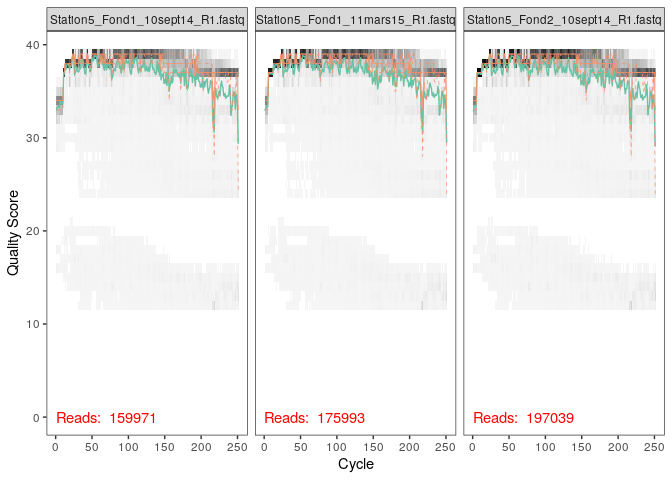<!-- --> Pour
les séquences reverse, la qualité décroit à partir de 150 nucléotides et
le Q score devient vraiment mauvais à partir de 200 nucléotides.

``` r
plotQualityProfile(fnRs[1:2])
```

<!-- -->

``` r
# Place filtered files in filtered/ subdirectory
filtFs <- file.path(path, "filtered", paste0(sample.names, "_F_filt.fastq.gz"))
filtRs <- file.path(path, "filtered", paste0(sample.names, "_R_filt.fastq.gz"))
names(filtFs) <- sample.names
names(filtRs) <- sample.names
sample.names
```

    ##  [1] "Station5_Fond1_10sept14_"    "Station5_Fond1_11mars15_"   
    ##  [3] "Station5_Fond2_10sept14_"    "Station5_Fond2_11mars15_"   
    ##  [5] "Station5_Fond3_10sept14_"    "Station5_Median1_10sept14_" 
    ##  [7] "Station5_Median2_10sept14_"  "Station5_Surface1_10sept14_"
    ##  [9] "Station5_Surface1_11mars15_" "Station5_Surface2_10sept14_"
    ## [11] "Station5_Surface2_11mars15_"

``` r
print(filtFs)
```

    ##                                                             Station5_Fond1_10sept14_ 
    ##    "~/ECOG2_CC2/sequences_reunies/filtered/Station5_Fond1_10sept14__F_filt.fastq.gz" 
    ##                                                             Station5_Fond1_11mars15_ 
    ##    "~/ECOG2_CC2/sequences_reunies/filtered/Station5_Fond1_11mars15__F_filt.fastq.gz" 
    ##                                                             Station5_Fond2_10sept14_ 
    ##    "~/ECOG2_CC2/sequences_reunies/filtered/Station5_Fond2_10sept14__F_filt.fastq.gz" 
    ##                                                             Station5_Fond2_11mars15_ 
    ##    "~/ECOG2_CC2/sequences_reunies/filtered/Station5_Fond2_11mars15__F_filt.fastq.gz" 
    ##                                                             Station5_Fond3_10sept14_ 
    ##    "~/ECOG2_CC2/sequences_reunies/filtered/Station5_Fond3_10sept14__F_filt.fastq.gz" 
    ##                                                           Station5_Median1_10sept14_ 
    ##  "~/ECOG2_CC2/sequences_reunies/filtered/Station5_Median1_10sept14__F_filt.fastq.gz" 
    ##                                                           Station5_Median2_10sept14_ 
    ##  "~/ECOG2_CC2/sequences_reunies/filtered/Station5_Median2_10sept14__F_filt.fastq.gz" 
    ##                                                          Station5_Surface1_10sept14_ 
    ## "~/ECOG2_CC2/sequences_reunies/filtered/Station5_Surface1_10sept14__F_filt.fastq.gz" 
    ##                                                          Station5_Surface1_11mars15_ 
    ## "~/ECOG2_CC2/sequences_reunies/filtered/Station5_Surface1_11mars15__F_filt.fastq.gz" 
    ##                                                          Station5_Surface2_10sept14_ 
    ## "~/ECOG2_CC2/sequences_reunies/filtered/Station5_Surface2_10sept14__F_filt.fastq.gz" 
    ##                                                          Station5_Surface2_11mars15_ 
    ## "~/ECOG2_CC2/sequences_reunies/filtered/Station5_Surface2_11mars15__F_filt.fastq.gz"

Nous coupons ici les séquences au niveau des nucléotides précédemment
énoncés. Nous choisissons de ne couper qu’à 200 nucléotides pour les
reverse pour garder un overlap assez important.

``` r
out<-filterAndTrim(fnFs, filtFs, fnRs, filtRs, truncLen=c(240,200),trimLeft=c(21),
              maxN=0, maxEE=c(2,2), truncQ=2, rm.phix=TRUE,
              compress=TRUE, multithread=TRUE) # On Windows set multithread=FALSE
```

``` r
head(out)
```

    ##                                    reads.in reads.out
    ## Station5_Fond1_10sept14_R1.fastq     159971    145448
    ## Station5_Fond1_11mars15_R1.fastq     175993    160423
    ## Station5_Fond2_10sept14_R1.fastq     197039    177018
    ## Station5_Fond2_11mars15_R1.fastq      87585     79989
    ## Station5_Fond3_10sept14_R1.fastq     117140    106150
    ## Station5_Median1_10sept14_R1.fastq   116519    106745

# Learn the Error Rates

Nous allons ici utiliser des lignes de commandes qui vont permettre
d’apprendre à la machine les différents profils d’erreurs générées
lors du séquençage. L’opération est faite sur les séquences reverse et
forward.

``` r
errF <- learnErrors(filtFs, multithread=TRUE)
```

    ## 105752691 total bases in 482889 reads from 3 samples will be used for learning the error rates.

``` r
errR <- learnErrors(filtRs, multithread=TRUE)
```

    ## 100755162 total bases in 562878 reads from 4 samples will be used for learning the error rates.

ici nous visualisons la probabilité d’obtenir une erreur de la machine
remplaçant une base par une autre (A→C, A→G, …) le taux d’erreur sont
indiqués pour chaque combinaison possible pour les séquences reverse et
forward. Chaque point représentent les taux d’erreur observés pour
chaque score de qualité du consensus. La ligne noire montre le taux
d’erreur estimés après convergence de l’algorithme d’apprentissage
machine et la ligne rouge montre le taux d’erreur attendus selon la
définition nominale du Q-score.

``` r
plotErrors(errF, nominalQ=TRUE)
```

    ## Warning: Transformation introduced infinite values in continuous y-axis
    
    ## Warning: Transformation introduced infinite values in continuous y-axis

<!-- -->

``` r
plotErrors(errR, nominalQ=TRUE)
```

    ## Warning: Transformation introduced infinite values in continuous y-axis
    
    ## Warning: Transformation introduced infinite values in continuous y-axis

<!-- --> \#
Sample Inference Ici nous créons une autre variable “dadaFs” dans
laquelle nous mettons les fichiers obtenus après avoir filtré et
appliqué le profil d’erreur à nos séquences. Nous allons faire la même
chose avec dadaRS.

``` r
dadaFs <- dada(filtFs, err=errF, multithread=TRUE)
```

    ## Sample 1 - 145448 reads in 37907 unique sequences.
    ## Sample 2 - 160423 reads in 35863 unique sequences.
    ## Sample 3 - 177018 reads in 47212 unique sequences.
    ## Sample 4 - 79989 reads in 20356 unique sequences.
    ## Sample 5 - 106150 reads in 30255 unique sequences.
    ## Sample 6 - 106745 reads in 28836 unique sequences.
    ## Sample 7 - 98823 reads in 25824 unique sequences.
    ## Sample 8 - 107427 reads in 26733 unique sequences.
    ## Sample 9 - 71082 reads in 17976 unique sequences.
    ## Sample 10 - 78645 reads in 20422 unique sequences.
    ## Sample 11 - 91534 reads in 24487 unique sequences.

``` r
dadaRs <- dada(filtRs, err=errR, multithread=TRUE)
```

    ## Sample 1 - 145448 reads in 45486 unique sequences.
    ## Sample 2 - 160423 reads in 41638 unique sequences.
    ## Sample 3 - 177018 reads in 55554 unique sequences.
    ## Sample 4 - 79989 reads in 23239 unique sequences.
    ## Sample 5 - 106150 reads in 34625 unique sequences.
    ## Sample 6 - 106745 reads in 31673 unique sequences.
    ## Sample 7 - 98823 reads in 29093 unique sequences.
    ## Sample 8 - 107427 reads in 28947 unique sequences.
    ## Sample 9 - 71082 reads in 21426 unique sequences.
    ## Sample 10 - 78645 reads in 22051 unique sequences.
    ## Sample 11 - 91534 reads in 28266 unique sequences.

Cette commande nous permet de visualiser le résultat global qu’on
retrouve classé dans la liste dadaFs. Ils nous indiquent que sur les
séquences on retrouve 1010 séquences qui correspondent aux vrais
variants, par rapport aux 37907 séquences.

``` r
dadaFs[[1]]
```

    ## dada-class: object describing DADA2 denoising results
    ## 1010 sequence variants were inferred from 37907 input unique sequences.
    ## Key parameters: OMEGA_A = 1e-40, OMEGA_C = 1e-40, BAND_SIZE = 16

# Merge paired reads

Ici nous voulons mettre en une seule séquence double brin les Forwards
et les Reverses. Nous pouvons faire cette opération grâce aux overlaps.
Cela se fait grâce à un alignement entre les forwards et les reverses
qui vont permettre de contruire les contigs.

``` r
mergers <- mergePairs(dadaFs, filtFs, dadaRs, filtRs, verbose=TRUE)
```

    ## 117318 paired-reads (in 5196 unique pairings) successfully merged out of 141000 (in 21451 pairings) input.

    ## 138940 paired-reads (in 4296 unique pairings) successfully merged out of 156462 (in 15709 pairings) input.

    ## 142188 paired-reads (in 6989 unique pairings) successfully merged out of 171439 (in 27056 pairings) input.

    ## 67622 paired-reads (in 2721 unique pairings) successfully merged out of 77764 (in 9556 pairings) input.

    ## 83613 paired-reads (in 3458 unique pairings) successfully merged out of 102224 (in 16304 pairings) input.

    ## 86212 paired-reads (in 3348 unique pairings) successfully merged out of 103447 (in 14293 pairings) input.

    ## 80661 paired-reads (in 2727 unique pairings) successfully merged out of 95866 (in 12350 pairings) input.

    ## 89385 paired-reads (in 3073 unique pairings) successfully merged out of 104354 (in 12135 pairings) input.

    ## 59716 paired-reads (in 1939 unique pairings) successfully merged out of 68711 (in 7974 pairings) input.

    ## 66157 paired-reads (in 1763 unique pairings) successfully merged out of 76701 (in 8283 pairings) input.

    ## 75048 paired-reads (in 3149 unique pairings) successfully merged out of 88514 (in 12054 pairings) input.

``` r
# Inspect the merger data.frame from the first sample
head(mergers[[1]])
```

    ##                                                                                                                                                                                                                                                                                                                                                                                sequence
    ## 1     TACGAAGGGACCTAGCGTAGTTCGGAATTACTGGGCTTAAAGAGTTCGTAGGTGGTTGAAAAAGTTAGTGGTGAAATCCCAGAGCTTAACTCTGGAACTGCCATTAAAACTTTTCAGCTAGAGTATGATAGAGGAAAGCAGAATTTCTAGTGTAGAGGTGAAATTCGTAGATATTAGAAAGAATACCAATTGCGAAGGCAGCTTTCTGGATCATTACTGACACTGAGGAACGAAAGCATGGGTAGCGAAGAGGATTAGATACCCTCGTAGTCCATGCCGTAAACGATGTGTGTTAGACGTTGGAAATTTATTTTCAGTGTCGCAGGGAAACCGATAAACACACCGCCTGGGGAGTACGACCGCAAGGTT
    ## 2     TACGAAGGGACCTAGCGTAGTTCGGAATTACTGGGCTTAAAGAGTTCGTAGGTGGTTGAAAAAGTTGGTGGTGAAATCCCAGAGCTTAACTCTGGAACTGCCATCAAAACTTTTCAGCTAGAGTATGATAGAGGAAAGCAGAATTTCTAGTGTAGAGGTGAAATTCGTAGATATTAGAAAGAATACCAATTGCGAAGGCAGCTTTCTGGATCATTACTGACACTGAGGAACGAAAGCATGGGTAGCGAAGAGGATTAGATACCCTCGTAGTCCATGCCGTAAACGATGTGTGTTAGACGTTGGAAATTTATTTTCAGTGTCGCAGCGAAAGCGATAAACACACCGCCTGGGGAGTACGACCGCAAGGTT
    ## 3     TACGAAGGGACCTAGCGTAGTTCGGAATTACTGGGCTTAAAGAGTTCGTAGGTGGTTGAAAAAGTTGGTGGTGAAATCCCAGAGCTTAACTCTGGAACTGCCATCAAAACTTTTCAGCTAGAGTTTGATAGAGGAAAGCAGAATTTCTAGTGTAGAGGTGAAATTCGTAGATATTAGAAAGAATACCAATTGCGAAGGCAGCTTTCTGGATCATTACTGACACTGAGGAACGAAAGCATGGGTAGCGAAGAGGATTAGATACCCTCGTAGTCCATGCCGTAAACGATGTGTGTTAGACGTTGGAAATTTATTTTCAGTGTCGCAGCGAAAGCGATAAACACACCGCCTGGGGAGTACGACCGCAAGGTT
    ## 4     TACGAAGGGACCTAGCGTAGTTCGGAATTACTGGGCTTAAAGAGTTCGTAGGTGGTTGAAAAAGTTAGTGGTGAAATCCCAGAGCTTAACTCTGGAACTGCCATTAAAACTTTTCAGCTAGAGTATGATAGAGGAAAGCAGAATTTCTAGTGTAGAGGTGAAATTCGTAGATATTAGAAAGAATACCAATTGCGAAGGCAGCTTTCTGGATCATTACTGACACTGAGGAACGAAAGCATGGGTAGCGAAGAGGATTAGATACCCTCGTAGTCCATGCCGTAAACGATGTGTGTTAGACGTTGGAAATTTATTTTCAGTGTCGCAGCGAAAGCGATAAACACACCGCCTGGGGAGTACGACCGCAAGGTT
    ## 5     TACGAAGGGACCTAGCGTAGTTCGGAATTACTGGGCTTAAAGAGTTCGTAGGTGGTTGAAAAAGTTGGTGGTGAAATCCCAGAGCTTAACTCTGGAACTGCCATCAAAACTTTTCAGCTAGAGTATGATAGAGGAAAGCAGAATTTCTAGTGTAGAGGTGAAATTCGTAGATATTAGAAAGAATACCAATTGCGAAGGCAGCTTTCTGGATCATTACTGACACTGAGGAACGAAAGCATGGGTAGCGAAGAGGATTAGATACCCTCGTAGTCCATGCCGTAAACGATGTGTGTTAGACGTTGGAAATTTATTTTCAGTGTCGCAGGGAAACCGATAAACACACCGCCTGGGGAGTACGACCGCAAGGTT
    ## 6 TACGAGGGGTCCTAGCGTTGTCCGGATTTACTGGGCGTAAAGGGTACGTAGGCGTTTTAATAAGTTGTATGTTAAATATCTTAGCTTAACTAAGAAAGTGCATACAAAACTGTTAAGATAGAGTTTGAGAGAGGAACGCAGAATTCATGGTGGAGCGGTGACATGCGTAGATATCATGAGGAAAGTCAAATGCGAAGGCAGCCTTCTGGCTCAAAACTGACGCTGAGGTACGAAAGCGTGGGGAGCGAACAGGATTAGATACCCTGGTAGTCCACGCCGTAAACGATGAGTATTTGGTGCTGGGGGATTCGACCCTTTCAGTGCCGTAGCTAACGCGATAAATACTCCGCCTGGGGACTACGATCGCAAGATT
    ##   abundance forward reverse nmatch nmismatch nindel prefer accept
    ## 1      5170       1       2     29         0      0      2   TRUE
    ## 2      4129       2       1     29         0      0      2   TRUE
    ## 3      3757       3       1     29         0      0      2   TRUE
    ## 4      2481       1       1     29         0      0      2   TRUE
    ## 5      2182       2       2     29         0      0      2   TRUE
    ## 6      2132       5       9     25         0      0      1   TRUE

# Construct sequence table

Nous allons construire une table des variations de séquence dans les
amplicons (ASV) qui permet une meilleure résolution que les tables OTUs
97%

``` r
seqtab <- makeSequenceTable(mergers)
dim(seqtab)
```

    ## [1]    11 19426

``` r
# Inspect distribution of sequence lengths
table(nchar(getSequences(seqtab)))
```

    ## 
    ##  352  353  362  363  364  365  366  367  368  369  370  371  372  373  374  375 
    ##    1    1    1    1    4  183   27  165  184 5608 3594 2312 2613 2738  126 1770 
    ##  376  377  378  382  386 
    ##   90    4    1    1    2

# Remove chimeras

Malgré qu’on ait pu appliquer les modèles d’erreurs aux séquences, il
reste des chimères. Ces chimères sont facilement reconnaissables par la
machine et peuvent etre réparées en y rajoutant les parties droites et
gauche des 2 séquences les plus abondantes.

``` r
seqtab.nochim <- removeBimeraDenovo(seqtab, method="consensus", multithread=TRUE, verbose=TRUE)
```

    ## Identified 17869 bimeras out of 19426 input sequences.

``` r
dim(seqtab.nochim)
```

    ## [1]   11 1557

Ici on peut voir qu’on à 22% de chimères dans notre jeu de donnée. Ce
chiffre important peut être dû à la qualité des séquences reverse qui
était assez moyenne sur la fin.

``` r
1-sum(seqtab.nochim)/sum(seqtab)
```

    ## [1] 0.2230846

# Track reads through the pipeline

Ce code nous permet de visualiser le nombre de séquences obtenues à la
suite de toutes nos manipulations de filtrage. Ici nous pouvons voir
qu’on a pu récupérer la plupart de nos séquences brutes, ce qui est
signe d’une bonne qualité de séquençage globale (malgré les 22% de
chimères).

``` r
getN <- function(x) sum(getUniques(x))
track <- cbind(out, sapply(dadaFs, getN), sapply(dadaRs, getN), sapply(mergers, getN), rowSums(seqtab.nochim))
# If processing a single sample, remove the sapply calls: e.g. replace sapply(dadaFs, getN) with getN(dadaFs)
colnames(track) <- c("input", "filtered", "denoisedF", "denoisedR", "merged", "nonchim")
rownames(track) <- sample.names
head(track)
```

    ##                             input filtered denoisedF denoisedR merged nonchim
    ## Station5_Fond1_10sept14_   159971   145448    142931    143292 117318   87962
    ## Station5_Fond1_11mars15_   175993   160423    158128    158473 138940  111552
    ## Station5_Fond2_10sept14_   197039   177018    173601    174591 142188  103668
    ## Station5_Fond2_11mars15_    87585    79989     78618     78926  67622   54711
    ## Station5_Fond3_10sept14_   117140   106150    103806    104338  83613   64259
    ## Station5_Median1_10sept14_ 116519   106745    104811    105173  86212   65559

# Assign taxonomy

Nous créons ainsi une variable qui va recevoir les espèces obtenues
grâce à Silva

``` r
taxa <- assignTaxonomy(seqtab.nochim, "/home/rstudio/ECOG2_CC2/silva_nr99_v138_train_set.fa.gz", multithread=TRUE)
```

``` r
taxa <- addSpecies(taxa, "/home/rstudio/ECOG2_CC2/silva_species_assignment_v138.fa.gz")
```

On remarque donc après avoir affiché la table qu’on a créée on obtient
une majorité de Alphaproteobacteries et plus précisément les bactéries
de la clade SAR11 (=Candidatus Pelagibacter ubique). En effet, cet ordre
de bactérie est l’ordre le plus représenté dans les océans : elle a une
répartition mondiale. Ce résultat est donc cohérent.

``` r
taxa.print <- taxa # Removing sequence rownames for display only
rownames(taxa.print) <- NULL
head(taxa.print)
```

    ##      Kingdom    Phylum             Class                 Order            
    ## [1,] "Bacteria" "Proteobacteria"   "Alphaproteobacteria" "SAR11 clade"    
    ## [2,] "Bacteria" "Cyanobacteria"    "Cyanobacteriia"      "Synechococcales"
    ## [3,] "Bacteria" "Proteobacteria"   "Alphaproteobacteria" "SAR11 clade"    
    ## [4,] "Bacteria" "Proteobacteria"   "Alphaproteobacteria" "SAR11 clade"    
    ## [5,] "Bacteria" "Proteobacteria"   "Alphaproteobacteria" "SAR11 clade"    
    ## [6,] "Bacteria" "Actinobacteriota" "Acidimicrobiia"      "Actinomarinales"
    ##      Family             Genus                     Species
    ## [1,] "Clade I"          "Clade Ia"                NA     
    ## [2,] "Cyanobiaceae"     "Synechococcus CC9902"    NA     
    ## [3,] "Clade I"          "Clade Ia"                NA     
    ## [4,] "Clade I"          "Clade Ia"                NA     
    ## [5,] "Clade II"         NA                        NA     
    ## [6,] "Actinomarinaceae" "Candidatus Actinomarina" NA

# Taxonomic Filtering

création des variables permettant d’organiser les 11 échantillons selon
la date et la profondeur.

``` r
samples.out <- rownames(seqtab.nochim)
profondeur <- sapply(strsplit(samples.out, "_"), `[`, 2)
profondeur <- (sapply(strsplit(samples.out, "_"), `[`, 3))
date <- substr(profondeur,1,11)
samdf <- data.frame(Profondeur=profondeur, Date=date)
samdf$Profondeur <- c("Fond","Fond","Fond","Fond","Fond", "Median","Median","Surface","Surface","Surface","Surface")
samdf$Date[samdf$Profondeur==11] <- c("mars","sept")
rownames(samdf) <- samples.out
```

Entre temps nous avons dû créer une table manuellement afin de
réorganiser les séquences, les informations de profondeurs et des dates
ne correspondant pas.

# création de l’arbre phyloseq

``` r
library(phangorn)
```

    ## Loading required package: ape

    ## 
    ## Attaching package: 'ape'

    ## The following objects are masked from 'package:igraph':
    ## 
    ##     edges, mst, ring

    ## 
    ## Attaching package: 'phangorn'

    ## The following object is masked from 'package:igraph':
    ## 
    ##     diversity

``` r
library(DECIPHER)
```

    ## Loading required package: Biostrings

    ## Loading required package: BiocGenerics

    ## Loading required package: parallel

    ## 
    ## Attaching package: 'BiocGenerics'

    ## The following objects are masked from 'package:parallel':
    ## 
    ##     clusterApply, clusterApplyLB, clusterCall, clusterEvalQ,
    ##     clusterExport, clusterMap, parApply, parCapply, parLapply,
    ##     parLapplyLB, parRapply, parSapply, parSapplyLB

    ## The following objects are masked from 'package:igraph':
    ## 
    ##     normalize, path, union

    ## The following object is masked from 'package:ade4':
    ## 
    ##     score

    ## The following objects are masked from 'package:dplyr':
    ## 
    ##     combine, intersect, setdiff, union

    ## The following objects are masked from 'package:stats':
    ## 
    ##     IQR, mad, sd, var, xtabs

    ## The following objects are masked from 'package:base':
    ## 
    ##     anyDuplicated, append, as.data.frame, basename, cbind, colnames,
    ##     dirname, do.call, duplicated, eval, evalq, Filter, Find, get, grep,
    ##     grepl, intersect, is.unsorted, lapply, Map, mapply, match, mget,
    ##     order, paste, pmax, pmax.int, pmin, pmin.int, Position, rank,
    ##     rbind, Reduce, rownames, sapply, setdiff, sort, table, tapply,
    ##     union, unique, unsplit, which.max, which.min

    ## Loading required package: S4Vectors

    ## Loading required package: stats4

    ## 
    ## Attaching package: 'S4Vectors'

    ## The following objects are masked from 'package:dplyr':
    ## 
    ##     first, rename

    ## The following object is masked from 'package:base':
    ## 
    ##     expand.grid

    ## Loading required package: IRanges

    ## 
    ## Attaching package: 'IRanges'

    ## The following objects are masked from 'package:dplyr':
    ## 
    ##     collapse, desc, slice

    ## The following object is masked from 'package:phyloseq':
    ## 
    ##     distance

    ## Loading required package: XVector

    ## 
    ## Attaching package: 'Biostrings'

    ## The following object is masked from 'package:ape':
    ## 
    ##     complement

    ## The following object is masked from 'package:base':
    ## 
    ##     strsplit

    ## Loading required package: RSQLite

``` r
seqs <- getSequences(seqtab.nochim)
names(seqs) <- seqs # This propagates to the tip labels of the tree
alignment <- AlignSeqs(DNAStringSet(seqs), anchor=NA,verbose=FALSE)
phangAlign <- phyDat(as(alignment, "matrix"), type="DNA")
dm <- dist.ml(phangAlign)
treeNJ <- NJ(dm) # Note, tip order != sequence order
fit = pml(treeNJ, data=phangAlign)
```

    ## negative edges length changed to 0!

``` r
fitGTR <- update(fit, k=4, inv=0.2)
fitGTR <- optim.pml(fitGTR, model="GTR", optInv=TRUE, optGamma=TRUE,
        rearrangement = "stochastic", control = pml.control(trace = 0))
detach("package:phangorn", unload=TRUE)
```

``` r
ps <- phyloseq(otu_table(seqtab.nochim, taxa_are_rows=FALSE), 
               sample_data(samdf), 
               tax_table(taxa), phy_tree(fitGTR$tree))
ps
```

    ## phyloseq-class experiment-level object
    ## otu_table()   OTU Table:         [ 1557 taxa and 11 samples ]
    ## sample_data() Sample Data:       [ 11 samples by 2 sample variables ]
    ## tax_table()   Taxonomy Table:    [ 1557 taxa by 7 taxonomic ranks ]
    ## phy_tree()    Phylogenetic Tree: [ 1557 tips and 1555 internal nodes ]

## Visualisation de l’alpha diversité

L’alpha diversité permet de mesurer la richesse observée. L’alpha
diversité peut se calculer de plusieurs façon grâce à différents
indices, ce qui nous permet de les comparer. Ici nous pouvons voir que
les communautés en mars, que ce soit pour les echantillons du fond et de
surface, possède un indice d’alpha diversité similaire : ils contiennent
une communauté de richesse semblables. Un indice avec une forte valeur
traduit la présence d’une communauté qui prend le dessus sur les autres
: nous savons donc qu’en mars, en surface et en profondeur, il y a des
communautés dominantes qui seront retrouvées en grand nombre, et des
communautés bien moins représentées. En revanche, pour les échantillons
prélevés en septembre, nous pouvons clairement distinguer des richesses
différentes entre les profondeurs différentes auxquelles les
échantillons ont été prélevés. Nous pouvons ainsi voir que les
echantillons prélevés profondémment ont un indice d’alpha diversité
élevé (et correspondant plus ou moins à celui retrouvé en Mars). Cela
traduit deux choses : en profondeur, nous pouvons retrouver une
structure communautaire stable car elle ne semble pas varier en fonction
des saisons (concernant la structure, ici nous ne pouvons pas dire si ce
sont les mêmes communautés qui dominent ou si elles changent en fonction
des saisons). Cependant il faudrait faire un prélevement au printemps et
en automne afin de s’assurer que cette hypothèse soit vraie. L’autre
hypothèse que nous pouvons tirer de cela est qu’en profondeur, il y a
surement moins de variation de température et de luminosité par rapport
à la surface et à la profondeur médiane. Cela expliquerait la stabilité
des structures communautaires en profondeur dû à la stabilité du milieu.
Le milieu médian n’a été étudié qu’en septembre. Cela ne nous permet pas
d’en avoir un aperçu au cours du temps. Néanmoins, ce milieu a un indice
alpha inférieur à celui du milieu profond, on peut voir que la
communauté à une structure un peu plus partagée entre les espèces par
rapport à celle de la profondeur. A la surface, nous pouvons voir un
indice bien plus faible par rapport aux autres milieu en septembre : les
communautés présentent sont plus équitablement réparties, il y a moins
de communautés minoritaires par rapport aux communautés majoritaires.
Ces dernières sont présentes mais dans une moins dre mesure par rapport
aux communautés profondes par exemple. En revanche, en mars, la
structure des communautés change et devient semblable à celle des
profondeurs, avec des OTUs qui vont devenir plus largement majoritaires
et d’autres qui seront plus minoritaires.

``` r
plot_richness(ps, x="Date", measures=c("Shannon", "Simpson"), color="Profondeur")
```

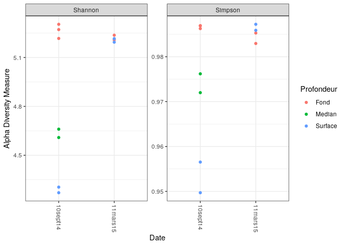<!-- --> Ces
lignes de codes nous permettent de compter le nombre d’echantillons
qu’on a pour chaque phylums.

``` r
# Show available ranks in the dataset
rank_names(taxa.print)
```

    ## [1] "Kingdom" "Phylum"  "Class"   "Order"   "Family"  "Genus"   "Species"

Sur la table affichée, nous pouvons compter 12 échantillons qui n’ont
pas de phyla defini. Cela peut etre dû à une mauvaise filtration : ce
serait des artefacts. On peut voir que les bactéries dominantes sont les
Proteobactéria, les Bacteroidota et des Cyanobactéria. Ces 3 grands
phylums contiennent bien des bactéries marines, ce qui est attendu. Nous
pouvons voir plusieurs phylums comportant moins de 10 représentants, ils
sont retirés. Cela peut être dû à des erreurs de taxonomie. Même si ce
n’est pas le cas, au vu du peu de représentants présents pour ces
phylums, nous pouvons les retirer car ils ne sont probablement pas très
représentatifs de la structure de ces communautés.

``` r
# Create table, number of features for each phyla
table(tax_table(ps)[, "Phylum"], exclude = NULL)
```

    ## 
    ##              Actinobacteriota                  Bacteroidota 
    ##                            22                           238 
    ##              Bdellovibrionota              Campilobacterota 
    ##                            35                             1 
    ##                   Chloroflexi                 Crenarchaeota 
    ##                            21                             6 
    ##                 Cyanobacteria                  Dadabacteria 
    ##                           142                             3 
    ##                  Dependentiae              Desulfobacterota 
    ##                             1                             8 
    ##               Elusimicrobiota                Fibrobacterota 
    ##                             1                             2 
    ##               Gemmatimonadota               Hydrogenedentes 
    ##                             7                             1 
    ##              Margulisbacteria Marinimicrobia (SAR406 clade) 
    ##                            23                            82 
    ##                   Myxococcota                         NB1-j 
    ##                             5                             2 
    ##                  Nitrospinota                       PAUC34f 
    ##                            20                             3 
    ##               Planctomycetota                Proteobacteria 
    ##                            32                           787 
    ##  SAR324 clade(Marine group B)              Thermoplasmatota 
    ##                            16                            18 
    ##             Verrucomicrobiota                          <NA> 
    ##                            71                            10

Ce code nous permet de nous assurer ques les séquences pour lesquelles
les anotations sont ambigues vont bien être retirées.

## Filtrage de la taxonomie

``` r
ps <- subset_taxa(ps, !is.na(Phylum) & !Phylum %in% c("", "uncharacterized"))
```

Ici nous allons mesurer la prévalence, qui sera dans le cadre de cette
étude le nombre d’echantillons par taxon

``` r
# Compute prevalence of each feature, store as data.frame
prevdf = apply(X = otu_table(ps),
               MARGIN = ifelse(taxa_are_rows(ps), yes = 1, no = 2),
               FUN = function(x){sum(x > 0)})
# Add taxonomy and total read counts to this data.frame
prevdf = data.frame(Prevalence = prevdf,
                    TotalAbundance = taxa_sums(ps),
                    tax_table(ps))
```

Cette commande nous permet d’evaluer la prévalence moyenne de chaque
phylum (colonne1) et la prévalence totale (colonne2). Cela nous permet
de confirmer les résultats du dessus et de pouvoir éliminer les phylums
peu importants.

``` r
plyr::ddply(prevdf, "Phylum", function(df1){cbind(mean(df1$Prevalence),sum(df1$Prevalence))})
```

    ##                           Phylum        1    2
    ## 1               Actinobacteriota 3.727273   82
    ## 2                   Bacteroidota 3.978992  947
    ## 3               Bdellovibrionota 2.342857   82
    ## 4               Campilobacterota 2.000000    2
    ## 5                    Chloroflexi 4.238095   89
    ## 6                  Crenarchaeota 4.500000   27
    ## 7                  Cyanobacteria 3.204225  455
    ## 8                   Dadabacteria 4.666667   14
    ## 9                   Dependentiae 1.000000    1
    ## 10              Desulfobacterota 2.000000   16
    ## 11               Elusimicrobiota 1.000000    1
    ## 12                Fibrobacterota 2.500000    5
    ## 13               Gemmatimonadota 2.428571   17
    ## 14               Hydrogenedentes 1.000000    1
    ## 15              Margulisbacteria 1.826087   42
    ## 16 Marinimicrobia (SAR406 clade) 4.414634  362
    ## 17                   Myxococcota 2.400000   12
    ## 18                         NB1-j 1.500000    3
    ## 19                  Nitrospinota 3.950000   79
    ## 20                       PAUC34f 3.333333   10
    ## 21               Planctomycetota 3.437500  110
    ## 22                Proteobacteria 4.292249 3378
    ## 23  SAR324 clade(Marine group B) 4.687500   75
    ## 24              Thermoplasmatota 2.722222   49
    ## 25             Verrucomicrobiota 3.788732  269

Le code permettant de retirer ces taxons est ci-dessous.

``` r
# Define phyla to filter
filterPhyla = c("Campilobacterota", "Dependentiae", " Crenarchaeota","Desulfobacterota", "Dadabacteria ", "Fibrobacterota", " Hydrogenedentes", "NB1-j", " PAUC34f", " Elusimicrobiota", "Gemmatimonadota", "Myxococcota")
# Filter entries with unidentified Phylum.
ps1 = subset_taxa(ps, !Phylum %in% filterPhyla)
ps1
```

    ## phyloseq-class experiment-level object
    ## otu_table()   OTU Table:         [ 1521 taxa and 11 samples ]
    ## sample_data() Sample Data:       [ 11 samples by 2 sample variables ]
    ## tax_table()   Taxonomy Table:    [ 1521 taxa by 7 taxonomic ranks ]
    ## phy_tree()    Phylogenetic Tree: [ 1521 tips and 1519 internal nodes ]

# Prevalence Filtering

Ces manipulations nous permettent de voir si nous avons manqué de voir
des echantillons mal definis ou en tres faible quantité qui devraient
etre retirés. On va aussi pouvoir avoir un aperçu des séquences qui sont
rangées dans chaque features. Ici; chaque point représente un taxa. Nous
ne voyons pas de seuil de prévalence clairement établi ici. Nous avons
donc des taxons assez stables. Néanmoins nous pouvons fixer manuelle le
seuil de prévalence quelque part entre 0 et 10% (en verifiant qu’il n’y
a pas d’impact non attendu sur la suite de l’étude)

Sans surprise, les phylums les plus représentés sont ceux qui ont le
plus de prévalence.

``` r
# Subset to the remaining phyla
prevdf1 = subset(prevdf, Phylum %in% get_taxa_unique(ps1, "Phylum"))
ggplot(prevdf1, aes(TotalAbundance, Prevalence / nsamples(ps),color=Phylum)) +
  # Include a guess for parameter
  geom_hline(yintercept = 0.05, alpha = 0.5, linetype = 2) +  geom_point(size = 2, alpha = 0.7) +
  scale_x_log10() +  xlab("Total Abundance") + ylab("Prevalence [Frac. Samples]") +
  facet_wrap(~Phylum) + theme(legend.position="none")
```

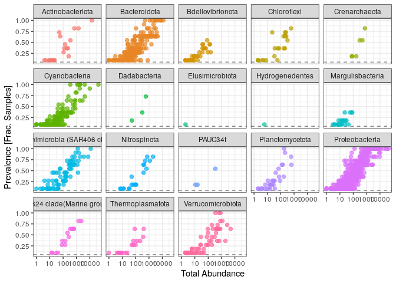<!-- --> on va
donc fixer un seuil de prévalence de 5%, c’est-à- dire que nous allons
retirer toutes les valeurs de prévalence inferieures à 95%.

``` r
# Define prevalence threshold as 5% of total samples
prevalenceThreshold = 0.05 * nsamples(ps)
prevalenceThreshold
```

    ## [1] 0.55

C’est grâce à la fonction prune\_taxa qu’on va pouvoir retirer les ASVs
qui ne respectent pas le seuil de prévalence

``` r
# Execute prevalence filter, using `prune_taxa()` function
keepTaxa = rownames(prevdf1)[(prevdf1$Prevalence >= prevalenceThreshold)]
ps2 = prune_taxa(keepTaxa, ps)
```

# Agglomerate taxa

on sait que les communautés microbiennes sont souvent composées de
taxons qui partagent des caractéristiques communes. On va donc chercher
à mettre ensemble les taxons qui sont très proches les uns de autres.
Pour cela, l’aggregation taxonomique est pratique. Elle est facile, et
on peut comparer les taxons grâce à des arbres simples à rangs. Pour le
generer on va pouvoir utiliser phyloseq. La première chose qui sera
faite sera d’agglomerer ensemble les échantillons du même genre.

``` r
# How many genera would be present after filtering?
length(get_taxa_unique(ps2, taxonomic.rank = "Genus"))
```

    ## [1] 103

tax\_glom est une fonction qui permet de rassembler les espèces ayant
une taxonomie proche. On va donc mettre ces séquences là dans l’objet
“ps3” qui va nous servir pour la construction de l’arbre.

``` r
ps3 = tax_glom(ps2, "Genus", NArm = TRUE)
```

Tip\_glom est une fonction analogue à tax\_glom. Il nous permet de
séparer les distances cophenetiques inférieures à une valeur h. La
distance cophenetique est la distance entre deux objets dans l’arbre
dont les branches comprennent deux objets réduits en une branche. On va
donc créer un objet ps4 qui portera cette caractéristique.

``` r
h1 = 0.4
ps4 = tip_glom(ps2, h = h1)
```

ici phyloseq va comparer les datas originales par rapport à l’arbre
obtenu après agglomeration taxonomiques et enfin à l’arbre après les
agglomerations phylogéniques. Grâce à la fonction gridExtra, nous
pourrons ainsi générer ces 3 objets en un.

``` r
multiPlotTitleTextSize = 15
p2tree = plot_tree(ps2, method = "treeonly",
                   ladderize = "left",
                   title = "Before Agglomeration") +
  theme(plot.title = element_text(size = multiPlotTitleTextSize))
p3tree = plot_tree(ps3, method = "treeonly",
                   ladderize = "left", title = "By Genus") +
  theme(plot.title = element_text(size = multiPlotTitleTextSize))
p4tree = plot_tree(ps4, method = "treeonly",
                   ladderize = "left", title = "By Height") +
  theme(plot.title = element_text(size = multiPlotTitleTextSize))
library (gridExtra)
```

    ## 
    ## Attaching package: 'gridExtra'

    ## The following object is masked from 'package:BiocGenerics':
    ## 
    ##     combine

    ## The following object is masked from 'package:dplyr':
    ## 
    ##     combine

``` r
gridExtra::grid.arrange
```

    ## function (..., newpage = TRUE) 
    ## {
    ##     if (newpage) 
    ##         grid.newpage()
    ##     g <- arrangeGrob(...)
    ##     grid.draw(g)
    ##     invisible(g)
    ## }
    ## <bytecode: 0x55ffe4b2ff98>
    ## <environment: namespace:gridExtra>

Sur la gauche nous retrouvons l’arbre original, au milieu l’arbre généré
par agglomération taxonomique et à droit l’arbre généré par aggrégation
phylogénique. On peut voir que les deux agglomérations nous permettent
de clarifier les arbres. De plus, les arbres obtenus avec les deux types
d’agglomération sont assez ressemblants.

``` r
# group plots together
grid.arrange(nrow = 1, p2tree, p3tree, p4tree)
```

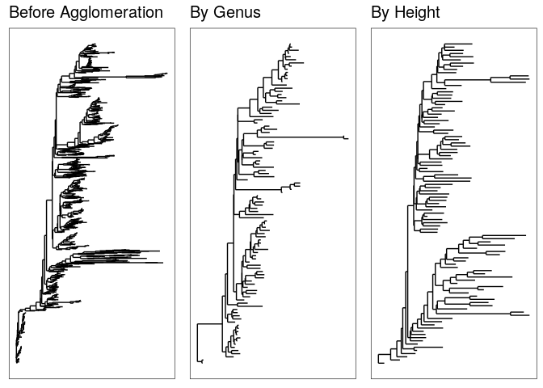<!-- --> \#
Abundance value transformation : profondeur on peut avoir besoin de
transformer nos données pour pouvoir calculer des variances. On va
d’abord utiliser la fonction “plot\_abundance” pour definir un
graphique d’abondance relative. Cela va nous permettre de comparer
facilement les différentes échelles et les distributions d’abondance
avant de les transformer. Ici nous allons choisir d’observer l’abondance
des bactéries du phylum “Bdellovironota” en fonction de la profondeur.
Ce phylum est interessant car il est assez présent mais non majoritaire,
ce qui nous permettra de voir si il va vraiment varier en fonction des
prélevements, alors que les phylums très représentés seront surement
assez stables.

``` r
plot_abundance_P = function(physeq,title = "",
                          Facet = "Order", Color = "Phylum"){
  # Arbitrary subset, based on Phylum, for plotting
  p1f = subset_taxa(physeq, Phylum %in% c("Bdellovibrionota"))
  mphyseq = psmelt(p1f)
  mphyseq <- subset(mphyseq, Abundance > 0)
  ggplot(data = mphyseq, mapping = aes_string(x = "Profondeur",y = "Abundance",
                              color = Color, fill = Color)) +
    geom_violin(fill = NA) +
    geom_point(size = 1, alpha = 0.3,
               position = position_jitter(width = 0.3)) +
    facet_wrap(facets = Facet) + scale_y_log10()+
    theme(legend.position="none")
}
```

la fonction “transform\_sample\_counts” pour transformer les
dénombrements en leur fréquence par rapport à leurs abondances
relatives.

``` r
# Transform to relative abundance. Save as new object.
ps3ra_P = transform_sample_counts(ps3, function(x){x / sum(x)})
```

On va donc pouvoir tracer le graphique des valeurs d’abondances avant et
après transformation. On peut voir qu’après les transformations, les
valeurs d’abondances relatives sont mieux réparties et permettent une
lecture plus aisées des différents paramètres. Nous pouvons voir ici que
c’est la famille des Bdellovibrionales qui est plus abondante par
rapport aux bacteriovoracales. Nous allons donc les isoler aux codes
suivant pour mieux les étudier.

``` r
plotBefore_P= plot_abundance_P(ps3,"")
plotAfter_P = plot_abundance_P(ps3ra_P,"")
# Combine each plot into one graphic.
grid.arrange(nrow = 1,  plotBefore_P, plotAfter_P)
```

    ## Warning in max(data$density): no non-missing arguments to max; returning -Inf

    ## Warning: Computation failed in `stat_ydensity()`:
    ## replacement has 1 row, data has 0

    ## Warning in max(data$density): no non-missing arguments to max; returning -Inf

    ## Warning: Computation failed in `stat_ydensity()`:
    ## replacement has 1 row, data has 0

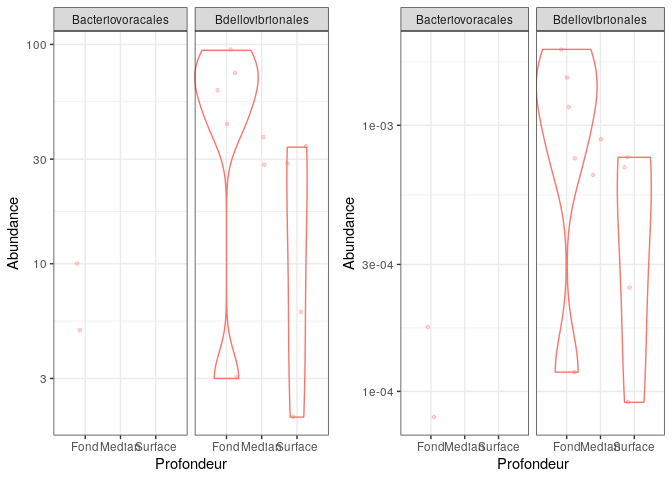<!-- -->

Ici nous avons voulu analyser l’ordre des Bdellovibrio, dont fait partie
la clade OM27. Lorsqu’on regarde les graphiques, on remarque les
abondances relatives en fonction de la profondeur comme expliqué
precemment. Ici nous pouvons voir qu’en profondeur, cette clade à une
abondance supérieur à par rapport aux autres, et cette abondance décline
au fur et à mesure qu’on remonte à la surface.

``` r
psOrd_P = subset_taxa(ps3ra_P, Order == "Bdellovibrionales")
```

    ## Warning in prune_taxa(taxa, phy_tree(x)): prune_taxa attempted to reduce tree to 1 or fewer tips.
    ##  tree replaced with NULL.

``` r
plot_abundance_P(psOrd_P, Facet = "Genus", Color = NULL)
```

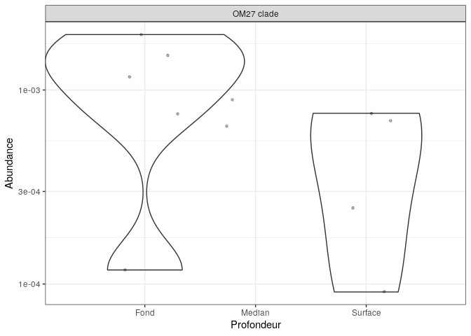<!-- --> \#
Abundance value transformation : date on peut avoir besoin de
transformer nos données pour pouvoir calculer des variances. On va
d’abord utiliser la fonction “plot\_abundance” pour definir un
graphique d’abondance relative. Cela va nous permettre de comparer
facilement les différentes échelles et les distributions d’abondance
avant de les transformer. Ici nous nous intéressons donc à la variance
en fonction de la date pour compléter les analyses faites en profondeur.

``` r
plot_abundance_D = function(physeq,title = "",
                          Facet = "Order", Color = "Phylum"){
  # Arbitrary subset, based on Phylum, for plotting
  p1f = subset_taxa(physeq, Phylum %in% c("Bdellovibrionota"))
  mphyseq = psmelt(p1f)
  mphyseq <- subset(mphyseq, Abundance > 0)
  ggplot(data = mphyseq, mapping = aes_string(x = "Date",y = "Abundance",
                              color = Color, fill = Color)) +
    geom_violin(fill = NA) +
    geom_point(size = 1, alpha = 0.3,
               position = position_jitter(width = 0.3)) +
    facet_wrap(facets = Facet) + scale_y_log10()+
    theme(legend.position="none")
}
```

la fonction “transform\_sample\_counts” pour transformer les
dénombrements en leur fréquence par rapport à leurs abondances
relatives.

``` r
# Transform to relative abundance. Save as new object.
ps3ra_D = transform_sample_counts(ps3, function(x){x / sum(x)})
```

On va donc pouvoir tracer le graphique des valeurs d’abondances avant et
après transformation. On peut voir qu’après les transformations, les
valeurs d’abondances relatives sont mieux réparties et permettent une
lecture plus aisées des différents paramètres.

``` r
plotBefore_D= plot_abundance_D(ps3,"")
plotAfter_D = plot_abundance_D(ps3ra_D,"")
# Combine each plot into one graphic.
grid.arrange(nrow = 1,  plotBefore_D, plotAfter_D)
```

    ## Warning in max(data$density): no non-missing arguments to max; returning -Inf

    ## Warning: Computation failed in `stat_ydensity()`:
    ## replacement has 1 row, data has 0

    ## Warning in max(data$density): no non-missing arguments to max; returning -Inf

    ## Warning: Computation failed in `stat_ydensity()`:
    ## replacement has 1 row, data has 0

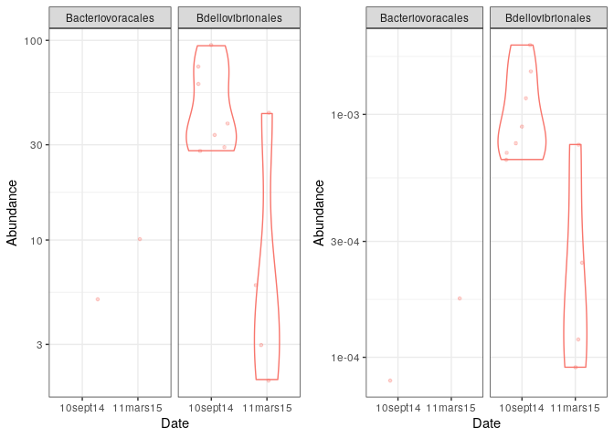<!-- --> En
regardant cette analyse, nous pouvons voirqu’il y a une différence
d’abondance notable pour la clade OM27 par rapport à la date de
prélevement. Ces bactéries sont très abondantes au sein des
échantillons prélevés en septembre, tandis qu’ils sont moins présents
(un facteur 10 en moins) en mars. Nous pouvons donc voir, au vu des
analyses par date et par profondeur, que les bactéries appartenant à
cette clade seront plutôt retrouvées en grande quantité en profondeur en
sortie d’été où l’eau est surement un peu plus chaude, par rapport à
mars. Selon un article intitulé “Diverse, uncultivated bacteria and
archaea underlying the cycling of dissolved protein in the ocean” par
William D Orsi et al., les bactéries de la clade OM27 sont proches des
bdellovibrios ce qui est logique par rapport à nos codes, et sont des
bactéries très présentes dans les océans. Ce sont des bactéries qui
n’ont pas encore été cultivées, et seraient probablement des bactéries
prédatrices, influant sur la présence des protéines dissoutes dans
l’océan. Cette caractéristique peut peut être nous aider à comprendre
sa distribution : En hiver, la nourriture se fait peut-être plus rare,
alors qu’en été l’eau est plus riche en nutriments et en proies
potentielles pour OM27, ce qui permet de mieux se developper. Sa
présence dans les pronfondeurs pourrait être expliquée par la
température et l’oxygénation de l’eau qui serait plus adéquate pour
l’organisme. Nous pouvons aussi supposer que la surface et le milieu
médian contiennent également des prédateurs, qui rentreraient en
compétition avec OM27, ce qui l’inciterait à plutôt se developper en
profondeur.

``` r
psOrd_D = subset_taxa(ps3ra_D, Order == "Bdellovibrionales")
```

    ## Warning in prune_taxa(taxa, phy_tree(x)): prune_taxa attempted to reduce tree to 1 or fewer tips.
    ##  tree replaced with NULL.

``` r
plot_abundance_D(psOrd_D, Facet = "Genus", Color = NULL)
```

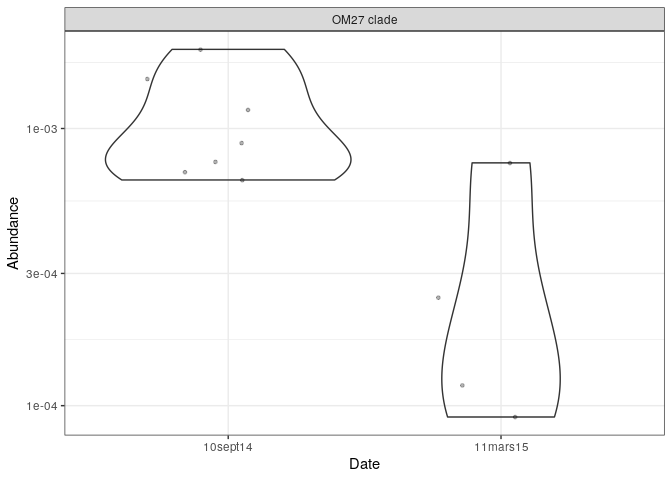<!-- -->

# Different Ordination Projections

Nous allons demander à la machine de nous calculer une analyse par PcoA
en utilisant l’indice de dissimilarité de Bray-Curtis. Ici nous allons
donc pouvoir regrouper ensemble les échantillons les plus proches et les
différencier des échantillons vraiment différents.

``` r
ps <- prune_samples(rowSums(otu_table(ps)) > 1000, ps)
pslog <- transform_sample_counts(ps, function(x) log(1 + x))
```

On peut donc voir que tous les échantillons de mars sont regroupés
ensemble, sans distinction entre la surface et la profondeur. Cela
correspond avec ce qui était attendu au vu de l’analyse de l’alpha
diversité. En septembre nous pouvons voir que cette fois ci les
echantillons sont séparés en fonction de la profondeur à laquelle ils
ont été prélevés. Cela correspond aussi avec ce que nous avons vu lors
de l’analyse de l’alpha diversité : les échantillons de surface sont
regroupés ensemble, idem pour le milieu médian et profond.

``` r
out.pcoa.log <- ordinate(pslog,  method = "MDS", distance = "bray")
evals <- out.pcoa.log$values[,1]
plot_ordination(pslog, out.pcoa.log, color = "Date",
                  shape = "Profondeur") +
  labs(col = "Date", shape = "Pronfondeur")+
  coord_fixed(sqrt(evals[2] / evals[1]))
```

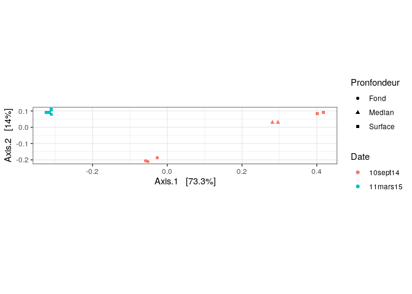<!-- --> \#
Double principal coordinates analysis (DPCoA) Nous vons voulu voir si
cette tendance etait conservée lors d’une DPCoA. Cela nous permet de
souligner les distances entre les echantillons en utilisant une table
d’abondance et les données phylogénétiques. Cela permet de renforcer
les différences trouvées entre les échantillons. Ici nous pouvons donc
voir la même chose que pour la PCoA. Les échantillons fond/surface
restent bien mélangés en mars. Cela nous montre que les communautés
varient assez peu comme nous avons pu supposer. En revanche en septembre
les communautés restent bien séparées en fonction des profondeurs.

``` r
out.dpcoa.log <- ordinate(pslog, method = "DPCoA")
evals <- out.dpcoa.log$eig
plot_ordination(pslog, out.dpcoa.log, color = "Date",
                  shape = "Profondeur") +
  labs(col = "Date", shape = "Profondeur")+
  coord_fixed(sqrt(evals[2] / evals[1]))
```

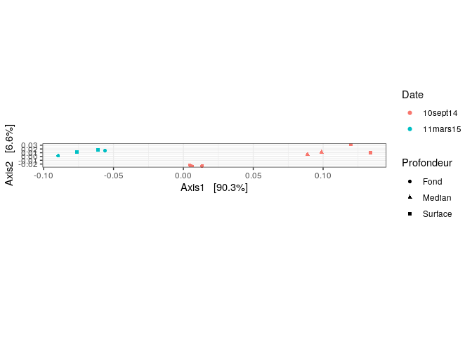<!-- --> Ici
nous avons voulu faire une ordination permettant de voir la
dissimilarité entre les phylums. Nous pouvons voir se distinguer 4
grands phylums qui se trouvent à part : les cyanobactéries,les
bdellvibrios/Bacteroidota, les marinimicrobia et les protéobatéria. Les
autres phylums sont confondus. Ces 5 phylums seront donc sûrement les
phylums clef pour expliquer les répartitions de communauté, car ils sont
assez dissimilaires entre eux pour être correctement distinguables.

``` r
plot_ordination(pslog, out.dpcoa.log, type = "species", color = "Phylum") +
  coord_fixed(sqrt(evals[6] / evals[10]))
```

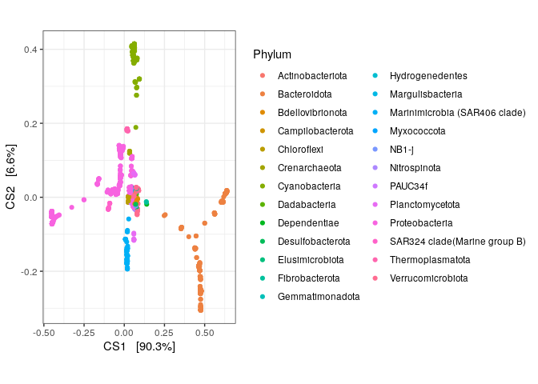<!-- -->
